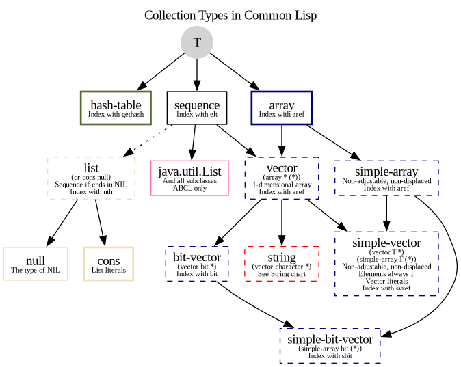

ここでは、よく使われるデータ構造について明快なリファレンスを示すことを目指します。
言語を本当に学ぶには、時間を取って他の資料も読むべきです。私たちが参考にした
以下の資料には、さらに多くの詳細があります。

- Peter Seibel による [Practical CL](http://gigamonkeys.com/book/they-called-it-lisp-for-a-reason-list-processing.html)
- E. Weitz による [CL Recipes](http://weitz.de/cl-recipes/)。説明とヒントが豊富です。
- [CL standard](https://franz.com/support/documentation/cl-ansi-standard-draft-w-sidebar.pdf)
  には、PDF リーダーのサイドバーに見やすい目次があり、関数リファレンス、詳細な説明、
  さらに多くの例と注意事項、つまりほとんどすべてが含まれています。
  [PDF mirror](https://gitlab.com/vancan1ty/clstandard_build/-/blob/master/cl-ansi-standard-draft-w-sidebar.pdf)
- [Common Lisp quick reference](http://clqr.boundp.org/)

付録も見逃さないでください。さらに多くのデータ構造が必要な場合は、
[awesome-cl](https://github.com/CodyReichert/awesome-cl#data-structures)
のリストと [Quickdocs](https://quickdocs.org/-/search?q=data%20structure) を見てください。

## リスト

リストを作成する最も単純な方法は `list` を使うことです。

~~~lisp
(list 1 2 3)
~~~

ただし、他にもコンストラクタがあります。また、リストは `cons` セルからできていることも
知っておくべきです。


### リストの構築。Cons セル、リスト。

_リストはシーケンスでもあるため、後述の関数を使えます。_

リストの基本要素は cons セルです。cons セルを組み合わせてリストを構築します。

~~~lisp
(cons 1 2)
;; => (1 . 2) ;; ドットを使った表現、ドット対。
~~~

これは次のようになります。

```
[o|o]--- 2
 |
 1
```

最初のセルの `cdr` が別の cons セルで、その最後の `cdr` が `nil` なら、
リストを構築したことになります。

~~~lisp
(cons 1 (cons 2 nil))
;; => (1 2)
~~~

これは次のようになります。

```
[o|o]---[o|/]
 |       |
 1       2
```
（ASCII アートは [draw-cons-tree](https://github.com/cbaggers/draw-cons-tree) によるものです）。

表現がドット対ではないことに注目してください。Lisp のプリンタはこの慣習を理解します。

最後に、`list` で単純にリテラルリストを構築できます。

~~~lisp
(list 1 2)
;; => (1 2)
~~~

または quote を呼び出します。

~~~lisp
'(1 2)
;; => (1 2)
~~~

これは関数呼び出し `(quote (1 2))` の短縮表記です。

### 循環リスト

cons セルの car や cdr は、同じリスト内の自分自身や他のセルを含む、
他のオブジェクトを参照できます。そのため、循環リストのような自己参照構造を
定義するために使えます。

循環リストを扱う前に、プリンタがそれを認識し、リスト全体を印字しようとしないように、
[\*print-circle\*](http://clhs.lisp.se/Body/v_pr_cir.htm)
を `T` に設定します。

~~~lisp
(setf *print-circle* t)
~~~

最後の `cdr` がリストの先頭を指すようにリストを変更する関数は次のようになります。

~~~lisp
(defun circular! (items)
  "リスト ITEMS の最後の cdr を変更し、循環リストを返す"
  (setf (cdr (last items)) items))

(circular! (list 1 2 3))
;; => #1=(1 2 3 . #1#)

(fifth (circular! (list 1 2 3)))
;; => 2
~~~

[list-length](http://www.lispworks.com/documentation/HyperSpec/Body/f_list_l.htm#list-length)
関数は循環リストを認識し、`nil` を返します。

リーダも
[Sharpsign Equal-Sign](http://www.lispworks.com/documentation/HyperSpec/Body/02_dho.htm)
記法を使って循環リストを作成できます。リストのようなオブジェクトには `#n=` という
接頭辞を付けられます。ここで `n` は符号なし 10 進整数（1 桁以上）です。
ラベル `#n#` は、式の後の部分でそのオブジェクトを参照するために使えます。

~~~lisp
'#42=(1 2 3 . #42#)
;; => #1=(1 2 3 . #1#)
~~~

リーダに与えたラベル（`n=42`）は読み込み後に破棄され、プリンタが新しいラベル
（`n=1`）を定義することに注意してください。

参考資料

* [Let over Lambda](https://letoverlambda.com/index.cl/guest/chap4.html#sec_5) の循環式に関する節


### car/cdr または first/rest（second... tenth まで）

~~~lisp
(car (cons 1 2)) ;; => 1
(cdr (cons 1 2)) ;; => 2
(first (cons 1 2)) ;; => 1
(first '(1 2 3)) ;; => 1
(rest '(1 2 3)) ;; => (2 3)
~~~

`setf` を使うと、*任意の* 新しい値を代入できます。

### last, butlast, nbutlast (&optional n)

リスト内の最後の cons セル（または末尾から n 番目の cons セル）を返します。

~~~lisp
(last '(1 2 3))
;; => (3)
(car (last '(1 2 3)) ) ;; または (first (last …))
;; => 3
(butlast '(1 2 3))
;; => (1 2)
~~~

[Alexandria](https://common-lisp.net/project/alexandria/draft/alexandria.html#Conses) では、
`lastcar` は `(first (last …))` と等価です。

~~~lisp
(alexandria:lastcar '(1 2 3))
;; => 3
~~~


### reverse, nreverse

`reverse` と `nreverse` は新しいシーケンスを返します。

`nreverse` は破壊的です。N は **non-consing** を意味し、新しい cons セルを
割り当てる必要がないという意味です。元のシーケンスを再利用して変更する
*可能性があります*（実際にはそうします）。

~~~lisp
(defparameter mylist '(1 2 3))
;; => (1 2 3)
(reverse mylist)
;; => (3 2 1)
mylist
;; => (1 2 3)
(nreverse mylist)
;; => (3 2 1)
mylist
;; => (1) SBCL ではこうなるが、実装依存。
~~~


### append, nconc（および revappend, nreconc）

`append` は任意個数のリスト引数を取り、すべての引数の要素を含む新しいリストを返します。

~~~lisp
(append (list 1 2) (list 3 4))
;; => (1 2 3 4)
~~~

新しいリストは `(3 4)` と一部の cons セルを共有します。


`nconc` は再利用版に相当します。

`revappend` と `nreconc` は、あまり頻繁には使わないかもしれない 2 つの関数です :)

`revappend` は `(append (reverse x) y)` を行います。

~~~lisp
(revappend (list 1 2 3) (list :a :b :c))
;; => (3 2 1 :A :B :C)
~~~

`nreconc` は `(nconc (nreverse x) Y)` を行います。

~~~lisp
(nreconc (list 1 2 3) (list :a :b :c))
;; => (3 2 1 :A :B :C)
~~~

後でありがたみが分かるでしょう。


### push, pushnew (item, place)

`push` は *place* に格納されているリストの先頭に *item* を追加し、結果のリストを
*place* に格納して、そのリストを返します。

`pushnew` も似ていますが、その要素がすでに place に存在する場合は何もしません。

対象のリストを変更しない `adjoin` についても後述します。

~~~lisp
(defparameter mylist '(1 2 3))
(push 0 mylist)
;; => (0 1 2 3)
~~~

~~~lisp
(defparameter x ’(a (b c) d))
;; => (A (B C) D)
(push 5 (cadr x))
;; => (5 B C)
x
;; => (A (5 B C) D)
~~~

`push` は `(setf place (cons item place ))` と等価ですが、*place* の部分式が
一度だけ評価され、*item* が *place* より先に評価される点が異なります。

**リストの末尾に追加する** 組み込み関数はありません。これはよりコストの高い操作です
（リスト全体を走査する必要があります）。これが必要なら、別のデータ構造の利用を検討するか、
必要なときに単にリストを `reverse` してください。

`pushnew` はキーワード引数 `:key`、`:test`、`:test-not` を受け取ります。


### pop

破壊的な操作です。

### nthcdr (index, list)

`first`、`second`、そして `tenth` まででは足りない場合に使います。

### car/cdr と合成形（cadr、caadr…） - リスト内のリストへのアクセス

他のリストを含むリストに適用すると意味があります。

~~~lisp
(caar (list 1 2 3))                  ==> error
(caar (list (list 1 2) 3))           ==> 1
(cadr (list (list 1 2) (list 3 4)))  ==> (3 4)
(caadr (list (list 1 2) (list 3 4))) ==> 3
~~~

### destructuring-bind (parameter*, list): パターンマッチング

このマクロはリストに対して単純なパターンマッチングを行います。

パラメータ宣言に基づいて、入力リストから取り出した値を各パラメータに束縛します。

固定個数または可変個数の要素を持つリストやネストしたリストを分配束縛できます。
存在しない要素にデフォルト値を与えたり、`defun` や `defmacro` でおなじみの
ラムダリストキーワード `&key`、`&rest`、`&allow-other-keys` などを使って
プロパティリストのキーにマッチさせたりできます。

例:

~~~lisp
(destructuring-bind (x y z)
    (list 1 2 3)
  (format t "x= ~s, y= ~s, z= ~s" x y z))
;; x= 1, y= 2, z= 3
~~~

この例では正確に `(x y z)` にマッチさせたいので、対象のリストは x、y、z を
提供しなければなりません。

以下では `z` の存在を省略可能にします。これで 2 要素のリストにも 3 要素のリストにも
マッチできます。

~~~lisp
(destructuring-bind (x y &optional z)
    (list 1 2)
  (format t "x= ~s, y= ~s, z=~s" x y z))
;; x= 1, y= 2, z=NIL
~~~

しかし、可変個数の引数を持つリストにマッチさせたい場合、これは動作しません。

~~~lisp
;; 動作しない:
(destructuring-bind (x y &optional z)
    (list 1 2 3 4 5)
  (format t "x= ~s, y= ~s, z=~s" x y z))
~~~

次のエラーになります。

```
Error while parsing arguments to DESTRUCTURING-BIND:
  too many elements in
    (1 2 3 4 5)
  to satisfy lambda list
    (X Y &OPTIONAL Z):
  between 1 and 3 expected, but got 5
```

`&rest` を使うと、可変個数の要素を `z` に束縛できます。これで `z` はリストに束縛されます。

~~~lisp
(destructuring-bind (x y &rest z)
    (list 1 2 3 4 5)
  (format t "x= ~s, y= ~s, z=~s" x y z))
;; x= 1, y= 2, z=(3 4 5)
~~~

`&whole` パラメータはリスト全体に束縛されます。これは最初に置く必要があり、
その後に他のパラメータを続けられます。

~~~lisp
(destructuring-bind (&whole whole-list x y &optional z)
    (list 1 2 3)
  (format t "x= ~s, y= ~s, z=~s, whole list: ~s" x y z whole-list))
;; x= 1, y= 2, z=3, whole list: (1 2 3)
~~~


サブリストの内部にもマッチできます。

~~~lisp
(destructuring-bind (x (y1 y2) z)
    (list 1 (list 2 20) 3)
  (list :x x :y1 y1 :y2 y2 :z z))
;; => (:X 1 :Y1 2 :Y2 20 :Z 3)
~~~


もう 1 つ便利な機能は、キーワードと値が交互に並ぶリストである plist の分配束縛です。
どのキーにマッチさせるかを指定でき、入力内での順序は任意です。

~~~lisp
(destructuring-bind (&key a b c)
    (list :c 3 :b 2 :a 1)
  (format t "a= ~s, b= ~s, c=~s" a b c))
;; a= 1, b= 2, c=3
~~~

キーが存在しなくても問題ありません。optional として指定する必要はありません。

~~~lisp
(destructuring-bind (&key a b c)
    (list :b 2 :a 1)
  (format t "a= ~s, b= ~s, c=~s" a b c))
a= 1, b= 2, c=NIL
~~~

ただし、宣言していないキーを含む入力は扱えません。その場合は `&allow-other-keys` を使います。

~~~lisp
;; 動作しない
(destructuring-bind (&key a b c)
    (list :b 2 :a 1 :foo t)
    ;;              ^^^ 不明
  (format t "a= ~s, b= ~s, c=~s" a b c))
~~~

ここでも明確なエラーが出ます。

```
Error while parsing arguments to DESTRUCTURING-BIND:
  unknown keyword: :FOO; expected one of :A, :B, :C
```

今度は `&allow-other-keys` を使います。

~~~lisp
(destructuring-bind (&key a b c &allow-other-keys)
    (list :b 2 :a 1 :foo t)
  (format t "a= ~s, b= ~s, c=~s" a b c))
;; a= 1, b= 2, c=NIL
~~~


これだけではありません。`defun` のラムダリストと同じように、cons セル
`(key default)` を使ってデフォルト値を与えられます。


~~~lisp
(destructuring-bind (&key a b (c 42))
    (list :b 2 :a 1)
  (format t "a= ~s, b= ~s, c=~s" a b c))
;; a= 1, b= 2, c=42
~~~

分配束縛ラムダリストには、`&environment` を除き、マクロラムダリストと同じ
キーワードをすべて含められます。これには `&aux` と `&body` も含まれます。

`destructuring-bind` の構造は、ラムダリスト、入力リスト、省略可能な `declare` による宣言、
そして本体内の 1 つ以上のフォームです。

入力リストは評価される式でもかまいません。

~~~lisp
(destructuring-bind ((a &optional (b 'beta)) one two three)
     `((alpha) ,@(list 1 2 3))
  (list a b one two three))
;; => (ALPHA BETA 1 2 3)
~~~

これでパターンマッチングをしたくなったら、
[pattern matching](pattern_matching.html).
を参照してください。


### 述語: null, listp, consp, atom

`null` は `not` と等価ですが、より良いスタイルと考えられています。

`listp` はオブジェクトがリストまたは nil かどうかを調べます。

`consp` はオブジェクトが cons セルかどうかを調べます。

空リストは cons ではないため、`(consp nil)` は偽ですが、`(listp nil)` は真です。

`atom` は引数がアトムかどうか、言い換えると `cons` ではないかどうかを調べます。
`atom` は型でもあります。

~~~lisp
(atom '()) ;; => true
~~~

シーケンスの述語もあわせて参照してください。


### list*, make-list

`make-list` を使うと、指定したサイズのリストを作成し、省略可能な初期要素で埋められます。

~~~lisp
(make-list 3 :initial-element "ta")
;; => ("ta" "ta" "ta")
~~~

~~~lisp
(make-list 3)
;; => (NIL NIL NIL)
(fill * "hello")
;; => ("hello" "hello" "hello")
~~~

`list*` はさまざまな面で `list` に似ています。既存のリストの前に 1 つまたは複数の
要素を追加し、新しいリストを返すのに便利です。

~~~lisp
(list* :foo (list 1 2 3))
;; => (:FOO 1 2 3)

(list* 'a 'b 'c '(d e f))
;; => (A B C D E F)
~~~

`:foo` がリストの先頭に追加され、結果のリストが平坦であることに注意してください。一方で次の場合は:

~~~lisp
(list :foo (list 1 2 3))
;; => (:FOO (1 2 3))
~~~

2 要素の新しいリストが得られます。

`list*` は `list` と同じく可変個数の引数を受け取ります。ただし違いとして、
リストの最後の要素は最後の 2 要素からなる cons セルになります。以下ではドット対で示されています。

~~~lisp
(list*  1 2 3)
;; => (1 2 . 3)
~~~

そしてこの結果は proper list ではありません。cons セルの連なりです。

一方、`list` では:

~~~lisp
(list 1 2 3)
;; => (1 2 3)
~~~

最後の cons セルは数値 3 と `nil` で、`nil` が proper list の終端です。


### ldiff, tailp

<!-- TODO redact -->

オブジェクトが list のいずれかの末尾と同一であれば、`tailp` は true を返します。
そうでなければ false を返します。

オブジェクトが list のいずれかの末尾と同一であれば、`ldiff` は list のリスト構造内で
オブジェクトに先行する要素からなる新しいリストを返します。そうでなければ list のコピーを返します。

<!-- ~~~lisp -->
<!-- (ldiff '(1 2) (list 9 8 1 2 3)) -->
<!-- ;; => (1 2) -->
<!-- ~~~ -->

循環リストではどうなるでしょうか。実装のドキュメントを確認してください。
循環性を検出した場合は false を返さなければなりません。


### member (elt, list)

`eql` による等価性を満たす最初の要素から始まる `list` の末尾を返します。

`:test`、`:test-not`、`:key`（関数またはシンボル）を受け取ります。

~~~lisp
(member 2 '(1 2 3))
;; (2 3)
~~~

### ツリー内のオブジェクトの置換: subst, sublis

[subst](http://www.lispworks.com/documentation/HyperSpec/Body/f_substc.htm) and
`subst-if` は、ツリー内の要素または部分式の出現箇所を検索して置換します
（省略可能な `test` を満たす場合）。

~~~lisp
(subst 'one 1 '(1 2 3))
;; => (ONE 2 3)

(subst  '(1 . one) '(1 . 1) '((1 . 1) (2 . 2)) :test #'equal)
;; ((1 . ONE) (2 . 2))
~~~

[sublis](http://www.lispworks.com/documentation/HyperSpec/Body/f_sublis.htm)
を使うと、多くのオブジェクトを一度に置換できます。`tree` 内で見つかった
`alist` に指定されたオブジェクトを、alist に与えられた新しい値で置き換えます。

~~~lisp
(sublis '((x . 10) (y . 20))
        '(* x (+ x y) (* y y)))
;; (* 10 (+ 10 20) (* 20 20))
~~~

`sublis` は `:test` と `:key` 引数を受け取ります。`:test` はキーとサブツリーという
2 つの引数を取る関数です。

~~~lisp
(sublis '((t . "foo"))
        '("one" 2 ("three" (4 5)))
        :key #'stringp)
;; ("foo" 2 ("foo" (4 5)))
~~~


## シーケンス

**リスト** と **ベクタ**（したがって **文字列**）はシーケンスです。

_注_: [文字列](strings.html) のページも参照してください。

シーケンス関数の多くはキーワード引数を取ります。すべてのキーワード引数は省略可能で、
指定する場合は任意の順序で現れてかまいません。

`:test` 引数に注意してください。デフォルトは `eql` です。文字列には `:equal` を使います。

`:key` 引数には 1 引数の関数を渡せます。このキー関数は、シーケンスの要素を見るための
フィルタとして使われます。たとえば次の例では:

~~~lisp
(defparameter *list-of-pairs* '((1 2) (41 42)))

(find 42 *list-of-pairs* :key #'second)
;; => (41 42)
~~~

42 そのものに等しい要素ではなく、`second` 要素が 42 に等しいシーケンス内の要素を
検索します。`:key` が省略されるか nil の場合、フィルタは実質的に `identity` 関数です。

`lambda` 関数、または 1 引数を受け取る任意の関数を使えます。


### 述語: every, some, notany

`every, notevery (test, sequence)`: シーケンスの対応する要素集合に対するいずれかの
テストが nil を返した時点で、それぞれ nil または t を返します。

`some`, `notany` *(test, sequence)*: テストの値または nil を返します。

~~~lisp
(defparameter foo '(1 2 3))
(every #'evenp foo)
;; => NIL
(some #'evenp foo)
;; => T
~~~

文字列リストの例:

~~~lisp
(defparameter *list-of-strings* '("foo" "bar" "team"))
(every #'stringp *list-of-strings*)
;; => T

(some (lambda (it)
        (= 3 (length it)))
   *list-of-strings*)
;; => T
~~~


### 関数

次で定義されているシーケンス関数も参照してください。
[Alexandria](https://common-lisp.net/project/alexandria/draft/alexandria.html#Sequences):
`starts-with`, `ends-with`, `ends-with-subseq`, `length=`, `emptyp`,…

#### length (sequence)

#### elt (sequence, index) - インデックスで探す

ここではシーケンスが先に来ることに注意してください。

#### count (foo sequence)

sequence 内で *foo* にマッチする要素数を返します。

追加パラメータ: `:from-end`、`:start`、`:end`。

`count-if`、`count-not` *(test-function sequence)* も参照してください。

#### subseq (sequence start, [end])

~~~lisp
(subseq (list 1 2 3) 0)
;; (1 2 3)
(subseq (list 1 2 3) 1 2)
;; (2)
~~~

ただし、`end` がリストより大きい場合は注意してください。

~~~lisp
(subseq (list 1 2 3) 0 99)
;; => Error: the bounding indices 0 and 99
;; are bad for a sequence of length 3.
~~~

この目的には `alexandria-2:subseq*` を使います。

~~~lisp
(alexandria-2:subseq* (list 1 2 3) 0 99)
;; (1 2 3)
~~~

`subseq` は "setf" 可能ですが、新しいシーケンスが置換対象と同じ長さの場合にのみ動作します。


<a id="sort-stable-sort-sequence-test--key-function-"></a>

#### sort, stable-sort (sequence, test [, key 関数]) (破壊的)

これらのソート関数は破壊的なので、ソート前に `copy-seq` でシーケンスをコピーした方がよい場合があります。

~~~lisp
(sort (copy-seq seq) #'string<)
~~~

`sort` と異なり、`stable-sort` は引数の順序を保つことを保証します。理論上、次の結果は:

~~~lisp
(sort '((1 :a) (1 :b)) #'< :key #'first)
~~~

`((1 :A) (1 :B))` にも `((1 :B) (1 :A))` にもなり得ます。私のテストでは順序は保たれましたが、標準はそれを保証していません。


#### fill (sequence item &keys start end) (破壊的)

`fill` は **破壊的** な操作です。

`sequence` 内の `start` と `end` の位置の間にある要素を、`item`（シーケンス）で破壊的に置き換えます。

~~~lisp
(make-list 3)
;; (NIL NIL NIL)
(fill * :hello :start 1)
;; (NIL :HELLO :HELLO)
~~~

`substitute` も参照してください。


#### find, position (foo, sequence) - インデックスを得る

`find-if`、`find-if-not`、`position-if`、`position-if-not` *(test sequence)* もあります。
`:key` と `:test` パラメータを参照してください。

~~~lisp
(find 20 '(10 20 30))
;; 20
(position 20 '(10 20 30))
;; 1
~~~

#### search と mismatch (sequence-a, sequence-b)

`search` は sequence-b の中から sequence-a にマッチするサブシーケンスを検索します。
sequence-b 内の *位置*、または NIL を返します。`from-end`、`end1`、`end2` と、
通常の `test`、`key` パラメータを持ちます。

~~~lisp
(search '(20 30) '(10 20 30 40))
;; 1
(search '("b" "c") '("a" "b" "c"))
;; NIL
(search '("b" "c") '("a" "b" "c") :test #'equal)
;; 1
(search "bc" "abc")
;; 1
~~~

`mismatch` は 2 つのシーケンスが異なり始める位置を返します。

~~~lisp
(mismatch '(10 20 99) '(10 20 30))
;; 2
(mismatch "hellolisper" "helloworld")
;; 5
(mismatch "same" "same")
;; NIL
(mismatch "foo" "bar")
;; 0
~~~

#### substitute, nsubstitute[if,if-not]

`old` と等しいすべての要素を `new` に置き換えた、`sequence` と同じ種類のシーケンスを返します。

~~~lisp
(substitute #\o #\x "hellx") ;; => "hello"
(substitute :a :x '(:a :x :x)) ;; => (:A :A :A)
(substitute "a" "x" '("a" "x" "x") :test #'string=)
;; => ("a" "a" "a")
~~~

`nsubstitute` は "non-consing" な破壊的バージョンです。


#### merge (result-type, sequence1, sequence2, predicate) (破壊的)

`merge` 関数は破壊的です。

> 述語によって決まる順序に従って、`sequence1` と `sequence2` を破壊的にマージします。

~~~lisp
(setq test1 (list 1 3 5 7))
(setq test2 (list 2 4 6 8))
(merge 'list test1 test2 #'<)
;; => (1 2 3 4 5 6 7 8)
~~~

ここで `test1` を見てみます。

~~~lisp
test1
;; => (1 2 3 4 5 6 7 8)
;; 少なくとも SBCL ではこうなるが、結果は異なる場合があります。
~~~


#### replace (sequence-a, sequence-b, &key start1, end1) (破壊的)

sequence-a の要素を sequence-b の要素で破壊的に置き換えます。

完全なシグネチャは次のとおりです。

~~~lisp
(replace sequence1 sequence2
      &rest args
      &key (start1 0) (end1 nil) (start2 0) (end2 nil))
~~~

START1 と END1 で区切られたサブシーケンスへ、START2 と END2 で区切られた
サブシーケンスから要素がコピーされます。これらのサブシーケンスの長さが同じでない場合、
短い方の長さによってコピーされる要素数が決まります。

~~~lisp
(replace "xxx" "foo")
"foo"

(replace "xxx" "foo" :start1 1)
"xfo"

(replace "xxx" "foo" :start1 1 :start2 1)
"xoo"

(replace "xxx" "foo" :start1 1 :start2 1 :end2 2)
"xox"
~~~


#### remove, delete (foo sequence)

foo にマッチする要素を除いた sequence のコピーを作ります。`:start/end`、`:key`、
`:count` パラメータがあります。

`delete` は `remove` の再利用版です。

~~~lisp
(remove "foo" '("foo" "bar" "foo") :test 'equal)
;; => ("bar")
~~~

下記の `remove-if[-not]` も参照してください。

#### remove-duplicates, delete-duplicates (sequence)

[remove-duplicates](http://clhs.lisp.se/Body/f_rm_dup.htm) は一意な要素を持つ
新しいシーケンスを返します。`delete-duplicates` は元のシーケンスを変更する場合があります。

`remove-duplicates` は通常の引数 `from-end test test-not start end key` を受け取ります。

~~~lisp
(remove-duplicates '(:foo :foo :bar))
(:FOO :BAR)

(remove-duplicates '("foo" "foo" "bar"))
("foo" "foo" "bar")

(remove-duplicates '("foo" "foo" "bar") :test #'string-equal)
("foo" "bar")
~~~


### マッピング (map, mapcar, remove-if[-not],...)

他の言語の map や filter に慣れているなら、おそらく `mapcar` が欲しくなるでしょう。
ただしこれはリストでしか動作しないため、ベクタを反復処理するには
（そしてベクタまたはリストを生成するには）`(map 'list function vector)` を使います。

mapcar は `&rest more-seqs` で複数のリストも受け取ります。最短のシーケンスが尽きると
マッピングは停止します。

`map` は出力型を第 1 引数として取ります（`'list`、`'vector`、`'string`）。

~~~lisp
(defparameter foo '(1 2 3))
(map 'list (lambda (it) (* 10 it)) foo)
~~~

`reduce` *(関数, sequence)*。特別なパラメータ: `:initial-value`。

~~~lisp
(reduce '- '(1 2 3 4))
;; => -8
(reduce '- '(1 2 3 4) :initial-value 100)
;; => 90
~~~

ここでいう **Filter** は `remove-if-not` と呼ばれます。

### リストを平坦化する (Alexandria)

次の
[Alexandria](https://common-lisp.net/project/alexandria/draft/alexandria.html),
には `flatten` 関数があります。


### 変数を使ってリストを作成する

これは `backquote` の用途の 1 つです。

~~~lisp
(defparameter *var* "bar")
;; 1 回目:
'("foo" *var* "baz") ;; バッククォートなし
;; => ("foo" *VAR* "baz") ;; だめ
~~~

2 回目は、バッククォート補間を使います。

~~~lisp
`("foo" ,*var* "baz")     ;; バッククォート、カンマ
;; => ("foo" "bar" "baz") ;; よい
~~~

バッククォートはまず補間を行うことを示し、カンマは変数の値を導入します。

変数がリストの場合:

~~~lisp
(defparameter *var* '("bar" "baz"))
;; 1 回目:
`("foo" ,*var*)
;; => ("foo" ("bar" "baz")) ;; ネストしたリスト
`("foo" ,@*var*)            ;; バッククォート、comma-@
;; => ("foo" "bar" "baz")
~~~

E. Weitz は、「この方法で生成されたオブジェクトはかなり高い確率で構造を共有する
（Recipe 2-7 を参照）」と警告しています。


### リストの比較

集合関数を使えます。

## 集合

以下では、リストに対して集合演算を使う方法を示します。

集合は同じ要素を 2 回含まず、順序を持ちません。

これらの関数の多くには、"n" で始まる再利用（変更）版があります。たとえば
`nintersection` や `nreverse` です。"n" は "non-consing"、つまり
「メモリ内にオブジェクトを作らない」という Lisp の言い回しです。

これらはすべて通常の `:key` と `:test` 引数を受け取るため、文字列を扱う場合は
テストとして `#'string=` または `#'equal` を使ってください。

詳しくは
[Alexandria](https://common-lisp.net/project/alexandria/draft/alexandria.html#Conses):
の `setp`、`set-equal` などの関数と、次の節で示す FSet ライブラリを参照してください。

### リストの `intersection`

list-a と list-b の両方にある要素は何でしょうか。

~~~lisp
(defparameter list-a '(0 1 2 3))
(defparameter list-b '(0 2 4))
(intersection list-a list-b)
;; => (2 0)
~~~

### list-a から list-b の要素を取り除く (`set-difference`)

~~~lisp
(set-difference list-a list-b)
;; => (3 1)
(set-difference list-b list-a)
;; => (4)
~~~

### 一意な要素を持つ 2 つのリストを結合する (`union`, `nunion`)

~~~lisp
(union list-a list-b)
;; => (3 1 0 2 4) ;; 使用する Lisp では順序が異なる場合があります
~~~

`nunion` は再利用する破壊的バージョンです。

### 両方のリストにある要素を取り除く (`set-exclusive-or`)

~~~lisp
(set-exclusive-or list-a list-b)
;; => (4 3 1)
~~~

### 集合に要素を追加する (`adjoin`)

新しい集合が返され、元の集合は変更されません。

~~~lisp
(adjoin 3 list-a)
;; => (0 1 2 3)   ;; <-- 何も変更されない。3 はすでに存在していた。

(adjoin 5 list-a)
;; => (5 0 1 2 3) ;; <-- 要素が先頭に追加された。

list-a
;; => (0 1 2 3)  ;; <-- 元のリストは変更されていない。
~~~

リストを変更する `pushnew` も使えます（上記参照）。


### 部分集合かどうかを調べる (`subsetp`)

~~~lisp
(subsetp '(1 2 3) list-a)
;; => T

(subsetp '(1 1 1) list-a)
;; => T

(subsetp '(3 2 1) list-a)
;; => T

(subsetp '(0 3) list-a)
;; => T
~~~


## 配列とベクタ

**配列** は定数時間アクセスの性質を持ちます。

配列は固定長にも調整可能にもできます。*simple array* は、displaced
（`:displaced-to` を使って別の配列を指すもの）でも調整可能（`:adjust-array`）でもなく、
fill ポインタ（要素を追加または削除すると移動する `fill-pointer`）も持ちません。

**ベクタ** は rank 1（1 次元）の配列です。これは *シーケンス* でもあります（上記参照）。

*simple vector* は、特殊化もされていない simple array です
（要素の型を設定するために `:element-type` を使いません）。


### 1 次元または多次元の配列を作成する

`make-array` *(sizes-list :adjustable bool)*

`adjust-array` *(array, sizes-list, :element-type, :initial-element)*

### アクセス: aref (array i [j …])

`aref` *(array i j k …)*、または `(aref i i i …)` と等価な `row-major-aref` *(array i)*。

結果は `setf` 可能です。

~~~lisp
(defparameter myarray (make-array '(2 2 2) :initial-element 1))
myarray
;; => #3A(((1 1) (1 1)) ((1 1) (1 1)))
(aref myarray 0 0 0)
;; => 1
(setf (aref myarray 0 0 0) 9)
;; => 9
(row-major-aref myarray 0)
;; => 9
~~~


### サイズ

`array-total-size` *(array)*: 配列に入る要素数。

`array-dimensions` *(array)*: 配列の各次元の長さを含むリスト。

`array-dimension` *(array i)*: *i* 番目の次元の長さ。

`array-rank`: 配列の次元数。

~~~lisp
(defparameter myarray (make-array '(2 2 2)))
;; => MYARRAY
myarray
;; => #3A(((0 0) (0 0)) ((0 0) (0 0)))
(array-rank myarray)
;; => 3
(array-dimensions myarray)
;; => (2 2 2)
(array-dimension myarray 0)
;; => 2
(array-total-size myarray)
;; => 8
~~~


### ベクタ

`vector` またはリーダマクロ `#()` で作成します。これは _simple vector_ を返します。

~~~lisp
(vector 1 2 3)
;; => #(1 2 3)
#(1 2 3)
;; => #(1 2 3)
~~~

ベクタ（またはベクタに似た配列）には次のインターフェイスが利用できます。

* `vector-push` *(new-element vector)*: fill ポインタが指すベクタ要素を `new-element` に置き換え、その後 fill ポインタを 1 増やします。新しい要素が置かれたインデックス、または十分な空きがなければ NIL を返します。
* `vector-push-extend` *(new-element vector [extension])*: `vector-push` と同様ですが、fill ポインタが大きくなりすぎた場合は `adjust-array` を使って配列を拡張します。`extension` は、拡張が必要な場合に配列へ追加する最小要素数です。
* `vector-pop` *(vector)*: fill ポインタを減らし、それが新たに指す要素を返します。
* `fill-pointer` *(vector)*. `setf` 可能。

*シーケンス* 関数も参照してください。

以下は、必要に応じて格納容量を増やしながら、任意に push/pop できる配列を作る方法を示しています。
これは Python の `list`、Java の `ArrayList`、C++ の `vector<T>` におおよそ相当します。
ただし、pop されたときに要素が消去されるわけではない点に注意してください。

~~~lisp
CL-USER> (defparameter *v* (make-array 0 :fill-pointer t :adjustable t))
*V*
CL-USER> *v*
#()
CL-USER> (vector-push-extend 42 *v*)
0
CL-USER> (vector-push-extend 43 *v*)
1
CL-USER> (vector-pop *v*)
43
CL-USER> *v*
#(42)
CL-USER> (aref *v* 1) ; 注意、要素はまだそこにある!
43
CL-USER> (setf (aref *v* 1) nil) ; 必要なら手動で要素を消去する
~~~

### ベクタをリストに変換する

それを map している場合は、第 1 パラメータが結果型である `map` 関数を参照してください。

または `(coerce vector 'list)` を使います。

## ハッシュテーブル

ハッシュテーブルは、キーと値を非常に効率よく関連付ける強力なデータ構造です。
性能が問題になる場合、ハッシュテーブルは連想リストより好まれることが多いですが、
少しオーバーヘッドがあるため、維持するキー値ペアが少数だけなら assoc リストの方が適しています。

ただし、alist は別の使い方ができることもあります。

- 順序を持たせられます
- 同じキーを持つ cons セルを push し、先頭のものを取り除けばスタックになります
- 人間が読める印字表現を持ちます
- 簡単にシリアライズ/デシリアライズできます
- RASSOC があるため、alist のキーと値は本質的に交換可能です。一方、ハッシュテーブルではキーと値は非常に異なる役割を持ちます（いつものように、詳しくは Edmund Weitz の "Common Lisp Recipes" を参照してください）。


<a name="create"></a>

### ハッシュテーブルの作成

ハッシュテーブルは関数
[`make-hash-table`](http://www.lispworks.com/documentation/HyperSpec/Body/f_mk_has.htm)
を使って作成します。必須引数はありません。最もよく使われる省略可能なキーワード引数は
`:test` で、キーの等価性をテストするために使う関数を指定します。

<div class="info-box info">
<strong>注:</strong> より短い記法については、<a href="https://github.com/ruricolist/serapeum/">Serapeum</a> や <a href="https://github.com/vseloved/rutils">Rutils</a> ライブラリを参照してください。たとえば Serapeum には <code>dict</code> があり、Rutils には <code>#h</code> リーダマクロがあります。
</div>

<a name="add"></a>

### ハッシュテーブルへの要素の追加

ハッシュテーブルに要素を追加したい場合は、ハッシュテーブルから要素を取り出す関数
`gethash` を
[`setf`](http://www.lispworks.com/documentation/HyperSpec/Body/m_setf_.htm)
と組み合わせて使えます。
と組み合わせて使えます。

~~~lisp
CL-USER> (defparameter *my-hash* (make-hash-table))
*MY-HASH*
CL-USER> (setf (gethash 'one-entry *my-hash*) "one")
"one"
CL-USER> (setf (gethash 'another-entry *my-hash*) 2/4)
1/2
CL-USER> (gethash 'one-entry *my-hash*)
"one"
T
CL-USER> (gethash 'another-entry *my-hash*)
1/2
T
~~~

Serapeum の `dict` を使うと、ハッシュテーブルを作成し、要素を一度に追加できます。

~~~lisp
(defparameter *my-hash* (dict :one-entry "one"
                              :another-entry 2/4))
;; =>
 (dict
  :ONE-ENTRY "one"
  :ANOTHER-ENTRY 1/2
 )
~~~

<a name="get"></a>

### ハッシュテーブルから値を取得する

関数
[`gethash`](http://www.lispworks.com/documentation/HyperSpec/Body/f_gethas.htm)
は 2 つの必須引数、キーとハッシュテーブルを取ります。返り値は 2 つあります。
ハッシュテーブル内でキーに対応する値（見つからなければ `nil`）と、そのキーが
テーブル内で見つかったかどうかを示すブール値です。キー値ペアの値として `nil` は
有効なので、この第 2 値が必要です。`gethash` の第 1 値として `nil` が得られても、
必ずしもキーがテーブル内に見つからなかったことを意味しません。

#### 存在しないキーをデフォルト値付きで取得する

`gethash` には省略可能な第 3 引数があります。

~~~lisp
(gethash 'bar *my-hash* "default-bar")
;; => "default-bar"
;;     NIL
~~~

#### ハッシュテーブルのすべてのキーまたはすべての値を取得する

次の
[Alexandria](https://common-lisp.net/project/alexandria/draft/alexandria.html)
ライブラリ（Quicklisp 内）には、そのための関数 `hash-table-keys` と
`hash-table-values` があります。

~~~lisp
(ql:quickload "alexandria")
;; […]
(alexandria:hash-table-keys *my-hash*)
;; => (BAR)
~~~


<a name="test"></a>

### ハッシュテーブルの比較

ハッシュテーブルの等価性を要素ごとに比較するには `equalp` を使います。`equalp` は
文字列について大文字小文字を区別しません。詳しくは [equality](equality.html) の節を参照してください。


### ハッシュテーブル内のキーの存在をテストする

`gethash` が返す第 1 値は、`gethash` の引数として与えたキーに関連付けられた
ハッシュテーブル内のオブジェクト、またはそのキーに値が存在しない場合の `nil` です。
この値は、キーの存在をテストしたい場合に
[generalized boolean](http://www.lispworks.com/documentation/HyperSpec/Body/26_glo_g.htm#generalized_boolean">generalized
boolean) として振る舞えます。

~~~lisp
CL-USER> (defparameter *my-hash* (make-hash-table))
*MY-HASH*
CL-USER> (setf (gethash 'one-entry *my-hash*) "one")
"one"
CL-USER> (if (gethash 'one-entry *my-hash*)
           "Key exists"
           "Key does not exist")
"Key exists"
CL-USER> (if (gethash 'another-entry *my-hash*)
           "Key exists"
           "Key does not exist")
"Key does not exist"
~~~

ただし、ハッシュに格納したい値の中に `nil` がある場合、これは動作しないことに注意してください。

~~~lisp
CL-USER> (setf (gethash 'another-entry *my-hash*) nil)
NIL
CL-USER> (if (gethash 'another-entry *my-hash*)
           "Key exists"
           "Key does not exist")
"Key does not exist"
~~~

この場合、`gethash` の _第 2_ 返り値を確認する必要があります。これは値が見つからなければ常に `nil`、そうでなければ T を返します。

~~~lisp
CL-USER> (if (nth-value 1 (gethash 'another-entry *my-hash*))
           "Key exists"
           "Key does not exist")
"Key exists"
CL-USER> (if (nth-value 1 (gethash 'no-entry *my-hash*))
           "Key exists"
           "Key does not exist")
"Key does not exist"
~~~


<a name="del"></a>

### ハッシュテーブルからの削除

ハッシュエントリを削除するには
[`remhash`](http://www.lispworks.com/documentation/HyperSpec/Body/f_remhas.htm)
を使います。キーとそれに関連付けられた値の両方がハッシュテーブルから取り除かれます。
そのようなエントリがあれば `remhash` は T を返し、そうでなければ `nil` を返します。

~~~lisp
CL-USER> (defparameter *my-hash* (make-hash-table))
*MY-HASH*
CL-USER> (setf (gethash 'first-key *my-hash*) 'one)
ONE
CL-USER> (gethash 'first-key *my-hash*)
ONE
T
CL-USER> (remhash 'first-key *my-hash*)
T
CL-USER> (gethash 'first-key *my-hash*)
NIL
NIL
CL-USER> (gethash 'no-entry *my-hash*)
NIL
NIL
CL-USER> (remhash 'no-entry *my-hash*)
NIL
CL-USER> (gethash 'no-entry *my-hash*)
NIL
NIL
~~~


<a name="del-tab"></a>

### ハッシュテーブルの削除

ハッシュテーブルを削除するには
[`clrhash`](http://www.lispworks.com/documentation/HyperSpec/Body/f_clrhas.htm)
を使います。これはハッシュテーブルからすべてのデータを取り除き、削除済みのテーブルを返します。

~~~lisp
CL-USER> (defparameter *my-hash* (make-hash-table))
*MY-HASH*
CL-USER> (setf (gethash 'first-key *my-hash*) 'one)
ONE
CL-USER> (setf (gethash 'second-key *my-hash*) 'two)
TWO
CL-USER> *my-hash*
#<hash-table :TEST eql :COUNT 2 {10097BF4E3}>
CL-USER> (clrhash *my-hash*)
#<hash-table :TEST eql :COUNT 0 {10097BF4E3}>
CL-USER> (gethash 'first-key *my-hash*)
NIL
NIL
CL-USER> (gethash 'second-key *my-hash*)
NIL
NIL
~~~


<a name="traverse"></a>

### ハッシュテーブルの走査: `loop`, `maphash`, `with-hash-table-iterator`

ハッシュテーブル内の各エントリ（つまり各キー値ペア）に対して操作を行いたい場合、
いくつかの選択肢があります。

- もちろん `loop`、さらに
- `maphash`
- `with-hash-table-iterator`
- alexandria、serapeum、その他のサードパーティライブラリもあります。

=> [iteration page](/cl-cookbook/iteration.html#looping-over-a-hash-table) を参照してください。

~~~lisp
(loop :for k :being :the :hash-key :of *my-hash-table* :collect k)
;; (B A)
~~~

~~~lisp
(maphash (lambda (key val)
           (format t "key: ~A value: ~A~%" key val))
         *my-hash-table*)
;; =>
key: A value: 1
key: B value: 2
NIL
~~~


<a name="count"></a>

### ハッシュテーブル内のエントリ数を数える

指で数える必要はありません。Common Lisp にはそのための組み込み関数があります。
[`hash-table-count`](http://www.lispworks.com/documentation/HyperSpec/Body/f_hash_1.htm).

~~~lisp
CL-USER> (defparameter *my-hash* (make-hash-table))
*MY-HASH*
CL-USER> (hash-table-count *my-hash*)
0
CL-USER> (setf (gethash 'first *my-hash*) 1)
1
CL-USER> (setf (gethash 'second *my-hash*) 2)
2
CL-USER> (setf (gethash 'third *my-hash*) 3)
3
CL-USER> (hash-table-count *my-hash*)
3
CL-USER> (setf (gethash 'second *my-hash*) 'two)
TWO
CL-USER> (hash-table-count *my-hash*)
3
CL-USER> (clrhash *my-hash*)
#<EQL hash table, 0 entries {48205F35}>
CL-USER> (hash-table-count *my-hash*)
0
~~~

### ハッシュテーブルを読み戻し可能に印字する

**print-object を使う**（移植性なし）

`print-object` を使いたくなるのは自然です。これはいくつかの実装では動作しますが、
実際には移植性のある方法ではありません。標準はこれを許していないため、未定義動作です。

~~~lisp
(defmethod print-object ((object hash-table) stream)
  (format stream "#HASH{~{~{(~a : ~a)~}~^ ~}}"
          (loop for key being the hash-keys of object
                using (hash-value value)
                collect (list key value))))
~~~

次のようになります。

~~~
;; WARNING:
;;   redefining PRINT-OBJECT (#<STRUCTURE-CLASS COMMON-LISP:HASH-TABLE>
;;                            #<SB-PCL:SYSTEM-CLASS COMMON-LISP:T>) in DEFMETHOD
;; #<STANDARD-METHOD COMMON-LISP:PRINT-OBJECT (HASH-TABLE T) {1006A0D063}>
~~~

試してみましょう。

~~~lisp
(let ((ht (make-hash-table)))
  (setf (gethash :foo ht) :bar)
  ht)
;; #HASH{(FOO : BAR)}
~~~

**カスタム関数を使う**（移植性のある方法）

移植性のある方法は次のとおりです。

このスニペットはハッシュテーブルのキー、値、テスト関数を印字し、
`alexandria:alist-hash-table` を使って読み戻します。

~~~lisp
;; https://github.com/phoe/phoe-toolbox/blob/master/phoe-toolbox.lisp
(defun print-hash-table-readably (hash-table
                                  &optional
                                  (stream *standard-output*))
  "ALEXANDRIA:ALIST-HASH-TABLE を使ってハッシュテーブルを読み戻し可能に印字する。"
  (let ((test (hash-table-test hash-table))
        (*print-circle* t)
        (*print-readably* t))
    (format stream "#.(ALEXANDRIA:ALIST-HASH-TABLE '(~%")
    (maphash (lambda (k v) (format stream "   (~S . ~S)~%" k v)) hash-table)
    (format stream "   ) :TEST '~A)" test)
    hash-table))
~~~

出力例:

```
#.(ALEXANDRIA:ALIST-HASH-TABLE
'((ONE . 1))
  :TEST 'EQL)
#<HASH-TABLE :TEST EQL :COUNT 1 {10046D4863}>
```

この出力は読み戻してハッシュテーブルを作成できます。

~~~lisp
(read-from-string
 (with-output-to-string (s)
   (print-hash-table-readably
    (alexandria:alist-hash-table
     '((a . 1) (b . 2) (c . 3))) s)))
;; #<HASH-TABLE :TEST EQL :COUNT 3 {1009592E23}>
;; 83
~~~

**Serapeum を使う**（読み戻し可能で移植性あり）

[Serapeum library](https://github.com/ruricolist/serapeum/blob/master/REFERENCE.md#hash-tables)
には `dict` コンストラクタ、`pretty-print-hash-table` 関数、
`toggle-pretty-print-hash-table` スイッチがあります。これらはいずれも内部で
`print-object` を使いません。

~~~lisp
CL-USER> (serapeum:toggle-pretty-print-hash-table)
T
CL-USER> (serapeum:dict :a 1 :b 2 :c 3)
(dict
  :A 1
  :B 2
  :C 3
 )
~~~

この印字表現は読み戻せます。


<a name="size"></a>

### スレッドセーフなハッシュテーブル

Common Lisp の標準ハッシュテーブルはスレッドセーフではありません。つまり、単純な
アクセス操作が途中で中断され、誤った結果を返す可能性があります。

実装ごとに異なる解決策があります。

**SBCL** では、`make-hash-table` に `:synchronized` キーワードを指定してスレッドセーフなハッシュテーブルを作成できます: [http://www.sbcl.org/manual/#Hash-Table-Extensions](http://www.sbcl.org/manual/#Hash-Table-Extensions).

> nil（デフォルト）の場合、ハッシュテーブルには複数の同時読み取りがあり得ますが、別の読み取りまたは書き込みと同時にスレッドがハッシュテーブルへ書き込む場合、結果は未定義です。t の場合、すべての同時アクセスは安全ですが、[clhs 3.6 (Traversal Rules and Side Effects)](http://www.lispworks.com/documentation/HyperSpec/Body/03_f.htm) は引き続き有効であることに注意してください。関連項目: sb-ext:with-locked-hash-table。

~~~lisp
(defparameter *my-hash* (make-hash-table :synchronized t))
~~~

ただし、変更マクロ（`incf`）や次のように、2 回のアクセスへ展開される操作は:

~~~lisp
(setf (gethash :a *my-hash*) :new-value)
~~~

`sb-ext:with-locked-hash-table` で包む必要があります。

> BODY の実行中、HASH-TABLE への同時アクセスを制限します。HASH-TABLE が synchronized の場合、BODY はテーブルを排他的に所有して実行されます。HASH-TABLE が synchronized でない場合、BODY は他の WITH-LOCKED-HASH-TABLE 本体を排除して実行されます。WITH-LOCKED-HASH-TABLE で囲まれていないハッシュテーブルアクセスの排除は未規定です。

~~~lisp
(sb-ext:with-locked-hash-table (*my-hash*)
  (setf (gethash :a *my-hash*) :new-value))
~~~

**LispWorks** では、ハッシュテーブルはデフォルトでスレッドセーフです。ただし同様に、
アクセス操作 *間* の原子性は保証されないため、
[with-hash-table-locked](http://www.lispworks.com/documentation/lw71/LW/html/lw-144.htm#pgfId-900768).
を使えます。

最終的には、[**cl-gserver library**](https://mdbergmann.github.io/cl-gserver/index.html#toc-2-4-1-hash-table-agent)
が提案するものが好みに合うかもしれません。これはハッシュテーブルと actors/agent
システムの周辺にヘルパー関数を提供し、スレッドセーフ性を可能にします。また、更新と読み取りの順序も維持します。


### 性能上の問題: ハッシュテーブルのサイズ

`make-hash-table` 関数には、ハッシュテーブルの初期サイズと、拡張が必要になった場合の
成長方法を制御する省略可能なパラメータがいくつかあります。大きなハッシュテーブルを
扱う場合、これは重要な性能上の問題になり得ます。以下は Linux 上の
[CMUCL](http://www.cons.org/cmucl) pre-18d による（率直に言ってあまり科学的ではない）例です。

~~~lisp
CL-USER> (defparameter *my-hash* (make-hash-table))
*MY-HASH*
CL-USER> (hash-table-size *my-hash*)
65
CL-USER> (hash-table-rehash-size *my-hash*)
1.5
CL-USER> (time (dotimes (n 100000)
                 (setf (gethash n *my-hash*) n)))
Compiling LAMBDA NIL:
Compiling Top-Level Form:

Evaluation took:
  0.27 seconds of real time
  0.25 seconds of user run time
  0.02 seconds of system run time
  0 page faults and
  8754768 bytes consed.
NIL
CL-USER> (time (dotimes (n 100000)
                 (setf (gethash n *my-hash*) n)))
Compiling LAMBDA NIL:
Compiling Top-Level Form:

Evaluation took:
  0.05 seconds of real time
  0.05 seconds of user run time
  0.0 seconds of system run time
  0 page faults and
  0 bytes consed.
NIL
~~~

次の値は
[`hash-table-size`](http://www.lispworks.com/documentation/HyperSpec/Body/f_hash_4.htm)
と
[`hash-table-rehash-size`](http://www.lispworks.com/documentation/HyperSpec/Body/f_hash_2.htm)
については実装依存です。この例では、CMUCL は初期サイズとして 65 を選び、
成長が必要になるたびにハッシュのサイズを 50 パーセント増やします。
最終サイズに達するまで、何回リサイズする必要があるか見てみましょう。

~~~lisp
CL-USER> (log (/ 100000 65) 1.5)
18.099062
CL-USER> (let ((size 65))
           (dotimes (n 20)
             (print (list n size))
             (setq size (* 1.5 size))))
(0 65)
(1 97.5)
(2 146.25)
(3 219.375)
(4 329.0625)
(5 493.59375)
(6 740.3906)
(7 1110.5859)
(8 1665.8789)
(9 2498.8184)
(10 3748.2275)
(11 5622.3413)
(12 8433.512)
(13 12650.268)
(14 18975.402)
(15 28463.104)
(16 42694.656)
(17 64041.984)
(18 96062.98)
(19 144094.47)
NIL
~~~

ハッシュは 100,000 個のエントリを保持できるほど大きくなるまでに 19 回リサイズされる必要があります。
そのため、多くの consing が発生し、ハッシュテーブルを埋めるのにかなり時間がかかったのです。
また、2 回目の実行がずっと速かった理由も説明できます。ハッシュテーブルはすでに正しいサイズだったからです。

もっと速い方法があります。
ハッシュがどれくらい大きくなるか事前に分かっているなら、適切なサイズから始められます。

~~~lisp
CL-USER> (defparameter *my-hash* (make-hash-table :size 100000))
*MY-HASH*
CL-USER> (hash-table-size *my-hash*)
100000
CL-USER> (time (dotimes (n 100000)
                 (setf (gethash n *my-hash*) n)))
Compiling LAMBDA NIL:
Compiling Top-Level Form:

Evaluation took:
  0.04 seconds of real time
  0.04 seconds of user run time
  0.0 seconds of system run time
  0 page faults and
  0 bytes consed.
NIL
~~~

これは明らかにずっと高速です。また、まったくリサイズする必要がなかったため consing も発生しませんでした。
最終サイズが事前に分からなくても、ハッシュテーブルの成長の仕方を推測できるなら、
その値を `make-hash-table` に与えることもできます。絶対的な成長を指定するには整数を、
相対的な成長を指定するには浮動小数点数を与えられます。

~~~lisp
CL-USER> (defparameter *my-hash* (make-hash-table :rehash-size 100000))
*MY-HASH*
CL-USER> (hash-table-size *my-hash*)
65
CL-USER> (hash-table-rehash-size *my-hash*)
100000
CL-USER> (time (dotimes (n 100000)
                 (setf (gethash n *my-hash*) n)))
Compiling LAMBDA NIL:
Compiling Top-Level Form:

Evaluation took:
  0.07 seconds of real time
  0.05 seconds of user run time
  0.01 seconds of system run time
  0 page faults and
  2001360 bytes consed.
NIL
~~~

これもかなり高速です（リサイズは 1 回だけで済みました）が、ほぼハッシュテーブル全体
（初期の 65 要素を除く）をループ中に構築する必要があったため、consing はずっと多くなります。

新しいハッシュテーブルを作成するときに `rehash-threshold` も指定できることに注意してください。
最後に 1 つ。実装は、`rehash-size` と `rehash-threshold` に与えられた値を
_完全に無視_ することも許されています。

## Alist

### 定義

連想リストは cons セルのリストです。

キーと値は任意の型にできます。

この単純な例は:

~~~lisp
(defparameter *my-alist* (list (cons 'foo "foo")
                               (cons 'bar "bar")))
;; => ((FOO . "foo") (BAR . "bar"))
~~~

次のようになります。

```
[o|o]---[o|/]
 |       |
 |      [o|o]---"bar"
 |       |
 |      BAR
 |
[o|o]---"foo"
 |
FOO
```

### 構築

上記のように cons セルのリストを構築するほかに、ドット表現に従って alist を構築できます。

~~~lisp
(setf *my-alist* '((:foo . "foo")
                   (:bar . "bar")))
~~~

quote を使うと、その内側の式は評価されないことを覚えておいてください。

コンストラクタ `pairlis` はキーのリストと値のリストを対応付けます。

~~~lisp
(pairlis (list :foo :bar)
         (list "foo" "bar"))
;; => ((:BAR . "bar") (:FOO . "foo"))
~~~

alist は単なるリストなので、同じ alist 内で同じキーを複数回持てます。

~~~lisp
(setf *alist-with-duplicate-keys*
  '((:a . 1)
    (:a . 2)
    (:b . 3)
    (:a . 4)
    (:c . 5)))
~~~


### アクセス

キーを取得するには `assoc` があります（キーが文字列の場合は、いつものように `:test 'equal` を使います）。
これは cons セル全体を返すため、値を取得するには `cdr` や `rest` を使うか、
`Alexandria` の `assoc-value list key` を使うとよいでしょう。

~~~lisp
(assoc :foo *my-alist*)
;; (:FOO . "foo")
(cdr *)
;; "foo"
~~~

~~~lisp
(alexandria:assoc-value *my-alist* :foo)
;; "foo"
;; (:FOO . "FOO")
;; 実際には 2 つの値を返している。
~~~

`assoc-if` もあります。また、値から cons セルを得る「逆方向」の検索を行う `rassoc` もあります。

~~~lisp
(rassoc "foo" *my-alist*)
;; NIL
;; 残念! 値 "foo" は文字列なので、次を使う:
(rassoc "foo" *my-alist* :test #'equal)
;; (:FOO . "foo")
~~~

alist に繰り返し（重複）キーがある場合、たとえば `remove-if-not` を使ってそれらすべてを取得できます。

~~~lisp
(remove-if-not
  (lambda (entry)
      (eq :a entry))
  *alist-with-duplicate-keys*
  :key #'car)
~~~

### エントリの挿入と削除

関数 `acons` は既存の alist に指定された値を持つキーを追加し、新しい alist を返します。

~~~lisp
(acons :key "key" *my-alist*)
;; => ((:KEY . "key") (:FOO . "foo") (:BAR . "bar"))
~~~

キーを追加するには、別の cons セルを `push` できます。

~~~lisp
(push (cons 'team "team") *my-alist*)
;; => ((TEAM . "team") (FOO . "foo") (BAR . "bar"))
~~~

`pop` や、`remove` のようなリストを操作する他の関数を使えます。

~~~lisp
(remove :team *my-alist*)
;; ((:TEAM . "team") (FOO . "foo") (BAR . "bar"))
;; => 何も削除されていない
(remove :team *my-alist* :key 'car)
;; ((FOO . "foo") (BAR . "bar"))
;; => コピーを返す
~~~

`:count` で 1 要素だけ削除します。

~~~lisp
(push (cons 'bar "bar2") *my-alist*)
;; ((BAR . "bar2") (TEAM . "team") (FOO . "foo") (BAR . "bar"))
;; => 'bar キーが 2 回ある

(remove 'bar *my-alist* :key 'car :count 1)
;; ((TEAM . "team") (FOO . "foo") (BAR . "bar"))

;; そうしないと:
(remove 'bar *my-alist* :key 'car)
;; ((TEAM . "team") (FOO . "foo"))
;; => 'bar がなくなる
~~~

### エントリの更新

値を置き換えます。

~~~lisp
*my-alist*
;; => '((:FOO . "foo") (:BAR . "bar"))
(assoc :foo *my-alist*)
;; => (:FOO . "foo")
(setf (cdr (assoc :foo *my-alist*)) "new-value")
;; => "new-value"
*my-alist*
;; => '((:foo . "new-value") (:BAR . "bar"))
~~~

キーを置き換えます。

~~~lisp
*my-alist*
;; => '((:FOO . "foo") (:BAR . "bar")))
(setf (car (assoc :bar *my-alist*)) :new-key)
;; => :NEW-KEY
*my-alist*
;; => '((:FOO . "foo") (:NEW-KEY . "bar")))
~~~

次の
[Alexandria](https://common-lisp.net/project/alexandria/draft/alexandria.html#Conses)
ライブラリには、`hash-table-alist`、`alist-plist` など、さらに多くの関数があります。


## Plist

### plist とは

プロパティリストは、キー、値、キー、値というように交互に並ぶ単なるリストです。
キーはキーワードまたはシンボルです。

~~~lisp
(defparameter my-plist (list :foo "foo" :bar "bar"))
~~~

plist はハッシュテーブルのようなキー値ストアです。ただし、ハッシュテーブルとは異なります。

- plist は同じキーを 2 回格納できます。そのため、キュー（"Last In First Out"）として使えます。下記を読んでください。
- plist は本質的に（連結）リストであり、同じ性能特性を持ちます。小さくないデータセットにはハッシュテーブルを使ってください。
  - plist は、設定変数、ユーザー設定、関数引数の操作、小さな内部データ構造には問題ありません。
- 文字列をキーとして実用的に使うことはできません。

キーは他の任意のオブジェクトでもかまいませんが、文字列のように `eq`
（最も低レベルの等価性関数）で比較できない場合（文字列は `equal` や
`string-equal` で比較できます）、`getf` で取り出せません。

より正確には、plist はまず `car` がキーである cons セルを持ち、その `cdr` は
`car` が値である次の cons セルを指します。たとえば上の plist は次のようになります。

```
[o|o]---[o|o]---[o|o]---[o|/]
 |       |       |       |
:FOO     "foo"   :BAR     "bar"
```

上の例では、キーに `:foo`、`:bar` というキーワードを使いました。これはキーを定義する
最も一般的な方法にすぎません。代わりに引用されたシンボル `'foo`、`'bar` も使えますが、
慣習としては少し一般的ではありません。

キーにシンボルを使う場合、別のパッケージからそれらのキーにアクセスしたいときは、
完全修飾されたシンボル名を使う必要があることを覚えておいてください。一方、すべての
キーワードは同じパッケージに存在し、常に自分自身へ評価されます。キーワードを使う方が少し簡単です。


### plist のデータへアクセスする、plist をキューとして使う

要素には `getf` でアクセスします。

~~~lisp
(defparameter my-plist (list :foo "foo" :bar "bar"))
;; => (:FOO "foo" :BAR "bar")
(getf my-plist :foo)
;; => "foo"
~~~

`getf` に `:test` キーワードを設定することはできない点を覚えておいてください。
`getf` でキーを取得するには、キーが `eq` によって *同一* でなければなりません。
キーに文字列を使うと動作しません。

~~~lisp
(defparameter not-ok-plist (list "foo" "this-is-foo" "bar" "this-is-bar"))

;; "foo" がキーに見えても NIL が返る:
(getf not-ok-plist "foo")
;; => NIL

;; plist ではなくリストを作っていた。
~~~

plist はキューとして使えます。同じキーが 2 回ある場合、`getf` は最初のもの
（左から右へ）の値を取ります。

~~~lisp
(defparameter my-plist (list :foo "lifo" :foo "foo" :bar "bar"))
;;                           ^^           ^^ キー :foo が 2 回

(getf my-plist :foo)
;; => "lifo"
~~~


### plist から要素を削除する

plist から要素を削除するには `remf` を使います。これは plist をその場で破壊的に変更します。

~~~lisp
(defparameter my-plist (list :foo "foo" :bar "bar"))
;; => (:FOO "foo" :BAR "bar")
(remf my-plist :foo)
;; => T
my-plist
;; => (:bar "bar")
~~~

### plist に要素を追加する

plist に要素を追加するには `list*` と `append` を使えます。これらは破壊的では
*ありません*。元の plist をその場で変更しません。

`list*` を使うと、先頭に要素を追加します。

~~~lisp
(defparameter my-plist (list :foo "foo" :bar "bar"))

(list* :baz "baz" my-plist)
;; => (:BAZ "baz" :FOO "foo" :BAR "bar")

my-plist
;; => (:FOO "foo" :BAR "bar")
;;    元の plist は変更されていない。
~~~

`append` を使うと、末尾に要素を追加します。

~~~lisp
(defparameter my-plist (list :foo "foo" :bar "bar"))
(append my-plist '(:baz "baz"))
;; => (:FOO "foo" :BAR "bar" :BAZ "baz")

my-plist
;; => (:FOO "foo" :BAR "bar")
;;    元の plist は変更されていない。
~~~

plist を変更したい場合は `(setf my-plist (append …))` を使います。


### plist の要素を設定する

もちろん、`getf` で得た place を `setf` できます。この場合、`list*` や `append` と異なり、
`setf` は plist をその場で更新します。

~~~lisp
(defparameter my-plist (list :foo "foo" :bar "bar"))
;; => (:FOO "foo" :BAR "bar")

(getf my-plist :foo)
;; => "foo"

(setf (getf my-plist :foo) "foo!!!")
;; => "foo!!!"

my-plist
;; => (:FOO "foo!!!" :BAR "bar")
~~~

## 構造体

構造体は、名前付きスロットにデータを格納する方法を提供します。単一継承をサポートします。

Common Lisp Object System (CLOS) が提供するクラスの方が柔軟ですが、構造体はより良い性能を提供する場合があります（たとえば SBCL マニュアルを参照）。

### 作成

`defstruct` を使います。

~~~lisp
(defstruct person
   id name age)
~~~

作成時、スロットは省略可能で、デフォルトは `nil` です。

デフォルト値を設定するには:

~~~lisp
(defstruct person
   id
   (name "john doe")
   age)
~~~

デフォルト値の後に型も指定します。

~~~lisp
(defstruct person
  id
  (name "john doe" :type string)
  age)
~~~

生成されたコンストラクタ `make-` + `<structure-name>`、つまり `make-person` でインスタンスを作成します。

~~~lisp
(defparameter *me* (make-person))
*me*
#S(PERSON :ID NIL :NAME "john doe" :AGE NIL)
~~~

印字表現はリーダで読み戻せることに注意してください。

不正な name 型を使うと:

~~~lisp
(defparameter *bad-name* (make-person :name 123))
~~~

```
Invalid initialization argument:
  :NAME
in call for class #<STRUCTURE-CLASS PERSON>.
   [Condition of type SB-PCL::INITARG-ERROR]
```

構造体のコンストラクタを設定して、キーワード引数を使わずに構造体を作成できます。
これは場合によってより便利です。名前と引数の順序を与えます。

~~~lisp
(defstruct (person (:constructor create-person (id name age)))
     id
     name
     age)
~~~

新しいコンストラクタは `create-person` です。

~~~lisp
(create-person 1 "me" 7)
#S(PERSON :ID 1 :NAME "me" :AGE 7)
~~~

しかし、デフォルトの `make-person` はもう動作しません。

~~~lisp
(make-person :name "me")
;; debugger:
obsolete structure error for a structure of type PERSON
[Condition of type SB-PCL::OBSOLETE-STRUCTURE]
~~~


### スロットアクセス

`<name-of-the-struct>-` + `slot-name` によって作成されたアクセサでスロットにアクセスします。

~~~lisp
(person-name *me*)
;; "john doe"
~~~

同様に `person-age` と `person-id` もあります。

### 設定

スロットは `setf` 可能です。

~~~lisp
(setf (person-name *me*) "Cookbook author")
(person-name *me*)
;; "Cookbook author"
~~~

### 述語

述語関数が生成されます。

~~~lisp
(person-p *me*)
T
~~~

### 単一継承

`:include <struct>` 引数を使って単一継承を行います。

~~~lisp
(defstruct (female (:include person))
     (gender "female" :type string))
(make-female :name "Lilie")
;; #S(FEMALE :ID NIL :NAME "Lilie" :AGE NIL :GENDER "female")
~~~

CLOS オブジェクトシステムの方が強力であることに注意してください。

### symbol-macrolet による短いスロットアクセス

1 つの関数内で複数のスロットにアクセスする場合、特殊フォーム `symbol-macrolet` は、
構造体アクセサを持つフォームへ展開されるシンボルマクロを作成することで可読性を改善できます。

~~~lisp
(defstruct ship x-position y-position x-velocity y-velocity)

(defun move-ship (ship)
  (symbol-macrolet
      ((x (ship-x-position ship))
       (y (ship-y-position ship))
       (xv (ship-x-velocity ship))
       (yv (ship-y-velocity ship)))
    (psetf x (+ x xv)
           y (+ y yv))
    ship))
~~~

ここでは、アクセサ関数を使う場合よりも `move-ship` 関数内の計算が読みやすくなっています。

`symbol-macrolet` なしでは次のようになります。

~~~lisp
(defun move-ship (ship)
  (psetf (ship-x-position ship)
           (+ (ship-x-position ship) (ship-x-velocity ship))
         (ship-y-position ship)
           (+ (ship-y-position ship) (ship-y-velocity ship)))
   ship)
~~~

この関数ではすべてのアクセサがそれほど読みにくいわけではありませんが、より複雑な操作ではすぐに煩雑になります。

では、この関数を試してみましょう。

~~~lisp
(move-ship (make-ship :x-position 1 :y-position 1 :x-velocity 2 :y-velocity 2))
;; #S(SHIP :X-POSITION 3 :Y-POSITION 3 :X-VELOCITY 2 :Y-VELOCITY 2)
~~~

### 構造体と `with-slots`

標準には記載されていませんが、Common Lisp の多くの現代的な実装では、CLOS マクロ
`with-slots` を構造体とともに使うことが許されています。標準では `with-slots` 自体が
`symbol-macrolet` を使って定義されています。少なくとも SBCL と ECL はこれを受け入れます。

~~~lisp
(defstruct point x y)

(defvar p (make-point :x 2.3 :y -3.2))

(with-slots (x y) p
  (list x y))

;; => (2.3 -3.2)
~~~

ただし、標準では上記のように構造体に `with-slots` を使う動作は
"unspecified" と呼ばれている点に注意してください。

### 制限

変更後、インスタンスは更新されません。

スロット（以下の `email`）を追加しようとすると、すべてのインスタンスを失うか、
`person` の新しい定義を使い続けるかを選ぶことになります。しかし、構造体の再定義の
影響は標準では未定義なので、変更したコードを再コンパイルして再実行するのが最善です。

~~~lisp
(defstruct person
       id
       (name "john doe" :type string)
       age
       email)
~~~

エラーが発生し、デバッガに入ります。

~~~
attempt to redefine the STRUCTURE-OBJECT class PERSON
incompatibly with the current definition
   [Condition of type SIMPLE-ERROR]

Restarts:
 0: [CONTINUE] Use the new definition of PERSON, invalidating already-loaded code and instances.
 1: [RECKLESSLY-CONTINUE] Use the new definition of PERSON as if it were compatible, allowing old accessors to use new instances and allowing new accessors to use old instances.
 2: [CLOBBER-IT] (deprecated synonym for RECKLESSLY-CONTINUE)
 3: [RETRY] Retry SLIME REPL evaluation request.
 4: [*ABORT] Return to SLIME's top level.
 5: [ABORT] abort thread (#<THREAD "repl-thread" RUNNING {1002A0FFA3}>)
~~~

新しい定義を使うために restart `0` を選ぶと、`*me*` へアクセスできなくなります。

~~~lisp
*me*
obsolete structure error for a structure of type PERSON
   [Condition of type SB-PCL::OBSOLETE-STRUCTURE]
~~~

イントロスペクションもごくわずかです。移植可能な Common Lisp は、定義された
super/sub-structures や構造体が持つスロットを調べる方法を定義していません。

後から言語に入った Common Lisp Object System にはそのような制限はありません。
[CLOS section](clos.html) を参照してください。

* [HyperSpec の structures](http://www.lispworks.com/documentation/HyperSpec/Body/08_.htm)
* David B. Lamkins, ["Successful Lisp, How to Understand and Use Common Lisp"](http://www.communitypicks.com/r/lisp/s/17592186045679-successful-lisp-how-to-understand-and-use-common).

## ツリー

### 組み込み

ツリーはリストのリストで構築できます。

たとえば、ネストしたリスト `'(A (B) (C (D) (E)))` は次のツリーを表します。

```
   A
   ├─ B
   ╰─ C
      ├─ D
      ╰─ E
```

ここで `(B)`、`(D)`、`(E)` は葉ノードです。

関数 `tree-equal` と `copy-tree` は、訪問する cons セルの car と cdr へ再帰的に降りていきます。

ツリー内の要素を置換するには、上記の関数 `subst` と `sublis` を参照してください。

## FSet - 不変な関数型データ構造

不変データ構造を使うには、**FSet** ライブラリ（Quicklisp 内）とその優れたドキュメントを見てみるとよいでしょう。

     (ql:quickload "fset")

FSet は次のコレクションを提供します。

- `maps`、つまりハッシュテーブル
- `seqs`、つまりシーケンス
- `sets`、つまり「重複のない値の順序なしコレクション」
- `bags` または multiset、つまりメンバーが bag 内に何回出現するかを数える集合
- さらに "replay sets and maps"、"binary relations"、"tuples"、"interval sets"（範囲）、"bounded sets"、厳密な（弱）順序を持つ同様のコレクション。

高水準の概念的背景、チュートリアル、API リファレンス、他のエコシステムの関数型データ構造との比較を含む
[優れたドキュメント](https://gitlab.common-lisp.net/fset/fset/-/wikis/FSet/Intro) から読み始められます。

- FSet のホームと issue tracker: https://gitlab.common-lisp.net/fset/fset/

## Sycamore - 純粋関数型の重み平衡二分木

Common Lisp 向けのもう 1 つの高速な純粋関数型データ構造ライブラリは
[Sycamore](https://github.com/ndantam/sycamore) です。

機能:

- 高速で純粋関数型の **Hash Array Mapped Tries** ([HAMT](https://en.wikipedia.org/wiki/Hash_array_mapped_trie)).
* 高速で純粋関数型の重み平衡 **binary trees**。
* ツリー **sets** と **maps**（ハッシュテーブル）のインターフェイス。
* [ropes](http://en.wikipedia.org/wiki/Rope_(data_structure))
* 純粋関数型の [pairing **heaps**](http://en.wikipedia.org/wiki/Pairing_heap)
* 純粋関数型の償却 **queues**。


## 印字するデータ量を制御する (`*print-length*`, `*print-level*`)

`*print-length*` と `*print-level*` を使います。

どちらもデフォルトでは `nil` です。

非常に大きなリストがある場合、それを REPL やスタックトレースで印字すると長い時間がかかり、
エディタやサーバーさえ止めてしまう可能性があります。`*print-length*` を使って印字する
リスト要素の最大数を選び、残りがあることを `...` プレースホルダで示します。

~~~lisp
(setf *print-length* 2)
(list :A :B :C :D :E)
;; (:A :B ...)
~~~

非常に深くネストしたデータ構造がある場合は、`*print-level*` を設定して印字する深さを選びます。

~~~lisp
(let ((*print-level* 2))
  (print '(:a (:b (:c (:d :e))))))
;; (:A (:B #))             <= *print-level* が効いている
;; (:A (:B (:C (:D :E))))
;; => リストが返される。
;; let 束縛はもう有効ではない。
~~~

`*print-length*` は各レベルで適用されます。

参考: [HyperSpec](http://clhs.lisp.se/Body/v_pr_lev.htm)。

## 付録 A - どの関数が破壊的で、どの関数がそうでないか

破壊的関数は与えられた引数を変更します。たとえば、関数 `nreverse` は破壊的です。

```lisp
(defparameter *hello* "hello")

(defun greet (s)
   (print (nreverse s)))

(greet *hello*)
;; => "olleh"

;; *hello* は今どうなっているか?
(print *hello*)
;; => "olleh"
;;
;; おっと、トップレベル変数が副作用で変更された。これは（まったく）良い習慣ではない。
```

どの関数が破壊的か、どうやって分かるでしょうか。

- すべての `n`something 関数は破壊的です: `nreverse`、
  `nsubstitute` など。"n" は "non-consing" を意味し、その関数が新しい cons セルを
  割り当てない（メモリ内に新しいオブジェクトを作らない）ことを表します。そのため、
  元のシーケンスを再利用し、その場で変更する可能性があります。
  - `nstring-upcase`, `nstring-downcase`, `nstring-capitalize`
  - `nunion`, `nintersection`, `nset-difference`, `nset-exclusive-or`
  - `nbutlast`
  - `nsubst[-if, -if-not]`, `nsublis`,  `nsubstitue[-if, -if-not]`
  - 各 `n`-something 関数には非破壊版があり、そちらを使うことを優先すべきです。
- `sort` と `stable-sort` は破壊的関数で、`merge` も同様です。そのため、これらを呼ぶ前に `copy-list` または `copy-seq` を使うのがベストプラクティスです。
- `delete[-*]` 関数は破壊的です（`remove` は破壊的ではありません）
- `(setf (nth ... ...) ...)` は明らかに破壊的です。
- `replace`、`fill` は破壊的です
- `vector-push` は破壊的である *可能性があります*
- `remprop`, `remf`
- `map-into`

また:

- `pop`, `push`: cons を変更しないという意味では破壊的ではありませんが、pop または push する place の car を変更します。


## 付録 B - alist、plist、ハッシュテーブル、CLOS スロットへの汎用的かつネストしたアクセス

以下に示す解決策は始める助けになるかもしれませんが、性能への影響があり、エラーメッセージが
あまり明示的でなくなることを覚えておいてください。

* [access](https://github.com/AccelerationNet/access) ライブラリ（実戦で試されており、Djula テンプレートシステムで使われています）には、汎用的な `(access my-var :elt)` があります（[blog post](https://lisp-journey.gitlab.io/blog/generice-consistent-access-of-data-structures-dotted-path/)）。ネストした値にアクセスして設定するための `accesses`（複数形）もあります。
* [rutils](https://github.com/vseloved/rutils) には汎用的な `generic-elt` または `?` があります。

## 付録 C - ネストしたデータ構造へのアクセス

ネストしたデータ構造を扱うことがあります。そのとき、入り組んだ "getf" や "assoc" などよりも
簡単にネストした要素へアクセスする方法が欲しくなるかもしれません。また、中間のキーが存在しない場合に
単に `nil` が返ってほしいこともあります。

上記の `access` ライブラリは、`(accesses var key1 key2…)` でこれを提供します。

## 付録 D - コレクション型階層

*実線のノードは具象型で、破線のノードは型エイリアスです。たとえば、`'string` は任意サイズの文字配列 `(array character (*))` のエイリアスです。*

<!-- epub-exclude-start -->
<div style="text-align: center">
    
</div>
<!-- epub-exclude-end -->


<!-- pdf-include-start

   pdf-include-end -->

## 関連項目

* [Pretty Printer](https://cl-community-spec.github.io/pages/Examples-of-using-the-Pretty-Printer.html#Examples-of-using-the-Pretty-Printer): `*print-length*`, `*print-right-margin*`, `pprint-tabular` など。
