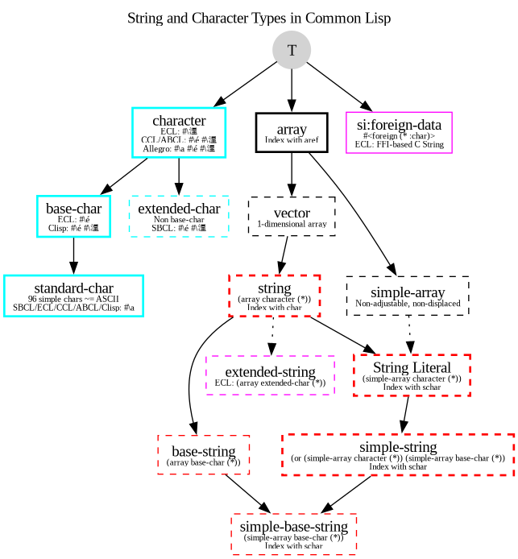
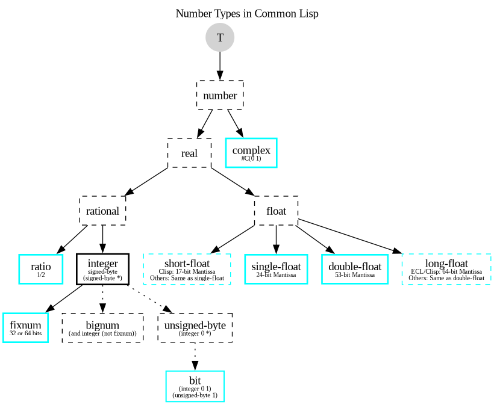
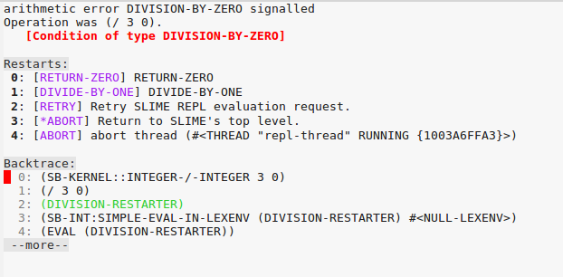
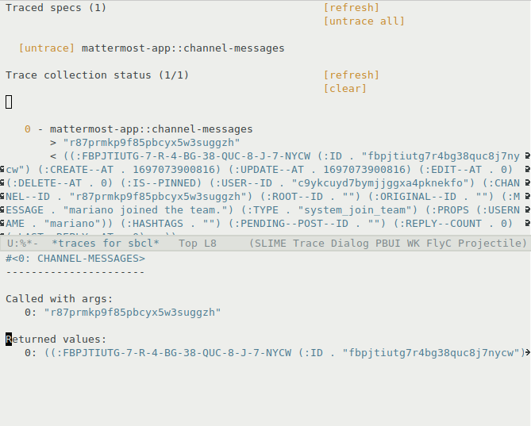

 
#  Common Lisp Cookbook
 

> Cookbook, 名詞.
> 料理の作り方や調理に関するその他の情報を含む本。

Cookbook は、理論的な背景をすべて説明するのではなく、さまざまなことを明快な形で行う方法を示す、非常に価値のある資料です。単に調べたいだけのこともあります。Cookbook は HyperSpec のような正式なドキュメントや Practical Common Lisp のような書籍を決して置き換えるものではありませんが、どの言語にもよい cookbook があるべきです。Common Lisp も例外ではありません。

CL Cookbook は、初心者からより高度な開発者までを対象に、あらゆる種類のトピックを扱うことを目指しています。


# 内容

### はじめに

* [ライセンス](license.html)
* [はじめに](getting-started.html)
  * Common Lisp 実装をインストールする方法
  * Lisp REPL を起動する方法
  * Quicklisp でサードパーティライブラリをインストールする方法
  * プロジェクトで作業する方法
* [エディタ対応](editor-support.html)
  * [Emacs を IDE として使う](emacs-ide.html)
  * [LispWorks IDE](lispworks.html)
  * [Alive で VSCode を使う](vscode-alive.html)

### 言語の基礎

<p id="two-cols"></p>

* [変数](variables.html)
* [関数](functions.html)
* [データ構造](data-structures.html)
* [文字列](strings.html)
  + [format](strings.html#string-formatting-format)
* [正規表現](regexp.html)
* [数値](numbers.html)
* [等価性](equality.html)
* [ループ、反復、マッピング](iteration.html)
* [多次元配列](arrays.html)
* [日付と時刻](dates_and_times.html)
* [パターンマッチング](pattern_matching.html)
* [入出力](io.html)
* [ファイルとディレクトリ](files.html)
* [CLOS (Common Lisp Object System)](clos.html)

### 発展的なトピック

<p id="two-cols"></p>

* [パッケージ](packages.html)
* [システムの定義](systems.html)
* [エラーと condition の処理](error_handling.html)
* [デバッグ](debugging.html)
* [マクロとバッククォート](macros.html)
* [型システム](type.html)
* [並行性と並列性](process.html)
* [パフォーマンスチューニング](performance.html)
* [テストと継続的インテグレーション](testing.html)
* [スクリプト。実行ファイルの構築](scripting.html)
* [ストリーム](streams.html)

### 外の世界

<p id="two-cols"></p>

* [OS との連携](os.html)
* [データベース](databases.html)
* [外部関数インターフェイス](ffi.html)
* [動的ライブラリの構築](dynamic-libraries.html)
* [GUI プログラミング](gui.html)
* [ソケット](sockets.html)
* [WebSockets][WebSockets]
* [Web 開発](web.html)
* [Web Scraping][Web Scraping]

<!-- pdf-include-start

{{PDF-TOCS}}

   pdf-include-end -->


## EPUB と PDF でダウンロード

Cookbook は EPUB 形式と PDF 形式でも利用できます。

[EPUB](https://github.com/LispCookbook/cl-cookbook/releases/download/2026-01-12/common-lisp-cookbook-2026-01.epub) と [PDF](https://github.com/LispCookbook/cl-cookbook/releases/download/2026-01-12/common-lisp-cookbook-2026-01.pdf) を直接ダウンロードできます。また、開発をさらに支援するために [**支払いたい金額を支払う**](https://ko-fi.com/s/01fee22a32) こともできます。

2026 年以降、PDF は Typst で生成されており、品質が向上しています。


<a style="font-size: 16px; background-color: #4CAF50; color: white; padding: 16px; cursor: pointer;" href="https://ko-fi.com/s/01fee22a32">
  寄付して PDF と EPUB をダウンロードする
</a>


ありがとうございます。


## 翻訳

Cookbook は次の言語に翻訳されています。

* [簡体字中国語](https://oneforalone.github.io/cl-cookbook-cn/#/) ([Github](https://github.com/oneforalone/cl-cookbook-cn))
* [ポルトガル語 (ブラジル)](https://lisp.com.br/cl-cookbook/) ([Github](https://github.com/commonlispbr/cl-cookbook))

## その他の CL リソース

<p id="two-cols"></p>

* [lisp-lang.org](http://lisp-lang.org/): 成功事例、チュートリアル、スタイルガイド
* [awesome-cl](https://github.com/CodyReichert/awesome-cl): ライブラリの厳選リスト
* 🖌️ [lisp-screenshots.org](https://www.lisp-screenshots.org/): 現在動作している Common Lisp アプリケーションのギャラリー
* [Lisp コミュニティ一覧](https://github.com/CodyReichert/awesome-cl#community)
* [Lisp Koans](https://github.com/google/lisp-koans/) - 多くの言語機能を段階的に学習者に案内する、言語学習用の演習です。
* [Learn X in Y minutes - Where X = Common Lisp](https://learnxinyminutes.com/docs/common-lisp/) - 要点を扱う小さな Common Lisp チュートリアルです。
* [Common Lisp Libraries Read the Docs](https://common-lisp-libraries.readthedocs.io/) - よく使われるライブラリのドキュメントを、現代的で見やすい Read The Docs style に移植したものです。
* [lisp-tips](https://github.com/lisp-tips/lisp-tips/issues/)
* [Common Lisp and CLOG tutorial series](https://github.com/rabbibotton/clog/blob/main/LEARN.md): Common Lisp と CLOG のチュートリアルです。CLOG は web technologies に基づく Common Lisp 向け GUI 風ライブラリです。
* Nick Levine による [Lisp and Elements of Style](http://web.archive.org/web/20190316190256/https://www.nicklevine.org/declarative/lectures/)
* Pascal Costanza の [Highly Opinionated Guide to Lisp](http://www.p-cos.net/lisp/guide.html)
* [Cliki](http://www.cliki.net/): Common Lisp の wiki
* 📹 [Common Lisp programming: from novice to effective developer](https://www.udemy.com/course/common-lisp-programming/?referralCode=2F3D698BBC4326F94358): Udemy platform 上の動画講座 (有料) で、Cookbook の主要 contributor の一人によるものです。*"Udemy での私の仕事を支援してくれてありがとうございます。学生であれば無料 coupon を求めてください。"* vindarel

加えて、Jeff Dalton による [Common Lisp Pitfalls](https://github.com/LispCookbook/cl-cookbook/issues/479) もあります。


書籍

* Peter Seibel による [Practical Common Lisp](http://www.gigamonkeys.com/book/)
* Edmund Weitz による [Common Lisp Recipes](http://weitz.de/cl-recipes/)。2016 年出版。
* David S. Touretzky による [Common Lisp: A Gentle Introduction to Symbolic Computation](http://www-2.cs.cmu.edu/~dst/LispBook/)
* David B. Lamkins による [Successful Lisp: How to Understand and Use Common Lisp](https://successful-lisp.blogspot.com/p/httpsdrive.html)
* Paul Graham による [On Lisp](http://www.paulgraham.com/onlisptext.html)
* Guy L. Steele による [Common Lisp the Language, 2nd Edition](http://www-2.cs.cmu.edu/Groups/AI/html/cltl/cltl2.html)
  * [PDF 形式の CLtL2](https://github.com/mmontone/cltl2-doc)
* Peter Norvig と Kent Pitman による [A Tutorial on Good Lisp Style](https://www.cs.umd.edu/%7Enau/cmsc421/norvig-lisp-style.pdf)

発展的な書籍

* Mark Watson による [Loving Lisp - the Savy Programmer's Secret Weapon](https://leanpub.com/lovinglisp/)
* [Programming Algorithms](https://leanpub.com/progalgs) - Lisp の例を使って効率的な program を書くための包括的な guide です。


仕様

* Kent M. Pitman による [The Common Lisp HyperSpec](http://www.lispworks.com/documentation/HyperSpec/Front/index.htm) ([Dash](https://kapeli.com/dash)、[Zeal](https://zealdocs.org/)、[Velocity](https://velocity.silverlakesoftware.com/) でも利用できます)
* [The Common Lisp Community Spec](https://cl-community-spec.github.io/pages/index.html) - ANSI specification draft から生成された新しい rendering で、誰でも編集する権利があります。

## さらにひと言

これは、O'Reilly が出版した [Perl Cookbook][perl] と似たものを Common Lisp 向けに提供することを目指す共同プロジェクトです。これが何であり、何でないかについての詳細は、[comp.lang.lisp][cll] のこの [thread][thread] にあります。

CL Cookbook に貢献したい場合は、pull request を送るか、ticket を登録してください。

そう、あなたに話しています。私たちは contributor を必要としています。足りない章を書いて追加する、未解決の質問を見つけて答えを提供する、bug、typo、文法 error を見つけて報告する、などです。formatting は心配しないでください。望むなら plain text を送るだけでもかまいません。その後の整形はこちらで対応します。

ご協力にあらかじめ感謝します。

Github 上のページは最新に保たれています。offline browsing 用に [up to date zip file][zip] をダウンロードすることもできます。詳しい情報は [Github project page][gh] にあります。


[cll]: news:comp.lang.lisp
[perl]: http://www.oreilly.com/catalog/cookbook/
[thread]: http://groups.google.com/groups?threadm=m3it9soz3m.fsf%40bird.agharta.de
[toc]: http://www.oreilly.com/catalog/cookbook/
[zip]: https://github.com/LispCookbook/cl-cookbook/archive/master.zip
[gh]: https://github.com/LispCookbook/cl-cookbook
 
#  ライセンス
 

## 日本語訳

"Common Lisp Cookbook" を元の形式（Markdown）または「派生」形式（HTML、PDF、Typst など）で、変更の有無にかかわらず再配布および使用することは、次の条件を満たす限り許可されます。

* 再配布物は、上記の著作権表示、この条件、および次の免責事項を、文書自体および/または配布物に付属するその他の資料に再掲しなければなりません。

**重要:** この文書は Common Lisp Cookbook Project によって「現状のまま」提供され、明示または黙示のいかなる保証も否認されます。これには、商品性および特定目的への適合性に関する黙示の保証が含まれますが、それらに限定されません。いかなる場合においても、Common Lisp Cookbook Project は、この文書の使用に起因して何らかの形で発生した、直接的、間接的、付随的、特別、懲罰的、または結果的損害（代替商品またはサービスの調達、使用不能、データまたは利益の損失、事業中断を含みますが、それらに限定されません）について、契約、厳格責任、不法行為（過失その他を含む）その他いかなる責任理論に基づくものであっても、そのような損害の可能性を知らされていた場合であっても、責任を負いません。

LispCookbook Github Group 追補: この文書は現在、変更された形式で管理されています。

Copyright:
2015-2025 LispCookbook Github Group,
2002-2007 The Common Lisp Cookbook Project.

## Original

Redistribution and use of the "Common Lisp Cookbook" in its original form (Markdown)
or in 'derived' forms (HTML, PDF, Typst and so forth) with or without
modification, are permitted provided that the following condition is met:

* Redistributions must reproduce the above copyright notice, this and the
  following disclaimer in the document itself and/or other materials provided
  with the distribution.

**IMPORTANT:** This document is provided by the Common Lisp Cookbook Project "as
is" and any expressed or implied warranties, including, but not limited to, the
implied warranties of merchantability and fitness for a particular purpose are
disclaimed. In no event shall the Common Lisp Cookbook Project be liable for any
direct, indirect, incidental, special, exemplary, or consequential damages
(including, but not limited to, procurement of substitute goods or services;
loss of use, data, or profits; or business interruption) however caused and on
any theory of liability, whether in contract, strict liability, or tort
(including negligence or otherwise) arising in any way out of the use of this
documentation, even if advised of the possibility of such damage.

LispCookbook Github Group addendum: this document is now managed in a modified format.

Copyright:
2015-2025 LispCookbook Github Group,
2002-2007 The Common Lisp Cookbook Project.
 
#  まえがき
 

<!-- that's for the EPUB and the PDF versions -->

Common Lisp Cookbook は共同で作られている資料です。これまでに力を貸してくださったすべての方に感謝します。

<!-- We want the Cookbook to help you learn Common Lisp in a wide range of -->
<!-- day-to-day tasks. It can be used by Lisp newcomers as a tutorial -->
<!-- (getting started, functions, CLOS…) and by everybody as a reference -->
<!-- (loop!). -->

これらの EPUB 版と PDF 版によって、学習体験がさらに実用的で楽しいものになることを願っています。


> Vincent "vindarel" Dardel、Cookbook contributors を代表して、2026年1月。
 
#  Common Lisp を始める
 

開発環境をインストールし、新しい Common Lisp プロジェクトを始めるための簡単な手順から始めます。

## 実装をインストールする

### パッケージマネージャを使う

どの Common Lisp 実装を使えばよいかわからない場合は、[SBCL](https://www.sbcl.org/) を試してください。

    apt-get install sbcl

Common Lisp は ANSI 標準ですが、実装が標準に加えて提供する機能は大きく異なることがあります。[Wikipedia の実装一覧](https://en.wikipedia.org/wiki/Common_Lisp#Implementations)を参照してください。

次の実装は Debian と、ほとんどの主要な Linux ディストリビューション向けにパッケージ化されています。

* [Steel Bank Common Lisp (SBCL)](http://www.sbcl.org/)
* [Embeddable Common Lisp (ECL)](https://gitlab.com/embeddable-common-lisp/ecl/)、C へコンパイルします。
* [CLISP](https://clisp.sourceforge.io/)

その他のよく知られた実装には次のものがあります。

* [ABCL](http://abcl.org/)、JVM と連携するための実装です。
* [ClozureCL](https://ccl.clozure.com/)、ビルド時間が非常に速い優れた実装です。
* [CLASP](https://github.com/drmeister/clasp)、LLVM を使ってネイティブコードへコンパイルし、C++ ライブラリと相互運用します。
* [SICL](https://github.com/robert-strandh/SICL)、新しいモジュール式の実装です。
* [LispWorks](http://www.lispworks.com/)（プロプライエタリ）
* [AllegroCL](https://franz.com/products/allegrocl/)（プロプライエタリ）

また、古い実装として次のものがあります。

* [CMUCL](https://gitlab.common-lisp.net/cmucl/cmucl)、Carnegie Mellon University で開発され、SBCL の派生元になった実装です。
* [GNU Common Lisp](https://en.wikipedia.org/wiki/GNU_Common_Lisp)
* ほかにもあります。


### macOS の場合

[homebrew](https://brew.sh) を使って SBCL をインストールします。

```shell
brew install sbcl
```

Homebrew で Emacs エディタをインストールすることもできますが、Common Lisp を使うために*必須*ではありません。ターミナルで SBCL を使う方法は後述します。また、Editor Support の節も参照してください。

```shell
brew tap d12frosted/emacs-plus
brew install emacs-plus
```


### Windows の場合

上記のすべての実装は Windows にインストールできます。

SBCL は [Chocolatey](https://community.chocolatey.org/packages/sbcl) で入手できますが、これは*公式の*インストール方法ではありません。

    > choco install sbcl

[plain-common-lisp](https://github.com/pascalcombier/plain-common-lisp/) も使えます。これは Windows 上でネイティブな Common Lisp 環境を得るための簡単な方法です。Emacs と Slime、Quicklisp、SBCL を数クリックでインストールできます。ワークスペース内でアーカイブを展開するだけです。

または、Emacs を自分でインストールして設定することもできます。

    > choco install emacs

### Docker を使う

すでに [Docker](https://docs.docker.com) を知っているなら、Common Lisp をかなり素早く始められます。[clfoundation/cl-devel](https://hub.docker.com/r/clfoundation/cl-devel) イメージには、最近の SBCL、CCL、ECL、ABCL に加えて、ホームディレクトリ（`/home/cl`）にインストール済みの Quicklisp が含まれているので、すぐにライブラリを `ql:quickload` できます。

Docker は GNU/Linux、Mac、Windows で動作します。

次のコマンドは必要なイメージ（圧縮状態で約 1.0GB）をダウンロードし、指定した場所にローカルのソースを Docker イメージ内へ入れ、SBCL REPL に入ります。

    docker run --rm -it -v /path/to/local/code:/home/cl/common-lisp/source clfoundation/cl-devel:latest sbcl

それでも Emacs と SLIME を使って開発したいので、SLIME を Docker 内の Lisp に接続する必要があります。その設定を助けるライブラリである [slime-docker](https://gitlab.common-lisp.net/cl-docker-images/slime-docker) を参照してください。

### asdf-vm パッケージマネージャを使う

[asdf-vm](http://asdf-vm.com/) ツールは、大きなランタイムとツールのエコシステムを管理するために使えます。

[Steel Bank Common Lisp (SBCL)](http://www.sbcl.org/) は [asdf-sbcl plugin](https://github.com/smashedtoatoms/asdf-sbcl) 経由で利用できます。

次のようにインストールします。

```shell
asdf plugin-add sbcl https://github.com/smashedtoatoms/asdf-sbcl.git
```

### Roswell を使う

[Roswell](https://github.com/roswell/roswell/wiki) は、次のような Common Lisp ツールです。

* 実装マネージャ: Common Lisp 実装（`ros install ecl`）、実装の正確なバージョン（`ros install sbcl/1.2.0`）のインストール、使うデフォルト実装の変更（`ros use ecl`）を簡単にします。
* スクリプティング環境（シェルから Lisp を実行したり、コマンドライン引数を取得したりするのを助けます）。
* プログラムのインストーラ。
* テスト環境（一般的な Continuous Integration プラットフォーム上も含めてテストを実行するため）。
* ビルドユーティリティ（イメージと実行ファイルを移植性のある方法でビルドするため）。

インストール方法はいくつかあり、wiki で見つかります（Debian パッケージ、Windows インストーラ、Brew/Linux Brew など）。


## REPL を起動する

コマンドラインで実装の実行ファイルを起動するだけで、REPL（Read Eval Print Loop）、つまり対話的インタプリタに入れます。

終了するには `(quit)` または `ctr-d` を使います（一部の実装）。

サンプルセッションを示します。`sbcl` バイナリを起動し、起動メッセージが表示され、Lisp プロンプト（`* `）に入り、lisp フォームを入力し、その後終了します。

```
user@debian:~$ sbcl
This is SBCL 2.1.11.debian, an implementation of ANSI Common Lisp.
More information about SBCL is available at <http://www.sbcl.org/>.

SBCL is free software, provided as is, with absolutely no warranty.
It is mostly in the public domain; some portions are provided under
BSD-style licenses.  See the CREDITS and COPYING files in the
distribution for more information.
* (+ 1 2)

3
* (quit)
user@debian:~$
```


### ファイルをロード、再ロードする

REPL で Lisp コードを評価しました。おめでとうございます。もちろん、コードは `.lisp` ファイルに書きたくなるでしょう。

`sbcl --load myfile.lisp` を使うと、このファイルをロード、コンパイル、実行できます。トップレベルのコマンドが実行された後も Lisp プロセスは終了せず、REPL が表示されるので、作業を続けられます。

<!-- xxx: "compile" must be puzzling since this doesn't create a binary. -->

.lisp ファイルを編集した後、終了して SBCL コマンドを再び呼び出してファイルを `--load` する必要はありません。REPL 内から単に `load` できます。

```
$ sbcl --load myfile.lisp

a… bunch… of… awesome… stuff

* (load "myfile.lisp")
```

この `* ` の部分に気づきましたか。これはターミナルでのデフォルトの Lisp プロンプトです。エディタ内では通常、現在のパッケージを示す `CL-USER>` が表示されます。

エディタといえば、もちろん、よく設定されたエディタを使えば、はるかに対話的なワークフローを得られます。ただし、この方法でもすでに作業できます。

### より使いやすい REPL: rlwrap

少なくとも SBCL では、REPL はそのままだとあまり使いやすくありません。履歴（以前に入力したコマンド）を呼び出すための矢印キーが動かず、組み込み Lisp 関数の補完もありません。

`rlwrap` をインストールして使うことで、機能を少し強化できます。

| **オペレーティングシステム** | **コマンド**             |
|----------------------|--------------------------|
| Linux (Debian)       | `apt-get install rlwrap` |
| macOS                | `brew install rlwrap`    |
| Windows              | `choco install rlwrap`   |


次のように起動します。

    rlwrap sbcl

これにより、素のターミナル REPL に*ある程度*の使い勝手が加わります。ただし、このようなターミナル REPL で作業するかわりに、もっとよい編集体験を提供するようエディタを設定します。[editor-support][Editor support] を参照してください。

<div class="info" style="background-color: #e7f3fe; border-left: 6px solid #2196F3; padding: 17px;">
<!-- if inside a <p> then bootstrap adds 10px padding to the bottom -->
<strong>TIP:</strong> CLISP 実装は、ターミナル向けによりよいデフォルト REPL を持っています（readline 機能、シンボル補完）。<code>clisp -on-error abort</code> を使えば、デバッガなしでエラーメッセージを得ることもできます。ちょっと試すには便利ですが、エディタを設定し、SBCL または CCL を使うことをおすすめします。
</div>


<div class="info" style="background-color: #e7f3fe; border-left: 6px solid #2196F3; padding: 17px; margin-top:1em;">
<!-- if inside a <p> then bootstrap adds 10px padding to the bottom -->
<strong>TIP:</strong>
 rlwrap に <code>-c</code> スイッチを追加すると、ファイル名を自動補完できます。
</div>

### より使いやすい REPL: ICL

[ICL](https://github.com/atgreen/icl)、Interactive Common Lisp は、ターミナル向けの拡張 REPL です。システム上にあるどの実装でも動作します。多くの便利な機能をもたらします。よいエディタの代わりにはなりませんが、実際にそれを補完できます。

ICL は次を提供します。

- readline 風の編集を備えた**モダンな対話体験**: 永続的な履歴、タブ補完、拡張可能なコマンドシステム。
  - Lisp コードを理解しているので `rlwrap` より優れています。Lisp 組み込みや自分のコードに対して TAB 補完を提供します。
- ターミナルで動作します。
- Web ブラウザでも動作し、そこで
  - パッケージとシステムを閲覧できます。
  - ドキュメントをクリックして閲覧できます。
  - 対話的なデータインスペクタを使えます。
  - 特定の変数の内容を視覚的に表示できます（JSON 文字列、バイト配列内の画像など）。
    - 独自の可視化関数を定義できます。
    - 変数が変化するにつれて表現が更新されるのを監視できます。
  - パフォーマンスプロファイリング用の対話的な Speedscope フレームグラフを起動できます。
  - コードカバレッジレポートを実行できます（sb-cover を使用、SBCL のみ）。
  - そして、きっとほかにもあります。
- エディタ（Emacs）から起動し、ブラウザウィンドウの便利な機能すべてと接続することもできます。

ICL は初心者にもやさしいことにも注意してください。対話的デバッガを持ちません。その代わり、どんなエラーも処理し、エラーメッセージを表示し、プログラマが `,bt` コマンドでバックトレースを見られるようにします。

GNU/Linux ではビルド済みバイナリとパッケージ（.deb、.rpm）で、Windows では zip、exe、MSI インストーラでインストールできます。[GitHub releases](https://github.com/atgreen/icl/releases) を参照してください。ビルドも簡単です。

`icl` がパス上にあるなら、起動します。

    $ icl
    COMMON-LISP-USER>

REPL を起動する前に、`--load / -l` オプションでファイルを `load` することもできます。

    $ icl -l mycode.lisp
    your… output…
    COMMON-LISP-USER> (your-function-is-available)

楽しんでください。

類似のプロジェクトに `cl-repl` があります。エディタの節を参照してください。

ICL は LLM の助けを借りてコーディングされたプロジェクトです。


### 対話的デバッガ

Lisp は本質的に対話的なので、エラーが起きた場合はデバッガに入ります。場合によってはこれが煩わしいこともあるため、SBCL の `--disable-debugger` オプションを使いたくなるかもしれません。

また、上で見た `icl` は対話的デバッガを持たず、エラーメッセージを表示し、バックトレースを表示できるようにする点にも注意してください。

## ライブラリ

Common Lisp には、フリーソフトウェアライセンスの下で利用できる何千ものライブラリがあります。次を参照してください。

* [awesome-cl](https://github.com/CodyReichert/awesome-cl) リスト、ライブラリのキュレーションリストです。
* [Quickdocs](http://quickdocs.org/) - CL 向けライブラリドキュメントホスティングです。
* [Cliki](http://www.cliki.net/)、Common Lisp の wiki です。

### 用語

* Common Lisp の世界では、**package** はシンボルをまとめ、カプセル化を提供する方法です。これは C++ の namespace、Python の module、Java の package に似ています。

* **system** は、.asd ファイルと一緒に束ねられた CL ソースファイルの集合です。.asd ファイルは、それらをどうコンパイルしロードするかを記述します。system と package の間には一対一の関係があることが多いですが、これはまったく必須ではありません。system は他の system への依存を宣言できます。system は [ASDF](https://common-lisp.net/project/asdf/asdf.html)（Another System Definition Facility）によって管理されます。ASDF は `make` や `ld.so` に似た機能を提供し、事実上の標準になっています。

* Common Lisp のライブラリまたはプロジェクトは、通常、1つまたは複数の ASDF system から構成されます（そして1つの Quicklisp プロジェクトとして配布されます）。

### Quicklisp をインストールする

[Quicklisp](https://www.quicklisp.org/beta/) は単なるパッケージマネージャではありません。すべてのライブラリが一緒にビルドできることを保証する中央リポジトリ（*dist*）でもあります。

<div class="info" style="background-color: #e7f3fe; border-left: 6px solid #2196F3; padding: 17px; margin: 1em;">
<strong>SEE ALSO:</strong> 新しい <a href="https://github.com/ocicl/ocicl/">OCICL</a> パッケージマネージャも参照してください。コマンドラインツールを提供し、プロジェクトローカルの依存関係で動作し（詳細は後述）、デフォルトで HTTPS を使い、Quicklisp から独立したリポジトリです。</div>

Quicklisp は独自の *dist* を提供しますが、自分たちで構築することも可能です。

インストールするには、次のどちらかを行います。

1- 任意の場所でこのコマンドを実行します。

    curl -O https://beta.quicklisp.org/quicklisp.lisp

そして Lisp REPL に入り、このファイルをロードします。

    sbcl --load quicklisp.lisp

または

2- Debian パッケージをインストールします。

    apt-get install cl-quicklisp

そして REPL からロードします。

~~~lisp
(load "/usr/share/common-lisp/source/quicklisp/quicklisp.lisp")
~~~

次に、どちらの場合も、引き続き REPL から実行します。

~~~lisp
(quicklisp-quickstart:install)
~~~

これにより `~/quicklisp/` ディレクトリが作成され、Quicklisp はそこで状態とダウンロードしたプロジェクトを管理します。

必要なら、Quicklisp を別の場所へインストールできます。たとえば Unix システムで隠しフォルダへインストールするには次のようにします。

~~~lisp
;; optional
(quicklisp-quickstart:install :path "~/.quicklisp")
~~~

最後に、新しい Lisp セッションを開始するたびに常に Quicklisp をロードするには、次を実行します。

~~~lisp
(ql:add-to-init-file)
~~~

これは CL 実装の init ファイルへ適切な内容を追加します。そうしない場合、Quicklisp や Quicklisp 経由でインストールしたライブラリを使いたいすべてのセッションで、`(load "~/quicklisp/setup.lisp")` を実行する必要があります。

たとえば `~/.sbclrc` には次の内容が追加されます。

~~~lisp
#-quicklisp
  (let ((quicklisp-init (merge-pathnames
                          "quicklisp/setup.lisp"
                          (user-homedir-pathname))))
    (when (probe-file quicklisp-init)
      (load quicklisp-init)))
~~~

### ライブラリをインストールする

REPL で次を実行します。

~~~lisp
(ql:quickload "system-name")
~~~

たとえば、これは文字列操作ライブラリ "[str](https://github.com/vindarel/cl-str/)" をインストールします。

~~~lisp
(ql:quickload "str")
~~~

以上です。すぐに使えます。

~~~lisp
(str:title-case "HELLO LISP!")
~~~

<div class="info" style="background-color: #e7f3fe; border-left: 6px solid #2196F3; padding: 17px; margin: 1em;">
<strong>SEE MORE:</strong> <code>package:a-symbol</code> 記法を理解するには、<a href="packages.html">packages page</a> の "Accessing symbols from a package" 節を読んでください。
</div>

一度に複数のライブラリをインストールできます。ここでは、正規表現用の [cl-ppcre](https://edicl.github.io/cl-ppcre/) と、ユーティリティライブラリである [Alexandria](https://alexandria.common-lisp.dev/draft/alexandria.html) をインストールします。

~~~lisp
(ql:quickload '("str" "cl-ppcre" "alexandria"))
~~~

Lisp REPL でサードパーティライブラリを使いたいときはいつでも、この `ql:quickload` コマンドを実行できます。そのライブラリがすでにファイルシステム上にインストールされていることがわかれば、2回目はネットワークにアクセスしません。ライブラリはデフォルトで `~/quicklisp/dists/quicklisp/` にインストールされます。

また、多数の Common Lisp ライブラリが Debian でパッケージ化されていることにも注意してください。パッケージ名は通常 cl- prefix で始まります（すべてを一覧するには `apt-cache search --names-only "^cl-.*"` を使います）。

たとえば `cl-ppcre` ライブラリを使うには、まず `cl-ppcre` パッケージをインストールする必要があります。

次に、SBCL では次のように使えます。

~~~lisp
(require "asdf")
(require "cl-ppcre")
(cl-ppcre:regex-replace "fo+" "foo bar" "frob")
~~~

ここでは Quicklisp がインストールされていないふりをして、ファイルシステム上で利用できるモジュールを `require` でロードしています。迷ったら `ql:quickload` を使えます。

その他のコマンドについては Quicklisp のドキュメントを参照してください。たとえば Quicklisp のディストリビューションをアップグレードまたはロールバックする方法を見てください。


## 高度な依存関係管理

Common Lisp プロジェクトは、次のどのフォルダにも置けます。

- `~/quicklisp/local-projects`
- `~/common-lisp`,
- `~/.local/share/common-lisp/source`,

ここにインストールされたライブラリは、すべてのプロジェクトで自動的に利用可能になります。

完全な一覧については、次の値を参照してください。

~~~lisp
(asdf/source-registry:default-user-source-registry)
~~~

および

~~~lisp
asdf:*central-registry*
~~~

`*central-registry*` は `asdf` package 内のトップレベル変数で、いわゆる "\*earmuffs\*" を使って書かれています。これは便利な慣習です。[Variables](variables.html) 章を参照してください。

### ライブラリの自分用バージョンを用意する。プロジェクトを clone する。

上記の性質により、任意のライブラリを `~/quicklisp/local-projects/` ディレクトリへ clone すれば、それは ASDF（および Quicklisp）に見つけられ、すぐに利用可能になります。

~~~lisp
(asdf:load-system "system")
~~~

または

~~~lisp
(ql:quickload "system")
~~~

両者の実用上の違いは、`ql:quickload` は system がまだインストールされていない場合、まずインターネットから取得しようとすることです。

local-projects 内のシンボリックリンクが、好みの別の場所を指していても動作することに注意してください。

### プロジェクトローカルなライブラリバージョンを扱う方法

ライブラリを1つのプロジェクトだけのためにローカルへインストールする必要がある場合、または依存関係リストをアプリケーションと一緒に簡単に配布したい場合は、[Qlot](https://github.com/fukamachi/qlot) または [ocicl](https://github.com/ocicl/ocicl/) を使えます。

どちらのプロジェクトもコマンドラインツールを提供し、ロックファイル（`qlfile.lock` と `ocicl.csv`）で依存関係を固定でき、グローバルな Quicklisp インストールに触れずに依存関係をローカルへインストールして管理するコマンド（`qlot install`、`ocicl install`）を提供します。

もちろん、ほかのエコシステムで主流になっている依存関係管理スタイル、つまり `npm` や `pip` などを思い浮かべているでしょう。しかし、これらのツールをここで紹介しているのは、Common Lisp ではそれほど必要になることが少ないからです。

<div class="info" style="background-color: #e7f3fe; border-left: 6px solid #2196F3; padding: 17px; margin: 1em;">
<strong>NOTE:</strong> 初心者はまだプロジェクトローカルな依存関係について心配する必要はありません。グローバルな Quicklisp 依存関係と quicklisp/local-projects/ だけでかなり先まで進めます。自分にとって最も簡単なツールを選んでください（きっと Quicklisp です）。
</div>

理由は少なくとも2つあります。まず、言語（およびその実装）は非常に安定しています。たとえば実装が *lisp syntax* の破壊的変更を導入することは*決して*ありません。ときどき小さな破壊的変更が入りますが、それに気づくのはかなり熱心なユーザーだけです。次に、エコシステムも非常に安定しており、通常、*ライブラリ作者は安定性のルールに従います*。非推奨警告が 12（十二）年残り続けているのを見たことがあります。全体として、Common Lisp の世界の初心者は、プロジェクトローカルな依存関係について、それほど、あるいはまったく心配する必要がありません。

この用途のための別のツールもいくつか挙げておきます。

Quicklisp は [Quicklisp bundles](https://www.quicklisp.org/beta/bundles.html) も提供しています。これは Quicklisp からエクスポートされ、Quicklisp を介さずにロードできる、自己完結した system の集合です。

最後に、*dist* の構築を助ける [Quicklisp controller](https://github.com/quicklisp/quicklisp-controller) があります。

## プロジェクトで作業する

Quicklisp とエディタの準備ができたので、ファイルに Lisp コードを書き、REPL と対話し始められます。

しかし、既存のプロジェクトで作業したい、または新しいプロジェクトを作成したい場合は、どう進めればよいのでしょうか。`defpackage` の正しい順序は何でしょうか。.asd ファイルには何を書くべきでしょうか。プロジェクトを REPL にロードするにはどうすればよいでしょうか。

### 新しいプロジェクトを作成する

プロジェクト構造のひな形作成を助けるプロジェクトビルダがあります。ここでは [cl-project](https://github.com/fukamachi/cl-project) を好んで使います。これはテストの骨組みも設定します。

要するに次のとおりです。

~~~lisp
(ql:quickload "cl-project")
(cl-project:make-project #P"./path-to-project/root/")
~~~

これは次のようなディレクトリ構造を作成します。

```
|-- my-project.asd
|-- my-project-test.asd
|-- README.markdown
|-- README.org
|-- src
|   `-- my-project.lisp
`-- tests
    `-- my-project.lisp
```

ここで `my-project.asd` は次のようになります。

~~~lisp
(asdf:defsystem "my-project"
  :version "0.1.0"
  :author ""
  :license ""
  :depends-on ()  ;; <== list of Quicklisp dependencies
  :components ((:module "src"
                :components
                ((:file "my-project"))))
  :description ""
  :long-description
  #.(read-file-string
     (subpathname *load-pathname* "README.markdown"))
  :in-order-to ((test-op (test-op "my-project-test"))))
~~~

そして `src/my-project.lisp` は次のようになります。

~~~lisp
(defpackage footest
  (:use :cl))
(in-package :footest)
~~~

- ASDF documentation: [defining a system with defsystem](https://common-lisp.net/project/asdf/asdf.html#Defining-systems-with-defsystem)

### 既存のプロジェクトをロードする方法

新しいプロジェクトを作成した、または既存のプロジェクトがあり、それを REPL で扱いたい。しかし Quicklisp はそれを知りません。どうすればよいでしょうか。

まず、`~/common-lisp`、`~/.local/share/common-lisp/source/`、`~/quicklisp/local-projects` のいずれかに作成または clone すれば、追加の手間なしで `(ql:quickload …)` できます。

そうでない場合は、先に system 定義（`.asd`）をコンパイルしてロードする必要があります。SLIME で `slime-asdf` contrib がロードされているなら、`.asd` 内で `C-c C-k`（*slime-compile-and-load-file*）を入力し、その後 `(ql:quickload …)` できます。

`C-c C-k` の代わりに、プログラムから `(asdf:load-asd "my-project.asd")` を使うこともできます。

通常、この段階で REPL 内で system に「入る」ことになります。

~~~lisp
(in-package :my-project)
~~~

最後に、ソース（`my-project.lisp`）を `C-c C-k` でコンパイルするか、フォーム内で `C-c C-c`（*slime-compile-defun*）により eval して、その結果を REPL で確認できます。

もう1つの解決策は、ASDF の既知プロジェクト一覧を使うことです。

~~~lisp
;; startup file like ~/.sbclrc
(pushnew "~/to/project/" asdf:*central-registry* :test #'equal)
~~~

ASDF は Quicklisp に統合されているので、すぐに自分のプロジェクトを `quickload` できます。

Happy hacking !


## 追加設定

SBCL のデフォルトエンコーディング形式を utf-8 に設定したくなるかもしれません。

    (setf sb-impl::*default-external-format* :utf-8)

これは `~/.sbclrc` に追加できます。

REPL がすべてのシンボルを大文字で表示するのが嫌なら、次を追加します。

    (setf *print-case* :downcase)

<div class="info-box warning">
<!-- if inside a <p> then bootstrap adds 10px padding to the bottom -->
<strong>Warning:</strong> これは、一部のパッケージの動作を壊す可能性があります。実際に <a href="https://github.com/fukamachi/mito/issues/45">Mito</a> で起きました。本番では避けてください。
</div>


## 関連項目

- [OCICL](https://github.com/ocicl/ocicl/) - ASDF system の配布と管理、コード lint、プロジェクトのひな形作成のための、quicklisp のモダンな代替です。
- [cl-cookieproject](https://github.com/vindarel/cl-cookieproject) - エントリポイントとユニットテストを備えた、すぐ使えるプロジェクトのためのプロジェクトスケルトンです。`src/` サブディレクトリ、追加のメタデータ、5AM テストスイート、バイナリをビルドする方法、CLI args 解析の例、Roswell 統合を含みます。

## クレジット

* [https://wiki.debian.org/CommonLisp](https://wiki.debian.org/CommonLisp)
 
#  Editor support
 

The editor of choice is still [Emacs](https://www.gnu.org/software/emacs/), but it is not the only one.

For newcomers to the ecosystem, we advise to first try the ICL enhanced REPL and `mine`.

## Emacs

[SLIME](https://github.com/slime/slime/) is the Superior Lisp
Interaction Mode for Emacs. It has support for interacting with a
running Common Lisp process for compilation, debugging, documentation
lookup, cross-references, and so on. It works with many implementations.

[IDEmacs](https://codeberg.org/IDEmacs/IDEmacs) is an attempt at
making Emacs beginner friendly. It ships Sly for Common Lisp. With
Emacs v29 or higher, you can try IDEmacs temporarily without messing
with your .emacs configuration, thanks to the new `--init-directory`
option. Other Emacs distributions such as [Doom](https://github.com/doomemacs/doomemacs/blob/3e15fb36d7f94f0a218bda977be4d3f5da983a71/modules/lang/common-lisp/README.org#L9) or
[Spacemacs](https://www.spacemacs.org/layers/LAYERS.html#lisp-dialects)
ship CL support (Sly and Slime, respectively).

[plain-common-lisp](https://github.com/pascalcombier/plain-common-lisp/)
is a crafted, easy-to-install Common Lisp environment for
**Windows**. It ships Emacs, SBCL, Slime, Quicklisp. It also shows how
to display GUI windows with Win32, Tk, IUP, ftw and Opengl.

[lisp-stat's Docker image](https://lisp-stat.dev/blog/2026/03/09/getting-started/) comes
with a ready-to-use Emacs:

```
$ docker run --rm -it ghcr.io/lisp-stat/ls-dev:latest ls-repl
$ emacs
… then Alt-x slime
```


<!-- pdf-include-start

   pdf-include-end -->

<!-- todo: PDF generation: lacks IMG images -->


### Using Emacs as an IDE

See ["Using Emacs as an IDE"][Using Emacs as an IDE].


## Vim & Neovim

[Slimv](https://github.com/kovisoft/slimv) is a full-blown
environment for Common Lisp inside of Vim.

[Vlime](https://github.com/vlime/vlime) is a Common Lisp dev
environment for Vim (and Neovim), similar to SLIME for Emacs and SLIMV
for Vim.


<!-- pdf-include-start

   pdf-include-end -->

[cl-neovim](https://github.com/adolenc/cl-neovim/) makes it possible to write
Neovim plugins in Common Lisp.

[quicklisp.nvim](https://gitlab.com/HiPhish/quicklisp.nvim) is a Neovim
frontend for Quicklisp.

[Slimv_box](https://github.com/justin2004/slimv_box) brings Vim, SBCL, ABCL,
and tmux in a Docker container for a quick installation.

See also:

* [Lisp in Vim](https://susam.net/blog/lisp-in-vim.html) demonstrates usage and
  compares both Slimv and Vlime

## Mine: single-download IDE for Common Lisp and Coalton

`mine` is a brand new (released in April of 2026) terminal-based IDE
for *both* Common Lisp and [Coalton](https://coalton-lang.github.io/)
(the statically typed functional superset of Common Lisp).

> `mine` is a complete, single-download application that comes with everything needed to experience the interactive and incremental development programming workflow, including hot-reloading and on-the-fly debugging, that Lisp programmers often refer to as the differentiating feature of the ecosystem.

- [Mine's homepage](https://coalton-lang.github.io/mine/)
  - 👉 [download the latest release for Windows, MacOS and GNU/Linux](https://github.com/coalton-lang/coalton/releases/latest)
- [Introducing mine, a Coalton and Common Lisp IDE](https://coalton-lang.github.io/20260424-mine/)
- youtube: [video presenting `mine`](https://www.youtube.com/watch?v=qe3vDKQShKs)


`mine` features:

- Inline **diagnostics**, from critical errors to harmless optimization notes
- Integrated **debugger** with readable backtraces
- Jump-to-definition (the Lisper-favorite meta-dot)
- **Autocomplete** that is aware of package nicknames
- Real-time display of argument lists and function types
- Syntax highlighting
- Auto-indentation
- Structural editing
- **Project creation** and setup
- Built-in **Quicklisp setup**
- Native code compiler and executable builder

Check it out.

Also please note that `mine` is different:

> mine is supposed to be as easy as the QBASIC or the Borland Turbo products of yore


## Pulsar (ex Atom)

See [SLIMA](https://github.com/neil-lindquist/slima). This package
allows you to interactively develop Common Lisp code, turning Atom, or
now [Pulsar](https://github.com/pulsar-edit/pulsar), into a pretty
good Lisp IDE. It features:

* REPL
* integrated debugger
  * (not a stepping debugger yet)
* jump to definition
* autocomplete suggestions based on your code
* compile this function, compile this file
* function arguments order
* integrated profiler
* interactive object inspection.

It is based on the Swank backend, like Slime for Emacs.

**Important notice**: at the time of writing, SLIMA doesn't work with the latest Slime sources. We tested it successfully with [Slime 2.27](https://github.com/slime/slime/releases/tag/v2.27). It worked with SBCL 2.5.8 and SBCL 2.1.11.debian. Just follow SLIMA's documentation to set this 1 setting.


<!-- pdf-include-start

   pdf-include-end -->

## VSCode

### OLIVE (NEW as of June, 2026)

[OLIVE](https://github.com/kchanqvq/olive/) is a new (published on
June of 2026) "Old-school LIsp Vscode Extension".

It is based on interactions with the Lisp Swank server, and it features:

- the basics: code completion, syntax highlighting, go to definition, documentation on hover…
- a REPL and an interactive debugger
  - with jump to source from the stack frames, ability to see local variables, etc.
- compile current form and load files with different debug settings
- find an ASDF system definition in the current project and load it
- a macro stepper.


<!-- pdf-include-start

   pdf-include-end -->

OLIVE vs. Alive:

- OLIVE is based on the Swank server, like Slime in Emacs, Lem, SLIMA in Pulsar, which is more mature for Common Lisp than a Common Lisp LSP.
- Alive's REPL starts a new thread for every evaluation, which prevents doing some interactions.
- OLIVE wants to be more stable than Alive,
- and as good as Emacs and Slime as possible.


### Alive

[Alive](https://marketplace.visualstudio.com/items?itemName=rheller.alive) makes
VSCode a powerful Common Lisp development.

It is based on LSP (through cl-lsp), and currently supports:

- Syntax highlighting
- Code completion
- Code formatter
- Jump to definition
- Snippets
- REPL integration
- Interactive Debugger
  - restart frames
  - eval in frame (since v0.4.4)
- REPL history
- Inline evaluation
- Macro expand
- Disassemble
- Inspector
- Hover Text
- Rename function args and let bindings
- Code folding


<!-- pdf-include-start

   pdf-include-end -->

### Using VSCode with Alive

See [Using VSCode with Alive][Using VSCode with Alive].

### commonlisp-vscode

[commonlisp-vscode
extension](https://marketplace.visualstudio.com/items?itemName=ailisp.commonlisp-vscode)
works via the [cl-lsp](https://github.com/ailisp/cl-lsp) language server and
it's possible to write LSP client that works in other editors. It depends
heavily on [Roswell](https://roswell.github.io/Home.html). It currently
supports:

- running a REPL
- evaluate code
- auto indent,
- code completion
- go to definition
- documentation on hover


<!-- pdf-include-start

   pdf-include-end -->


## Intellij (new and experimental)

[SLT](https://github.com/Enerccio/SLT) is a new (published on January,
2023) plugin for the suite of JetBrains' IDEs. It uses a modified SLIME/Swank
protocol to commmunicate with SBCL, providing IDE capabilities for
Common Lisp.

It has a very good [user guide](https://github.com/Enerccio/SLT/wiki/User-Guide).

At the time of writing, for its version 0.4, it supports:

- REPL
- symbol completion
- send expressions to the REPL
- interactive debugging, breakpoints
- documentation display
- cross-references
- find symbol by name, global class/symbol search
- inspector (read-only)
- graphical threads list
- SDK support, automatic download for Windows users
- multiple implementations support: SBCL, CCL, ABCL and AllegroCL.

*warn: this plugin might not work on every Intellij releases. See also this updated fork: https://github.com/ivanbulanov/SLT/releases*


<!-- pdf-include-start

   pdf-include-end -->


## Eclipse

[Dandelion](https://github.com/Ragnaroek/dandelion) is a plugin for the
Eclipse IDE.

Available for Windows, Mac and Linux, built-in SBCL and CLISP support
and possibility to connect other environments, interactive debugger
with restarts, macro-expansion, parenthesis matching,…


<!-- pdf-include-start

   pdf-include-end -->

## Lem

[Lem](https://github.com/lem-project/lem/) is a general-purpose
editor. It is built in Common Lisp, it is extensible interactively from the ground
up in Common Lisp, and it is tailored for Common Lisp
development. Once you install it, you can start working.
It supports [many programming languages out of the box](https://lem-project.github.io/modes/)
thanks to
its built-in LSP client: Python, Go, Rust, JS, Clojure, Kotlin, Scheme, HTML, CSS…
It has a directory mode, a good vim layer, an interactive Git mode, and more.

Its interface resembles Emacs and SLIME (same shortcuts). It comes with an
ncurses frontend, a web view and a (deprecated) SDL2 frontend.
You can download pre-built binaries for the three platforms.


<!-- pdf-include-start

   pdf-include-end -->

It can be started as a REPL right away in the terminal. Run it with:

    lem --eval "(lem-lisp-mode:start-lisp-repl t)"

So you probably want a shell alias:

    alias ilem='lem --eval "(lem-lisp-mode:start-lisp-repl t)"'

There is more:

* 🚀 [Lem on the cloud](https://www.youtube.com/watch?v=IMN7feOQOak) (video presentation) Rooms is a product that runs Lem, a text editor created in Common Lisp, in the Cloud and can be used by multiple users.
  * Lem on the cloud is NEW as of April, 2024. In private beta at the time of writing.


<!-- pdf-include-start

   pdf-include-end -->


## Sublime Text

[Sublime Text](http://www.sublimetext.com/3) has now good support for
Common Lisp.

First install the "SublimeREPL" package and then see the options
in Tools/SublimeREPL to choose your CL implementation.

Then [Slyblime](https://github.com/s-clerc/slyblime) ships IDE-like
features to interact with the running Lisp image. It is an
implementation of SLY and it uses the same backend (SLYNK). It
provides advanced features including a debugger with stack frame
inspection.


<!-- pdf-include-start

   pdf-include-end -->


## LispWorks (proprietary)

[LispWorks](http://www.lispworks.com/) is a Common Lisp implementation that
comes with its own Integrated Development Environment (IDE) and its share of
unique features, such as the CAPI GUI toolkit. It is **proprietary** and
provides a **free limited version**.

You can [read our LispWorks review here][LispWorks review].


<!-- pdf-include-start

   pdf-include-end -->

## Zed (new as of 2026)

[zed-cl](https://github.com/etyurkin/zed-cl) is an extension for the [Zed](https://zed.dev) editor.

It provides:

- smart type-aware code completion
- smart parameter completion (includes type information when available)
- LSP, tree-sitter
- Jupyter REPL integration
- rainbow brackets support

As of writing, you need to build the editor plugin (the LSP,
tree-sitter and Jupyter Rust crates), so you need a Rust toolchain.

*It is likely that this extension was assembled with the help of LLMs*.


## Geany (experimental)

[Geany-lisp](https://github.com/jasom/geany-lisp) is an experimental
lisp mode for the [Geany](https://geany.org/) editor. It features completion of symbols,
smart indenting, jump to definition, compilation of the current file and
highlighting of errors and warnings, a REPL, and a project skeleton creator.


<!-- pdf-include-start

   pdf-include-end -->


## Notebooks

[common-lisp-jupyter](https://github.com/yitzchak/common-lisp-jupyter) is a Common Lisp
kernel for Jupyter notebooks.

You can [see a live Jupyter notebook written in Lisp here](https://nbviewer.jupyter.org/github/yitzchak/common-lisp-jupyter/blob/master/examples/about.ipynb). It is easy to install (Roswell, repo2docker and Docker recipes).


<!-- pdf-include-start

   pdf-include-end -->

There is also [Darkmatter](https://github.com/tamamu/darkmatter), a notebook-style
Common Lisp environment, built in Common Lisp.


## REPLs

### ICL - featureful enhanced REPL for the terminal (NEW)

[ICL](https://github.com/atgreen/icl), Interactive Common Lisp, is an
enhanced REPL for the terminal. It works with any implementation you
have on your system. It brings a *lot* of nice features, such as:

- easy to use terminal-based REPL (code completion, etc)
- browser REPL
  - with a packages and systems browser,
  - documentation browser
  - inspector
  - variable "watcher"
  - data visualization
  - flame graph profiling
- integration with Emacs and Slime or SLY, so you can control the browser-based tools from your favorite editor.

It comes with pre-built binaries. Try it out!


### cl-repl - a simple readline-based ipython-like REPL

[cl-repl](https://github.com/lisp-maintainers/cl-repl) is an ipython-like REPL. It supports symbol completion, magic and shell commands, multi-line editing, editing command in a file and a simple debugger.

It is available as a binary.


<!-- pdf-include-start

   pdf-include-end -->


## Others

There are some more editors out there, more or less discontinued, and
free versions of other Lisp vendors, such as Allegro CL.

See also [CLOG](https://github.com/rabbibotton/clog), the Common Lisp
Omnificent GUI, a web-based GUI builder that comes with a Lisp editor.
 
#  Using Emacs as an IDE
 

This page is meant to provide an introduction to using [Emacs](https://www.gnu.org/software/emacs/) as a Lisp IDE.

We divided it roughly into 3 sections: how to install Slime (or Sly), how to use it, and complementary information on built-in Emacs commands to work with Lisp code.


<!-- todo: C-u M-x slime and its configuration to work with multiple implementations -->

By the way, if you wonder, why use Emacs?

* Emacs has fantastic support for working with Lisp code
  * the Slime-Swank client-server model predates LSP and is much richer for Common Lisp integration.
* it runs on virtually every OS and with every CL implementation, it is lightweight
* Emacs will probably always be around
* Emacs works well either with a mouse or without a mouse
* Emacs works well either in GUI mode or in the terminal
* Built-in tree-sitter and LSP support
* Excellent vim mode
* Because [Org-mode](http://orgmode.org)
* Because [Magit](https://magit.vc/)
* Because [Emacs Rocks !](http://emacsrocks.com)
* Large user base and vast number of extensions: [awesome-emacs](https://github.com/emacs-tw/awesome-emacs).

## SLIME: Superior Lisp Interaction Mode for Emacs

[SLIME](http://common-lisp.net/project/slime/) is the goto major mode
for CL programming. It has a lot of features that make it a powerful, integrated and very interactive development environment.

* it provides a REPL which is hooked to the running image, directly in Emacs,
* it integrates the Common Lisp debugger with an Emacs interface
* it provides symbol completion,
* code evaluation, compilation, macroexpansion
* cross-referencing,
* breaking, stepping, tracing,
* go to definition,
* online documentation,
* fuzzy searching functions and symbols, system names, documentation,
* an interactive object inspector,
* it supports every common Common Lisp implementation,
* multiple connections and multiple listener buffers (mrepl)
* it is readily available from MELPA
* it is actively maintained.


## SLY: Sylvester the Cat's Common Lisp IDE

[SLY](https://github.com/joaotavora/sly) is a SLIME fork that contains
the following changes and features:

* Completely redesigned REPL based on Emacs's own full-featured comint.el. Everything can be copied to the REPL.
* Live code annotations via the [Stickers](https://joaotavora.github.io/sly/#Stickers) feature.
* enumerated backreferences, which highlight the object and remain stable throughout the REPL session.
* A portable, annotation-based stepper in early but functional prototype stage.
* Multiple REPLs and multiple inspectors.
* Regexp-capable `M-x sly-apropos`.
* Contribs are first class SLY citizens, enabled by default, loaded with ASDF on demand:
  * [NAMED-READTABLES](https://github.com/joaotavora/sly-named-readtables) support
  * [macrostep.el](https://github.com/joaotavora/sly-macrostep)
  * [Quicklisp](https://github.com/joaotavora/sly-quicklisp)
  * [ASDF](https://github.com/mmgeorge/sly-asdf)
  * [Evaluation Overlays](https://git.sr.ht/~fosskers/sly-overlay)

On the other side, we noticed some lacks or differences:

* Sly doesn't have a `slime-call-defun` (C-c C-y) equivalent.
  * which is a bummer, as we are so much used to it. See below in "Sending code to the REPL".
* it doesn't have the `slime-profile-*` functions (no `sb-prof` contrib).
* the shortcut `C-c C-z` to switch to the REPL behaves differently than Slime's (it might replace your source file with the REPL window, instead of leaving your source file and showing the REPL on the side).

Sly is shipped by default in [Doom Emacs](https://github.com/doomemacs/doomemacs/).

## Installing SLIME or SLY

### Manually

On Ubuntu, SLIME is easily installed alongside Emacs and SBCL:

    sudo apt install emacs slime sbcl

Otherwise, install SLIME by adding this code to your `~/.emacs.d/init.el` file:

~~~lisp
(require 'package)

(add-to-list 'package-archives '("melpa" . "https://melpa.org/packages/") t)

(defvar my-packages '(slime))

(dolist (package my-packages)
  (unless (package-installed-p package)
    (package-install package)))

(require 'slime)
~~~

assuming you've also instealled Emacs and SBCL.

Since SLIME is heavily modular and the defaults only do the bare minimum (not
even the SLIME REPL), you might want to enable more features with

~~~lisp
(require 'slime)
(slime-setup '(slime-fancy slime-quicklisp slime-asdf slime-mrepl))
~~~

Finally, tell Slime to use SBCL:

~~~lisp
(setq inferior-lisp-program "sbcl")
~~~

After this you can press Alt-X on your keyboard and type `slime` and try Common Lisp!

(Alt-X is often written `M-x` in Emacs-world.)

For more details, consult the
[documentation](https://common-lisp.net/project/slime/doc/html/) (also available
as an Info page).

Now you can run SLIME with, as mentioned, `M-x slime` and/or `M-x slime-connect`.

See also:

- [Portacle](https://shinmera.github.io/portacle/) - a portable and multi-platform CL development environment shipping Emacs, Slime, SBCL, git and necessary extensions. It is a straightforward way to get going.
  - however, Portacle is now old and unmaintained. It brings Emacs 27.1, it may be a pain to run on newer MacOS, and you are on your own. Still, it may work for you, and you can join the effort to update it.
* [emacs4cl](https://github.com/susam/emacs4cl) - a minimal Emacs configuration to get new users up and running quickly, with a tutorial.

### Doom Emacs

[Doom Emacs](https://github.com/doomemacs/doomemacs/) is a popular Emacs configuration. You can easily enable its Sly integration.


### SLIME fancy and contrib packages

SLIME's functionalities live in packages and so-called [contrib
modules](https://common-lisp.net/project/slime/doc/html/Contributed-Packages.html)
must be loaded to add further functionalities. The afored mentioned
`slime-fancy` includes:

* slime-autodoc
* slime-c-p-c
* slime-editing-commands
* slime-fancy-inspector
* slime-fancy-trace
* slime-fontifying-fu
* slime-fuzzy
* slime-mdot-fu
* slime-macrostep
* slime-presentations
* slime-references
* slime-repl
* slime-scratch
* slime-package-fu
* slime-trace-dialog
* [slime-mrepl](https://slime.common-lisp.dev/doc/html/slime_002dmrepl.html#slime_002dmrepl) (multiple REPLs)

SLIME also has some nice extensions like
[Helm-SLIME](https://github.com/emacs-helm/helm-slime) which features, among
others:

- Fuzzy completion,
- REPL and connection listing,
- Fuzzy-search of the REPL history,
- Fuzzy-search of the _apropos_ documentation.


## Working with SLIME (or SLY)

One of the first things you might want to do is to compile and load some Lisp code. Use `C-c C-c` on a function or `C-c C-k` to compile a whole file. But that's not all, read on.

Note that we give function names for SLIME. They are most of the time similar with SLY.

### Pro Tip: Use the Emacs menu

All the information on this page can be overwhelming, but you can easily find all
the commands and keybindings we are going to talk about under Emacs'
Slime menu. Thus, we advise to *not* disable the menu. It's very handy!

If you can't see it, call `M-x menu-bar-mode RET`.

In the terminal version of Emacs (`emacs -nw`), you can open the menu
with `M-x menu-bar-open`, which is bound by default to `f10`, or use
the mouse when it is enabled (evaluate `(xterm-mouse-mode +1)` with
`M-:` or in the `*scratch*` buffer).


### Code completion

Use the built-in `C-c TAB` to complete symbols in SLIME. You can get tooltips
with [company-mode](http://company-mode.github.io/).


In the **REPL**, it's simply **TAB**.

Use Emacs' hippie-expand, bound to `M-/`, to complete any string present in other open buffers.

### Evaluating and Compiling Lisp in SLIME

Compile the entire **buffer** by pressing `C-c C-k` (`slime-compile-and-load-file`).

Compile a **region** with `M-x slime-compile-region`.

Compile a **defun** by putting the cursor inside it and pressing `C-c C-c` (`slime-compile-defun`).

Once you compiled some code, you can try it, for example on the REPL.


To **evaluate** rather than compile:

- evaluate the **sexp** before the point by putting the cursor after
  its closing paren and pressing `C-x C-e`
  (`slime-eval-last-expression`). The result is printed in the minibuffer.
- similarly, use `C-c C-p` (`slime-pprint-eval-last-expression`) to eval and pretty-print the expression before point. It shows the result in a new "slime-description" buffer.
- use `M-x slime-eval-print-last-expression` (unbound by default) to print the result in the same file, under the cursor.
- evaluate a region with `C-c C-r`,
- evaluate a defun with `C-M-x`,
- type `C-c C-e` (`slime-interactive-eval`) to get a prompt that asks for code to eval in the current context. It prints the result in the minibuffer. With a prefix argument, insert the result into the current buffer.
- type `C-c C-j` (`slime-eval-last-expression-in-repl`), when the cursor is after the closing parenthesis of an expression, to send this expression to the REPL and evaluate it.

See also other commands in the menu.

But what's the difference between evaluating and compiling some code?

### evaluation vs. compilation

There are a couple of pragmatic differences when choosing between compiling or evaluating.

However, some implementations like SBCL *always compile* your
expressions, *unless explicitely asked otherwise*, even when you write
code on the REPL and when you use these shortcuts for evaluation.

That being said, in general, it is better to *compile* top-level forms, for two reasons:

* Compiling a top-level form highlights warnings and errors in the editor, whereas evaluation does not.
* SLIME keeps track of line-numbers of compiled forms, but when a top-level form is evaluated, the file line number information is lost. That's problematic for code navigation afterwards.

`eval` is still useful to observe results from individual non top-level forms. For example, say you have this function:


~~~lisp
(defun foo ()
  (let ((f (open "/home/mariano/test.lisp")))
    ...))
~~~

Go to the end of the OPEN expression and evaluate it (`C-x C-e`), to observe the result:

```
=> #<SB-SYS:FD-STREAM for "file /mnt/e6b00b8f-9dad-4bf4-bd40-34b1e6d31f0a/home/marian/test.lisp" {1003AAAB53}>
```

Or on this example, with the cursor on the last parentheses, press `C-x C-e` to evaluate the `let`:

~~~lisp
(let ((n 20))
  (loop for i from 0 below n
     do (print i)))
~~~

You should see numbers printed in the REPL.

See also "Sending code to the REPL" below and the `C-c C-j` shortcut.


### Debugging

We cover debugging commands in its own [debugging](debugging.html) chapter.

### Go to definition

Put the cursor on any symbol and press `M-.` (`slime-edit-definition`) to go to its
definition. Press `M-,` to come back.

### Go to any symbol, list symbols in current source

Use `C-u M-.` (`slime-edit-definition` with a prefix argument, also available as `M-- M-.`) to autocomplete the symbol and navigate to it.

This command always asks for a symbol even if the cursor is on one. It works with any loaded definition. Here's a little [demonstration video](https://www.youtube.com/watch?v=ZAEt73JHup8).

You can think of it as a `imenu` completion that always work for any Lisp symbol. Add in [Slime's fuzzy completion][slime-fuzzy] for maximum powerness!

### Argument lists

When you put the cursor on a function, SLIME will show its signature
in the minibuffer.

If you want to see them better, try `C-c C-s` after a function name.

For example, you forgot how to use `with-open-file`. Write it:

```lisp
(with-open-file
```

now press `C-c C-s` (`slime-complete-form`) and you'll get:

```lisp
(with-open-file (stream filespec :direction direction
                                 :element-type element-type
                                 :if-exists if-exists
                                 :if-does-not-exist if-does-not-exist
                                 :external-format external-format
                                 :class class
                         )
           body...)
```

written in your source file (or in the REPL).

The minibuffer will show you the default values of the arguments.

### Documentation lookup

The main shortcut to know is:

- **C-c C-d d**  shows the symbols' documentation on a new window (same result as using `describe`).

Other bindings which may be useful:

- **C-c C-d f**  describes a function
- **C-c C-d h**  looks up the symbol documentation in Common Lisp Hyper Spec (CLHS) by opening the web browser. But it works only on symbols, so there are two more bindings:
- **C-c C-d #** for reader macros
- **C-c C-d ~**  for format directives

You can enhance the help buffer with the Slime extension [slime-doc-contribs](https://github.com/mmontone/slime-doc-contribs). It will show more information in a nice looking buffer, and it will add choices to the documentation command:

* **slime-help-package** will display information about a CL package: it will nicely show its exported variables, conditions, classes, generic functions, functions and macros, with their documentation. It is a great way to see at a glance what a package provides.
* **slime-help-system** does the same for a *system*.
* **slime-help-apropos-documentation** will show symbols whose documentation contains matches for "PATTERN", which is a great way to lookup for functions.
* and more.


### Inspector

You can call `(inspect 'symbol)` from the REPL or call it with `C-c I` from a source file.

Learn to use with [its documentation](https://slime.common-lisp.dev/doc/html/Inspector.html#Inspector): use `l` to come back to the previous object, `*` to copy the object at point… and more.

### Macroexpand

Use `C-c M-m` to macroexpand a macro call

### Navigating warnings

When you compile and load a file with `C-c C-k` (or a single function
with `C-c C-c`), and when you have compilation warnings, you don't get
the interactive debugger. You get the list of warnings inside a
dedicated "`*slime-compilation*`" Emacs buffer that opens up next to your
source file.

Each line of your source impacted by a warning will be underlined in red.

Each warning of the slime-compilation buffer is clickable, and you can
quickly go to the next or previous warning (they are called "notes" or
"annotations") with keybindings: `M-n` and `M-p` (`slime-[next, previous]-note`).

You can also use the usual Emacs shortcut from [compilation-mode]( https://www.gnu.org/software/emacs/manual/html_node/emacs/Compilation-Mode.html#Compilation-Mode) bound to C-x \` (Control-x and a backquote).

If you don't want to see the red annotations in your source… use `C-c
M-c`, `slime-remove-notes`. They are not automagically fixed though.

If your code has only style warnings, they will be caught by the slime-compilation
buffer, but the buffer will not pop up on its own.

You can find all these keybindings, as usual, under Emac's Slime menu.

Reference: [https://slime.common-lisp.dev/doc/html/Compilation.html#Compilation](https://slime.common-lisp.dev/doc/html/Compilation.html#Compilation).


### Crossreferencing: find who's calling, referencing, setting a symbol

Slime has nice cross-referencing facilities. For example, you can ask
who calls a function, who expands a macro, or where a global variable is being used.

Results are presented in a new buffer, listing the places which reference a particular entity.
From there, we can press Enter to go to the corresponding source line,
or more interestingly we can recompile the place at point by pressing **C-c C-c** on that
line. Likewise, **C-c C-k** will recompile all the references. This is useful when
modifying macros, inline functions, or constants.

The bindings are the following (they are also shown in Slime's menu):

- **C-c C-w c** (`slime-who-calls`) callers of a function
- **C-c C-w m** (`slime-who-macroexpands`) places where a macro is expanded
- **C-c C-w r** (`slime-who-references`) global variable references
- **C-c C-w b** (`slime-who-bind`) global variable bindings
- **C-c C-w s** (`slime-who-sets`) global variable setters
- **C-c C-w a** (`slime-who-specializes`) methods specialized on a symbol
- **C-c >** (`slime-list-callees`) lists all the functions that are called inside a function body.
- **C-c <** (`slime-list-callers`) lists all the functions that call a given function.

And when the `slime-asdf` contrib is enabled,
**C-c C-w d** (`slime-who-depends-on`) lists dependent ASDF systems

And a general binding: **M-?** or **M-_** (`slime-edit-uses`) combines all
of the above, it lists every kind of references.

### Systems interactions

In Slime, you can use the usual `C-c C-k` in an .asd file to compile and load it, then `ql:quickload` (or `asdf:load-system`) to effectively load the system. SLIME offers more interactive commands to interact with Lisp systems:

- `M-x slime-load-system`: offers a prompt to **select an ASDF system**, with **autocompletion** of projects collected from where ASDF sees Common Lisp projects, then compile and load the system. The default system name is taken from the first file matching *.asd in the current buffer's working directory.
  - note that the system name is inferred from the .asd file name. The real system name defined inside may be different.
  - to understand where ASDF looks for Lisp systems, read the [getting started](getting-started.html) page, section "How to load an existing project".
- `M-x slime-open-system`: this opens a new buffer for all source files of a given system.
- `M-x slime-browse-system`: this command opens a Dired buffer to browse the files of a system.
- `M-x slime-rgrep-system`: run `rgrep` on the base directory of a system.
- `M-x slime-isearch-system`: run `isearch` on the files of a system.
- `M-x slime-query-replace-system`: run `query-replace` on an ASDF system.
- `M-x slime-save-system`: save all files belonging to a system.
- `M-x slime-delete-system-fasls`: this deletes the cached .fasl files for this system.

Sly users have a more featureful `sly-load-system` command that will search the .asd file on the current directory and in parent directories.


### REPL interactions

From the SLIME REPL, press `,` to prompt for commands.  There is completion
over the available systems and packages.  Examples:

- `,load-system`
- `,reload-system`
- `,in-package` (also `C-c M-p` in a .lisp file)
- `,restart-inferior-lisp`

and many more. Usually the interactive commands given in the previous section have a REPL shortcut.

With the `slime-quicklisp` contrib, we can use `,ql` to
autocomplete a system to install, from all systems available for
installation.

In addition, we can use the [Quicklisp-systems](https://github.com/mmontone/quicklisp-systems) Slime extension to search, browse and load Quicklisp systems from Emacs.

### Sending code to the REPL

You can write code in the REPL, but you can also interact with code directly from the source file.

We saw **C-c C-j**, that sends the expression at point to the REPL and evaluates it.

**C-c C-y** (`slime-call-defun`): send code to the REPL (Sly doesn't have this).

When the point is inside a defun and C-c C-y is pressed (below I’ll use [] as an indication where the cursor is)

~~~lisp
(defun foo ()
 nil[])
~~~


then `(foo [])` will be inserted into the REPL, so that you can write
additional arguments and run it.


If `foo` was in a different package than the package of the REPL,
`(package:foo )` or `(package::foo )` will be inserted.

This feature is very useful for testing a function you just wrote.

That works not only for a `defun`, but also for `defgeneric`, `defmethod`,
`defmacro`, and `define-compiler-macro` in the same fashion as for defun.

For `defvar`, `defparameter`, `defconstant`: `[] *foo*` will be inserted
(the cursor is positioned before the symbol so that you can easily
wrap it into a function call).

For defclass: `(make-instance ‘class-name )`.

**Inserting calls to frames in the debugger**

**C-y** in SLDB on a frame will insert a call to that frame into the REPL, e.g.,

```
(/ 0) =>
…
1: (CCL::INTEGER-/-INTEGER 1 0)
…
```

**C-y** will insert `(CCL::INTEGER-/-INTEGER 1 0)`.

(thanks to [Slime tips](https://slime-tips.tumblr.com/page/2))


### Synchronizing packages

**C-c ~** (`slime-sync-package-and-default-directory`): When run in a
buffer with a lisp file it will change the current package of the REPL
to the package of that file and also set the current directory of the REPL
to the parent directory of the file.

### Exporting symbols

Slime provides a shortcut to add export declarations to your package, effectively exporting one or many symbol(s), or on the contrary un-exporting it.

**C-c x** (*slime-export-symbol-at-point*) from the `slime-package-fu`
contrib: takes the symbol at point and modifies the `:export` clause of
the corresponding defpackage form. It also exports the symbol.  When
called with a negative argument (C-u C-c x) it will remove the symbol
from `:export` and unexport it.

**M-x slime-export-class** does the same but with symbols defined
by a structure or a class, like accessors, constructors, and so on.
It works on structures only on SBCL and Clozure CL so far.
Classes should work everywhere with MOP.

Customization

There are different styles of how symbols are presented in
`defpackage`, the default is to use uninterned symbols (`#:foo`).
This can be changed:

to use keywords, add this to your Emacs init file:


~~~lisp
(setq slime-export-symbol-representation-function
      (lambda (n) (format ":%s" n)))
~~~

or strings:

~~~lisp
(setq slime-export-symbol-representation-function
 (lambda (n) (format "\"%s\"" (upcase n))))
~~~


### (optional) Consult the Hyper Spec (CLHS) offline

The [Common Lisp Hyper Spec](http://www.lispworks.com/documentation/common-lisp.html) is the
official online version of the ANSI Common Lisp standard. We can start
browsing it from [starting points](http://www.lispworks.com/documentation/HyperSpec/Front/StartPts.htm):
a shortened [table of contents of highlights](http://www.lispworks.com/documentation/HyperSpec/Front/Hilights.htm),
a [symbols index](http://www.lispworks.com/documentation/HyperSpec/Front/Hilights.htm),
a glossary, a master index.

Since January of 2023, we have the Common Lisp Community Spec: [https://cl-community-spec.github.io/pages/index.html](https://cl-community-spec.github.io/pages/index.html), a new web rendering of the specification. It is a more modern rendering:

* it has a *search box*
* it has *syntax highlihgting*
* it is hosted on GitHub and we have the right to modify it: [https://github.com/fonol/cl-community-spec](https://github.com/fonol/cl-community-spec)

If you want other tools to do a quick look-up of symbols on the CLHS,
since the official website doesn't have a search bar, you can use:

* Xach's website search utility: [https://www.xach.com/clhs?q=with-open-file](https://www.xach.com/clhs?q=with-open-file)
* the l1sp.org website: [http://l1sp.org/search?q=with-open-file](http://l1sp.org/search?q=with-open-file),
* and we can use Duckduckgo's or Brave Search's `!clhs` "bang".

We can **browse the CLHS offline** with [Dash](https://kapeli.com/dash) on MacOS, [Zeal](https://zealdocs.org/) on GNU/Linux and [Velocity](https://velocity.silverlakesoftware.com/) on Windows.

But we can also browse it offline from Emacs. We have to install a CL package and to configure the Emacs side with one command:

~~~lisp
(ql:quickload "clhs")
(clhs:install-clhs-use-local)
~~~

Then add this to your Emacs configuration:

~~~lisp
(load "~/quicklisp/clhs-use-local.el" 'noerror)
~~~

Now, you can use `C-c C-d h` to look-up the symbol at point in the
HyperSpec. This will open your browser, but look at its URL starting
with "file://home/": it opens a local file.

Other commands are available:

* when you want to look-up a reader macro, such as `#'`
  (sharpsign-quote) or `(` (left-parenthesis), use
  `M-x common-lisp-hyperspec-lookup-reader-macro`, bound to `C-c C-d #`.
* to look-up a `format` directive, such as `~A`, use `M-x
  common-lisp-hyperspec-format`, bound to `C-c C-d ~`.
  * of course, you can TAB-complete on Emacs' minibuffer prompt to see all the available format directives.
* you can also look-up glossary terms (for example, you can look-up "function" instead of "defun"), use `M-x common-lisp-hyperspec-glossary-term`, bound to `C-c C-d g`.


## Working with Emacs

In this section we'll learn the most useful Emacs commands to work with Lisp code in general, or to perform common actions.

We'll start by how to find your way into Emacs' built-in documentation. If there is a skill you should learn, that is the one.

Don't forget that Emacs both GUI and terminal interfaces have menus, they help in discovering all available commands. If you don't see one, ensure that your emacs configuration doesn't hide it. Display the menu with `M-x menu-bar-mode`.

### Built-in documentation

Emacs comes with built-in tutorials and documentation. Moreover, it is
a self-documented and self-discoverable editor, capable of introspection to let you
know about the current keybindings, to let you search about function documentation,
available variables,source code, tutorials, etc. Whenever you ask yourself questions like
"what are the available shortcuts to do x" or "what does this
keybinding really do", the answer is most probably a keystroke away,
right inside Emacs. You should learn a few keybindings to be able to
discover Emacs with Emacs flawlessly.

The help on the topic is here:

- [Help page: commands for asking Emacs about its commands](https://www.gnu.org/software/emacs/manual/html_node/emacs/Help.html#Help)

The help keybindings start with either `C-h` or `F1`. Important ones are:

- `C-h k <keybinding>`: what function does this keybinding call?
- `C-h f <function name>`: what keybinding is linked to this function?
- `C-h a <topic>`: show a list of commands whose name match the given *topic*. It accepts a keyword, a list of keywords or a regular expression.
- `C-h i`: show the Info page, a menu of major topics.

Some Emacs packages give even more help.

### More help and discoverability packages

Sometimes, you start typing a key sequence but you can't remember it
completely. Or, you wonder what other keybindings are related. Comes
[which-key-mode](https://github.com/justbur/emacs-which-key). This
packages will display all possible keybindings starting with the key(s) you just typed.

For example, I know there are useful keybindings under `C-x` but I don't remember which ones… I just type `C-x`, I wait for half a second, and which-key shows all the ones available.


Just try it with `C-h` too!

See also [Helpful](https://github.com/Wilfred/helpful), an alternative to the built-in Emacs help that provides much more contextual information.


<!-- pdf-include-start

   pdf-include-end -->


### Built-in tutorial

Emacs ships its own tutorial. You should give it a look to learn the most important keybindings and concepts.

Call it with `M-x help-with-tutorial` (where `M-x` is `alt-x`).


### Editing with parentheses

Emacs has, of course, built-in commands to deal with s-expressions.

#### Forward/Backward/Up/Down movement and selection by s-expressions

Use `C-M-f` and `C-M-b` (`forward-sexp` and `backward-sexp`) to move
to the end (to the beginning) of the s-expression at point or to the
next expression of the same level. `C-M-n` and `C-M-p` (next,
previous) are similar.

Use `C-M-u` (`backward-up-list`) and `C-M-d` (`down-list`) to go up
and down in the tree of s-expressions.

Use `C-M-a` (`beginning-of-defun` or `slime-beginning-of-defun` in
lisp-mode) and `C-M-e` (`end-of-defun` or `slime-end-of-defun`) to go
to the beginning (or end) of the top-level s-expression: for example
this goes to the beginning of the current function definition.

Use `C-M-@` or `C-M-space` (both `mark-sexp`) to highlight an entire sexp. Then press `C-M-u` to expand
the selection "upwards" and `C-M-d` to move forward down one level of
parentheses. You can also press `mark-sexp` repeatedly.

Use `M-)` (`move-past-close-and-reindent`) to move to the end of the
current lexical block, create a new line and indent.

Use `C-M-t` (`transpose-sexps`) to drag the s-expression at point up, before the previous s-exp.

For example:

```lisp
;; Press C-M-t and observe how you move the different additions.

(defun c ()
  "another function"
  (let ((x 42))
    (+ x
       (+ 2 2)
     [](+ 3 3)  ; <-- cursor
       (+ 4 4))))

;; C-M-t =>

(defun c ()
  "another function"
  (let ((x 42))
    (+ x
       (+ 3 3)
       (+ 2 2)[]  ; <-- cursor moved too (now right before (+ 4 4)
       (+ 4 4))))
```

#### Comment a line or a region

Insert a comment or comment a region with `M-;`, adjust text with `M-q`.

#### Deleting parenthesis and s-expressions

Use `M-x delete-pair` to delete the pair of parenthesis ahead of the
point. It actually works with any symbols that come in pair (double
quotes, square brackets…).

For example:

~~~lisp
[](1 2 3)
;; M-x delete-pair =>
1 2 3
~~~

Use `C-M-k` (`kill-sexp`) and `C-M-backspace` (`backward-kill-sexp`) (but caution: this keybinding may restart the system on GNU/Linux).

For example, if point is before `(progn` (I’ll use [] as an indication where the cursor is):

~~~lisp
(defun d ()
  (if t
      (+ 3 3)
     [](progn
        (+ 1 1)
        (if t
            (+ 2 2)
            (+ 3 3)))
      (+ 4 4)))
~~~

and you press `C-M-k`, you get:

~~~lisp
(defun d ()
  (if t
      (+ 3 3)
      []
      (+ 4 4)))
~~~

#### raise: moving an s-expression up

Use `M-x raise-sexp` (unbound by default) to "raise" the current
expression. This moves it up one level, and erases the previous
expression. For example, with the point below:

~~~lisp
(defun d ()
  (when t
    [](+ 3 3)
~~~

call `raise-sexp` and you get:

~~~lisp
(defun d ()
  [](+ 3 3))
~~~

You can bind it to a global key:

~~~lisp
(keymap-global-set "M-+" #'raise-sexp) ;; M-+ originally unbound
~~~

#### Indenting s-expressions

Indentation is automatic for Lisp forms.

Pressing TAB will indent incorrectly indented code. For example, put
the point at the beginning of the `(+ 3 3)` form and press TAB:

~~~lisp
(progn
(+ 3 3))
~~~

you correctly get

~~~lisp
(progn
  (+ 3 3))
~~~

Use `C-M-q` (`indent-sexp`) to re-indent the form at point.

~~~lisp
;; Put the cursor on the open parens of "(defun ..."
;; and press "C-M-q" to indent the code:
[] (defun e ()
   "A badly indented function."
 (let ((x 20))
 (print x)))
~~~

you get:

```lisp
(defun e ()
  "A correctly indented function."
  (let ((x 20))
    (print x)))
```

Use `C-c M-q` (`slime-reindent-defun`) to indent the current function definition:

~~~lisp
;; Put the cursor anywhere inside the function
;; and press "C-M-q" to indent the code:
(defun e ()
"A badly indented function."
(let ((x 20))
(loop for i from 0 to x
do (loop for j from 0 below 10
do (print j))
(if (< i 10)
(let ((z nil) )
(setq z (format t "x=~d" i))
(print z))))))

;; This is the result:

(defun e ()
  "A badly indented function (now correctly indented)."
  (let ((x 20))
    (loop for i from 0 to x
       do (loop for j from 0 below 10
             do (print j))
         (if (< i 10)
             (let ((z nil) )
               (setq z (format t "x=~d" i))
               (print z))))))
~~~

You can also select a region and call `M-x indent-region`.

#### Open and close parentheses

You may not need many keybindings (or any at all) to manage Lisp's
parentheses. `M-x show-paren-mode` is super useful already (see
below). But some keybindings are helpful nonetheless.

Did you know that when you are in a Slime REPL, you can use `C-return` or `M-return`
(`slime-repl-closing-return`) to close the remaining parenthesis and
evaluate your input string?

In source files, you can use `C-c C-]` (`slime-close-all-parens-in-sexp`)
to insert the required number of closing parenthesis.

For example:

```lisp
(defun example ()
  (when t
    (when (+ 1 2)
      nil[]  ;; <--- point

;; C-c C-]
;; =>

(defun example ()
  (when t
    (when (+ 1 2)
      nil)))
         ^^^ 3 closing ) were inserted.
```

In files, use `M-(` to insert a pair of parenthesis (`()`) and the same
keybinding with a prefix argument, `C-u M-(`, to enclose the
expression in front of the cursor with a pair of parens.

For example, we start with the cursor before the first paren:

~~~lisp
[](- 2 2)
~~~

Press `C-u M-(` to enclose it with parens:

~~~lisp
([](- 2 2))
;; now write anything.
(zerop (- 2 2))
~~~

With a numbered prefix argument (`C-u 2 M-(`), wrap around this number of s-expressions.

Additionally, use `M-x check-parens` to spot malformed s-exps.

There are additional packages that can make your use of parens easier:

- `M-x show-paren-mode`, a built-in Emacs mode: it toggles the visualization of matching parenthesis. When enabled, place the cursor on a paren and you'll see the other paren it matches with. You can initialize it in your Emacs init file with `(show-paren-mode t)`. It is a global minor mode (it will work for all buffers, all languages).
 - **we highly suggest you enable it**.
- when evil-mode (the vim layer) is enabled, you can use the `%` key to go to the matching paren.
- `M-x electric-pair-mode`, a built-in Emacs mode: when enabled, typing an open parenthesis automatically inserts the corresponding closing parenthesis, and vice versa.  (Likewise for brackets, etc.). If the region is active, the parentheses (brackets, etc.) are inserted around the region instead.
- you could use [Paredit (animated guide)](http://danmidwood.com/content/2014/11/21/animated-paredit.html) to automatically insert parentheses in pairs,
- or [lispy-mode](https://github.com/abo-abo/lispy), like Paredit, but a key triggers an action when the cursor is placed right before or right after a parentheses.

### (optional) Packages for structured editing

In addition to the built-in Emacs commands and modes (`show-paren-mode` is a must have, see above),
you have more packages at your disposal
that will help to keep the parens and/or the indentation balanced.
The list below is somewhat sorted by age of the
extension, according to the
[history of Lisp editing](https://github.com/shaunlebron/history-of-lisp-editing):

- [Paredit](https://www.emacswiki.org/emacs/ParEdit) - Paredit is a
  classic. It defines the must-have commands (move, kill, split, join
  a sexp,…).
  ([visual tutorial](http://danmidwood.com/content/2014/11/21/animated-paredit.html))
- [Smartparens](https://github.com/Fuco1/smartparens) - Smartparens
  not only deals with parens but with everything that comes in pairs
  (html tags,…) and thus has features for non-lispy languages.
- [Lispy](https://github.com/abo-abo/lispy) - Lispy reimagines Paredit
  with the goal to have the shortest bindings (mostly one key) that
  only act depending on the point position.
- [Paxedit](https://github.com/promethial/paxedit) - Paxedit adds
  commands based on the context (in a symbol, a sexp,… ) and puts
  efforts on whitespace cleanup and context refactoring.
- [Parinfer](http://shaunlebron.github.io/parinfer/) - Parinfer
  automatically fixes the parens depending on the indentation, or the
  other way round (or both !).

We personally advice to know the built-in functions well, then to get
inspiration from the famous Paredit or from Lispy for evil users. See
even more on [Wikemacs](http://wikemacs.org/wiki/Lisp_editing).


### Hiding/showing code

Use `C-x n n` (narrow-to-region) and `C-x n w` to widen back.

See also [code folding](http://wikemacs.org/wiki/Folding) with external packages.

### Search and replace

#### isearch forward/backward, regexp searches, search/replace

`C-s` does an incremental search forward (e.g. - as each key is
the search string is entered, the source file is searched for the
first match. This can make finding specific text much quicker as
you only need to type in the unique characters. Repeat searches
(using the same search characters) can be done by repeatedly
pressing `C-s`

`C-r` does an incremental search backward

`C-s RET` and `C-r RET` both do conventional string searches
(forward and backward respectively)

`C-M-s` and `C-M-r` both do regular expression searches (forward
and backward respectively)

`M-%` does a search/replace while `C-M-%` does a regular
expression search/replace


#### Finding occurrences (occur, grep)

Use `M-x grep`, `rgrep`, `occur`…

See also interactive versions with
[helm-swoop](http://wikemacs.org/wiki/Helm-swoop), helm-occur,
[ag.el](https://github.com/Wilfred/ag.el).


## Questions/Answers

### Emacs Lisp vs Common Lisp

It isn't necessary to write Emacs Lisp in order to use Emacs with Slime or Sly for Common Lisp.

However learning Emacs Lisp can be useful and is similar (but different) from CL:

*   Dynamic scope is everywhere
*   There are no reader (or reader-related) functions
*   Does not support all the types that are supported in CL
*   Incomplete implementation of CLOS (with the add-on EIEIO package)
*   No numerical tower support

Some good Emacs Lisp learning resources:

*   [An Introduction to Programming in Emacs Lisp](https://www.gnu.org/software/emacs/manual/eintr.html)
*   [Writing GNU Emacs Extensions](http://www.oreilly.com/catalog/gnuext/)
*   [Wikemacs](http://wikemacs.org/wiki/Category:Emacs_Lisp)

### What about LSP (Language Server Protocol)?

LSP server and client ports for Common Lisp exist, but we don't *need* them to have a high quality IDE integration. In fact, Slime/Swank follow a client/server architecture, like LSP, but Slime predates LSP by decades, and still offers much more features for lispers than LSP.

### utf-8 encoding

You might want to set this to your init file:

~~~lisp
(set-language-environment "UTF-8")
(setenv "LC_CTYPE" "en_US.UTF-8")
~~~

and for Sly:

~~~lisp
(setf sly-lisp-implementations
      '((sbcl ("/usr/local/bin/sbcl") :coding-system utf-8-unix)
        ))
~~~

This will avoid getting `ascii stream decoding error`s when you have
non-ascii characters in files you evaluate with SLIME.


### Default cut/copy/paste keybindings

*I am so used to C-c, C-v and friends to copy and paste text that
the default Emacs shortcuts don't make any sense to me.*

Luckily, you have a solution! Install [cua-mode](http://www.emacswiki.org/cgi-bin/wiki.pl?CuaMode) and you can continue to use these shortcuts.

~~~lisp
;; C-z=Undo, C-c=Copy, C-x=Cut, C-v=Paste (needs cua.el)
(require 'cua) (CUA-mode t)
~~~


## Appendix

### All Slime REPL shortcuts

Here is the reference of all Slime shortcuts that work in the REPL.

To see them, go in a REPL, type `C-h m` and go to the Slime REPL map section.


```
REPL mode defined in ‘slime-repl.el’:
Major mode for interacting with a superior Lisp.
key             binding
                -

C-c             Prefix Command
C-j             slime-repl-newline-and-indent
RET             slime-repl-return
C-x             Prefix Command
ESC             Prefix Command
SPC             slime-space
  (that binding is currently shadowed by another mode)
,               slime-handle-repl-shortcut
DEL             backward-delete-char-untabify
<C-return>      slime-repl-closing-return
<C-down>        slime-repl-forward-input
<C-up>          slime-repl-backward-input
<return>        slime-repl-return

C-x C-e         slime-eval-last-expression

C-c C-c         slime-interrupt
C-c C-n         slime-repl-next-prompt
C-c C-o         slime-repl-clear-output
C-c C-p         slime-repl-previous-prompt
C-c C-s         slime-complete-form
C-c C-u         slime-repl-kill-input
C-c ESC         Prefix Command
C-c I           slime-repl-inspect

M-RET           slime-repl-closing-return
M-n             slime-repl-next-input
M-p             slime-repl-previous-input
M-r             slime-repl-previous-matching-input
M-s             slime-repl-next-matching-input

C-c C-z         run-lisp
  (that binding is currently shadowed by another mode)

C-M-x           lisp-eval-defun

C-M-q           indent-sexp

C-c M-e         macrostep-expand
C-c M-i         slime-fuzzy-complete-symbol
C-c M-o         slime-repl-clear-buffer
```

### All other Slime shortcuts

There is more to what we showed! Slime has shortcuts to disassemble the function definition of the symbol at point, learn how to navigate the inspector, toggle functions profiling, learn its indentation or completion strategies, use multiple Lisp connections, learn how to [manipulate presentations](https://slime.common-lisp.dev/doc/html/Presentations.html#Presentations)…

Here are all the default keybindings defined by Slime mode.

To see them, go in a .lisp file, type `C-h m` and go to the Slime section.

```
Commands to compile the current buffer’s source file and visually
highlight any resulting compiler notes and warnings:
C-c C-k	- Compile and load the current buffer’s file.
C-c M-k	- Compile (but not load) the current buffer’s file.
C-c C-c	- Compile the top-level form at point.

Commands for visiting compiler notes:
M-n	- Goto the next form with a compiler note.
M-p	- Goto the previous form with a compiler note.
C-c M-c	- Remove compiler-note annotations in buffer.

Finding definitions:
M-.
- Edit the definition of the function called at point.
M-,
- Pop the definition stack to go back from a definition.

Documentation commands:
C-c C-d C-d	- Describe symbol.
C-c C-d C-a	- Apropos search.
C-c M-d	- Disassemble a function.

Evaluation commands:
C-M-x	- Evaluate top-level from containing point.
C-x C-e	- Evaluate sexp before point.
C-c C-p	- Evaluate sexp before point, pretty-print result.

Full set of commands:
key             binding
                -

C-c             Prefix Command
C-x             Prefix Command
ESC             Prefix Command
SPC             slime-space

C-c C-c         slime-compile-defun
C-c C-j         slime-eval-last-expression-in-repl
C-c C-k         slime-compile-and-load-file
C-c C-s         slime-complete-form
C-c C-y         slime-call-defun
C-c ESC         Prefix Command
C-c C-]         slime-close-all-parens-in-sexp
C-c x           slime-export-symbol-at-point
C-c ~           slime-sync-package-and-default-directory

C-M-a           slime-beginning-of-defun
C-M-e           slime-end-of-defun
M-n             slime-next-note
M-p             slime-previous-note

C-M-,           slime-previous-location
C-M-.           slime-next-location

C-c TAB         completion-at-point
C-c RET         slime-expand-1
C-c C-p         slime-pprint-eval-last-expression
C-c C-u         slime-undefine-function
C-c ESC         Prefix Command

C-c C-b         slime-interrupt
C-c C-d         slime-doc-map
C-c C-e         slime-interactive-eval
C-c C-l         slime-load-file
C-c C-r         slime-eval-region
C-c C-t         slime-toggle-fancy-trace
C-c C-v         Prefix Command
C-c C-w         slime-who-map
C-c C-x         Prefix Command
C-c C-z         slime-switch-to-output-buffer
C-c ESC         Prefix Command
C-c :           slime-interactive-eval
C-c <           slime-list-callers
C-c >           slime-list-callees
C-c E           slime-edit-value
C-c I           slime-inspect

C-x C-e         slime-eval-last-expression
C-x 4           Prefix Command
C-x 5           Prefix Command

C-M-x           slime-eval-defun
M-,             slime-pop-find-definition-stack
M-.             slime-edit-definition
M-?             slime-edit-uses
M-_             slime-edit-uses

C-c M-c         slime-remove-notes
C-c M-e         macrostep-expand
C-c M-i         slime-fuzzy-complete-symbol
C-c M-k         slime-compile-file
C-c M-q         slime-reindent-defun

C-c M-m         slime-macroexpand-all

C-c C-v C-d     slime-describe-presentation-at-point
C-c C-v TAB     slime-inspect-presentation-at-point
C-c C-v C-n     slime-next-presentation
C-c C-v C-p     slime-previous-presentation
C-c C-v C-r     slime-copy-presentation-at-point-to-repl
C-c C-v C-w     slime-copy-presentation-at-point-to-kill-ring
C-c C-v ESC     Prefix Command
C-c C-v SPC     slime-mark-presentation
C-c C-v d       slime-describe-presentation-at-point
C-c C-v i       slime-inspect-presentation-at-point
C-c C-v n       slime-next-presentation
C-c C-v p       slime-previous-presentation
C-c C-v r       slime-copy-presentation-at-point-to-repl
C-c C-v w       slime-copy-presentation-at-point-to-kill-ring
C-c C-v C-SPC   slime-mark-presentation

C-c C-w C-a     slime-who-specializes
C-c C-w C-b     slime-who-binds
C-c C-w C-c     slime-who-calls
C-c C-w RET     slime-who-macroexpands
C-c C-w C-r     slime-who-references
C-c C-w C-s     slime-who-sets
C-c C-w C-w     slime-calls-who
C-c C-w a       slime-who-specializes
C-c C-w b       slime-who-binds
C-c C-w c       slime-who-calls
C-c C-w d       slime-who-depends-on
C-c C-w m       slime-who-macroexpands
C-c C-w r       slime-who-references
C-c C-w s       slime-who-sets
C-c C-w w       slime-calls-who

C-c C-d C-a     slime-apropos
C-c C-d C-d     slime-describe-symbol
C-c C-d C-f     slime-describe-function
C-c C-d C-g     common-lisp-hyperspec-glossary-term
C-c C-d C-p     slime-apropos-package
C-c C-d C-z     slime-apropos-all
C-c C-d #       common-lisp-hyperspec-lookup-reader-macro
C-c C-d a       slime-apropos
C-c C-d d       slime-describe-symbol
C-c C-d f       slime-describe-function
C-c C-d g       common-lisp-hyperspec-glossary-term
C-c C-d h       slime-documentation-lookup
C-c C-d p       slime-apropos-package
C-c C-d z       slime-apropos-all
C-c C-d ~       common-lisp-hyperspec-format
C-c C-d C-#     common-lisp-hyperspec-lookup-reader-macro
C-c C-d C-~     common-lisp-hyperspec-format

C-c C-x c       slime-list-connections
C-c C-x n       slime-next-connection
C-c C-x p       slime-prev-connection
C-c C-x t       slime-list-threads

C-c M-d         slime-disassemble-symbol
C-c M-p         slime-repl-set-package

C-x 5 .         slime-edit-definition-other-frame

C-x 4 .         slime-edit-definition-other-window

C-c C-v M-o     slime-clear-presentations
```

[slime-fuzzy]: https://common-lisp.net/project/slime/doc/html/Fuzzy-Completion.html

## See also

- [SLIME's documentation](https://slime.common-lisp.dev/doc/html/)
- **[Slime video tutorial](https://www.youtube.com/watch?v=sBcPNr1CKKw)** (and the author's channel, full of great stuff)
- Marco Baringer's [Slime tutorial](https://www.youtube.com/watch?v=NUpAvqa5hQw)
- [Common Lisp REPL exploration guide](https://bnmcgn.github.io/lisp-guide/lisp-exploration.html), a concise and curated set of highlights to find one's way in the REPL.
- [Emacs4CL](https://github.com/susam/emacs4cl), a tiny DIY kit to set up vanilla Emacs for Common Lisp programming.
- [slime-star](https://github.com/mmontone/slime-star), a collection of extensions for SLIME:
  * doc contribs: richer slime-help and slime-info buffers to display documentation.
  * Quicklisp systems: autocompletion to load Quicklisp systems from the REPL.
  * quicksearch integration: search for Common Lisp repositories on Quicklisp, Github and Cliki.
  * Slime breakpoints: set breakpoints visually without code annotation, get buttons to step through code.
  * Quicklisp apropos: "apropos" across Quicklisp libraries.
  * Slime critic: get the Slime critic gently critique your code.
  * interactive print and trace buffers
  * dedicated Emacs buffers for output streams
  * access to the ANSICL specification in Emacs' Info format.
  * Lisp system browser: a (work in progress) Smalltalk-like system browser for Common Lisp, where one can get different panes to browse available packages and their functions, variables, macros, classes, generic functions.
- [Slime tips](https://github.com/lisp-tips/lisp-tips/issues?q=state%3Aopen%20label%3A%22slime%22)
 
#  Alive で VSCode を使う
 

[Alive](https://marketplace.visualstudio.com/items?itemName=rheller.alive)
extension は [VSCode](https://code.visualstudio.com) を強力な
Common Lisp development platform にします。
target platform 上で動作する Common Lisp の version 以外に dependency はありません。現在は次を support しています。

- Syntax highlighting
- Code completion
- Code formatter
- Jump to definition
- Snippets
- REPL integration
- Interactive Debugger
- REPL history
- Inline evaluation
- Macro expand
- Disassemble
- Inspector
- Hover Text
- Rename function args and let bindings
- Code folding


### Prerequisites

VSCode の Alive extension は ANSI Common Lisp と互換性があり、Alive REPL が正常に起動する限り、これらの手順はどの実装でも動くはずです。例ではすべて SBCL を使います。

- [VsCode](https://code.visualstudio.com)。[command
  line](https://code.visualstudio.com/docs/setup/mac#_launching-from-the-command-line)
  が install されており、
  [Alive](https://marketplace.visualstudio.com/items?itemName=rheller.alive)
  extension が動作しているもの。
- [SBCL](http://www.sbcl.org)

#### VSCode を REPL に接続する


1. VSCode 内で、編集したい lisp file を開きます。
   - まだない場合は、`hello.lisp` という新しい file を作成します。
2. VSCode 内で、上部 menu の `View/Command Palette` から Command Palette を開き、
   `Alive: Start REPL And Attach` を選んで、VSCode REPL に attach された Swank server を動かす SBCL instance を起動します。
   - `REPL Connected` と書かれた小さな window が pop up します。
   - `REPL Connected` message が出ない場合は、上部 menu の `View:Output` から VSCode の
     Output を開き、pulldown で `Swank Trace` を選びます。この output は実行中の lisp image からの output で、何がうまくいっていないのかを調べる出発点になります。

これで、稼働中の SBCL image の port 4005 で動く Swank server に attach された REPL を持つ VSCode instance ができました。file 内の statement を evaluate でき、それらは実行中の SBCL instance で処理されます。

_REPL を disconnect し、SBCL instance を shut down するには、上部 menu の `View/Command
Palette` から Command Palette を開き、`Alive: Detach from REPL` を選びます。_

すべての操作には keybinding があります。必要に応じて explore し、変更してください。

### Recipes

_特に明記しない限り、すべての recipe は、VSCode で file を開き、REPL が attach されている状態を前提とします。_

_expression を evaluate するときは、evaluate したい s-expression の中、または直後のどこかに cursor を置いて、evaluate する expression を選びます。_

#### statement を in-line で evaluate する


1. editor window の開いている file に、次を入力します。

~~~lisp
(+ 2 2)
~~~

2. 上部 menu の `View/Command
   Palette` から Command Palette を開き、`Alive: Inline Eval` を選びます。
3. `=> 4 (3 bits, #x4, #o4,
   #b100)` と書かれた小さな pop up が表示されます。これが result です。

   _statement を in-line で evaluate することは、それを REPL に送ることとまったく同じです。違いは表示方法だけです。_

#### statement を evaluate する


1. editor window の開いている file に、次を入力します。

~~~lisp
(+ 2 2)
~~~

2. 上部 menu の `View/Command
   Palette` から Command Palette を開き、`Alive: Send To REPL` を選びます。
3. expression が REPL に表示され、result も一緒に表示されます。

~~~lisp
CL-USER>
(+ 2 2)
4
CL-USER>
~~~

#### file を compile する


1. editor window の開いている file に、次を入力します。

~~~lisp
(+ 2 2)
~~~

2. 上部 menu の `View/Command
   Palette` から Command Palette を開き、`Alive: Compile` を選びます。
3. repl に compile の詳細が表示され、filesystem に fasl file ができます。

~~~
CL-USER>

; compiling file "/Users/jason/Desktop/hello.lisp" (written 14 SEP 2021 04:24:37 AM):


; wrote /Users/jason/Desktop/hello.fasl

; compilation finished in 0:00:00.001
~~~

#### Interactive Debugger を使って abort する


1. editor window の開いている file に、次を入力します。

~~~lisp
(defun divide (x y)
  (/ x y))
~~~

2. まだそうなっていなければ、最後の parenthesis の後に cursor を置きます。上部 menu の `View/Command
   Palette` から Command Palette を開き、`Alive: Inline Eval` を選んで、`define`
   function を image に load します。
3. 開いている file に新しい行を追加し、次を入力します。

~~~lisp
(divide 1 0)
~~~

4. まだそうなっていなければ、最後の parenthesis の後に cursor を置きます。上部 menu の `View/Command
   Palette` から Command Palette を開き、`Alive: Inline Eval` を選んで、divide function を image 内で実行します。
5. Interactive Debugger が pop up します。`Restarts`
   section で、option 2 を選んで Abort します。
6. editor とまだ動いている REPL に戻り、何も起きなかったかのように続けられます。

#### Interactive Debugger を使って runtime に問題を修正する


1. editor window の開いている file に、次を入力します。

~~~lisp
(defun divide (x y)
  (assert (not (zerop y))
          (y)
          "The second argument can not be zero.")
  (/ x y))
~~~

2. まだそうなっていなければ、最後の parenthesis の後に cursor を置きます。上部 menu の `View/Command
   Palette` から Command Palette を開き、`Alive: Inline Eval` を選んで、`define`
   function を image に load します。
3. 開いている file に新しい行を追加し、次を入力します。

~~~lisp
(divide 1 0)
~~~

4. まだそうなっていなければ、最後の parenthesis の後に cursor を置きます。上部 menu の `View/Command
   Palette` から Command Palette を開き、`Alive: Inline Eval` を選んで、divide function を image 内で実行します。
5. Interactive Debugger が pop up します。`Restarts`
   section で、option 0 の "Retry assertion with new value for Y" を選びます。
6. popup menu に `y'` と入力します。
7. 次の popup menu に `1` と入力します。
8. `=> 1 (1 bit, #x1, #o1,
   #b1)` と書かれた小さな pop up が表示されるはずです。これは新しい value の result です。debugger へ crash した後、crash の原因になった value を変更させてもらい、悪い `0` value を入力しなかったかのように proceeding した状態で、editor とまだ動いている REPL に戻っています。

_debugger でできることのさらなる idea は [error handling](error_handling.md) page にあります。_

#### macro を expand する


1. editor window の開いている file に、次を入力します。

~~~lisp
(loop for x in '(a b c d e) do
     (print x))
~~~

2. まだそうなっていなければ、最後の parenthesis の後に cursor を置きます。上部 menu の `View/Command
   Palette` から Command Palette を開き、`Alive: Macro Expand` を選んで for-loop macro を expand します。
3. 次のようなものが見えるはずです。

~~~lisp
(BLOCK NIL
  (LET ((X NIL)
        (#:LOOP-LIST-559
         (SB-KERNEL:THE* (LIST :USE-ANNOTATIONS T
                               :SOURCE-FORM '(A B C D E))
                         '(A B C D E))))
    (DECLARE (IGNORABLE #:LOOP-LIST-559)
             (IGNORABLE X))
    (TAGBODY
     SB-LOOP::NEXT-LOOP
      (SETQ X (CAR #:LOOP-LIST-559))
      (SETQ #:LOOP-LIST-559 (CDR #:LOOP-LIST-559))
      (PRINT X)
      (IF (ENDP #:LOOP-LIST-559)
          (GO SB-LOOP::END-LOOP))
      (GO SB-LOOP::NEXT-LOOP)
     SB-LOOP::END-LOOP)))
~~~

#### function を disassemble する


1. editor window の開いている file に、次を入力します。

~~~lisp
(defun hello (name)
  (format t "Hello, ~A~%" name))
~~~

2. まだそうなっていなければ、最後の parenthesis の後に cursor を置きます。上部 menu の `View/Command
   Palette` から Command Palette を開き、`Alive: Inline Eval` を選んで function を image に load します。
2. まだそうなっていなければ、最後の parenthesis の後に cursor を置きます。上部 menu の `View/Command
   Palette` から Command Palette を開き、`Alive: Disassemble` を選んで compiled function の machine code を print します。
3. 次のように始まります。

~~~
; disassembly for HELLO
; Size: 172 bytes. Origin: #x70052478B4                       ; HELLO
; 8B4:       AC0A40F9         LDR R2, [THREAD, #16]           ; binding-stack-pointer
; 8B8:       4C0F00F9         STR R2, [CFP, #24]
; 8BC:       AC4642F9         LDR R2, [THREAD, #1160]         ; tls: *STANDARD-OUTPUT*
; 8C0:       9F8501F1         CMP R2, #97
; 8C4:       61000054         BNE L0
; 8C8:       4AFDFF58         LDR R0, #x7005247870            ; '*STANDARD-OUTPUT*
; 8CC:       4C1140F8         LDR R2, [R0, #1]
; 8D0: L0:   4C1700F9         STR R2, [CFP, #40]
; 8D4:       E0031BAA         MOV NL0, CSP
; 8D8:       7A0701F8         STR CFP, [CSP], #16
; 8DC:       EAFCFF58         LDR R0, #x7005247878            ; "Hello, "
; 8E0:       4B1740F9         LDR R1, [CFP, #40]
; 8E4:       B6FBFF58         LDR LEXENV, #x7005247858        ; #<SB-KERNEL:FDEFN WRITE-STRING>
; 8E8:       970080D2         MOVZ NARGS, #4
; 8EC:       FA0300AA         MOV CFP, NL0
; 8F0:       DE9240F8         LDR LR, [LEXENV, #9]
; 8F4:       C0033FD6         BLR LR
; 8F8:       3B039B9A         CSEL CSP, OCFP, CSP, EQ
; 8FC:       E0031BAA         MOV NL0, CSP
; 900:       7A0701F8         STR CFP, [CSP], #16
; 904:       4A2F42A9         LDP R0, R1, [CFP, #32]
; 908:       D6FAFF58         LDR LEXENV, #x7005247860        ; #<SB-KERNEL:FDEFN PRINC>
; 90C:       970080D2         MOVZ NARGS, #4
; 910:       FA0300AA         MOV CFP, NL0
; 914:       DE9240F8         LDR LR, [LEXENV, #9]
; 918:       C0033FD6         BLR LR
; 91C:       3B039B9A         CSEL CSP, OCFP, CSP, EQ
; 920:       E0031BAA         MOV NL0, CSP
; 924:       7A0701F8         STR CFP, [CSP], #16
; 928:       2A4981D2         MOVZ R0, #2633
; 92C:       4B1740F9         LDR R1, [CFP, #40]
; 930:       D6F9FF58         LDR LEXENV, #x7005247868        ; #<SB-KERNEL:FDEFN WRITE-CHAR>
; 934:       970080D2         MOVZ NARGS, #4
; 938:       FA0300AA         MOV CFP, NL0
; 93C:       DE9240F8         LDR LR, [LEXENV, #9]
; 940:       C0033FD6         BLR LR
; 944:       3B039B9A         CSEL CSP, OCFP, CSP, EQ
; 948:       EA031DAA         MOV R0, NULL
; 94C:       FB031AAA         MOV CSP, CFP
; 950:       5A7B40A9         LDP CFP, LR, [CFP]
; 954:       BF0300F1         CMP NULL, #0
; 958:       C0035FD6         RET
; 95C:       E00120D4         BRK #15                         ; Invalid argument count trap
~~~

#### Common Lisp system の skeleton を作成する


_この recipe は新しい Common Lisp System を作成するため、running REPL は不要です。_

1. 新しい project 用に `experiment` という folder を作成します。
2. newly created directory で vscode を開きます。

```bash
cd experiment
code .
```

3. 新しい Common Lisp System を作成します。
  - VSCode 内で、上部 menu の
      `View/Command Palette` から Command Palette を開き、system skeleton を生成します: `Alive: System Skeleton`
  - 前の command は、次の directory
      structure を生成しているはずです。
      - experiment.asd
      - src/
        - app.lisp
      - test/
        - all.lisp

それらの file の内容は次のとおりです。

`experiment.asd`:

~~~lisp
(in-package :asdf-user)

(defsystem "experiment"
  :class :package-inferred-system
  :depends-on ("experiment/src/app")
  :description ""
  :in-order-to ((test-op (load-op "experiment/test/all")))
  :perform (test-op (o c) (symbol-call :test/all :test-suite)))

(defsystem "experiment/test"
  :depends-on ("experiment/test/all"))

(register-system-packages "experiment/src/app" '(:app))
(register-system-packages "experiment/test/all" '(:test/all))
~~~

`src/app.lisp`:

~~~lisp
(defpackage :app
  (:use :cl))

(in-package :app)
~~~

`test/all.lisp`:

~~~lisp
(defpackage :test/all
  (:use :cl
        :app)
  (:export :test-suite))

(in-package :test/all)

(defun test-suite ()
  (format T "Test Suite~%"))
~~~

### Optional Custom Configurations

#### Quicklisp と連携するよう VSCode Alive を configure する

quicklisp が install 済みで、init 時に load されるよう configure されていると仮定すると、quicklisp はそのまま動きます。

#### default context の CLPM と連携するよう VSCode Alive を configure する

[CLPM](https://clpm.dev) が install 済みで configure 済みであると仮定し、[vscode settings を変更](https://code.visualstudio.com/docs/getstarted/settings) して次のようにします。

1. VSCode settings に次を追加します。

```json
  "alive.swank.startupCommand":[
    "clpm",
    "exec",
    "--",
    "sbcl",
    "--eval",
    "(asdf:load-system :swank)",
    "--eval",
    "(swank:create-server)"
  ],
```

_これは default clpm context で sbcl を起動します。_

#### bundle clpmfile を使う CLPM と連携するよう VSCode Alive を configure する

[CLPM](https://clpm.dev) が install 済みで configure 済みであり、
home directory の root に swank を dev dependency として含む bundle が configure されていると仮定し、[vscode
settings](https://code.visualstudio.com/docs/getstarted/settings) を変更して次のようにします。

1. VSCode settings に次を追加します。

```json
  "alive.swank.startupCommand":[
    "clpm",
    "bundle",
    "exec",
    "--",
    "sbcl",
    "--eval",
    "(asdf:load-system :swank)",
    "--eval",
    "(swank:create-server)"
  ],
```

_これは bundle の clpm context で sbcl を起動します。_

#### Roswell と連携するよう VSCode Alive を configure する

[Roswell](https://roswell.github.io/) が install 済みであると仮定し、
[vscode settings](https://code.visualstudio.com/docs/getstarted/settings) を変更して次のようにします。

```json
  "alive.swank.startupCommand": [
    "ros",
    "run",
    "--eval",
    "(require :asdf)",
    "--eval",
    "(asdf:load-system :swank)",
    "--eval",
    "(swank:create-server)"
  ]
```

#### VSCode Alive を Docker container に接続する


_これらの手順は、remote connection、wsl connection、github Codespaces でも、それぞれ `Remote - SSH`、`Remote -
WSL`、`Github Codespaces` extension を使って動きます。extension が install されていることを前提とします。この例では、[Containers extension が install 済みで configure 済み](https://code.visualstudio.com/docs/remote/containers) であることを確認してください。_

1. sbcl が install された docker image を pull します。この例では latest の clfoundations sbcl を使います。

```sh
docker pull clfoundation/sbcl
```

2. docker image 内で bash を run し、起動して動かし続けます。

```sh
docker run -it clfoundation/sbcl bash
```

3. VSCode Side Bar で `Remote Explorer` icon を click します。
4. Dev Containers の list で clfoundation/sbcl を右 click し、`Attach to Container` を選びます。
5. 開いた新しい VSCode window の VSCode Side Bar で、`Explorer` を click します。_file がまだ表示されていない場合は、container 内の file を表示するよう伝える必要があるかもしれません。_
6. container 内の file を表示できたら、VSCode `Side Bar` 内で右 click し、`New File` を選びます。file 名を `hello.lisp` にします。
7. VSCode Site Bar で `Extensions` icon を click します。
8. `Alive` plugin の `Install in Container...` button を click します。
9. `hello.lisp` file を開き、この recipe の冒頭にある "Connect VSCode to a
   REPL" の手順に従います。
10. これで、docker container 内の SBCL image で動く Slime server に接続された REPL を持つ VSCode が
    動いています。
 
#  LispWorks review
 

[LispWorks](http://www.lispworks.com/) is a Common Lisp implementation that
comes with its own Integrated Development Environment (IDE) and its share of
unique features, such as the CAPI GUI toolkit. It is **proprietary** and
provides a **free limited version**.

Here, we will mainly explore its IDE, asking ourselves what it can
offer to a seasoned lisper used to Emacs and Slime. The short answer
is: more graphical tools, such as an easy to use graphical stepper, a
tracer, a code coverage browser or again a class browser. Setting and
using breakpoints was easier than on Slime.

LispWorks also provides more integrated tools (the Process browser
lists all processes running in the Lisp image and we can
stop, break or debug them) and presents many information in the form of
graphs (for example, a graph of function calls or a graph of all the
created windows).


## LispWorks features

We can see a matrix of LispWorks features by edition and platform here: [http://www.lispworks.com/products/features.html](http://www.lispworks.com/products/features.html).

We highlight:

- 32-bit, 64-bit and ARM support on Windows, MacOS, Linux, Solaris, FreeBSD,
- [CAPI portable GUI toolkit](http://www.lispworks.com/documentation/lw61/CAPRM/html/capiref.htm): provides native look-and-feel on Windows, Cocoa, GTK+ and Motif.
  - comes with a graphical "Interface Builder" (think QtCreator) (though not available on MacOS (nor on mobile))
- [LispWorks for mobile runtime](http://www.lispworks.com/products/lw4mr.html), for Android and iOS,
- optimized application delivery: LispWorks can use a tree shaker to
  remove unused lisp code from the delivered applicatiion, thus
  shipping lighter binaries than existing open-source implementations.
- ability to deliver a dynamic library,
- a [Java interface](http://www.lispworks.com/documentation/lw71/LW/html/lw-113.htm), allowing to call from Lisp to Java or the other way around,
- an Objective-C and Cocoa interface, with drag and drop and multi-touch support,
- a Foreign Language Interface,
- TCP/UDP sockets with SSL & IPv6 support,
- natived threads and symmetric multiprocessing, unicode support, and all other Common Lisp features, and all other LispWorks Enterprise features.

And, of course, a built-in IDE.

LispWorks is used in diverse areas of the industry. They maintain [a list of success stories](http://www.lispworks.com/success-stories/index.html). As for software that we can use ourselves, we find [ScoreCloud](https://scorecloud.com/) amazing (a music notation software: you play an instrument, sing or whistle and it writes the music) or [OpenMusic](https://github.com/openmusic-project/openmusic/) (opensource composition environment).


### Free edition limitations

The download instructions and the limitations are given [on the download page](http://www.lispworks.com/downloads/index.html).

The limitations are the following:

- There is a **heap size limit** which, if exceeded, causes the image to exit. A warning is provided when the limit is approached.

What does it prevent us to do? As an illustration, we can not load this set of libraries together in the same image:

~~~lisp
(ql:quickload '("alexandria" "serapeum" "bordeaux-threads"
    "lparallel" "dexador" "hunchentoot" "quri"
    "cl-ppcre" "mito"))
~~~

- There is a **time limit of 5 hours** for each session, after which LispWorks Personal exits, possibly without saving your work or performing cleanups such as removing temporary files. You are warned after 4 hours of use.

- It is **impossible to build a binary**. Indeed, the functions [save-image](http://www.lispworks.com/documentation/lw71/LW/html/lw-95.htm), [deliver](http://www.lispworks.com/documentation/lw71/DV/html/delivery-4.htm#pgfId-852223) (*the* function to create a stand-alone executable), and load-all-patches are not available.

- **Initialization files are not loaded**. If you are used to initializing Quicklisp from your `~/.sbclrc` on Emacs, you'll have to load an init file manually every time you start LispWorks (`(load #p"~/.your-init-file`)).

For the record, the snippet provided by Quicklisp to put in one's startup file is the following:

~~~lisp
;; provided you installed quicklisp in ~/quicklisp/
(let ((quicklisp-init (merge-pathnames "quicklisp/setup.lisp"
                                       (user-homedir-pathname))))
  (when (probe-file quicklisp-init)
    (load quicklisp-init)))
~~~

You'll have to paste it to the listener window (with the `C-y` key, y as "yank").

- Layered products that are part of LispWorks Professional and Enterprise Editions (CLIM, KnowledgeWorks, Common SQL and LispWorks ORB) are not included. But **we can try the CAPI toolkit**.

The installation process requires you to fill an HTML form to receive
a download link, then to run a first script that makes you accept the
terms and the licence, then to run a second script that installs the software.

### Licencing model

LispWorks actually comes in four paid editions. It's all explained by themselves here: [http://www.lispworks.com/products/lispworks.html](http://www.lispworks.com/products/lispworks.html). In short, there is:

- a Hobbyist edition with `save-image` and `load-all-patches`, to apply updates of minor versions, without the obvious limitations, for non-commercial and non-academic use,
- a HobbyistDV edition with the `deliver` function to create executables (still for non-commercial and non-academic uses),
- a Professional edition, with the `deliver` function, for commercial and academic uses,
- an Enterprise one, with their enterprise modules: the Common SQL interface, LispWorks ORB, KnowledgeWorks.

At the time of writing, the licence of the hobbyist edition costs 750 USD, the pro version the double. They are bought for a LW version, per platform. They have no limit of time.

<div class="info-box info">
<!-- if inside a <p> then bootstrap adds 10px padding to the bottom -->
<strong>NB:</strong> Please double check their upstream resources and don't hesitate to contact them.
</div>


## LispWorks IDE

The LispWorks IDE is self-contained, but it is also possible to use LispWorks-the-implementation from Emacs and Slime (see below). The IDE runs *inside* the Common Lisp image, unlike Emacs which is an external program that communicates with the Lisp image through Swank and Slime. User code runs in the same process.

### The editor

The editor offers what's expected: a TAB-completion pop-up, syntax
highlighting, Emacs-like keybindings (including the `M-x` extended
command). The menus help the discovery.

We personally found the editing experience a bit "raw". For example:

- indention after a new line is not automatic, one has to press TAB again.
- the auto-completion is not fuzzy.
- there are no plugins similar to ~~Paredit~~ (there is a brand new (2021) [Paredit for LispWorks](https://github.com/g000001/lw-paredit)) or Lispy, nor a Vim layer.

We also had an issue, in that the go-to-source function bound to `M-.`
did not work out for built-in Lisp symbols. Apparently, LispWorks
doesn't provide much source code, and mostly code of the editor. Some
other commercial Lisps, like Allegro CL, provide more source code

The editor provides an interesting tab: Changed Definitions. It lists the functions and methods that were redefined since, at our choosing: the first edit of the session, the last save, the last compile.

See also:

- the [Editor User Guide](http://www.lispworks.com/documentation/lw71/EDUG-U/html/eduser-u.htm).


### Keybindings

Most of the keybindings are similar to Emacs, but not all. Here are some differences:

- to **compile a function**, use `C-S-c` (control, shift and c), instead of C-c C-c.
- to **compile the current buffer**, use `C-S-b` (instead of C-c C-k).

Similar ones include:

- `C-g` to cancel what you're doing,
- `C-x C-s` to save the current buffer,
- `M-w` and `C-y` to copy and paste,
- `M-b`, `M-f`, `C-a`, `C-e`… to move around words, to go to the beginning or the end of the line,
- `C-k` to kill until the end of the line, `C-w` to kill a selected region,
- `M-.` to find the source of a symbol,
- `C-x C-e` to evaluate the current defun,
- …

Some useful functions don't have a keybinding by default, for example:

<!-- - delete selected text with `M-x delete-region` (or kill the region with `C-w`) -->

- clear the REPL with `M-x Clear Listener`
- `Backward Kill Line`

It is possible to use **classical keybindings**, à la KDE/Gnome. Go to the
Preferences menu, Environment and in the Emulation tab.

There is **no Vim layer**.

### Searching keybindings by name

It is possible to search for a keybinding associated to a function, or
a function name from its keybinding, with the menu (Help -> Editing ->
Key to Command / Command to Key) or with `C-h` followed by a key,
as in Emacs. For example type `C-h k` then enter a keybinding to
get the command name. See more with `C-h ?`.

### Tweaking the IDE

It is possible to change keybindings. The editor's state is accessible
from the `editor` package, and the editor is built with the CAPI
framework, so we can use the `capi` interface too. Useful functions
include:

~~~lisp
`
editor:bind-key
editor:defcommand
editor:current-point
editor:with-point  ;; save point location
editor:move-point
editor:*buffer-list*
editor:*in-listener* ;; returns T when we are in the REPL
…
~~~

Here's how you can bind keys:

~~~lisp
;; Indent new lines.
;; By default, the point is not indented after a Return.
(editor:bind-key "Indent New Line" #\Return :mode "Lisp")

;; Insert pairs.
(editor:bind-key "Insert Parentheses For Selection" #\( :mode "Lisp")
(editor:bind-key "Insert Double Quotes For Selection"
   #\"
  :mode "Lisp")
~~~

Here's how to define a new command. We make the `)` key
to go past the next closing parenthesis.


~~~lisp
(editor:defcommand "Move Over ()" (p)
  "Move past the next close parenthesis.
Any indentation preceeding the parenthesis is deleted."
  "Move past the next close parenthesis."
  ;; thanks to Thomas Hermann
  ;; https://github.com/ThomasHermann/LispWorks/blob/master/editor.lisp
  (declare (ignore p))
  (let ((point (editor:current-point)))
    (editor:with-point ((m point))
      (cond ((editor::forward-up-list m)
	     (editor:move-point point m)
             (editor::point-before point)
             (loop (editor:with-point ((back point))
                     (editor::back-to-indentation back)
                     (unless (editor:point= back point)
                       (return)))
                   (editor::delete-indentation point))
	     (editor::point-after point))
	    (t (editor:editor-error))))))

(editor:bind-key "Move Over ()" #\) :mode "Lisp")
~~~

And here's how you can change indentation for special forms:

~~~lisp
(editor:setup-indent "if" 1 4 1)
~~~

See also:

- a list of LispWork keybindings: [https://www.nicklevine.org/declarative/lectures/additional/key-binds.html](https://www.nicklevine.org/declarative/lectures/additional/key-binds.html)

### The listener

The listener is the REPL we are expecting to find, but it has a slight
difference from Slime.

It doesn't evaluate the input line by line or form by form, instead it
parses the input while typing. So we get some errors instantly. For
example, we type `(abc`. So far so good. Once we type a colon to get
`(abc:`, an error message is printed just above our input:

```
Error while reading: Reader cannot find package ABC.

CL-USER 1 > (abc:
```

Indeed, now `abc:` references a package, but such a package doesn't exist.

Its interactive debugger is primarily textual but you can also
interact with it with graphical elements. For example, you can use the
Abort button of the menu bar, which brings you back to the top
level. You can invoke the graphical debugger to see the stacktraces
and interact with them. See the Debugger button at the very end of the
toolbar.


If you see the name of your function in the stacktraces (you will if
you wrote and compiled your code in a file, and not directly wrote it
in the REPL), you can double-click on its name to go back to the
editor and have it highlight the part of your code that triggered the
error.


<div class="info-box info">
<!-- if inside a <p> then bootstrap adds 10px padding to the bottom -->
<strong>NB:</strong> this is equivalent of pressing <code>M-v</code> in Slime.
</div>

It is possible to choose the graphical debugger to appear by default, instead of the textual one.

The listener provides some helper commands, not unlike Slime's ones starting with a comma `,`:

```
CL-USER 1 > :help

:bug-form <subject> &key <filename>
         Print out a bug report form, optionally to a file.
:get <variable> <command identifier>
         Get a previous command (found by its number or a symbol/subform within it) and put it in a variable.
:help    Produce this list.
:his &optional <n1> <n2>
         List the command history, optionally the last n1 or range n1 to n2.
:redo &optional <command identifier>
         Redo a previous command, found by its number or a symbol/subform within it.
:use <new> <old> &optional <command identifier>
         Do variant of a previous command, replacing old symbol/subform with new symbol/subform.
```


### The stepper. Breakpoints.

The [stepper](http://www.lispworks.com/documentation/lw61/IDE-W/html/ide-w-496.htm) is one
of the areas where LispWorks shines.

When your are writing code in the editor window, you can set
breakpoints with the big red "Breakpoint" button (or by calling `M-x Stepper Breakpoint`).
This puts a red mark in your code.

The next time your code is executed, you'll get a comprehensive Stepper pop-up window showing:

- your source code, with an indicator showing what expression is being evaluated
- a lower pane with two tabs:
  - the backtrace, showing the intermediate variables, thus showing their evolution during the execution of the program
  - the listener, in the context of this function call, where you can evaluate expressions
- and the menu bar with the stepper controls: you can step into the next expression, step on the next function call, continue execution until the position of the cursor, continue the execution until the next breakpoint, etc.


That's not all. The non-visual, REPL-oriented stepper is also nice. It shows the forms that are being evaluated and their results.

In this example, we use `:s` to "step" though the current form and its subforms. We are using the usual listener, we can write any Lisp code after the prompt (the little ` -> ` here), and we have access to the local variables (`X`).

~~~lisp
CL-USER 4 > (defun my-abs (x)
              (cond ((> x 0) x) ((< x 0) (- x)) (t 0)))
CL-USER 5 > (step (my-abs -5))
(MY-ABS -5) -> :s
   -5 -> :s
   -5
   (COND ((> X 0) X) ((< X 0) (- X)) (T 0)) <=> (IF (> X 0) (PROGN X) (IF (< X 0) (- X) (PROGN 0)))
   ;; Access to the local variables:
   (IF (> X 0) (PROGN X) (IF (< X 0) (- X) (PROGN 0))) -> (format t "Is X equal to -5? ~a~&" (if (equal x -5) "yes" "no"))
Is X equal to -5? yes
   (IF (> X 0) (PROGN X) (IF (< X 0) (- X) (PROGN 0))) -> :s
      (> X 0) -> :s
         X -> :s
         -5
         0 -> :s
         0
      NIL
      (IF (< X 0) (- X) (PROGN 0)) -> :s
         (< X 0) -> :s
            X -> :s
            -5
            0 -> :s
            0
         T
         (- X) -> :s
            X -> :s
            -5
         5
      5
   5
5
~~~

Here are the available stepper commands (see `:?`):

~~~
:s       Step this form and all of its subforms (optional +ve integer arg)
:st      Step this form without stepping its subforms
:si      Step this form without stepping its arguments if it is a function call
:su      Step up out of this form without stepping its subforms
:sr      Return a value to use for this form
:sq      Quit from the current stepper level
:bug-form <subject> &key <filename>
         Print out a bug report form, optionally to a file.
:get <variable> <command identifier>
         Get a previous command (found by its number or a symbol/subform within it) and put it in a variable.
:help    Produce this list.
:his &optional <n1> <n2>
         List the command history, optionally the last n1 or range n1 to n2.
:redo &optional <command identifier>
         Redo a previous command, found by its number or a symbol/subform within it.
:use <new> <old> &optional <command identifier>
         Do variant of a previous command, replacing old symbol/subform with new symbol/subform.
~~~

### The class browser

The class browser allows us to examine a class's slots, parent classes, available methods, and some more.

Let's create a simple class:

~~~lisp
(defclass person ()
  ((name :accessor name
         :initarg :name
         :initform "")
   (lisper :accessor lisperp
           :initform t)))
~~~

Now call the class browser:

- use the "Class" button from the listener,
- or use the menu Expression -> Class,
- or put the cursor on the class and call `M-x Describe class`.


It is composed of several panes:

- the **class hierarchy**, showing the superclasses on the left and the subclasses on the right, with their description to the bottom,
- the **superclasses viewer**, in the form of a simple schema, and the same for subclasses,
- the **slots pane** (the default),
- the available **initargs**,
- the existing **generic functions** for that class
- and the **class precedence list**.

The Functions pane lists all methods applicable to that class, so we can discover public methods provided by the CLOS object system: `initialize-instance`, `print-object`, `shared-initialize`, etc. We can double-click on them to go to their source. We can choose not to include the inherited methods too (see the "include inherited" checkbox).

You'll find buttons on the toolbar (for example, Inspect a generic
function) and more actions on the Methods menu, such as a way to see
the **functions calls**, a menu to **undefine** or **trace** a function.

See more:

* [Chapter 8 of the documentation: the Class Browser](http://www.lispworks.com/documentation/lw71/IDE-U/html/ide-u-55.htm#pgfId-871798)


### The function call browser

The function call browser allows us to see a graph of the callers and
the callees of a function. It provides several ways to filter the
displayed information and to further inspect the call stack.

<div class="info-box info">
<!-- if inside a <p> then bootstrap adds 10px padding to the bottom -->
<strong>NB:</strong> The Slime functions to find such cross-references are <code>slime-who-[calls, references, binds, sets, depends-on, specializes, macroexpands]</code>.
</div>

After loading a couple packages, here's a simple example showing who calls the `string-trim` function.


It shows functions from all packages, but there is a select box to restrict it further, for example to the "current and used" or only to the current packages.

Double click on a function shown in the graph to go to its source. Again, as in many LispWorks views, the Function menu allows to further manipulate selected functions: trace, undefine, listen (paste the object to the Listener)…

The Text tab shows the same information, but textually, the callers and callees side by side.

We can see cross references for compiled code, and we must ensure the feature is on. When we compile code, LispWorks shows a compilation output likes this:

```
;;; Safety = 3, Speed = 1, Space = 1, Float = 1, Interruptible = 1
;;; Compilation speed = 1, Debug = 2, Fixnum safety = 3
;;; Source level debugging is on
;;; Source file recording is  on
;;; Cross referencing is on
```

We see that cross referencing is on. Otherwise, activate it with `(toggle-source-debugging t)`.

See more:

- [Chapter 15: the function call browser](http://www.lispworks.com/documentation/lw71/IDE-U/html/ide-u-114.htm#pgfId-852601)


### The Process Browser

The Process Browser shows us a list of all threads running. The input area allows to filter by name. It accepts regular expressions. Then we can stop, inspect, listen, break into these processes.


See more:

* [Chapter 28: the Process Browser](http://www.lispworks.com/documentation/lw71/IDE-U/html/ide-u-178.htm#pgfId-852666)

### Saving images

Saving images with LispWorks is different than with SBCL:

- we can save an image now, or schedule snapshots later in time
- the new created image becomes the default core image for our LispWorks environment
- the REPL session is saved
- the windows configuration is saved
- threads are saved

So, effectively, we can save an image and have our development
environment back to the same state, effectively allowing to take
snapshots of our current work and to continue where we left of.

For example, we can start a game from the REPL, play a little bit in
its window, save an image, and when restored we will get the game and
its state back.


### Misc

We like the `Search Files` functionality. It is like a recursive
`grep`, but we get a typical LispWorks graphical window
that displays the results, allows to double-click on them and that offers
some more actions.

Last but not least, have a look at the **compilation conditions
browser**. LispWorks puts all warnings and errors into a special
browser when we compile a system. From now on we can work on fixing
them and see them disappear from the browser. That helps keeping track
of warnings and errors during development.


## Using LispWorks from Emacs and Slime

To do that, you have two possibilities. The first one is to start LispWorks normally, start a Swank server and connect to it from Emacs (Swank is the backend part of Slime).

First, let's load the dependencies:

~~~lisp
(ql:quickload "swank")
;; or
(load "~/.emacs.d/elpa/slime-20xx/swank-loader.lisp")
~~~

Start a server:

~~~lisp
(swank:create-server :port 9876)
;; Swank started at port: 9876.
9876
~~~

From Emacs, run `M-x slime-connect`, choose `localhost` and `9876` for the port.

You should be connected. Check with: `(lisp-implementation-type)`. You are now able to use LispWorks' features:

~~~lisp
(setq button
      (make-instance 'capi:push-button
                     :data "Button"))
(capi:contain button)
~~~

The second possibility is to create a non-GUI LispWorks image, with
Swank loaded, and to run this image from SLIME or SLY. For example, to
create a so-called `console` image with multiprocessing enabled:

~~~lisp
(in-package "CL-USER")
(load-all-patches)
(save-image "~/lw-console"
            :console t
            :multiprocessing t
            :environment nil)
~~~

and run LispWorks like this to create the new image ~/lw-console:

    lispworks-7-0-0-x86-linux -build /tmp/resave.lisp

However: `console` is implemented **only for Windows and Mac**.

See LispWorks' documentation.

## Delivering applications

LispWorks' delivery method revolves around its `delivery` function. It has good documentation: [https://www.lispworks.com/documentation/lw80/deliv/deliv.htm](https://www.lispworks.com/documentation/lw80/deliv/deliv.htm).

Unlike other open-source Lisps, LispWorks provides a tree-shaker that
can strip-off packages from the delivered application, allowing to
build small binaries, around 7MB.


#### Delivery limitations

LispWorks's delivery [doesn't include](https://www.lispworks.com/products/runtimes.html) `compile-file` into the delivered
application (nor `save-image`, `deliver` and the IDE). As such, it isn't possible to change code on the fly on a
delivered image. No Swank server, no possibility to use
`ql:quickload`.

To allow remote debugging, LW however provides its own debugger client. On the backend, do:

    (require "remote-debugger-client")
    (dbg:start-client-remote-debugging-server :announce t)

and on the IDE, do:

    (require "remote-debugger-full")
    (dbg:ide-connect-remote-debugging "host" :open-a-listener t)


## See also

- [LispWorks IDE User Guide](http://www.lispworks.com/documentation/lw71/IDE-U/html/ide-u.htm) (check out the sections we didn't cover)
- [LispWorks on Wikipedia](https://en.wikipedia.org/wiki/LispWorks)
- the [Awesome LispWorks](https://github.com/fourier/awesome-lispworks) list
- [Real Image-based approach in Common Lisp](https://www.youtube.com/watch?v=nsKx40ab9SY) - differences between SBCL and LispWorks.
- blog post: [Delivering a LispWorks application](https://blog.dziban.net/posts/delivering-a-lispworks-application/)
- [lw-plugins](https://github.com/apr3vau/lw-plugins) - LispWorks plugins:
  * terminal integration, code folding, side tree, markdown highlighting, Nerd Fonts, fuzzy-matching, enhanced directory mode, expand region, pair editing, SVG rendering…
 
#  Variables
 

You are writing your first Common Lisp program (welcome!) and
you want to declare variables. What are your options?

When in doubt, use `defparameter` for top-level parameters, as shown below.

<!-- No TLDR; given here at the top, contrary to most of the
Cookbook's sections, to keep students and other
newcomers focused. -->


## `defparameter`: top-level variables

Use `defparameter` to declare top-level variables, like this:

```lisp
(defparameter *name* "me")

(defun hello (&optional name)
  "Say hello."
  (format t "Hello ~a!" (or name *name*)))
```

`defparameter` accepts an optional third argument: the variable's docstring:

```lisp
(defparameter *name* "me"
   "Default name to say hello to.")
```

The inline docstrings are an important part of the Common Lisp
interactive experience. You will encounter them during your coding
sessions (and we lispers usually keep our Lisp running for a long
time). In Emacs and Slime, you can ask for a symbol's docstring with
`C-c C-d d` (`Alt-x slime-describe-symbol`). You can also ask for a
docstring programmatically:

~~~lisp
(documentation '*name* 'variable)
~~~

We ask the documentation of the `*name*` *symbol*, not what it holds,
hence the quote in `'*name*` (which is short for `(quote
*name*)`. Another "doc-type" is `'function`. See: in Common Lisp,
variables and functions live in different "namespaces", and it shows
here.

We'll mention the `defparameter` form with no value below.

### Redefining a defparameter

A Common Lisp coding session is usually long-lasting and very
interactive. We leave a Lisp running and we interact with it while we
work. This is done with Emacs and Slime, Vim, Atom and SLIMA, VSCode
and Alive, Lem… and more editors, or from the terminal.

That means that you can do this:

1- write a first defparameter

```lisp
(defparameter *name* "me")
```

either write this in the REPL, either write this in a .lisp file and
compile+load it with a shortcut (`C-c C-c` (Alt-x `slime-compile-defun`) in
Slime on this expression, or `C-c C-k` (Alt-x `slime-compile-and-load-file`)
to compile and load everything you have in the current buffer). If you
work from a simple terminal REPL, you can `(load …)` a .lisp file.

Now the `*name*` variable exists in the running image.

2- edit the defparameter line:

```lisp
(defparameter *name* "you")
```

and load the changes the same way: either with the REPL, or with a
`C-c C-c`. Now, the `*name*` variable has a new value, "you".

A `defvar` wouldn't be redefined.


## `defvar`: no redefinition

`defvar` defines top-level *variables* and protects them from redefinition.

When you re-load a `defvar`, it doesn't erase the current value, you
must use `setf` for this.


```lisp
(defvar *names-cache* (list)
  "Store a list of names we said \"hello\" to.")

(defun hello (&optional (name *name*))
   (pushnew name *names-cache* :test #'string-equal)
   (format t "hello ~a!" name))
```

Let's see it in use:

```lisp
CL-USER> (hello)
hello you!
NIL
CL-USER> *names-cache*
("you")
CL-USER> (hello "lisper")
hello lisper!
NIL
CL-USER> *names-cache*
("lisper" "you")
```

What happens to `*names-cache*` if you redefine the `defvar` line
(with `C-c C-c`, or `C-c C-k`, or on the REPL…)?

It doesn't change and *that is a good thing*.

Indeed, this variable isn't a user-visible parameter, it doesn't have
an immediate use, but it is important for the program correctness, or
strength, etc. Imagine it holds the cache of your webserver: you don't
want to erase it when you load new code. During development, we hit a
lot `C-c C-k` to reload the current file, we can as well reload our
running app in production, but there are certain things we want
untouched. If it is a database connection, you don't want to set it
back to nil, and connect again, everytime you compile your code.

You must use `setf` to change a defvar's variable value.

But Slime has a shortcut for this, of course. Instead of `setf`, you
can use `C-M-x` (Control+ Alt + x), aka the interactive function `slime-eval-defun` (which calls
`slime-re-evaluate-defvar`):

```
Evaluate the current toplevel form.

Use "slime-re-evaluate-defvar" if the from starts with "(defvar".
```


## The "\*earmuff\*" convention

See how we wrote `*name*` in-between "\*earmuffs\*". That is an
important convention, that helps you not override top-level variables
in lexical scopes.

```lisp
(defparameter name "lisper")

;; later…
(let ((name "something else"))
   ;;  ^^^ overrides the top-level name. This may cause hard to spot bugs.
   …)
```

This becomes a feature only when using earmuffs:

```lisp
(defparameter *db-name* "db.db")

(defun connect (&optional (db-name *db-name*))
  (sqlite:connect db-name))

(let ((*db-name* "another.db"))
  (connect))
  ;;^^^^  its db-name optional parameter, which defaults to *db-name*, now sees "another.db".
```

By the way, for such a use-case, you will often find `with-…` macros
that abstract the `let` binding.

```lisp
(with-db "another.db"
  (connect))
```

By the way again, an
[earmuff](https://www.wordreference.com/definition/earmuff) is a thing
that covers the ears (but only the ears) in winter. You might have
seen it in movies more than in reality. The lasting word is: take care
of yourself, stay warm and use earmuffs.

## Global variables are created in the "dynamic scope"

Our top-level parameters and variables are created in the so-called
*dynamic scope*. They can be accessed from anywhere else: from
function definitions (as we did), in `let` bindings, etc.

In Lisp, we also say these are [*dynamic variables* or *special*](https://cl-community-spec.github.io/pages/Dynamic-Variables.html).

It could also be possible to create one from anywhere by *proclaiming*
it "special". It really isn't the thing you do everydays but, you
know, in Lisp everything is possible ;)

> A dynamic variable can be referenced outside the dynamic extent of a form that binds it. Such a variable is sometimes called a "global variable" but is still in all respects just a dynamic variable whose binding happens to exist in the global environment rather than in some dynamic environment. [Hyper Spec]


## `setf`: change values

Any variable can be changed with `setf`:

```lisp
(setf *name* "Alice")
;; => "Alice"
```

It returns the new value.

Actually, `setf` accepts *pairs* of value, variable:

~~~lisp
(setf *name* "Bob"
      *db-name* "app.db")
;; => "app.db"
~~~

It returned the last value.

What happens if you `setf` a variable that wasn't declared yet? It
generally works but you have a warning:

```lisp
;; in SBCL 2.5.8
CL-USER> (setf *foo* "foo")
; in: SETF *FOO*
;     (SETF CL-USER::*FOO* "foo")
;
; caught WARNING:
;   undefined variable: CL-USER::*FOO*
;
; compilation unit finished
;   Undefined variable:
;     *FOO*
;   caught 1 WARNING condition
"foo"
```

We see the returned "foo", so it worked. Please declare variables with
`defparameter` or `defvar` first.

Let's read the full `setf` docstring because it's interesting:

```txt
Takes pairs of arguments like SETQ. The first is a place and the second
is the value that is supposed to go into that place. Returns the last
value. The place argument may be any of the access forms for which SETF
knows a corresponding setting form.
```

Note that `setq` is another macro, but now seldom used, because `setf`
works on more "places". You can setf functions and many things.


## `let`, `let*`: create lexical scopes

`let` lets you define variables in a limited scope, or override top-level variables temporarily.

Below, our two variables only exist in-between the parenthesis of the `let`:

```lisp
(let* ((a 2)
       (square (* a a)))
   (format t "the square of ~a is ~a" a square))
   ;; so far so good

(format t "the value of a is: ~a" a)
;; => ERROR: the variable A is unbound
```

"unbound" means the variable is bound to nothing, not even to NIL. Its
symbol may exist, but it isn't associated to anything.

Just after the scope formed by the `let`, the variables `a` and `square` don't exist anymore.

When the Lisp reader reads the `format` expression, it reads a `a`
symbol, which now exists in the global environment, but it isn't bound.

> Food for thought: the fact to write a variable name and have the Lisp reader read it creates the symbol, but doesn't bind it to anything.

Our two variables can be accessed by any form inside the `let` binding. If we
create a second `let`, its *environment* inherits the previous one (we
see variables declared above, fortunately!).

```lisp
(defparameter *name* "test")

(defun log (square)
  (format t "name is ~s and square is ~a" *name* square))

(let* ((a 2)
       (square (* a a)))
  ;; inside first environment
  (let ((*name* "inside let"))
    ;; inside second environment,
    ;; we access the dynamic scope.
    (log square)))
;;  => name is "inside let" and square is 4
;;  => NIL

(print *name*)
;; => "test"
;;    ^^^^ outside the let, back to the dynamic scope's value.
```

We could also define a function inside a let, so that this function
definition "sees" a binding from a surrounding let at compile
time. This is a closure and it's for the chapter on functions.

A "lexical scope" is simply

> a scope that is limited to a spatial or textual region within the establishing form. The names of parameters to a function normally are lexically scoped. [Hyper Spec]

In other words, the scope of a variable is determined by its position
in the source code. It's today's best practice. It's the least
surprising way of doing: you can *see* the scope by looking at the
source code.

### `let` vs `let*`

By the way, what is the syntax of `let` and what is the difference with `let*`?

`let*` lets you declare variables that depend on each other.

`let`'s basic use is to declare a list of variables with no initial
values. They are initialized to `nil`:

```lisp
(let (variable1 variable2 variable3) ;; variables are initialized to nil by default.
  ;; use them here
  …)

;; Example:
(let (a b square)
  (setf a 2)
  (setf square (* a a))
  (list a b square))
;; => (2 NIL 4)

;; exactly the same:
(let (a
      b
      square)
  …)
```

You can give default values by using "pairs" of elements, as in `(a 2)`:

```lisp
(let ((a 2)     ;; <-- initial value
       square)  ;; <-- no "pair" but still one element: defaults to NIL.
  (setf square (* a a))
  (list a square))
```

Yes, there are two `((` in a row! This is the syntax of Common
Lisp. You don't need to count them. What appears after a `let` is
variable definitions. Usually, one per line.

The let's logic is in the body, with a meaningful indentation. You can
read Lisp code based on indentation. If the project you are looking at
doesn't respect that, it is a low quality project.

Observe that we kept `square` to nil. We want it to be the square of
`a`, so can we do this?

```lisp
(let ((a 2)
      (square (* a a))) ;; WARN:
  …)
```

You can't do that here, this is the limitation of `let`. You need `let*`.

You could write two `let`s:

```lisp
(let ((a 2))
  (let ((square (* a a)))
    (list a square)))
;; => (2 4)
```

This is equivalent to `let*`:

```lisp
(let* ((a 2)
       (square (* a a)))
  …)
```

`let` is to declare variables that don't depend on each other, `let*`
is to declare variables which are read one after the other and where
one can depend on a *previous* one.

This is *not* valid:

```lisp
(let* ((square (* a a))  ;; WARN!
       (a 2))
   (list a square))
;; => debugger:
;; The variable A is unbound.
```

The error message is clear. At the time of reading `(square (* a a))`, `a` is unknown.

### setf inside let

Let's make it even clearer: you can `setf` any value that is
*shadowed* in a `let` binding, once outside the let, the variables are
back to the value of the current *environment*.

We know this:

```lisp
(defparameter *name* "test")

(let ((*name* "inside let"))
  (format t "*name* inside let: ~s" *name*))
;; => *name* inside let: "inside let"

(format t "*name* outside let: ~s" *name*)
;; => *name* outside let: "test"
```

we setf a dynamic parameter that was shadowed by a let binding:

```lisp
(defparameter *name* "test")

(defun change-name ()
   ;; bad style though,
   ;; try to not mutate variables inside your functions,
   ;; but take arguments and return fresh data structures.
   (setf *name* "set!"))
   ;;    ^^^^^ from the dynamic environment, or from a let lexical scope.

(let ((*name* "inside let"))
  (change-name)
  (format t "*name* inside let: ~s" *name*))
;; => *name* inside let: "set!"

(format t "*name* outside let: ~s" *name*)
;; => *name* outside let: "test"
```


### When you don't use defined variables

Read your compiler's warnings :)

Below, it tells us that `b` is defined but never used. SBCL is pretty
good at giving us useful warnings at *compile time* (every time you
hit `C-c C-c` (compile and load the expression at point), `C-c C-k`
(the whole file) or use `load`).

~~~lisp
(let (a b square)
  (list a square))
;; =>
; caught STYLE-WARNING:
;   The variable B is defined but never used.
~~~

This example works in the REPL because SBCL's REPL always compiles expressions.

This may vary with your implementation.

It's great to catch typos!

```lisp
(let* ((a 2)
       (square (* a a)))
  (list a squale))
  ;;         ^^^ typo
```

If you compile this in a .lisp file (or in a `Alt-x slime-scratch` lisp buffer), you
will have two warnings, and your editor will underline each in two
different colors:


- first, "square" is defined but never used
- second, "squale" is an undefined variable.

If you run the snippet in the REPL, you will get the two warnings but,
because the snippet is run, you will see the interactive debugger
with the error "The variable SQUALE is unbound".


## Unbound variables

"unbound" variables were not bound to anything, not even nil. Their
symbol might exist, but they have no associated value.

You can create such variables like this:

```lisp
(defvar *connection*)
```

This `defvar` form is correct. You didn't give any default
value: the variable is unbound.

You can check if a variable (or a function) is bound with `boundp` (or
`fboundp`). The `p` is for "predicate".

You can make a variable (or function) unbound with `makunbound` (or `fmakunbound`).

Note that a `defparameter` form requires an initial argument.


## Global variables are thread safe

Don't be afraid of accessing and set-ing global bindings in
threads. Each thread will have its own copy of the
variable. Consequently, you can bind them to other values with `let`
bindings, etc. That's good.

It's only if you want one single source of truth that you'll have to
share the variable between threads and where the danger lies. You can
use a lock (very easy), but that's all another topic.

## Addendum: `defconstant`

`defconstant` is here to say something is a constant and is not
supposed to change, but in practice `defconstant` is annoying. Use
`defparameter`, and add a convention with a new style of earmuffs:

```lisp
(defparameter +pi+ pi
  "Just to show that pi exists but has no earmuffs. Now it does. You shouldn't change a variable with +-style earmuffs, it's a constant.")
```

`defconstant` is annoying because, at least on SBCL, it can't be
redefined without asking for validation through the interactive
debugger, which we may often do during development, and its default
test is `eql`, so give it a string and it will always think that the
constant was redefined. Look (evaluate each line one by one in order):

```lisp
(defconstant +best-lisper+ :me)
;; so far so good.

(defconstant +best-lisper+ :me)
;; so far so good: we didn't redefine anything.

(defconstant +best-lisper+ :you)
;; => the constant is being redefined, we get the interactive debugger (SBCL):

The constant +BEST-LISPER+ is being redefined (from :ME to :YOU)
   [Condition of type SB-EXT:DEFCONSTANT-UNEQL]
See also:
  Common Lisp Hyperspec, DEFCONSTANT [:macro]
  SBCL Manual, Idiosyncrasies [:node]

Restarts:
 0: [CONTINUE] Go ahead and change the value.
 1: [ABORT] Keep the old value.
 2: [RETRY] Retry SLIME REPL evaluation request.
 3: [*ABORT] Return to SLIME's top level.
 4: [ABORT] abort thread (#<THREAD tid=573581 "repl-thread" RUNNING {120633D123}>)

;; => presse 0 (zero) or click on the "Continue" restart to accept changing the value.
```

With constants as strings:

```lisp
(defconstant +best-name+ "me")
;; so far so good, we create a new constant.

(defconstant +best-name+ "me")
;; => interactive debugger!!

The constant +BEST-NAME+ is being redefined (from "me" to "me")
…
```

As you will see in the equality chapter, two strings are not equal by
`eql` that is a low-level equality operator (think pointers), they are
`equal` (or `string-equal`).

This is `defconstant` documentation:

> Define a global constant, saying that the value is constant and may be compiled into code. If the variable already has a value, and this is not EQL to the new value, the code is not portable (undefined behavior). The third argument is an optional documentation string for the variable.

The `eql` thing is in the spec, what an implementation should do when
redefining a constant is not defined, so it may vary with your
implementation.

We invite you to look at:

- [Alexandria's define-constant](https://alexandria.common-lisp.dev/draft/alexandria.html#Data-and-Control-Flow), which has a `:test` keyword (but still errors out on redefinition).
- [Serapeum's `defconst`](https://github.com/ruricolist/serapeum/blob/master/REFERENCE.md#defconst-symbol-init-optional-docstring)
- `cl:defparameter` ;)


## Guidelines and best practices

A few style guidelines:

- create all your top-level parameters at the top of a file
- define first parameters then variables
- use docstrings
- read your compiler's warnings
- it's better for your functions to accept arguments, rather than to rely on top-level parameters
- your functions shouldn't mutate (modify) a top-level binding. You should create a new data structure instead, and use your function's return value as the parameter to another function, and have data flow from one function to another.
- parameters are best for: a webserver port, a default value… and other user-facing parameters.
- variables are best for long-living and internal variables: caches, DB connections…
- you can forget about defconstant
- when in doubt, use a `defparameter`
- the pattern where a function parameter is by default a global variable is typical and idiomatic:

```lisp
;; from the STR library.
(defvar *whitespaces* (list #\Backspace #\Tab #\Linefeed #\Newline #\Vt #\Page
                            #\Return #\Space #\Rubout
                            ;; edited for brevity
                            ))

(defun trim-left (s &key (char-bag *whitespaces*))
  "Removes all characters in `char-bag` (default: whitespaces) at the beginning of `s`."
  (when s
   (string-left-trim char-bag s)))
```

the default value can also be a function call:

```lisp
;; from the Lem editor
(defun buffer-modified-p (&optional (buffer (current-buffer)))
  "Return T if 'buffer' has been modified, NIL otherwise."
  (/= 0 (buffer-%modified-p buffer)))
```

- these let bindings over global variables are idiomatic too: `(let ((*name* "other")) …)`.

## TLDR;

For top-level variables, use `defparameter`.

Use `let` or `let*` for lexical scope. You should know the difference
between the two, but when in doubt, start with `let*`:

```lisp
(let* ((a 2)
       (square (* a a)))
   (format t "the square of ~a is ~a" a square))
```

Use `setf` to change variables.
 
#  Functions
 

<a name="return"></a>

## Named functions: `defun`

Creating named functions is done with the `defun` keyword. It follows this model:

~~~lisp
(defun function-name (zero or some arguments)
  "docstring"
  (code of function body))
~~~

The return value is the value returned by the last expression of the body
(see below for more). There is no "return xx" statement.

So, for example:

~~~lisp
(defun hello-world ()
  ;;               ^^ no arguments
  (print "hello world!"))
~~~

Call it:

~~~lisp
(hello-world)
;; "hello world!"  <-- output
;; "hello world!"  <-- a string is returned.
~~~

The `print` function prints its one argument to standard output *and
returns it*. "hello world!" is thus the returned value of our function.


## Arguments

### Base case: required arguments

Add in arguments like this:

~~~lisp
(defun hello (name)
  "Say hello to `name'."
  (format t "hello ~a !~&" name))
;; HELLO
~~~

(where `~a` is the most used `format` directive to print a variable
*aesthetically* and `~&` prints a newline)

Call the function:

~~~lisp
(hello "me")
;; hello me !  <-- this is printed by `format`
;; NIL         <-- return value: `format t` prints a string
;;                 to standard output and returns nil.
~~~

If you don't specify the right amount of arguments, you'll be trapped
into the interactive debugger with an explicit error message:

   (hello)

> invalid number of arguments: 0

### Optional arguments: `&optional`

Optional arguments are declared after the `&optional` keyword in the
lambda list. They are ordered, they must appear one after another.

This function:

~~~lisp
(defun hello (name &optional age gender) …)
~~~

must be called like this:

~~~lisp
(hello "me") ;; a value for the required argument,
             ;; zero optional arguments
(hello "me" "7")  ;; a value for age
(hello "me" 7 :h) ;; a value for age and gender
~~~

### Named parameters: `&key`

It is not always convenient to remember the order of the arguments. It
is thus possible to supply arguments by name: we declare them using
`&key argname`, we set them with `:argname "value"` in the function call,
and we use `argname` as a regular variable in the function body.

Key arguments are `nil` by default.

~~~lisp
(defun hello (name &key happy)
  "If `happy' is `t', print a smiley"
  (format t "hello ~a " name)
  (when happy
    (format t ":)~&")))
~~~

The following calls are possible:

    (hello "me")
    (hello "me" :happy t)
    (hello "me" :happy nil) ;; useless, equivalent to (hello "me")

and this is not valid: `(hello "me" :happy)`:

> odd number of &KEY arguments

A similar example of a function declaration, with several key parameters:

~~~lisp
(defun hello (name &key happy lisper cookbook-contributor-p) …)
~~~

it can be called with zero or more key parameters, in any order:

~~~lisp
(hello "me" :lisper t)
(hello "me" :lisper t :happy t)
(hello "me" :cookbook-contributor-p t :happy t)
~~~

Last but not least, you would quickly realize it, but we can choose the keys programmatically (they can be variables):

~~~lisp
(let ((key :happy)
      (val t))
  (hello "me" key val))
;; hello me :)
;; NIL
~~~

#### Mixing optional and key parameters

It is generally a style warning, but it is possible.

~~~lisp
(defun hello (&optional name &key happy)
  (format t "hello ~a " name)
  (when happy
    (format t ":)~&")))
~~~

In SBCL, this yields:

~~~
; in: DEFUN HELLO
;     (SB-INT:NAMED-LAMBDA HELLO
;         (&OPTIONAL NAME &KEY HAPPY)
;       (BLOCK HELLO (FORMAT T "hello ~a " NAME) (WHEN HAPPY (FORMAT T ":)~&"))))
;
; caught STYLE-WARNING:
;   &OPTIONAL and &KEY found in the same lambda list: (&OPTIONAL (NAME "John") &KEY
;                                                      HAPPY)
;
; compilation unit finished
;   caught 1 STYLE-WARNING condition
~~~

We can call it:

~~~lisp
(hello "me" :happy t)
;; hello me :)
;; NIL
~~~

### Default values to key parameters

In the lambda list, use pairs to give a default value to an optional or a key argument, like `(happy t)` below:

~~~lisp
(defun hello (name &key (happy t))
~~~

Now `happy` is true by default.

### Was a key parameter specified?

You can skip this tip for now if you want, but come back later to it as it can turn handy.

We saw that a default key parameter is `nil` by default (`(defun hello
(name &key happy) …)`). But how can be distinguish between "the value
is NIL by default" and "the user wants it to be NIL"?

We saw how to use a list of two elements to set its default value:

`&key (happy t)`

To answer our question, use a triple like this:

`&key (happy t happy-p)`

where `happy-p` serves as a *predicate* variable (using `-p` is only a
convention, give it the name you want) to know if the key was
supplied. If it was, then it will be `T`.

So now, we will print a sad face if `:happy` was explicitely set to
NIL. We don't print it by default.

~~~lisp
(defun hello (name &key (happy nil happy-p))
  (format t "Key supplied? ~a~&" happy-p)
  (format t "hello ~a " name)
  (when happy-p
    (if happy
      (format t ":)")
      (format t ":("))))
~~~

### Variable number of arguments: `&rest`

Sometimes you want a function to accept a variable number of
arguments. Use `&rest <variable>`, where `<variable>` will be a list.

~~~lisp
(defun mean (x &rest numbers)
    (/ (apply #'+ x numbers)
       (1+ (length numbers))))
~~~

~~~lisp
(mean 1)
(mean 1 2)  ;; => 3/2 (yes, it is printed as a ratio)
(mean 1 2 3 4 5) ;;  => 3
~~~

### Defining key arguments, and allowing more: `&allow-other-keys`

Observe:

~~~lisp
(defun hello (name &key happy)
  (format t "hello ~a~&" name))

(hello "me" :lisper t)
;; => Error: unknown keyword argument
~~~

whereas

~~~lisp
(defun hello (name &key happy &allow-other-keys)
  (format t "hello ~a~&" name))

(hello "me" :lisper t)
;; hello me
~~~

We might need `&allow-other-keys` when passing around arguments or
with higher level manipulation of functions.

Here's a real example. We define a function to open a file that always
uses `:if-exists :supersede`, but still passes any other keys to the
`open` function.

~~~lisp
(defun open-supersede (f &rest other-keys &key &allow-other-keys)
  (apply #'open f :if-exists :supersede other-keys))
~~~

In the case of a duplicated `:if-exists` argument, our first one takes precedence.


## Return values

The return value of the function is the value returned by the last
executed form of the body.

There are ways for non-local exits (`return-from <function name> <value>`), but they are usually not needed.

Common Lisp has also the concept of multiple return values.

### Multiple return values

Returning multiple values is **not** like returning a list of results.

#### Quick example

Let's define a function that returns one value:

~~~lisp
(defun foo ()
  :a)
~~~

now we set the result of calling this function to a variable:

~~~lisp
(defparameter *var* (foo))
~~~

`*var*` is now `:a`. That's a very classical behaviour.

Now our function will return *multiple values*, using `values`:

~~~lisp
(foo ()
  (values :a :b :c))
~~~

and we set `*var*` to its result again:

~~~lisp
(setf *var* (foo))
~~~

What is the value of `*var*`? *It is still :a*. We didn't ask to
capture the remaining values, so `:b` and `:c` were discarded.

This is actually very handy: you can change a function to return more
multiple values than it did, and you don't need to change and refactor
the call sites.

#### Returning multiple values: `values`

The function `values` is used to return multiple values:

~~~lisp
(values 'a 'b)
;; => A
;; => B
~~~

Calling `values` with no arguments returns no value at all.

It is different than returning `nil`.

Unless you use the functions described below to capture multiple
values, only the first will be seen and used by other functions:

~~~lisp
(+ (values 1 2 3) (values 10 20 30))
;; => 11
~~~

`values` does **not** create a list.

#### Why multiple values. A look at CL built-ins

While most Common Lisp forms return a single value, it is
sometimes useful for a function to return several (or none).

For example, `round` returns two values, the rounded result
as well as how much was removed to do the rounding:

~~~lisp
(round 10.33333333)
;; => 10
;; => 0.33333302
~~~

Most of the time you only need the rounded value, but if for
some reason you want to know the remainder, it can be captured.
If you expect all the values calculated by a function to be
used most of the time, then it is better to bundle up the results
in a list, a CLOS instance, *etc.,* and return that.  Only use
multiple values when the first values are most often needed,
and the later ones less often used.

Similarly, getting the content of a hash-table returns two values: the
result, and a boolean saying if the key was found or not. See below.

#### Capturing multiple values: `multiple-value-bind`, `nth-value`, `multiple-value-list` et all

The most common way to capture multiple values is with
`multiple-value-bind`:

~~~lisp
(multiple-value-bind (c d) (values 1 2)
  (list c d))
;; => (1 2)

;; Also often indented like this:
(multiple-value-bind (c d)
    (values 1 2)
  (list c d))
~~~

It acts as a `let` binding: the values `c` and `d` exist in the scope
of `multiple-value-bind`.

The number of values returned does not have to match the
number of variables to bind.  If there are too many values,
the extras are discarded, and if there are too many variables
to bind, the extras are set to `nil`:

~~~lisp
(multiple-value-bind (a b) (values 1 2 3 4)
  (list a b))
;; =>(1 2)
~~~

~~~lisp
(multiple-value-bind (a b) (values 1)
  (list a b))
;; => (1 NIL)
~~~

The function `values` is `setf`-able, which can also be
used to capture values:

~~~lisp
(let (c d)
  (setf (values c d) (values 1 2))
  (list c d))
;; => (1 2)
~~~

You can also use `multiple-value-setq`, which is equivalent:

~~~lisp
(let (c d)
  (multiple-value-setq (c d) (values 3 4))
  (list c d))
;; => (3 4)
~~~

Or you can shunt multiple values directly into a function call
with `multiple-value-call`:

~~~lisp
(multiple-value-call #'list (values 1 2 3))
;; => (1 2 3)
~~~

The function `multiple-value-list` is equivalent to the code
above:

~~~lisp
(multiple-value-list (values 1 2 3))
;; => (1 2 3)
~~~~

And you can go the other way, turning a list into multiple
return values with `values-list`:

~~~lisp
(values-list '(1 2 3))
;; => 1
;; => 2
;; => 3
~~~

You can select a particular value with `nth-value`:

~~~lisp
(nth-value 0 (values :a :b :c))  ;; => :A
(nth-value 2 (values :a :b :c))  ;; => :C
(nth-value 9 (values :a :b :c))  ;; => NIL
~~~

Note here too and let us stress again that `values` is different from a list:

~~~lisp
(nth-value 0 (list :a :b :c)) ;; => (:A :B :C)
;; => a list is one data structure of its own

(nth-value 1 (list :a :b :c)) ;; => NIL
;; => no second value to capture
~~~

#### Using multiple values to report success or failure

A typical use for multiple values is to distinguish between finding
`nil` and a lookup failure.  For example, `gethash` returns two
values.  The first is the result of the lookup, which might be `nil` if
nothing is found, but could be an actual `nil` stored in the
hashtable.  The second value returned is a flag indicating if the
lookup was a success:

~~~lisp
(defvar *hash* (make-hash-table))
(setf (gethash 'a *hash*) 12)
(setf (gethash 'b *hash*) nil)
~~~

~~~lisp
(gethash 'a *hash*)
;; => 12           <--- first returned value: our result
;; => T            <--- second returned value: the key was found

(gethash 'b *hash*)
;; => NIL
;; => T

(gethash 'c *hash*)
;; => NIL
;; => NIL          <---- this key wasn't found.
~~~

## Anonymous functions: `lambda`

Anonymous functions are created with `lambda`:

~~~lisp
(lambda (x) (print x))
~~~

We can call a lambda with `funcall` or `apply` (see below).

If the first element of an unquoted list is a lambda expression, the
lambda is called:

~~~lisp
((lambda (x) (print x)) "hello")
;; hello
~~~

## Calling functions programmatically: `funcall` and `apply`

`funcall` is to be used with a known number of arguments, when `apply`
can be used on a list, for example from `&rest`:

~~~lisp
(funcall #'+ 1 2)
(apply #'+ '(1 2))
~~~

There is one thing to keep in mind with `apply`, it is that we can't
use it with super-large lists: the argument list of functions
have a length limit.

We can find this limit in the variable `call-arguments-limit`. It
depends on the implementation. While it is rather large on SBCL
(4611686018427387903), we have another option to apply a function with
arguments of arbitrary length: `reduce`.

### `reduce`

`reduce` is used to apply functions on lists and vectors of arbitrary
length. It repeateadly calls the function with two arguments and walks
over the argument list.

For example, instead of using `apply` like above:

    (apply #'min '(22 1 2 3)) ;; imagine a super large list

we can use `reduce`:

    (reduce #'min '(22 1 2 3))

If our argument was 1000 elements long, `apply` would call the `min`
function with 1000 arguments, while `reduce` would call `min` (nearly)
a 1000 times with 2 arguments each time.

`reduce` walks over the list, which means the following:

- `min` is first called with arguments 22 and 1, and it produces an
  intermediate result: 1.
- `min` is called again with this intermediate result as first argument, and the following argument of the argument list, 2. An intermediate result is produced, 1 again.
- `min` is called again with arguments 1 and 3, and returns the final result, 1.

Look, we can trace it:

~~~lisp
CL-USER> (trace min)
CL-USER> (reduce #'min '(22 1 2 3))
  0: (MIN 22 1)
  0: MIN returned 1
  0: (MIN 1 2)
  0: MIN returned 1
  0: (MIN 1 3)
  0: MIN returned 1
1
~~~

Its full signature is the following:

```lisp
(reduce function sequence &key key from-end start end initial-value)
```

where `key`, `from-end`, `start` and `end` are key arguments found in
other built-in functions (see our data-structures chapter). If given,
`:initial-value` is placed before the first subsequence.

Read more about `reduce` on the Community Spec:

- [https://cl-community-spec.github.io/pages/reduce.html](https://cl-community-spec.github.io/pages/reduce.html)


### Referencing functions by name: single quote `'` or sharpsign-quote `#'`?

In the example above, we used `#'`, but a single quote also works, and
we can encounter it in the wild. Which one to use?

It is generally safer to use `#'`, because it respects lexical scope. Observe:

~~~lisp
(defun foo (x)
  (* x 100))

(flet ((foo (x) (1+ x)))
  (funcall #'foo 1))
;; => 2, as expected

;; But:

(flet ((foo (x) (1+ x)))
  (funcall 'foo 1))
;; => 100
~~~

`#'` is actually the shorthand for `(function …)`:

~~~lisp
(function +)
;; #<FUNCTION +>

(flet ((foo (x) (1+ x)))
  (print (function foo))
  (funcall (function foo) 1))
;; #<FUNCTION (FLET FOO) {1001C0ACFB}>
;; 2
~~~

Using `function` or the `#'` shorthand allows us to refer to local
functions. If we pass instead a symbol to `funcall`, what is
called is always the function named by that symbol in the *global environment*.

In addition, `#'` catches the function by value. If the function is redefined, bindings that refered to this function by `#'` will still run its original behaviour.

Let's assign a function to a parameter:

~~~lisp
(defparameter *foo-caller* #'foo)
(funcall *foo-caller* 1)
;; => 100
~~~

Now, if we redefine `foo`, the behaviour of `*foo-caller*` will *not* change:

~~~lisp
(defun foo (x) (1+ x))
;; WARNING: redefining CL-USER::FOO in DEFUN
;; FOO

(funcall *foo-caller* 1)
;; 100  ;; and not 2
~~~

If we bind the caller with `'foo`, a single quote, the function will be resolved at runtime:

~~~lisp
(defun foo (x) (* x 100))  ;; back to original behavior.
(defparameter *foo-caller-2* 'foo)
;; *FOO-CALLER-2*
(funcall *foo-caller-2* 1)
;; 100

;; We change the definition:
(defun foo (x) (1+ x))
;; WARNING: redefining CL-USER::FOO in DEFUN
;; FOO

;; We try again:
(funcall *foo-caller-2* 1)
;; 2
~~~

The behaviour you want depends on your use case. Generally, using sharpsign-quote is less surprising. But if you are running a tight loop and you want live-update mechanisms (think a game or live visualisations), you might want to use a single quote so that your loop picks up the user's new function definition.


## Higher order functions: functions that return functions

Writing functions that return functions is simple enough:

~~~lisp
(defun adder (n)
  (lambda (x) (+ x n)))
;; ADDER
~~~

Here we have defined the function `adder` which returns an _object_ of _type_ [`function`](http://www.lispworks.com/documentation/HyperSpec/Body/t_fn.htm).

To call the resulting function, we must use `funcall` or `apply`:

~~~lisp
(adder 5)
;; #<CLOSURE (LAMBDA (X) :IN ADDER) {100994ACDB}>
(funcall (adder 5) 3)
;; 8
~~~

Trying to call it right away leads to an illegal function call:

~~~lisp
((adder 3) 5)
In: (ADDER 3) 5
    ((ADDER 3) 5)
Error: Illegal function call.
~~~

Indeed, CL has different _namespaces_ for functions and variables, i.e. the same _name_ can refer to different things depending on its position in a form that's evaluated.

~~~lisp
;; The symbol foo is bound to nothing:
CL-USER> (boundp 'foo)
NIL
CL-USER> (fboundp 'foo)
NIL
;; We create a variable:
CL-USER> (defparameter foo 42)
FOO
CL-USER> foo
42
;; Now foo is "bound":
CL-USER> (boundp 'foo)
T
;; but still not as a function:
CL-USER> (fboundp 'foo)
NIL
;; So let's define a function:
CL-USER> (defun foo (x) (* x x))
FOO
;; Now the symbol foo is bound as a function too:
CL-USER> (fboundp 'foo)
T
;; Get the function:
CL-USER> (function foo)
#<FUNCTION FOO>
;; and the shorthand notation:
CL-USER> #'foo
#<FUNCTION FOO>
;; We call it:
(funcall (function adder) 5)
#<CLOSURE (LAMBDA (X) :IN ADDER) {100991761B}>
;; and call the lambda:
(funcall (funcall (function adder) 5) 3)
8
~~~

To simplify a bit, you can think of each symbol in CL having (at least) two "cells" in which information is stored. One cell - sometimes referred to as its _value cell_ - can hold a value that is _bound_ to this symbol, and you can use [`boundp`](http://www.lispworks.com/documentation/HyperSpec/Body/f_boundp.htm) to test whether the symbol is bound to a value (in the global environment). You can access the value cell of a symbol with [`symbol-value`](http://www.lispworks.com/documentation/HyperSpec/Body/f_symb_5.htm).


The other cell - sometimes referred to as its _function cell_ - can hold the definition of the symbol's (global) function binding. In this case, the symbol is said to be _fbound_ to this definition. You can use [`fboundp`](http://www.lispworks.com/documentation/HyperSpec/Body/f_fbound.htm) to test whether a symbol is fbound. You can access the function cell of a symbol (in the global environment) with [`symbol-function`](http://www.lispworks.com/documentation/HyperSpec/Body/f_symb_1.htm).


Now, if a _symbol_ is evaluated, it is treated as a _variable_ in that its value cell is returned (just `foo`). If a _compound form_, i.e. a _cons_, is evaluated and its _car_ is a symbol, then the function cell of this symbol is used (as in `(foo 3)`).


In Common Lisp, as opposed to Scheme, it is _not_ possible that the car of the compound form to be evaluated is an arbitrary form. If it is not a symbol, it _must_ be a _lambda expression_, which looks like `(lambda lambda-list form*)`.

This explains the error message we got above - `(adder 3)` is neither a symbol nor a lambda expression.

If we want to be able to use the symbol `*my-fun*` in the car of a compound form, we have to explicitly store something in its _function cell_ (which is normally done for us by the macro [`defun`](http://www.lispworks.com/documentation/HyperSpec/Body/m_defun.htm)):

~~~lisp
;;; continued from above
CL-USER> (fboundp '*my-fun*)
NIL
CL-USER> (setf (symbol-function '*my-fun*) (adder 3))
#<CLOSURE (LAMBDA (X) :IN ADDER) {10099A5EFB}>
CL-USER> (fboundp '*my-fun*)
T
CL-USER> (*my-fun* 5)
8
~~~

Read the CLHS section about [form evaluation](http://www.lispworks.com/documentation/HyperSpec/Body/03_aba.htm) for more.

## Closures

Closures allow you to capture lexical bindings. This can be useful to store state
that you don't want to have to keep passing into your function(s), either as a convenience
or to keep state variables out of a reachable namespace.

~~~lisp
(let ((limit 3)
      (counter -1))
    (defun my-counter ()
      (if (< counter limit)
          (incf counter)
          (setf counter 0))))

(my-counter)
0
(my-counter)
1
(my-counter)
2
(my-counter)
3
(my-counter)
0
~~~

Or similarly:

~~~lisp
(defun repeater (n)
  (let ((counter -1))
     (lambda ()
       (if (< counter n)
         (incf counter)
         (setf counter 0)))))

(defparameter *my-repeater* (repeater 3))
;; *MY-REPEATER*
(funcall *my-repeater*)
0
(funcall *my-repeater*)
1
(funcall *my-repeater*)
2
(funcall *my-repeater*)
3
(funcall *my-repeater*)
0
~~~

In addition to counter generators, another common use of lexical closures is
memoization — caching previous results of functions that are expensive to
calculate. Using the non-memoized Fibonacci function below quickly gets quite
time-consuting to calculate.

~~~lisp
(defun fibonacci (n)
  (if (<= n 1)
      n
      (+ (fibonacci (- n 1)) (fibonacci (- n 2)))))

(time (fibonacci 40))
;; Evaluation took:
;;   2.843 seconds of real time
;;   2.841360 seconds of total run time (2.796188 user, 0.045172 system)
;;   99.93% CPU
;;   0 bytes consed
;; 102334155
~~~

Using a hash table to store previously calculated results can speed things up.
We could use a `defvar`, but this is a good use case for a closure since that
avoids adding a variable only used by one function to the namespace.

~~~lisp
(let ((memo (make-hash-table)))
  (defun fibonacci (n)
    (let ((value (gethash n memo)))
      (cond ((<= n 1) n)
            (value value)
            (t (setf (gethash n memo)
                     (+ (fibonacci (- n 1)) (fibonacci (- n 2)))))))))

(time (fibonacci 40))
;; Evaluation took:
;;   0.000 seconds of real time
;;   0.000016 seconds of total run time (0.000015 user, 0.000001 system)
;;   100.00% CPU
;;   0 bytes consed
;; 102334155
~~~

There are several memoization libraries, some of which wrap this lexical closure and caching
mechanics up in a macro.

See more on [Practical Common Lisp](http://www.gigamonkeys.com/book/variables.html).

## `setf` functions

A function name can also be a list of two symbols with `setf` as the
first one, and where the first argument is the new value:

~~~lisp
(defun (setf function-name) (new-value other optional arguments)
  body)
~~~

This mechanism is often used for CLOS methods.

Let's work towards an example. Let's say we manipulate a hash-table
that represents a square. We store the square width in this
hash-table:

~~~lisp
(defparameter *square* (make-hash-table))
(setf (gethash :width *square*) 21)
~~~

During our program life cycle, we can change the square width, with `setf` as we did above.

We define a function to compute a square area. We don't store it in
the hash-table as it is redundant with the dimension.

~~~lisp
(defun area (square)
  (expt (gethash :width square) 2))
~~~

Now, our programming needs lead to the situation where it would be
very handy to change the `*area*` of the square… and have this reflected
on the square's dimensions. It can be ergonomic for your program's
application interface to define a setf-function, like this:

~~~lisp
(defun (setf area) (new-area square)
  (let ((width (sqrt new-area)))
    (setf (gethash :width square) width)))
~~~

And now you can do:

~~~lisp
(setf (area *square*) 100)
;; => 10.0
~~~

and check your square (`describe`, `inspect`…), the new width was set.

### setf-functions: optional arguments

Note that setf-functions only have one mandatory argument, the new
value. The second and other arguments are optional. For example, from
the [Lem editor codebase](https://github.com/lem-project/lem/blob/main/src/buffer/internal/buffer.lisp):


~~~lisp
(defun (setf current-buffer) (buffer)
  "Change the current buffer."
  (check-type buffer buffer)
  (setf *current-buffer* buffer))
~~~

This setf-function sets a global parameter (`*current-buffer*`) to the
new value.

We could define setf-functions with more than two arguments too:

~~~lisp
(defun (setf area) (new-area square x y &key log)
  (list new-area square x y log))
~~~

Use it:

~~~lisp
(setf (area 'square 1 2 :log t) 9)
~~~


## Currying

### Concept

A related concept is that of _[currying](https://en.wikipedia.org/wiki/Currying)_ which you might be familiar with if you're coming from a functional language. After we've read the last section that's rather easy to implement:

~~~lisp
CL-USER> (defun curry (function &rest args)
           (lambda (&rest more-args)
	           (apply function (append args more-args))))
CURRY
CL-USER> (funcall (curry #'+ 3) 5)
8
CL-USER> (funcall (curry #'+ 3) 6)
9
CL-USER> (setf (symbol-function 'power-of-ten) (curry #'expt 10))
#<Interpreted Function "LAMBDA (FUNCTION &REST ARGS)" {482DB969}>
CL-USER> (power-of-ten 3)
1000
~~~

### With the Alexandria library

Now that you know how to do it, you may appreciate using the
implementation of the
[Alexandria](https://common-lisp.net/project/alexandria/draft/alexandria.html#Data-and-Control-Flow)
library (in Quicklisp).

~~~lisp
(ql:quickload "alexandria")

(defun adder (foo bar)
  "Add the two arguments."
  (+ foo bar))

(defvar add-one (alexandria:curry #'adder 1) "Add 1 to the argument.")

(funcall add-one 10)  ;; => 11

(setf (symbol-function 'add-one) add-one)
(add-one 10)  ;; => 11
~~~

## Documentation

- functions: <http://www.lispworks.com/documentation/HyperSpec/Body/t_fn.htm#function>
- ordinary lambda lists: <http://www.lispworks.com/documentation/HyperSpec/Body/03_da.htm>
- multiple-value-bind: <http://clhs.lisp.se/Body/m_multip.htm>
 
#  Data structures
 

We hope to give here a clear reference of the common data
structures. To really learn the language, you should take the time to
read other resources. The following resources, which we relied upon,
also have many more details:

- [Practical CL](http://gigamonkeys.com/book/they-called-it-lisp-for-a-reason-list-processing.html), by Peter Seibel
- [CL Recipes](http://weitz.de/cl-recipes/), by E. Weitz, full of explanations and tips,
- the
  [CL standard](https://franz.com/support/documentation/cl-ansi-standard-draft-w-sidebar.pdf)
  with -- in the sidebar of your PDF reader -- a nice TOC, functions reference, extensive descriptions, more
  examples and warnings (i.e: everything). [PDF mirror](https://gitlab.com/vancan1ty/clstandard_build/-/blob/master/cl-ansi-standard-draft-w-sidebar.pdf)
- a [Common Lisp quick reference](http://clqr.boundp.org/)

Don't miss the appendix and when you need more data structures, have a
look at the
[awesome-cl](https://github.com/CodyReichert/awesome-cl#data-structures)
list and [Quickdocs](https://quickdocs.org/-/search?q=data%20structure).

## Lists

The simplest way to create a list is with `list`:

~~~lisp
(list 1 2 3)
~~~

but there are more constructors, and you should also know that lists
are made of `cons` cells.


### Building lists. Cons cells, lists.

_A list is also a sequence, so we can use the functions shown below._

The list basic element is the cons cell. We build lists by assembling
cons cells.

~~~lisp
(cons 1 2)
;; => (1 . 2) ;; representation with a point, a dotted pair.
~~~

It looks like this:

```
[o|o]--- 2
 |
 1
```

If the `cdr` of the first cell is another cons cell, and if the `cdr` of
this last one is `nil`, we build a list:

~~~lisp
(cons 1 (cons 2 nil))
;; => (1 2)
~~~

It looks like this:

```
[o|o]---[o|/]
 |       |
 1       2
```
(ascii art by [draw-cons-tree](https://github.com/cbaggers/draw-cons-tree)).

See that the representation is not a dotted pair ? The Lisp printer
understands the convention.

Finally we can simply build a literal list with `list`:

~~~lisp
(list 1 2)
;; => (1 2)
~~~

or by calling quote:

~~~lisp
'(1 2)
;; => (1 2)
~~~

which is shorthand notation for the function call `(quote (1 2))`.

### Circular lists

A cons cell car or cdr can refer to other objects, including itself or
other cells in the same list. They can therefore be used to define
self-referential structures such as circular lists.

Before working with circular lists, tell the printer to recognise them
and not try to print the whole list by setting
[\*print-circle\*](http://clhs.lisp.se/Body/v_pr_cir.htm)
to `T`:

~~~lisp
(setf *print-circle* t)
~~~

A function which modifies a list, so that the last `cdr` points to the
start of the list is:

~~~lisp
(defun circular! (items)
  "Modifies the last cdr of list ITEMS, returning a circular list"
  (setf (cdr (last items)) items))

(circular! (list 1 2 3))
;; => #1=(1 2 3 . #1#)

(fifth (circular! (list 1 2 3)))
;; => 2
~~~

The [list-length](http://www.lispworks.com/documentation/HyperSpec/Body/f_list_l.htm#list-length)
function recognises circular lists, returning `nil`.

The reader can also create circular lists, using
[Sharpsign Equal-Sign](http://www.lispworks.com/documentation/HyperSpec/Body/02_dho.htm)
notation. An object (like a list) can be prefixed with `#n=` where `n`
is an unsigned decimal integer (one or more digits). The
label `#n#` can be used to refer to the object later in the
expression:

~~~lisp
'#42=(1 2 3 . #42#)
;; => #1=(1 2 3 . #1#)
~~~

Note that the label given to the reader (`n=42`) is discarded after
reading, and the printer defines a new label (`n=1`).

Further reading

* [Let over Lambda](https://letoverlambda.com/index.cl/guest/chap4.html#sec_5) section on cyclic expressions


### car/cdr or first/rest (and second... to tenth)

~~~lisp
(car (cons 1 2)) ;; => 1
(cdr (cons 1 2)) ;; => 2
(first (cons 1 2)) ;; => 1
(first '(1 2 3)) ;; => 1
(rest '(1 2 3)) ;; => (2 3)
~~~

We can assign *any* new value with `setf`.

### last, butlast, nbutlast (&optional n)

return the last cons cell in a list (or the nth last cons cells).

~~~lisp
(last '(1 2 3))
;; => (3)
(car (last '(1 2 3)) ) ;; or (first (last …))
;; => 3
(butlast '(1 2 3))
;; => (1 2)
~~~

In [Alexandria](https://common-lisp.net/project/alexandria/draft/alexandria.html#Conses), `lastcar` is equivalent of `(first (last …))`:

~~~lisp
(alexandria:lastcar '(1 2 3))
;; => 3
~~~


### reverse, nreverse

`reverse` and `nreverse` return a new sequence.

`nreverse` is destructive. The N stands for **non-consing**, meaning
it doesn't need to allocate any new cons cells. It *might* (but in
practice, does) reuse and modify the original sequence:

~~~lisp
(defparameter mylist '(1 2 3))
;; => (1 2 3)
(reverse mylist)
;; => (3 2 1)
mylist
;; => (1 2 3)
(nreverse mylist)
;; => (3 2 1)
mylist
;; => (1) in SBCL but implementation dependent.
~~~


### append, nconc (and revappend, nreconc)

`append` takes any number of list arguments and returns a new list
containing the elements of all its arguments:

~~~lisp
(append (list 1 2) (list 3 4))
;; => (1 2 3 4)
~~~

The new list shares some cons cells with the `(3 4)`:


`nconc` is the recycling equivalent.

`revappend` and `nreconc` are two functions you might not use often :)

`revappend` does `(append (reverse x) y)`:

~~~lisp
(revappend (list 1 2 3) (list :a :b :c))
;; => (3 2 1 :A :B :C)
~~~

`nreconc` does `(nconc (nreverse x) Y)`:

~~~lisp
(nreconc (list 1 2 3) (list :a :b :c))
;; => (3 2 1 :A :B :C)
~~~

You will thank us later.


### push, pushnew (item, place)

`push` prepends *item* to the list that is stored in *place*, stores
the resulting list in *place*, and returns the list.

`pushnew` is similar, but it does nothing if the element already exists in the place.

See also `adjoin` below that doesn't modify the target list.

~~~lisp
(defparameter mylist '(1 2 3))
(push 0 mylist)
;; => (0 1 2 3)
~~~

~~~lisp
(defparameter x ’(a (b c) d))
;; => (A (B C) D)
(push 5 (cadr x))
;; => (5 B C)
x
;; => (A (5 B C) D)
~~~

`push` is equivalent to `(setf place (cons item place ))` except that
the subforms of *place* are evaluated only once, and *item* is evaluated
before *place*.

There is no built-in function to **add to the end of a list**. It is a
more costly operation (have to traverse the whole list). So if you
need to do this: either consider using another data structure, either
just `reverse` your list when needed.

`pushnew` accepts key arguments: `:key`, `:test`, `:test-not`.


### pop

a destructive operation.

### nthcdr (index, list)

Use this if `first`, `second` and the rest up to `tenth` are not
enough.

### car/cdr and composites (cadr, caadr…) - accessing lists inside lists

They make sense when applied to lists containing other lists.

~~~lisp
(caar (list 1 2 3))                  ==> error
(caar (list (list 1 2) 3))           ==> 1
(cadr (list (list 1 2) (list 3 4)))  ==> (3 4)
(caadr (list (list 1 2) (list 3 4))) ==> 3
~~~

### destructuring-bind (parameter*, list): pattern matching

This macro does simple pattern matching on lists.

From a declaration of parameters, it binds each parameter to its value
taken from the input list.

We can destructure lists and nested lists, with a fixed or a variable
number of elements, we can provide defaults to absent elements, and we
can match the keys of property lists, using the lambla list keywords
we know from a `defun` or a `defmacro`: `&key`, `&rest`,
`&allow-other-keys`, etc.

Example:

~~~lisp
(destructuring-bind (x y z)
    (list 1 2 3)
  (format t "x= ~s, y= ~s, z= ~s" x y z))
;; x= 1, y= 2, z= 3
~~~

On this example we want to match exactly `(x y z)`, so the list we
match on must provide x, y and z.

Below we make the presence of `z` optional. Now we can match againt a
list of 2 elements and a list of 3 elements:

~~~lisp
(destructuring-bind (x y &optional z)
    (list 1 2)
  (format t "x= ~s, y= ~s, z=~s" x y z))
;; x= 1, y= 2, z=NIL
~~~

But if we wanted to match against a list of a variable number of
arguments, it wouldn't work:

~~~lisp
;; DOESN't WORK:
(destructuring-bind (x y &optional z)
    (list 1 2 3 4 5)
  (format t "x= ~s, y= ~s, z=~s" x y z))
~~~

we get an error:

```
Error while parsing arguments to DESTRUCTURING-BIND:
  too many elements in
    (1 2 3 4 5)
  to satisfy lambda list
    (X Y &OPTIONAL Z):
  between 1 and 3 expected, but got 5
```

We can bind the variable number of elements to `z` with `&rest`. Now
`z` is bound to a list:

~~~lisp
(destructuring-bind (x y &rest z)
    (list 1 2 3 4 5)
  (format t "x= ~s, y= ~s, z=~s" x y z))
;; x= 1, y= 2, z=(3 4 5)
~~~

The `&whole` parameter is bound to the whole list. It must be the
first one and others can follow:

~~~lisp
(destructuring-bind (&whole whole-list x y &optional z)
    (list 1 2 3)
  (format t "x= ~s, y= ~s, z=~s, whole list: ~s" x y z whole-list))
;; x= 1, y= 2, z=3, whole list: (1 2 3)
~~~


We can match inside sublists:

~~~lisp
(destructuring-bind (x (y1 y2) z)
    (list 1 (list 2 20) 3)
  (list :x x :y1 y1 :y2 y2 :z z))
;; => (:X 1 :Y1 2 :Y2 20 :Z 3)
~~~


Another useful feature is destructuring a plist, a list alternating a
keyword and a value. We can tell what keys to match, and they
can appear in any order in the input:

~~~lisp
(destructuring-bind (&key a b c)
    (list :c 3 :b 2 :a 1)
  (format t "a= ~s, b= ~s, c=~s" a b c))
;; a= 1, b= 2, c=3
~~~

If a key is not present, it's OK. No need to mark it optional:

~~~lisp
(destructuring-bind (&key a b c)
    (list :b 2 :a 1)
  (format t "a= ~s, b= ~s, c=~s" a b c))
a= 1, b= 2, c=NIL
~~~

But we can't have an input with undeclared keys, we should use `&allow-other-keys`:

~~~lisp
;; DOESN'T WORK
(destructuring-bind (&key a b c)
    (list :b 2 :a 1 :foo t)
    ;;              ^^^ unknown
  (format t "a= ~s, b= ~s, c=~s" a b c))
~~~

We get a clear error again:

```
Error while parsing arguments to DESTRUCTURING-BIND:
  unknown keyword: :FOO; expected one of :A, :B, :C
```

Now we use `&allow-other-keys`:

~~~lisp
(destructuring-bind (&key a b c &allow-other-keys)
    (list :b 2 :a 1 :foo t)
  (format t "a= ~s, b= ~s, c=~s" a b c))
;; a= 1, b= 2, c=NIL
~~~


That's not all. Like in a `defun` lambda list, we can give
defaults, by using a cons cell `(key default)`:


~~~lisp
(destructuring-bind (&key a b (c 42))
    (list :b 2 :a 1)
  (format t "a= ~s, b= ~s, c=~s" a b c))
;; a= 1, b= 2, c=42
~~~

A destructuring lambda list can contain all the same keywords as a
macro lambda list, except for `&environment`. This includes `&aux` and
`&body`.

`destructuring-bind`'s structure is: a lambda-list, an input list, an
optional declaration using `declare`, one or many forms in the body.

The input list can be an expression that will be evaluated:

~~~lisp
(destructuring-bind ((a &optional (b 'beta)) one two three)
     `((alpha) ,@(list 1 2 3))
  (list a b one two three))
;; => (ALPHA BETA 1 2 3)
~~~

If this gives you the will to do pattern matching, see
[pattern matching][Pattern Matching].


### Predicates: null, listp, consp, atom

`null` is equivalent to `not`, but considered better style.

`listp` tests whether an object is a list or nil.

`consp` tests wether an object is a cons cell.

The empty list is *not* a cons, so `(consp nil)` is falsy, while
`(listp nil)` is truthy.

`atom` checks if its argument is an atom, in other words, if it isn't
a `cons`. `atom` is also a type.

~~~lisp
(atom '()) ;; => true
~~~

and see also all the sequences' predicates.


### list*, make-list

`make-list` allows to create a list of a given size, with an optional
initial element to fill it up:

~~~lisp
(make-list 3 :initial-element "ta")
;; => ("ta" "ta" "ta")
~~~

~~~lisp
(make-list 3)
;; => (NIL NIL NIL)
(fill * "hello")
;; => ("hello" "hello" "hello")
~~~

`list*` is similar to `list` in various aspects. it is handy to push
one (or many) element(s) in front of an existing list and to return a
new list:

~~~lisp
(list* :foo (list 1 2 3))
;; => (:FOO 1 2 3)

(list* 'a 'b 'c '(d e f))
;; => (A B C D E F)
~~~

note that `:foo` was added in front of the list and the result list is flat, whereas in:

~~~lisp
(list :foo (list 1 2 3))
;; => (:FOO (1 2 3))
~~~

we get a new list of two elements.

`list*`, like `list`, accepts a variable number of arguments. But a
difference is that the last element of the list is a cons cell with
the last 2 elements, denoted with a dotted pair below:

~~~lisp
(list*  1 2 3)
;; => (1 2 . 3)
~~~

and this result is not a proper list: it is a suite of cons cells.

whereas with `list`:

~~~lisp
(list 1 2 3)
;; => (1 2 3)
~~~

the last cons cell is the number 3 and `nil`, which is the termination for a proper list.


### ldiff, tailp

<!-- TODO redact -->

If object is the same as some tail of list, `tailp` returns true; otherwise, it returns false.

If object is the same as some tail of list, `ldiff` returns a fresh list
of the elements of list that precede object in the list structure of
list; otherwise, it returns a copy of list.

<!-- ~~~lisp -->
<!-- (ldiff '(1 2) (list 9 8 1 2 3)) -->
<!-- ;; => (1 2) -->
<!-- ~~~ -->

What happens with a circular list? Check your implementation's
documentation. If it detects circularity it must return false.


### member (elt, list)

Returns the tail of `list` beginning with the first element satisfying `eql`ity.

Accepts `:test`, `:test-not`, `:key` (functions or symbols).

~~~lisp
(member 2 '(1 2 3))
;; (2 3)
~~~

### Replacing objects in a tree: subst, sublis

[subst](http://www.lispworks.com/documentation/HyperSpec/Body/f_substc.htm) and
`subst-if` search and replace occurrences of an element
or subexpression in a tree (when it satisfies the optional `test`):

~~~lisp
(subst 'one 1 '(1 2 3))
;; => (ONE 2 3)

(subst  '(1 . one) '(1 . 1) '((1 . 1) (2 . 2)) :test #'equal)
;; ((1 . ONE) (2 . 2))
~~~

[sublis](http://www.lispworks.com/documentation/HyperSpec/Body/f_sublis.htm)
allows to replace many objects at once. It substitutes the objects
given in `alist` and found in `tree` with their new values given in
the alist:

~~~lisp
(sublis '((x . 10) (y . 20))
        '(* x (+ x y) (* y y)))
;; (* 10 (+ 10 20) (* 20 20))
~~~

`sublis` accepts the `:test` and `:key` arguments. `:test` is a
function that takes two arguments, the key and the subtree.

~~~lisp
(sublis '((t . "foo"))
        '("one" 2 ("three" (4 5)))
        :key #'stringp)
;; ("foo" 2 ("foo" (4 5)))
~~~


## Sequences

**lists** and **vectors** (and thus **strings**) are sequences.

_Note_: see also the [strings](#strings) page.

Many of the sequence functions take keyword arguments. All keyword
arguments are optional and, if specified, may appear in any order.

Pay attention to the `:test` argument. It defaults to `eql`. For
strings, use `:equal`.

The `:key` argument can be passed a function of one
argument. This key function is used as a filter through which the
elements of the sequence are seen. For instance, this:

~~~lisp
(defparameter *list-of-pairs* '((1 2) (41 42)))

(find 42 *list-of-pairs* :key #'second)
;; => (41 42)
~~~

searches for an element in the sequence
whose `second` element equals 42, rather than for an element which equals 42
itself. If `:key` is omitted or nil, the filter is effectively the
`identity` function.

You can use a `lambda` function or any function that accepts one
argument.


### Predicates: every, some, notany

`every, notevery (test, sequence)`: they return nil or t, respectively, as
soon as one test on any set of the corresponding elements of sequences
returns nil.

`some`, `notany` *(test, sequence)*: they return either the value of the test, or nil.

~~~lisp
(defparameter foo '(1 2 3))
(every #'evenp foo)
;; => NIL
(some #'evenp foo)
;; => T
~~~

Example with a list of strings:

~~~lisp
(defparameter *list-of-strings* '("foo" "bar" "team"))
(every #'stringp *list-of-strings*)
;; => T

(some (lambda (it)
        (= 3 (length it)))
   *list-of-strings*)
;; => T
~~~


### Functions

See also sequence functions defined in
[Alexandria](https://common-lisp.net/project/alexandria/draft/alexandria.html#Sequences):
`starts-with`, `ends-with`, `ends-with-subseq`, `length=`, `emptyp`,…

#### length (sequence)

#### elt (sequence, index) - find by index

beware, here the sequence comes first.

#### count (foo sequence)

Return the number of elements in sequence that match *foo*.

Additional paramaters: `:from-end`, `:start`, `:end`.

See also `count-if`, `count-not` *(test-function sequence)*.

#### subseq (sequence start, [end])

~~~lisp
(subseq (list 1 2 3) 0)
;; (1 2 3)
(subseq (list 1 2 3) 1 2)
;; (2)
~~~

However, watch out if the `end` is larger than the list:

~~~lisp
(subseq (list 1 2 3) 0 99)
;; => Error: the bounding indices 0 and 99
;; are bad for a sequence of length 3.
~~~

To this end, use `alexandria-2:subseq*`:

~~~lisp
(alexandria-2:subseq* (list 1 2 3) 0 99)
;; (1 2 3)
~~~

`subseq` is "setf"able, but only works if the new sequence has the same
length of the one to replace.


#### sort, stable-sort (sequence, test [, key function]) (destructive)

These sort functions are destructive, so one may prefer to copy the sequence with `copy-seq` before sorting:

~~~lisp
(sort (copy-seq seq) #'string<)
~~~

Unlike `sort`, `stable-sort` guarantees to keep the order of the argument.
In theory, the result of this:

~~~lisp
(sort '((1 :a) (1 :b)) #'< :key #'first)
~~~

could be either `((1 :A) (1 :B))`, either `((1 :B) (1 :A))`. On my tests, the order is preserved, but the standard does not guarantee it.


#### fill (sequence item &keys start end) (destructive)

`fill` is a **destructive** operation.

It destructively replaces the elements in `sequence`, in-between the `start` and `end` position, by `item` (a sequence).

~~~lisp
(make-list 3)
;; (NIL NIL NIL)
(fill * :hello :start 1)
;; (NIL :HELLO :HELLO)
~~~

See also `substitute`.


#### find, position (foo, sequence) - get index

also `find-if`, `find-if-not`, `position-if`, `position-if-not` *(test
sequence)*. See `:key` and `:test` parameters.

~~~lisp
(find 20 '(10 20 30))
;; 20
(position 20 '(10 20 30))
;; 1
~~~

#### search and mismatch (sequence-a, sequence-b)

`search` searches in sequence-b for a subsequence that matches sequence-a. It returns the
*position* in sequence-b, or NIL. It has the `from-end`, `end1`, `end2` and the usual `test` and `key`
parameters.

~~~lisp
(search '(20 30) '(10 20 30 40))
;; 1
(search '("b" "c") '("a" "b" "c"))
;; NIL
(search '("b" "c") '("a" "b" "c") :test #'equal)
;; 1
(search "bc" "abc")
;; 1
~~~

`mismatch` returns the position where the two sequences start to differ:

~~~lisp
(mismatch '(10 20 99) '(10 20 30))
;; 2
(mismatch "hellolisper" "helloworld")
;; 5
(mismatch "same" "same")
;; NIL
(mismatch "foo" "bar")
;; 0
~~~

#### substitute, nsubstitute[if,if-not]

Return a sequence of the same kind as `sequence` with the same elements,
except that all elements equal to `old` are replaced with `new`.

~~~lisp
(substitute #\o #\x "hellx") ;; => "hello"
(substitute :a :x '(:a :x :x)) ;; => (:A :A :A)
(substitute "a" "x" '("a" "x" "x") :test #'string=)
;; => ("a" "a" "a")
~~~

`nsubstitute` is the "non-consing", destructive version.


#### merge (result-type, sequence1, sequence2, predicate) (destructive)

The `merge` function is destructive.

> destructively merge `sequence1` with `sequence2` according to an order determined by the predicate.

~~~lisp
(setq test1 (list 1 3 5 7))
(setq test2 (list 2 4 6 8))
(merge 'list test1 test2 #'<)
;; => (1 2 3 4 5 6 7 8)
~~~

Now look at `test1`:

~~~lisp
test1
;; => (1 2 3 4 5 6 7 8)
;; at least on SBCL, your result may vary.
~~~


#### replace (sequence-a, sequence-b, &key start1, end1) (destructive)

Destructively replace elements of sequence-a with elements of
sequence-b.

The full signature is:

~~~lisp
(replace sequence1 sequence2
      &rest args
      &key (start1 0) (end1 nil) (start2 0) (end2 nil))
~~~

Elements are copied to the subsequence bounded by START1 and END1,
from the subsequence bounded by START2 and END2. If these subsequences
are not of the same length, then the shorter length determines how
many elements are copied.

~~~lisp
(replace "xxx" "foo")
"foo"

(replace "xxx" "foo" :start1 1)
"xfo"

(replace "xxx" "foo" :start1 1 :start2 1)
"xoo"

(replace "xxx" "foo" :start1 1 :start2 1 :end2 2)
"xox"
~~~


#### remove, delete (foo sequence)

Make a copy of sequence without elements matching foo. Has
`:start/end`, `:key` and `:count` parameters.

`delete` is the recycling version of `remove`.

~~~lisp
(remove "foo" '("foo" "bar" "foo") :test 'equal)
;; => ("bar")
~~~

see also `remove-if[-not]` below.

#### remove-duplicates, delete-duplicates (sequence)

[remove-duplicates](http://clhs.lisp.se/Body/f_rm_dup.htm) returns a
new sequence with unique elements. `delete-duplicates` may modify the
original sequence.

`remove-duplicates` accepts the following, usual arguments: `from-end
test test-not start end key`.

~~~lisp
(remove-duplicates '(:foo :foo :bar))
(:FOO :BAR)

(remove-duplicates '("foo" "foo" "bar"))
("foo" "foo" "bar")

(remove-duplicates '("foo" "foo" "bar") :test #'string-equal)
("foo" "bar")
~~~


### mapping (map, mapcar, remove-if[-not],...)

If you're used to map and filter in other languages, you probably want
`mapcar`. But it only works on lists, so to iterate on vectors (and
produce either a vector or a list, use `(map 'list function vector)`.

mapcar also accepts multiple lists with `&rest more-seqs`.  The
mapping stops as soon as the shortest sequence runs out.

`map` takes the output-type as first argument (`'list`, `'vector` or
`'string`):

~~~lisp
(defparameter foo '(1 2 3))
(map 'list (lambda (it) (* 10 it)) foo)
~~~

`reduce` *(function, sequence)*. Special parameter: `:initial-value`.

~~~lisp
(reduce '- '(1 2 3 4))
;; => -8
(reduce '- '(1 2 3 4) :initial-value 100)
;; => 90
~~~

**Filter** is here called `remove-if-not`.

### Flatten a list (Alexandria)

With
[Alexandria](https://common-lisp.net/project/alexandria/draft/alexandria.html),
we have the `flatten` function.


### Creating lists with variables

That's one use of the `backquote`:

~~~lisp
(defparameter *var* "bar")
;; First try:
'("foo" *var* "baz") ;; no backquote
;; => ("foo" *VAR* "baz") ;; nope
~~~

Second try, with backquote interpolation:

~~~lisp
`("foo" ,*var* "baz")     ;; backquote, comma
;; => ("foo" "bar" "baz") ;; good
~~~

The backquote first warns we'll do interpolation, the comma introduces
the value of the variable.

If our variable is a list:

~~~lisp
(defparameter *var* '("bar" "baz"))
;; First try:
`("foo" ,*var*)
;; => ("foo" ("bar" "baz")) ;; nested list
`("foo" ,@*var*)            ;; backquote, comma-@ to
;; => ("foo" "bar" "baz")
~~~

E. Weitz warns that "objects generated this way will very likely share
structure (see Recipe 2-7)".


### Comparing lists

We can use sets functions.

## Set

We show below how to use set operations on lists.

A set doesn't contain the same element twice and is unordered.

Most of these functions have recycling (modifying) counterparts,
starting with "n", e.g.`nintersection` and `nreverse`. The "n" is for
"non-consing", a lisp parlance for "don't create objects in memory".

They all accept the usual `:key`
and `:test` arguments, so use the test `#'string=` or `#'equal` if you
are working with strings.

For more, see functions in
[Alexandria](https://common-lisp.net/project/alexandria/draft/alexandria.html#Conses):
`setp`, `set-equal`,… and the FSet library, shown in the next section.

### `intersection` of lists

What elements are both in list-a and list-b ?

~~~lisp
(defparameter list-a '(0 1 2 3))
(defparameter list-b '(0 2 4))
(intersection list-a list-b)
;; => (2 0)
~~~

### Remove the elements of list-b from list-a (`set-difference`)

~~~lisp
(set-difference list-a list-b)
;; => (3 1)
(set-difference list-b list-a)
;; => (4)
~~~

### Join two lists with unique elements (`union`, `nunion`)

~~~lisp
(union list-a list-b)
;; => (3 1 0 2 4) ;; order can be different in your lisp
~~~

`nunion` is the recycling, destructive version.

### Remove elements that are in both lists (`set-exclusive-or`)

~~~lisp
(set-exclusive-or list-a list-b)
;; => (4 3 1)
~~~

### Add an element to a set (`adjoin`)

A new set is returned, the original set is not modified.

~~~lisp
(adjoin 3 list-a)
;; => (0 1 2 3)   ;; <-- nothing was changed, 3 was already there.

(adjoin 5 list-a)
;; => (5 0 1 2 3) ;; <-- element added in front.

list-a
;; => (0 1 2 3)  ;; <-- original list unmodified.
~~~

You can also use `pushnew`, that modifies the list (see above).


### Check if this is a subset (`subsetp`)

~~~lisp
(subsetp '(1 2 3) list-a)
;; => T

(subsetp '(1 1 1) list-a)
;; => T

(subsetp '(3 2 1) list-a)
;; => T

(subsetp '(0 3) list-a)
;; => T
~~~


## Arrays and vectors

**Arrays** have constant-time access characteristics.

They can be fixed or adjustable. A *simple array* is neither displaced
(using `:displaced-to`, to point to another array) nor adjustable
(`:adjust-array`), nor does it have a fill pointer (`fill-pointer`,
that moves when we add or remove elements).

A **vector** is an array with rank 1 (of one dimension). It is also a
*sequence* (see above).

A *simple vector* is a simple array that is also not specialized (it
doesn't use `:element-type` to set the types of the elements).


### Create an array, one or many dimensions

`make-array` *(sizes-list :adjustable bool)*

`adjust-array` *(array, sizes-list, :element-type, :initial-element)*

### Access: aref (array i [j …])

`aref` *(array i j k …)* or `row-major-aref` *(array i)* equivalent to
`(aref i i i …)`.

The result is `setf`able.

~~~lisp
(defparameter myarray (make-array '(2 2 2) :initial-element 1))
myarray
;; => #3A(((1 1) (1 1)) ((1 1) (1 1)))
(aref myarray 0 0 0)
;; => 1
(setf (aref myarray 0 0 0) 9)
;; => 9
(row-major-aref myarray 0)
;; => 9
~~~


### Sizes

`array-total-size` *(array)*: how many elements will fit in the array ?

`array-dimensions` *(array)*: list containing the length of the array's dimensions.

`array-dimension` *(array i)*: length of the *i*th dimension.

`array-rank` number of dimensions of the array.

~~~lisp
(defparameter myarray (make-array '(2 2 2)))
;; => MYARRAY
myarray
;; => #3A(((0 0) (0 0)) ((0 0) (0 0)))
(array-rank myarray)
;; => 3
(array-dimensions myarray)
;; => (2 2 2)
(array-dimension myarray 0)
;; => 2
(array-total-size myarray)
;; => 8
~~~


### Vectors

Create with `vector` or the reader macro `#()`. It returns a _simple
vector._

~~~lisp
(vector 1 2 3)
;; => #(1 2 3)
#(1 2 3)
;; => #(1 2 3)
~~~

The following interface is available for vectors (or vector-like arrays):

* `vector-push` *(new-element vector)*: replace the vector element pointed to by the fill pointer by `new-element`, then increment the fill pointer by one. Returns the index at which the new element was placed, or NIL if there's not enough space.
* `vector-push-extend` *(new-element vector [extension])*: like `vector-push`, but if the fill pointer gets too large then the array is extended using `adjust-array`. `extension` is the minimum number of elements to add to the array if it must be extended.
* `vector-pop` *(vector)*: decrement the fill pointer, and return the element that it now points to.
* `fill-pointer` *(vector)*. `setf`able.

and see also the *sequence* functions.

The following shows how to create an array that can be pushed to and popped from arbitrarily, growing its storage capacity as needed. This is roughly equivalent to a `list` in Python, an `ArrayList` in Java, or a `vector<T>` in C++ -- though note that elements are not erased when they're popped.

~~~lisp
CL-USER> (defparameter *v* (make-array 0 :fill-pointer t :adjustable t))
*V*
CL-USER> *v*
#()
CL-USER> (vector-push-extend 42 *v*)
0
CL-USER> (vector-push-extend 43 *v*)
1
CL-USER> (vector-pop *v*)
43
CL-USER> *v*
#(42)
CL-USER> (aref *v* 1) ; beware, the element is still there!
43
CL-USER> (setf (aref *v* 1) nil) ; manually erase elements if necessary
~~~

### Transforming a vector to a list.

If you're mapping over it, see the `map` function whose first parameter
is the result type.

Or use `(coerce vector 'list)`.

## Hash Table

Hash Tables are a powerful data structure, associating keys with
values in a very efficient way. Hash Tables are often preferred over
association lists whenever performance is an issue, but they introduce
a little overhead that makes assoc lists better if there are only a
few key-value pairs to maintain.

Alists can be used sometimes differently though:

- they can be ordered
- we can push cons cells that have the same key, remove the one in
  front and we have a stack
- they have a human-readable printed representation
- they can be easily (de)serialized
- because of RASSOC, keys and values in alists are essentially
interchangeable; whereas in hash tables, keys and values play very
different roles (as usual, see "Common Lisp Recipes" by Edmund Weitz
for more).


<a name="create"></a>

### Creating a Hash Table

Hash Tables are created using the function
[`make-hash-table`](http://www.lispworks.com/documentation/HyperSpec/Body/f_mk_has.htm). It
has no required argument. Its most used optional keyword argument is
`:test`, specifying the function used to test the equality of keys.

<div class="info-box info">
<strong>Note:</strong> see shorter notations in the <a href="https://github.com/ruricolist/serapeum/">Serapeum</a> or <a href="https://github.com/vseloved/rutils">Rutils</a> libraries. For example, Serapeum has <code>dict</code>, and Rutils a <code>#h</code> reader macro.
</div>

<a name="add"></a>

### Adding an Element to a Hash Table

If you want to add an element to a hash table, you can use `gethash`,
the function to retrieve elements from the hash table, in conjunction
with
[`setf`](http://www.lispworks.com/documentation/HyperSpec/Body/m_setf_.htm).

~~~lisp
CL-USER> (defparameter *my-hash* (make-hash-table))
*MY-HASH*
CL-USER> (setf (gethash 'one-entry *my-hash*) "one")
"one"
CL-USER> (setf (gethash 'another-entry *my-hash*) 2/4)
1/2
CL-USER> (gethash 'one-entry *my-hash*)
"one"
T
CL-USER> (gethash 'another-entry *my-hash*)
1/2
T
~~~

With Serapeum's `dict`, we can create a hash-table and add elements to
it in one go:

~~~lisp
(defparameter *my-hash* (dict :one-entry "one"
                              :another-entry 2/4))
;; =>
 (dict
  :ONE-ENTRY "one"
  :ANOTHER-ENTRY 1/2
 )
~~~

<a name="get"></a>

### Getting a value from a Hash Table

The function
[`gethash`](http://www.lispworks.com/documentation/HyperSpec/Body/f_gethas.htm)
takes two required arguments: a key and a hash table. It returns two
values: the value corresponding to the key in the hash table (or `nil`
if not found), and a boolean indicating whether the key was found in
the table. That second value is necessary since `nil` is a valid value
in a key-value pair, so getting `nil` as first value from `gethash`
does not necessarily mean that the key was not found in the table.

#### Getting a key that does not exist with a default value

`gethash` has an optional third argument:

~~~lisp
(gethash 'bar *my-hash* "default-bar")
;; => "default-bar"
;;     NIL
~~~

#### Getting all keys or all values of a hash table

The
[Alexandria](https://common-lisp.net/project/alexandria/draft/alexandria.html)
library (in Quicklisp) has the functions `hash-table-keys` and
`hash-table-values` for that.

~~~lisp
(ql:quickload "alexandria")
;; […]
(alexandria:hash-table-keys *my-hash*)
;; => (BAR)
~~~


<a name="test"></a>

### Comparing hash-tables

Use `equalp` to compare the equality of hash-tables, element by
element. `equalp` is case-insensitive for strings. Read more in our
[equality](equality.html) section.


### Testing for the Presence of a Key in a Hash Table

The first value returned by `gethash` is the object in the hash table
that's associated with the key you provided as an argument to
`gethash` or `nil` if no value exists for this key. This value can act
as a
[generalized boolean](http://www.lispworks.com/documentation/HyperSpec/Body/26_glo_g.htm#generalized_boolean">generalized
boolean) if you want to test for the presence of keys.

~~~lisp
CL-USER> (defparameter *my-hash* (make-hash-table))
*MY-HASH*
CL-USER> (setf (gethash 'one-entry *my-hash*) "one")
"one"
CL-USER> (if (gethash 'one-entry *my-hash*)
           "Key exists"
           "Key does not exist")
"Key exists"
CL-USER> (if (gethash 'another-entry *my-hash*)
           "Key exists"
           "Key does not exist")
"Key does not exist"
~~~

But note that this does _not_ work if `nil` is amongst the values that
you want to store in the hash.

~~~lisp
CL-USER> (setf (gethash 'another-entry *my-hash*) nil)
NIL
CL-USER> (if (gethash 'another-entry *my-hash*)
           "Key exists"
           "Key does not exist")
"Key does not exist"
~~~

In this case you'll have to check the _second_ return value of `gethash` which will always return `nil` if no value is found and T otherwise.

~~~lisp
CL-USER> (if (nth-value 1 (gethash 'another-entry *my-hash*))
           "Key exists"
           "Key does not exist")
"Key exists"
CL-USER> (if (nth-value 1 (gethash 'no-entry *my-hash*))
           "Key exists"
           "Key does not exist")
"Key does not exist"
~~~


<a name="del"></a>

### Deleting from a Hash Table

Use
[`remhash`](http://www.lispworks.com/documentation/HyperSpec/Body/f_remhas.htm)
to delete a hash entry. Both the key and its associated value will be
removed from the hash table. `remhash` returns T if there was such an
entry, `nil` otherwise.

~~~lisp
CL-USER> (defparameter *my-hash* (make-hash-table))
*MY-HASH*
CL-USER> (setf (gethash 'first-key *my-hash*) 'one)
ONE
CL-USER> (gethash 'first-key *my-hash*)
ONE
T
CL-USER> (remhash 'first-key *my-hash*)
T
CL-USER> (gethash 'first-key *my-hash*)
NIL
NIL
CL-USER> (gethash 'no-entry *my-hash*)
NIL
NIL
CL-USER> (remhash 'no-entry *my-hash*)
NIL
CL-USER> (gethash 'no-entry *my-hash*)
NIL
NIL
~~~


<a name="del-tab"></a>

### Deleting a Hash Table

Use
[`clrhash`](http://www.lispworks.com/documentation/HyperSpec/Body/f_clrhas.htm)
to delete a hash table. This will remove all of the data from the hash table and return the deleted table.

~~~lisp
CL-USER> (defparameter *my-hash* (make-hash-table))
*MY-HASH*
CL-USER> (setf (gethash 'first-key *my-hash*) 'one)
ONE
CL-USER> (setf (gethash 'second-key *my-hash*) 'two)
TWO
CL-USER> *my-hash*
#<hash-table :TEST eql :COUNT 2 {10097BF4E3}>
CL-USER> (clrhash *my-hash*)
#<hash-table :TEST eql :COUNT 0 {10097BF4E3}>
CL-USER> (gethash 'first-key *my-hash*)
NIL
NIL
CL-USER> (gethash 'second-key *my-hash*)
NIL
NIL
~~~


<a name="traverse"></a>

### Traversing a Hash Table: `loop`, `maphash`, `with-hash-table-iterator`

If you want to perform an action on each entry (i.e., each key-value
pair) in a hash table, you have several options:

- of course, `loop`, but also
- `maphash`
- `with-hash-table-iterator`
- as well as alexandria, serapeum and other third-party libraries.

=> please see our [iteration page](/cl-cookbook/iteration.html#looping-over-a-hash-table).

~~~lisp
(loop :for k :being :the :hash-key :of *my-hash-table* :collect k)
;; (B A)
~~~

~~~lisp
(maphash (lambda (key val)
           (format t "key: ~A value: ~A~%" key val))
         *my-hash-table*)
;; =>
key: A value: 1
key: B value: 2
NIL
~~~


<a name="count"></a>

### Counting the Entries in a Hash Table

No need to use your fingers - Common Lisp has a built-in function to
do it for you:
[`hash-table-count`](http://www.lispworks.com/documentation/HyperSpec/Body/f_hash_1.htm).

~~~lisp
CL-USER> (defparameter *my-hash* (make-hash-table))
*MY-HASH*
CL-USER> (hash-table-count *my-hash*)
0
CL-USER> (setf (gethash 'first *my-hash*) 1)
1
CL-USER> (setf (gethash 'second *my-hash*) 2)
2
CL-USER> (setf (gethash 'third *my-hash*) 3)
3
CL-USER> (hash-table-count *my-hash*)
3
CL-USER> (setf (gethash 'second *my-hash*) 'two)
TWO
CL-USER> (hash-table-count *my-hash*)
3
CL-USER> (clrhash *my-hash*)
#<EQL hash table, 0 entries {48205F35}>
CL-USER> (hash-table-count *my-hash*)
0
~~~

### Printing a Hash Table readably

**With print-object** (non portable)

It is very tempting to use `print-object`. It works under several
implementations, but this method is actually not portable. The
standard doesn't permit to do so, so this is undefined behaviour.

~~~lisp
(defmethod print-object ((object hash-table) stream)
  (format stream "#HASH{~{~{(~a : ~a)~}~^ ~}}"
          (loop for key being the hash-keys of object
                using (hash-value value)
                collect (list key value))))
~~~

gives:

~~~
;; WARNING:
;;   redefining PRINT-OBJECT (#<STRUCTURE-CLASS COMMON-LISP:HASH-TABLE>
;;                            #<SB-PCL:SYSTEM-CLASS COMMON-LISP:T>) in DEFMETHOD
;; #<STANDARD-METHOD COMMON-LISP:PRINT-OBJECT (HASH-TABLE T) {1006A0D063}>
~~~

and let's try it:

~~~lisp
(let ((ht (make-hash-table)))
  (setf (gethash :foo ht) :bar)
  ht)
;; #HASH{(FOO : BAR)}
~~~

**With a custom function** (portable way)

Here's a portable way.

This snippets prints the keys, values and the test function of a
hash-table, and uses `alexandria:alist-hash-table` to read it back in:

~~~lisp
;; https://github.com/phoe/phoe-toolbox/blob/master/phoe-toolbox.lisp
(defun print-hash-table-readably (hash-table
                                  &optional
                                  (stream *standard-output*))
  "Prints a hash table readably using ALEXANDRIA:ALIST-HASH-TABLE."
  (let ((test (hash-table-test hash-table))
        (*print-circle* t)
        (*print-readably* t))
    (format stream "#.(ALEXANDRIA:ALIST-HASH-TABLE '(~%")
    (maphash (lambda (k v) (format stream "   (~S . ~S)~%" k v)) hash-table)
    (format stream "   ) :TEST '~A)" test)
    hash-table))
~~~

Example output:

```
#.(ALEXANDRIA:ALIST-HASH-TABLE
'((ONE . 1))
  :TEST 'EQL)
#<HASH-TABLE :TEST EQL :COUNT 1 {10046D4863}>
```

This output can be read back in to create a hash-table:

~~~lisp
(read-from-string
 (with-output-to-string (s)
   (print-hash-table-readably
    (alexandria:alist-hash-table
     '((a . 1) (b . 2) (c . 3))) s)))
;; #<HASH-TABLE :TEST EQL :COUNT 3 {1009592E23}>
;; 83
~~~

**With Serapeum** (readable and portable)

The [Serapeum library](https://github.com/ruricolist/serapeum/blob/master/REFERENCE.md#hash-tables)
has the `dict` constructor, the function `pretty-print-hash-table` and
the `toggle-pretty-print-hash-table` switch, all which do *not* use
`print-object` under the hood.

~~~lisp
CL-USER> (serapeum:toggle-pretty-print-hash-table)
T
CL-USER> (serapeum:dict :a 1 :b 2 :c 3)
(dict
  :A 1
  :B 2
  :C 3
 )
~~~

This printed representation can be read back in.


<a name="size"></a>

### Thread-safe Hash Tables

The standard hash-table in Common Lisp is not thread-safe. That means
that simple access operations can be interrupted in the middle and
return a wrong result.

Implementations offer different solutions.

With **SBCL**, we can create thread-safe hash tables with the `:synchronized` keyword to `make-hash-table`: [http://www.sbcl.org/manual/#Hash-Table-Extensions](http://www.sbcl.org/manual/#Hash-Table-Extensions).

> If nil (the default), the hash-table may have multiple concurrent readers, but results are undefined if a thread writes to the hash-table concurrently with another reader or writer. If t, all concurrent accesses are safe, but note that [clhs 3.6 (Traversal Rules and Side Effects)](http://www.lispworks.com/documentation/HyperSpec/Body/03_f.htm) remains in force. See also: sb-ext:with-locked-hash-table.

~~~lisp
(defparameter *my-hash* (make-hash-table :synchronized t))
~~~

But, operations that expand to two accesses, like the modify macros (`incf`) or this:

~~~lisp
(setf (gethash :a *my-hash*) :new-value)
~~~

need to be wrapped around `sb-ext:with-locked-hash-table`:

> Limits concurrent accesses to HASH-TABLE for the duration of BODY.  If HASH-TABLE is synchronized, BODY will execute with exclusive ownership of the table. If HASH-TABLE is not synchronized, BODY will execute with other WITH-LOCKED-HASH-TABLE bodies excluded -- exclusion of hash-table accesses not surrounded by WITH-LOCKED-HASH-TABLE is unspecified.

~~~lisp
(sb-ext:with-locked-hash-table (*my-hash*)
  (setf (gethash :a *my-hash*) :new-value))
~~~

In **LispWorks**, hash-tables are thread-safe by default. But
likewise, there is no guarantee of atomicity *between* access
operations, so we can use
[with-hash-table-locked](http://www.lispworks.com/documentation/lw71/LW/html/lw-144.htm#pgfId-900768).

Ultimately, you might like what the [**cl-gserver library**](https://mdbergmann.github.io/cl-gserver/index.html#toc-2-4-1-hash-table-agent)
proposes. It offers helper functions around hash-tables and its
actors/agent system to allow thread-safety. They also maintain the
order of updates and reads.


### Performance Issues: The Size of your Hash Table

The `make-hash-table` function has a couple of optional parameters
which control the initial size of your hash table and how it'll grow
if it needs to grow. This can be an important performance issue if
you're working with large hash tables. Here's an (admittedly not very
scientific) example with [CMUCL](http://www.cons.org/cmucl) pre-18d on
Linux:

~~~lisp
CL-USER> (defparameter *my-hash* (make-hash-table))
*MY-HASH*
CL-USER> (hash-table-size *my-hash*)
65
CL-USER> (hash-table-rehash-size *my-hash*)
1.5
CL-USER> (time (dotimes (n 100000)
                 (setf (gethash n *my-hash*) n)))
Compiling LAMBDA NIL:
Compiling Top-Level Form:

Evaluation took:
  0.27 seconds of real time
  0.25 seconds of user run time
  0.02 seconds of system run time
  0 page faults and
  8754768 bytes consed.
NIL
CL-USER> (time (dotimes (n 100000)
                 (setf (gethash n *my-hash*) n)))
Compiling LAMBDA NIL:
Compiling Top-Level Form:

Evaluation took:
  0.05 seconds of real time
  0.05 seconds of user run time
  0.0 seconds of system run time
  0 page faults and
  0 bytes consed.
NIL
~~~

The values for
[`hash-table-size`](http://www.lispworks.com/documentation/HyperSpec/Body/f_hash_4.htm)
and
[`hash-table-rehash-size`](http://www.lispworks.com/documentation/HyperSpec/Body/f_hash_2.htm)
are implementation-dependent. In our case, CMUCL chooses and initial
size of 65, and it will increase the size of the hash by 50 percent
whenever it needs to grow. Let's see how often we have to re-size the
hash until we reach the final size...

~~~lisp
CL-USER> (log (/ 100000 65) 1.5)
18.099062
CL-USER> (let ((size 65))
           (dotimes (n 20)
             (print (list n size))
             (setq size (* 1.5 size))))
(0 65)
(1 97.5)
(2 146.25)
(3 219.375)
(4 329.0625)
(5 493.59375)
(6 740.3906)
(7 1110.5859)
(8 1665.8789)
(9 2498.8184)
(10 3748.2275)
(11 5622.3413)
(12 8433.512)
(13 12650.268)
(14 18975.402)
(15 28463.104)
(16 42694.656)
(17 64041.984)
(18 96062.98)
(19 144094.47)
NIL
~~~

The hash has to be re-sized 19 times until it's big enough to hold
100,000 entries. That explains why we saw a lot of consing and why it
took rather long to fill the hash table. It also explains why the
second run was much faster - the hash table already had the correct
size.

Here's a faster way to do it:
If we know in advance how big our hash will be, we can start with the right size:

~~~lisp
CL-USER> (defparameter *my-hash* (make-hash-table :size 100000))
*MY-HASH*
CL-USER> (hash-table-size *my-hash*)
100000
CL-USER> (time (dotimes (n 100000)
                 (setf (gethash n *my-hash*) n)))
Compiling LAMBDA NIL:
Compiling Top-Level Form:

Evaluation took:
  0.04 seconds of real time
  0.04 seconds of user run time
  0.0 seconds of system run time
  0 page faults and
  0 bytes consed.
NIL
~~~

That's obviously much faster. And there was no consing involved
because we didn't have to re-size at all. If we don't know the final
size in advance but can guess the growth behaviour of our hash table
we can also provide this value to `make-hash-table`. We can provide an
integer to specify absolute growth or a float to specify relative
growth.

~~~lisp
CL-USER> (defparameter *my-hash* (make-hash-table :rehash-size 100000))
*MY-HASH*
CL-USER> (hash-table-size *my-hash*)
65
CL-USER> (hash-table-rehash-size *my-hash*)
100000
CL-USER> (time (dotimes (n 100000)
                 (setf (gethash n *my-hash*) n)))
Compiling LAMBDA NIL:
Compiling Top-Level Form:

Evaluation took:
  0.07 seconds of real time
  0.05 seconds of user run time
  0.01 seconds of system run time
  0 page faults and
  2001360 bytes consed.
NIL
~~~

Also rather fast (we only needed one re-size) but much more consing
because almost the whole hash table (minus 65 initial elements) had to
be built during the loop.

Note that you can also specify the `rehash-threshold` while creating a
new hash table. One final remark: Your implementation is allowed to
_completely ignore_ the values provided for `rehash-size` and
`rehash-threshold`...

## Alist

### Definition

An association list is a list of cons cells.

Its keys and values can be of any type.

This simple example:

~~~lisp
(defparameter *my-alist* (list (cons 'foo "foo")
                               (cons 'bar "bar")))
;; => ((FOO . "foo") (BAR . "bar"))
~~~

looks like this:

```
[o|o]---[o|/]
 |       |
 |      [o|o]---"bar"
 |       |
 |      BAR
 |
[o|o]---"foo"
 |
FOO
```

### Construction

Besides constructing a list of cons cells like above, we can
construct an alist following its dotted representation:

~~~lisp
(setf *my-alist* '((:foo . "foo")
                   (:bar . "bar")))
~~~

Keep in mind that using quote doesn't evaluate the expressions inside it.

The constructor `pairlis` associates a list of keys and a list of values:

~~~lisp
(pairlis (list :foo :bar)
         (list "foo" "bar"))
;; => ((:BAR . "bar") (:FOO . "foo"))
~~~

Alists are just lists, so you can have the same key multiple times in the same alist:

~~~lisp
(setf *alist-with-duplicate-keys*
  '((:a . 1)
    (:a . 2)
    (:b . 3)
    (:a . 4)
    (:c . 5)))
~~~


### Access

To get a key, we have `assoc` (use `:test 'equal` when your keys are
strings, as usual). It returns the whole cons cell, so you may want to
use `cdr` or `rest`  to get the value, or even `assoc-value list key` from `Alexandria`.

~~~lisp
(assoc :foo *my-alist*)
;; (:FOO . "foo")
(cdr *)
;; "foo"
~~~

~~~lisp
(alexandria:assoc-value *my-alist* :foo)
;; "foo"
;; (:FOO . "FOO")
;; It actually returned 2 values.
~~~

There is `assoc-if`, and `rassoc` to do a "reverse" search, to get a cons cell by its value:

~~~lisp
(rassoc "foo" *my-alist*)
;; NIL
;; bummer! The value "foo" is a string, so use:
(rassoc "foo" *my-alist* :test #'equal)
;; (:FOO . "foo")
~~~

If the alist has repeating (duplicate) keys, you can use `remove-if-not`, for example, to retrieve all of them.

~~~lisp
(remove-if-not
  (lambda (entry)
      (eq :a entry))
  *alist-with-duplicate-keys*
  :key #'car)
~~~

### Insert and remove entries

The function `acons` adds a key with a given value to an existing
alist and returns a new alist:

~~~lisp
(acons :key "key" *my-alist*)
;; => ((:KEY . "key") (:FOO . "foo") (:BAR . "bar"))
~~~

To add a key, we can `push` another cons cell:

~~~lisp
(push (cons 'team "team") *my-alist*)
;; => ((TEAM . "team") (FOO . "foo") (BAR . "bar"))
~~~

We can use `pop` and other functions that operate on lists, like `remove`:

~~~lisp
(remove :team *my-alist*)
;; ((:TEAM . "team") (FOO . "foo") (BAR . "bar"))
;; => didn't remove anything
(remove :team *my-alist* :key 'car)
;; ((FOO . "foo") (BAR . "bar"))
;; => returns a copy
~~~

Remove only one element with `:count`:

~~~lisp
(push (cons 'bar "bar2") *my-alist*)
;; ((BAR . "bar2") (TEAM . "team") (FOO . "foo") (BAR . "bar"))
;; => twice the 'bar key

(remove 'bar *my-alist* :key 'car :count 1)
;; ((TEAM . "team") (FOO . "foo") (BAR . "bar"))

;; because otherwise:
(remove 'bar *my-alist* :key 'car)
;; ((TEAM . "team") (FOO . "foo"))
;; => no more 'bar
~~~

### Update entries

Replace a value:

~~~lisp
*my-alist*
;; => '((:FOO . "foo") (:BAR . "bar"))
(assoc :foo *my-alist*)
;; => (:FOO . "foo")
(setf (cdr (assoc :foo *my-alist*)) "new-value")
;; => "new-value"
*my-alist*
;; => '((:foo . "new-value") (:BAR . "bar"))
~~~

Replace a key:

~~~lisp
*my-alist*
;; => '((:FOO . "foo") (:BAR . "bar")))
(setf (car (assoc :bar *my-alist*)) :new-key)
;; => :NEW-KEY
*my-alist*
;; => '((:FOO . "foo") (:NEW-KEY . "bar")))
~~~

In the
[Alexandria](https://common-lisp.net/project/alexandria/draft/alexandria.html#Conses)
library, see more functions like `hash-table-alist`, `alist-plist`,…


## Plist

### What's a plist

A property list is simply a list that alternates a key, a value, and
so on, where its keys are keywords or symbols.

~~~lisp
(defparameter my-plist (list :foo "foo" :bar "bar"))
~~~

A plist is a key-value store, like hash-tables. However, unlike hash-tables:

- a plist can store twice the same key. As such, it can be used as a queue (a "Last In First Out"), read below.
- a plist is inherently a (linked) list, and has the same performance
  characteristics. For non-small data sets, use hash-tables.
  - plists are OK for configuration variables, user settings, manipulating function arguments, small internal data structures…
- you can't really use strings as keys.

The keys could be any other object, but if they are not comparable by
`eq` (the lowest-level equality function), like strings (that are
comparable with `equal` or `string-equal`), you won't be able to get
them back with `getf`.

To be more precise, a plist first has a cons cell whose `car` is the
key, whose `cdr` points to the following cons cell whose `car` is the
value. For example our above plist looks like this:

```
[o|o]---[o|o]---[o|o]---[o|/]
 |       |       |       |
:FOO     "foo"   :BAR     "bar"
```

In the example above, we used keywords for the keys: `:foo`,
`:bar`. This is just the most common way to define the keys. You can
use quoted symbols instead: `'foo`, `'bar`, but it's just less
conventional.

Remember that if you use symbols for keys, then when you'll want to
access those keys from another package, you'll need to use the
fully-qualified symbol name. However, all keywords live in the same
package so they always evaluate to themselves. It's a bit simpler to
use keywords.


### Accessing data in a plist, using plists as queues

We access an element with `getf`:

~~~lisp
(defparameter my-plist (list :foo "foo" :bar "bar"))
;; => (:FOO "foo" :BAR "bar")
(getf my-plist :foo)
;; => "foo"
~~~

Remember that we can't set a `:test` keyword to `getf`. Keys must be
*identical* by `eq` for `getf` to get you the key. If you use strings
for the keys, it won't work:

~~~lisp
(defparameter not-ok-plist (list "foo" "this-is-foo" "bar" "this-is-bar"))

;; you get NIL, even if you can see "foo" is a key:
(getf not-ok-plist "foo")
;; => NIL

;; We didn't create a plist, but a list.
~~~

A plist can be used as a queue. If it has twice the same key, `getf`
takes the value of the first one (from left to right):

~~~lisp
(defparameter my-plist (list :foo "lifo" :foo "foo" :bar "bar"))
;;                           ^^           ^^ twice the key :foo

(getf my-plist :foo)
;; => "lifo"
~~~


### Removing elements from a plist

To remove an element from a plist, you'd use `remf`, which destructively changes the plist in place:

~~~lisp
(defparameter my-plist (list :foo "foo" :bar "bar"))
;; => (:FOO "foo" :BAR "bar")
(remf my-plist :foo)
;; => T
my-plist
;; => (:bar "bar")
~~~

### Adding elements to a plist

To add elements to a plist, you can use `list*` and `append`, which
are *not* destructive. They don't modify the original plist in place.

Using `list*`, we add elements in front:

~~~lisp
(defparameter my-plist (list :foo "foo" :bar "bar"))

(list* :baz "baz" my-plist)
;; => (:BAZ "baz" :FOO "foo" :BAR "bar")

my-plist
;; => (:FOO "foo" :BAR "bar")
;;    the original plist was not modified.
~~~

Using `append`, we add elements to the end:

~~~lisp
(defparameter my-plist (list :foo "foo" :bar "bar"))
(append my-plist '(:baz "baz"))
;; => (:FOO "foo" :BAR "bar" :BAZ "baz")

my-plist
;; => (:FOO "foo" :BAR "bar")
;;    the original plist was not modified.
~~~

Use `(setf my-plist (append …))` if you want to change the plist.


### Setting elements of a plist

You can of course `setf` a place you got with `getf`. In that case, unlike
`list*` or `append`, `setf` will update the plist in place:

~~~lisp
(defparameter my-plist (list :foo "foo" :bar "bar"))
;; => (:FOO "foo" :BAR "bar")

(getf my-plist :foo)
;; => "foo"

(setf (getf my-plist :foo) "foo!!!")
;; => "foo!!!"

my-plist
;; => (:FOO "foo!!!" :BAR "bar")
~~~

## Structures

Structures offer a way to store data in named slots. They support
single inheritance.

Classes provided by the Common Lisp Object System (CLOS) are more flexible however structures may offer better performance (see for example the SBCL manual).

### Creation

Use `defstruct`:

~~~lisp
(defstruct person
   id name age)
~~~

At creation slots are optional and default to `nil`.

To set a default value:

~~~lisp
(defstruct person
   id
   (name "john doe")
   age)
~~~

Also specify the type after the default value:

~~~lisp
(defstruct person
  id
  (name "john doe" :type string)
  age)
~~~

We create an instance with the generated constructor `make-` +
`<structure-name>`, so `make-person`:

~~~lisp
(defparameter *me* (make-person))
*me*
#S(PERSON :ID NIL :NAME "john doe" :AGE NIL)
~~~

note that printed representations can be read back by the reader.

With a bad name type:

~~~lisp
(defparameter *bad-name* (make-person :name 123))
~~~

```
Invalid initialization argument:
  :NAME
in call for class #<STRUCTURE-CLASS PERSON>.
   [Condition of type SB-PCL::INITARG-ERROR]
```

We can set the structure's constructor so as to create the structure
without using keyword arguments, which can be more convenient
sometimes. We give it a name and the order of the arguments:

~~~lisp
(defstruct (person (:constructor create-person (id name age)))
     id
     name
     age)
~~~

Our new constructor is `create-person`:

~~~lisp
(create-person 1 "me" 7)
#S(PERSON :ID 1 :NAME "me" :AGE 7)
~~~

However, the default `make-person` does *not* work any more:

~~~lisp
(make-person :name "me")
;; debugger:
obsolete structure error for a structure of type PERSON
[Condition of type SB-PCL::OBSOLETE-STRUCTURE]
~~~


### Slot access

We access the slots with accessors created by `<name-of-the-struct>-` + `slot-name`:

~~~lisp
(person-name *me*)
;; "john doe"
~~~

we then also have `person-age` and `person-id`.

### Setting

Slots are `setf`-able:

~~~lisp
(setf (person-name *me*) "Cookbook author")
(person-name *me*)
;; "Cookbook author"
~~~

### Predicate

A predicate function is generated:

~~~lisp
(person-p *me*)
T
~~~

### Single inheritance

Use single inheritance with the `:include <struct>` argument:

~~~lisp
(defstruct (female (:include person))
     (gender "female" :type string))
(make-female :name "Lilie")
;; #S(FEMALE :ID NIL :NAME "Lilie" :AGE NIL :GENDER "female")
~~~

Note that the CLOS object system is more powerful.

### Shorter slot access with symbol-macrolet

If you are accessing several slots within a single function the
special form `symbol-macrolet` can improve readibility, by creating
symbol macros which expand into forms with structure accessors:

~~~lisp
(defstruct ship x-position y-position x-velocity y-velocity)

(defun move-ship (ship)
  (symbol-macrolet
      ((x (ship-x-position ship))
       (y (ship-y-position ship))
       (xv (ship-x-velocity ship))
       (yv (ship-y-velocity ship)))
    (psetf x (+ x xv)
           y (+ y yv))
    ship))
~~~

Here the math involved in the `move-ship` function is easier to
read than if accessor functions were used.

Without `symbol-macrolet`
it looks like this:

~~~lisp
(defun move-ship (ship)
  (psetf (ship-x-position ship)
           (+ (ship-x-position ship) (ship-x-velocity ship))
         (ship-y-position ship)
           (+ (ship-y-position ship) (ship-y-velocity ship)))
   ship)
~~~

In this function all the accessors are not too hard to read, but
with more complex operations it would quickly get cluttered.

Now, let's try our function:

~~~lisp
(move-ship (make-ship :x-position 1 :y-position 1 :x-velocity 2 :y-velocity 2))
;; #S(SHIP :X-POSITION 3 :Y-POSITION 3 :X-VELOCITY 2 :Y-VELOCITY 2)
~~~

### Structures and `with-slots`

Though it is not mentioned in the standard, many modern implementations
of Common Lisp permit the use of the CLOS macro `with-slots` with
structures.  In the standard `with-slots` itself is defined using
`symbol-macrolet`. At least SBCL and ECL will accept this:

~~~lisp
(defstruct point x y)

(defvar p (make-point :x 2.3 :y -3.2))

(with-slots (x y) p
  (list x y))

;; => (2.3 -3.2)
~~~

But do note that in the standard the behavior of the above use of
`with-slots` with a structure is called "unspecified."

### Limitations

After a change, instances are not updated.

If we try to add a slot (`email` below), we have the choice to lose
all instances, or to continue using the new definition of
`person`. But the effects of redefining a structure are undefined by
the standard, so it is best to re-compile and re-run the changed
code.

~~~lisp
(defstruct person
       id
       (name "john doe" :type string)
       age
       email)
~~~

gives an error and we drop in the debugger:

~~~
attempt to redefine the STRUCTURE-OBJECT class PERSON
incompatibly with the current definition
   [Condition of type SIMPLE-ERROR]

Restarts:
 0: [CONTINUE] Use the new definition of PERSON, invalidating already-loaded code and instances.
 1: [RECKLESSLY-CONTINUE] Use the new definition of PERSON as if it were compatible, allowing old accessors to use new instances and allowing new accessors to use old instances.
 2: [CLOBBER-IT] (deprecated synonym for RECKLESSLY-CONTINUE)
 3: [RETRY] Retry SLIME REPL evaluation request.
 4: [*ABORT] Return to SLIME's top level.
 5: [ABORT] abort thread (#<THREAD "repl-thread" RUNNING {1002A0FFA3}>)
~~~

If we choose restart `0`, to use the new definition, we lose access to `*me*`:

~~~lisp
*me*
obsolete structure error for a structure of type PERSON
   [Condition of type SB-PCL::OBSOLETE-STRUCTURE]
~~~

There is also very little introspection.
Portable Common Lisp does not define ways of finding out defined super/sub-structures nor what slots a structure has.

The Common Lisp Object System (which came after into the language)
doesn't have such limitations. See the [CLOS section][Fundamentals of CLOS].

* [structures on the hyperspec](http://www.lispworks.com/documentation/HyperSpec/Body/08_.htm)
* David B. Lamkins, ["Successful Lisp, How to Understand and Use Common Lisp"](http://www.communitypicks.com/r/lisp/s/17592186045679-successful-lisp-how-to-understand-and-use-common).

## Trees

### Built-ins

A tree can be built with lists of lists.

For example, the nested list `'(A (B) (C (D) (E)))` represents the tree:

```
   A
   ├─ B
   ╰─ C
      ├─ D
      ╰─ E
```

where `(B)`, `(D)` and `(E)` are leaf nodes.

The functions `tree-equal` and `copy-tree` descend recursively into the car and
the cdr of the cons cells they visit.

See the functions `subst` and `sublis` above to replace elements in a tree.

## FSet - immutable functional data structures

You may want to have a look at the **FSet** library (in Quicklisp) and its
excellent documentation to use immutable data structures.

     (ql:quickload "fset")

FSet provides the following collections:

- `maps`, aka hash-tables
- `seqs`, aka sequences
- `sets`, aka "unordered collection of values without duplicates",
- `bags` or multisets, aka sets that count how many occurences of a member is in the bag,
- and more: "replay sets and maps", "binary relations", "tuples", "interval sets" (ranges), "bounded sets", and similar collections with strict (weak) ordering.

You can start reading its [excellent documentation](https://gitlab.common-lisp.net/fset/fset/-/wikis/FSet/Intro) that includes a high level conceptual background, a tutorial, an API reference and a comparison with functional data structures from other ecosystems.

- FSet's home and issue tracker: https://gitlab.common-lisp.net/fset/fset/

## Sycamore - purely functional weight-balanced binary trees

Another fast, purely functional data structure library for Common Lisp
is [Sycamore](https://github.com/ndantam/sycamore).

It features:

- fast, purely functional **Hash Array Mapped Tries** ([HAMT](https://en.wikipedia.org/wiki/Hash_array_mapped_trie)).
* fast, purely functional weight-balanced **binary trees**.
* interfaces for tree **sets** and **maps** (hash-tables).
* [ropes](http://en.wikipedia.org/wiki/Rope_(data_structure))
* purely functional [pairing **heaps**](http://en.wikipedia.org/wiki/Pairing_heap)
* purely functional amortized **queues**.


## Controlling how much of data to print (`*print-length*`, `*print-level*`)

Use `*print-length*` and `*print-level*`.

They are both `nil` by default.

If you have a very big list, printing it on the REPL or in a
stacktrace can take a long time and bring your editor or even your
server down. Use `*print-length*` to choose the maximum of elements of
the list to print, and to show there is a rest with a `...`
placeholder:

~~~lisp
(setf *print-length* 2)
(list :A :B :C :D :E)
;; (:A :B ...)
~~~

And if you have a very nested data structure, set `*print-level*` to
choose the depth to print:

~~~lisp
(let ((*print-level* 2))
  (print '(:a (:b (:c (:d :e))))))
;; (:A (:B #))             <= *print-level* in action
;; (:A (:B (:C (:D :E))))
;; => the list is returned,
;; the let binding is not in effect anymore.
~~~

`*print-length*` will be applied at each level.

Reference: the [HyperSpec](http://clhs.lisp.se/Body/v_pr_lev.htm).

## Appendix A - which functions are destructive and which are not?

A destructive function alters the argument(s) it was given. For
example, the function `nreverse` is destructive:

```lisp
(defparameter *hello* "hello")

(defun greet (s)
   (print (nreverse s)))

(greet *hello*)
;; => "olleh"

;; What is *hello* now?
(print *hello*)
;; => "olleh"
;;
;; Ooops, the top-level variable was altered by a side-effect and that is not a good practice (at all).
```

How do you know which functions are destructive?

- all `n`something functions are destructive: `nreverse`,
  `nsubstitute`… "n" means "non-consing", the function will not
  allocate any new cons cell (it won't create new objects in memory),
  so it might reuse the original sequence, and alter it in place.
  - `nstring-upcase`, `nstring-downcase`, `nstring-capitalize`
  - `nunion`, `nintersection`, `nset-difference`, `nset-exclusive-or`
  - `nbutlast`
  - `nsubst[-if, -if-not]`, `nsublis`,  `nsubstitue[-if, -if-not]`
  - each `n`-something function has its non-destructive counterpart, that you should prefer using.
- `sort` and `stable-sort` are destructive functions, so is `merge`,
  so it's best practice to use `copy-list` or `copy-seq` before calling one of them.
- the `delete[-*]` functions are destructive (`remove` isn't destructive)
- `(setf (nth ... ...) ...)` is obviously destructive.
- `replace`, `fill` are destructive
- `vector-push` *can* be destructive
- `remprop`, `remf`
- `map-into`

Also:

- `pop`, `push`: they are not destructive in the sense that they don't alter conses, but they change the car of the place they pop or push from/to.


## Appendix B - generic and nested access of alists, plists, hash-tables and CLOS slots

The solutions presented below might help you getting started, but keep
in mind that they'll have a performance impact and that error messages
will be less explicit.

* the [access](https://github.com/AccelerationNet/access) library (battle tested, used by the Djula templating system) has a generic `(access my-var :elt)` ([blog post](https://lisp-journey.gitlab.io/blog/generice-consistent-access-of-data-structures-dotted-path/)). It also has `accesses` (plural) to access and set nested values.
* [rutils](https://github.com/vseloved/rutils) as a generic `generic-elt` or `?`,

## Appendix C - accessing nested data structures

Sometimes we work with nested data structures, and we might want an
easier way to access a nested element than intricated "getf" and
"assoc" and all. Also, we might want to just be returned a `nil` when
an intermediary key doesn't exist.

The `access` library given above provides this, with `(accesses var key1 key2…)`.

## Appendix D - Collections Type Hierarchy

*Solid nodes are concrete types, while dashed ones are type aliases. For example, `'string` is an alias for an array of characters of any size, `(array character (*))`.*


<!-- pdf-include-start

   pdf-include-end -->

## See also

* [the Pretty Printer](https://cl-community-spec.github.io/pages/Examples-of-using-the-Pretty-Printer.html#Examples-of-using-the-Pretty-Printer):`*print-length*`, `*print-right-margin*`, `pprint-tabular` etc.
 
#  Strings
 

The most important thing to know about strings in Common Lisp is probably that
they are arrays and thus also sequences. This implies that all concepts that are
applicable to arrays and sequences also apply to strings. If you can't find a
particular string function, make sure you've also searched for the more general
[array or sequence functions](http://www.gigamonkeys.com/book/collections.html).
We'll only cover a fraction of what can be done with and to strings here.

ASDF3, which is included with almost all Common Lisp implementations,
includes
[Utilities for Implementation- and OS- Portability (UIOP)](https://gitlab.common-lisp.net/asdf/asdf/blob/master/uiop/README.md),
which defines functions to work on strings (`strcat`,
`string-prefix-p`, `string-enclosed-p`, `first-char`, `last-char`,
`split-string`, `stripln`).

Some external libraries available on Quicklisp bring some more
functionality or some shorter ways to do.

- [str](https://github.com/vindarel/cl-str) defines `trim`, `words`,
  `unwords`, `lines`, `unlines`, `concat`, `split`, `shorten`, `repeat`,
  `replace-all`, `starts-with-p`, `ends-with-p`, `blankp`, `emptyp`, …
- [Serapeum](https://github.com/ruricolist/serapeum/blob/master/REFERENCE.md#strings) is a large set of utilities with many string manipulation functions.
- [cl-change-case](https://github.com/rudolfochrist/cl-change-case)
  has functions to convert strings between camelCase, param-case,
  snake_case and more. They are also included into `str`.
- [mk-string-metrics](https://github.com/cbaggers/mk-string-metrics)
  has functions to calculate various string metrics efficiently
  (Damerau-Levenshtein, Hamming, Jaro, Jaro-Winkler, Levenshtein, etc),
- and `cl-ppcre` can come in handy, for example
  `ppcre:replace-regexp-all`. See the [regexp][Regular Expressions] section.


Last but not least, when you'll need to tackle the `format` construct,
don't miss the following resources:

* the official [CLHS documentation](http://www.lispworks.com/documentation/HyperSpec/Body/22_c.htm)
* a [quick reference](http://clqr.boundp.org/)
* a [CLHS summary on HexstreamSoft](https://www.hexstreamsoft.com/articles/common-lisp-format-reference/clhs-summary/#subsections-summary-table)
* the list of all format directives at the end of this document.
* plus a Slime tip: type `C-c C-d ~` plus a letter of a format directive to open up its documentation. Use TAB-completion to list them all. Again more useful with `ivy-mode` or `helm-mode`.

## Creating strings

A string is created with double quotes, all right, but we can recall
these other ways:

- using `format nil` doesn't *print* but returns a new string (see
  more examples of `format` below):

~~~lisp
(defparameter *person* "you")
(format nil "hello ~a" *person*) ;; => "hello you"
~~~

- `make-string count` creates a string of the given length. The
  `:initial-element` character is repeated `count` times:

~~~lisp
(make-string 3 :initial-element #\♥) ;; => "♥♥♥"
~~~


## Accessing Substrings

As a string is a sequence, you can access substrings with the SUBSEQ
function. The index into the string is, as always, zero-based. The third,
optional, argument is the index of the first character which is not a part of
the substring, it is not the length of the substring.

~~~lisp
CL-USER> (defparameter *my-string* (string "Groucho Marx"))
*MY-STRING*
CL-USER> (subseq *my-string* 8)
"Marx"
CL-USER> (subseq *my-string* 0 7)
"Groucho"
CL-USER> (subseq *my-string* 1 5)
"rouc"
~~~

You can also manipulate the substring if you use SUBSEQ together with SETF.

~~~lisp
CL-USER> (defparameter *my-string* (string "Harpo Marx"))
*MY-STRING*
CL-USER> (subseq *my-string* 0 5)
"Harpo"
CL-USER> (setf (subseq *my-string* 0 5) "Chico")
"Chico"
CL-USER> *my-string*
"Chico Marx"
~~~

But note that the string isn't "stretchable". To cite from the HyperSpec: "If
the subsequence and the new sequence are not of equal length, the shorter length
determines the number of elements that are replaced." For example:

~~~lisp
CL-USER> (defparameter *my-string* (string "Karl Marx"))
*MY-STRING*
CL-USER> (subseq *my-string* 0 4)
"Karl"
CL-USER> (setf (subseq *my-string* 0 4) "Harpo")
"Harpo"
CL-USER> *my-string*
"Harp Marx"
CL-USER> (subseq *my-string* 4)
" Marx"
CL-USER> (setf (subseq *my-string* 4) "o Marx")
"o Marx"
CL-USER> *my-string*
"Harpo Mar"
~~~

## Accessing Individual Characters

You can use the function CHAR to access individual characters of a string. CHAR
can also be used in conjunction with SETF.

~~~lisp
CL-USER> (defparameter *my-string* (string "Groucho Marx"))
*MY-STRING*
CL-USER> (char *my-string* 11)
#\x
CL-USER> (char *my-string* 7)
#\Space
CL-USER> (char *my-string* 6)
#\o
CL-USER> (setf (char *my-string* 6) #\y)
#\y
CL-USER> *my-string*
"Grouchy Marx"
~~~

Note that there's also SCHAR. If efficiency is important, SCHAR can be a bit
faster where appropriate.

Because strings are arrays and thus sequences, you can also use the more generic
functions `aref` and `elt` (which are more general while CHAR might be implemented
more efficiently).

~~~lisp
CL-USER> (defparameter *my-string* (string "Groucho Marx"))
*MY-STRING*
CL-USER> (aref *my-string* 3)
#\u
CL-USER> (elt *my-string* 8)
#\M
~~~

Each character in a string has an integer code. The range of recognized codes
and Lisp's ability to print them is directed related to your implementation's
character set support, e.g. ISO-8859-1, or Unicode. Here are some examples in
SBCL of UTF-8 which encodes characters as 1 to 4 8 bit bytes. The first example
shows a character outside the first 128 chars, or what is considered the normal
Latin character set. The second example shows a multibyte encoding (beyond the
value 255). Notice the Lisp reader can round-trip characters by name.

~~~lisp
CL-USER> (stream-external-format *standard-output*)

:UTF-8
CL-USER> (code-char 200)

#\LATIN_CAPITAL_LETTER_E_WITH_GRAVE
CL-USER> (char-code #\LATIN_CAPITAL_LETTER_E_WITH_GRAVE)

200
CL-USER> (code-char 2048)
#\SAMARITAN_LETTER_ALAF

CL-USER> (char-code #\SAMARITAN_LETTER_ALAF)
2048
~~~

Check out the UTF-8 Wikipedia article for the range of supported characters and
their encodings.

## Remove or replace characters from a string

There's a slew of (sequence) functions that can be used to manipulate a string
and we'll only provide some examples here. See the sequences dictionary in the
HyperSpec for more.

`remove` one character from a string:

~~~lisp
CL-USER> (remove #\o "Harpo Marx")
"Harp Marx"
CL-USER> (remove #\a "Harpo Marx")
"Hrpo Mrx"
CL-USER> (remove #\a "Harpo Marx" :start 2)
"Harpo Mrx"
CL-USER> (remove-if #'upper-case-p "Harpo Marx")
"arpo arx"
~~~

Replace one character with `substitute` (non destructive) or `replace` (destructive):

~~~lisp
CL-USER> (substitute #\u #\o "Groucho Marx")
"Gruuchu Marx"
CL-USER> (substitute-if #\_ #'upper-case-p "Groucho Marx")
"_roucho _arx"
CL-USER> (defparameter *my-string* (string "Zeppo Marx"))
*MY-STRING*
CL-USER> (replace *my-string* "Harpo" :end1 5)
"Harpo Marx"
CL-USER> *my-string*
"Harpo Marx"
~~~


## Concatenating Strings

The name says it all: `concatenate` is your friend. Note that this is a generic
sequence function and you have to provide the result type as the first argument.

~~~lisp
CL-USER> (concatenate 'string "Karl" " " "Marx")
"Karl Marx"
CL-USER> (concatenate 'list "Karl" " " "Marx")
(#\K #\a #\r #\l #\Space #\M #\a #\r #\x)
~~~

With UIOP, use `strcat`:

~~~lisp
CL-USER> (uiop:strcat "karl" " " "marx")
~~~

or with the library `str`, use `concat`:

~~~lisp
CL-USER> (str:concat "foo" "bar")
~~~

If you have to construct a string out of many parts, all of these calls to
`concatenate` seem wasteful, though. There are at least three other good ways to
construct a string piecemeal, depending on what exactly your data is. If you
build your string one character at a time, make it an adjustable vector (a
one-dimensional array) of type character with a fill-pointer of zero, then use
`vector-push-extend` on it. That way, you can also give hints to the system if you
can estimate how long the string will be. (See the optional third argument to
`vector-push-extend`.)

~~~lisp
CL-USER> (defparameter *my-string* (make-array 0
                              :element-type 'character
                              :fill-pointer 0
                              :adjustable t))
*MY-STRING*
CL-USER> *my-string*
""
CL-USER> (dolist (char '(#\Z #\a #\p #\p #\a))
    (vector-push-extend char *my-string*))
NIL
CL-USER> *my-string*
"Zappa"
~~~

If the string will be constructed out of (the printed representations of)
arbitrary objects, (symbols, numbers, characters, strings, ...), you can use
`format` with an output stream argument of `nil`. This directs `format` to return the
indicated output as a string.

~~~lisp
CL-USER> (format nil "This is a string with a list ~A in it"
             '(1 2 3))
"This is a string with a list (1 2 3) in it"
~~~

We can use the looping constructs of the `format` mini language to emulate
`concatenate`.

~~~lisp
CL-USER> (format nil "The Marx brothers are:~{ ~A~}."
             '("Groucho" "Harpo" "Chico" "Zeppo" "Karl"))
"The Marx brothers are: Groucho Harpo Chico Zeppo Karl."
~~~

`format` can do a lot more processing but it has a relatively arcane syntax. After
this last example, you can find the details in the CLHS section about formatted
output.

~~~lisp
CL-USER> (format nil "The Marx brothers are:~{ ~A~^,~}."
             '("Groucho" "Harpo" "Chico" "Zeppo" "Karl"))
"The Marx brothers are: Groucho, Harpo, Chico, Zeppo, Karl."
~~~

Another way to create a string out of the printed representation of various
object is using `with-output-to-string`. The value of this handy macro is a string
containing everything that was output to the string stream within the body to
the macro. This means you also have the full power of `format` at your disposal,
should you need it.

~~~lisp
CL-USER> (with-output-to-string (stream)
           (dolist (char '(#\Z #\a #\p #\p #\a #\, #\Space))
             (princ char stream))
           (format stream "~S - ~S" 1940 1993))
"Zappa, 1940 - 1993"
~~~

## Processing a String One Character at a Time

Use the MAP function to process a string one character at a time.

~~~lisp
CL-USER> (defparameter *my-string* (string "Groucho Marx"))
*MY-STRING*
CL-USER> (map 'string (lambda (c) (print c)) *my-string*)
#\G
#\r
#\o
#\u
#\c
#\h
#\o
#\Space
#\M
#\a
#\r
#\x
"Groucho Marx"
~~~

Or do it with LOOP.

~~~lisp
CL-USER> (loop for char across "Zeppo"
               collect char)
(#\Z #\e #\p #\p #\o)
~~~

## Reversing a String by Word or Character

Reversing a string by character is easy using the built-in `reverse` function (or
its destructive counterpart `nreverse`).

~~~lisp
CL-USER> (defparameter *my-string* (string "DSL"))
*MY-STRING*
CL-USER> (reverse *my-string*)
"LSD"
~~~

There's no one-liner in CL to reverse a string by word (like you would do it in
Perl with split and join). You either have to use functions from an external
library like SPLIT-SEQUENCE or you have to roll your own solution.

Here's an attempt with the `str` library:

~~~lisp
CL-USER> (defparameter *singing* "singing in the rain")
*SINGING*
CL-USER> (str:words *SINGING*)
("singing" "in" "the" "rain")
CL-USER> (reverse *)
("rain" "the" "in" "singing")
CL-USER> (str:unwords *)
"rain the in singing"
~~~

And here's another one with no external dependencies:

~~~lisp
CL-USER> (defun split-by-one-space (string)
    "Returns a list of substrings of string
    divided by ONE space each.
    Note: Two consecutive spaces will be seen as
    if there were an empty string between them."
    (loop for i = 0 then (1+ j)
          as j = (position #\Space string :start i)
          collect (subseq string i j)
          while j))
SPLIT-BY-ONE-SPACE
CL-USER> (split-by-one-space "Singing in the rain")
("Singing" "in" "the" "rain")
CL-USER> (split-by-one-space "Singing in the  rain")
("Singing" "in" "the" "" "rain")
CL-USER> (split-by-one-space "Cool")
("Cool")
CL-USER> (split-by-one-space " Cool ")
("" "Cool" "")
CL-USER> (defun join-string-list (string-list)
    "Concatenates a list of strings
and puts spaces between the elements."
    (format nil "~{~A~^ ~}" string-list))
JOIN-STRING-LIST
CL-USER> (join-string-list '("We" "want" "better" "examples"))
"We want better examples"
CL-USER> (join-string-list '("Really"))
"Really"
CL-USER> (join-string-list '())
""
CL-USER> (join-string-list
          (nreverse
           (split-by-one-space
            "Reverse this sentence by word")))
"word by sentence this Reverse"
~~~

## Dealing with unicode strings

We'll use here [SBCL's string operations](http://www.sbcl.org/manual/index.html#String-operations). More generally, see [SBCL's unicode support](http://www.sbcl.org/manual/index.html#Unicode-Support).


### Sorting unicode strings alphabetically

Sorting unicode strings with `string-lessp` as the comparison function
isn't satisfying:

~~~lisp
CL-USER> (sort '("Aaa" "Ééé" "Zzz") #'string-lessp)
("Aaa" "Zzz" "Ééé")
~~~

With [SBCL](http://www.sbcl.org/manual/#String-operations), use `sb-unicode:unicode<`:

~~~lisp
CL-USER> (sort '("Aaa" "Ééé" "Zzz") #'sb-unicode:unicode<)
("Aaa" "Ééé" "Zzz")
~~~

### Breaking strings into graphemes, sentences, lines and words

These functions use SBCL's [`sb-unicode`](http://www.sbcl.org/manual/#String-operations): they are SBCL specific.

Use `sb-unicode:sentences` to break a string into sentences according
to the default sentence breaking rules.

Use `sb-unicode:lines` to break a string into lines that are no wider
than the `:margin` keyword argument. Combining marks will always be kept together with their base characters, and spaces (but not other types of whitespace) will be removed from the end of lines. If `:margin` is unspecified, it defaults to 80 characters

~~~lisp
CL-USER> (sb-unicode:lines "A first sentence. A second somewhat long one." :margin 10)
("A first"
 "sentence."
 "A second"
 "somewhat"
 "long one.")
~~~

See also `sb-unicode:words` and `sb-unicode:graphemes`.

Tip: you can ensure these functions are run only in SBCL with a feature flag:

    #+sbcl
    (runs on sbcl)
    #-sbcl
    (runs on other implementations)

## Controlling Case

Common Lisp has a couple of functions to control the case of a string.

~~~lisp
CL-USER> (string-upcase "cool")
"COOL"
CL-USER> (string-upcase "Cool")
"COOL"
CL-USER> (string-downcase "COOL")
"cool"
CL-USER> (string-downcase "Cool")
"cool"
CL-USER> (string-capitalize "cool")
"Cool"
CL-USER> (string-capitalize "cool example")
"Cool Example"
~~~

These functions take the `:start` and `:end` keyword arguments so you can optionally
only manipulate a part of the string. They also have destructive counterparts
whose names starts with "N".

~~~lisp
CL-USER> (string-capitalize "cool example" :start 5)
"cool Example"
CL-USER> (string-capitalize "cool example" :end 5)
"Cool example"
CL-USER> (defparameter *my-string* (string "BIG"))
*MY-STRING*
CL-USER> (defparameter *my-downcase-string* (nstring-downcase *my-string*))
*MY-DOWNCASE-STRING*
CL-USER> *my-downcase-string*
"big"
CL-USER> *my-string*
"big"
~~~

Note this potential caveat: according to the HyperSpec,

> for STRING-UPCASE, STRING-DOWNCASE, and STRING-CAPITALIZE, string is not modified. However, if no characters in string require conversion, the result may be either string or a copy of it, at the implementation's discretion.

This implies that the last result in
the following example is implementation-dependent - it may either be "BIG" or
"BUG". If you want to be sure, use `copy-seq`.

~~~lisp
CL-USER> (defparameter *my-string* (string "BIG"))
*MY-STRING*
CL-USER> (defparameter *my-upcase-string* (string-upcase *my-string*))
*MY-UPCASE-STRING*
CL-USER> (setf (char *my-string* 1) #\U)
#\U
CL-USER> *my-string*
"BUG"
CL-USER> *my-upcase-string*
"BIG"
~~~

### With the format function

The format function has directives to change the case of words:

#### To lower case: ~( ~)

~~~lisp
CL-USER> (format t "~(~a~)" "HELLO WORLD")
hello world
~~~


#### Capitalize every word: ~:( ~)

~~~lisp
CL-USER> (format t "~:(~a~)" "HELLO WORLD")
Hello World
NIL
~~~

#### Capitalize the first word: ~@( ~)

~~~lisp
CL-USER> (format t "~@(~a~)" "hello world")
Hello world
NIL
~~~

#### To upper case: ~@:( ~)

Where we re-use the colon and the @:

~~~lisp
CL-USER> (format t "~@:(~a~)" "hello world")
HELLO WORLD
NIL
~~~


## Trimming Blanks from the Ends of a String

Not only can you trim blanks, but you can get rid of arbitrary characters. The
functions `string-trim`, `string-left-trim` and `string-right-trim` return a substring
of their second argument where all characters that are in the first argument are
removed off the beginning and/or the end. The first argument can be any sequence
of characters.

~~~lisp
CL-USER> (string-trim " " " trim me ")
"trim me"
CL-USER> (string-trim " et" " trim me ")
"rim m"
CL-USER> (string-left-trim " et" " trim me ")
"rim me "
CL-USER> (string-right-trim " et" " trim me ")
" trim m"
CL-USER> (string-right-trim '(#\Space #\e #\t) " trim me ")
" trim m"
CL-USER> (string-right-trim '(#\Space #\e #\t #\m) " trim me ")
~~~

Note: The caveat mentioned in the section about Controlling Case also applies
here.

## Converting between Symbols and Strings

The function `intern` will "convert" a string to a symbol. Actually, it will check
whether the symbol denoted by the string (its first argument) is already
accessible in the package (its second, optional, argument which defaults to the
current package) and enter it, if necessary, into this package. It is beyond the
scope of this chapter to explain all the concepts involved and to address the
second return value of this function. See the CLHS chapter about packages for
details.

Note that the case of the string is relevant.

~~~lisp
CL-USER> (in-package "COMMON-LISP-USER")
#<The COMMON-LISP-USER package, 35/44 internal, 0/9 external>
CL-USER> (intern "MY-SYMBOL")
MY-SYMBOL
NIL
CL-USER> (intern "MY-SYMBOL")
MY-SYMBOL
:INTERNAL
CL-USER> (export 'MY-SYMBOL)
T
CL-USER> (intern "MY-SYMBOL")
MY-SYMBOL
:EXTERNAL
CL-USER> (intern "My-Symbol")
|My-Symbol|
NIL
CL-USER> (intern "MY-SYMBOL" "KEYWORD")
:MY-SYMBOL
NIL
CL-USER> (intern "MY-SYMBOL" "KEYWORD")
:MY-SYMBOL
:EXTERNAL
~~~

To do the opposite, convert from a symbol to a string, use `symbol-name` or
`string`.

~~~lisp
CL-USER> (symbol-name 'MY-SYMBOL)
"MY-SYMBOL"
CL-USER> (symbol-name 'my-symbol)
"MY-SYMBOL"
CL-USER> (symbol-name '|my-symbol|)
"my-symbol"
CL-USER> (string 'howdy)
"HOWDY"
~~~

## Converting between Characters and Strings

You can use `coerce` to convert a string of length 1 to a character. You can also
use `coerce` to convert any sequence of characters into a string. You can not use
`coerce` to convert a character to a string, though - you'll have to use `string`
instead.

~~~lisp
CL-USER> (coerce "a" 'character)
#\a
CL-USER> (coerce (subseq "cool" 2 3) 'character)
#\o
CL-USER> (coerce "cool" 'list)
(#\c #\o #\o #\l)
CL-USER> (coerce '(#\h #\e #\y) 'string)
"hey"
CL-USER> (coerce (nth 2 '(#\h #\e #\y)) 'character)
#\y
CL-USER> (defparameter *my-array* (make-array 5 :initial-element #\x))
*MY-ARRAY*
CL-USER> *my-array*
#(#\x #\x #\x #\x #\x)
CL-USER> (coerce *my-array* 'string)
"xxxxx"
CL-USER> (string 'howdy)
"HOWDY"
CL-USER> (string #\y)
"y"
CL-USER> (coerce #\y 'string)
#\y can't be converted to type STRING.
   [Condition of type SIMPLE-TYPE-ERROR]
~~~

## Finding an Element of a String

Use `find`, `position`, and their `…-if` counterparts to find characters in a string, with the appropriate `:test` parameter:

~~~lisp
CL-USER> (find #\t "Tea time." :test #'equal)
#\t
CL-USER> (find #\t "Tea time." :test #'equalp)
#\T
CL-USER> (find #\z "Tea time." :test #'equalp)
NIL
CL-USER> (find-if #'digit-char-p "Tea time.")
#\1
CL-USER> (find-if #'digit-char-p "Tea time." :from-end t)
#\0

CL-USER> (position #\t "Tea time." :test #'equal)
4   ;; <= the first lowercase t
CL-USER> (position #\t "Tea time." :test #'equalp)
0    ;; <= the first capital T
CL-USER> (position-if #'digit-char-p "Tea time is at 5'00.")
15
CL-USER> (position-if #'digit-char-p "Tea time is at 5'00." :from-end t)
18
~~~

Or use `count` and friends to count characters in a string:

~~~lisp
CL-USER> (count #\t "Tea time." :test #'equal)
1  ;; <= equal ignores the capital T
CL-USER> (count #\t "Tea time." :test #'equalp)
2  ;; <= equalp counts the capital T
CL-USER> (count-if #'digit-char-p "Tea time is at 5'00.")
3
CL-USER> (count-if #'digit-char-p "Tea time is at 5'00." :start 18)
1
~~~

## Finding a Substring of a String

The function `search` can find substrings of a string.

~~~lisp
CL-USER> (search "we" "If we can't be free we can at least be cheap")
3
CL-USER> (search "we" "If we can't be free we can at least be cheap"
          :from-end t)
20
CL-USER> (search "we" "If we can't be free we can at least be cheap"
          :start2 4)
20
CL-USER> (search "we" "If we can't be free we can at least be cheap"
          :end2 5 :from-end t)
3
CL-USER> (search "FREE" "If we can't be free we can at least be cheap")
NIL
CL-USER> (search "FREE" "If we can't be free we can at least be cheap"
          :test #'char-equal)
15
~~~

## Converting a String to a Number

### To an integer: parse-integer

CL provides the `parse-integer` function to convert a string representation of an integer
to the corresponding numeric value. The second return value is the index into
the string where the parsing stopped.

~~~lisp
CL-USER> (parse-integer "42")
42
2
CL-USER> (parse-integer "42" :start 1)
2
2
CL-USER> (parse-integer "42" :end 1)
4
1
CL-USER> (parse-integer "42" :radix 8)
34
2
CL-USER> (parse-integer " 42 ")
42
3
CL-USER> (parse-integer " 42 is forty-two" :junk-allowed t)
42
3
CL-USER> (parse-integer " 42 is forty-two")

Error in function PARSE-INTEGER:
   There's junk in this string: " 42 is forty-two".
~~~

`parse-integer` doesn't understand radix specifiers like `#X`, nor is there a
built-in function to parse other numeric types. You could use `read-from-string`
in this case.

### Extracting many integers from a string: `ppcre:all-matches-as-strings`

We show this in the Regular Expressions chapter but while we are on this topic, you can find it super useful:

~~~lisp
CL-USER> (ppcre:all-matches-as-strings "-?\\d+" "42 is 41 plus 1")
;; ("42" "41" "1")

CL-USER> (mapcar #'parse-integer *)
;; (42 41 1)
~~~

### To any number: `read-from-string`

Be aware that the full reader is in effect if you're using this
function. This can lead to vulnerability issues. You should use a
library like `parse-number` or `parse-float` instead.

~~~lisp
CL-USER> (read-from-string "#X23")
35
4
CL-USER> (read-from-string "4.5")
4.5
3
CL-USER> (read-from-string "6/8")
3/4
3
CL-USER> (read-from-string "#C(6/8 1)")
#C(3/4 1)
9
CL-USER> (read-from-string "1.2e2")
120.00001
5
CL-USER> (read-from-string "symbol")
SYMBOL
6
CL-USER> (defparameter *foo* 42)
*FOO*
CL-USER> (read-from-string "#.(setq *foo* \"gotcha\")")
"gotcha"
23
CL-USER> *foo*
"gotcha"
~~~

### Protecting `read-from-string`

At the very least, if you are reading data coming from the outside, use this:

~~~lisp
(let ((cl:*read-eval* nil))
  (read-from-string "…"))
~~~

This prevents code to be evaluated at read-time. That way our last example, using the `#.` reader macro, would not work. You'll get the error "can't read #. while \*READ-EVAL\* is NIL".

And better yet, for more protection from a possibly custom readtable that would introduce another reader macro:

~~~lisp
(with-standard-io-syntax
  (let ((cl:*read-eval* nil))
    (read-from-string "…")))
~~~


### To a float: the parse-float library

There is no built-in function similar to `parse-integer` to parse
other number types. The external library
[parse-float](https://github.com/soemraws/parse-float) does exactly
that. It doesn't use `read-from-string` so it is safe to use.

~~~lisp
CL-USER> (ql:quickload "parse-float")
CL-USER> (parse-float:parse-float "1.2e2")
120.00001
5
~~~

LispWorks also has a [parse-float](http://www.lispworks.com/documentation/lw51/LWRM/html/lwref-228.htm) function.

See also [parse-number](https://github.com/sharplispers/parse-number).


## Converting a Number to a String

The general function `write-to-string` or one of its simpler variants
`prin1-to-string` or `princ-to-string` may be used to convert a number to a
string. With `write-to-string`, the `:base` keyword argument may be used to change
the output base for a single call. To change the output base globally, set
*print-base* which defaults to 10. Remember in Lisp, rational numbers are
represented as quotients of two integers even when converted to strings.

~~~lisp
CL-USER> (write-to-string 250)
"250"
CL-USER> (write-to-string 250.02)
"250.02"
CL-USER> (write-to-string 250 :base 5)
"2000"
CL-USER> (write-to-string (/ 1 3))
"1/3"
~~~

## Comparing Strings

The general functions `equal` and `equalp` can be used to test whether two strings
are equal. The strings are compared element-by-element, either in a
case-sensitive manner (`equal`) or not (`equalp`). There's also a bunch of
string-specific comparison functions. You'll want to use these if you're
deploying implementation-defined attributes of characters. Check your vendor's
documentation in this case.

Here are a few examples. Note that all functions that test for inequality return the position of the first mismatch as a generalized boolean. You can also use the generic sequence function `mismatch` if you need more versatility.

~~~lisp
CL-USER> (string= "Marx" "Marx")
T
CL-USER> (string= "Marx" "marx")
NIL
CL-USER> (string-equal "Marx" "marx")
T
CL-USER> (string< "Groucho" "Zeppo")
0
CL-USER> (string< "groucho" "Zeppo")
NIL
CL-USER> (string-lessp "groucho" "Zeppo")
0
CL-USER> (mismatch "Harpo Marx" "Zeppo Marx" :from-end t :test #'char=)
3
~~~

and also `string/=`, `string-not-equal`, `string-not-lessp`, `string-not-greaterp`.

## String formatting: `format`

The `format` function has a lot of directives to print strings,
numbers, lists, going recursively, even calling Lisp functions,
etc. We'll focus here on a few things to print and format strings.

For our examples below, we'll work with a list of movies:

~~~lisp
(defparameter *movies* '(
    (1 "Matrix" 5)
    (10 "Matrix Trilogy swe sub" 3.3)))
~~~


### Structure of format

Format directives start with `~`. A final character like `A` or `a`
(they are case insensitive) defines the directive. In between, it can
accept coma-separated options and parameters.  Further, some directives
can take colon and at-sign modifiers, which change the behavior of the
directive in some way.  For example, with the `D` directive, the colon
adds commas every three digits, and the at-sign adds a plus sign when
the number is positive:

~~~lisp
(format nil "~d" 2025)
;; => "2025"
(format nil "~:d" 2025)
;; => "2,025"
(format nil "~@d" 2025)
;; => "+2025"
(format nil "~@:d" 2025)
;; => "+2,025"
~~~

With the at-sign modifier, the `R` directive outputs Roman numerals
rather than an English cardinal number:

~~~lisp
(format nil "~r" 2025)
;; => "two thousand twenty-five"
(format nil "~@r" 2025)
;; => "MMXXV"
~~~

If there isn't a sensible interpretation for both modifiers used
together, the result is either undefined or some additional meaning.

Print a tilde with `~~`, or 10 tildes with `~10~`.

Other directives include:

- `R`: Roman (e.g., prints in English): `(format t "~R" 20)` => "twenty".
- `$`: monetary: `(format t "~$" 21982)` => 21982.00
- `D`, `B`, `O`, `X`: Decimal, Binary, Octal, Hexadecimal.
- `F`: fixed-format Floating point.
- `P`: plural: `(format nil "~D famil~:@P/~D famil~:@P" 7 1)` => "7 families/1 family"

### Basic primitive: ~A or ~a (Aesthetics)

`(format t "~a" *movies*)` is the most basic primitive.

`t` prints to `*standard-output*`.

~~~lisp
(format nil "~a" *movies*)
;; => "((1 Matrix 5) (10 Matrix Trilogy swe sub 3.3))"
~~~

Here, `nil` tells `format` to return a new string.


### Print to standard output or return a new string: `t` or `nil`

As seen above, `(format t …)` prints to `*standard-output*` whereas
`(format nil …)` returns a new string.

Now observe:

~~~lisp
(format t "~a" *movies*)
;; =>
((1 Matrix 5) (10 Matrix Trilogy swe sub 3.3))
NIL
~~~

`format` *prints* to stdout and *returns* NIL.

But now:

~~~lisp
(format nil "~a" *movies*)
;; =>
"((1 Matrix 5) (10 Matrix Trilogy swe sub 3.3))"
~~~

`format` returned a string.


### Newlines: ~% and ~&

`~%` is the newline character. `~10%` prints 10 newlines.

`~&` does not print a newline if the output stream is already at one.

### Tabs

with `~T`. Also `~10T` works.

Also `i` for indentation.


### Justifying text / add padding on the right

Use a number as parameter, like `~2a`:

~~~lisp
(format nil "~20a" "yo")
;; "yo                  "
~~~

~~~lisp
(mapcar (lambda (it)
           (format t "~2a ~a ~a~%" (first it) (second it) (third it)))
         *movies*)
~~~

```
1  Matrix 5
10 Matrix Trilogy swe sub 3.3
```

So, expanding:

~~~lisp
(mapcar (lambda (it)
          (format t "~2a ~25a ~2a~%" (first it) (second it) (third it)))
        *movies*)
~~~

```
1  Matrix                    5
10 Matrix Trilogy swe sub    3.3
```

text is justified on the right (this would be with option `:`).

#### Justifying on the left: @

Use a `@` as in `~2@A`:

~~~lisp
(format nil "~20@a" "yo")
;; "                  yo"
~~~

~~~lisp
(mapcar (lambda (it)
           (format nil "~2@a ~25@a ~2a~%" (first it) (second it) (third it)))
        *movies*)
~~~

```
 1                    Matrix 5
10    Matrix Trilogy swe sub 3.3
```

### Justifying decimals

In `~,2F`, 2 is the number of decimals and F the floats directive:
`(format t "~,2F" 20.1)` => "20.10".

With `~2,2f`:

~~~lisp
(mapcar (lambda (it)
          (format t "~2@a ~25a ~2,2f~%" (first it) (second it) (third it)))
        *movies*)
~~~

```
 1 Matrix                    5.00
10 Matrix Trilogy swe sub    3.30
```

And we're happy with this result.

### Iteration

Create a string from a list with iteration construct `~{str~}`:

~~~lisp
(format nil "~{~A, ~}" '(a b c))
;; "A, B, C, "
~~~

using `~^` to avoid printing the comma and space after the last element:

~~~lisp
(format nil "~{~A~^, ~}" '(a b c))
;; "A, B, C"
~~~

`~:{str~}` is similar but for a list of sublists:

~~~lisp
(format nil "~:{~S are ~S. ~}" '((pigeons birds) (dogs mammals)))
;; "PIGEONS are BIRDS. DOGS are MAMMALS. "
~~~

`~@{str~}` is similar to `~{str~}`, but instead of using one argument that is a list, all the remaining arguments are used as the list of arguments for the iteration:

~~~lisp
(format nil "~@{~S are ~S. ~}" 'pigeons 'birds 'dogs 'mammals)
;; "PIGEONS are BIRDS. DOGS are MAMMALS. "
~~~

### Formatting a format string (`~v`, `~?`)

Sometimes you want to justify a string, but the length is a variable
itself. You can't hardcode its value as in `(format nil "~30a"
"foo")`. Enters the `v` directive. We can use it in place of the
comma-separated prefix parameters:

~~~lisp
(let ((padding 30))
    (format nil "~va" padding "foo"))
;; "foo                           "
~~~

Other times, you would like to insert a complete format directive
at run time. Enters the `?` directive.

~~~lisp
(format nil "~?" "~30a" '("foo"))
;;                       ^ a list
~~~

or, using `~@?`:

~~~lisp
(format nil "~@?" "~30a" "foo" )
;;                       ^ not a list
~~~

Of course, it is always possible to format a format string beforehand:

~~~lisp
(let* ((length 30)
      (directive (format nil "~~~aa" length)))
 (format nil directive "foo"))
~~~

### Conditional Formatting

Choose one value out of many options by specifying a number:

~~~lisp
(format nil "~[dog~;cat~;bird~:;default~]" 0)
;; "dog"

(format nil "~[dog~;cat~;bird~:;default~]" 1)
;; "cat"
~~~

If the number is out of range, the default option (after `~:;`) is returned:

~~~lisp
(format nil "~[dog~;cat~;bird~:;default~]" 9)
;; "default"
~~~

Combine it with `~:*` to implement irregular plural:

~~~lisp
(format nil "I saw ~r el~:*~[ves~;f~:;ves~]." 0)
;; => "I saw zero elves."
(format nil "I saw ~r el~:*~[ves~;f~:;ves~]." 1)
;; => "I saw one elf."
(format nil "I saw ~r el~:*~[ves~;f~:;ves~]." 2)
;; => "I saw two elves."
~~~

## Capturing what is is printed into a stream

Inside `(with-output-to-string (mystream) …)`, everything that is
printed into the stream `mystream` is captured and returned as a
string:

~~~lisp
(defun greet (name &key (stream t))
   ;; by default, print to standard output.
   (format stream "hello ~a" name))

(let ((output (with-output-to-string (stream)
                (greet "you" :stream stream))))
   (format t "Output is: '~a'. It is indeed a ~a, aka a string.~&" output (type-of output)))
;; Output is: 'hello you'. It is indeed a (SIMPLE-ARRAY CHARACTER (9)), aka a string.
;; NIL
~~~

## Cleaning up strings

The following examples use the
[cl-slug](https://github.com/EuAndreh/cl-slug/) library which,
internally, iterates over the characters of the string and uses
`ppcre:regex-replace-all`.

    (ql:quickload "cl-slug")

Then it can be used with the `slug` prefix.

Its main function is to transform a string to a slug, suitable for a website's url:

~~~lisp
(slug:slugify "My new cool article, for the blog (V. 2).")
;; "my-new-cool-article-for-the-blog-v-2"
~~~

### Removing accentuated letters

Use `slug:asciify` to replace accentuated letters by their ascii equivalent:

~~~lisp
(slug:asciify "ñ é ß ğ ö")
;; => "n e ss g o"
~~~

This function supports many (western) languages:

~~~
slug:*available-languages*
((:TR . "Türkçe (Turkish)") (:SV . "Svenska (Swedish)") (:FI . "Suomi (Finnish)")
 (:UK . "українська (Ukrainian)") (:RU . "Ру́сский (Russian)") (:RO . "Română (Romanian)")
 (:RM . "Rumàntsch (Romansh)") (:PT . "Português (Portuguese)") (:PL . "Polski (Polish)")
 (:NO . "Norsk (Norwegian)") (:LT . "Lietuvių (Lithuanian)") (:LV . "Latviešu (Latvian)")
 (:LA . "Lingua Latīna (Latin)") (:IT . "Italiano (Italian)") (:EL . "ελληνικά (Greek)")
 (:FR . "Français (French)") (:EO . "Esperanto") (:ES . "Español (Spanish)") (:EN . "English")
 (:DE . "Deutsch (German)") (:DA . "Dansk (Danish)") (:CS . "Čeština (Czech)")
 (:CURRENCY . "Currency"))
~~~

### Removing punctuation

Use `(str:remove-punctuation s)` or `(str:no-case s)` (same as
`(cl-change-case:no-case s)`):

~~~lisp
(str:remove-punctuation "HEY! What's up ??")
;; "HEY What s up"

(str:no-case "HEY! What's up ??")
;; "hey what s up"
~~~

They strip the punctuation with one ppcre unicode regexp
(`(ppcre:regex-replace-all "[^\\p{L}\\p{N}]+"` where `p{L}` is the
"letter" category and `p{N}` any kind of numeric character).

## Appendix

### All format directives

All directives are case-insensivite: `~A` is the same as `~a`.

```
$ - Monetary Floating-Point
% - Newline
& - Fresh-line
( - Case Conversion
) - End of Case Conversion
* - Go-To
/ - Call Function
; - Clause Separator
< - Justification
< - Logical Block
> - End of Justification
? - Recursive Processing
A - Aesthetic
B - Binary
C - Character
D - Decimal
E - Exponential Floating-Point
F - Fixed-Format Floating-Point
G - General Floating-Point
I - Indent
Missing and Additional FORMAT Arguments
Nesting of FORMAT Operations
Newline: Ignored Newline
O - Octal
P - Plural
R - Radix
S - Standard
T - Tabulate
W - Write
X - Hexadecimal
[ - Conditional Expression
] - End of Conditional Expression
^ - Escape Upward
_ - Conditional Newline
{ - Iteration
| - Page
} - End of Iteration
~ - Tilde
```

### Slime help

* to look-up a `format` directive, such as `~A`, use `M-x common-lisp-hyperspec-format`, bound to `C-c C-d ~`, and use TAB-completion.


## String and character types hierarchy

*Solid nodes are concrete types, while dashed ones are type aliases. For example, `'string` is an alias for an array of characters of any size, `(array character (*))`.*

<div style="text-align: center">
    
</div>

<!-- pdf-include-start

   pdf-include-end -->


## See also

* [the Pretty Printer](https://cl-community-spec.github.io/pages/Examples-of-using-the-Pretty-Printer.html#Examples-of-using-the-Pretty-Printer):`*print-length*`, `*print-right-margin*`, `pprint-tabular` etc.
* [Pretty printing table data](https://gist.github.com/WetHat/a49e6f2140b401a190d45d31e052af8f), in ASCII art, a tutorial as a Jupyter notebook.
 
#  Numbers
 

Common Lisp has a rich set of numerical types, including integer,
rational, floating point, and complex.

Some sources:

* [`Numbers`][numbers] in Common Lisp the Language, 2nd Edition
* [`Numbers, Characters and Strings`][numbers-characters-strings]
  in Practical Common Lisp

## Introduction

### Integer types

Common Lisp provides a true integer type, called `bignum`, limited only by the total
memory available (not the machine word size). For example this would
overflow a 64 bit integer by some way:

~~~lisp
* (expt 2 200)
1606938044258990275541962092341162602522202993782792835301376
~~~

For efficiency, integers can be limited to a fixed number of bits,
called a `fixnum` type. The range of integers which can be represented
is given by:

~~~lisp
* most-positive-fixnum
4611686018427387903
* most-negative-fixnum
-4611686018427387904
~~~

Functions which operate on or evaluate to integers include:

* [`isqrt`][isqrt], which returns the greatest integer less than or equal to the
  exact positive square root of natural.

~~~lisp
* (isqrt 10)
3
* (isqrt 4)
2
~~~

* [`gcd`][gcd] to find the Greatest Common Denominator
* [`lcm`][lcm] for the Least Common Multiple.

Like other low-level programming languages, Common Lisp provides literal
representation for hexadecimals and other radixes up to 36. For example:

~~~lisp
* #xFF
255
* #2r1010
10
* #4r33
15
* #8r11
9
* #16rFF
255
* #36rz
35
~~~

### Rational types

Rational numbers of type [`ratio`][ratio] consist of two `bignum`s, the
numerator and denominator. Both can therefore be arbitrarily large:

~~~lisp
* (/ (1+ (expt 2 100)) (expt 2 100))
1267650600228229401496703205377/1267650600228229401496703205376
~~~

It is a subtype of the [`rational`][rational] class, along with
[`integer`][integer].

### Floating point types

See [Common Lisp the Language, 2nd Edition, section 2.1.3][book-cl-2.1.3].

Floating point types attempt to represent the continuous real numbers
using a finite number of bits. This means that many real numbers
cannot be represented, but are approximated. This can lead to some nasty
surprises, particularly when converting between base-10 and the base-2
internal representation. If you are working with floating point
numbers, then reading [What Every Computer Scientist Should Know About
Floating-Point Arithmetic][article-floating-point-arithmetic] is highly
recommended.

The Common Lisp standard allows for several floating point types. In
order of increasing precision these are: `short-float`,
`single-float`, `double-float`, and `long-float`. Their precisions are
implementation dependent, and it is possible for an implementation to
have only one floating point precision for all types.

The constants [`short-float-epsilon`, `single-float-epsilon`,
`double-float-epsilon` and `long-float-epsilon`][float-constants] give
a measure of the precision of the floating point types, and are
implementation dependent.

ECL specifically bases its `long-float` on C's `long double`, and thus has
higher precision:

```
CL-USER> (lisp-implementation-type)
"ECL"
CL-USER> most-positive-single-float
3.4028235e38
CL-USER> most-positive-double-float
1.7976931348623157d308
CL-USER> most-positive-long-float
1.189731495357231765l4932
```

#### Floating point literals

When reading floating point numbers, the default type is set by the special
variable [`*read-default-float-format*`][read-default-float-format]. By default
this is `SINGLE-FLOAT`, so if you want to ensure that a number is read as double
precision then put a `d0` suffix at the end

~~~lisp
* (type-of 1.24)
SINGLE-FLOAT

* (type-of 1.24d0)
DOUBLE-FLOAT
~~~

Other suffixes are `s` (short), `f` (single float), `d` (double
float), `l` (long float) and `e` (default; usually single float).

The default type can be changed, but note that this may break packages
which assume `single-float` type.

~~~lisp
* (setq *read-default-float-format* 'double-float)
* (type-of 1.24)
DOUBLE-FLOAT
~~~

Note that unlike in some languages, appending a single decimal point
to the end of a number does not make it a float:

~~~lisp
* (type-of 10.)
(INTEGER 0 4611686018427387903)

* (type-of 10.0)
SINGLE-FLOAT
~~~

#### Floating point errors

If the result of a floating point calculation is too large then a floating
point overflow occurs. By default in [SBCL][SBCL] (and other implementations)
this results in an error condition:

~~~lisp
* (exp 1000)
; Evaluation aborted on #<FLOATING-POINT-OVERFLOW {10041720B3}>.
~~~

The error can be handled, or this behaviour can be
changed, to return `+infinity`. In SBCL this is:

~~~lisp
* (sb-int:set-floating-point-modes :traps '(:INVALID :DIVIDE-BY-ZERO))

* (exp 1000)
#.SB-EXT:SINGLE-FLOAT-POSITIVE-INFINITY

* (/ 1 (exp 1000))
0.0
~~~

The calculation now silently continues, without an error condition.

A similar functionality to disable floating overflow errors
exists in [CCL][CCL]:

~~~lisp
* (set-fpu-mode :overflow nil)
~~~

In SBCL the floating point modes can be inspected:

~~~lisp
* (sb-int:get-floating-point-modes)
(:TRAPS (:OVERFLOW :INVALID :DIVIDE-BY-ZERO) :ROUNDING-MODE :NEAREST
 :CURRENT-EXCEPTIONS NIL :ACCRUED-EXCEPTIONS NIL :FAST-MODE NIL)
~~~

#### Arbitrary precision

For arbitrary high precision calculations there is the
[computable-reals][computable-reals] library on QuickLisp:

~~~lisp
* (ql:quickload :computable-reals)
* (use-package :computable-reals)

* (sqrt-r 2)
+1.41421356237309504880...

* (sin-r (/r +pi-r+ 2))
+1.00000000000000000000...
~~~

The precision to print is set by `*PRINT-PREC*`, by default 20

~~~lisp
* (setq *PRINT-PREC* 50)
* (sqrt-r 2)
+1.41421356237309504880168872420969807856967187537695...
~~~

### Complex types

There are 5 types of complex number: The real and imaginary parts must
be of the same type, and can be rational, or one of the floating point
types (short, single, double or long).

Complex values can be created using the `#C` reader macro or the function
[`complex`][complex]. The reader macro does not allow the use of expressions
as real and imaginary parts:

~~~lisp
* #C(1 1)
#C(1 1)

* #C((+ 1 2) 5)
; Evaluation aborted on #<TYPE-ERROR expected-type: REAL datum: (+ 1 2)>.

* (complex (+ 1 2) 5)
#C(3 5)
~~~

If constructed with mixed types then the higher precision type will be used for both parts.

~~~lisp
* (type-of #C(1 1))
(COMPLEX (INTEGER 1 1))

* (type-of #C(1.0 1))
(COMPLEX (SINGLE-FLOAT 1.0 1.0))

* (type-of #C(1.0 1d0))
(COMPLEX (DOUBLE-FLOAT 1.0d0 1.0d0))
~~~

The real and imaginary parts of a complex number can be extracted using
[`realpart` and `imagpart`][realpart-and-imaginary]:

~~~lisp
* (realpart #C(7 9))
7
* (imagpart #C(4.2 9.5))
9.5
~~~

#### Complex arithmetic

Common Lisp's mathematical functions generally handle complex numbers,
and return complex numbers when this is the true result. For example:

~~~lisp
* (sqrt -1)
#C(0.0 1.0)

* (exp #C(0.0 0.5))
#C(0.87758255 0.47942555)

* (sin #C(1.0 1.0))
#C(1.2984576 0.63496387)
~~~

## Reading numbers from strings

The [`parse-integer`][parse-integer] function reads an integer from a string.

The [parse-number][parse-number] library cannot evaluate arbitrary
expressions, so it should be safer to use on untrusted input. It can
also parse floats.

~~~lisp
* (ql:quickload :parse-number)
* (use-package :parse-number)

* (parse-number "23.4e2")
2340.0
6
~~~

The [Serapeum][serapeum] library of course has a `parse-float`
function too. You can even ask it the output type, for example, a double float:

~~~lisp
* (ql:quickload "serapeum")
* (serapeum:parse-float "23.4e2" :type 'double-float)
2340.0d0
;;    ^^ double
~~~

See the [strings section][strings] on converting between strings and numbers.

## Converting numbers

Most numerical functions automatically convert types as needed.
The `coerce` function converts objects from one type to another,
including numeric types.

See [Common Lisp the Language, 2nd Edition, section 12.6][book-cl-12.6].

### Convert float to rational

The [`rational` and `rationalize` functions][rational-and-rationalize] convert
a real numeric argument into a rational. `rational` assumes that floating
point arguments are exact; `rationalize` exploits the fact that floating point
numbers are only exact to their precision, so can often find a simpler
rational number.

### Convert rational to integer

If the result of a calculation is a rational number where the numerator
is a multiple of the denominator, then it is automatically converted
to an integer:

~~~lisp
* (type-of (* 1/2 4))
(INTEGER 0 4611686018427387903)
~~~

## Rounding floating-point and rational numbers

The [`ceiling`, `floor`, `round` and `truncate`][ceiling-functions] functions
convert floating point or rational numbers to integers.  The difference
between the result and the input is returned as the second value, so that the
input is the sum of the two outputs.

~~~lisp
* (ceiling 1.42)
2
-0.58000004

* (floor 1.42)
1
0.41999996

* (round 1.42)
1
0.41999996

* (truncate 1.42)
1
0.41999996
~~~

There is a difference between `floor` and `truncate` for negative
numbers:

~~~lisp
* (truncate -1.42)
-1
-0.41999996

* (floor -1.42)
-2
0.58000004

* (ceiling -1.42)
-1
-0.41999996
~~~

Similar functions `fceiling`, `ffloor`, `fround` and `ftruncate`
return the result as floating point, of the same type as their
argument:

~~~lisp
* (ftruncate 1.3)
1.0
0.29999995

* (type-of (ftruncate 1.3))
SINGLE-FLOAT

* (type-of (ftruncate 1.3d0))
DOUBLE-FLOAT
~~~

## Comparing numbers

See [Common Lisp the Language, 2nd Edition, Section 12.3][book-cl-12.3].

The `=` predicate returns `T` if all arguments are numerically equal.
Note that comparison of floating point numbers includes some margin
for error, due to the fact that they cannot represent all real
numbers and accumulate errors.

The constant [`single-float-epsilon`][single-float-epsilon] is the smallest
number which will cause an `=` comparison to fail, if it is added to 1.0:

~~~lisp
* (= (+ 1s0 5e-8) 1s0)
T
* (= (+ 1s0 6e-8) 1s0)
NIL
~~~

Note that this does not mean that a `single-float` is always precise
to within `6e-8`:

~~~lisp
* (= (+ 10s0 4e-7) 10s0)
T
* (= (+ 10s0 5e-7) 10s0)
NIL
~~~

Instead this means that `single-float` is precise to approximately
seven digits. If a sequence of calculations are performed, then error
can accumulate and a larger error margin may be needed. In this case
the absolute difference can be compared:

~~~lisp
* (< (abs (- (+ 10s0 5e-7)
             10s0))
     1s-6)
T
~~~

When comparing numbers with `=` mixed types are allowed. To test both
numerical value and type use `eql`:

~~~lisp
* (= 3 3.0)
T

* (eql 3 3.0)
NIL
~~~

## Operating on a series of numbers

Many Common Lisp functions operate on sequences, which can be either lists
or vectors (1D arrays). See the section on
[mapping][mapping].

Operations on multidimensional arrays are discussed in
[this section][arrays].

Libraries are available for defining and operating on lazy sequences,
including "infinite" sequences of numbers. For example

* [Clazy][clazy] which is on QuickLisp.
* [folio2][folio2] on QuickLisp. Includes an interface to the
* [Series][series] package for efficient sequences.
* [lazy-seq][lazy-seq].

## Working with Roman numerals

The `format` function can convert numbers to roman numerals with the
`~@r` directive:

~~~lisp
* (format nil "~@r" 42)
"XLII"
~~~

There is a [gist by tormaroe][gist-tormaroe] for reading roman numerals.

## Generating random numbers

The [`random`][random] function generates either integer or floating point
random numbers, depending on the type of its argument.

~~~lisp
* (random 10)
7

* (type-of (random 10))
(INTEGER 0 4611686018427387903)
* (type-of (random 10.0))
SINGLE-FLOAT
* (type-of (random 10d0))
DOUBLE-FLOAT
~~~

In SBCL a [Mersenne Twister][mersenne-twister] pseudo-random number generator
 is used. See section [7.13 of the SBCL manual][sbcl-7.13] for details.

The random seed is stored in [`*random-state*`][random-state] whose internal
representation is implementation dependent. The function
[`make-random-state`][make-random-state] can be used to make new random
states, or copy existing states.

To use the same set of random numbers multiple times,
`(make-random-state nil)` makes a copy of the current `*random-state*`:

~~~lisp
* (dotimes (i 3)
    (let ((*random-state* (make-random-state nil)))
      (format t "~a~%"
              (loop for i from 0 below 10 collecting (random 10)))))

(8 3 9 2 1 8 0 0 4 1)
(8 3 9 2 1 8 0 0 4 1)
(8 3 9 2 1 8 0 0 4 1)
~~~

This generates 10 random numbers in a loop, but each time the sequence
is the same because the `*random-state*` special variable is dynamically
bound to a copy of its state before the `let` form.

Other resources:

* The [random-state][random-state] package is available on QuickLisp, and
  provides a number of portable random number generators.

## Bit-wise Operation

Common Lisp also provides many functions to perform bit-wise arithmetic
operations. Some commonly used ones are listed below, together with their
C/C++ equivalence.

<style>
table, th, td {
  border: 1px solid black;
  border-collapse: collapse;
}
th, td {
  padding: 5px;
}
th {
  text-align: left;
}
</style>

<table>
  <thead>
    <tr>
      <th>Common Lisp</th>
      <th>C/C++</th>
      <th>Description</th>
    </tr>
  </thead>
  <tbody>
    <tr>
      <td>(logand a b c)</td>
      <td>a & b & c</td>
      <td>Bit-wise AND of multiple operands</td>
    </tr>
    <tr>
      <td>(logior a b c)</td>
      <td>a | b | c</td>
      <td>Bit-wise OR of multiple operands</td>
    </tr>
    <tr>
      <td>(lognot a)</td>
      <td>~a</td>
      <td>Bit-wise NOT of single operands</td>
    </tr>
    <tr>
      <td>(logxor a b c)</td>
      <td>a ^ b ^ c</td>
      <td>Bit-wise exclusive or (XOR) of multiple operands</td>
    </tr>
    <tr>
      <td>(ash a 3)</td>
      <td>a << 3</td>
      <td>Bit-wise left shift</td>
    </tr>
    <tr>
      <td>(ash a -3)</td>
      <td>a >> 3</td>
      <td>Bit-wise right shift</td>
    </tr>
  </tbody>
</table>

Negative numbers are treated as two's-complements. If you have forgotten this,
please refer to the [Wiki page][twos-complements].

For example:

~~~lisp
* (logior 1 2 4 8)
15
;; Explanation:
;;   0001
;;   0010
;;   0100
;; | 1000
;; -------
;;   1111

* (logand 2 -3 4)
0

;; Explanation:
;;   0010 (2)
;;   1101 (two's complement of -3)
;; & 0100 (4)
;; -------
;;   0000

* (logxor 1 3 7 15)
10

;; Explanation:
;;   0001
;;   0011
;;   0111
;; ^ 1111
;; -------
;;   1010

* (lognot -1)
0
;; Explanation:
;;   11 -> 00

* (lognot -3)
2
;;   101 -> 010

* (ash 3 2)
12
;; Explanation:
;;   11 -> 1100

* (ash -5 -2)
-2
;; Explanation
;;   11011 -> 110
~~~

Please see the [CLHS page][logand-functions] for a more detailed explanation
or other bit-wise functions.

## Appendix: the number tower


<!-- pdf-include-start

   pdf-include-end -->

*Types in bold, solid boxes are the ones you will typically use.*


[numbers]: https://www.cs.cmu.edu/Groups/AI/html/cltl/clm/node16.html#SECTION00610000000000000000
[numbers-characters-strings]: http://www.gigamonkeys.com/book/numbers-characters-and-strings.html
[isqrt]: http://clhs.lisp.se/Body/f_sqrt_.htm
[gcd]: http://clhs.lisp.se/Body/f_gcd.htm
[lcm]: http://clhs.lisp.se/Body/f_lcm.htm#lcm
[ratio]: http://clhs.lisp.se/Body/t_ratio.htm
[rational]: http://clhs.lisp.se/Body/t_ration.htm#rational
[integer]: http://clhs.lisp.se/Body/t_intege.htm#integer
[book-cl-2.1.3]: https://www.cs.cmu.edu/Groups/AI/html/cltl/clm/node19.html
[article-floating-point-arithmetic]: https://docs.oracle.com/cd/E19957-01/806-3568/ncg_goldberg.html
[float-constants]: http://clhs.lisp.se/Body/v_short_.htm
[read-default-float-format]: http://clhs.lisp.se/Body/v_rd_def.htm
[SBCL]: http://www.sbcl.org/
[CCL]: https://ccl.clozure.com/
[computable-reals]: http://quickdocs.org/computable-reals/
[complex]: http://clhs.lisp.se/Body/f_comp_2.htm#complex
[realpart-and-imaginary]: http://clhs.lisp.se/Body/f_realpa.htm
[parse-integer]: http://clhs.lisp.se/Body/f_parse_.htm
[parse-number]: https://github.com/sharplispers/parse-number
[serapeum]: https://github.com/ruricolist/serapeum/
[strings]: https://lispcookbook.github.io/cl-cookbook/strings.html#converting-a-string-to-a-number
[book-cl-12.6]: https://www.cs.cmu.edu/Groups/AI/html/cltl/clm/node130.html
[rational-and-rationalize]: http://clhs.lisp.se/Body/f_ration.htm
[ceiling-functions]: http://www.lispworks.com/documentation/HyperSpec/Body/f_floorc.htm
[book-cl-12.3]: https://www.cs.cmu.edu/Groups/AI/html/cltl/clm/node124.html
[single-float-epsilon]: http://clhs.lisp.se/Body/v_short_.htm
[mapping]: https://lispcookbook.github.io/cl-cookbook/data-structures.html#mapping-map-mapcar-remove-if-not
[arrays]: https://lispcookbook.github.io/cl-cookbook/arrays.html
[clazy]: https://common-lisp.net/project/clazy/
[series]: https://github.com/tokenrove/series/wiki/Documentation
[lazy-seq]: https://github.com/fredokun/lisp-lazy-seq
[folio2]: https://github.com/mikelevins/folio2
[gist-tormaroe]: https://gist.github.com/tormaroe/90ddd9dc7cc191040be4
[random]: http://clhs.lisp.se/Body/f_random.htm#random
[mersenne-twister]: https://en.wikipedia.org/wiki/Mersenne_Twister
[sbcl-7.13]: http://www.sbcl.org/manual/#Random-Number-Generation
[random-state]: http://clhs.lisp.se/Body/v_rnd_st.htm#STrandom-stateST
[make-random-state]: http://clhs.lisp.se/Body/f_mk_rnd.htm
[random-state]: http://quickdocs.org/random-state/
[logand-functions]: http://www.lispworks.com/documentation/HyperSpec/Body/f_logand.htm
[twos-complements]: https://en.wikipedia.org/wiki/Twos_complement
 
#  Loop, iteration, mapping
 

<!-- needs some text before the first heading -->

## Introduction: loop, iterate, for, mapcar, series, transducers

### The `loop` macro (built-in)

**[loop](http://www.lispworks.com/documentation/lw51/CLHS/Body/m_loop.htm)**
is the built-in macro for iteration.

Its simplest form is `(loop (print "hello"))`: this will print forever.

A simple iteration over a list is:

~~~lisp
(loop for x in '(1 2 3)
      do (print x))
;; =>
1
2
3
NIL
~~~

It prints what's needed but returns `nil`.

If you want to return a list, use `collect`:

~~~lisp
(loop for x in '(1 2 3)
      collect (* x 10))
;; => (10 20 30)
~~~

The `loop` macro is different than most Lisp expressions in having a complex
internal domain-specific language that doesn't use s-expressions, so you need
to read `loop` expressions with half of your brain in Lisp mode and the other
half in `loop` mode. You love it or you hate it. Usually you hate it for a while and then you love it.

Think of `loop` expressions as having four parts:

1. expressions that set up variables that will be iterated,
2. expressions that conditionally terminate the iteration,
3. expressions that do something on each iteration, and
4. expressions that do something right before the Loop exits.

In addition, `loop` expressions can return a value.  It is very rare to use all
of these parts in a given `loop` expression, but you can combine them in many
ways.

The loop clauses can be written in two styles: either as symbols like
we did above, either as keywords, like this:

~~~lisp
(loop :for x :in '(1 2 3) :collect (* x 10))
~~~

We wrote `:for`, `:in` and `:collect` as keywords.


### The `iterate` library

**[iterate](https://common-lisp.net/project/iterate/doc/index.html)** is a
popular iteration macro that aims at being simpler, "lispier" and more
predictable than `loop`, besides being extensible. However it isn't built-in,
so you have to import it:

    (ql:quickload "iterate")
    (use-package :iterate)

(If you use `loop` and Iterate in the same package, you might run into name
conflicts.)

Iterate looks like this:

~~~lisp
(iter (for i from 1 to 5)
  (collect (* i i)))
;; => (1 4 9 16 25)
~~~

Iterate also comes with `display-iterate-clauses` that can be quite handy:

~~~
(display-iterate-clauses '(for))
;; FOR PREVIOUS &OPTIONAL INITIALLY BACK     Previous value of a variable
;; FOR FIRST THEN            Set var on first, and then on subsequent iterations
;; ...
~~~

Many of the examples on this page that are valid for `loop` are also valid for
Iterate, with minor modifications.

### The `for` library

**[for](https://github.com/Shinmera/for/)** is an extensible iteration macro
that is often shorter than `loop`, that "unlike `loop` is extensible and
sensible, and unlike Iterate does not require code-walking and is easier to
extend".

It has the other advantage of having one construct that works for all
data structures (lists, vectors, hash-tables…): if in doubt, just use
`for… over…`:

~~~lisp
(for:for ((x over your-data-structure))
   (print …))
~~~

You also have to quickload it:

    (ql:quickload "for")

### `map`, `mapcar` et all (built-in)

We'll also give examples with **`mapcar`** and `map`, and eventually
with their friends `mapcon`, `mapcan`, `maplist`, `mapc` and `mapl`
which E. Weitz categorizes very well in his "Common Lisp Recipes",
chap. 7. The one you are certainly accustomed to from other languages is
`mapcar`: it takes a function, one or more lists as arguments,
applies the function on each *element* of the lists one by one and
returns a list of result.

~~~lisp
(mapcar (lambda (it) (+ it 10)) '(1 2 3))
;; => (11 12 13)
~~~

You can also reference a function without using lambda. That function
must accept the right number of arguments.

~~~lisp
(mapcar #'1+ '(1 2 3))
;; => (2 3 4)

(mapcar #'+ '(1 2 3) '(10 20 30))
;; => (11 22 33)

(mapcar #'+ '(1 2 3) '(10 20 30) '(100 200 300))
;; => (111 222 333)
~~~

`map` is generic, it accepts lists and vectors as arguments, and
expects the type for its result as first argument:

~~~lisp
(map 'vector (lambda (it) (+ it 10)) '(1 2 3))
;; => #(11 12 13)

(map 'list (lambda (it) (+ it 10)) #(1 2 3))
;; => (11 12 13)

(map 'string #'code-char '#(97 98 99))
;; => "abc"
~~~

**`map-into`** is a destructive variant that stores results
directly into an existing sequence instead of allocating a
new one. The result sequence is also the return value:

~~~lisp
(let ((result (make-list 3)))
  (map-into result #'+ '(1 2 3) '(10 20 30)))
;; => (11 22 33)
~~~

It works with vectors too, and is useful when you want
to avoid allocation in a performance-sensitive loop:

~~~lisp
(let ((buf (make-array 4)))
  (map-into buf #'char-code "abcd")
  buf)
;; => #(97 98 99 100)
~~~

Note: `map-into` modifies its first argument in place.
Prefer `map` or `mapcar` when you don't need to reuse
an existing buffer.

The other constructs have their advantages in some situations ;) They
either process the *tails* of lists, or *concatenate* the return
values, or don't return anything. We'll see some of them.

If you like `mapcar`, use it a lot, and would like a quicker and
shorter way to write lambdas, we offer a simple macro to you:

~~~lisp
(defmacro ^ (&rest forms)
  `(lambda ,@forms))
~~~

Example:

~~~lisp
(mapcar (^ (nb) (* nb 10)) '(1 2 3))
;; (10 20 30)
~~~

and voilà :) We won't use this more in this recipe, but feel free.

### The `series` library

You might also like **[series](http://series.sourceforge.net/)**, a library that
describes itself as combining aspects of sequences, streams, and loops. Series
expressions look like operations on sequences (= functional programming), but
can achieve the same high level of efficiency as `loop`. Series first appeared
in "Common Lisp the Language", in appendix A (it nearly became part of the
language). Series looks like this:

~~~lisp
(collect
  (mapping ((x (scan-range :from 1 :upto 5)))
    (* x x)))
;; (1 4 9 16 25)
~~~

`series` is good, but its function names are different from what we
find in functional languages today. You might like the ["Generators
The Way I Want Them Generated"](https://cicadas.surf/cgit/colin/gtwiwtg.git/about/)
library. It is a lazy sequences library, similar to `series` although
younger and not as complete, with a "modern" API with words like `take`, `filter`,
`for` or `fold`, and that is easy to use.

~~~lisp
(range :from 20)
;; #<GTWIWTG::GENERATOR! {1001A90CA3}>

(take 4 (range :from 20))
;; (20 21 22 23)
~~~

At the time of writing, GTWIWTG is licensed under the GPLv3.

### The `transducers` library

The **[transducers](https://codeberg.org/fosskers/cl-transducers)** pattern was
ported to Common Lisp in 2023 and offers a full suite of functional programming
idioms for efficiently iterating over "sources". A "source" could be simple
collections like Lists or Vectors, but also potentially large files or
generators of infinite data.

Transducers...

- allow the chaining of operations like `map` and `filter` without allocating
  memory between each step,
- aren't tied to any specific data type; they need only be implemented once,
- vastly simplify "data transformation code", and
- have nothing to do with "lazy evaluation".

Let's sum the squares of the first 1000 odd integers:

~~~lisp
(defpackage foo
  (:use :cl)
  (:local-nicknames (:t :transducers)))
;; => #<PACKAGE "FOO">

(t:transduce
  (t:comp (t:filter #'oddp)  ;; (2) Keep only odd numbers.
          (t:take 1000)      ;; (3) Keep the first 1000 filtered odds.
          (t:map (lambda (n) ;; (4) Square those 1000.
                   (* n n))))
  #'+                        ;; (5) Reducer: Add up all the squares.
  (t:ints 1))                ;; (1) Source: Generate all positive integers.
;; => 1333333000
~~~

Here, even though `ints` is an infinite generator, only as many values as are
needed for the final result are actually created.

The user is free to invent their own transducers (i.e. functions like `map`) and
reducers (i.e. functions like `+`) to traverse data streams in any way they
wish, all while being very memory efficient.

See [its README](https://codeberg.org/fosskers/cl-transducers), [its
API](https://fosskers.github.io/cl-transducers/index.html), or the [original
Transducers document](https://clojure.org/reference/transducers) for more
information.

## Recipes

### Looping forever, return

~~~lisp
(loop (print "hello"))
~~~

`return` can return a result:

~~~lisp
(loop for i in '(1 2 3)
      when (> i 1)
        return i)
;; => 2
~~~


### Looping a fixed number of times

#### dotimes

~~~lisp
(dotimes (n 3)
  (print n))
;; =>
0
1
2
NIL
~~~

Here `dotimes` returns `nil`. There are two ways to return a value. First, you can set a result form in the lambda list:

~~~lisp
(dotimes (n 3 :done)
  ;;          ^^^^^ result form. It can be a s-expression.
  (print n))
;; =>
0
1
2
:DONE
~~~

Or you can use `return` with return values:

~~~lisp
(dotimes (i 3)
   (if (> i 1)
       (return :early-exit!)
     (print i)))
;; =>
0
1
:EARLY-EXIT!
~~~


#### loop… repeat

This prints "Hello!" 3 times and returns `nil`.

~~~lisp
(loop repeat 3
      do (format t "Hello!~%"))
;; =>
Hello!
Hello!
Hello!
NIL
~~~

With `collect`, this returns a list.

~~~lisp
(loop repeat 3
      collect (random 10))
;; => (5 1 3)
~~~

#### Series

~~~lisp
(iterate ((n (scan-range :below 3)))
  (print n))
;; =>
0
1
2
NIL
~~~

### Looping an infinite number of times, cycling over a circular list

First, as shown above, we can simply use `(loop ...)` to loop
infinitely. Here we show how to loop on a list forever.

We can build an infinite list by setting its last element to the list itself:

~~~lisp
(loop with list-a = (list 1 2 3)
      with infinite-list = (setf (cdr (last list-a)) list-a)
      for item in infinite-list
      repeat 8
      collect item)
;; => (1 2 3 1 2 3 1 2)
~~~

Illustration: `(last (list 1 2 3))` is `(3)`, a list, or rather a cons cell, whose `car` is 3 and `cdr` is NIL. See the [data-structures chapter][Data structures] for a reminder. This is the representation of `(list 3)`:

~~~
[o|/]
 |
 3
~~~

The representation of `(list 1 2 3)`:

```
[o|o]---[o|o]---[o|/]
 |       |       |
 1       2       3
```

By setting the `cdr` of the last element to the list itself, we make it recur on itself.

A notation shortcut is possible with the `#=` syntax:

~~~lisp
(defparameter *list-a* '#1=(1 2 3 . #1#))
(setf *print-circle* t)  ;; don't print circular lists forever
;; *list-a*
~~~

If you need to alternate only between two values, use `for … then`:

~~~lisp
(loop repeat 4
      for up = t then (not up)
      collect up)
;; (T NIL T NIL)
~~~

### Iterate's for loop

For lists and vectors:

~~~lisp
(iter (for item in '(1 2 3))
  (collect (+ item 1)))
;; (2 3 4)

(iter (for i in-vector #(1 2 3))
  (collect (+ item 1)))
;; (2 3 4)
~~~

or, for a generalized iteration clause for lists and vectors, use
`in-sequence` (you'll pay a speed penalty).

Looping over a hash-table is also straightforward:

~~~lisp
(let ((h (let ((h (make-hash-table)))
            (setf (gethash 'a h) 1)
            (setf (gethash 'b h) 2)
            h)))
   (iter (for (k v) in-hashtable h)
     (print k)))
;; =>
B
A
NIL
~~~

In fact, take a look [here](https://common-lisp.net/project/iterate/doc/Sequence-Iteration.html),
or `(display-iterate-clauses '(for))` to know about iterating over

- symbols: `in-package`
- a file or a stream: `in-file`, or `in-stream`
- elements: `in-sequence` (sequences can be vectors or lists).

### Looping over a list

#### dolist

~~~lisp
(dolist (item '(1 2 3))
  (print item))
;; =>
1
2
3
NIL
~~~

`dolist` returns `nil`.

#### loop

with `in`, no surprises:

~~~lisp
(loop for x in '(a b c)
      do (print x))
;; =>
A
B
C
NIL
~~~

~~~lisp
(loop for x in '(a b c)
      collect x)
;; => (A B C)
~~~

With `on`, we loop over the `cdr` of the list:

~~~lisp
(loop for i on '(1 2 3) collect i)
;; => ((1 2 3) (2 3) (3))
~~~


#### mapcar

~~~lisp
(mapcar (lambda (x)
          (* x 10))
        '(1 2 3))
;; (10 20 30)
~~~

`mapcar` returns the results of the lambda function as a list.

#### Series
~~~lisp
(iterate ((item (scan '(1 2 3))))
  (print item))
;; =>
1
2
3
NIL
~~~

`scan-sublists` is the equivalent of `loop for ... on`:

~~~lisp
(iterate ((i (scan-sublists '(1 2 3))))
  (print i))
;; =>
(1 2 3)
(2 3)
(3)
NIL
~~~

### Looping over a vector and a string

#### loop: `across`

~~~lisp
(loop for i across #(1 2 3) collect (+ i 1))
;; (2 3 4)
~~~

strings are vectors, so:

~~~lisp
(loop for i across "foo" do (format t "~a " i))
;; f o o
;; NIL
~~~

#### iterate: `in-vector`, `index-of-vector`, `in-string`

Iterate uses `in-vector` to iterate through arrays.

```lisp
(iter (for i in-vector #(100 20 3))
      (sum i))
```

You can directly assign the index of the vector to a variable by using `index-of-vector`:

~~~lisp
(iter (for i index-of-vector  #(100 20 3))
      (format t "~a " i))
;; => 0 1 2
~~~

#### Series

~~~lisp
(iterate ((i (scan #(1 2 3))))
  (print i))
;; =>
1
2
3
NIL
~~~

### Looping over a generic sequence

#### loop (nothing)

`loop` doesn't have one keyword to loop over any kind of sequence.

#### iterate: `in-sequence`

With iter one can use `in-sequence` to iterate through a string, a vector (and thus a list).

This can be slower than a specific iteration construct.

~~~lisp
(iter (for i in-sequence "foo" )
      (format t "~a " i))
;; => f o o
;; NIL

(iter (for i in-sequence '(1 2 3))
      (format t "~a " i))
;; => 1 2 3
;; NIL

(iter (for i in-sequence #(100 20 3))
      (format t "~a " i))
;; => 100 20 3
;; NIL
~~~

### Looping over a hash-table

Iterating over a hash-table is possible with `loop` and other
built-ins, with `iterate` and other libraries.

Note that due to the nature of hash tables you
_can't_ control the order in which the entries are provided.

Let's create a hash-table for our fowlling examples:

~~~lisp
(defparameter *my-hash-table* (make-hash-table))
(setf (gethash 'a *my-hash-table*) 1)
(setf (gethash 'b *my-hash-table*) 2)
~~~

#### `loop`-ing over keys and values

To loop over keys, use this:

~~~lisp
(loop :for k :being :the :hash-key :of *my-hash-table* :collect k)
;; (B A)
~~~

Looping over values uses the same concept but with the `:hash-value` keyword instead of `:hash-key`:

~~~lisp
(loop :for v :being :the :hash-value :of *my-hash-table* :collect v)
;; (2 1)
~~~

Looping over key-values pairs:

~~~lisp
(loop :for k :being :the :hash-key
        :using (hash-value v) :of *my-hash-table*
      :collect (list k v))
;; ((B 2) (A 1))
~~~


#### maphash

The lambda function of `maphash` takes two arguments: the key and the
value:

~~~lisp
(maphash (lambda (key val)
           (format t "key: ~A value: ~A~%" key val))
         *my-hash-table*)
;; =>
key: A value: 1
key: B value: 2
NIL
~~~


#### with-hash-table-iterator

You can also use
[`with-hash-table-iterator`](http://www.lispworks.com/documentation/HyperSpec/Body/m_w_hash.htm),
a macro which turns (via
[`macrolet`](http://www.lispworks.com/documentation/HyperSpec/Body/s_flet_.htm))
its first argument into an iterator that on each invocation returns
three values per hash table entry:

- a generalized boolean that's true if an entry is returned,
- the key of the entry,
- and the value of the entry.

If there are no more entries, only one value is returned, `nil`.

For example:

~~~lisp
;;; same hash-table as above
CL-USER> (with-hash-table-iterator (my-iterator *my-hash-table*)
           (loop
              (multiple-value-bind (entry-p key value)
                  (my-iterator)
                (if entry-p
                    (format t "The value associated with the key ~S is ~S~%" key value)
                    (return)))))
;; =>
The value associated with the key A is 1
The value associated with the key B is 2
NIL
~~~

Note the following caveat from the HyperSpec:

> It is unspecified what happens if any of the implicit interior state
> of an iteration is returned outside the dynamic extent of the
> `with-hash-table-iterator` form such as by returning some closure
> over the invocation form.

#### iterate: `in-hashtable`

Use `in-hashtable`:

~~~lisp
(iter (for (k v) in-hashtable *my-hash-table*)
  (collect (list k v)))
;; ((B 2) (A 1))
~~~

#### Alexandria's `maphash-keys` and `maphash-values`

To map over keys or values (and only keys or only values) we can again
rely on Alexandria with `maphash-keys` and `maphash-values`.

#### Serapeum's `do-hash-table`

The [Serapeum library](https://github.com/ruricolist/serapeum/blob/master/REFERENCE.md#hash-tables) has a do-like macro called `do-hash-table`.

    (do-hash-table (key value table &optional return) &body body)


#### for

With the `for` library, use the `over` keyword:

~~~lisp
(for:for ((it over *my-hash-table*))
  (print it))
;; =>
(A 1)
(B 2)
NIL
~~~

#### trivial-do:dohash

Only because we like this topic, we introduce another library, [trivial-do](https://github.com/yitzchak/trivial-do/). It has the `dohash` macro, that ressembles `dolist`:

~~~lisp
(dohash (key value *my-hash-table*)
  (format t "key: ~A, value: ~A~%" key value))
;; =>
key: A value: 1
key: B value: 2
NIL
~~~

#### Series

~~~lisp
(iterate (((k v) (scan-hash *my-hash-table*)))
  (format t "~&~a ~a~%" k v))
;; =>
A 1
B 2
NIL
~~~

### Looping over two lists in parallel

#### loop

~~~lisp
(loop for x in '(a b c)
      for y in '(1 2 3)
      collect (list x y))
;; ((A 1) (B 2) (C 3))
~~~

To return a flat list, use `nconcing` instead of `collect`:

~~~lisp
(loop for x in '(a b c)
      for y in '(1 2 3)
      nconcing (list x y))
;; (A 1 B 2 C 3)
~~~

If a list is smaller than the other one, loop stops at the end of the small one:

~~~lisp
(loop for x in '(a b c)
      for y in '(1 2 3 4 5)
      collect (list x y))
;; ((A 1) (B 2) (C 3))
~~~

We could loop over the biggest list and manually access the elements
of the smaller one by index, but it would quickly be
inefficient. Instead, we can tell `loop` to extend the short list.

~~~lisp
(loop for y in '(1 2 3 4 5)
      for x-list = '(a b c) then (cdr x-list)
      for x = (or (car x-list) 'z)
      collect (list x y))
;; ((A 1) (B 2) (C 3) (Z 4) (Z 5))
~~~

The trick is that the notation `for … = … then (cdr …)` (note the `=`
and the role of `then`) shortens our intermediate list at each
iteration (thanks to `cdr`). It will first be `'(a b c)`, the initial
value, then we will get the `cdr`: `(b c)`, then `(c)`, then
`NIL`. And both `(car NIL)` and `(cdr NIL)` return `NIL`, so we are
good.


#### mapcar
~~~lisp
(mapcar (lambda (x y)
          (list x y))
        '(a b c)
        '(1 2 3))
;; ((A 1) (B 2) (C 3))
~~~

or simply:

~~~lisp
(mapcar 'list '(a b c) '(1 2 3))
;; ((A 1) (B 2) (C 3))
~~~

Return a flat list:

~~~lisp
(mapcan 'list '(a b c) '(1 2 3))
;; (A 1 B 2 C 3)
~~~

#### Series
~~~lisp
(collect
  (#Mlist (scan '(a b c))
          (scan '(1 2 3))))
;; ((A 1) (B 2) (C 3))
~~~

A more efficient way, when the lists are known to be of equal length:

~~~lisp
(collect
  (mapping (((x y) (scan-multiple 'list
                                  '(a b c)
                                  '(1 2 3))))
    (list x y)))
;; ((A 1) (B 2) (C 3))
~~~

Return a flat list:

~~~lisp
(collect-append ; or collect-nconc
  (mapping (((x y) (scan-multiple 'list
                                  '(a b c)
                                  '(1 2 3))))
    (list x y)))
;; (A 1 B 2 C 3)
~~~


### Nested loops
#### loop

~~~lisp
(loop for x from 1 to 3
      collect (loop for y from 1 to x collect y))
;; ((1) (1 2) (1 2 3))
~~~

To return a flat list, use `nconcing` instead of the first `collect`.

#### iterate

~~~lisp
(iter outer
  (for i below 2)
  (iter (for j below 3)
     (in outer (collect (list i j)))))
;; ((0 0) (0 1) (0 2) (1 0) (1 1) (1 2))
~~~

#### Series

~~~lisp
(collect
  (mapping ((x (scan-range :from 1 :upto 3)))
    (collect (scan-range :from 1 :upto x))))
;; ((1) (1 2) (1 2 3))
~~~


### Computing an intermediate value

#### loop

Use `for var = ...` if you need the value to be computed on each iteration:

~~~lisp
(loop for x from 1 to 3
      for y = (* x 10)
      collect y)
;; (10 20 30)
~~~

Use `with var = ...` if you only need the value to be computed once:

~~~lisp
(loop for x from 1 to 3
      for y = (* x 10)
      with z = x
      collect (list x y z))
;; ((1 10 1) (2 20 1) (3 30 1))
~~~

The HyperSpec defines the `with` clause like this:

    with-clause ::= with var1 [type-spec] [= form1] {and var2 [type-spec] [= form2]}*

so it turns out we can specify the type before the `=` and chain the `with` with `and`:

~~~lisp
(loop for x from 1 to 3
      for y integer = (* x 10)
      with z integer = x
      collect (list x y z))
;; ((1 10 1) (2 20 1) (3 30 1))
~~~

~~~lisp
(loop for x upto 3
      with foo = :foo
      and bar = :bar
      collect (list x foo bar))
;; ((0 :FOO :BAR) (1 :FOO :BAR) (2 :FOO :BAR) (3 :FOO :BAR))
~~~

We can also give `for` a `then` clause that will be called at each iteration:

~~~lisp
(loop repeat 3
      for x = 10 then (incf x)
      collect x)
;; (10 11 12)
~~~

Here's a trick to alternate a boolean:

~~~lisp
(loop repeat 4
      for up = t then (not up)
      collect up)
;; (T NIL T NIL)
~~~

### Loop with a counter
#### loop
Iterate through a list, and have a counter iterate in parallel. The first
clause to terminate (in this case getting to the end of the list) determines
when the iteration ends. Two sets of actions are defined, one of which is
executed conditionally. (If `do` immediately follows a `when`, `unless`, or
`if` clause, its actions are only executed when the test returns `t`.)

~~~lisp
(loop for x in '(a b c d e)
      for firstp = t then nil
      unless firstp
        do (format t ", ")
      do (format t "~A" x))
;; =>
A, B, C, D, E
NIL
~~~

We could also write the preceding loop using `if` and a counter variable `y`:

~~~lisp
(loop for x in '(a b c d e)
      for y from 1
      if (> y 1)
        do (format t ", ~A" x)
      else
        do (format t "~A" x))
;; =>
A, B, C, D, E
NIL
~~~

#### Series

By iterating on multiple series in parallel, and using an infinite
range, we can make a counter.

~~~lisp
(iterate ((x (scan '(a b c d e)))
          (y (scan-range :from 1)))
  (when (> y 1)
    (format t ", "))
  (format t "~A" x))
;; =>
A, B, C, D, E
NIL
~~~

### Ascending and descending order, upper and lower limits: `to` and `below`, `downto` and `above`

#### loop

`from… to…`:

~~~lisp
(loop for i from 0 to 3 collect i)
;; (0 1 2 3)
~~~

`from… below…`: this stops at 2:

~~~lisp
(loop for i from 0 below 3 collect i)
;; (0 1 2)
~~~

Similarly, use `from 3 downto 0` to get `(3 2 1 0)` and `from 3 above 0` to get
`(3 2 1)`.

#### Series

`:from ... :upto`, including the upper limit:

~~~lisp
(iterate ((i (scan-range :from 0 :upto 3)))
  (print i))
;; =>
0
1
2
3
NIL
~~~

`:from ... :below`, excluding the upper limit:

~~~lisp
(iterate ((i (scan-range :from 0 :below 3)))
  (print i))
;; =>
0
1
2
NIL
~~~


### Steps
#### loop

with `by`:

~~~lisp
(loop for i from 1 to 10 by 2 collect i)
;; (1 3 5 7 9)
~~~

The step clause is only evaluated once. If you use `by (1+ (random 3))` it is
equivalent to this:

~~~lisp
(let ((step (1+ (random 3))))
  (loop for i from 1 to 10 by step
        do (print i)))
...
~~~

The step must always be a positive number. If you want to count down, see above.

#### Series

with `:by`:

~~~lisp
(iterate ((i (scan-range :from 1 :upto 10 :by 2)))
  (print i))
~~~


### Loop and conditionals
#### loop

with `if`, `else` and `finally`:

~~~lisp
*(loop repeat 10
       for x = (random 100)
       if (evenp x)
         collect x into evens
       else
         collect x into odds
       finally (return (values evens odds)))
;; =>
(92 44 58 68)
(95 5 97 43 99 37)
~~~

```
(42 82 24 92 92)
(55 89 59 13 49)
```

Combining multiple clauses in an `if` body requires special syntax (`and do`,
`and count`):

~~~lisp
(loop repeat 10
      for x = (random 100)
      if (evenp x)
        collect x into evens
        and do (format t "~a is even!~%" x)
      else
        collect x into odds
        and count t into n-odds
      finally (return (values evens odds n-odds)))
;; =>
46 is even!
8 is even!
76 is even!
58 is even!
0 is even!
(46 8 76 58 0)
(7 45 43 15 69)
5
~~~

#### iterate

Translating (or even writing!) the above example using iterate is straight-forward:

~~~lisp
(iter (repeat 10)
   (for x = (random 100))
   (if (evenp x)
       (progn
         (collect x into evens)
         (format t "~a is even!~%" x))
       (progn
         (collect x into odds)
         (count t into n-odds)))
   (finally (return (values evens odds n-odds))))
...
~~~

#### Series

The preceding loop would be done a bit differently in Series. `split`
sorts one series into multiple according to provided boolean series.

~~~lisp
(let* ((number (#M(lambda (n)
                     (declare (ignore n))
                     (random 100))
                  (scan-range :below 10)))
       (parity (#Mevenp number)))
  (iterate ((n number) (p parity))
    (when p (format t "~a is even!~%" n)))
  (multiple-value-bind (evens odds) (split number parity)
    (values (collect evens)
            (collect odds)
            (collect-length odds))))
;; =>
24 is even!
92 is even!
92 is even!
46 is even!
(24 92 92 46)
(89 59 13 49 7 45)
6
~~~

Note that although `iterate` and the three `collect` expressions are
written sequentially, only one iteration is performed, the same as the
example with `loop`.

### Begin the loop with a clause (initially)

~~~lisp
(loop initially (format t "~a " 'loop-begin)
      for x below 3
      do (format t "~a " x))
;; =>
LOOP-BEGIN 0 1 2
NIL
~~~

The `initially` forms are evaluated in the loop "prologue", before all
loop code. Its counterpart for the end of the loop is `finally`.

If you tried to modify variables declared just after it, in a `:for`,
`:with` or `:as` clause, it would have no effect *inside the loop
body*.  For example, trying to mutate a and b with initially below:

~~~lisp
(loop with a = 20 with b = 10
     initially (rotatef a b)  ;; warn: too late for a and b. No effect.
     for i from a to b
  do (print i))
;; => NIL
~~~

this doesn't swap a and b in time in order to loop from 10 to 20. We loop
from 20 to 10 and thus we don't loop at all and we return NIL.

However if you print the values of a and b at the end of the loop (try
`finally (format t "a is ~a, b is ~a" a b)`) you'll see that their
values were swapped. You'll need to macro-expand the loop snippet to
fully get why ;) (there are intermediate variables)

`initially` also exists with `iterate`.


### Terminate the loop with a test (until, while)
#### loop

~~~lisp
(loop for x in '(1 2 3 4 5)
      until (> x 3)
        collect x)
;; (1 2 3)
~~~

the same, with `while`:

~~~lisp
(loop for x in '(1 2 3 4 5)
      while (< x 4)
        collect x)
;; (1 2 3)
~~~

#### Series

We truncate the series with `until-if`, then collect from its result.

~~~lisp
(collect
  (until-if (lambda (i) (> i 3))
            (scan '(1 2 3 4 5))))
;; (1 2 3)
~~~

### Loop, print and return a result
#### loop

`do` and `collect` can be combined in one expression

~~~lisp
(loop for x in '(1 2 3 4 5)
      while (< x 4)
        do (format t "x is ~a~&" x)
      collect x)
;; =>
x is 1
x is 2
x is 3
(1 2 3)
~~~

#### Series
By mapping, we can perform a side effect and also collect items.

~~~lisp
(collect
  (mapping ((x (until-if (complement (lambda (x) (< x 4)))
                         (scan '(1 2 3 4 5)))))
    (format t "x is ~a~&" x)
    x))
;; =>
x is 1
x is 2
x is 3
(1 2 3)
~~~


### Named loops and early exit
#### loop

The special `loop named` syntax allows you to create a block that can be used
with `return-from` to exit the loop early.  This can be especially useful in
nested loops.


~~~lisp
(loop named loop-1
      for x from 0 to 10 by 2
      do (loop for y from 0 to 100 by (1+ (random 3))
               when (< x y)
                 do (return-from loop-1 (values x y))))
;; =>
0
2
~~~

Sometimes, you want to return early but execute the `finally` clause
anyway. Use [`loop-finish`](http://www.lispworks.com/documentation/HyperSpec/Body/m_loop_f.htm#loop-finish).

~~~lisp
(loop for x from 0 to 100
  do (print x)
  when (>= x 3)
    return x
  finally (print :done))  ;; <-- not printed
;; =»
0
1
2
3
3

(loop for x from 0 to 100
      do (print x)
      when (>= x 3)
        do (loop-finish)
      finally (print :done)
              (return x))
;; =>
0
1
2
3
:DONE
3
~~~

It is most needed when some computation must take place in the `finally` clause.

#### Loop shorthands for when/return: thereis, never, always

Several actions provide shorthands for combinations of when/return:

~~~lisp
(loop for x in '(foo 2)
      thereis (numberp x))
;; T
~~~

~~~lisp
(loop for x in '(foo 2)
      never (numberp x))
;; NIL
~~~

~~~lisp
(loop for x in '(foo 2)
      always (numberp x))
;; NIL
~~~

They correspond to the functions `some`, `notany` and `every`:

~~~lisp
(some #'numberp '(foo 2))   => T
(notany #'numberp '(foo 2)) => NIL
(every #'numberp '(foo 2))  => NIL
~~~


#### Series

To exit the iteration early explicitly create a block to use with `return-from`.

~~~lisp
(block loop-1
  (iterate ((x (scan-range :from 0 :upto 10 :by 2)))
    (iterate ((y (scan-range :from 0 :upto 100 :by (1+ (random 3)))))
      (when (< x y)
        (return-from loop-1 (values x y))))))
;; =>
0
3
~~~

### Count
#### loop
~~~lisp
(loop for i from 1 to 3 count (oddp i))
;; 2
~~~

#### Series
~~~lisp
(collect-length (choose-if #'oddp (scan-range :from 1 :upto 3)))
;; 2
~~~

### Summation
#### loop

~~~lisp
(loop for i from 1 to 3 sum (* i i))
;; 14
~~~

Summing into a variable:

~~~lisp
(loop for i from 1 to 3
      sum (* i i) into total
      do (print i)
      finally (return total))
;; =>
1
2
3
14
~~~


#### Series

~~~lisp
(collect-sum (#M(lambda (i) (* i i))
                (scan-range :from 1 :upto 3)))
;; 14
~~~

### max, min

#### loop

~~~lisp
(loop for i from 1 to 3 maximize (mod i 3))
;; 2
~~~

and `minimize`.

#### Series

~~~lisp
(collect-max (#M(lambda (i) (mod i 3))
                (scan-range :from 1 :upto 3)))
;; 2
~~~
and `collect-min`.

### Destructuring, aka pattern matching against the list or dotted pairs

#### loop

~~~lisp
(loop for (a b) in '((x 1) (y 2) (z 3))
      collect (list b a))
;; ((1 X) (2 Y) (3 Z))
~~~

Use `nil` to ignore a term:

~~~lisp
(loop for (nil . y) in '((1 . a) (2 . b) (3 . c)) collect y)
;; (A B C)
~~~

##### Iterating over a plist or 2 by 2 over a list

To iterate over a list two items at a time we use a combination of `on`, `by` and destructuring.

We use `on` to loop over the rest (the `cdr`) of the list.

~~~lisp
(loop for rest on '(a 2 b 2 c 3)
      collect rest)
;; ((A 2 B 2 C 3) (2 B 2 C 3) (B 2 C 3) (2 C 3) (C 3) (3))
~~~

We use `by` to skip one element at every iteration (`(cddr list)` is equivalent to `(rest (rest list))`)

~~~lisp
(loop for rest on '(a 2 b 2 c 3) by #'cddr
      collect rest)
;; ((A 2 B 2 C 3) (B 2 C 3) (C 3))
~~~

Then we add destructuring to bind only the first two items at each iteration:

~~~lisp
(loop for (key value) on '(a 2 b 2 c 3) by #'cddr
      collect (list key (* 2 value)))
;; ((A 2) (B 4) (C 6))
~~~


#### Series
In general, with `destructuring-bind`:

~~~lisp
(collect
  (mapping ((l (scan '((x 1) (y 2) (z 3)))))
    (destructuring-bind (a b) l
      (list b a))))
~~~

But for alists, `scan-alist` is provided:

~~~lisp
(collect
  (mapping (((a b) (scan-alist '((1 . a) (2 . b) (3 . c)))))
    (declare (ignore a))
    b))
;; (A B C)
~~~

### Declaring variable types

Declaring types can help the compiler to optimize out code. SBCL is
famously good at this.

You can check if the machine code got optimized with a call to `disassembly`.

#### Loop

Use `:of-type`:

~~~lisp
(loop :for i :of-type fixnum :below 10
   :for j :of-type fixnum :from 1
   :sum (* i j))
~~~

For simple types like `fixnum, float, t and nil` you can omit `:of-type`:

~~~lisp
(loop :for i fixnum :below 10
   :for j fixnum :from 1
   :sum (* i j))
~~~

You can also precise the type after `sum` and other accumulation clauses:

~~~lisp
(loop for i fixnum below 10
   for j fixnum from 1
   sum (* i j) fixnum)
~~~

#### Iterate

Use `(declare (fixnum i))`:

~~~lisp
(iter (for i below 10)
      (for j from 1)
      (declare (fixnum i))
      (sum (* i j)))
~~~


## Iterate unique features lacking in loop

Iterate has some other things unique to it.

If you are a newcomer to Common Lisp, it's perfectly OK to keep this section for
later. You could very well spend your career in Lisp without resorting
to these features… although they might turn out useful one day.


### No rigid order for clauses

`loop` requires that all `for` clauses appear before the loop body,
for example before a `while`. It's ok for `iter` to not follow this
order:

~~~lisp
(iter (for x in '(1 2 99))
  (while (< x 10))
  (for y = (print x))
  (collect (list x y)))
;; =>
1
2
((1 1) (2 2))
~~~

### Accumulating clauses can be nested

`collect`, `appending` and other accumulating clauses can appear anywhere:

~~~lisp
(iter (for x in '(1 2 3))
  (case x
    (1 (collect :a))
    ;;  ^^ iter keyword, nested in a s-expression.
    (2 (collect :b))))
~~~

### Finders: `finding`

`iterate` has [finders](https://common-lisp.net/project/iterate/doc/Finders.html#Finders).

> A finder is a clause whose value is an expression that meets some condition.

We can use `finding` followed by `maximizing`, `minimizing` or `such-that`.

Here's how to find the longest list in a list of lists:

~~~lisp
(iter (for elt in '((a) (b c d) (e f)))
      (finding elt maximizing (length elt)))
;; (B C D)
~~~

The rough equivalent in LOOP would be:

~~~lisp
(loop with max-elt = nil
      with max-key = 0
      for elt in '((a) (b c d) (e f))
      for key = (length elt)
      do
      (when (> key max-key)
        (setf max-elt elt
              max-key key))
      finally (return max-elt))
;; (B C D)
~~~

There could be more than one `such-that` clause:

~~~lisp
(iter (for i in '(7 -4 2 -3))
      (if (plusp i)
          (finding i such-that (evenp i))
        (finding (- i) such-that (oddp i))))
;; 2
~~~

We can also write `such-that #'evenp` and `such-that #'oddp`. **Note that
`such-that 'oddp` will not work.**


### Control flow: `next-iteration`

It is like "continue" and loop doesn't have it.

> Skips the remainder of the loop body and begins the next iteration of the loop.

`iterate` also has `first-iteration-p` and `(if-first-time then else)`.

See [control flow](https://common-lisp.net/project/iterate/doc/Control-Flow.html#Control-Flow).


### Generators

A generator is lazy, it goes to the next value when said explicitly.

Use `generate` and `next`:

~~~lisp
(iter (for i in '(1 2 3 4 5))
      (generate c in-string "black")
      (if (oddp i) (next c))
      (format t "~a " c))
;; =>
b b l l a
NIL
~~~

### Variable backtracking (`previous`) VS parallel binding

`iterate` allows us to get the previous value of a variable:

~~~lisp
(iter (for el in '(a b c d e))
      (for prev-el previous el)
      (collect (list el prev-el)))
;; ((A NIL) (B A) (C B) (D C) (E D))
~~~

In this case however we can do it with `loop`'s parallel binding `and`, which is unsupported in `iterate`:

~~~lisp
(loop for el in '(a b c d e)
      and prev-el = nil then el
      collect (list el prev-el))
;; ((A NIL) (B A) (C B) (D C) (E D))
~~~

### More clauses

- `in-string` can be used explicitly to iterate character by character over a string. With loop, use `across`.

~~~lisp
(iter (for c in-string "hello")
      (collect c))
;; (#\h #\e #\l #\l #\o)
~~~

- `loop` offers `collecting`, `nconcing`, and `appending`. `iterate` has these and also `adjoining`, `unioning`, `nunioning`, and `accumulating`.

~~~lisp
(iter (for el in '(a b c a d b))
      (adjoining el))
;; (A B C D)
~~~

(`adjoin` is a set operation.)

- `loop` has `summing`, `counting`, `maximizing`, and `minimizing`. `iterate` also includes `multiplying` and `reducing`. Reducing is the generalized reduction builder:

~~~lisp
(iter (with dividend = 100)
      (for divisor in '(10 5 2))
      (reducing divisor by #'/ initial-value dividend))
;; 1
~~~


### Iterate is extensible

~~~lisp
(defmacro dividing-by (num &key (initial-value 0))
  `(reducing ,num by #'/ initial-value ,initial-value))
;; DIVIDING-BY

(iter (for i in '(10 5 2))
      (dividing-by i :initial-value 100))
;; 1
~~~

but [there is more to it, see the documentation](https://common-lisp.net/project/iterate/doc/Rolling-Your-Own.html#Rolling-Your-Own).

We saw libraries extending `loop`, for example [CLSQL](http://clsql.kpe.io/manual/loop-tuples.html), but they are
full of feature flag checks (`#+(or allegro clisp-aloop cmu openmcl
sbcl scl)`) and they call internal modules
(`ansi-loop::add-loop-path`, `sb-loop::add-loop-path` etc).

## do and do*, tagbody and go: the general purpose and low-level iteration constructs

The built-in `do` macro is the general-purpose primitive.

In practice, `loop`, `dotimes` and friends are used more often
for everyday needs. `do` is useful when you need
explicit control over multiple stepping variables,
when you want to use tags and `go` in your iteration body,
or when you prefer lispy parenthesis over a `loop` DSL (which could reveal easier
to use inside macros in order to create your own iteration constructs).

As a newcomer, you don't *need* to learn `do` right away, but you
should come back to it at some point.

### The `do` structure

`do` is composed of:

- a list of bindings that define a variable and, optionally, their initial value and how to iterate on them,
- a list that contains:
  - the test form: when it evaluates to true, the iteration stops
  - what to return as a result of the iteration. It can be one simple form, or many. They are wrapped in an implicit progn.
- a macro body.

In the example below, we step over only one variable, bound to `i` in
the macro body. It starts at 0, and at each iteration, it gets the
result of `(1+ i)`.

The iteration terminates when `(>= i 5)` becomes true and we return `i`.

~~~lisp
(do ((i 0 (1+ i)))  ;; <-- var + init form + step form
                    ;;     no more bindings
    ((>= i 5) i)    ;; <-- the test form + the result
  (print i))
;; =>
0
1
2
3
4
;; => 5
~~~

Note that we print 0 to 4 and we return 5. At the beginning of the last iteration, the
step form was evaluated, `i` was bound to 5, then the test form `(>= i 5)` was true, so
the number 5 was returned.

This snippet is equivalent to:

```lisp
(loop for i from 0 below 5
  do (print i)
  finally (return i))
```

Multiple variables can be stepped in parallel. Here, "in parallel"
means they don't see each other when they are created, just like `let`,
and they don't see *the new value of each other* at each step.

In this example, we step over 2 bindings, `i` and `j`:

~~~lisp
(do ((i 0 (1+ i))
     (j 10 (- 10 i)))
    ((>= i 5) (list i j))
  (format t "i=~a j=~a~%" i j))
~~~

Note the indentation and the set of parenthesis around them. Indented differently:

~~~lisp
(do (
     (i 0  (1+ i))
     (j 10 (- 10 i))
    ; ^ ^^ ^^^
    ; var init step
    )
    …
~~~

See how `j` doesn't depend on `i` for its initialization form. `j`
uses `i` only in its step form.

This is the result:

```
i=0 j=10
i=1 j=10
i=2 j=9
i=3 j=8
i=4 j=7
;; => (5 6)
```

Read below to see the difference with the `do*` macro.


### Multiple result forms

In the above examples, we simply return `i`, `j` or `(list i j)`, those are one lisp form.

We can write multiple result forms. They will be evaluated as if
wrapped in a `progn`. So, the result of the last expression is
returned.

~~~lisp
(do* ((i 0 (1+ i)))
      ((>= i 5) (print "hey it's time to return") i i i)
      ;;        ^^   result forms as if in a PROGN    ^^
    (print i))
…
;; => 5
~~~


### `do*`: iterate on statements sequentially, like `let*`

`do*` is similar, but it binds variables sequentially (each variable can
see the previous ones in its initialization form), like `let*`,
and each variable sees the other bindings' *new value* at the beginning of each step.

Taking the same example as above, but with `do*`:

~~~lisp
(do* ((i 0 (1+ i))
      (j 10 (- 10 i)))
     ((>= i 5) (list i j))
  (format t "i=~a j=~a~%" i j))
;; =>
i=0 j=10
i=1 j=9
i=2 j=8
i=3 j=7
i=4 j=6
;; => (5 5)
~~~

See how the results are different. At the beginning of the second
iteration (the first one after the initialization step), `i` is 1, and
`j` *now* sees `i` as 1 and not 0, the previous value, because of the
sequential binding, so `j` becomes 9.

Also observe how this example using `do` will not compile, as `j` refers to `i` in its initialization form. We should have used `do*`:

~~~lisp
;; DOESN'T COMPILE, USE DO*
(do ((i 0 (1+ i))
     (j i (* 2 i)))
     ;; ^^ refers to a previous binding.
    ((>= i 5) i)
  (format t "i is ~a, j is ~a~&" i j))
~~~

You'll see a compilation warning:

> ; caught WARNING:
>;   undefined variable: COMMON-LISP-USER::I

and if you run it in the REPL nonetheless, a runtime error saying "The variable I is unbound.".

You can use `do*`.


### Implicit `block`: using `return`.

`do/do*` are surrounded by an implicit `block` named `nil`.

As a consequence, we can use `(return)` (implicitely, returning from
the block named nil, otherwise we'd use `return-from block-name`).

~~~lisp
(do* ((i 0 (1+ i))
      (j i (* 2 i)))
     ((>= i 5) i)
  (when (> i 2)
    (return i))   ;; <----- return works
  (format t "i is ~a, j is ~a~&" i j))

i is 0, j is 0
i is 1, j is 2
i is 2, j is 4
;; => 3
~~~

### Implicit `tagbody`: using `go`

The `do/do*` body is wrapped by an implicit `tagbody`.

Let's check this with a macro-expansion:

```lisp
(macroexpand-1 '(do ((i 0 (1+ i)))
    ((>= i 5) i)
  (print i))
  )

(BLOCK NIL
  (LET* ((I 0))
    (DECLARE (IGNORABLE I))
    (TAGBODY
      (GO #:G318)
     #:G317
      (TAGBODY (PRINT I))
      (PSETQ I (1+ I))
     #:G318
      (UNLESS (>= I 5) (GO #:G317))
      (RETURN-FROM NIL (PROGN I)))))
```

That means we can use tags and `go` in our iteration body:

~~~lisp
(do ((i 0 (1+ i)))
     ((>= i 5) i)

  ;; start of body.

  (when (= i 1)
    (go tag1))
  (when (= i 2)
    (go tag2))

  (go end)

 tag1      ;; <---------- a tag, inside an implicit tagbody.
  (print "hello tag 1")
  (go end)

 tag2
  (print "hello tag 2")
  (go end)

 end
  (print i)
  )
~~~

This outputs:

~~~lisp
0
"hello tag 1"
1
"hello tag 2"
2
3
4
;; => 5
~~~

Making a clever use of tags is left as an exercise to the reader, but not to newcomers.

### `do` for newcomers?

Should you use `do`? Use what you please, but as a beginner, first
learn `dotimes`, `dolist` and enough of `loop` to be dangerous. You
can have a long career by using `loop` only ;)

- read more on the [Community Spec](https://cl-community-spec.github.io/pages/do.html).

## Custom series scanners

If we often scan the same type of object, we can write our own scanner
 for it: the iteration itself can be factored out. Taking the example
 above, of scanning a list of two-element lists, we'll write a scanner
 that returns a series of the first elements and a series of the
 second.

~~~lisp
(defun scan-listlist (listlist)
  (declare (optimizable-series-function 2))
  (map-fn '(values t t)
          (lambda (l)
            (destructuring-bind (a b) l
              (values a b)))
          (scan listlist)))

(collect
  (mapping (((a b) (scan-listlist '((x 1) (y 2) (z 3)))))
    (list b a)))
~~~

## Shorter series expressions

Consider this series expression:

~~~lisp
(collect-sum (mapping ((i (scan-range :length 5)))
                    (* i 2)))
~~~

It's a bit longer than it needs to be, the `mapping` form's only
purpose is to bind the variable `i`, and `i` is used in only one
place. Series has a "hidden feature" that allows us to simplify this
expression to the following:

~~~lisp
(collect-sum (* 2 (scan-range :length 5)))
~~~

This is called implicit mapping and can be enabled in the call to
`series::install`:

~~~lisp
(series::install :implicit-map t)
~~~

When using implicit mapping, the `#M` reader macro demonstrated above
becomes redundant.

## Loop gotchas

- The keyword `it`, often used in functional constructs, can be
  recognized as a loop keyword. Don't use it inside a loop.

~~~lisp
(loop for i from 1 to 5 when (evenp i) collect it)
;; (T T)
~~~

## Iterate gotchas

It breaks on the function `count`:

~~~lisp
(iter (for i from 1 to 10)
      (sum (count i '(1 3 5))))
~~~

It doesn't recognize the built-in `count` function and instead signals a condition.

It works in `loop`:

~~~lisp
(loop for i from 1 to 10
    sum (count i '(1 3 5 99)))
;; 3
~~~


## Appendix: list of loop keywords

**Name Clause**

```
named
```

**Variable Clauses**

```
initially finally for as with
```

**Main Clauses**

```
do collect collecting append
appending nconc nconcing into count
counting sum summing maximize return loop-finish
maximizing minimize minimizing doing
thereis always never if when
unless repeat while until
```

These don’t introduce clauses:

```
= and it else end from upfrom
above below to upto downto downfrom
in on then across being each the hash-key
hash-keys of using hash-value hash-values
symbol symbols present-symbol
present-symbols external-symbol
external-symbols fixnum float t nil of-type
```

But note that it’s the parsing that determines what is a keyword. For example in:

~~~lisp
(loop for key in hash-values)
~~~

Only `for` and `in` are keywords.


©Dan Robertson on [Stack Overflow](https://stackoverflow.com/questions/52236803/list-of-loop-keywords).

## Credit and references

### Loop

* [Tutorial for the Common Lisp Loop Macro](http://www.ai.sri.com/pkarp/loop.html) by Peter D. Karp
* [Common Lisp's Loop Macro Examples for Beginners](http://www.unixuser.org/~euske/doc/cl/loop.html) by Yusuke Shinyama
* [Section 6.1 The LOOP Facility, of the draft Common Lisp Standard (X3J13/94-101R)](https://gitlab.com/vancan1ty/clstandard_build) - the (draft) standard provides background information on Loop development, specification and examples. [Single PDF file available](https://gitlab.com/vancan1ty/clstandard_build/-/blob/master/cl-ansi-standard-draft-w-sidebar.pdf)
* [26. Loop by Jon L White, edited and expanded by Guy L. Steele Jr.](https://www.cs.cmu.edu/Groups/AI/html/cltl/clm/node235.html) - from the book "Common Lisp the Language, 2nd Edition". Strong connection to the draft above, with supplementing comments and examples.

### Iterate

* [The Iterate Manual](https://common-lisp.net/project/iterate/doc/index.html) -by Jonathan Amsterdam and Luís Oliveira
* [iterate - Pseudocodic Iteration](https://common-lisp-libraries.readthedocs.io/iterate/) - by Shubhamkar Ayare
* [Loop v Iterate - SabraOnTheHill](https://sites.google.com/site/sabraonthehill/loop-v-iter)
* [Comparing loop and iterate](https://web.archive.org/web/20170713081006/https://items.sjbach.com/211/comparing-loop-and-iterate) - by Stephen Bach (web archive)

### Series

* [Common Lisp the Language (2nd Edition) - Appendix A. Series](https://www.cs.cmu.edu/Groups/AI/html/cltl/clm/node347.html)
* [SERIES for Common Lisp - Richard C. Waters](http://series.sourceforge.net/)

### Others

* See also: [more functional constructs](https://lisp-journey.gitlab.io/blog/snippets-functional-style-more/) (do-repeat, take,…)
 
#  多次元配列
 

Common Lisp は多次元配列を native に support しており、1-D array には `vectors` と呼ばれる特別な扱いがあります。array は *generalised* で任意の type (`element-type t`) を含めることも、`single-float` や `integer` など specific type を含むよう *specialised* することもできます。出発点としては、Peter Seibel による [Practical Common Lisp Chapter 11, Collections](http://www.gigamonkeys.com/book/collections.html) がよいでしょう。

array に対する一般的な operation の quick reference は、[Arrays and vectors][Arrays and vectors] の section にあります。

array を操作するために [Quicklisp](https://www.quicklisp.org/beta/) で利用できる library には、次のものがあります。

- [array-operations](https://github.com/Lisp-Stat/array-operations) は lisp-stat project 由来で、
  `generate`, `permute`, `displace`, `flatten`, `split`,
  `combine`, `reshape` function を定義します。また、element-wise
  operation 用の `each` も定義します。これは [bendudson/array-operations](https://github.com/bendudson/array-operations) の fork であり、さらにそれは original
  author による [tpapp/array-operations](https://github.com/tpapp/array-operations) の fork です。
- [cmu-infix](https://github.com/rigetticomputing/cmu-infix) は、
  多次元 array 用の array indexing syntax を含みます。
- [lla](https://github.com/tpapp/lla) は linear algebra 用 library で、BLAS と LAPACK
  library を呼び出します。多くの CL linear algebra package と違って
  直感的な function name を使い、native array だけでなく
  CLOS object に対しても動作できます。

この page では built-in の多次元 array でできることを扱いますが、制限もあります。特に次の点です。

* foreign language array との interoperability。たとえば BLAS、LAPACK、GSL のような library を呼び出す場合です。
* arithmetic operator やその他の mathematical operator を、array を扱えるように拡張すること。たとえば `a` や `b` が array のときに `(+ a b)` が動くようにする場合です。

これら 2 つの問題は、native array を special case として持つ extended array class を CLOS で定義することで解決できます。この approach を取る [quicklisp](https://www.quicklisp.org/beta/) 経由で利用可能な library には、次があります。

* [matlisp](https://github.com/bharath1097/matlisp/)。その一部は
  下の section で説明します。
* [MGL-MAT](https://github.com/melisgl/mgl-mat)。manual があり、
  BLAS と CUDA への binding を提供します。これは machine
  learning library [MGL](https://github.com/melisgl/mgl) で使われています。
* [cl-ana](https://github.com/ghollisjr/cl-ana/wiki)。manual 付きの data analysis
  package で、array に対する operation を含みます。
* [Antik](https://www.common-lisp.net/project/antik/)。GNU Scientific Library の
  への binding である [GSLL](https://common-lisp.net/project/gsll/) で使われています。

比較的新しく活発に開発されている package として [MAGICL](https://github.com/rigetticomputing/magicl) があります。これは BLAS と LAPACK library の wrapper を提供します。執筆時点ではこの package は Quicklisp に含まれておらず、SBCL と CCL でのみ動きます。特に complex array に焦点を当てているようですが、それだけに限定されているわけではありません。install するには、たとえば Linux/Unix では quicklisp の `local-projects` directory に repository を clone します。

~~~bash
$ cd ~/quicklisp/local-projects
$ git clone https://github.com/rigetticomputing/magicl.git
~~~

dependency (BLAS、LAPACK、Expokit) の install 手順は [github web pages](https://github.com/rigetticomputing/magicl) にあります。low-level routine は foreign function を wrap しているため、たとえば `magicl.lapack-cffi::%zgetrf` のような Fortran name を持ちます。これらの function の一部には higher-level interface も存在します。[source directory](https://github.com/rigetti/magicl/blob/master/src/high-level/) と [documentation](https://github.com/quil-lang/magicl/blob/master/doc/high-level.md) を参照してください。

さらに進むと、Common Lisp 上に domain specific language が構築されており、array を使った numerical calculation に利用できます。執筆時点で、これらの中でも最も広く使われ support されているものは次です。

* [Maxima](http://maxima.sourceforge.net/documentation.html)
* [Axiom](https://github.com/daly/axiom)


[CLASP](https://github.com/drmeister/clasp) は、[LLVM](http://llvm.org/) を使って Common Lisp と他の language (特に C++) との interoperability を容易にすることを目指す project です。この project の主要な application の 1 つは numerical/scientific computing です。

## 作成

function [CLHS: make-array](http://clhs.lisp.se/Body/f_mk_ar.htm) は、単一の value で満たされた array を作成できます。

~~~lisp
* (defparameter *my-array* (make-array '(3 2) :initial-element 1.0))
*MY-ARRAY*
* *my-array*
#2A((1.0 1.0) (1.0 1.0) (1.0 1.0))
~~~

より複雑な array value は、まず array を作り、その後 element を反復して value を埋めることで生成できます (element access については下の section を参照してください)。

[array-operations](https://github.com/tpapp/array-operations) library は、この iteration を wrap して array を作成する便利な function `generate` を提供します。

~~~lisp
* (ql:quickload :array-operations)
To load "array-operations":
  Load 1 ASDF system:
    array-operations
; Loading "array-operations"

(:ARRAY-OPERATIONS)

* (aops:generate #'identity 7 :position)
#(0 1 2 3 4 5 6)
~~~

`array-operations` の nickname は `aops` であることに注意してください。`generate` function は key `:subscripts` を渡すことで array subscript も反復できます。さらに多くの例は [Array Operations manual on generate](https://lisp-stat.dev/docs/manuals/array-operations/#generate) を参照してください。

### 乱数

uniform distribution から引いた random number を含む 3x3 array を作るには、`generate` を使って CL の [random](http://clhs.lisp.se/Body/f_random.htm) function を呼び出せます。

~~~lisp
* (aops:generate (lambda () (random 1.0)) '(3 3))
#2A((0.99292254 0.929777 0.93538976)
    (0.31522608 0.45167792 0.9411855)
    (0.96221936 0.9143338 0.21972346))
~~~

[alexandria](https://common-lisp.net/project/alexandria/) package を使った、mean が 0、standard deviation が 1 の Gaussian (normal) random number の array です。

~~~lisp
* (ql:quickload :alexandria)
To load "alexandria":
  Load 1 ASDF system:
    alexandria
; Loading "alexandria"

(:ALEXANDRIA)

* (aops:generate #'alexandria:gaussian-random 4)
#(0.5522547885338768d0 -1.2564808468164517d0 0.9488161476129733d0
  -0.10372852118266523d0)
~~~

これは特に効率的ではないことに注意してください。各 element ごとに function call が必要であり、`gaussian-random` は 2 つの random number を返しますが、そのうち 1 つしか使われません。

より効率的な implementation や、より広い範囲の probability distribution には、Quicklisp で利用できる package があります。一覧は [CLiki](https://www.cliki.net/statistics) を参照してください。

## element への access

array の個々の element に access するには、[aref](http://clhs.lisp.se/Body/f_aref.htm) と [row-major-aref](http://clhs.lisp.se/Body/f_row_ma.htm#row-major-aref) function があります。

[aref](http://clhs.lisp.se/Body/f_aref.htm) function は、array の dimension 数と同じ数の index argument を取ります。indexing は 0 から始まり、C と同じ row-major ですが、Fortran とは異なります。

~~~lisp
* (defparameter *a* #(1 2 3 4))
*A*
* (aref *a* 0)
1
* (aref *a* 3)
4
* (defparameter *b* #2A((1 2 3) (4 5 6)))
*B*
* (aref *b* 1 0)
4
* (aref *b* 0 2)
3
~~~

これらの index の範囲は [array-dimensions](http://clhs.lisp.se/Body/f_ar_d_1.htm) で調べられます。

~~~
* (array-dimensions *a*)
(4)
* (array-dimensions *b*)
(2 3)
~~~

また、array の rank を調べ、その後で各 dimension の size を query できます。

~~~lisp
* (array-rank *a*)
1
* (array-dimension *a* 0)
4
* (array-rank *b*)
2
* (array-dimension *b* 0)
2
* (array-dimension *b* 1)
3
~~~

array を loop するには、次のような nested loop を使えます。

~~~lisp
* (defparameter a #2A((1 2 3) (4 5 6)))
A
* (destructuring-bind (n m) (array-dimensions a)
    (loop for i from 0 below n do
      (loop for j from 0 below m do
        (format t "a[~a ~a] = ~a~%" i j (aref a i j)))))

a[0 0] = 1
a[0 1] = 2
a[0 2] = 3
a[1 0] = 4
a[1 1] = 5
a[1 2] = 6
NIL
~~~

これを multiple dimension に対して行う utility macro が `nested-loop` です。

~~~lisp
(defmacro nested-loop (syms dimensions &body body)
  "Iterates over a multidimensional range of indices.

   SYMS must be a list of symbols, with the first symbol
   corresponding to the outermost loop.

   DIMENSIONS will be evaluated, and must be a list of
   dimension sizes, of the same length as SYMS.

   Example:
    (nested-loop (i j) '(10 20) (format t '~a ~a~%' i j))

  "
  (unless syms (return-from nested-loop `(progn ,@body))) ; No symbols

  ;; Generate gensyms for dimension sizes
  (let* ((rank (length syms))
         ;; reverse our symbols list,
         ;; since we start from the innermost.
         (syms-rev (reverse syms))
         ;; innermost dimension first:
         (dims-rev (loop for i from 0 below rank
                         collecting (gensym)))
         ;; start with innermost expression
         (result `(progn ,@body)))
    ;; Wrap previous result inside a loop for each dimension
    (loop for sym in syms-rev for dim in dims-rev do
         (unless (symbolp sym)
           (error "~S is not a symbol. First argument to nested-loop must be a list of symbols" sym))
         (setf result
               `(loop for ,sym from 0 below ,dim do
                     ,result)))
    ;; Add checking of rank and dimension types,
    ;; and get dimensions into gensym list.
    (let ((dims (gensym)))
      `(let ((,dims ,dimensions))
         (unless (= (length ,dims) ,rank)
           (error "Incorrect number of dimensions: Expected ~a but got ~a" ,rank (length ,dims)))
         (dolist (dim ,dims)
           (unless (integerp dim)
             (error "Dimensions must be integers: ~S" dim)))
         ;; dimensions reversed so that innermost is last:
         (destructuring-bind ,(reverse dims-rev) ,dims
           ,result)))))
~~~

これにより、2D array の contents は次のように print できます。

~~~lisp
* (defparameter a #2A((1 2 3) (4 5 6)))
A
* (nested-loop (i j) (array-dimensions a)
      (format t "a[~a ~a] = ~a~%" i j (aref a i j)))

a[0 0] = 1
a[0 1] = 2
a[0 2] = 3
a[1 0] = 4
a[1 1] = 5
a[1 2] = 6
NIL
~~~

[Note: この macro は array-operations の [this fork](https://github.com/bendudson/array-operations) で利用できますが、Quicklisp にはありません]

### Row major indexing

場合によっては、特に element-wise operation では、dimension の数は重要ではありません。dimension 数に依存しない code を書くには、[row-major-aref](http://clhs.lisp.se/Body/f_row_ma.htm#row-major-aref) によって単一の flattened index を使い、array element に access できます。array size は [array-total-size](http://clhs.lisp.se/Body/f_ar_tot.htm) で与えられ、flattened index は 0 から始まります。

~~~lisp
* (defparameter a #2A((1 2 3) (4 5 6)))
A
* (array-total-size a)
6
* (loop for i from 0 below (array-total-size a) do
     (setf (row-major-aref a i) (+ 2.0 (row-major-aref a i))))
NIL
* a
#2A((3.0 4.0 5.0) (6.0 7.0 8.0))
~~~

### Infix syntax

[cmu-infix](https://github.com/rigetticomputing/cmu-infix) library は、mathematical expression を読みやすくできる少し異なる syntax を提供します。

~~~lisp
* (ql:quickload :cmu-infix)
To load "cmu-infix":
  Load 1 ASDF system:
    cmu-infix
; Loading "cmu-infix"

(:CMU-INFIX)

* (named-readtables:in-readtable cmu-infix:syntax)
(("COMMON-LISP-USER" . #<NAMED-READTABLE CMU-INFIX:SYNTAX {10030158B3}>)
 ...)

* (defparameter arr (make-array '(3 2) :initial-element 1.0))
ARR

* #i(arr[0 1] = 2.0)
2.0

* arr
#2A((1.0 2.0) (1.0 1.0) (1.0 1.0))
~~~

matrix-matrix multiply operation は次のように実装できます。

~~~lisp
(let ((A #2A((1 2) (3 4)))
      (B #2A((5 6) (7 8)))
      (result (make-array '(2 2) :initial-element 0.0)))

     (loop for i from 0 to 1 do
           (loop for j from 0 to 1 do
                 (loop for k from 0 to 1 do
                       #i(result[i j] += A[i k] * B[k j]))))
      result)
~~~

別の matrix-multiply implementation については、下の linear algebra section を参照してください。

## Element-wise operations

同じ size の 2 つの number array を掛け合わせるには、[array-operations](https://github.com/Lisp-Stat/array-operations) library の `each` に function を渡します。

~~~lisp
* (aops:each #'* #(1 2 3) #(2 3 4))
#(2 6 12)
~~~

効率を高めるために `aops:each*` function があります。これは result array を specialize するため、最初の argument に type を取ります。

array のすべての element に constant を加えるには、次のようにします。

~~~lisp
* (defparameter *a* #(1 2 3 4))
*A*
* (aops:each (lambda (it) (+ 42 it)) *a*)
#(43 44 45 46)
* *a*
#(1 2 3 4)
~~~

`each` は destructive ではなく、新しい array を作ることに注意してください。`each` へのすべての argument は同じ size の array でなければならないため、`(aops:each #'+ 42 *a*)` は valid ではありません。

### expression の vectorize

上の `each` function に対する代替 approach は、array のすべての element を反復する macro を使うことです。

~~~lisp
(defmacro vectorize (variables &body body)
  ;; Check that variables is a list of only symbols
  (dolist (var variables)
    (if (not (symbolp var))
        (error "~S is not a symbol" var)))

    ;; Get the size of the first variable, and create a new array
    ;; of the same type for the result
    `(let ((size (array-total-size ,(first variables)))  ; Total array size (same for all variables)
           (result (make-array (array-dimensions ,(first variables)) ; Returned array
                               :element-type (array-element-type ,(first variables)))))
       ;; Check that all variables have the same sizeo
       ,@(mapcar (lambda (var) `(if (not (equal (array-dimensions ,(first variables))
                                                (array-dimensions ,var)))
                                    (error "~S and ~S have different dimensions" ',(first variables) ',var)))
              (rest variables))

       (dotimes (indx size)
         ;; Locally redefine variables to be scalars at a given index
         (let ,(mapcar (lambda (var) (list var `(row-major-aref ,var indx))) variables)
           ;; User-supplied function body now evaluated for each index in turn
           (setf (row-major-aref result indx) (progn ,@body))))
       result))
~~~

[Note: この macro の expanded version は array-operations の [this
fork](https://github.com/bendudson/array-operations) で利用できますが、Quicklisp にはありません]

これは次のように使えます。

~~~lisp
* (defparameter *a* #(1 2 3 4))
*A*
* (vectorize (*a*) (* 2 *a*))
#(2 4 6 8)
~~~

expression の body (`vectorize` expression の 2 番目の form) の中では、symbol `*a*` は single element に bind されます。つまり built-in mathematical function を使えるということです。

~~~lisp
* (defparameter a #(1 2 3 4))
A
* (defparameter b #(2 3 4 5))
B
* (vectorize (a b) (* a (sin b)))
#(0.9092974 0.28224 -2.2704074 -3.8356972)
~~~

さらに `cmu-infix` と組み合わせられます。

~~~lisp
* (vectorize (a b) #i(a * sin(b)) )
#(0.9092974 0.28224 -2.2704074 -3.8356972)
~~~

### BLAS を呼び出す

fast matrix manipulation のために、いくつかの package が BLAS の wrapper を提供しています。

quicklisp の [lla](https://github.com/tpapp/lla) package は、いくつかの function への call を含みます。

#### array を scale する

constant factor による scaling です。

~~~lisp
* (defparameter a #(1 2 3))
* (lla:scal! 2.0 a)
* a
#(2.0d0 4.0d0 6.0d0)
~~~

#### AXPY

これは `a * x + y` を計算します。ここで `a` は constant、`x` と `y` は array です。`lla:axpy!` function は destructive で、最後の argument (`y`) を変更します。

~~~lisp
* (defparameter x #(1 2 3))
A
* (defparameter y #(2 3 4))
B
* (lla:axpy! 0.5 x y)
#(2.5d0 4.0d0 5.5d0)
* x
#(1.0d0 2.0d0 3.0d0)
* y
#(2.5d0 4.0d0 5.5d0)
~~~

`y` array が complex の場合、この operation はこれらの operator の complex number version を呼び出します。

~~~lisp
* (defparameter x #(1 2 3))
* (defparameter y (make-array 3 :element-type '(complex double-float)
                                :initial-element #C(1d0 1d0)))
* y
#(#C(1.0d0 1.0d0) #C(1.0d0 1.0d0) #C(1.0d0 1.0d0))

* (lla:axpy! #C(0.5 0.5) a b)
#(#C(1.5d0 1.5d0) #C(2.0d0 2.0d0) #C(2.5d0 2.5d0))
~~~

#### Dot product

2 つの vector の dot product です。

~~~lisp
* (defparameter x #(1 2 3))
* (defparameter y #(2 3 4))
* (lla:dot x y)
20.0d0
~~~

### Reductions

[reduce](http://clhs.lisp.se/Body/f_reduce.htm) function は vector (1D array) を含む sequence に対して動作しますが、多次元 array には動作しません。これを回避するには、多次元 array を displaced して 1D vector を作成できます。displaced array は original array と storage を共有するため、data copy を必要としない fast operation です。

~~~lisp
* (defparameter a #2A((1 2) (3 4)))
A
* (reduce #'max (make-array (array-total-size a) :displaced-to a))
4
~~~

`array-operations` package には `flatten` があり、displaced array、つまり data を copy しない array を返します。

~~~lisp
* (reduce #'max (aops:flatten a))
~~~

SBCL extension の [array-storage-vector](http://www.sbcl.org/manual/#index-array_002dstorage_002dvector) は、同じことを達成する efficient だが portable ではない方法を提供します。

~~~lisp
* (reduce #'max (array-storage-vector a))
4
~~~

ときには、より複雑な reduction が必要です。たとえば 2 つの array の maximum absolute difference を求める場合です。上の method を使うと次のようにできます。

~~~lisp
* (defparameter a #2A((1 2) (3 4)))
A
* (defparameter b #2A((1 3) (5 4)))
B
* (reduce #'max (aops:flatten
                  (aops:each
                    (lambda (a b) (abs (- a b))) a b)))
2
~~~

これは intermediate result を保持する array の allocation を伴い、大きな array では非効率になり得ます。上で定義した `vectorize` と同様に、allocate しない macro を次のように定義できます。

~~~lisp
(defmacro vectorize-reduce (fn variables &body body)
  "Performs a reduction using FN over all elements in a vectorized expression
   on array VARIABLES.

   VARIABLES must be a list of symbols bound to arrays.
   Each array must have the same dimensions. These are
   checked at compile and run-time respectively.
  "
  ;; Check that variables is a list of only symbols
  (dolist (var variables)
    (if (not (symbolp var))
        (error "~S is not a symbol" var)))

  (let ((size (gensym)) ; Total array size (same for all variables)
        (result (gensym)) ; Returned value
        (indx (gensym)))  ; Index inside loop from 0 to size

    ;; Get the size of the first variable
    `(let ((,size (array-total-size ,(first variables))))
       ;; Check that all variables have the same size
       ,@(mapcar (lambda (var) `(if (not (equal (array-dimensions ,(first variables))
                                                (array-dimensions ,var)))
                                    (error "~S and ~S have different dimensions" ',(first variables) ',var)))
              (rest variables))

       ;; Apply FN with the first two elements (or fewer if size < 2)
       (let ((,result (apply ,fn (loop for ,indx below (min ,size 2) collecting
                                      (let ,(map 'list (lambda (var) (list var `(row-major-aref ,var ,indx))) variables)
                                        (progn ,@body))))))

         ;; Loop over the remaining indices
         (loop for ,indx from 2 below ,size do
            ;; Locally redefine variables to be scalars at a given index
              (let ,(mapcar (lambda (var) (list var `(row-major-aref ,var ,indx))) variables)
                ;; User-supplied function body now evaluated for each index in turn
                (setf ,result (funcall ,fn ,result (progn ,@body)))))
         ,result))))

~~~

[Note: この macro は array-operations の [this fork](https://github.com/bendudson/array-operations) で利用できますが、Quicklisp にはありません]

この macro を使うと、任意の shape の array A における maximum value は次のように求められます。

~~~lisp
* (vectorize-reduce #'max (a) a)
~~~

同じ shape でありさえすれば、任意の shape の 2 つの array A と B の maximum absolute difference は次です。

~~~lisp
* (vectorize-reduce #'max (a b) (abs (- a b)))
~~~

## Linear algebra

いくつかの package が BLAS と LAPACK library への binding を提供しています。たとえば次です。

- [lla](https://github.com/tpapp/lla)
- [MAGICL](https://github.com/rigetticomputing/magicl)

利用可能な package のより長い list は [CLiki's linear algebra page](https://www.cliki.net/linear%20algebra) にあります。

下の例では lla package が load されています。

~~~lisp
* (ql:quickload :lla)

To load "lla":
  Load 1 ASDF system:
    lla
; Loading "lla"
.
(:LLA)
~~~

### Matrix multiplication

[lla](https://github.com/tpapp/lla) function `mm` は vector-vector、matrix-vector、matrix-matrix multiplication を行います。

#### Vector dot product

一方の vector は row vector として、もう一方は column として扱われることに注意してください。

~~~lisp
* (lla:mm #(1 2 3) #(2 3 4))
20
~~~

#### Matrix-vector product

~~~lisp
* (lla:mm #2A((1 1 1) (2 2 2) (3 3 3))  #(2 3 4))
#(9.0d0 18.0d0 27.0d0)
~~~

これは `A[i j] * x[j]` について `j` の sum を実行しています。

#### Matrix-matrix multiply

~~~lisp
* (lla:mm #2A((1 2 3) (1 2 3) (1 2 3))  #2A((2 3 4) (2 3 4) (2 3 4)))
#2A((12.0d0 18.0d0 24.0d0) (12.0d0 18.0d0 24.0d0) (12.0d0 18.0d0 24.0d0))
~~~

これは `A[i j] * B[j k]` において `j` について sum しています。

返される array の type は simple array で、element type `double-float` に specialised されていることに注意してください。

~~~lisp
* (type-of (lla:mm #2A((1 0 0) (0 1 0) (0 0 1)) #(1 2 3)))
(SIMPLE-ARRAY DOUBLE-FLOAT (3))
~~~

#### Outer product

[array-operations](https://github.com/Lisp-Stat/array-operations) package には generalised [outer product](https://en.wikipedia.org/wiki/Outer_product) function が含まれます。

~~~lisp
* (ql:quickload :array-operations)
To load "array-operations":
  Load 1 ASDF system:
    array-operations
; Loading "array-operations"

(:ARRAY-OPERATIONS)
* (aops:outer #'* #(1 2 3) #(2 3 4))
#2A((2 3 4) (4 6 8) (6 9 12))
~~~

これは新しい 2D array `A[i j] = B[i] * C[j]` を作成しています。この `outer` function は任意個の input と、multiple dimension を持つ input を取れます。

### Matrix inverse

dense matrix の direct inverse は `invert` で計算できます。

~~~lisp
* (lla:invert #2A((1 0 0) (0 1 0) (0 0 1)))
#2A((1.0d0 0.0d0 -0.0d0) (0.0d0 1.0d0 -0.0d0) (0.0d0 0.0d0 1.0d0))
~~~

e.g

~~~lisp
* (defparameter a #2A((1 2 3) (0 2 1) (1 3 2)))
A
* (defparameter b (lla:invert a))
B
* (lla:mm a b)
#2A((1.0d0 2.220446049250313d-16 0.0d0)
    (0.0d0 1.0d0 0.0d0)
    (0.0d0 1.1102230246251565d-16 0.9999999999999998d0))
~~~

direct inverse を計算することは、特に大きな matrix では一般におすすめできません。代わりに [LU decomposition](https://en.wikipedia.org/wiki/LU_decomposition) を計算し、複数の inversion に使えます。

~~~lisp
* (defparameter a #2A((1 2 3) (0 2 1) (1 3 2)))
A
* (defparameter b (lla:mm a #(1 2 3)))
B
* (lla:solve (lla:lu a) b)
#(1.0d0 2.0d0 3.0d0)
~~~

### Singular value decomposition

`svd` function は、与えられた matrix の [singular value decomposition](https://en.wikipedia.org/wiki/Singular-value_decomposition) を計算し、返される 3 つの matrix 用の slot を持つ object を返します。

~~~lisp
* (defparameter a #2A((1 2 3) (0 2 1) (1 3 2)))
A
* (defparameter a-svd (lla:svd a))
A-SVD
* a-svd
#S(LLA:SVD
   :U #2A((-0.6494608633564334d0 0.7205486773948702d0 0.24292013188045855d0)
          (-0.3744175632000917d0 -0.5810891192666799d0 0.7225973455785591d0)
          (-0.6618248071322363d0 -0.3783451320875919d0 -0.6471807210432038d0))
   :D #S(CL-NUM-UTILS.MATRIX:DIAGONAL-MATRIX
         :ELEMENTS #(5.593122609997059d0 1.2364443401235103d0
                     0.43380279311714376d0))
   :VT #2A((-0.2344460799312531d0 -0.7211054639318696d0 -0.6519524104506949d0)
           (0.2767642134809678d0 -0.6924017945853318d0 0.6663192365460215d0)
           (-0.9318994611765425d0 -0.02422116311440764d0 0.3619070730398283d0)))
~~~

diagonal matrix (singular value) と vector は function で access できます。

~~~lisp
(lla:svd-u a-svd)
#2A((-0.6494608633564334d0 0.7205486773948702d0 0.24292013188045855d0)
    (-0.3744175632000917d0 -0.5810891192666799d0 0.7225973455785591d0)
    (-0.6618248071322363d0 -0.3783451320875919d0 -0.6471807210432038d0))

* (lla:svd-d a-svd)
#S(CL-NUM-UTILS.MATRIX:DIAGONAL-MATRIX
   :ELEMENTS #(5.593122609997059d0 1.2364443401235103d0 0.43380279311714376d0))

* (lla:svd-vt a-svd)
#2A((-0.2344460799312531d0 -0.7211054639318696d0 -0.6519524104506949d0)
    (0.2767642134809678d0 -0.6924017945853318d0 0.6663192365460215d0)
    (-0.9318994611765425d0 -0.02422116311440764d0 0.3619070730398283d0))
~~~


## Matlisp

[Matlisp](https://github.com/bharath1097/matlisp/) scientific computation library は、BLAS と LAPACK function の wrapper を含む、array に対する high performance operation を提供します。quicklisp で load できます。

~~~lisp
* (ql:quickload :matlisp)
~~~

`matlisp` の nickname は `m` です。各 symbol の前に `matlisp:` や `m:` と入力するのを避けるには、matlisp を use する自分用の package を定義できます ([PCL section on packages](http://www.gigamonkeys.com/book/programming-in-the-large-packages-and-symbols.html) を参照)。

~~~lisp
* (defpackage :my-new-code
     (:use :common-lisp :matlisp))
#<PACKAGE "MY-NEW-CODE">

* (in-package :my-new-code)
~~~

また、`#i` infix reader (`cmu-infix` と同じ name であることに注意) を使うには、次を実行します。

~~~lisp
* (named-readtables:in-readtable :infix-dispatch-table)
~~~

### 作成 tensors

~~~lisp
* (matlisp:zeros '(2 2))
#<|<BLAS-MIXIN SIMPLE-DENSE-TENSOR: DOUBLE-FLOAT>| #(2 2)
  0.000    0.000
  0.000    0.000
>
~~~

default では matrix storage type は `double-float` であることに注意してください。`zeros`、`ones`、`eye` を使って complex array を作るには、type を指定します。

~~~lisp
* (matlisp:zeros '(2 2) '((complex double-float)))
#<|<BLAS-MIXIN SIMPLE-DENSE-TENSOR: (COMPLEX DOUBLE-FLOAT)>| #(2 2)
  0.000    0.000
  0.000    0.000
>
~~~

`zeros` と `ones` に加えて、identity matrix を作る `eye` があります。

~~~lisp
* (matlisp:eye '(3 3) '((complex double-float)))
#<|<BLAS-MIXIN SIMPLE-DENSE-TENSOR: (COMPLEX DOUBLE-FLOAT)>| #(3 3)
  1.000    0.000    0.000
  0.000    1.000    0.000
  0.000    0.000    1.000
>
~~~

#### Range

1D array を生成するには `range` と `linspace` function があります。

~~~lisp
* (matlisp:range 1 10)
#<|<SIMPLE-DENSE-TENSOR: (INTEGER 0 4611686018427387903)>| #(9)
 1   2   3   4   5   6   7   8   9
>
~~~

`range` function は final argument を integer に切り下げます。

~~~lisp
* (matlisp:range 1 -3.5)
#<|<BLAS-MIXIN SIMPLE-DENSE-TENSOR: SINGLE-FLOAT>| #(5)
 1.000   0.000   -1.000  -2.000  -3.000
>
* (matlisp:range 1 3.3)
#<|<BLAS-MIXIN SIMPLE-DENSE-TENSOR: SINGLE-FLOAT>| #(3)
 1.000   2.000   3.000
>
~~~

Linspace は少しより一般的で、返される value は end point を含みます。

~~~lisp
* (matlisp:linspace 1 10)
#<|<SIMPLE-DENSE-TENSOR: (INTEGER 0 4611686018427387903)>| #(10)
 1   2   3   4   5   6   7   8   9   10
>
~~~

~~~lisp
* (matlisp:linspace 0 (* 2 pi) 5)
#<|<BLAS-MIXIN SIMPLE-DENSE-TENSOR: DOUBLE-FLOAT>| #(5)
 0.000   1.571   3.142   4.712   6.283
>
~~~

現在 `linspace` は real input を必要とし、complex number では動きません。

#### 乱数

~~~lisp
* (matlisp:random-uniform '(2 2))
#<|<BLAS-MIXIN SIMPLE-DENSE-TENSOR: DOUBLE-FLOAT>| #(2 2)
  0.7287       0.9480
  2.6703E-2    0.1834
>
~~~

~~~lisp
(matlisp:random-normal '(2 2))
#<|<BLAS-MIXIN SIMPLE-DENSE-TENSOR: DOUBLE-FLOAT>| #(2 2)
  0.3536    -1.291
 -0.3877    -1.371
>
~~~

他の distribution 用の function もあり、`random-exponential`、`random-beta`、`random-gamma`、`random-pareto` などが含まれます。

#### Reader macro

`#d` と `#e` reader macro は、`double-float` と `single-float` tensor を作る方法を提供します。

~~~lisp
* #d[1,2,3]
#<|<BLAS-MIXIN SIMPLE-DENSE-TENSOR: DOUBLE-FLOAT>| #(3)
 1.000   2.000   3.000
>

* #d[[1,2,3],[4,5,6]]
#<|<BLAS-MIXIN SIMPLE-DENSE-TENSOR: DOUBLE-FLOAT>| #(2 3)
  1.000    2.000    3.000
  4.000    5.000    6.000
>
~~~

comma separator が必要であることに注意してください。

#### array から tensor へ

Common Lisp array は copy によって Matlisp tensor に変換できます。

~~~lisp
* (copy #2A((1 2 3)
            (4 5 6))
        '#.(tensor 'double-float))
#<|<BLAS-MIXIN SIMPLE-DENSE-TENSOR: DOUBLE-FLOAT>| #(2 3)
  1.000    2.000    3.000
  4.000    5.000    6.000
>
~~~

dimension を指定して `tensor` class の instance を作成することもできます。`tensor` object の internal storage は、slot `store` 内の 1D array (`simple-vector`) です。

たとえば、`double-float` type の tensor を作るには次のようにします。

~~~lisp
(make-instance (tensor 'double-float)
    :dimensions  (coerce '(2) '(simple-array index-type (*)))
    :store (make-array 2 :element-type 'double-float))
~~~

#### tensor から array へ

array store は slot を使って access できます。

~~~lisp
* (defparameter vec (m:range 0 5))
* vec
#<|<SIMPLE-DENSE-TENSOR: (INTEGER 0 4611686018427387903)>| #(5)
 0   1   2   3   4
>
* (slot-value vec 'm:store)
#(0 1 2 3 4)
~~~

multidimensional tensor も 1D array に格納され、Common Lisp array で使われる row-major ordering ではなく column-major order で格納されます。したがって displaced array は transpose されます。

tensor の contents は array へ copy できます。

~~~lisp
* (let ((tens (m:ones '(2 3))))
    (m:copy tens 'array))
#2A((1.0d0 1.0d0 1.0d0) (1.0d0 1.0d0 1.0d0))
~~~

または list へ copy できます。

~~~lisp
* (m:copy (m:ones '(2 3)) 'cons)
((1.0d0 1.0d0 1.0d0) (1.0d0 1.0d0 1.0d0))
~~~

### Element access

`ref` function は standard CL array に対する `aref` に相当し、setf-able でもあります。

~~~lisp
* (defparameter a (matlisp:ones '(2 3)))

* (setf (ref a 1 1) 2.0)
2.0d0
* a
#<|<BLAS-MIXIN SIMPLE-DENSE-TENSOR: DOUBLE-FLOAT>| #(2 3)
  1.000    1.000    1.000
  1.000    2.000    1.000
>
~~~

### Element-wise operations

`matlisp` が load されたときに load される `matlisp-user` package には、tensor に対して element-wise に操作する function が含まれます。

~~~lisp
* (matlisp-user:* 2 (ones '(2 3)))
#<|<BLAS-MIXIN SIMPLE-DENSE-TENSOR: DOUBLE-FLOAT>| #(2 3)
  2.000    2.000    2.000
  2.000    2.000    2.000
>
~~~

これには arithmetic operator '+', '-', '*', '/' と 'expt' だけでなく、`sqrt`,`sin`,`cos`,`tan`、hyperbolic function、およびそれらの inverse も含まれます。`#i` reader macro はこれらの多くを認識し、`matlisp-user` function を使います。

~~~lisp
* (let ((a (ones '(2 2)))
        (b (random-normal '(2 2))))
     #i( 2 * a + b ))
#<|<BLAS-MIXIN SIMPLE-DENSE-TENSOR: DOUBLE-FLOAT>| #(2 2)
  0.9684    3.250
  1.593     1.508
>

* (let ((a (ones '(2 2)))
        (b (random-normal '(2 2))))
     (macroexpand-1 '#i( 2 * a + b )))
(MATLISP-USER:+ (MATLISP-USER:* 2 A) B)
~~~
 
#  Dates and Times
 

Common Lisp は time を見る 2 つの異なる方法を提供します。"real world" における time を意味する universal time と、computer の CPU から見た time を意味する run time です。ここではそれぞれを分けて扱います。

<a name="univ"></a>


## Built-in time functions

### Universal Time

Universal time は、GMT time zone の 1900 年 1 月 1 日 00:00 から経過した秒数として表されます。function
[`get-universal-time`](http://www.lispworks.com/documentation/HyperSpec/Body/f_get_un.htm)
は現在の universal time を返します。

~~~lisp
CL-USER> (get-universal-time)
3220993326
~~~

もちろんこの値はあまり読みやすくないため、function
[`decode-universal-time`](http://www.lispworks.com/documentation/HyperSpec/Body/f_dec_un.htm)
を使って "calendar time" representation に変換できます。

~~~lisp
CL-USER> (decode-universal-time 3220993326)
6
22
19
25
1
2002
4
NIL
5
~~~

**NB**: 次の section では、`local-time` library を使って、より user-friendly な function を得ます。たとえば `(local-time:universal-to-timestamp (get-universal-time))` は `@2021-06-25T09:16:29.000000+02:00` を返します。

この `decode-universal-time` 呼び出しは 9 つの値を返します。`seconds, minutes, hours, day, month, year, day of
the week, daylight savings time flag and time zone` です。day of the week は 0..6 の範囲の integer として表され、0 が Monday、6 が Sunday であることに注意してください。また、**time zone** は current time に足すと GMT time になる時間数として表されます。

したがってこの例では、decoded time は EST time zone における `2002 年 1 月 25 日 Friday の 19:22:06` で、daylight savings は有効ではありません。もちろんこれは computer 自身の clock に依存するため、正しく設定されていることを確認してください (time zone と DST flag を含みます)。shortcut として、
[`get-decoded-time`](http://www.lispworks.com/documentation/HyperSpec/Body/f_get_un.htm)
を使うと、current time の calendar time representation を直接得られます。

~~~lisp
CL-USER> (get-decoded-time)
~~~

これは次と同等です。

~~~lisp
CL-USER> (decode-universal-time (get-universal-time))
~~~

これらの function を program 内で使う方法の例です (ただし率直に言えば、代わりに `local-time` library を使ってください)。

~~~lisp
CL-USER> (defconstant *day-names*
           '("Monday" "Tuesday" "Wednesday"
	         "Thursday" "Friday" "Saturday"
	         "Sunday"))
*DAY-NAMES*

CL-USER> (multiple-value-bind
           (second minute hour day month year day-of-week dst-p tz)
    	   (get-decoded-time)
           (format t "It is now ~2,'0d:~2,'0d:~2,'0d of ~a, ~d/~2,'0d/~d (GMT~@d)"
	    	 hour
	    	 minute
	    	 second
	    	 (nth day-of-week *day-names*)
	    	 month
	    	 day
	    	 year
	    	 (- tz)))
It is now 17:07:17 of Saturday, 1/26/2002 (GMT-5)
~~~

もちろん上の `get-decoded-time` 呼び出しは、任意の date を print するために、n を任意の integer number として `(decode-universal-time n)` に置き換えられます。逆方向へ進むこともできます。function
[`encode-universal-time`](http://www.lispworks.com/documentation/HyperSpec/Body/f_encode.htm)
を使うと、calendar time を対応する universal time に encode できます。この function は 6 つの mandatory argument (seconds, minutes, hours, day, month, year) と 1 つの optional argument (time zone) を取り、universal time を返します。

~~~lisp
CL-USER> (encode-universal-time 6 22 19 25 1 2002)
3220993326
~~~

time zone が指定されない場合、result は daylight savings time に対して自動的に調整されることに注意してください。指定された場合、Lisp は指定された time zone がすでに daylight savings time を考慮していると見なし、調整は行われません。

universal time は単なる number なので、calendar time より操作が簡単で安全です。date と time は、可能であれば常に universal time として保存し、output のためだけに string representation へ変換するべきです。たとえば、2 つの date のどちらが先かを知るには、対応する 2 つの universal time を `<` で比較するだけで簡単です。

### Internal Time

Internal time は、あなたの Lisp environment が computer の clock を使って測る time です。これは 3 つの重要な点で universal time と異なります。まず、internal time は指定された時点から測られるわけではありません。Lisp を起動した瞬間、machine を boot した瞬間、または過去の任意の時点から測られるかもしれません。すぐに見るように、internal time の absolute value はほとんど常に意味を持たず、internal time 同士の差だけが有用です。2 つ目の違いは、internal time は秒ではなく、[`internal-time-units-per-second`](http://www.lispworks.com/documentation/HyperSpec/Body/v_intern.htm) から推測できる (通常はより小さい) unit で測られることです。

~~~lisp
CL-USER> internal-time-units-per-second
1000
~~~

これは、この例で使われている Lisp environment では internal time が millisecond で測られることを意味します。

最後に、"internal time" clock は何を測っているのでしょうか。実際には Lisp には 2 つの異なる internal time clock があります。

- その 1 つは "real" time の経過を測ります (universal time が測るのと同じ time ですが、unit が異なります)。
- もう 1 つは CPU time の経過、つまり CPU が current Lisp process のために実際の computation を行うのに費やした time を測ります。

ほとんどの modern computer では、これら 2 つの time は異なります。CPU が program だけに完全に専念することはないからです (single-user machine でさえ、CPU は interrupt の処理や I/O の実行などに時間の一部を割く必要があります)。internal time を取得するために使う 2 つの function は、それぞれ [`get-internal-real-time`](http://www.lispworks.com/documentation/HyperSpec/Body/f_get_in.htm) と [`get-internal-run-time`](http://www.lispworks.com/documentation/HyperSpec/Body/f_get__1.htm) と呼ばれます。これらを使えば、function の run time を測るという上の問題を解決できます。これは built-in macro `time` が行っていることです。

~~~lisp
CL-USER> (time (sleep 1))
Evaluation took:
  1.000 seconds of real time
  0.000049 seconds of total run time (0.000044 user, 0.000005 system)
  0.00% CPU
  2,594,553,447 processor cycles
  0 bytes consed
~~~


## `local-time` library

[local-time](https://common-lisp.net/project/local-time/) library ([GitHub](https://github.com/dlowe-net/local-time/)) は、standard で定義されたやや限られた functionality を拡張する、とても便利な library です。

特に、次のことができます。

- timestamp をさまざまな standard format または custom format で print する (例: RFC1123 や RFC3339)
- timestring を parse する
- time arithmetic を行う
- Unix time、timestamp、universal time の相互変換を行う

以下では、最も有用だと思う function を紹介します。完全な詳細は [manual](https://common-lisp.net/project/local-time/manual.html) を見てください。

Quicklisp で利用できます。

~~~lisp
CL-USER> (ql:quickload "local-time")
~~~

### timestamp を作成する (encode-timestamp, universal-to-timestamp)

`encode-timestamp` で timestamp を作成します。nanosecond、second、minute、day、month、year の数を渡します。

~~~lisp
(local-time:encode-timestamp 0 0 0 0 1 1 1984)
@1984-01-01T00:00:00.000000+01:00
~~~

完全な signature は次です。

    **encode-timestamp** nsec sec minute hour day month year &key timezone offset into

    offset は locale の UTC からの offset 秒数です。offset が指定されていない場合、offset は timezone から推測されます。into argument として timestamp が渡された場合、その value が設定され、その timestamp が返されます。それ以外の場合は、新しい timestamp が作成されます。

`universal-to-timestamp` で universal time から timestamp を作成します。

~~~lisp
(get-universal-time)
3833588757
(local-time:universal-to-timestamp (get-universal-time))
@2021-06-25T07:45:59.000000+02:00
~~~

human-readable な time string を parse することもできます。

~~~lisp
(local-time:parse-timestring "1984-01-01")
@1984-01-01T01:00:00.000000+01:00
~~~

ただし timestring の parsing についての section も見てください。

### 今日の日付を得る (now, today)

`now` または `today` を使います。

~~~lisp
(local-time:now)
@2019-11-13T20:02:13.529541+01:00

(local-time:today)
@2019-11-13T01:00:00.000000+01:00
~~~

"today" は UTC zone における current day の midnight です。

"yesterday" と "tomorrow" を計算するには、下を参照してください。

### time を加算または減算する (timestamp+, timestamp-)

`timestamp+` と `timestamp-` を使います。それぞれ 3 つの argument、date、number、unit を取ります (optional で timezone と offset も取ります)。

~~~lisp
(local-time:now)
@2021-06-25T07:19:39.836973+02:00

(local-time:timestamp+ (local-time:now) 1 :day)
@2021-06-26T07:16:58.086226+02:00

(local-time:timestamp- (local-time:now) 1 :day)
@2021-06-24T07:17:02.861763+02:00
~~~

利用できる unit は `:sec :minute :hour :day :year` です。

この operation は `adjust-timestamp` でも可能です。これは次の section ですぐ見るように、もう少し多くのことができます (一度に多くの operation を行えます)。

~~~lisp
(local-time:timestamp+ (today) 3 :day)
@2021-06-28T02:00:00.000000+02:00

(local-time:adjust-timestamp (today) (offset :day 3))
@2021-06-28T02:00:00.000000+02:00
~~~

`today` から定義した `yesterday` と `tomorrow` です。

~~~lisp
(defun yesterday ()
  "Returns a timestamp representing the day before today."
  (timestamp- (today) 1 :day))

(defun tomorrow ()
  "Returns a timestamp representing the day after today."
  (timestamp+ (today) 1 :day))
~~~

### 任意の offset で timestamp を変更する (adjust-timestamp)

`adjust-timestamp` の最初の argument は操作対象の timestamp で、その後に full `&body changes` を受け取ります。"change" は `(offset :part value)` という form です。

前の Monday を指してください。

~~~lisp
(local-time:adjust-timestamp (today) (offset :day-of-week :monday))
@2021-06-21T02:00:00.000000+02:00
~~~

一度に多くの change を適用できます。time travel します。

~~~lisp
(local-time:adjust-timestamp (today)
  (offset :day 3)
  (offset :year 110)
  (offset :month -1))
@2131-05-28T02:00:00.000000+01:00
~~~

destructive version として `adjust-timestamp!` があります。


### timestamp を比較する (timestamp<, timestamp<, timestamp= …)

これらは self-explanatory でしょう。

~~~lisp
timestamp< time-a time-b
timestamp<= time-a time-b
timestamp> time-a time-b
timestamp>= time-a time-b
timestamp= time-a time-b
timestamp/= time-a time-b
~~~

### 最小または最大の timestamp を見つける

`timestamp-minimum` と `timestamp-maximum` を使います。これらは任意個の argument を受け取ります。

~~~lisp
(local-time:timestamp-minimum (local-time:today)
                              (local-time:timestamp- (local-time:today) 100 :year))
@1921-06-25T02:00:00.000000+01:00
~~~

timestamp の list がある場合は、`(apply #'timestamp-minimum <your list of timestamps>)` を使います。

### time unit に従って timestamp を maximize または minimize する (timestamp-maximize-part, timestamp-minimize-part)

この便利な function でかなり多くの質問に答えられます。

例です。この month の last day をください。

~~~lisp
(let ((in-february (local-time:parse-timestring "1984-02-01")))
  (local-time:timestamp-maximize-part in-february :day))

@1984-02-29T23:59:59.999999+01:00
~~~


### timestamp object に query する (day、day of week、days in month などを得る)

次を使います。

~~~lisp
timestamp-[year, month, day, hour, minute, second, millisecond, microsecond,
           day-of-week (starts at 0 for sunday),
           millenium, century, decade]
~~~

すべての値を一度に得るには `decode-timestamp` を使います。

この便利な macro で、選んだ value を variable に bind します。

~~~lisp
(local-time:with-decoded-timestamp (:hour h)
     (now)
   (print h))

8
8
~~~

もちろん各 time unit (`:sec :minute :day`) を任意の順序でそれぞれの variable に bind できます。

`(days-in-month <month> <year>)` も参照してください。


### time string の formatting (format, format-timestring, +iso-8601-format+)

local-time の date representation は `@` で始まります。通常どおり `format` できます。たとえば aesthetic directive を使うと、普通の date representation を得られます。

~~~lisp
(local-time:now)
@2019-11-13T18:07:57.425654+01:00
~~~

~~~lisp
(format nil "~a" (local-time:now))
"2019-11-13T18:08:23.312664+01:00"
~~~

`format` のように使える `format-timestring` を使えます (したがって最初の argument として stream を取ります)。

~~~lisp
(local-time:format-timestring nil (local-time:now))
"2019-11-13T18:09:06.313650+01:00"
~~~

ここで `nil` は新しい string を返します。`t` なら `*standard-output*` に print します。

しかし `format-timestring` は `:format` argument も受け取ります。predefined date format を使うことも、s-expression friendly な方法で独自のものを与えることもできます (次の section を参照)。

default value は
`+iso-8601-format+` で、output は上に示したものです。`+rfc3339-format+` format はこれを default にします。

`+rfc-1123-format+` の場合:

~~~lisp
(local-time:format-timestring nil (local-time:now) :format local-time:+rfc-1123-format+)
"Wed, 13 Nov 2019 18:11:38 +0100"
~~~

`+asctime-format+` の場合:

~~~lisp
(local-time:format-timestring nil (local-time:now) :format local-time:+asctime-format+)
"Wed Nov 13 18:13:15 2019"
~~~

`+iso-week-date-format+` の場合:

~~~lisp
(local-time:format-timestring nil (local-time:now) :format local-time:+iso-week-date-format+)
"2019-W46-3"
~~~


これらをまとめると、Unix time を human readable string として返す function は次のようになります。

~~~lisp
(defun unix-time-to-human-string (unix-time)
  (local-time:format-timestring
   nil
   (local-time:unix-to-timestamp unix-time)
   :format local-time:+asctime-format+))

(unix-time-to-human-string (get-universal-time))
"Mon Jun 25 06:46:49 2091"
~~~


### format string を定義する (format-timestring (:year "-" :month "-" :day))

custom `:format` argument を `format-timestring` に渡せます。

syntax は、特別な意味を持つ symbol (`:year`, `:day` など)、string、character からなる list です。

~~~lisp
(local-time:format-timestring nil (local-time:now) :format '(:year "-" :month "-" :day))
"2019-11-13"
~~~

symbol の list は documentation にあります: [https://common-lisp.net/project/local-time/manual.html#Parsing-and-Formatting](https://common-lisp.net/project/local-time/manual.html#Parsing-and-Formatting)

`:year :month :day :weekday :hour :hour12 :min :sec :msec`、long notation と short notation (`:long-weekday` は "Monday"、`:short-weekday` は
"Mon."、`:minimal-weekday` は "Mo."、同様に `:long-month` は "January"、`:short-month` は "Jan.")、gmt offset、timezone marker、`:ampm`、`:ordinal-day` (1st, 23rd)、iso number などがあります。

`+rfc-1123-format+` 自体は次のように定義されています。

~~~lisp
(defparameter +rfc-1123-format+
  ;; Sun, 06 Nov 1994 08:49:37 GMT
  '(:short-weekday ", " (:day 2) #\space :short-month #\space (:year 4) #\space
    (:hour 2) #\: (:min 2) #\: (:sec 2) #\space :gmt-offset-hhmm)
  "See the RFC 1123 for the details about the possible values of the timezone field.")
~~~

`(:day 2)` という form が見えます。2 は **padding** 用で、day が 2 桁で print されることを保証します (`1` だけでなく `01`)。optional な 3 つ目の argument として、padding に使う character を指定できます (default は `#\0`)。

### time string を parse する

`parse-timestring` を使って、`2019-11-13T18:09:06.313650+01:00` という form の timestring を parse します。default でさまざまな format に対応し、必要に合わせて parameter を変更できます。

"Thu Jul 23 19:42:23 2013" (asctime) のようなさらに多くの format を parse するには、[cl-date-time-parser](https://github.com/tkych/cl-date-time-parser) library を使います。

`parse-timestring` の docstring は次です。

>  timestring を parse し、対応する timestamp を返します。parsing は start から始まり、end position で止まります。timestring 内に invalid character があり fail-on-error が T の場合、invalid-timestring error が signal されます。そうでなければ NIL が返されます。
>
> timestring に timezone が指定されていない場合、offset が default timezone offset (秒単位) として使われます。

例:

~~~lisp
(local-time:parse-timestring "2019-11-13T18:09:06.313650+01:00")
;; @2019-11-13T18:09:06.313650+01:00
~~~

~~~lisp
(local-time:parse-timestring "2019-11-13")
;; @2019-11-13T01:00:00.000000+01:00
~~~

この custom format は default では失敗します: "2019/11/13"。しかし `:date-separator` を "/" に設定できます。

~~~lisp
(local-time:parse-timestring "2019/11/13" :date-separator #\/)
;; @2019-11-13T19:42:32.394092+01:00
~~~

`:time-separator` (default は `#\:`) と
`:date-time-separator` (`#\T`) もあります。

その他の option には次があります。

- start position と end position
- `fail-on-error` (default は `t`)
- `(allow-missing-elements t)`
- `(allow-missing-date-part allow-missing-elements)`
- `(allow-missing-time-part allow-missing-elements)`
- `(allow-missing-timezone-part allow-missing-elements)`
- `(offset 0)`

今度は ""Wed Nov 13 18:13:15 2019" のような format は失敗します。`cl-date-time-parser` library を使います。

~~~lisp
(cl-date-time-parser:parse-date-time "Wed Nov 13 18:13:15 2019")
;; 3782657595
;; 0
~~~

これは universal time を返し、それを local-time library に取り込めます。

~~~lisp
(local-time:universal-to-timestamp *)
;; @2019-11-13T19:13:15.000000+01:00
~~~

### Misc

Alice の anniversary かどうかを調べるには、`timestamp-whole-year-difference time-a time-b` を使います。
 
#  パターンマッチング
 

ANSI Common Lisp 標準には pattern matching の機能は含まれていませんが、この用途のためのライブラリは存在し、[Trivia](https://github.com/guicho271828/trivia) が community standard になりました。

pattern matching の概念の導入については、[Trivia's wiki](https://github.com/guicho271828/trivia/wiki/What-is-pattern-matching%3F-Benefits%3F) を参照してください。

Trivia は*非常に多くの* Lisp object に対して match でき、拡張可能です。

この library は Quicklisp にあります。

~~~lisp
(ql:quickload "trivia")
~~~

以下の例では、この library を `use` します。

~~~lisp
(use-package :trivia)
~~~

好みに応じて、テスト用の package を作成できます。

~~~lisp
(defpackage :trivia-tests (:use :cl :trivia))
(in-package :trivia-tests)
~~~


## よく使う destructuring pattern

### 単純な値に match する

`match` を使うと、変数を他の値に対して test できます。

~~~lisp
(let ((x 3))
  (match x
     (0 :no-match)
     (1 :still-no-match)
     (3 :yes)
     (_ :other)))
;; => :yes
~~~

list でも同じです。

~~~lisp
(let ((x (list :a)))
  (match x
    (0 :nope)
    (1 :still-nope)
    (3 :yes)
    ((list :a) :a-list) ;; <-- match (list :a) entirely. Next we'll match on the content.
    (_ :other)))
;; => :A-LIST
~~~

string でも動きます（CL 組み込みの `case` ではできません）。

~~~lisp
(let ((x "a string"))
  (match x
    ("a string" :a-string)
    (_ :other)))
;; => :A-STRING
~~~

この知識を使って、洗練された再帰的 Fibonacci 関数を書けます。

~~~lisp
(defun fib (n)
  (match n
    (0 0)
    (1 1)
    (_ (+ (fib (- n 1)) (fib (- n 2))))))
~~~

変数 `x` が複合データ構造である場合、その内容に対して match できるとより面白くなります。次の節では Trivia の pattern を使ってそれを行います。


### fall-through は `_`

fall-through case に、`cond` や `case` で使われる `t` ではなく `_`（underscore）を使ったことに注目してください。


### `cons`

`cons` pattern は list やその他の cons cell に match します。

match される object と pattern の長さは異なっていてもかまいません。下では、`y` は `x` に match されなかった残りすべてを受け取ります。

~~~lisp
(match '(1 2 3)
  ((cons x y)
  ; ^^ pattern
   (print x)
   (print y)))
;; |-> 1
;; |-> (2 3)
~~~

### `list`, `list*`

`list` は厳密な pattern で、match される object の長さが subpattern の長さと同じであることを期待します。

~~~lisp
(match '(something 2 3)
  ((list a b _)
   (values a b)))
SOMETHING
2
~~~

`_` placeholder がなければ match しません。

~~~lisp
(match '(something 2 3)
  ((list a b)
   (values a b)))
NIL
~~~

`list*` pattern は object の長さに関して柔軟です。

~~~lisp
(match '(something 2 3)
  ((list* a b)
   (values a b)))
SOMETHING
(2 3)
~~~

~~~lisp
(match '(1 2 . 3)
  ((list* _ _ x)
   x))
3
~~~

ただし、`list*` が object を1つだけ受け取る場合、その object が list であるかどうかに関係なく、その object が返されることに注意してください。

~~~lisp
(match #(0 1 2)
  ((list* a)
   a))
#(0 1 2)
~~~

これは HyperSpec における `list*` の定義に関係しています: http://clhs.lisp.se/Body/f_list_.htm.


### `vector`, `vector*`

`vector` は object が vector であるか、長さが同じか、そして内容が各 subpattern に match するかを確認します。

`vector*` も似ていますが、subpattern の長さ以上であることを許す soft-match variant と呼ばれます。

~~~lisp
(match #(1 2 3)
  ((vector _ x _)
   x))
;; -> 2
~~~

~~~lisp
(match #(1 2 3 4)
  ((vector _ x _)
   x))
;; -> NIL : does not match
~~~

~~~lisp
(match #(1 2 3 4)
  ((vector* _ x _)
   x))
;; -> 2 : soft match.
~~~

~~~
<vector-pattern> : vector      | simple-vector
                   bit-vector  | simple-bit-vector
                   string      | simple-string
                   base-string | simple-base-string | sequence
(<vector-pattern> &rest subpatterns)
~~~

### class と structure の pattern

等価な3つの style があります。

~~~lisp
(defstruct foo bar baz)
(defvar *x* (make-foo :bar 0 :baz 1)

(match *x*
  ;; make-instance style
  ((foo :bar a :baz b)
   (values a b))
  ;; with-slots style
  ((foo (bar a) (baz b))
   (values a b))
  ;; slot name style
  ((foo bar baz)
   (values bar baz)))
~~~

### `type`, `satisfies`

`type` pattern は object がその type であれば match します。`satisfies` は predicate が object に対して true を返す場合に match します。lambda form も受け付けます。

### `assoc`, `property`, `alist`, `plist`

これらの pattern はすべて、まず pattern が list かどうかを確認します。それが満たされると内容を取得し、値を subpattern に対して match します。`assoc` と `property` pattern は単一の値に match します。`alist` と `plist` pattern は実質的に複数の pattern を `and` します。

~~~lisp
(match '(:a 1 :b 2)
  ((property :a 1) 'found))
;; -> FOUND
~~~

~~~lisp
(match '(:a 1 :b 2)
  ((property :a n) n))
;; -> 1
~~~

~~~lisp
(match '(:a 1 :b 2)
  ((property :d n) n))
;; -> NIL
~~~

`cl:getf` と同様に、`property` pattern に default value を追加できます。`cl:getf` と異なり、その default が使われているかどうかを捕捉する flag をさらに追加できます。

~~~lisp
(match '(:a 1 :b 2)
  ((property :c c 3) c))
;; -> 3
~~~

~~~lisp
(match '(:a 1 :b 2)
  ((property :c c 3 foundp) (list c foundp)))
;; -> (3 NIL)
~~~

`property!` pattern は、key が実際に存在する場合にだけ match します。

~~~lisp
(match '(:a 1 :b 2)
  ((property :d n) (list n))
  (_ 'fail))
;; -> (NIL)
~~~

~~~lisp
(match '(:a 1 :b 2)
  ((property! :d n) (list n))
  (_ 'fail))
;; -> FAIL
~~~

`plist` を使うと、複数の property に match できます。

~~~lisp
(match '(:a 1 :b 2)
  ((plist :a 1 :b x) x))
;; -> 2
~~~

`assoc` pattern は association list に match します。`cl:assoc` と同じように `:test` keyword を取れます。

~~~lisp
(match '((a . 1) (b . 2) (c . 3))
  ((assoc 'a 1) 'ok))
;; -> OK
~~~

~~~lisp
(match '((a . 1) (b . 2) (c . 3))
  ((assoc 'b x) x))
;; -> 2
~~~

~~~lisp
(match '(("one" . 1) ("two" . 2))
  ((assoc "one" x :test #'string-equal) x))
;; -> 1
~~~

`alist` pattern は association list の複数の要素に match します。

~~~lisp
(match '((a . 1) (b . 2) (c . 3))
  ((alist ('a . 1) ('c . n)) n))
;; -> 3
~~~

### Array, simple-array, row-major-array pattern

https://github.com/guicho271828/trivia/wiki/Type-Based-Destructuring-Patterns#array-simple-array-row-major-array-pattern を参照してください。

## 論理に基づく pattern

任意の pattern をいくらかの logic と組み合わせられます。

### `and`, `or`

次のものは:

~~~lisp
(match x
  ((or (list 1 a)
       (cons a 3))
   a))
~~~

`(1 2)` と `(4 . 3)` の両方に match し、それぞれ 2 と 4 を返します。

### `not`

subpattern が match するときは match しません。subpattern で使われた変数は body から見えません。

## guard

guard を使うと、pattern を使い、さらに predicate に対して検証できます。

構文は `guard` + `subpattern` + `a test form`、そして body です。

~~~lisp
(match (list 2 5)
  ((guard (list x y)     ; subpattern1
          (= 10 (* x y))) ; test-form
   :ok))
~~~

subpattern が真なら test form が評価され、それも真なら subpattern1 に match します。


## pattern の入れ子

pattern は入れ子にできます。

~~~lisp
(match '(:a (3 4) 5)
  ((list :a (list _ c) _)
   c))
~~~

これは `4` を返します。

## さらに見る

[special patterns](https://github.com/guicho271828/trivia/wiki/Special-Patterns) を参照してください: `place`, `bind`, `access`。
 
#  正規表現
 

[ANSI Common Lisp 標準](http://www.lispworks.com/documentation/HyperSpec/index.html)には正規表現の機能は含まれていませんが、この用途のライブラリはいくつか存在します。たとえば [cl-ppcre](https://github.com/edicl/cl-ppcre) です。

さらに多くのリンクについては、対応する [Cliki: regexp](http://www.cliki.net/Regular%20Expression) ページも参照してください。

一部の CL 実装、特に [CLISP](http://clisp.sourceforge.net/impnotes.html#regexp) と [ALLEGRO CL](https://franz.com/support/documentation/current/doc/regexp.htm) は regexp 機能を含んでいることに注意してください。迷った場合は、マニュアルを確認するか vendor に尋ねてください。

以下の説明は完全なものにはほど遠いので、CL-PPCRE ライブラリに付属するリファレンスマニュアルを忘れずに確認してください。

## PPCRE

[CL-PPCRE](https://github.com/edicl/cl-ppcre)（Portable Perl-compatible regular expressions の略）は、Common Lisp 向けの移植可能な正規表現ライブラリで、幅広い機能と優れた性能を備えています。多くの Common Lisp 実装へ移植されており、Quicklisp 経由で簡単にインストールできます（または依存関係として追加できます）。

~~~lisp
(ql:quickload "cl-ppcre")
~~~

CL-PPCRE ライブラリ関数による基本操作を以下に説明します。


### マッチするパターンを探す: scan, create-scanner

`scan` 関数は与えられたパターンとのマッチを試み、成功すると4つの multiple-values 値を返します。すなわち、マッチの開始位置、終了位置、そして register match の開始と終了を表す2つの配列です。失敗すると `NIL` を返します。

正規表現パターンは `create-scanner` 関数呼び出しでコンパイルできます。他の関数から使える「scanner」が作成されます。

例:

~~~lisp
(let ((ptrn (ppcre:create-scanner "(a)*b")))
  (ppcre:scan ptrn "xaaabd"))
~~~

これは次と同じ結果を返します。

~~~lisp
(ppcre:scan "(a)*b" "xaaabd")
~~~

ただし、式の解析とコンパイルは一度だけ行われるため、繰り返し `scan` を呼ぶ場合に必要な時間は少なくなります。


### 情報を抽出する

CL-PPCRE は、マッチした断片を抽出する方法をいくつか提供します。

#### all-matches, all-matches-as-strings

`all-matches-as-strings` 関数はとても便利です。マッチのリストを返します。

~~~lisp
(ppcre:all-matches-as-strings "\\d+" "numbers: 1 10 42")
;; => ("1" "10" "42")
~~~

`all-matches` 関数も似ていますが、位置のリストを返します。

~~~lisp
(ppcre:all-matches "\\d+" "numbers: 1 10 42")
;; => (9 10 11 13 14 16)
~~~

よく見てください。実際には、すべてのマッチの開始位置と終了位置を含むリストを返しています。9 と 10 は最初の数値（1）の開始と終了、という具合です。

この例の文字列から整数を抽出したい場合は、結果に `parse-integer` を map するだけです。

~~~lisp
CL-USER> (ppcre:all-matches-as-strings "\\d+" "numbers: 1 10 42")
;; ("1" "10" "42")
CL-USER> (mapcar #'parse-integer *)
(1 10 42)
~~~

2つの関数は通常の `:start` と `:end` key argument を受け付けます。さらに、`all-matches-as-strings` は `:sharedp` argument を受け付けます。

> SHAREDP が真の場合、部分文字列は TARGET-STRING と構造を共有することがあります。

#### count-matches（2.1.2、2024年4月で追加）

`(count-matches regex target-string)` は、`target-string` に対する `regex` のすべてのマッチ数を返します。


~~~lisp
CL-USER> (ppcre:count-matches "a" "foo bar baz")
2

CL-USER> (ppcre:count-matches "\\w*" "foo bar baz")
6
~~~


#### scan-to-strings, register-groups-bind

`scan-to-strings` 関数は `scan` に似ていますが、位置ではなく target-string の部分文字列を返します。この関数は成功時に2つの値を返します。マッチ全体の文字列と、マッチした register に対応する部分文字列（または NIL）の配列です。

`register-groups-bind` 関数は、与えられたパターンを target string に対してマッチさせ、マッチした断片を与えられた変数に bind します。

~~~lisp
(ppcre:register-groups-bind (first second third fourth)
      ("((a)|(b)|(c))+" "abababc" :sharedp t)
    (list first second third fourth))
;; => ("c" "a" "b" "c")
~~~

CL-PPCRE は、マッチした断片を変数に代入する前に関数を呼び出すための短縮形も提供しています。

~~~lisp
(ppcre:register-groups-bind
  (fname lname (#'parse-integer date month year))
      ("(\\w+)\\s+(\\w+)\\s+(\\d{1,2})\\.(\\d{1,2})\\.(\\d{4})"
       "Frank Zappa 21.12.1940")
    (list fname lname date month year))
;; => ("Frank" "Zappa" 21 12 1940)
~~~

### テキストを置換する: regex-replace, regex-replace-all

~~~lisp
(ppcre:regex-replace "a" "abc" "A") ;; => "Abc"
;; or
(let ((pat (ppcre:create-scanner "a")))
  (ppcre:regex-replace pat "abc" "A"))
~~~

### S式構文（parse tree）

cl-ppcre は、文字列の代わりに s-expression として正規表現を受け取ることもできます。これは "parse tree" 構文と呼ばれ、バックスラッシュのエスケープを避けられます。

~~~lisp
;; Match one or more digits:
(ppcre:scan '(:greedy-repetition 1 nil :digit-class)
            "abc123def")
;; => 3, 6, #(), #()
~~~

これは次と等価です。

~~~lisp
(ppcre:scan "\\d+" "abc123def")
~~~

ここでは `scan` を使いましたが、`all-matches-as-strings` や、正規表現を引数として受け取る任意の関数も使えます。つまり lispy な regexp を使うわけです。

`parse-string` を使うと、文字列表現と tree 表現を相互に変換できます（これは例から学ぶための優れた方法です）。

~~~lisp
(ppcre:parse-string "(\\d+)-(\\w+)")
;; => (:SEQUENCE
;;     (:REGISTER
;;      (:GREEDY-REPETITION 1 NIL :DIGIT-CLASS))
;;     #\-
;;     (:REGISTER
;;      (:GREEDY-REPETITION 1 NIL :WORD-CHAR-CLASS)))
~~~

tree form は、プログラムからパターンを組み立てる場合に便利です。

~~~lisp
(defun match-tag (tag-name)
  "Build a regex matching an XML opening tag."
  `(:sequence
    "<" ,tag-name
    (:greedy-repetition 0 nil
      (:inverted-char-class #\>))
    ">"))

(ppcre:scan (match-tag "div") "<div class='x'>")
;; => 0, 16, #(), #()

(ppcre:all-matches-as-strings (match-tag "div") "<div class='x'>")
;; => ("<div class='x'>")
~~~

一般的な tree element は次のとおりです。

| Tree form | String equivalent |
|---|---|
| `:digit-class` | `\d` |
| `:word-char-class` | `\w` |
| `:whitespace-char-class` | `\s` |
| `(:greedy-repetition 0 nil x)` | `x*` |
| `(:greedy-repetition 1 nil x)` | `x+` |
| `(:greedy-repetition 0 1 x)` | `x?` |
| `(:register x)` | `(x)` |
| `(:alternation x y)` | `x\|y` |
| `(:sequence x y)` | `xy` |

完全な parse tree 構文については、[cl-ppcre docs](https://edicl.github.io/cl-ppcre/#create-scanner2) を参照してください。

## さらに見る

- [common-lisp-libraries.readthedocs.io の cl-ppcre](https://common-lisp-libraries.readthedocs.io/cl-ppcre/) を参照し、`do-matches`、`do-matches-as-strings`、`do-register-groups`、`do-scans`、`parse-string`、`regex-apropos`、`quote-meta-chars`、`split` などを読んでください。
 
#  入出力
 

入出力のための便利なパターンをいくつか見てみましょう。

## ユーザー入力を求める: `y-or-n-p`, `yes-or-no-p`, `read`, `read-line`

[`y-or-n-p` and `yes-or-no-p`](https://cl-community-spec.github.io/pages/y_002dor_002dn_002dp.html) 関数は prompt を表示し、処理を止めて "yes" または "no" の入力（短い形式または長い形式）を待ちます。

[`read`](https://cl-community-spec.github.io/pages/read.html) 関数は、他の引数なしで呼び出されると処理を止めて入力を待ちますが、Lisp form を読み取ります。

~~~lisp
CL-USER> (read)
|               ;; <---- point waiting for input.
~~~

`(1+ 2)` と入力すると、次の結果が見えます。

```lisp
(1+ 2)
```

3 が表示されると思いましたか。

もう一度試してみましょう。

~~~lisp
(read)
hello  ;; our input
HELLO  ;; return value: a symbol, hence capitalized

(read)
(list a b c)   ;; our input
(LIST A B C)   ;; return value: some s-expression.
~~~

結果は評価されて*いません*。

`read` 関数はソースコードを読み取ります。文字列ではありません。これは s-expression を返します。

文字列が欲しい場合は、引用符の中に書いてください（または次の節を参照してください）。

まだコードを評価してはいません。そのためには `eval` があります。

~~~lisp
(read)
(1+ 2)  ;; input
(1+ 2)  ;; return value

(eval *)
;; 3
~~~

これが、最も原始的な REPL、つまり Read-Eval-Print-Loop を作る方法です。

~~~lisp
CL-USER> (loop (print (eval (read))))
(1+ 1)  ;; input

2 (1+ 2)  ;; result + my next input

3
~~~

上の行は永遠に loop し、抜け出す方法はありません。ただし `(quit)` は別で、これは top-level REPL も終了します。次は、`q` symbol（文字列ではありません）を見たら終了する、とても単純な loop です。

~~~lisp
(loop for input = (read)
      while (not (equal input 'q))
      do (print (eval input)))
~~~


### 入力を文字列として読む: `read-line`

入力を*文字列*として読むには、[`read-line`](https://cl-community-spec.github.io/pages/read_002dline.html) を使います。

~~~lisp
CL-USER> (defparameter *input* (read-line))
This is a longer input.
*INPUT*

CL-USER> *input*
"This is a longer input."
~~~

これは複数行を読みません。


## プログラムの標準出力をリダイレクトする

次のようにします。

~~~lisp
(let ((*standard-output* <some form generating a stream>))
  ...)
~~~

[`*standard-output*`](http://www.lispworks.com/documentation/HyperSpec/Body/v_debug_.htm) は dynamic variable なので、`LET` form の body の実行中にそれを参照するすべての箇所は、あなたが bind した stream を参照します。`LET` form を抜けると、通常実行であれ、関数全体を抜ける `RETURN-FROM` であれ、exception であれ、その他何であれ、`*STANDARD-OUTPUT*` の古い値が復元されます。（ちなみに、Common Lisp で global variable が他の言語ほど壊れたものにならないのはこのためです。特定の form の実行中だけ bind でき、その form が終わった後に以前の値を失う危険がないので、かなり安全に使えます。すべての関数に渡される追加の parameter のように振る舞います。）

プログラムの出力をファイルへ送るべき場合は、次のようにできます。

~~~lisp
(with-open-file (*standard-output* "somefile.dat"
                                   :direction :output
                                   :if-exists :supersede)
  ...)
~~~

[`with-open-file`](http://www.lispworks.com/documentation/HyperSpec/Body/m_w_open.htm) はファイルを開き、必要なら作成し、`*standard-output*` を bind し、body を実行し、ファイルを閉じ、`*standard-output*` を以前の値へ復元します。これ以上快適にはなりません。<a name="faith"></a>

## 文字 stream による忠実な出力

ここでいう _faithful output_ とは、0 から 255 の間の code を持つ文字がそのまま書き出されることを意味します。つまり、stream に対して `(princ (code-char 0..255) s)` でき、8-bit byte が書き出されると期待できるということです。Unicode と 16 bit または 32 bit の文字表現の時代には、これは自明ではありません。これは、ä、ß、þ といった文字の [`char-code`](http://www.lispworks.com/documentation/HyperSpec/Body/f_char_c.htm) が 0..255 の範囲にあることを要求するものでは*ありません*。実装は任意の code を使えます。しかし、とりわけ `#\Newline` から CRLF への変換が起きないことは要求します。

Common Lisp には、character I/O と byte（binary）I/O を区別する長い伝統があります。たとえば [`read-byte`](http://www.lispworks.com/documentation/HyperSpec/Body/f_rd_by.htm) と [`read-char`](http://www.lispworks.com/documentation/HyperSpec/Body/f_rd_cha.htm) は標準に含まれています。一部の実装では両方の関数を交換可能に呼べます。他の実装では、どちらか一方だけが許可されます。[simple stream proposal](https://www.cliki.net/simple-stream) は、両方が可能な _bivalent stream_ の概念を定義しています。

さまざまな element-type が有用なのは、一部の protocol が channel 上で 8-Bit output を送信できることに依存しているからです。たとえば HTTP では、header は通常 ASCII であり、行終端として CRLF を使うべきです。一方で body は MIME type application/octet-stream を持つことができ、その場合 CRLF 変換はデータを破壊します。（これは、誤って設定された Webserver が未知のファイルを text/plain MIME type として宣言したとき、MS-Windows 上の Netscape browser が送信データを壊す仕組みです。text/plain はほとんどの Apache 設定でデフォルトです）。

以下は、実装依存の選択肢と振る舞い、および実験用のコードの一覧です。

### SBCL

任意の byte を string にロードするには、`:iso-8859-1` external format を使います。例:

~~~lisp
(uiop:read-file-string "/path/to/file" :external-format :iso-8859-1)
~~~

### CLISP

CLISP では、次を使うことで faithful output が可能です。

~~~lisp
:external-format
(ext:make-encoding :charset 'charset:iso-8859-1
                   :line-terminator :unix)
~~~

`(SETF (STREAM-ELEMENT-TYPE F) '(UNSIGNED-BYTE 8))` も使えます。ここで `SETF` できることは CLISP 固有の拡張です。`:EXTERNAL-FORMAT :UNIX` を使うと portability problem が発生します。MS-Windows 上のデフォルト文字セットは `CHARSET:CP1252` だからです。`CHARSET:CP1252` は、たとえば `(CODE-CHAR #x81)` の出力を許しません。

~~~
;*** - Character #\u0080 cannot be represented in the character set CHARSET:CP1252
~~~

code > 127 の文字は ASCII で表現できません。

~~~
;*** - Character #\u0080 cannot be represented in the character set CHARSET:ASCII
~~~

### AllegroCL

`#+(AND ALLEGRO UNIX) :DEFAULT`（未テスト）- UNIX では十分なようですが、AllegroCL の MS-Windows port では動かないでしょう。

### LispWorks

`:EXTERNAL-FORMAT '(:LATIN-1 :EOL-STYLE :LF)`（Marc Battyani により確認済み）

### 例

試すためのサンプルコードを示します。

~~~lisp
(defvar *unicode-test-file* "faithtest-out.txt")

(defun generate-256 (&key (filename *unicode-test-file*)
			  #+CLISP (charset 'charset:iso-8859-1)
                          external-format)
  (let ((e (or external-format
	       #+CLISP (ext:make-encoding :charset charset
                           :line-terminator :unix))))
    (describe e)
    (with-open-file (f filename :direction :output
		     :external-format e)
      (write-sequence
        (loop with s = (make-string 256)
	      for i from 0 to 255
	      do (setf (char s i) (code-char i))
	      finally (return s))
       f)
      (file-position f))))

;(generate-256 :external-format :default)
;#+CLISP (generate-256 :external-format :unix)
;#+CLISP (generate-256 :external-format 'charset:ascii)
;(generate-256)

(defun check-256 (&optional (filename *unicode-test-file*))
  (with-open-file (f filename :direction :input
		     :element-type '(unsigned-byte 8))
    (loop for i from 0
	  for c = (read-byte f nil nil)
	  while c
	  unless (= c i)
	  do (format t "~&Position ~D found ~D(#x~X)." i c c)
	  when (and (= i 33) (= c 32))
	  do (let ((c (read-byte f)))
	       (format t "~&Resync back 1 byte ~D(#x~X) - cause CRLF?." c c) ))
    (file-length f)))

#| CLISP
(check-256 *unicode-test-file*)
(progn (generate-256 :external-format :unix) (check-256))
; uses UTF-8 -> 385 bytes

(progn (generate-256 :charset 'charset:iso-8859-1) (check-256))

(progn (generate-256 :external-format :default) (check-256))
; uses UTF-8 + CRLF(on MS-Windows) -> 387 bytes

(progn (generate-256 :external-format
  (ext:make-encoding :charset 'charset:iso-8859-1 :line-terminator :mac)) (check-256))
(progn (generate-256 :external-format
  (ext:make-encoding :charset 'charset:iso-8859-1 :line-terminator :dos)) (check-256))
|#
~~~

<a name="bulk"></a>

## 高速な bulk I/O

大量のデータをコピーする必要があり、source と destination がどちらも stream（同じ [element type](http://www.lispworks.com/documentation/HyperSpec/Body/26_glo_e.htm#element_type)）である場合、[`read-sequence`](http://www.lispworks.com/documentation/HyperSpec/Body/f_rd_seq.htm) と [`write-sequence`](http://www.lispworks.com/documentation/HyperSpec/Body/f_wr_seq.htm) を使うと非常に高速です。

~~~lisp
(let ((buf (make-array 4096 :element-type (stream-element-type input-stream))))
  (loop for pos = (read-sequence buf input-stream)
        while (plusp pos)
        do (write-sequence buf output-stream :end pos)))
~~~
 
#  Files and Directories
 

We'll see here a handful of functions and libraries to operate on files and directories.

In this chapter, we use mainly
[namestrings](http://www.lispworks.com/documentation/HyperSpec/Body/19_aa.htm)
to
[specify filenames](http://www.lispworks.com/documentation/HyperSpec/Body/19_.htm).
In a recipe or two we also use
[pathnames](http://www.lispworks.com/documentation/HyperSpec/Body/19_ab.htm).

Many functions will come from UIOP, so we suggest you have a look directly at it:

* [UIOP/filesystem](https://common-lisp.net/project/asdf/uiop.html#UIOP_002fFILESYSTEM)
* [UIOP/pathname](https://common-lisp.net/project/asdf/uiop.html#UIOP_002fPATHNAME)

Of course, do not miss:

* [Files and File I/O in Practical Common Lisp](http://gigamonkeys.com/book/files-and-file-io.html)


### Getting the components of a pathname

#### File name (sans directory)

Use `file-namestring` to get a file name from a pathname:

~~~lisp
(file-namestring #p"/path/to/file.lisp") ;; => "file.lisp"
~~~

#### File extension

The file extension is called "pathname type" in Lisp parlance:

~~~lisp
(pathname-type "~/foo.org")  ;; => "org"
~~~

#### File basename

The basename is called the "pathname name" -

~~~lisp
(pathname-name "~/foo.org")  ;; => "foo"
(pathname-name "~/foo")      ;; => "foo"
~~~

If a directory pathname has a trailing slash, `pathname-name` may return `nil`; use `pathname-directory` instead -

~~~lisp
(pathname-name "~/foo/")     ;; => NIL
(first (last (pathname-directory #P"~/foo/"))) ;; => "foo"
~~~

#### Parent directory

~~~lisp
(uiop:pathname-parent-directory-pathname #P"/foo/bar/quux/")
;; => #P"/foo/bar/"
~~~

### Testing whether a file exists

Use the function
[`probe-file`](http://www.lispworks.com/documentation/HyperSpec/Body/f_probe_.htm)
which will return a
[generalized boolean](http://www.lispworks.com/documentation/HyperSpec/Body/26_glo_g.htm#generalized_boolean) -
either `nil` if the file doesn't exists, or its
[truename](http://www.lispworks.com/documentation/HyperSpec/Body/20_ac.htm)
(which might be different from the argument you supplied).

For more portability, use `uiop:probe-file*` or `uiop:file-exists-p`
which will return the file pathname (if it exists).

If you fear that your file name might contain a wildcard character such as
`*`, `[` or `]`, read below.


~~~lisp
* (probe-file "/etc/passwd")
#p"/etc/passwd"

;; Create a symlink (shell):
$ ln -s /etc/passwd foo

* (probe-file "foo")
#p"/etc/passwd"

* (probe-file "bar")
NIL
~~~


### Testing whether a file exists (beware of wildcard characters)

Use `probe-file` after `(make-pathname :name filename-with-wild-chars)` or `sb-ext:parse-native-namestring` on SBCL. Why?

The characters `*` but also `[` and `]` are wildcard characters. Inside a file name, they create
[wildcard pathnames](https://cl-community-spec.github.io/pages/Restrictions-on-Wildcard-Pathnames.html) with restrictions.

If a file contains any of them, `uiop:probe-file*` and
`uiop:file-exists-p` will return NIL, even though your file exists.

Let's have a music file named "best-of-[2000]-01.mp3":

```txt
$ touch best-of-\[2000\]-01.mp3
```

You can't use `probe-file`, unless you escape the characters with two
backslashes (which we would do with `str:replace-all`):

```lisp
(probe-file "best-of-[2000]-01.mp3")
;; => NIL

(probe-file "best-of-\\[2000\\]-01.mp3")
;; => #P"best-of-\\[2000]-01.mp3"
```

You can use `make-pathname` followed by `probe-file`:

~~~lisp
(probe-file (make-pathname :name "best-of-[2000]-01.mp3"))
;; => #P"/home/me/path/to/best-of-\\[2000]-01.mp3"
~~~

On SBCL, you can use `sb-ext:parse-native-namestring`:

```lisp
(sb-ext:parse-native-namestring "best-of-[2000]-01.mp3")
;; => #P"best-of-\\[2000]-01.mp3"
```

With `uiop:ensure-pathname`, you can use the `:want-non-wild t` key parameter.


### Expanding a file or a directory name with a tilde (`~`)

For portability, use `uiop:native-namestring`:

~~~lisp
(uiop:native-namestring "~/.emacs.d/")
"/home/me/.emacs.d/"
~~~

It also expand the tilde with files and directories that don't exist:

~~~lisp
(uiop:native-namestring "~/foo987.txt")
:: "/home/me/foo987.txt"
~~~

On several implementations (CCL, ABCL, ECL, CLISP, LispWorks),
`namestring` works similarly. On SBCL, if the file or directory
doesn't exist, `namestring` doesn't expand the path but returns the
argument, with the tilde.

With files that exist, you can also use `truename`. But, at least on
SBCL, it returns an error if the path doesn't exist.

### Turning a pathname into a string with Windows' directory separator

Use again `uiop:native-namestring`:

~~~lisp
CL-USER> (uiop:native-namestring #p"~/foo/")
"C:\\Users\\You\\foo\\"
~~~

See also `uiop:parse-native-namestring` for the inverse operation.

### Creating directories

The function
[ensure-directories-exist](http://www.lispworks.com/documentation/HyperSpec/Body/f_ensu_1.htm)
creates the directories if they do not exist:

~~~lisp
(ensure-directories-exist "foo/bar/baz/")
~~~

This may create `foo`, `bar` and `baz`. Don't forget the trailing slash.

### Deleting directories

Use `uiop:delete-directory-tree` with a pathname (`#p`), a trailing slash and the `:validate` key:

~~~lisp
;; mkdir dirtest
(uiop:delete-directory-tree #p"dirtest/" :validate t)
~~~

You can use `pathname` around a string that designates a directory:

~~~lisp
(defun rmdir (path)
  (uiop:delete-directory-tree (pathname path) :validate t))
~~~

UIOP also has `delete-empty-directory`

[cl-fad][cl-fad] has `(fad:delete-directory-and-files "dirtest")`.

### Merging files and directories

Use `merge-pathnames`, with one thing to note: if you want to append
directories, the second argument must have a trailing `/`.

As always, look at UIOP functions. We have a `uiop:merge-pathnames*`
equivalent which fixes corner cases.

So, here's how to append a directory to another one:

~~~lisp
(merge-pathnames "otherpath" "/home/vince/projects/")
;; important:                                     ^^
;; a trailing / denotes a directory.
;; => #P"/home/vince/projects/otherpath"
~~~

Look at the difference: if you don't include a trailing slash to
either paths, `otherpath` and `projects` are seen as files, so `otherpath` is appended to the base directory containing `projects`:

~~~lisp
(merge-pathnames "otherpath" "/home/vince/projects")
;; #P"/home/vince/otherpath"
;;               ^^ no "projects", because it was seen as a file.
~~~

or again, with `otherpath/` (a trailing `/`) but `projects` seen as a file:

~~~lisp
(merge-pathnames "otherpath/" "/home/vince/projects")
;; #P"/home/vince/otherpath/projects"
;;                ^^ inserted here
~~~

### Get the current working directory (CWD)

Use `uiop/os:getcwd`:

~~~lisp
(uiop/os:getcwd)
;; #P"/home/vince/projects/cl-cookbook/"
;;                                    ^ with a trailing slash, useful for merge-pathnames
~~~

### Get the current directory relative to a Lisp project

Use `asdf:system-relative-pathname system path`.

Say you are working inside `mysystem`. It has an ASDF system
declaration, the system is loaded in your Lisp image. This ASDF file
is somewhere on your filesystem and you want the path to `src/web/`. Do this:

~~~lisp
(asdf:system-relative-pathname "mysystem" "src/web/")
;; => #P"/home/vince/projects/mysystem/src/web/"
~~~

This will work on another user's machine, where the system sources are located in another location.


### Setting the current working directory

Use [`uiop:chdir`](https://asdf.common-lisp.dev/uiop.html#Function-uiop_002fos_003achdir) _`path`_:

~~~lisp
(uiop:chdir "/bin/")
0
~~~

The trailing slash in _path_ is optional.

Or, to set for the current directory for the next operation only, use `uiop:with-current-directory`:

~~~lisp
(let ((dir "/path/to/another/directory/"))
  (uiop:with-current-directory (dir)
      (directory-files "./")))
~~~


### Opening a file

Common Lisp has
[`open`](http://www.lispworks.com/documentation/HyperSpec/Body/f_open.htm) and
[`close`](http://www.lispworks.com/documentation/HyperSpec/Body/f_close.htm)
functions which resemble the functions of the same denominator from other
programming languages you're probably familiar with. However, it is almost
always recommendable to use the macro
[`with-open-file`](http://www.lispworks.com/documentation/HyperSpec/Body/m_w_open.htm)
instead. Not only will this macro open the file for you and close it when you're
done, it'll also take care of it if your code leaves the body abnormally (such
as by a use of
[`go`](https://www.lispworks.com/documentation/HyperSpec/Body/s_go.htm),
[`return-from`](https://www.lispworks.com/documentation/HyperSpec/Body/s_ret_fr.htm),
or [`throw`](http://www.lispworks.com/documentation/HyperSpec/Body/s_throw.htm)). A
typical use of `with-open-file` looks like this:

~~~lisp
(with-open-file (str <_file-spec_>
    :direction <_direction_>
    :if-exists <_if-exists_>
    :if-does-not-exist <_if-does-not-exist_>)
  (your code here))
~~~

*   `str` is a variable which'll be bound to the stream which is created by
    opening the file.
*   `<_file-spec_>` will be a truename or a pathname.
*   `<_direction_>` is usually `:input` (meaning you want to read from the file),
    `:output` (meaning you want to write to the file) or `:io` (which is for
    reading _and_ writing at the same time) - the default is `:input`.
*   `<_if-exists_>` specifies what to do if you want to open a file for writing
    and a file with that name already exists - this option is ignored if you
    just want to read from the file. The default is `:error` which means that an
    error is signalled. Other useful options are `:supersede` (meaning that the
    new file will replace the old one), `:append` (content is added to the file),
    `nil` (the stream variable will be bound to `nil`),
    and `:rename` (i.e. the old file is renamed).
*   `<_if-does-not-exist_>` specifies what to do if the file you want to open does
    not exist. It is one of `:error` for signalling an error, `:create` for
    creating an empty file, or `nil` for binding the stream variable to
    `nil`. The default is, to be brief, to do the right thing depending on the
    other options you provided. See the CLHS for details.

Note that there are a lot more options to `with-open-file`. See
[the CLHS entry for `open`](http://www.lispworks.com/documentation/HyperSpec/Body/f_open.htm)
for all the details. You'll find some examples on how to use `with-open-file`
below. Also note that you usually don't need to provide any keyword arguments if
you just want to open an existing file for reading.

### Reading files

#### Reading a file into a string or a list of lines

It's quite common to need to access the contents of a file in string
form, or to get a list of lines.

uiop is included in ASDF (there is no extra library to install or
system to load) and has the following functions:


~~~lisp
(uiop:read-file-string "file.txt")
~~~

and

~~~lisp
(uiop:read-file-lines "file.txt")
~~~

*Otherwise*, this can be achieved by using `read-line` or `read-char` functions,
that probably won't be the best solution. The file might not be divided into
multiple lines or reading one character at a time might bring significant
performance problems. To solve this problems, you can read files using buckets
of specific sizes.

~~~lisp
(with-output-to-string (out)
  (with-open-file (in "/path/to/big/file")
    (loop with buffer = (make-array 8192 :element-type 'character)
          for n-characters = (read-sequence buffer in)
          while (< 0 n-characters)
          do (write-sequence buffer out :start 0 :end n-characters)))))
~~~

Furthermore, you're free to change the format of the read/written data, instead
of using elements of type character every time. For instance, you can set
`:element-type` type argument of `with-output-to-string`, `with-open-file` and
`make-array` functions to `'(unsigned-byte 8)` to read data in octets.

#### Reading with an utf-8 encoding

To avoid an `ASCII stream decoding error` you might want to specify an UTF-8 encoding:

~~~lisp
(with-open-file (in "/path/to/big/file"
                     :external-format :utf-8)
                 ...
~~~

#### Set SBCL's default encoding format to utf-8

Sometimes you don't control the internals of a library, so you'd
better set the default encoding to utf-8. Add this line to your
`~/.sbclrc`:

    (setf sb-impl::*default-external-format* :utf-8)

and optionally

    (setf sb-alien::*default-c-string-external-format* :utf-8)

#### Reading a file one line at a time

[`read-line`](http://www.lispworks.com/documentation/HyperSpec/Body/f_rd_lin.htm)
will read one line from a stream (which defaults to
[_standard input_](http://www.lispworks.com/documentation/HyperSpec/Body/26_glo_s.htm#standard_input))
the end of which is determined by either a newline character or the end of the
file. It will return this line as a string _without_ the trailing newline
character. (Note that `read-line` has a second return value which is true if there
was no trailing newline, i.e. if the line was terminated by the end of the
file.) `read-line` will by default signal an error if the end of the file is
reached. You can inhibit this by supplying NIL as the second argument. If you do
this, `read-line` will return `nil` if it reaches the end of the file.

~~~lisp
(with-open-file (stream "/etc/passwd")
  (do ((line (read-line stream nil)
       (read-line stream nil)))
       ((null line))
       (print line)))
~~~

You can also supply a third argument which will be used instead of `nil` to signal
the end of the file:

~~~lisp
(with-open-file (stream "/etc/passwd")
  (loop for line = (read-line stream nil 'foo)
   until (eq line 'foo)
   do (print line)))
~~~

#### Reading a file one character at a time

[`read-char`](http://www.lispworks.com/documentation/HyperSpec/Body/f_rd_cha.htm)
is similar to `read-line`, but it only reads one character as opposed to one
line. Of course, newline characters aren't treated differently from other
characters by this function.

~~~lisp
(with-open-file (stream "/etc/passwd")
  (do ((char (read-char stream nil)
       (read-char stream nil)))
       ((null char))
       (print char)))
~~~

#### Looking one character ahead

You can 'look at' the next character of a stream without actually removing it
from there - this is what the function
[`peek-char`](http://www.lispworks.com/documentation/HyperSpec/Body/f_peek_c.htm)
is for. It can be used for three different purposes depending on its first
(optional) argument (the second one being the stream it reads from): If the
first argument is `nil`, `peek-char` will just return the next character that's
waiting on the stream:

~~~lisp
CL-USER> (with-input-from-string (stream "I'm not amused")
           (print (read-char stream))
           (print (peek-char nil stream))
           (print (read-char stream))
           (values))

#\I
#\'
#\'
~~~

If the first argument is `T`, `peek-char` will skip
[whitespace](http://www.lispworks.com/documentation/HyperSpec/Body/26_glo_w.htm#whitespace)
characters, i.e. it will return the next non-whitespace character that's waiting
on the stream. The whitespace characters will vanish from the stream as if they
had been read by `read-char`:

~~~lisp
CL-USER> (with-input-from-string (stream "I'm not amused")
           (print (read-char stream))
           (print (read-char stream))
           (print (read-char stream))
           (print (peek-char t stream))
           (print (read-char stream))
           (print (read-char stream))
           (values))

#\I
#\'
#\m
#\n
#\n
#\o
~~~

If the first argument to `peek-char` is a character, the function will skip all
characters until that particular character is found:

~~~lisp
CL-USER> (with-input-from-string (stream "I'm not amused")
           (print (read-char stream))
           (print (peek-char #\a stream))
           (print (read-char stream))
           (print (read-char stream))
           (values))

#\I
#\a
#\a
#\m
~~~

Note that `peek-char` has further optional arguments to control its behaviour on
end-of-file similar to those for `read-line` and `read-char` (and it will signal an
error by default):

~~~lisp
CL-USER> (with-input-from-string (stream "I'm not amused")
           (print (read-char stream))
           (print (peek-char #\d stream))
           (print (read-char stream))
           (print (peek-char nil stream nil 'the-end))
           (values))

#\I
#\d
#\d
THE-END
~~~

You can also put one character back onto the stream with the function
[`unread-char`](http://www.lispworks.com/documentation/HyperSpec/Body/f_unrd_c.htm). You
can use it as if, _after_ you have read a character, you decide that you'd
better used `peek-char` instead of `read-char`:

~~~lisp
CL-USER> (with-input-from-string (stream "I'm not amused")
           (let ((c (read-char stream)))
             (print c)
             (unread-char c stream)
             (print (read-char stream))
             (values)))

#\I
#\I
~~~

Note that the front of a stream doesn't behave like a stack: You can only put
back exactly _one_ character onto the stream. Also, you _must_ put back the same
character that has been read previously, and you can't unread a character if
none has been read before.

#### Random access to a File

Use the function
[`file-position`](http://www.lispworks.com/documentation/HyperSpec/Body/f_file_p.htm)
for random access to a file. If this function is used with one argument (a
stream), it will return the current position within the stream. If it's used
with two arguments (see below), it will actually change the
[file position](http://www.lispworks.com/documentation/HyperSpec/Body/26_glo_f.htm#file_position)
in the stream.

~~~lisp
CL-USER> (with-input-from-string (stream "I'm not amused")
           (print (file-position stream))
           (print (read-char stream))
           (print (file-position stream))
           (file-position stream 4)
           (print (file-position stream))
           (print (read-char stream))
           (print (file-position stream))
           (values))

0
#\I
1
4
#\n
5
~~~

### Writing content to a file

With `with-open-file`, specify `:direction :output` and use `write-sequence` inside:

~~~lisp
(with-open-file (f <pathname> :direction :output
                              :if-exists :supersede
                              :if-does-not-exist :create)
    (write-sequence s f))
~~~

If the file exists, you can also `:append` content to it.

If it doesn't exist, you can `:error` out. See [the standard](http://www.lispworks.com/documentation/HyperSpec/Body/f_open.htm) for more details.

#### Using libraries

The library [Alexandria](https://common-lisp.net/project/alexandria/draft/alexandria.html#Conses)
has a function called [write-string-into-file](https://gitlab.common-lisp.net/alexandria/alexandria/-/blob/master/alexandria-1/io.lisp#L73)

~~~lisp
(alexandria:write-string-into-file content "file.txt")
~~~

Alternatively, the library [str](https://github.com/vindarel/cl-str) has the `to-file` function.

~~~lisp
(str:to-file "file.txt" content) ;; with optional options
~~~

Both `alexandria:write-string-into-file` and `str:to-file` take the same keyword arguments as `cl:open` that controls file creation: `:if-exists` and `if-does-not-exists`.

### Getting file attributes (size, access time,...)

[Osicat](https://www.common-lisp.net/project/osicat/)
is a lightweight operating system interface for Common Lisp on
POSIX-like systems, including Windows. With Osicat we can get and set
**environment variables** (now doable with `uiop:getenv`),
manipulate **files and directories**,
**pathnames** and a bit more.

[file-attributes](https://github.com/Shinmera/file-attributes/) is a
newer and lighter OS portability library specifically for getting file attributes,
using system calls (cffi).

SBCL with its `sb-posix` contrib can be used too.

#### File attributes (Osicat)

Once Osicat is installed, it also defines the `osicat-posix` system,
which permits us to get file attributes.

~~~lisp
(ql:quickload "osicat")

(let ((stat (osicat-posix:stat #P"./files.md")))
  (osicat-posix:stat-size stat))  ;; => 10629
~~~

We can get the other attributes with the following methods:

~~~
osicat-posix:stat-dev
osicat-posix:stat-gid
osicat-posix:stat-ino
osicat-posix:stat-uid
osicat-posix:stat-mode
osicat-posix:stat-rdev
osicat-posix:stat-size
osicat-posix:stat-atime
osicat-posix:stat-ctime
osicat-posix:stat-mtime
osicat-posix:stat-nlink
osicat-posix:stat-blocks
osicat-posix:stat-blksize
~~~

#### File attributes (file-attributes)

Install the library with

    (ql:quickload "file-attributes")

Its package is `org.shirakumo.file-attributes`. You can use a
package-local nickname for a shorter access to its functions, for example:

~~~lisp
(uiop:add-package-local-nickname :file-attributes :org.shirakumo.file-attributes)
~~~

Then simply use the functions:

- `access-time`, `modification-time`, `creation-time`. You can `setf` them.
- `owner`, `group`, and `attributes`. The values used are OS specific
for these functions. The attributes flag can be decoded and
encoded via a standardised form with `decode-attributes` and
`encode-attributes`.

~~~lisp
CL-USER> (file-attributes:decode-attributes
           (file-attributes:attributes #p"test.txt"))
(:READ-ONLY NIL :HIDDEN NIL :SYSTEM-FILE NIL :DIRECTORY NIL :ARCHIVED T :DEVICE
 NIL :NORMAL NIL :TEMPORARY NIL :SPARSE NIL :LINK NIL :COMPRESSED NIL :OFFLINE
 NIL :NOT-INDEXED NIL :ENCRYPTED NIL :INTEGRITY NIL :VIRTUAL NIL :NO-SCRUB NIL
 :RECALL NIL)
~~~

See [its documentation](https://shinmera.github.io/file-attributes).

#### File attributes (sb-posix)

This contrib is loaded by default on POSIX systems.

First get a stat object for a file, then get the stat you want:

~~~lisp
CL-USER> (sb-posix:stat "test.txt")
#<SB-POSIX:STAT {10053FCBE3}>

CL-USER> (sb-posix:stat-mtime *)
1686671405
~~~


### Listing files and directories

Some functions below return pathnames, so you might need the following:

~~~lisp
(namestring #p"/foo/bar/baz.txt")           ==> "/foo/bar/baz.txt"
(directory-namestring #p"/foo/bar/baz.txt") ==> "/foo/bar/"
(file-namestring #p"/foo/bar/baz.txt")      ==> "baz.txt"
~~~


#### Listing files in a directory

~~~lisp
(uiop:directory-files "./")
~~~

Returns a list of pathnames:

```
(#P"/home/vince/projects/cl-cookbook/.emacs"
 #P"/home/vince/projects/cl-cookbook/.gitignore"
 #P"/home/vince/projects/cl-cookbook/AppendixA.jpg"
 #P"/home/vince/projects/cl-cookbook/AppendixB.jpg"
 #P"/home/vince/projects/cl-cookbook/AppendixC.jpg"
 #P"/home/vince/projects/cl-cookbook/CHANGELOG"
 #P"/home/vince/projects/cl-cookbook/CONTRIBUTING.md"
 […]
```

#### Listing sub-directories

~~~lisp
(uiop:subdirectories "./")
~~~

```
(#P"/home/vince/projects/cl-cookbook/.git/"
 #P"/home/vince/projects/cl-cookbook/.sass-cache/"
 #P"/home/vince/projects/cl-cookbook/_includes/"
 #P"/home/vince/projects/cl-cookbook/_layouts/"
 #P"/home/vince/projects/cl-cookbook/_site/"
 #P"/home/vince/projects/cl-cookbook/assets/")
```

#### Iterating on files (lazily)

In addition to the above functions, we mention solutions that *lazily*
traverse a directory. They don't load the entire list of files before
returning it.

Osicat has `with-directory-iterator`:

~~~lisp
(with-directory-iterator (next "/")
  (loop for entry = (next)
        while entry
        when (member :group-write (file-permissions entry))
        collect entry))
;; => (#P"tmp/")
~~~

LispWorks has the [fast-directory-files](https://www.lispworks.com/documentation/lw80/lw/lw-hcl-74.htm#LWUGRM) function, and AllegroCL has [map-over-directory](https://franz.com/support/documentation/10.1/doc/operators/excl/map-over-directory.htm).

#### Traversing (walking) directories recursively

See `uiop/filesystem:collect-sub*directories`. It takes as arguments:

- a `directory`
- a `collectp` function
- a `recursep` function
- a `collector` function

Given a directory, when `collectp` returns true with the directory,
call the `collector` function on the directory, and recurse
each of its subdirectories on which `recursep` returns true.

This function will thus let you traverse a filesystem hierarchy,
superseding the functionality of `cl-fad:walk-directory`.

The behavior in presence of symlinks is not portable. Use IOlib to handle such situations.

Examples:

- this collects only subdirectories:

~~~lisp
(defparameter *dirs* nil "All recursive directories.")

(uiop:collect-sub*directories "~/cl-cookbook"
    (constantly t)
    (constantly t)
    (lambda (it) (push it *dirs*)))
~~~

- this collects files and subdirectories:

~~~lisp
(let ((results))
    (uiop:collect-sub*directories
     "./"
     (constantly t)
     (constantly t)
     (lambda (subdir)
       (setf results
             (nconc results
                    ;; A detail: we return strings, not pathnames.
                    (loop for path in (append (uiop:subdirectories subdir)
                                              (uiop:directory-files subdir))
                          collect (namestring path))))))
    results)
~~~

- we can do the same with the `cl-fad` library:

~~~lisp
(cl-fad:walk-directory "./"
  (lambda (name)
     (format t "~A~%" name))
   :directories t)
~~~

- and of course, we can use an external tool: the good ol' unix `find`, or the newer `fd` (`fdfind` on Debian) that has a simpler syntax and filters out a set of common files and directories by default (node_modules, .git…):

~~~lisp
(str:lines (uiop:run-program (list "find" ".") :output :string))
;; or
(str:lines (uiop:run-program (list "fdfind") :output :string))
~~~

Here with the help of the `str` library.


#### Finding files matching a pattern

Below we simply list files of a directory and check that their name
contains a given string.

~~~lisp
(remove-if-not (lambda (it)
                   (search "App" (namestring it)))
               (uiop:directory-files "./"))
~~~

```
(#P"/home/vince/projects/cl-cookbook/AppendixA.jpg"
 #P"/home/vince/projects/cl-cookbook/AppendixB.jpg"
 #P"/home/vince/projects/cl-cookbook/AppendixC.jpg")
```

We used `namestring` to convert a `pathname` to a string, thus a
sequence that `search` can deal with.


#### Finding files with a wildcard

We can not transpose unix wildcards to portable Common Lisp.

In pathname strings we can use `*` and `**` as wildcards. This works
in absolute and relative pathnames.

~~~lisp
(directory #P"*.jpg")
~~~

~~~lisp
(directory #P"**/*.png")
~~~


#### Change the default pathname

The concept of `.` denoting the current directory does not exist in
portable Common Lisp. This may exist in specific filesystems and
specific implementations.

Also `~` to denote the home directory does not exist. They may be
recognized by some implementations as non-portable extensions.


`*default-pathname-defaults*`provides a default for some pathname
operations.

~~~lisp
(let ((*default-pathname-defaults* (pathname "/bin/")))
          (directory "*sh"))
(#P"/bin/zsh" #P"/bin/tcsh" #P"/bin/sh" #P"/bin/ksh" #P"/bin/csh" #P"/bin/bash")
~~~

See also `(user-homedir-pathname)`.

[cl-fad]: https://edicl.github.io/cl-fad/
 
#  Error and exception handling
 

Common Lisp has mechanisms for error and condition handling as found
in other languages, and can do more.

What is a condition ?

> Just like in languages that support exception handling (Java, C++,
> Python, etc.), a condition represents, for the most part, an
> “exceptional” situation. However, even more so than those languages,
> *a condition in Common Lisp can represent a general situation where
> some branching in program logic needs to take place*, not
> necessarily due to some error condition. Due to the highly
> interactive nature of Lisp development (the Lisp image in
> conjunction with the REPL), this makes perfect sense in a language
> like Lisp rather than say, a language like Java or even Python,
> which has a very primitive REPL. In most cases, however, we may not
> need (or even allow) the interactivity that this system offers
> us. Thankfully, the same system works just as well even in
> non-interactive mode.
>
> [z0ltan](https://z0ltan.wordpress.com/2016/08/06/conditions-and-restarts-in-common-lisp/)


Let's dive into it step by step. More resources are given afterwards.

## Throwing/catching versus signaling/handling

Common Lisp has a notion of throwing and catching, but it refers to a different concept
than throwing and catching in C++ or Java.
In Common Lisp,
[`throw`](https://www.lispworks.com/documentation/HyperSpec/Body/s_throw.htm)
and [`catch`](https://www.lispworks.com/documentation/HyperSpec/Body/s_catch.htm)
(like in [Ruby](https://ruby-doc.com/docs/ProgrammingRuby/html/tut_exceptions.html#S4)!)
are a mechanism for transfers of control; they do not refer to working with conditions.

In Common Lisp, conditions are *signaled* and the process of executing code in response
to a signaled condition is called *handling*. Unlike in Java or C++, handling
a condition does not mean that the stack is immediately unwound - it is up to
the individual handler functions to decide if and in what situations
the stack should be unwound.

## Ignoring all errors, returning nil

Sometimes you know that a function can fail and you just want to
ignore it: use [ignore-errors][ignore-errors]:

~~~lisp
(ignore-errors
  (/ 3 0))
; in: IGNORE-ERRORS (/ 3 0)
;     (/ 3 0)
;
; caught STYLE-WARNING:
;   Lisp error during constant folding:
;   arithmetic error DIVISION-BY-ZERO signalled
;   Operation was (/ 3 0).
;
; compilation unit finished
;   caught 1 STYLE-WARNING condition
NIL
#<DIVISION-BY-ZERO {1008FF5F13}>
~~~

We get a welcome `division-by-zero` warning but the code runs well and
it returns two things: `nil` and the condition that was signaled. We
could not choose what to return.

Remember that we can `inspect` the condition with a right click in Slime.


## Handling all error conditions with `handler-case`

<!-- we will say "handling" for handler-bind -->

`ignore-errors` is built from [handler-case][handler-case]. We can write the previous
example by handling the general `error` but now we can return whatever
we want:

~~~lisp
(handler-case (/ 3 0)
  (error (c)
    (format t "We handled an error.~&")
    (values 0 c)))
; in: HANDLER-CASE (/ 3 0)
;     (/ 3 0)
;
; caught STYLE-WARNING:
;   Lisp error during constant folding:
;   Condition DIVISION-BY-ZERO was signalled.
;
; compilation unit finished
;   caught 1 STYLE-WARNING condition
We handled an error.
0
#<DIVISION-BY-ZERO {1004846AE3}>
~~~

We also returned two values, 0 and the signaled condition.

The general form of `handler-case` is

~~~lisp
(handler-case (code that can error out)
   (condition-type (the-condition) ;; <-- optional argument
      (code))
   (another-condition (the-condition)
       ...))
~~~

The `(code that can error out)` following `handler-case` must be one
form. If you want to write multiple expressions, wrap them in a `progn`.


## Handling a specific condition

We can specify what condition to handle:

~~~lisp
(handler-case (/ 3 0)
  (division-by-zero (c)
    (format t "Got division by zero: ~a~%" c)))
;; …
;; Got division by zero: arithmetic error DIVISION-BY-ZERO signalled
;; Operation was (/ 3 0).
;; NIL
~~~


This is the mechanism that is the most similar to the "usual" exception handling
as known from other languages: `throw`/`try`/`catch` from C++ and Java,
`raise`/`try`/`except` from Python, `raise`/`begin`/`rescue` in Ruby,
and so on. But we can do more.

## Absolute control over conditions and restarts: `handler-bind`

[handler-bind][handler-bind] is what to use when we need absolute
control over what happens when a condition is signaled. It doesn't
unwind the stack, which we illustrate in the next section. It allows
us to use the debugger and restarts, either interactively or
programmatically.

Its general form is:

~~~lisp
(handler-bind ((a-condition #'function-to-handle-it)
               (another-one #'another-function))
    (code that can...)
    (...error out…)
    (... with an implicit PROGN))
~~~

For example:

~~~lisp
(defun handler-bind-example ()
  (handler-bind
        ((error (lambda (c)
                  (format t "we handle this condition: ~a" c)
                  ;; Try without this return-from: the error bubbles up
                  ;; up to the interactive debugger.
                  (return-from handler-bind-example))))
      (format t "starting example…~&")
      (error "oh no")))
~~~

You'll notice that its syntax is "in reverse" compared to
`handler-case`: we have the bindings first, the forms (in an implicit
progn) next.

If the handler returns normally (it declines to handle the condition),
the condition continues to bubble up, searching for another handler,
and it will find the interactive debugger.

This is another difference from `handler-case`: if our handler
function didn't explicitely return from its calling function with
`return-from handler-bind-example`, the error would continue to bubble
up, and we would get the interactive debugger.

This behaviour is particularly useful when your program signaled a
simple condition. A simple condition isn't an error (see our
"conditions hierarchy" below) so it won't trigger the debugger. You
can do something to handle the condition (it's a signal for something
occuring in your application), and let the program continue.

If some library doesn't handle all conditions and lets some bubble out
to us, we can see the restarts (established by `restart-case`)
anywhere deep in the stack, including restarts established by other
libraries that this library called.

### handler-bind doesn't unwind the stack

With `handler-bind`, *we can see the full stack trace*, with every
frame that was called. Once we use `handler-case`, we "forget" many
steps of our program's execution until the condition is handled: the
call stack is unwound. `handler-bind` does *not* rewind the
stack. Let's illustrate this.

For the sake of our demonstration, we will use the library
`trivial-backtrace`, which you can install with Quicklisp:

    (ql:quickload "trivial-backtrace")

It is a wrapper around the implementations' primitives such as `sb-debug:print-backtrace`.

Consider the following code: our `main` function calls a chain of
functions which ultimately fail by signaling an `error`. We handle the
error in the main function and print the backtrace.

~~~lisp
(defun f0 ()
  (error "oh no"))

(defun f1 ()
  (f0))

(defun f2 ()
  (f1))

(defun main ()
  (handler-case (f2)
    (error (c)
      (format t "in main, we handle: ~a" c)
      (trivial-backtrace:print-backtrace c))))
~~~

This is the backtrace (only the first frames):

```
CL-REPL> (main)
in main, we handle: oh no
Date/time: 2025-07-04-11:25!
An unhandled error condition has been signalled: oh no

Backtrace for: #<SB-THREAD:THREAD "repl-thread" RUNNING {1008695453}>
0: […]
1: (TRIVIAL-BACKTRACE:PRINT-BACKTRACE … )
2: (MAIN)
[…]
```

So far so good. It is `trivial-backtrace` that prints the "Date/time" and the message "An unhandled error condition…".

Now compare the stacktrace when we use `handler-bind`:

```lisp
(defun main-no-stack-unwinding ()
  (handler-bind
      ((error (lambda (c)
                (format t "in main, we handle: ~a" c)
                (trivial-backtrace:print-backtrace c)
                (return-from main-no-stack-unwinding))))
    (f2)))
```

```
CL-REPL> (main-no-stack-unwinding)
in main, we handle: oh no
Date/time: 2025-07-04-11:32!
An unhandled error condition has been signalled: oh no


Backtrace for: #<SB-THREAD:THREAD "repl-thread" RUNNING {1008695453}>
0: …
1: (TRIVIAL-BACKTRACE:PRINT-BACKTRACE …)
2: …
3: …
4: (ERROR "oh no")
5: (F0)
6: (F1)
7: (MAIN-NO-STACK-UNWINDING)
```

That's right: you can see all the call stack: from the main function
to the error through `f1` and `f0`. These two intermediate functions
were not present in the backtrace when we used `handler-case` because,
as the error was signaled and bubbled up in the call stack, the stack
was *unwound* (or "untangled", "shortened"), and we lost information.


### When to use which?

`handler-case` is enough when you expect a situation to fail. For
example, in the context of an HTTP request, it is a common to anticipate a 400-ish error:

~~~lisp
;; using the dexador library.
(handler-case (dex:get "http://bad-url.lisp")
  (dex:http-request-failed (e)
    ;; For 4xx or 5xx HTTP errors: it's OK, this can happen.
    (format *error-output* "The server returned ~D" (dex:response-status e))))
~~~

In other exceptional situations, we'll surely want `handler-bind`. For
example, when we want to handle what went wrong and we want to print a
backtrace, or if we want to invoke the debugger manually (see below)
and see exactly what happened.

## Running some code, condition or not ("finally") (unwind-protect)

The "finally" part of others `try`/`catch`/`finally` forms is done with [unwind-protect][unwind-protect].

It is the construct used in "with-" macros, like `with-open-file`,
which always closes the file after it.

With this example:

~~~lisp
(unwind-protect (/ 3 0)
  (format t "This place is safe.~&"))
~~~

SBCL source:

```lisp
(sb-xc:defmacro with-open-file ((stream filespec &rest options)
                                &body body)
  (multiple-value-bind (forms decls) (parse-body body nil)
    (let ((abortp (sb-xc:gensym)))
      `(let ((,stream (open ,filespec ,@options))
             (,abortp t))
         ,@decls
         (unwind-protect
              (multiple-value-prog1
                  (progn ,@forms)
                (setq ,abortp nil))
           (when ,stream
             (close ,stream :abort ,abortp)))))))
```

simplified:

```lisp
(defmacro with-open-file ((stream filespec) &body body)
  `(let ((,stream (open ,filespec)))
    (unwind-protect
      (progn ,@body)
     (when ,stream
       (close ,stream)))))
```

because we want:

```lisp
(let ((stream (open "filename.txt" :direction :input :if-does-not-exist :create :if-exists :overwrite)))
    (unwind-protect
      (format stream "hello file")
     (when stream
       (close stream))))
```

as simply as:

```lisp
(with-open-file (f "filename.txt" …)
  (format stream "hello"))
```


We *do* get the interactive debugger (we didn't use handler-bind or
anything), but our message is printed afterwards anyway.

## Defining and making conditions

We define conditions with [define-condition][define-condition] and we make (initialize) them with [make-condition][make-condition].

~~~lisp
(define-condition my-division-by-zero (error)
  ())

(make-condition 'my-division-by-zero)
;; #<MY-DIVISION-BY-ZERO {1005A5FE43}>
~~~


It's better if we give more information to it when we create a condition, so let's use slots:

~~~lisp
(define-condition my-division-by-zero (error)
  ((dividend :initarg :dividend
             :initform nil
             :reader dividend)) ;; <-- we'll get the dividend with (dividend condition). See the CLOS tutorial if needed.
  (:documentation "Custom error when we encounter a division by zero.")) ;; good practice ;)
~~~

Now, when we signal the condition in our code, we'll be
able to populate it with information to be consumed later:

~~~lisp
(make-condition 'my-division-by-zero :dividend 3)
;; #<MY-DIVISION-BY-ZERO {1005C18653}>
~~~

<div class="info-box info">
<p>
<strong>Note:</strong> here's a quick reminder on classes, if you are not fully operational
on the <a href="clos.html">Common Lisp Object System</a>.
</p>
</div>

~~~lisp
(make-condition 'my-division-by-zero :dividend 3)
;;                                   ^^ this is the ":initarg"
~~~

and `:reader dividend` created a *generic function* that is a "getter"
for the dividend of a `my-division-by-zero` object:

~~~lisp
(make-condition 'my-division-by-zero :dividend 3)
;; #<MY-DIVISION-BY-ZERO {1005C18653}>
(dividend *)
;; 3
~~~

an ":accessor" would be both a getter and a setter.


So, the general form of `define-condition` looks and feels like a
regular class definition, but despite the similarities, conditions are
not standard objects.

A difference is that we can't use `slot-value` on slots.


## Signaling conditions: error, cerror, warn, signal

We can use [error][error] in two ways:

- `(error "some text")`: signals a condition of type [simple-error][simple-error],.
- `(error 'my-error :message "We did this and that and it didn't work.")`: creates and signals a custom condition with a value provided for the `message` slot.

In both cases, if the condition is not handled, `error` opens up the interactive debugger, where
the user may select a restart to continue execution.

With our own condition type from above, we can do:

~~~lisp
(error 'my-division-by-zero :dividend 3)
;; which is a shortcut for
(error (make-condition 'my-division-by-zero :dividend 3))
~~~

`cerror` is like `error`, but automatically establishes a `continue` restart that the user can use to continue execution. It accepts a string as its first argument - this string will be used as the user-visible report for that restart.

`warn` will not enter the debugger (create warning conditions by subclassing [warning][warning]) - if its condition is unhandled, it will log the warning to error output instead.

Use [signal][signal] if you do not want to do any printing or enter the debugger, but you still want to signal to the upper levels that some sort of noticeable situation has occurred.

That situation can be anything, from passing information during normal
operation of your code to grave situations like errors.
For example, it can be used to track progress during an operation.
You can create a condition with a
`percent` slot, signal one whenever progress is made, and the
higher level code would handle it and display it to the user. See the
resources below for more.

### Conditions hierarchy

The class precedence list of `simple-error` is `simple-error, simple-condition, error, serious-condition, condition, t`.

The class precedence list of `simple-warning` is  `simple-warning, simple-condition, warning, condition, t`.


### Custom error messages (:report)


So far, when signaling our error, we saw this default text in the
debugger:

```
Condition COMMON-LISP-USER::MY-DIVISION-BY-ZERO was signalled.
   [Condition of type MY-DIVISION-BY-ZERO]
```

We can do better by giving a `:report` function in our condition declaration:

~~~lisp
(define-condition my-division-by-zero (error)
  ((dividend :initarg :dividend
             :initform nil
             :accessor dividend))
  ;; the :report is the message into the debugger:
  (:report (lambda (condition stream)
     (format stream
             "You were going to divide ~a by zero.~&"
             (dividend condition)))))
~~~

Now:

~~~lisp
(error 'my-division-by-zero :dividend 3)
;; Debugger:
;;
;; You were going to divide 3 by zero.
;;    [Condition of type MY-DIVISION-BY-ZERO]
~~~


## Inspecting the stacktrace

That's another quick reminder, not a Slime tutorial. In the debugger,
you can inspect the stacktrace, the arguments to the function calls,
go to the erroneous source line (with `v` in Slime), execute code in
the context (`e`), etc.

Often, you can edit a buggy function, compile it (with the `C-c C-c`
shortcut in Slime), choose the "RETRY" restart and see your code pass.

All this depends on compiler options, wether it is optimized for
debugging, speed or security.

See our [debugging section][Debugging].


## Restarts, interactive choices in the debugger

Restarts are the choices we get in the debugger, which always has the
`RETRY` and `ABORT` ones.

By *handling* restarts we can start over the operation as if the error
didn't occur (as seen in the stack).


### Using assert's optional restart

In its simple form `assert` does what we know:

~~~lisp
(assert (realp 3))
;; NIL = passed
~~~

When the assertion fails, we are prompted into the debugger:

~~~lisp
(defun divide (x y)
  (assert (not (zerop y)))
  (/ x y))

(divide 3 0)
;; The assertion (NOT #1=(ZEROP Y)) failed with #1# = T.
;;    [Condition of type SIMPLE-ERROR]
;;
;; Restarts:
;;  0: [CONTINUE] Retry assertion.
;;  1: [RETRY] Retry SLIME REPL evaluation request.
;;  …
~~~

It also accepts an optional parameter to offer to change values:

~~~lisp
(defun divide (x y)
  (assert (not (zerop y))
          (y)   ;; list of values that we can change.
          "Y can not be zero. Please change it") ;; custom error message.
  (/ x y))
~~~

Now we get a new restart that offers to change the value of Y:

~~~lisp
(divide 3 0)
;; Y can not be zero. Please change it
;;    [Condition of type SIMPLE-ERROR]
;;
;; Restarts:
;;  0: [CONTINUE] Retry assertion with new value for Y.  <--- new restart
;;  1: [RETRY] Retry SLIME REPL evaluation request.
;;  …
~~~

and when we choose it, we are prompted for a new value in the REPL:

```
The old value of Y is 0.
Do you want to supply a new value?  (y or n) y

Type a form to be evaluated:
2
3/2  ;; and our result.
```


### Defining restarts (restart-case)

All this is good but we might want more custom choices.  We can add
restarts on the top of the list by wrapping our function call inside
[restart-case][restart-case].

~~~lisp
(defun divide-with-restarts (x y)
  (restart-case (/ x y)
    (return-zero ()  ;; <-- creates a new restart called "RETURN-ZERO"
      0)
    (divide-by-one ()
      (/ x 1))))
(divide-with-restarts 3 0)
~~~

In case of *any error* (we'll improve on that with `handler-bind`),
we'll get those two new choices at the top of the debugger:



That's allright but let's just write more human-friendy "reports":

~~~lisp
(defun divide-with-restarts (x y)
  (restart-case (/ x y)
    (return-zero ()
      :report "Return 0"  ;; <-- added
      0)
    (divide-by-one ()
      :report "Divide by 1"
      (/ x 1))))
(divide-with-restarts 3 0)
;; Nicer restarts:
;;  0: [RETURN-ZERO] Return 0
;;  1: [DIVIDE-BY-ONE] Divide by 1
~~~

That's better, but we lack the ability to change an operand, as we did
with the `assert` example above.


### Changing a variable with restarts

The two restarts we defined didn't ask for a new value. To do this, we
add an `:interactive` lambda function to the restart, that asks for
the user a new value with the input method of its choice. Here, we'll
use the regular `read`.

~~~lisp
(defun divide-with-restarts (x y)
  (restart-case (/ x y)
    (return-zero ()
      :report "Return 0"
      0)
    (divide-by-one ()
      :report "Divide by 1"
      (/ x 1))
    (set-new-divisor (value)
      :report "Enter a new divisor"
      ;;
      ;; Ask the user for a new value:
      :interactive (lambda () (prompt-new-value "Please enter a new divisor: "))
      ;;
      ;; and call the divide function with the new value…
      ;; … possibly handling bad input again!
      (divide-with-restarts x value))))

(defun prompt-new-value (prompt)
  (format *query-io* prompt) ;; *query-io*: the special stream to make user queries.
  (force-output *query-io*)  ;; Ensure the user sees what he types.
  (list (read *query-io*)))  ;; We must return a list.

(divide-with-restarts 3 0)
~~~

When calling it, we are offered a new restart, we enter a new value,
and we get our result:

~~~
(divide-with-restarts 3 0)
;; Debugger:
;;
;; 2: [SET-NEW-DIVISOR] Enter a new divisor
;;
;; Please enter a new divisor: 10
;;
;; 3/10
~~~

Oh, you prefer a graphical user interface? We can use the `zenity`
command line interface on GNU/Linux.

~~~lisp
(defun prompt-new-value (prompt)
  (list
   (let ((input
          ;; We capture the program's output to a string.
          (with-output-to-string (s)
            (let* ((*standard-output* s))
              (uiop:run-program `("zenity"
                                  "--forms"
                                  ,(format nil "--add-entry=~a" prompt))
                                :output s)))))
     ;; We get a string and we want a number.
     ;; We could also use parse-integer, the parse-number library, etc.
     (read-from-string input))))
~~~

Now try again and you should get a little window asking for a new number:


That's fun, but that's not all. Choosing restarts manually is not always (or
often?) satisfactory. And by *handling* restarts we can start over the operation
as if the error didn't occur, as seen in the stack.


### Calling restarts programmatically (handler-bind, invoke-restart)

We have a piece of code that we know can signal conditions. Here,
`divide-with-restarts` can signal an error about a division by
zero. What we want to do, is our higher-level code to automatically
handle it and call the appropriate restart.

We can do this with `handler-bind` and [invoke-restart][invoke-restart]:

~~~lisp
(defun divide-and-handle-error (x y)
  (handler-bind
      ((division-by-zero (lambda (c)
                           (format t "Got error: ~a~%" c) ;; error-message
                           (format t "and will divide by 1~&")
                           (invoke-restart 'divide-by-one))))
    (divide-with-restarts x y)))

(divide-and-handle-error 3 0)
;; Got error: arithmetic error DIVISION-BY-ZERO signalled
;; Operation was (/ 3 0).
;; and will divide by 1
;; 3
~~~


### Using other restarts (find-restart)

Use [find-restart][find-restart].

`find-restart 'name-of-restart` will return the most recent bound
restart with the given name, or `nil`.


### Hiding and showing restarts

Restarts can be hidden. In `restart-case`, in addition to `:report`
and `:interactive`, they also accept a `:test` key:

~~~lisp
(restart-case
   (return-zero ()
     :test (lambda ()
             (some-test))
    ...
~~~

## Invoking the debugger manually

Suppose you handle a condition with `handler-bind`, and your condition
object is bound to the `c` variable (as in our examples
above). Suppose a parameter of yours, say `*devel-mode*`, tells you
are not in production. It may be handy to fire the debugger on the
given condition. Use:

~~~lisp
(invoke-debugger c)
~~~

In production, you can print the backtrace instead with `trivial-backtrace:print-backtrace`.


## Disabling the debugger

We can run our lisp programs in production with the debugger turned off. Each implementation has a command-line switch. In SBCL, it is:

    $ sbcl --disable-debugger

(which is implied by `--script` and `--non-interactive`).


## Conclusion

You're now ready to write some production code!


## Resources

* [Practical Common Lisp: "Beyond Exception Handling: Conditions and Restarts"](http://gigamonkeys.com/book/beyond-exception-handling-conditions-and-restarts.html) - the go-to tutorial, more explanations and primitives.
* Common Lisp Recipes, chap. 12, by E. Weitz
* [language reference](https://www.cs.cmu.edu/Groups/AI/html/cltl/clm/node317.html)
* [Video tutorial: introduction on conditions and restarts](http://nklein.com/2011/03/tutorial-introduction-to-conditions-and-restarts/), by Patrick Stein.
* [Condition Handling in the Lisp family of languages](http://www.nhplace.com/kent/Papers/Condition-Handling-2001.html)
* [z0ltan.wordpress.com](https://z0ltan.wordpress.com/2016/08/06/conditions-and-restarts-in-common-lisp/) (the article this recipe is heavily based upon)

## See also

* [Algebraic effects - You can touch this !](http://jacek.zlydach.pl/blog/2019-07-24-algebraic-effects-you-can-touch-this.html) - how to use conditions and restarts to implement progress reporting and aborting of a long-running calculation, possibly in an interactive or GUI context.
* [A tutorial on conditions and restarts](https://github.com/stylewarning/lisp-random/blob/master/talks/4may19/root.lisp),  based around computing the roots of a real function. It was presented by the author at a Bay Area Julia meetup on may 2019 ([talk slides here](https://github.com/stylewarning/talks/blob/master/4may19-julia-meetup/Bay%20Area%20Julia%20Users%20Meetup%20-%204%20May%202019.pdf)).
* [lisper.in](https://lisper.in/restarts#signaling-validation-errors) - example with parsing a csv file and using restarts with success, [in a flight travel company](https://www.reddit.com/r/lisp/comments/7k85sf/a_tutorial_on_conditions_and_restarts/drceozm/).
* [https://github.com/svetlyak40wt/python-cl-conditions](https://github.com/svetlyak40wt/python-cl-conditions) - implementation of the CL condition system in Python.
* [https://github.com/phoe/portable-condition-system](https://github.com/phoe/portable-condition-system) - portable implementation of the CL condition system in Common Lisp.

## Acknowledgements

* [`@vindarel`'s video course on Udemy](https://www.udemy.com/course/common-lisp-programming/?referralCode=2F3D698BBC4326F94358) for the `handler-bind` part.


[ignore-errors]: http://www.lispworks.com/documentation/HyperSpec/Body/m_ignore.htm
[handler-case]: http://www.lispworks.com/documentation/HyperSpec/Body/m_hand_1.htm
[handler-bind]: http://www.lispworks.com/documentation/HyperSpec/Body/m_handle.htm
[define-condition]: http://www.lispworks.com/documentation/HyperSpec/Body/m_defi_5.htm
[make-condition]: http://www.lispworks.com/documentation/HyperSpec/Body/f_mk_cnd.htm
[error]: http://www.lispworks.com/documentation/HyperSpec/Body/e_error.htm#error
[simple-error]: http://www.lispworks.com/documentation/HyperSpec/Body/e_smp_er.htm
[simple-warning]: http://www.lispworks.com/documentation/HyperSpec/Body/e_smp_wa.htm
[signal]: http://www.lispworks.com/documentation/HyperSpec/Body/f_signal.htm
[restart-case]: http://www.lispworks.com/documentation/HyperSpec/Body/m_rst_ca.htm
[invoke-restart]: http://www.lispworks.com/documentation/HyperSpec/Body/f_invo_1.htm#invoke-restart
[find-restart]: http://www.lispworks.com/documentation/HyperSpec/Body/f_find_r.htm#find-restart
[unwind-protect]: http://www.lispworks.com/documentation/HyperSpec/Body/s_unwind.htm
 
#  Packages
 

参照: [The Complete Idiot's Guide to Common Lisp Packages][guide]

## package を作成する

package definition の例です。これは name を取り、通常は Common Lisp の symbol と function を `:use` したいはずです。

~~~lisp
(defpackage :my-package
  (:use :cl))
~~~

この package 用の code を書き始めるには、その中へ入ります。

~~~lisp
(in-package :my-package)
~~~

この `in-package` macro は、あなたを package の「中」に置きます。

- 新しい variable や function は、この package、つまりこの package の "namespace" に作られます。
- package prefix を使わずに、この package のすべての symbol を直接呼び出せます。

試してみてください。

REPL 上で package を試すためにも `in-package` を使えます。新しい Lisp REPL session では、私たちは CL-USER package の「中」にいます。これは通常の package です。

例を示しましょう。新しい .lisp file を開き、package の中に function を持つ新しい package を作ります。

~~~lisp
;; in test-package.lisp
(defpackage :my-package
  (:use :cl))

(in-package :my-package)

(defun hello ()
  (print "Hello from my package."))
~~~

この "hello" function は "my-package" の中にあります。まだ export されていません。

それを呼び出す方法を見るには、下へ進んでください。

### package から symbol に access する

package を定義する、または package を load する (Quicklisp 経由、または `.asd` system definition の dependency として定義されている場合) と、colon を delimiter として使い、`package:a-symbol` でその symbol に access できます。

例:

~~~lisp
(str:concat …)
~~~

symbol が export されていない場合 (つまり "private" な場合) は、double colon を使います。

~~~lisp
(package::non-exported-symbol)
(my-package::hello)
~~~

例を続けます。REPL で、`CL-USER` ではなく `my-package` にいることを確認してください。そこで "hello" を直接呼び出せます。

~~~lisp
CL-USER> (in-package :my-package)
#<PACKAGE "MY-PACKAGE">
;; ^^^ this is the package object. You can right click or call INSPECT on it.
MY-PACKAGE> (hello)
;; ^^^^ the REPL shows you the current package.
"Hello from my package."
~~~

しかし今度は CL-USER package に戻り、"hello" を呼び出してみます。error になります。

~~~lisp
MY-PACKAGE> (in-package :cl-user)
#<PACKAGE "COMMON-LISP-USER">
CL-USER> (hello)

=> you get the interactive debugger that says:

The function COMMON-LISP-USER::HELLO is undefined.

(quit)
~~~

hello function を package name で "namespace" する必要があります。

~~~lisp
CL-USER> (my-package::hello)
"Hello from my package."
~~~

function を export しましょう。

### symbol を export する

`defpackage` declaration を拡張し、次のように "hello" function を export します。

~~~lisp
(defpackage :my-package
  (:use :cl)
  (:export
   #:hello))
~~~

これを compile すると (Slime では `C-c C-c`)、今度は single colon で呼び出せます。

~~~lisp
CL-USER> (my-package:hello)
~~~

`export` function を使うこともできます。

~~~lisp
(in-package :my-package)
(export #:hello)
~~~

観察:

- sharpsign なしで `:hello` を export しても動きますが、常に新しい symbol を作ります。`#:` notation は新しい symbol を作りません。より正確には、現在の package に新しい symbol を *intern* しません。これは細部であり、この時点では使うかどうかは個人の好みです。特に他の library から symbol を import して re-export するとき、symbol namespace を散らかさずに済むため役立つことがあります。そうすれば editor の symbol completion は関連する結果だけを表示します。この時点の私たちには有用ではないので、心配はいりません。

次に、package prefix なしですぐ access できるように、個別の symbol を import したくなるかもしれません。


### 別の package から symbol を import する

必要な symbol だけを `:import-from` で正確に import できます。

~~~lisp
(defpackage :my-package
  (:import-from :ppcre #:regex-replace)
  (:use :cl))
~~~

これで `my-package` の中から、`ppcre` package prefix なしで `regex-replace` を呼び出せます。`regex-replace` はあなたの package 内の新しい symbol です。これは export されません。

明示的な import なしに `(:import-from :ppcre)` と書かれているのを見ることがあります。これは ASDF の *package inferred system* を使う人の助けになります。

package definition の外から `import` function を使うこともできます。

~~~lisp
CL-USER> (import 'ppcre:regex-replace)
CL-USER> (regex-replace …)
~~~

### すべての symbol を import する

別の package から何を import するかを注意深く選ぶほうがよい practice ですが (下を読んでください)、`:use` ですべての symbol を一度に import することもできます。

~~~lisp
(defpackage :my-package
  (:use :cl :ppcre))
~~~

これで、`cl-ppcre` から export されたすべての variable、function、macro に、あなたの `my-package` package から access できます。

`use-package` function を使うこともできます。

~~~lisp
CL-USER> (use-package 'cl-ppcre)
~~~

その対になる、`use-package` の import を取り消すものは… `unuse-package` です。


### package を "use" することが bad practice とされる理由

`:use` は広く使われている idiom です。次のように書けます。

~~~lisp
(defpackage :my-package
  (:use :cl :ppcre))
~~~

すると、`cl-ppcre` (別名 `ppcre`) から export された **すべての** symbol が、あなたの package で直接使えるようになります。しかし、自分が control している project 内の別 package を `use` する場合を除き、これは bad practice と考えるべきです。実際、external package が symbol を追加すると、あなたの symbol と衝突する可能性があります。あるいは、あなたが追加した symbol が external symbol を隠し、warning に気づかないかもしれません。

[この詳しい説明](https://gist.github.com/phoe/2b63f33a2a4727a437403eceb7a6b4a3) (読むことをおすすめします) を引用すると、要旨は次のとおりです。

> 現代の code では、USE は完全に control している internal package を除いて悪い考えです。internal package では、別 package の symbol を変更しながら新しい DEFUN を作っていることを忘れるまでは、それなりに筋が通ります。USE があるため、Alexandria は今日では自分自身に新しい symbol を追加することすらできません。それは、外部 source 由来の同じ名前の symbol をすでに持つ別 package と name collision を起こすかもしれないからです。


## Package 内のすべての Symbol を list する (do-external-symbols)

Common Lisp は、package の symbol を反復するための macro をいくつか提供します。特に興味深いものは
[`DO-SYMBOLS` と `DO-EXTERNAL-SYMBOLS`][do-sym] です。`DO-SYMBOLS` は package から access 可能な symbol を反復し、`DO-EXTERNAL-SYMBOLS` は external symbol だけを反復します (これらは実質的な package API と見なせます)。

"PACKAGE" という名前の package の export 済み symbol をすべて print するには、次のように書けます。

~~~lisp
(do-external-symbols (s (find-package "PACKAGE"))
  (print s))
~~~

これらの symbol をすべて list に集めることもできます。

~~~lisp
(let (symbols)
  (do-external-symbols (s (find-package "PACKAGE"))
    (push s symbols))
  symbols)
~~~

または [`LOOP`][loop] で行えます。

~~~lisp
(loop for s being the external-symbols of (find-package "PACKAGE")
  collect s)
~~~

[`with-package-iterator`](https://cl-community-spec.github.io/pages/with_002dpackage_002diterator.html) も参照してください。

## Package nickname

#### Package Local Nicknames (PLN)

import した package に local name を与えると、typing を減らせて便利なことがあります。特に、import した package がよい global nickname を提供していない場合です。

多くの implementation (SBCL, CCL, ECL, Clasp, ABCL, ACL, LispWorks >= 7.2…) は Package Local Nicknames (PLN) を support しています。


PLN を使うには、たとえば ad-hoc に local nickname を試したい場合、単に次のようにできます。

~~~lisp
(uiop:add-package-local-nickname :a :alexandria)
(a:iota 12) ; (0 1 2 3 4 5 6 7 8 9 10 11)
~~~

`defpackage` form 内で PLN を設定することもできます。PLN の効果は完全に `mypackage` 内に限られます。つまり、`nickname` は、そこでも定義されていない限り他の package では動きません。そのため、他の library で意図しない package name clash が起きる心配はありません。

~~~lisp
(defpackage :mypackage
  (:use :cl)
  (:local-nicknames (:nickname :original-package-name)
                    (:alex :alexandria)
                    (:re :cl-ppcre)))

(in-package :mypackage)

;; You can use :nickname instead of :original-package-name
(nickname:some-function "a" "b")
~~~

package に nickname を追加する別の機能もあります。function [`RENAME-PACKAGE`](http://www.lispworks.com/documentation/HyperSpec/Body/f_rn_pkg.htm) を使うと、package の name と nickname を置き換えられます。しかし、それを使うと、他の library が元の name や nickname でその package に access できなくなるかもしれません。これを使う場面はほとんどありません。代わりに Package Local Nicknames を使ってください。

### Package が提供する nickname

package を定義するとき、user experience を良くするために nickname を与えるのは簡単です。しかしこの mechanism は *global* です。ここで定義した nickname は、どこにある他のすべての package からも見えます。よく使う package に短い name を与えようとしていたなら、別の package と conflict する可能性があります。だからこそ *package-local* nickname が現れました。代わりにそれを使うべきです。

とはいえ、`prove` package からの例を示します。

~~~lisp
(defpackage prove
  (:nicknames :cl-test-more :test-more)
  (:export #:run
           #:is
           #:ok)
~~~

その後、user は package name の代わりに nickname を使ってこの package を参照できます。例:

~~~lisp
(prove:run)
(cl-test-more:is)
(test-more:ok)
~~~

Common Lisp は 1 つの package に複数の nickname を定義することを許していますが、nickname が多すぎると user にとって保守の複雑さが増える可能性があります。したがって nickname は意味があり、わかりやすいものにするべきです。例:

~~~lisp
(defpackage #:iterate
  (:nicknames #:iter))

(defpackage :cl-ppcre
  (:nicknames :ppcre)
~~~


### Package locks

package `common-lisp` と SBCL internal implementation package は、`sb-ext` を含め、default で lock されています。

加えて、user-defined package も lock されるよう宣言でき、その場合 user は変更できません。symbol table を変更したり、その symbol が名前を付けている function を redefine しようとすると error になります。

より詳しい情報は [SBCL][sbcl-package-lock] と [CLisp][clisp-package-lock] の document から得られます。

たとえば、次の code を試すとします。

~~~lisp
(asdf:load-system :alexandria)
(rename-package :alexandria :alex)
~~~

次の error が出ます (SBCL の場合)。

~~~
Lock on package ALEXANDRIA violated when renaming as ALEX while
in package COMMON-LISP-USER.
   [Condition of type PACKAGE-LOCKED-ERROR]
See also:
  SBCL Manual, Package Locks [:node]

Restarts:
 0: [CONTINUE] Ignore the package lock.
 1: [IGNORE-ALL] Ignore all package locks in the context of this operation.
 2: [UNLOCK-PACKAGE] Unlock the package.
 3: [RETRY] Retry SLIME REPL evaluation request.
 4: [*ABORT] Return to SLIME's top level.
 5: [ABORT] abort thread (#<THREAD "repl-thread" RUNNING {10047A8433}>)

...
~~~

それでも変更が必要な場合は、[cl-package-lock][cl-package-lock] という package を使って package lock を無視できます。例:

~~~lisp
(cl-package-locks:without-package-locks
  (rename-package :alexandria :alex))
~~~

## 参照

- [Package Local Nicknames in Common Lisp](https://gist.github.com/phoe/2b63f33a2a4727a437403eceb7a6b4a3) article。

[guide]: http://www.flownet.com/gat/packages.pdf
[do-sym]: http://www.lispworks.com/documentation/HyperSpec/Body/m_do_sym.htm
[loop]: http://www.lispworks.com/documentation/HyperSpec/Body/06_a.htm
[rename-package]: http://www.lispworks.com/documentation/HyperSpec/Body/f_rn_pkg.htm
[sbcl-package-lock]: http://www.sbcl.org/manual/#Package-Locks
[clisp-package-lock]: https://clisp.sourceforge.io/impnotes/pack-lock.html
[cl-package-lock]: https://www.cliki.net/CL-PACKAGE-LOCKS
 
#  Macros
 

The word _macro_ is used generally in computer science to mean a syntactic extension to a programming language. (Note: The name comes from the word "macro-instruction," which was a useful feature of many second-generation assembly languages. A macro-instruction looked like a single instruction, but expanded into a sequence of actual instructions. The basic idea has since been used many times, notably in the C preprocessor. The name "macro" is perhaps not ideal, since it connotes nothing relevant to what it names, but we're stuck with it.) Although many languages have a macro facility, none of them are as powerful as Lisp's. The basic mechanism of Lisp macros is simple, but has subtle complexities, so learning your way around it takes a bit of practice.

## How Macros Work

A macro is an ordinary piece of Lisp code that operates on _another piece of putative Lisp code,_ translating it into (a version closer to) executable Lisp. That may sound a bit complicated, so let's give a simple example. Suppose you want a version of [`setq`](http://www.lispworks.com/documentation/HyperSpec/Body/s_setq.htm) that sets two variables to the same value. So if you write

~~~lisp
(setq2 x y (+ z 3))
~~~

when `z`=8 then both `x` and `y` are set to 11. (I can't think of any use for this, but it's just an example.)

It should be obvious that we can't define `setq2` as a function. If `x`=50 and `y`=_-5_, this function would receive the values 50, _-5_, and 11; it would have no knowledge of what variables were supposed to be set. What we really want to say is, When you (the Lisp system) see:

```lisp
(setq2 v1 v2 e)
```

then treat it as equivalent to:

```lisp
(progn
  (setq v1 e)
  (setq v2 e))
```

Actually, this isn't quite right, but it will do for now. A macro allows us to do precisely this, by specifying a program for transforming the input pattern <code>(setq2 <i>v<sub>1</sub></i> <i>v<sub>2</sub></i> <i>e</i>)</code> into the output pattern `(progn ...)`.

### Quote

Here's how we could define the `setq2` macro:

~~~lisp
(defmacro setq2 (v1 v2 e)
  (list 'progn (list 'setq v1 e) (list 'setq v2 e)))
~~~

It takes as parameters two variables and one expression.

Then it returns a piece of code. In Lisp, because code is represented
as lists, we can simply return a list that represents code.

We also use the *quote*, a *special operator* (not a function nor a macro, but one of a few special operators forming the core of Lisp).

Each *quoted* object evaluates to itself, aka it is returned as is:

- `(+ 1 2)` evaluates to `3` but `(quote (+ 1 2))` evaluates to `(+ 1 2)`
- `(quote (foo bar baz))` evaluates to `(foo bar baz)`
- `'` is a shortcut for `quote`: `(quote foo)` and `'foo` are equvalent - both evaluate to `foo`.

So, our macro returns the following bits:

- the symbol `progn`,
- a second list, that contains
  - the symbol `setq`
  - the variable `v1`: note that the variable is not evaluated inside the macro!
  - the expression `e`: it is not evaluated either!
- a second list, with `v2`.

We can use it like this:

```lisp
(defparameter v1 1)
(defparameter v2 2)
(setq2 v1 v2 3)
;; 3
```

We can check, `v1` and `v2` were set to `3`.


### Macroexpand

We must start writing a macro when we know what code we want to
generate. Once we've begun writing one, it becomes very useful to
check effectively what code does the macro generate. The function for
that is `macroexpand`. It is a function, and we give it some code, as
a list (so, we quote the code snippet we give it):

~~~lisp
(macroexpand '(setq2 v1 v2 3))
;; (PROGN (SETQ V1 3) (SETQ V2 3))
;; T
~~~

Yay, our macro expands to the code we wanted!

More interestingly:

~~~lisp
(macroexpand '(setq2 v1 v2 (+ z 3)))
;; (PROGN (SETQ V1 (+ z 3)) (SETQ V2 (+ z 3)))
;; T
~~~

We can confirm that our expression `e`, here `(+ z 3)`, was not
evaluated. We will see how to control the evaluation of arguments with
the comma: `,`.

### Note: Slime tips

With Slime, you can call macroexpand by putting the cursor at
the left of the parenthesis of the s-expr to expand and call the function``M-x
slime-macroexpand-[1,all]``, or ``C-c M-m``:

~~~lisp
[|](setq2 v1 v2 3)
;^ cursor
; C-c M-m
; =>
; (PROGN (SETQ V1 3) (SETQ V2 3))
~~~

Another tip: on a macro name, type ``C-c C-w m`` (or ``M-x
slime-who-macroexpands``) to get a new buffer with all the places
where the macro was expanded. Then type the usual ``C-c C-k``
(``slime-compile-and-load-file``) to recompile all of them.


### Macros VS functions

Our macro is very close to the following function definition:

~~~lisp
(defun setq2-function (v1 v2 e)
  (list 'progn (list 'setq v1 e) (list 'setq v2 e)))
~~~

If we evaluated `(setq2-function 'x 'y '(+ z 3))` (note that each
argument is *quoted*, so it isn't evaluated when we call the
function), we would get

```lisp
(progn (setq x (+ z 3)) (setq y (+ z 3)))
```

This is a perfectly ordinary Lisp computation, whose sole point of interest is that its output is a piece of executable Lisp code. What `defmacro` does is create this function implicitly and make sure that whenever an expression of the form `(setq2 x y (+ z 3))` is seen, `setq2-function` is called with the pieces of the form as arguments, namely `x`, `y`, and `(+ z 3)`. The resulting piece of code then replaces the call to `setq2`, and execution resumes as if the new piece of code had occurred in the first place. The macro form is said to _expand_ into the new piece of code.

### Evaluation context

This is all there is to it, except, of course, for the myriad subtle consequences. The main consequence is that _run time for the `setq2` macro_ is _compile time for its context._ That is, suppose the Lisp system is compiling a function, and midway through it finds the expression `(setq2 x y (+ z 3))`. The job of the compiler is, of course, to translate source code into something executable, such as machine language or perhaps byte code. Hence it doesn't execute the source code, but operates on it in various mysterious ways. However, once the compiler sees the `setq2` expression, it must suddenly switch to executing the body of the `setq2` macro. As I said, this is an ordinary piece of Lisp code, which can in principle do anything any other piece of Lisp code can do. That means that when the compiler is running, the entire Lisp (run-time) system must be present.

We'll stress this once more: at compile-time, you have the full language at your disposal.

Novices often make the following sort of mistake. Suppose that the `setq2` macro needs to do some complex transformation on its `e` argument before plugging it into the result. Suppose this transformation can be written as a Lisp procedure `some-computation`. The novice will often write:

~~~lisp
(defmacro setq2 (v1 v2 e)
  (let ((e1 (some-computation e)))
    (list 'progn (list 'setq v1 e1) (list 'setq v2 e1))))

(defmacro some-computation (exp) ...) ;; _Wrong!_
~~~

The mistake is to suppose that once a macro is called, the Lisp system enters a "macro world," so naturally everything in that world must be defined using `defmacro`. This is the wrong picture. The right picture is that `defmacro` enables a step into the _ordinary Lisp world_, but in which the principal object of manipulation is Lisp code. Once that step is taken, one uses ordinary Lisp function definitions:

~~~lisp
(defmacro setq2 (v1 v2 e)
  (let ((e1 (some-computation e)))
    (list 'progn (list 'setq v1 e1) (list 'setq v2 e1))))

(defun some-computation (exp) ...) ;; _Right!_
~~~

One possible explanation for this mistake may be that in other languages, such as C, invoking a preprocessor macro _does_ get you into a different world; you can't run an arbitrary C program. It might be worth pausing to think about what it might mean to be able to.

Another subtle consequence is that we must spell out how the arguments to the macro get distributed to the hypothetical behind-the-scenes function (called `setq2-function` in my example). In most cases, it is easy to do so: In defining a macro, we use all the usual `lambda`-list syntax, such as `&optional`, `&rest`, `&key`, but what gets bound to the formal parameters are pieces of the macro form, not their values (which are mostly unknown, this being compile time for the macro form). So if we defined a macro thus:

~~~lisp
(defmacro foo (x &optional y &key (cxt 'null)) ...)
~~~

then

- if we call it with `(foo a)`, the parameters' values are: `x=a`, `y=nil`, `cxt=null`.
- calling  `(foo (+ a 1) (- y 1))` gives: `x=(+ a 1)`, `y=(- y 1)`, `cxt=null`.
- and `(foo a b :cxt (zap zip))` gives: `x=a`, `y=b`, `cxt=(zap zip)`.


Note that the values of the variables are the actual expressions `(+ a 1)` and `(zap zip)`. There is no requirement that these expressions' values be known, or even that they have values. The macro can do anything it likes with them. For instance, here's an even more useless variant of `setq`: <code>(setq-reversible <i>e<sub>1</sub></i> <i>e<sub>2</sub></i> <i>d</i>)</code> behaves like <code>(setq <i>e<sub>1</sub></i> <i>e<sub>2</sub></i>)</code> if <i>d=</i><code>:normal</code>, and behaves like <code>(setq <i>e<sub>2</sub></i> <i>e<sub>1</sub></i>)</code> if _d=_`:backward`. It could be defined thus:

~~~lisp
(defmacro setq-reversible (e1 e2 direction)
  (case direction
    (:normal (list 'setq e1 e2))
    (:backward (list 'setq e2 e1))
    (t (error "Unknown direction: ~a" direction))))
~~~

Here's how it expands:

~~~lisp
(macroexpand '(setq-reversible x y :normal))
(SETQ X Y)
T
(macroexpand '(setq-reversible x y :backward))
(SETQ Y X)
T
~~~

And with a wrong direction:

~~~lisp
(macroexpand '(setq-reversible x y :other-way-around))
~~~

We get an error and are prompted into the debugger!

We'll see the backquote and comma mechanism in the next section, but
here's a fix:

~~~lisp
(defmacro setq-reversible (v1 v2 direction)
  (case direction
    (:normal (list 'setq v1 v2))
    (:backward (list 'setq v2 v1))
    (t `(error "Unknown direction: ~a" ,direction))))
    ;; ^^ backquote                    ^^ comma: get the value inside the backquote.

(macroexpand '(SETQ-REVERSIBLE v1 v2 :other-way-around))
;; (ERROR "Unknown direction: ~a" :OTHER-WAY-AROUND)
;; T
~~~

Now when we call `(setq-reversible v1 v2 :other-way-around)` we still get the
error and the debugger, but at least not when using `macroexpand`.

<a name="2-backquote"></a>

## Backquote and comma

Before taking another step, we need to introduce a piece of Lisp notation that is indispensable to defining macros, even though technically it is quite independent of macros. This is the _backquote facility_. As we saw above, the main job of a macro, when all is said and done, is to define a piece of Lisp code, and that means evaluating expressions such as `(list 'prog (list 'setq ...) ...)`. As these expressions grow in complexity, it becomes hard to read them and write them. What we find ourselves wanting is a notation that provides the skeleton of an expression, with some of the pieces filled in with new expressions. That's what backquote provides. Instead of the `list` expression given above, one writes

~~~lisp
  `(progn (setq ,v1 ,e) (setq ,v2 ,e))
;;^ backquote   ^   ^         ^   ^ commas
~~~

The backquote (`) character signals that in the expression that follows, every subexpression _not_ preceded by a comma is to be quoted, and every subexpression preceded by a comma is to be evaluated.

You can think of it, and use it, as data interpolation:

~~~lisp
`(v1 = ,v1) ;; => (V1 = 3)
~~~


That's mostly all there is to backquote. There are just two extra items to point out.

#### Comma-splice ,@

First, if you write "`,@e`" instead of "`,e`" then the value of _e_ is _spliced_ (or "joined", "combined", "interleaved") into the result. So if `v` equals `(oh boy)`, then

~~~lisp
`(zap ,@v ,v)
~~~

evaluates to

~~~lisp
(zap oh boy (oh boy))
;;   ^^^^^ elements of v (two elements), spliced.
;;          ^^ v itself (a list)
~~~

The second occurrence of `v` is replaced by its value. The first is replaced by the elements of its value. If `v` had had value `()`, it would have disappeared entirely: the value of `(zap ,@v ,v)` would have been `(zap ())`, which is the same as `(zap nil)`.

#### Quote-comma ',

When we are inside a backquote context and we want to print an
expression literally, we have no choice but to use the combination of
quote and comma:

~~~lisp
(defmacro explain-exp (exp)
  `(format t "~S = ~S" ',exp ,exp))
  ;;                   ^^

(explain-exp (+ 2 3))
;; (+ 2 3) = 5
~~~

See by yourself:

~~~lisp
;; Defmacro with no quote at all:
(defmacro explain-exp (exp)
  (format t "~a = ~a" exp exp))
(explain-exp v1)
;; V1 = V1

;; OK, with a backquote and a comma to get the value of exp:
(defmacro explain-exp (exp)
  ;; WRONG example
  `(format t "~a = ~a" exp ,exp))
(explain-exp v1)
;; => error: The variable EXP is unbound.

;; We then must use quote-comma:
(defmacro explain-exp (exp)
  `(format t "~a = ~a" ',exp ,exp))
(explain-exp (+ 1 2))
;; (+ 1 2) = 3
~~~


#### Nested backquotes

Second, one might wonder what happens if a backquote expression occurs inside another backquote. The answer is that the backquote becomes essentially unreadable and unwriteable; using nested backquote is usually a tedious debugging exercise. The reason, in my not-so-humble opinion, is that backquote is defined wrong. A comma pairs up with the innermost backquote when the default should be that it pairs up with the outermost. But this is not the place for a rant; consult your favorite Lisp reference for the exact behavior of nested backquote plus some examples.

#### Building lists with backquote

One problem with backquote is that once you learn it you tend to use for every list-building occasion. For instance, you might write

~~~lisp
(mapcan (lambda (x)
          (cond ((symbolp x) `((,x)))
                ((> x 10) `(,x ,x))
                (t '())))
        some-list)
~~~

which yields `((a) 15 15)` when `some-list` = `(a 6 15)`. The problem is that [`mapcan`](http://www.lispworks.com/documentation/HyperSpec/Body/f_mapc_.htm) destructively alters the results returned by the [`lambda`](http://www.lispworks.com/documentation/HyperSpec/Body/s_lambda.htm)-expression. Can we be sure that the lists returned by that expression are "[fresh](http://www.lispworks.com/documentation/HyperSpec/Body/26_glo_f.htm#fresh)," that is, they are different (in the [`eq`](http://www.lispworks.com/documentation/HyperSpec/Body/f_eq.htm) sense) from the structures returned on other calls of that `lambda` expression? In the present case, close analysis will show that they must be fresh, but in general backquote is not obligated to return a fresh list every time (whether it does or not is implementation-dependent). If the example above got changed to

~~~lisp
(mapcan (lambda (x)
          (cond ((symbolp x) `((,x)))
                ((> x 10) `(,x ,x))
                ((>= x 0) `(low))
                (t '())))
        some-list)
~~~

then backquote may well treat `(low)` as if it were
`'(low)`; the list will be allocated at load time, and every time the
`lambda` is evaluated, that same chunk of storage will be returned. So
if we evaluate the expression with `some-list` = `(a 6 15)`, we will
get `((a) low 15 15)`, but as a side effect the constant `(low)` will
get clobbered to become `(low 15 15)`. If we then evaluate the
expression with, say, `some-list` = `(8 oops)`, the result will be
`(low 15 15 (oops))`, and now the "constant" that started off as
`'(low)` will be `(low 15 15 (oops))`. (Note: The bug exemplified here
takes other forms, and has often bit newbies - as well as experienced
programmers - in the ass. The general form is that a constant list is
produced as the value of something that is later destructively
altered. The first line of defense against this bug is never to
destructively alter any list. For newbies, this is also the last line
of defense. For those of us who imagine we're more sophisticated, the
next line of defense is to think very carefully any time you use
[`nconc`](http://www.lispworks.com/documentation/HyperSpec/Body/f_nconc.htm) or `mapcan`).

To fix the bug, you can write `(map 'list ...)` instead of `mapcan`. However, if you are determined to use `mapcan`, write the expression this way:

~~~lisp
(mapcan (lambda (x)
          (cond ((symbolp x) (list `(,x)))
                ((> x 10) (list x x))
                ((>= x 0) (list 'low))
                (t '())))
        some-list)
~~~

My personal preference is to use backquote _only_ to build S-expressions, that is, hierarchical expressions that consist of symbols, numbers, and strings, and that are not conceptualized as changing in length. For instance, I would never write

~~~lisp
(setq sk `(,x ,@sk))
~~~

If `sk` is being used as a stack, that is, it's going to be [`pop`](http://www.lispworks.com/documentation/HyperSpec/Body/m_pop.htm)ped in the normal course of things, I would write `(push x sk)`. If not, I would write `(setq sk (cons x sk))`.

<a name="LtohTOCentry-3"></a>

## Getting Macros Right

I said in the first section that my definition of `setq2` wasn't quite right, and now it's time to fix it.

Suppose we write `(setq2 x y (+ x 2))`, when `x`_=8_. Then according to the definition given above, this form will expand into

~~~lisp
(progn
  (setq x (+ x 2))
  (setq y (+ x 2)))
~~~

so that `x` will have value 10 and `y` will have value 12. Indeed, here's its macroexpansion:

~~~lisp
(macroexpand '(setq2 x y (+ x 2)))
;;(PROGN (SETQ X (+ X 2)) (SETQ Y (+ X 2)))
~~~

Chances are that isn't what the macro is expected to do (although you never know). Another problematic case is `(setq2 x y (pop l))`, which causes `l` to be popped twice; again, probably not right.

The solution is to evaluate the expression `e` just once, save it in a temporary variable, and then set `v1` and `v2` to it.

### Gensym

To make temporary variables, we use the `gensym` function, which returns a fresh variable guaranteed to appear nowhere else. Here is what the macro should look like:

~~~lisp
(defmacro setq2 (v1 v2 e)
  (let ((tempvar (gensym)))
    `(let ((,tempvar ,e))
       (progn (setq ,v1 ,tempvar)
              (setq ,v2 ,tempvar)))))
~~~

Now `(setq2 x y (+ x 2))` expands to

~~~lisp
(let ((#:g2003 (+ x 2)))
  (progn (setq x #:g2003) (setq y #:g2003)))
~~~

Here `gensym` has returned the symbol `#:g2003`, which prints in this funny way because it won't be recognized by the reader. (Nor is there any need for the reader to recognize it, since it exists only long enough for the code that contains it to be compiled.)

Exercise: Verify that this new version works correctly for the case `(setq2 x y (pop l1))`.

Exercise: Try writing the new version of the macro without using backquote. If you can't do it, you have done the exercise correctly, and learned what backquote is for!

The moral of this section is to think carefully about which expressions in a macro get evaluated and when. Be on the lookout for situations where the same expression gets plugged into the output twice (as `e` was in my original macro design). For complex macros, watch out for cases where the order that expressions are evaluated differs from the order in which they are written. This is sure to trip up some user of the macro - even if you are the only user.<a name="LtohTOCentry-4"></a>

## What Macros are For

Macros are for making syntactic extensions to Lisp. One often hears it said that macros are a bad idea, that users can't be trusted with them, and so forth. Balderdash. It is just as reasonable to extend a language syntactically as to extend it by defining your own procedures. It may be true that the casual reader of your code can't understand the code without seeing the macro definitions, but then the casual reader can't understand it without seeing function definitions either. Having [`defmethod`](http://www.lispworks.com/documentation/HyperSpec/Body/m_defmet.htm)s strewn around several files contributes far more to unclarity than macros ever have, but that's a different diatribe.

Before surveying what sorts of syntactic extensions I have found useful, let me point out what sorts of syntactic extensions are generally _not_ useful, or best accomplished using means other than macros. Some novices think macros are useful for open-coding functions. So, instead of defining

~~~lisp
(defun sqone (x)
  (let ((y (+ x 1))) (* y y)))
~~~

they might define

~~~lisp
(defmacro sqone (x)
  `(let ((y (+ ,x 1))) (* y y)))
~~~

So that `(sqone (* z 13))` might expand into

~~~lisp
(let ((y (+ (* z 13) 1)))
  (* y y))
~~~

This is correct, but a waste of effort. For one thing, the amount of time saved is almost certainly negligible. If it's really important that `sqone` be expanded inline, one can put `(declaim (inline sqone))` before `sqone` is defined (although the compiler is not obligated to honor this declaration). For another, once `sqone` is defined as a macro, it becomes impossible to write `(mapcar #'sqone ll)`, or to do anything else with it except call it.

But macros have a thousand and one legitimate uses. Why write `(lambda (x) ...)` when you can write `(^ (x) ...)`? Just define `^` as a macro:

```lisp
(defmacro ^ (&rest body)
  `(lambda ,@body))
```

Many people find `mapcar` and `mapcan` a bit too obscure, especially when used with large `lambda` expressions. Rather than write something like

~~~lisp
(mapcar (lambda (x)
          (let ((y (hairy-fun1 x))
                (z (hairy-fun2 x)))
            (dolist (y1 y)
              (dolist (z1 z)
                _... and further meaningless_
                _space-filling nonsense..._
                ))))
        list)
~~~

we might prefer to write

~~~lisp
(for (x :in list)
     (let ((y (hairy-fun1 x))
           (z (hairy-fun2 x)))
       (dolist (y1 y)
         (dolist (z1 z)
           _... and further meaningless_
           _space-filling nonsense..._
           ))))
~~~

This macro might be defined thus:

~~~lisp
(defmacro for (listspec exp)
  ;;           ^^ listspec = (x :in list), a list of length 3.
  ;;                    ^^ exp = the rest of the code.
  (cond
    ((and (= (length listspec) 3)
          (symbolp (first listspec))
          (eq (second listspec) ':in))
     `(mapcar (lambda (,(first listspec))
                ,exp)
              ,(third listspec)))
    (t (error "Ill-formed for spec: ~A" listspec)))))
~~~

(This is a simplified version of a macro by Chris Riesbeck.)

It's worth stopping for a second to discuss the role the keyword `:in` plays in this macro. It serves as a sort of "local syntax marker," in that it has no meaning as far as Lisp is concerned, but does serve as a syntactic guidepost for the macro itself. I will refer to these markers as _guide symbols_. (Here its job may seem trivial, but if we generalized the `for` macro to allow multiple list arguments and an implicit `progn` in the body the `:in`s would be crucial in telling us where the arguments stopped and the body began.)

It is not strictly necessary for the guide symbols of a macro to be in the [keyword package](http://www.lispworks.com/documentation/HyperSpec/Body/11_abc.htm), but it is a good idea, for two reasons. First, they highlight to the reader that something idiosyncratic is going on. A form like `(for ((x in (foobar a b 'oof))) (something-hairy x (list x)))` looks a bit wrong already, because of the double parentheses before the `x`. But using "`:in`" makes it more obvious.

Second, notice that I wrote `(eq (second listspec) ':in)` in the macro definition to check for the presence of the guide symbol. If I had used `in` instead, I would have had to think about which package _my_ `in` lives in and which package the macro user's `in` lives in. One way to avoid trouble would be to write

~~~lisp
(and (symbolp (second listspec))
     (eq (intern (symbol-name (second listspec))
                 :keyword)
         ':in))
~~~

Another would be to write

~~~lisp
(and (symbolp (second listspec))
     (string= (symbol-name (second listspec)) (symbol-name 'in)))
~~~

which neither of which is particularly clear or aesthetic. The keyword package is there to provide a home for symbols whose home is not per se relevant to anything; you might as well use it. (Note: In ANSI Lisp, I could have written `"IN"` instead of `(symbol-name 'in)`, but there are Lisp implementations that do not convert symbols' names to uppercase. Since I think the whole uppercase conversion idea is an embarrassing relic, I try to write code that is portable to those implementations.)

Let's look at another example, both to illustrate a nice macro, and to provide an auxiliary function for some of the discussion below. One often wants to create new symbols in Lisp, and `gensym` is not always adequate for building them. Here is a description of an alternative facility called `build-symbol`:

> <code>(build-symbol [(:package <em>p</em>)] <em>-pieces-</em>)</code> builds a symbol by concatenating the given _pieces_ and interns it as specified by _p_. For each element of _pieces_, if it is a ...
>
> *   ... string: The string is added to the new symbol's name.
> *   ... symbol: The name of the symbol is added to the new symbol's name.
> *   ... expression of the form <code>(:< <em>e</em>)</code>: _e_ should evaluate to a string, symbol, or number; the characters of the value of _e_ (as printed by `princ`) are concatenated into the new symbol's name.
> *   ... expression of the form <code>(:++ <em>p</em>)</code>: _p_ should be a place expression (i.e., appropriate as the first argument to `setf`), whose value is an integer; the value is incremented by 1, and the new value is concatenated into the new symbol's name.
>
> If the `:package` specification is omitted, it defaults to the value of `*package*`. If _p_ is `nil`, the symbol is interned nowhere. Otherwise, it should evaluate to a package designator (usually, a keyword whose name is the same of a package).

For example, `(build-symbol (:< x) "-" (:++ *x-num*))`, when `x` = `foo` and `*x-num*` = 8, sets `*x-num*` to 9 and evaluates to `FOO-9`. If evaluated again, the result will be `FOO-10`, and so forth.

Obviously, `build-symbol` can't be implemented as a function; it has to be a macro. Here is an implementation:

~~~lisp
(defmacro build-symbol (&rest list)
  (let ((p (find-if (lambda (x)
                      (and (consp x)
                           (eq (car x) ':package)))
                    list)))
    (when p
      (setq list (remove p list)))
    (let ((pkg (cond ((eq (second p) 'nil)
                      nil)
                     (t `(find-package ',(second p))))))
      (cond (p
             (cond (pkg
                    `(values (intern ,(symstuff list) ,pkg)))
                   (t
                    `(make-symbol ,(symstuff list)))))
            (t
             `(values (intern ,(symstuff list))))))))

(defun symstuff (list)
  `(concatenate 'string
     ,@(for (x :in list)
            (cond ((stringp x)
                   `',x)
                  ((atom x)
                   `',(format nil "~a" x))
                  ((eq (car x) ':<)
                   `(format nil "~a" ,(second x)))
                  ((eq (car x) ':++)
                   `(format nil "~a" (incf ,(second x))))
                  (t
                   `(format nil "~a" ,x))))))
~~~

(Another approach would be have `symstuff` return a single call of the form <code>(format nil <em>format-string -forms-</em>)</code>, where the _forms_ are derived from the _pieces_, and the _format-string_ consists of interleaved ~a's and strings.)

Sometimes a macro is needed only temporarily, as a sort of syntactic scaffolding. Suppose you need to define 12 functions, but they fall into 3 stereotyped groups of 4:

~~~lisp
(defun make-a-zip (y z)
  (vector 2 'zip y z))
(defun test-whether-zip (x)
  (and (vectorp x) (eq (aref x 1) 'zip)))
(defun zip-copy (x) ...)
(defun zip-deactivate (x) ...)

(defun make-a-zap (u v w)
  (vector 3 'zap u v w))
(defun test-whether-zap (x) ...)
(defun zap-copy (x) ...)
(defun zap-deactivate (x) ...)

(defun make-a-zep ()
  (vector 0 'zep))
(defun test-whether-zep (x) ...)
(defun zep-copy (x) ...)
(defun zep-deactivate (x) ...)
~~~

Where the omitted pieces are the same in all similarly named functions. (That is, the "..." in `zep-deactivate` is the same code as the "..." in `zip-deactivate`, and so forth.) Here, for the sake of concreteness, if not plausibility, `zip`, `zap`, and `zep` are behaving like odd little data structures. The functions could be rather large, and it would get tedious keeping them all in sync as they are debugged. An alternative would be to use a macro:

~~~lisp
(defmacro odd-define (name buildargs)
  `(progn (defun ,(build-symbol make-a- (:< name))
                                ,buildargs
            (vector ,(length buildargs) ',name ,@buildargs))
          (defun ,(build-symbol test-whether- (:< name)) (x)
            (and (vectorp x) (eq (aref x 1) ',name))
          (defun ,(build-symbol (:< name) -copy) (x)
            ...)
          (defun ,(build-symbol (:< name) -deactivate) (x)
            ...))))

(odd-define zip (y z))
(odd-define zap (u v w))
(odd-define zep ())
~~~

If all the uses of this macro are collected in this one place, it might be clearer to make it a local macro using [macrolet](http://www.lispworks.com/documentation/HyperSpec/Body/s_flet_.htm):

~~~lisp
(macrolet ((odd-define (name buildargs)
             `(progn
                (defun ,(build-symbol make-a- (:< name))
                                        ,buildargs
                    (vector ,(length buildargs)
                            ',name
                             ,@buildargs))
                  (defun ,(build-symbol test-whether- (:< name))
                         (x)
                    (and (vectorp x) (eq (aref x 1) ',name))
                  (defun ,(build-symbol (:< name) -copy) (x)
                    ...)
                  (defun ,(build-symbol (:< name) -deactivate) (x)
                    ...)))))
(odd-define zip (y z))
(odd-define zap (u v w))
(odd-define zep ()))
~~~

Finally, macros are essential for defining "command languages." A _command_ is a function with a short name for use by users in interacting with Lisp's read-eval-print loop. A short name is useful and possible because we want it to be easy to type and we don't care much whether the name clashes some other command; if two command names clash, we can change one of them.

As an example, let's define a little command language for debugging macros. (You may actually find this useful.) There are just two commands, `ex` and `fi`. They keep track of a "current form," the thing to be macro-expanded or the result of such an expansion:

1.  <code>(ex [<em>form</em>])</code>: Apply `macroexpand-1` to _form_ (if supplied) or the current form, and make the result the current form. Then pretty-print the current form.
2.  <code>(fi <em>s</em> [<em>k</em>])</code>: Find the _k_'th subexpression of the current form whose `car` is _s_. (_k_ defaults to 0.) Make that subexpression the current form and pretty-print it.

Suppose you're trying to debug a macro `hair-squared` that expands into something complex containing a subform that is itself a macro form beginning with the symbol `odd-define`. You suspect there is a bug in the subform. You might issue the following commands:

~~~lisp
(ex (hair-squared ...))
(PROGN (DEFUN ...)
         (ODD-DEFINE ZIP (U V W))
         ...)

(fi odd-define)
(ODD-DEFINE ZIP (U V W))

(ex)
(PROGN (DEFUN MAKE-A-ZIP (U V W) ...)
   ...)
~~~

Once again, it is clear that `ex` and `fi` cannot be functions, although they could easily be made into functions if we were willing to type a quote before their arguments. But using "quote" often seems inappropriate in commands. For one thing, having to type it is a nuisance in a context where we are trying to save keystrokes, especially if the argument in question is always quoted. For another, in many cases it just seems inappropriate. If we had a command that took a symbol as one of its arguments and set it to a value, it would just be strange to write <code>(<em>command</em> 'x ...)</code> instead of <code>(<em>command</em> x ...)</code>, because we want to think of the command as a variant of `setq`.

Here is how `ex` and `fi` might be defined:

~~~lisp
(defvar *current-form*)

(defmacro ex (&optional (form nil form-supplied))
  `(progn
     (pprint (setq *current-form*
                   (macroexpand-1
                    ,(cond (form-supplied
                            `',form)
                           (t '*current-form*)))))
     (values)))

(defmacro fi (s &optional (k 0))
  `(progn
     (pprint (setq *current-form*
                   (find-nth-occurrence ',s *current-form* ,k)))
     (values)))
~~~

The `ex` macro expands to a form containing a call to `macroexpand-1`, a built-in function that does one step of macro expansion to a form whose `car` is the name of a macro. (If given some other form, it returns the form unchanged.) `pprint` is a built-in function that pretty-prints its argument. Because we are using `ex` and `fi` at a read-eval-print loop, any value returned by their expansions will be printed. Here the expansion is executed for side effect, so we arrange to return no values at all by having the expansion return `(values)`.

In some Lisp implementations, read-eval-print loops routinely print results using `pprint`. In those implementations we could simplify `ex` and `fi` by having them print nothing, but just return the value of `*current-form*`, which the read-eval-print loop will then print prettily. Use your judgment.

I leave the definition of `find-nth-occurrence` as an exercise. You might also want to define a command that just sets and prints the current form: <code>(cf <em>e</em>)</code>.

One caution: In general, command languages will consist of a mixture of macros and functions, with convenience for their definer (and usually sole user) being the main consideration. If a command seems to "want" to evaluate some of its arguments sometimes, you have to decide whether to define two (or more) versions of it, or just one, a function whose arguments must be quoted to prevent their being evaluated. For the `cf` command mentioned in the previous paragraph, some users might prefer `cf` to be a function, some a macro.

## define-symbol-macro, symbol-macrolet

These two macros allow to define a symbol that will act as a
"shortcut" for another, more complex form.

In the spec words, they "provide a mechanism for affecting the macro
expansion of the indicated symbol".

`define-symbol-macro` affects the global environment (like
`defparameter`, `defun` and all), `symbol-macrolet` is to be used for
a local scope like `let`.

We gave an example in the Data Structures section. We use a struct:

~~~lisp
(defstruct ship x-position y-position x-velocity y-velocity)
~~~

Its slot accessors are `ship-x-position`, etc.

We write a `move-ship` function, that has to access all the different structure slots:

~~~lisp
(defun move-ship (ship)
  (psetf (ship-x-position ship)
           (+ (ship-x-position ship) (ship-x-velocity ship))
         (ship-y-position ship)
           (+ (ship-y-position ship) (ship-y-velocity ship)))
   ship)
~~~

but we find it too wordy: we'll use a local symbol macro so that `x`
will expand to `ship-x-position`.

`symbol-macrolet` looks like this, its syntax is similar to `let`:

~~~lisp
(symbol-macrolet ((x (ship-x-position ship))
                  (y (other-form ship)))
    (use x and y here))
~~~

let's use it in our function:

~~~lisp
(defun move-ship (ship)
  (symbol-macrolet                   ;; <---- like a LET
      ((x (ship-x-position ship))    ;; <---- a list of (symbol (expansion form))
       (y (ship-y-position ship))
       (xv (ship-x-velocity ship))
       (yv (ship-y-velocity ship)))
    (psetf x (+ x xv)                ;; <----- use x in the body
           y (+ y yv))
    ship))
~~~

At compile-time, during the phase of macro-expansions, `x` witll be
expanded to the form `(ship-x-position ship)`, and the function will
be compiled with that form.

Read more on the [Community Spec](https://cl-community-spec.github.io/pages/symbol_002dmacrolet.html).


## See also

* [A gentle introduction to Compile-Time Computing — Part 1](https://medium.com/@MartinCracauer/a-gentle-introduction-to-compile-time-computing-part-1-d4d96099cea0)
* [Safely dealing with scientific units of variables at compile time (a gentle introduction to Compile-Time Computing — part 3)](https://medium.com/@MartinCracauer/a-gentle-introduction-to-compile-time-computing-part-3-scientific-units-8e41d8a727ca)
* The following video, from the series ["Little bits of
Lisp"](https://www.youtube.com/user/CBaggers/playlists) by
[cbaggers](https://github.com/cbaggers/), is a two hours long talk on
macros, showing simple to advanced concepts such as compiler macros:
[https://www.youtube.com/watch?v=ygKXeLKhiTI](https://www.youtube.com/watch?v=ygKXeLKhiTI)
It also shows how to manipulate macros (and their expansion) in Emacs.

[](https://www.youtube.com/watch?v=ygKXeLKhiTI)

* the article "Reader macros in Common Lisp": https://lisper.in/reader-macros
 
#  Fundamentals of CLOS
 


CLOS is the "Common Lisp Object System", arguably one of the most
powerful object systems available in any language.

Some of its features include:

* it is **dynamic**, making it a joy to work with in a Lisp REPL. For
  example, changing a class definition will update the existing
  objects, given certain rules which we have control upon.
* it supports **multiple dispatch** and **multiple inheritance**,
* it is different from most object systems in that class and method
  definitions are not tied together,
* it has excellent **introspection** capabilities,
* it is provided by a **meta-object protocol**, which provides a
  standard interface to the CLOS, and can be used to create new object
  systems.

The functionality belonging to this name was added to the Common Lisp
language between the publication of Steele's first edition of "Common
Lisp, the Language" in 1984 and the formalization of the language as
an ANSI standard ten years later.

This page aims to give a good understanding of how to use CLOS, but
only a brief introduction to the MOP.

To learn the subjects in depth, you will need two books:

- [Object-Oriented Programming in Common Lisp: a Programmer's Guide to CLOS](http://www.communitypicks.com/r/lisp/s/17592186046723-object-oriented-programming-in-common-lisp-a-programmer), by Sonya Keene,
- [the Art of the Metaobject Protocol](http://www.communitypicks.com/r/lisp/s/17592186045709-the-art-of-the-metaobject-protocol), by Gregor Kiczales, Jim des Rivières et al.

But see also

- the introduction in [Practical Common Lisp](http://www.gigamonkeys.com/book/object-reorientation-generic-functions.html) (online), by Peter Seibel.
-  [Common Lisp, the Language](https://www.cs.cmu.edu/Groups/AI/html/cltl/clm/node260.html#SECTION003200000000000000000)
- and for reference, the complete [CLOS-MOP specifications](https://clos-mop.hexstreamsoft.com/).


##  Classes and instances

### Diving in

Let's dive in with an example showing class definition, creation of
objects, slot access, methods specialized for a given class, and
inheritance.

~~~lisp
(defclass person ()
  ((name
    :initarg :name
    :accessor name)
   (lisper
    :initform nil
    :accessor lisper)))

;; => #<STANDARD-CLASS PERSON>

(defvar p1 (make-instance 'person :name "me" ))
;;                                 ^^^^ initarg
;; => #<PERSON {1006234593}>

(name p1)
;;^^^ accessor
;; => "me"

(lisper p1)
;; => nil
;;    ^^ initform (slot unbound by default)

(setf (lisper p1) t)


(defclass child (person)
  ())

(defclass child (person)
  ((can-walk-p
     :accessor can-walk-p
     :initform t)))
;; #<STANDARD-CLASS CHILD>

(can-walk-p (make-instance 'child))
;; T
~~~

### Defining classes (defclass)

The macro used for defining new data types in CLOS is `defclass`.

We used it like this:

~~~lisp
(defclass person ()
  ((name
    :initarg :name
    :accessor name)
   (lisper
    :initform nil
    :accessor lisper)))
~~~

This gives us a CLOS type (or class) called `person` and two slots,
named `name` and `lisper`.

~~~lisp
(class-of p1)
#<STANDARD-CLASS PERSON>

(type-of p1)
PERSON
~~~

The general form of `defclass` is:

```
(defclass <class-name> (list of super classes)
  ((slot-1
     :slot-option slot-argument)
   (slot-2, etc))
  (:optional-class-option
   :another-optional-class-option))
```

So, our `person` class doesn't explicitly inherit from another class
(it gets the empty parentheses `()`). However it still inherits by default from
the class `t` and from `standard-object`. See below under
"inheritance".

We could write a minimal class definition without slot options like this:

~~~lisp
(defclass point ()
  (x y z))
~~~

or even without slot specifiers: `(defclass point () ())`.

### Creating objects (make-instance)

We create instances of a class with `make-instance`:

~~~lisp
(defvar p1 (make-instance 'person :name "me" ))
~~~

It is generally good practice to define a constructor:

~~~lisp
(defun make-person (name &key lisper)
  (make-instance 'person :name name :lisper lisper))
~~~

This has the direct advantage that you can control the required
arguments. You should now export the constructor from your package and
not the class itself.

### Slots

#### A function that always works (slot-value)

The function to access any slot anytime is `(slot-value <object> <slot-name>)`.

Given our `point` class above, which didn't define any slot accessors:


```lisp
(defvar pt (make-instance 'point))

(inspect pt)
The object is a STANDARD-OBJECT of type POINT.
0. X: "unbound"
1. Y: "unbound"
2. Z: "unbound"
```

We got an object of type `POINT`, but **slots are unbound by
default**: trying to access them will raise an `UNBOUND-SLOT`
condition:

~~~lisp
(slot-value pt 'x) ;; => condition: the slot is unbound
~~~


`slot-value` is `setf`-able:

~~~lisp
(setf (slot-value pt 'x) 1)
(slot-value pt 'x) ;; => 1
~~~

#### Initial and default values (initarg, initform)

- `:initarg :foo` is the keyword we can pass to `make-instance` to
  give a value to this slot:

~~~lisp
(make-instance 'person :name "me")
~~~

(again: slots are unbound by default)

- `:initform <val>` is the *default value* in case we didn't specify
 an initarg.  This form is evaluated each time it's needed, in the
 lexical environment of the `defclass`.

Sometimes we see the following trick to clearly require a slot:

~~~lisp
(defclass foo ()
    ((a
      :initarg :a
      :initform (error "you didn't supply an initial value for slot a"))))
;; #<STANDARD-CLASS FOO>

(make-instance 'foo) ;; => enters the debugger.
~~~


#### Getters and setters (accessor, reader, writer)

- `:accessor foo`: an accessor is both a **getter** and a
  **setter**. Its argument is a name that will become a **generic
  function**.

~~~lisp
(name p1) ;; => "me"

(type-of #'name)
STANDARD-GENERIC-FUNCTION
~~~

- `:reader` and `:writer` do what you expect. Only the `:writer` is `setf`-able.

If you don't specify any of these, you can still use `slot-value`.

You can give a slot more than one `:accessor`, `:reader` or `:initarg`.


We introduce two macros to make the access to slots shorter in some situations:

1- `with-slots` allows to abbreviate several calls to slot-value. The
first argument is a list of slot names. The second argument evaluates
to a CLOS instance. This is followed by optional declarations and an
implicit `progn`. Lexically during the evaluation of the body, an
access to any of these names as a variable is equivalent to accessing
the corresponding slot of the instance with `slot-value`.


~~~lisp
(with-slots (name lisper)
    c1
  (format t "got ~a, ~a~&" name lisper))
~~~

or

~~~lisp
(with-slots ((n name)
             (l lisper))
    c1
  (format t "got ~a, ~a~&" n l))
~~~

2- `with-accessors` is equivalent, but instead of a list of slots it
takes a list of accessor functions. Any reference to the variable
inside the macro is equivalent to a call to the accessor function.

~~~lisp
(with-accessors ((name        name)
                  ^^variable  ^^accessor
                 (lisper lisper))
            p1
          (format t "name: ~a, lisper: ~a" name lisper))
~~~

#### Class VS instance slots

`:allocation` specifies whether this slot is *local* or *shared*.

* a slot is *local* by default, that means it can be different for each instance of the class. In that case `:allocation` equals `:instance`.

* a *shared* slot will always be equal for all instances of the
    class. We set it with `:allocation :class`.

In the following example, note how changing the value of the class
slot `species` of `p2` affects all instances of the
class (whether or not those instances exist yet).

~~~lisp
(defclass person ()
  ((name :initarg :name :accessor name)
   (species
      :initform 'homo-sapiens
      :accessor species
      :allocation :class)))

;; Note that the slot "lisper" was removed in existing instances.
(inspect p1)
;; The object is a STANDARD-OBJECT of type PERSON.
;; 0. NAME: "me"
;; 1. SPECIES: HOMO-SAPIENS
;; > q

(defvar p2 (make-instance 'person))

(species p1)
(species p2)
;; HOMO-SAPIENS

(setf (species p2) 'homo-numericus)
;; HOMO-NUMERICUS

(species p1)
;; HOMO-NUMERICUS

(species (make-instance 'person))
;; HOMO-NUMERICUS

(let ((temp (make-instance 'person)))
    (setf (species temp) 'homo-lisper))
;; HOMO-LISPER
(species (make-instance 'person))
;; HOMO-LISPER
~~~

#### Slot documentation

Each slot accepts one `:documentation` option. To obtain its documentation via `documentation`, you need to obtain the slot object. This can be done compatibly using a library such as [closer-mop](https://github.com/pcostanza/closer-mop). For instance:

~~~lisp
(closer-mop:class-direct-slots (find-class 'my-class))
;; => list of slots (objects)
(find 'my-slot * :key #'closer-mop:slot-definition-name)
;; => find desired slot by name
(documentation * t) ; obtain its documentation
~~~

Note however that generally it may be better to document slot accessors instead, as a popular viewpoint is that slots are implementation details and not part of the public interface.

#### Slot type

The `:type` slot option may not do the job you expect it does. If you
are new to the CLOS, we suggest you skip this section and use your own
constructors to manually check slot types.

Indeed, whether slot types are being checked or not is undefined. See the [Hyperspec](http://www.lispworks.com/documentation/HyperSpec/Body/m_defcla.htm#defclass).

Few implementations will do it. Clozure CL does it, SBCL does it since
its version 1.5.9 (November, 2019) or when safety is high (`(declaim
(optimise safety))`).

To do it otherwise, see [this Stack-Overflow answer](https://stackoverflow.com/questions/51723992/how-to-force-slots-type-to-be-checked-during-make-instance), and see also [quid-pro-quo](https://github.com/sellout/quid-pro-quo), a contract programming library.


### find-class, class-name, class-of

~~~lisp
(find-class 'point)
;; #<STANDARD-CLASS POINT 275B78DC>

(class-name (find-class 'point))
;; POINT

(class-of my-point)
;; #<STANDARD-CLASS POINT 275B78DC>

(typep my-point (class-of my-point))
;; T
~~~

CLOS classes are also instances of a CLOS class, and we can find out
what that class is, as in the example below:

~~~lisp
(class-of (class-of my-point))
;; #<STANDARD-CLASS STANDARD-CLASS 20306534>
~~~

<u>Note</u>: this is your first introduction to the MOP. You don't need that to get started !

The object `my-point` is an instance of the class named `point`, and the
class named `point` is itself an instance of the class named
`standard-class`. We say that the class named `standard-class` is
the *metaclass* (i.e. the class of the class) of
`my-point`. We can make good uses of metaclasses, as we'll see later.


### Subclasses and inheritance

As illustrated above, `child` is a subclass of `person`.

All objects inherit from the class `standard-object` and `t`.

Every child instance is also an instance of `person`.

~~~lisp
(type-of c1)
;; CHILD

(subtypep (type-of c1) 'person)
;; T

(ql:quickload "closer-mop")
;; ...

(closer-mop:subclassp (class-of c1) 'person)
;; T
~~~

The [closer-mop](https://github.com/pcostanza/closer-mop) library is *the*
portable way to do CLOS/MOP operations.


A subclass inherits all of its parents' slots, and it can override any
of their slot options. Common Lisp makes this process dynamic, great
for REPL session, and we can even control parts of it (like, do
something when a given slot is removed/updated/added, etc).

The **class precedence list** of a `child` is thus:

    child <- person <-- standard-object <- t

Which we can get with:

~~~lisp
(closer-mop:class-precedence-list (class-of c1))
;; (#<standard-class child>
;;  #<standard-class person>
;;  #<standard-class standard-object>
;;  #<sb-pcl::slot-class sb-pcl::slot-object>
;;  #<sb-pcl:system-class t>)
~~~

However, the **direct superclass** of a `child` is only:

~~~lisp
(closer-mop:class-direct-superclasses (class-of c1))
;; (#<standard-class person>)
~~~

We can further inspect our classes with
`class-direct-[subclasses, slots, default-initargs]` and many more functions.

How slots are combined follows some rules:

- `:accessor` and `:reader` are combined by the **union** of accessors
   and readers from all the inherited slots.

- `:initarg`: the **union** of initialization arguments from all the
  inherited slots.

- `:initform`: we get **the most specific** default initial value
  form, i.e. the first `:initform` for that slot in the precedence
  list.

- `:allocation` is not inherited. It is controlled solely by the class
  being defined and defaults to `:instance`.


Last but not least, be warned that inheritance is fairly easy to
misuse, and multiple inheritance is multiply so, so please take a
little care. Ask yourself whether `foo` really wants to inherit from
`bar`, or whether instances of `foo` want a slot containing a `bar`. A
good general guide is that if `foo` and `bar` are "same sort of thing"
then it's correct to mix them together by inheritance, but if they're
really separate concepts then you should use slots to keep them apart.


### Multiple inheritance

CLOS supports multiple inheritance.


~~~lisp
(defclass baby (child person)
  ())
~~~

The first class on the list of parent classes is the most specific
one, `child`'s slots will take precedence over the `person`'s. Note
that both `child` and `person` have to be defined prior to defining
`baby` in this example.


### Redefining and changing a class

This section briefly covers two topics:

- redefinition of an existing class, which you might already have done
  by following our code snippets, and what we do naturally during
  development, and
- changing an instance of one class into an instance of another,
  a powerful feature of CLOS that you'll probably won't use very often.

We'll gloss over the details. Suffice it to say that everything's
configurable by implementing methods exposed by the MOP.

To redefine a class, simply evaluate a new `defclass` form. This then
takes the place of the old definition, the existing class object is
updated, and **all instances of the class** (and, recursively, its
subclasses) **are lazily updated to reflect the new definition**. You don't
have to recompile anything other than the new `defclass`, nor to
invalidate any of your objects. Think about it for a second: this is awesome !

For example, with our `person` class:

~~~lisp
(defclass person ()
  ((name
    :initarg :name
    :accessor name)
   (lisper
    :initform nil
    :accessor lisper)))

(setf p1 (make-instance 'person :name "me" ))
~~~

Changing, adding, removing slots,...

~~~lisp
(lisper p1)
;; NIL

(defclass person ()
  ((name
    :initarg :name
    :accessor name)
   (lisper
    :initform t        ;; <-- from nil to t
    :accessor lisper)))

(lisper p1)
;; NIL (of course!)

(lisper (make-instance 'person :name "You"))
;; T

(defclass person ()
  ((name
    :initarg :name
    :accessor name)
   (lisper
    :initform nil
    :accessor lisper)
   (age               ;; <-- new slot
    :initarg :arg
    :initform 18      ;; <-- default value
    :accessor age)))

(age p1)
;; => 18. Correct. This is the default initform for this new slot.

(slot-value p1 'bwarf)
;; => "the slot bwarf is missing from the object #<person…>"

(setf (age p1) 30)
(age p1) ;; => 30

(defclass person ()
  ((name
    :initarg :name
    :accessor name)))

(slot-value p1 'lisper) ;; => slot lisper is missing.
(lisper p1) ;; => there is no applicable method for the generic function lisper when called with arguments #(lisper).
~~~


To change the class of an instance, use `change-class`:

~~~lisp
(change-class p1 'child)
;; we can also set slots of the new class:
(change-class p1 'child :can-walk-p nil)

(class-of p1)
;; #<STANDARD-CLASS CHILD>

(can-walk-p p1)
;; T
~~~

In the above example, I became a `child`, and I inherited the `can-walk-p` slot, which is true by default.


### Pretty printing

Every time we printed an object so far we got an output like

    #<PERSON {1006234593}>

which doesn't say much.

What if we want to show more information ? Something like

    #<PERSON me lisper: t>

Pretty printing is done by specializing the generic `print-object` method for this class:

~~~lisp
(defmethod print-object ((obj person) stream)
      (print-unreadable-object (obj stream :type t)
        (with-accessors ((name name)
                         (lisper lisper))
            obj
          (format stream "~a, lisper: ~a" name lisper))))
~~~

It gives:

~~~lisp
p1
;; #<PERSON me, lisper: T>
~~~

`print-unreadable-object` prints the `#<...>`, that says to the reader
that this object can not be read back in. Its `:type t` argument asks
to print the object-type prefix, that is, `PERSON`. Without it, we get
`#<me, lisper: T>`.

We used the `with-accessors` macro, but of course for simple cases this is enough:

~~~lisp
(defmethod print-object ((obj person) stream)
  (print-unreadable-object (obj stream :type t)
    (format stream "~a, lisper: ~a" (name obj) (lisper obj))))
~~~

Caution: trying to access a slot that is not bound by default will
lead to an error. Use `slot-boundp`.


For reference, the following reproduces the default behaviour:

~~~lisp
(defmethod print-object ((obj person) stream)
  (print-unreadable-object (obj stream :type t :identity t)))
~~~

Here, `:identity` to `t` prints the `{1006234593}` address.

### Classes of traditional lisp types

Where we approach that we don't need CLOS objects to use CLOS.

Generously, the functions introduced in the last section also work on
lisp objects which are <u>not</u> CLOS instances:

~~~lisp
(find-class 'symbol)
;; #<BUILT-IN-CLASS SYMBOL>
(class-name *)
;; SYMBOL
(eq ** (class-of 'symbol))
;; T
(class-of ***)
;; #<STANDARD-CLASS BUILT-IN-CLASS>
~~~

We see here that symbols are instances of the system class
`symbol`. This is one of 75 cases in which the language requires a
class to exist with the same name as the corresponding lisp
type. Many of these cases are concerned with CLOS itself (for
example, the correspondence between the type `standard-class` and
the CLOS class of that name) or with the condition system (which
might or might not be built using CLOS classes in any given
implementation). However, 33 correspondences remain relating to
"traditional" lisp types:

<style>
table, th, td {
  border: 1px solid black;
  border-collapse: collapse;
}
th, td {
  padding: 5px;
}
th {
  text-align: left;
}
</style>

<table>
  <tbody>
    <tr>
      <td>array</td>
      <td>hash-table</td>
      <td>readtable</td>
    </tr>
    <tr>
      <td>bit-vector</td>
      <td>integer</td>
      <td>real</td>
    </tr>
    <tr>
      <td>broadcast-stream</td>
      <td>list</td>
      <td>sequence</td>
    </tr>
    <tr>
      <td>character</td>
      <td>logical-pathname</td>
      <td>stream</td>
    </tr>
    <tr>
      <td>complex</td>
      <td>null</td>
      <td>string</td>
    </tr>
    <tr>
      <td>concatenated-stream</td>
      <td>number</td>
      <td>string-stream</td>
    </tr>
    <tr>
      <td>cons</td>
      <td>package</td>
      <td>symbol</td>
    </tr>
    <tr>
      <td>echo-stream</td>
      <td>pathname</td>
      <td>synonym-stream</td>
    </tr>
    <tr>
      <td>file-stream</td>
      <td>random-state</td>
      <td>t</td>
    </tr>
    <tr>
      <td>float</td>
      <td>ratio</td>
      <td>two-way-stream</td>
    </tr>
    <tr>
      <td>function</td>
      <td>rational</td>
      <td>vector</td>
    </tr>
  </tbody>
</table>

Note that not all "traditional" lisp types are included in this
list. (Consider: `atom`, `fixnum`, `short-float`, and any type not
denoted by a symbol.)


The presence of `t` is interesting. Just as every lisp
object is of type `t`, every lisp object is also a member
of the class named `t`. This is a simple example of
membership of more then one class at a time, and it brings into
question the issue of *inheritance*, which we will consider
in some detail later.

~~~lisp
(find-class t)
;; #<BUILT-IN-CLASS T 20305AEC>
~~~

In addition to classes corresponding to lisp types, there is also a
    CLOS class for every structure type you define:

~~~lisp
(defstruct foo)
FOO

(class-of (make-foo))
;; #<STRUCTURE-CLASS FOO 21DE8714>
~~~

The metaclass of a `structure-object` is the class `structure-class`. It is implementation-dependent whether
the metaclass of a "traditional" lisp object is `standard-class`, `structure-class`, or `built-in-class`.
Restrictions:

`built-in-class`: May not use `make-instance`, may not use `slot-value`, may not use `defclass` to modify, may not create subclasses.

`structure-class`: May not use `make-instance`, might work with `slot-value` (implementation-dependent). Use `defstruct` to subclass application structure types. Consequences of modifying an existing `structure-class` are undefined: full recompilation may be necessary.

`standard-class`: None of these restrictions.

### Introspection

We already saw some introspection functions.

Your best option is to discover the
[closer-mop](https://github.com/pcostanza/closer-mop) library and to
keep the [CLOS & MOP specifications](https://clos-mop.hexstreamsoft.com/) at
hand.

More functions:

```
closer-mop:class-default-initargs
closer-mop:class-direct-default-initargs
closer-mop:class-direct-slots
closer-mop:class-direct-subclasses
closer-mop:class-direct-superclasses
closer-mop:class-precedence-list
closer-mop:class-slots
closer-mop:classp
closer-mop:extract-lambda-list
closer-mop:extract-specializer-names
closer-mop:generic-function-argument-precedence-order
closer-mop:generic-function-declarations
closer-mop:generic-function-lambda-list
closer-mop:generic-function-method-class
closer-mop:generic-function-method-combination
closer-mop:generic-function-methods
closer-mop:generic-function-name
closer-mop:method-combination
closer-mop:method-function
closer-mop:method-generic-function
closer-mop:method-lambda-list
closer-mop:method-specializers
closer-mop:slot-definition
closer-mop:slot-definition-allocation
closer-mop:slot-definition-initargs
closer-mop:slot-definition-initform
closer-mop:slot-definition-initfunction
closer-mop:slot-definition-location
closer-mop:slot-definition-name
closer-mop:slot-definition-readers
closer-mop:slot-definition-type
closer-mop:slot-definition-writers
closer-mop:specializer-direct-generic-functions
closer-mop:specializer-direct-methods
closer-mop:standard-accessor-method
```


### See also

#### Slime export class symbols

The command **M-x slime-export-class** will add the class symbols to the ":export" clause of your package definition. This way, you can export dozens of symbols all at once.

Imagine you have this class:

~~~lisp
(defclass test ()
  ((foo :accessor foo)
   (bar :reader bar)))
~~~

Using "M-x slime-export-class RET test RET" will export "test", "foot" and "bar".

Removing a slot from the class definition will alas not remove it from the export clause.

This works also on structures (only on SBCL and Clozure CL).


#### defclass/std: write shorter classes

The library [defclass/std](https://github.com/EuAndreh/defclass-std)
provides a macro to write shorter `defclass` forms.

By default, it adds an accessor, an initarg and an initform to `nil` to your slots definition:

This:

~~~lisp
(defclass/std example ()
  ((slot1 slot2 slot3)))
~~~

expands to:

~~~lisp
(defclass example ()
  ((slot1
    :accessor slot1
    :initarg :slot1
    :initform nil)
   (slot2
     :accessor slot2
     :initarg :slot2
     :initform nil)
   (slot3
     :accessor slot3
     :initarg :slot3
     :initform nil)))
~~~

It does much more and it is very flexible, however it is seldom used
by the Common Lisp community: use at your own risk©.


## Methods

### Diving in
Recalling our `person` and `child` classes from the beginning:

~~~lisp
(defclass person ()
  ((name
    :initarg :name
    :accessor name)))
;; => #<STANDARD-CLASS PERSON>

(defclass child (person)
  ())
;; #<STANDARD-CLASS CHILD>

(setf p1 (make-instance 'person :name "me"))
(setf c1 (make-instance 'child :name "Alice"))
~~~

Below we create methods, we specialize them, we use method combination
(before, after, around), and qualifiers.

~~~lisp
(defmethod greet (obj)
  (format t "Are you a person ? You are a ~a.~&" (type-of obj)))
;; style-warning: Implicitly creating new generic function common-lisp-user::greet.
;; #<STANDARD-METHOD GREET (t) {1008EE4603}>

(greet :anything)
;; Are you a person ? You are a KEYWORD.
;; NIL
(greet p1)
;; Are you a person ? You are a PERSON.

(defgeneric greet (obj)
  (:documentation "say hello"))
;; STYLE-WARNING: redefining COMMON-LISP-USER::GREET in DEFGENERIC
;; #<STANDARD-GENERIC-FUNCTION GREET (2)>

(defmethod greet ((obj person))
  (format t "Hello ~a !~&" (name obj)))
;; #<STANDARD-METHOD GREET (PERSON) {1007C26743}>

(greet p1) ;; => "Hello me !"
(greet c1) ;; => "Hello Alice !"

(defmethod greet ((obj child))
  (format t "ur so cute~&"))
;; #<STANDARD-METHOD GREET (CHILD) {1008F3C1C3}>

(greet p1) ;; => "Hello me !"
(greet c1) ;; => "ur so cute"

;;;;;;;;;;;;;;;;;;;;;;;;;;;;;;;;;;;;;;;;;;;;;;
;;; Method combination: before, after, around.
;;;;;;;;;;;;;;;;;;;;;;;;;;;;;;;;;;;;;;;;;;;;;;

(defmethod greet :before ((obj person))
  (format t "-- before person~&"))
#<STANDARD-METHOD GREET :BEFORE (PERSON) {100C94A013}>

(greet p1)
;; -- before person
;; Hello me

(defmethod greet :before ((obj child))
  (format t "-- before child~&"))
;; #<STANDARD-METHOD GREET :BEFORE (CHILD) {100AD32A43}>
(greet c1)
;; -- before child
;; -- before person
;; ur so cute

(defmethod greet :after ((obj person))
  (format t "-- after person~&"))
;; #<STANDARD-METHOD GREET :AFTER (PERSON) {100CA2E1A3}>
(greet p1)
;; -- before person
;; Hello me
;; -- after person

(defmethod greet :after ((obj child))
  (format t "-- after child~&"))
;; #<STANDARD-METHOD GREET :AFTER (CHILD) {10075B71F3}>
(greet c1)
;; -- before child
;; -- before person
;; ur so cute
;; -- after person
;; -- after child

(defmethod greet :around ((obj child))
  (format t "Hello my dear~&"))
;; #<STANDARD-METHOD GREET :AROUND (CHILD) {10076658E3}>
(greet c1) ;; Hello my dear


;; call-next-method

(defmethod greet :around ((obj child))
  (format t "Hello my dear~&")
  (when (next-method-p)
    (call-next-method)))
;; #<standard-method greet :around (child) {100AF76863}>

(greet c1)
;; Hello my dear
;; -- before child
;; -- before person
;; ur so cute
;; -- after person
;; -- after child

;;;;;;;;;;;;;;;;;
;; Adding in &key
;;;;;;;;;;;;;;;;;

;; In order to add "&key" to our generic method, we need to remove its definition first.
(fmakunbound 'greet)  ;; with Slime: C-c C-u (slime-undefine-function)
(defmethod greet ((obj person) &key talkative)
  (format t "Hello ~a~&" (name obj))
  (when talkative
    (format t "blah")))

(defgeneric greet (obj &key &allow-other-keys)
  (:documentation "say hi"))

(defmethod greet (obj &key &allow-other-keys)
  (format t "Are you a person ? You are a ~a.~&" (type-of obj)))

(defmethod greet ((obj person) &key talkative &allow-other-keys)
  (format t "Hello ~a !~&" (name obj))
  (when talkative
    (format t "blah")))

(greet p1 :talkative t) ;; ok
(greet p1 :foo t) ;; still ok


;;;;;;;;;;;;;;;;;;;;;;;

(defgeneric greet (obj)
  (:documentation "say hello")
  (:method (obj)
    (format t "Are you a person ? You are a ~a~&." (type-of obj)))
  (:method ((obj person))
    (format t "Hello ~a !~&" (name obj)))
  (:method ((obj child))
    (format t "ur so cute~&")))

;;;;;;;;;;;;;;;;
;;; Specializers
;;;;;;;;;;;;;;;;

(defgeneric feed (obj meal-type)
  (:method (obj meal-type)
    (declare (ignorable meal-type))
    (format t "eating~&")))

(defmethod feed (obj (meal-type (eql :dessert)))
    (declare (ignorable meal-type))
    (format t "mmh, dessert !~&"))

(feed c1 :dessert)
;; mmh, dessert !

(defmethod feed ((obj child) (meal-type (eql :soup)))
    (declare (ignorable meal-type))
    (format t "bwark~&"))

(feed p1 :soup)
;; eating
(feed c1 :soup)
;; bwark
~~~


### Generic functions (defgeneric, defmethod)

A `generic function` is a lisp function which is associated
with a set of methods and dispatches them when it's invoked. All
the methods with the same function name belong to the same generic
function.

The `defmethod` form is similar to a `defun`. It associates a body of
code with a function name, but that body may only be executed if the
types of the arguments match the pattern declared by the lambda list.

They can have optional, keyword and `&rest` arguments.

The `defgeneric` form defines the generic function. If we write a
`defmethod` without a corresponding `defgeneric`, a generic function
is automatically created (see examples).

It is generally a good idea to write the `defgeneric`s. We can add a
default implementation and even some documentation.

~~~lisp
(defgeneric greet (obj)
  (:documentation "says hi")
  (:method (obj)
    (format t "Hi")))
~~~

The required parameters in the method's lambda list may take one of
the following three forms:

1- a simple variable:

~~~lisp
(defmethod greet (foo)
  ...)
~~~

This method can take any argument, it is always applicable.

The variable `foo` is bound to the corresponding argument value, as
usual.

2- a variable and a **specializer**, as in:

~~~lisp
(defmethod greet ((foo person))
  ...)
~~~

In this case, the variable `foo` is bound to the corresponding
argument only if that argument is of specializer class `person` *or a subclass*,
like `child` (indeed, a "child" is also a "person").

If any argument fails to match its
specializer then the method is not *applicable* and it cannot be
executed with those arguments.We'll get an error message like
"there is no applicable method for the generic function xxx when
called with arguments yyy".

**Only required parameters can be specialized**. We can't specialize on optional `&key` arguments.


3- a variable and an **eql specializer**

~~~lisp
(defmethod feed ((obj child) (meal-type (eql :soup)))
    (declare (ignorable meal-type))
    (format t "bwark~&"))

(feed c1 :soup)
;; "bwark"
~~~

In place of a simple symbol (`:soup`), the eql specializer can be any
lisp form. It is evaluated at the same time of the defmethod.

You can define any number of methods with the same function name but
with different specializers, as long as the form of the lambda list is
*congruent* with the shape of the generic function. The system chooses
the most *specific* applicable method and executes its body. The most
specific method is the one whose specializers are nearest to the head
of the `class-precedence-list` of the argument (classes on the left of
the lambda list are more specific). A method with specializers is more
specific to one without any.


**Notes:**

-   It is an error to define a method with the same function name as
    an ordinary function. If you really want to do that, use the
    shadowing mechanism.

-   To add or remove `keys` or `rest` arguments to an existing generic
    method's lambda list, you will need to delete its declaration with
    `fmakunbound` (or `C-c C-u` (slime-undefine-function) with the
    cursor on the function in Slime) and start again. Otherwise,
    you'll see:

```
attempt to add the method
  #<STANDARD-METHOD NIL (#<STANDARD-CLASS CHILD>) {1009504233}>
to the generic function
  #<STANDARD-GENERIC-FUNCTION GREET (2)>;
but the method and generic function differ in whether they accept
&REST or &KEY arguments.
```

-   Methods can be redefined (exactly as for ordinary functions).

-   The order in which methods are defined is irrelevant, although
    any classes on which they specialize must already exist.

-   An unspecialized argument is more or less equivalent to being
    specialized on the class `t`. The only difference is that
    all specialized arguments are implicitly taken to be "referred to" (in
    the sense of `declare ignore`.)

-   Each `defmethod` form generates (and returns) a CLOS
    instance, of class `standard-method`.

- An `eql` specializer won't work as is with strings. Indeed, strings
need `equal` or `equalp` to be compared. But, we can assign our string
to a variable and use the variable both in the `eql` specializer and
for the function call.

- All the methods with the same function name belong to the same generic function.

- All slot accessors and readers defined by `defclass` are methods. They can override or be overridden by other methods on the same generic function.


See more about [defmethod on the CLHS](http://www.lispworks.com/documentation/lw70/CLHS/Body/m_defmet.htm).

### Multimethods

Multimethods explicitly specialize more than one of the generic
function's required parameters.

They don't belong to a particular class. Meaning, we don't have to
decide on the class that would be best to host this method, as we might
have to in other languages.

~~~lisp
(defgeneric hug (a b)
   (:documentation "Hug between two persons."))
;; #<STANDARD-GENERIC-FUNCTION HUG (0)>

(defmethod hug ((a person) (b person))
  :person-person-hug)

(defmethod hug ((a person) (b child))
  :person-child-hug)
~~~

Read more on [Practical Common Lisp](http://www.gigamonkeys.com/book/object-reorientation-generic-functions.html#multimethods).

### Controlling setters (setf-ing methods)

In Lisp, we can define `setf` counterparts of functions or methods. We
might want this to have more control on how to update an object.

~~~lisp
(defmethod (setf name) (new-val (obj person))
  (if (equalp new-val "james bond")
    (format t "Dude that's not possible.~&")
    (setf (slot-value obj 'name) new-val)))

(setf (name p1) "james bond") ;; -> no rename
~~~

If you know Python, this behaviour is provided by the `@property` decorator.


### Dispatch mechanism and next methods


When a generic function is invoked, the application cannot directly invoke a method. The dispatch mechanism proceeds as follows:

1.  compute the list of applicable methods
2.  if no method is applicable then signal an error
3.  sort the applicable methods in order of specificity
4.  invoke the most specific method.

Our `greet` generic function has three applicable methods:

~~~lisp
(closer-mop:generic-function-methods #'greet)
(#<STANDARD-METHOD GREET (CHILD) {10098406A3}>
 #<STANDARD-METHOD GREET (PERSON) {1009008EC3}>
 #<STANDARD-METHOD GREET (T) {1008E6EBB3}>)
~~~

During the execution of a method, the remaining applicable methods
are still accessible, via the *local function*
`call-next-method`. This function has lexical scope within
the body of a method but indefinite extent. It invokes the next most
specific method, and returns whatever value that method returned. It
can be called with either:

*   no arguments, in which case the *next method* will
    receive exactly the same arguments as this method did, or

*   explicit arguments, in which case it is required that the
    sorted set of methods applicable to the new arguments must be the same
    as that computed when the generic function was first called.

For example:

~~~lisp
(defmethod greet ((obj child))
  (format t "ur so cute~&")
  (when (next-method-p)
    (call-next-method)))
;; STYLE-WARNING: REDEFINING GREET (#<STANDARD-CLASS CHILD>) in DEFMETHOD
;; #<STANDARD-METHOD GREET (child) {1003D3DB43}>

(greet c1)
;; ur so cute
;; Hello Alice !
~~~

Calling `call-next-method` when there is no next method
signals an error. You can find out whether a next method exists by
calling the local function `next-method-p` (which also has
has lexical scope and indefinite extent).

Note finally that the body of every method establishes a block with the same name as the method’s generic function. If you `return-from` that name you are exiting the current method, not the call to the enclosing generic function.


### Method qualifiers (before, after, around)

In our "Diving in" examples, we saw some use of the `:before`, `:after` and `:around` *qualifiers*:

- `(defmethod foo :before (obj) (...))`
- `(defmethod foo :after (obj) (...))`
- `(defmethod foo :around (obj) (...))`

By default, in the *standard method combination* framework provided by
CLOS, we can only use one of those three qualifiers, and the flow of control is as follows:

- a **before-method** is called, well, before the applicable primary
  method. If they are many before-methods, **all** are called. The
  most specific before-method is called first (child before person).
- the most specific applicable **primary method** (a method without
  qualifiers) is called (only one).
- all applicable **after-methods** are called. The most specific one is
  called *last* (after-method of person, then after-method of child).

**The generic function returns the value of the primary method**. Any
values of the before or after methods are ignored. They are used for
their side effects.

And then we have **around-methods**. They are wrappers around the core
mechanism we just described. They can be useful to catch return values
or to set up an environment around the primary method (set up a catch,
a lock, timing an execution,…).

If the dispatch mechanism finds an around-method, it calls it and
returns its result. If the around-method has a `call-next-method`, it
calls the next most applicable around-method. It is only when we reach
the primary method that we start calling the before and after-methods.

Thus, the full dispatch mechanism for generic functions is as follows:

1.  compute the applicable methods, and partition them into
    separate lists according to their qualifier;
2.  if there is no applicable primary method then signal an
    error;
3.  sort each of the lists into order of specificity;
4.  execute the most specific `:around` method and
    return whatever that returns;
5.  if an `:around` method invokes
    `call-next-method`, execute the next most specific
    `:around` method;
6.  if there were no `:around` methods in the first
    place, or if an `:around` method invokes
    `call-next-method` but there are no further
    `:around` methods to call, then proceed as follows:

    a.  run all the `:before` methods, in order,
            ignoring any return values and not permitting calls to
            `call-next-method` or
            `next-method-p`;

    b.  execute the most specific primary method and return
            whatever that returns;

    c.  if a primary method invokes `call-next-method`,
            execute the next most specific primary method;

    d.  if a primary method invokes `call-next-method`
            but there are no further primary methods to call then signal an
            error;

    e.  after the primary method(s) have completed, run all the
            `:after` methods, in **<u>reverse</u>**
            order, ignoring any return values and not permitting calls to
            `call-next-method` or
            `next-method-p`.

Think of it as an onion, with all the `:around`
    methods in the outermost layer, `:before` and
    `:after` methods in the middle layer, and primary methods
    on the inside.


### Other method combinations

The default method combination type we just saw is named `standard`,
but other method combination types are available, and no need to say
that you can define your own.

The built-in types are:

    progn + list nconc and max or append min

You notice that these types are named after a lisp operator. Indeed,
what they do is they define a framework that combines the applicable
primary methods inside a call to the lisp operator of that name. For
example, using the `progn` combination type is equivalent to calling **all**
the primary methods one after the other:

~~~lisp
(progn
  (method-1 args)
  (method-2 args)
  (method-3 args))
~~~

Here, unlike the standard mechanism, all the primary methods
applicable for a given object are called, the most specific
first.

To change the combination type, we set the `:method-combination`
option of `defgeneric` and we use it as the methods' qualifier:

~~~lisp
(defgeneric foo (obj)
  (:method-combination progn))

(defmethod foo progn ((obj obj))
   (...))
~~~

An example with **progn**:

~~~lisp
(defgeneric dishes (obj)
   (:method-combination progn)
   (:method progn (obj)
     (format t "- clean and dry.~&"))
   (:method progn ((obj person))
     (format t "- bring a person's dishes~&"))
   (:method progn ((obj child))
     (format t "- bring the baby dishes~&")))
;; #<STANDARD-GENERIC-FUNCTION DISHES (3)>

(dishes c1)
;; - bring the baby dishes
;; - bring a person's dishes
;; - clean and dry.

(greet c1)
;; ur so cute  --> only the most applicable method was called.
~~~

Similarly, using the `list` type is equivalent to returning the list
of the values of the methods.

~~~lisp
(list
  (method-1 args)
  (method-2 args)
  (method-3 args))
~~~

~~~lisp
(defgeneric tidy (obj)
  (:method-combination list)
  (:method list (obj)
    :foo)
  (:method list ((obj person))
    :books)
  (:method list ((obj child))
    :toys))
;; #<STANDARD-GENERIC-FUNCTION TIDY (3)>

(tidy c1)
;; (:toys :books :foo)
~~~

**Around methods** are accepted:

~~~lisp
(defmethod tidy :around (obj)
   (let ((res (call-next-method)))
     (format t "I'm going to clean up ~a~&" res)
     (when (> (length res)
              1)
       (format t "that's too much !~&"))))

(tidy c1)
;; I'm going to clean up (toys book foo)
;; that's too much !
~~~

Note that these operators don't support `before`, `after` and `around`
methods (indeed, there is no room for them anymore). They do support
around methods, where `call-next-method` is allowed, but they don't
support calling `call-next-method` in the primary methods (it would
indeed be redundant since all primary methods are called, or clunky to
*not* call one).

CLOS allows us to define a new operator as a method combination type, be
it a lisp function, macro or special form. We'll let you refer to the
books if you feel the need.

### Debugging: tracing method combination

It is possible to [trace](http://www.xach.com/clhs?q=trace) the method
combination, but this is implementation dependent.

In SBCL, we can use `(trace foo :methods t)`. See [this post by an SBCL core developer](http://christophe.rhodes.io/notes/blog/posts/2018/sbcl_method_tracing/).

For example, given a generic:

~~~lisp
(defgeneric foo (x)
  (:method (x) 3))
(defmethod foo :around ((x fixnum))
  (1+ (call-next-method)))
(defmethod foo ((x integer))
  (* 2 (call-next-method)))
(defmethod foo ((x float))
  (* 3 (call-next-method)))
(defmethod foo :before ((x single-float))
  'single)
(defmethod foo :after ((x double-float))
 'double)
~~~

Let's trace it:

~~~lisp
(trace foo :methods t)

(foo 2.0d0)
  0: (FOO 2.0d0)
    1: ((SB-PCL::COMBINED-METHOD FOO) 2.0d0)
      2: ((METHOD FOO (FLOAT)) 2.0d0)
        3: ((METHOD FOO (T)) 2.0d0)
        3: (METHOD FOO (T)) returned 3
      2: (METHOD FOO (FLOAT)) returned 9
      2: ((METHOD FOO :AFTER (DOUBLE-FLOAT)) 2.0d0)
      2: (METHOD FOO :AFTER (DOUBLE-FLOAT)) returned DOUBLE
    1: (SB-PCL::COMBINED-METHOD FOO) returned 9
  0: FOO returned 9
9
~~~

### Difference between defgeneric and defmethod: redefinition

There is a difference between declaring methods inside a `defgeneric`
body or by writing multiple `defmethod`s: the two methods handle
re-definition of methods differently. `defgeneric` will delete methods
that are not in its body anymore.

Below we define a new generic function, using two `defmethod` that
specialize on `person` and `child`:

~~~lisp
(defmethod goodbye ((p person))
  (format t "goodbye ~a.~&" (name p)))

(defmethod goodbye ((c child))
  (format t "love you lil' one <3~&"))
~~~

You can try them with `(goodbye (make-instance 'person :name "you"))`.

Now, later in your work session, you decide that you don't need the
one specializing on `child` any more. You delete its source code. But
**the method still exists in the image**. You have to programmatically
remove the method, see below.

Had you used `defgeneric`, all the methods would have been updated,
added or deleted. We have defined the `tidy` generic function already
with three methods:

~~~lisp
(defgeneric tidy (obj)
  (:method-combination list)
  (:method list (obj)
    :foo)
  (:method list ((obj person))
    :books)
  (:method list ((obj child))
    :toys))
~~~

It works for any object type, a person or a child. Try it on a string:
`(tidy "tidy what?")`, it works.

Now remove this declaration from the `defgeneric`:


~~~lisp
(defgeneric tidy (obj)
  (:method-combination list)
  ;;(:method list (obj)  ;; <--- commented out
  ;;  :foo)
  (:method list ((obj person))
    :books)
  (:method list ((obj child))
    :toys))
~~~

Try to call it again: you get a "no applicable method" error:

```
There is no applicable method for the generic function
  #<STANDARD-GENERIC-FUNCTION TRADESIGNAL::TIDY (2)>
when called with arguments
  ("tidy what?").
```

This might or might not be important to you during development, but
knowing this can help you keep your lisp image in sync with your
source code. Otherwise, you can remove an old method when it gets on
your way.

### Removing a method

First, we need to find the method object:

~~~lisp
(find-method #'goodbye nil (list (find-class 'child)))
;; => #<STANDARD-METHOD GOODBYE (CHILD) {10073EFD73}>
~~~

`find-method` takes as arguments: a function reference, a qualifier
(like before, after or around), and a list of class specializers.

Once you found the method, use `remove-method`.

You could use `(fmakunbound 'goodbye)`, but this makes *all* methods
unbound.


## MOP

We gather here some examples that make use of the framework provided
by the meta-object protocol, the configurable object system that rules
Lisp's object system. We touch advanced concepts so, new reader, don't
worry: you don't need to understand this section to start using the
Common Lisp Object System.

We won't explain much about the MOP here, but hopefully sufficiently
to make you see its possibilities or to help you understand how some
CL libraries are built. We invite you to read the books referenced in
the introduction.


### Metaclasses

Metaclasses are needed to control the behaviour of other classes.

*As announced, we won't talk much. See also Wikipedia for [metaclasses](https://en.wikipedia.org/wiki/Metaclass) or [CLOS](https://en.wikipedia.org/wiki/Common_Lisp_Object_System)*.

The standard metaclass is `standard-class`:

~~~lisp
(class-of p1) ;; #<STANDARD-CLASS PERSON>
~~~

But we'll change it to one of our own, so that we'll be able to
**count the creation of instances**. This same mechanism could be used
to auto increment the primary key of a database system (this is
how the Postmodern or Mito libraries do), to log the creation of objects,
etc.

Our metaclass inherits from `standard-class`:

~~~lisp
(defclass counted-class (standard-class)
  ((counter :initform 0)))
#<STANDARD-CLASS COUNTED-CLASS>

(unintern 'person)
;; this is necessary to change the metaclass of person.
;; or (setf (find-class 'person) nil)
;; https://stackoverflow.com/questions/38811931/how-to-change-classs-metaclass#38812140

(defclass person ()
  ((name
    :initarg :name
    :accessor name))
  (:metaclass counted-class)) ;; <- metaclass
;; #<COUNTED-CLASS PERSON>
;;   ^^^ not standard-class anymore.
~~~

The `:metaclass` class option can appear only once.

Actually you should have gotten a message asking to implement
`validate-superclass`. So, still with the `closer-mop` library:

~~~lisp
(defmethod closer-mop:validate-superclass ((class counted-class)
                                           (superclass standard-class))
  t)
~~~

Now we can control the creation of new `person` instances:

~~~lisp
(defmethod make-instance :after ((class counted-class) &key)
  (incf (slot-value class 'counter)))
;; #<STANDARD-METHOD MAKE-INSTANCE :AFTER (COUNTED-CLASS) {1007718473}>
~~~

See that an `:after` qualifier is the safest choice, we let the
standard method run as usual and return a new instance.

The `&key` is necessary, remember that `make-instance` is given initargs.

Now testing:

~~~lisp
(defvar p3 (make-instance 'person :name "adam"))
#<PERSON {1007A8F5B3}>

(slot-value p3 'counter)
;; => error. No, our new slot isn't on the person class.
(slot-value (find-class 'person) 'counter)
;; 1

(make-instance 'person :name "eve")
;; #<PERSON {1007AD5773}>
(slot-value (find-class 'person) 'counter)
;; 2
~~~

It's working.


### Controlling the initialization of instances (initialize-instance)

To further control the creation of object instances, we can specialize the method
`initialize-instance`. It is called by `make-instance`, just after
a new instance was created but wasn't initialized yet with the
default initargs and initforms.

It is recommended (Keene) to create an after method, since creating a
primary method would prevent slots' initialization.

~~~lisp
(defmethod initialize-instance :after ((obj person) &key)
;; note the &key in the arglist:                    ^^^^
  (do something with obj))
~~~

A typical example would be to validate the initial values. Here we'll
check that the person's name is longer than 3 characters:

~~~lisp
(defmethod initialize-instance :after ((obj person) &key)
  (with-slots (name) obj
    (assert (>= (length name) 3))))
~~~

So this call doesn't work anymore:

~~~lisp
(make-instance 'person :name "me")
;; The assertion (>= #1=(LENGTH NAME) 3) failed with #1# = 2.
;;   [Condition of type SIMPLE-ERROR]
~~~

We are prompted into the interactive debugger and we are given a
choice of restarts (continue, retry, abort).

So while we're at it, here's an assertion that uses the debugger
features to offer to change "name". We give `assert` a list of places
that can be changed from the debugger:

~~~lisp
(defmethod INITIALIZE-INSTANCE :after ((obj person) &key)
  (with-slots (name) obj
    (assert (>= (length name) 3)
            (name)  ;; <-- list of places
            "The value of name is ~a. It should be longer than 3 characters." name)))
~~~

We get:

```
The value of name is me. It should be longer than 3 characters.
   [Condition of type SIMPLE-ERROR]

Restarts:
 0: [CONTINUE] Retry assertion with new value for NAME.
                               ^^^^^^^^^^^^ our new restart
 1: [RETRY] Retry SLIME REPL evaluation request.
 2: [*ABORT] Return to SLIME's top level.
```


Another rationale. The CLOS implementation of
    `make-instance` is in two stages: allocate the new object,
    and then pass it along with all the `make-instance` keyword
    arguments, to the generic function
    `initialize-instance`. Implementors and application writers
    define `:after` methods on
    `initialize-instance`, to initialize the slots of the
    instance. The system-supplied primary method does this with regard to
    (a) `:initform` and `:initarg` values supplied
    with the class was defined and (b) the keywords passed through from
    `make-instance`. Other methods can extend this behaviour as
    they see fit. For example, they might accept an additional keyword
    which invokes a database access to fill certain slots. The lambda list
    for `initialize-instance` is:

~~~
initialize-instance instance &rest initargs &key &allow-other-keys
~~~

### Controlling the update of instances (update-instance-for-redefined-class)

Suppose you created a "circle" class, with coordinates and a
diameter. Later on, you decide to replace the diameter by a
radius. You want all the existing objects to be cleverly updated:
the radius should have the diameter value, divided by 2. Use
`update-instance-for-redefined-class`.

Its parameters are:

- instance:	the object instance that is being updated
- added-slots:	a list of added slots
- discarded-slots: a list of discarded slots
- property-list: a plist that captured the slot names and values of all the discarded-slots with values in the original instance.
- initargs: an initialization argument list. `&key` catches them below.

and it returns an object.

We actually don't call the method direcly, but we use a `:before` method:

~~~lisp
(defmethod update-instance-for-redefined-class
    :before ((obj circle) added deleted plist-values &key)
  (format t "plist values: ~a~&" plist-values)
  (let ((diameter (getf plist-values 'diameter)))
    (setf (radius obj) (/ diameter 2))))
~~~

Here's how to try it. Start with a `circle` class:

~~~lisp
(defclass circle ()
  ((diameter :accessor diameter :initform 9)))
~~~

and create a circle object:

~~~lisp
(make-instance 'circle)
~~~

inspect it or check its diameter value.

Now write and compile a new class definition:

~~~lisp
(defclass circle ()
  ((radius :accessor radius)))
~~~

Nothing happens yet, you don't see the output of our "plist values" print.

Inspect or `describe` the object: now it will be updated, and you'll
find the `radius` slot.

Existing objects are updated lazily.

See more on the [HyperSpec](https://www.lispworks.com/documentation/HyperSpec/Body/f_upda_1.htm)
or on the [Community Spec](https://cl-community-spec.github.io/pages/update_002dinstance_002dfor_002dredefined_002dclass.html).

### Controlling the update of instances to new classes (update-instance-for-different-class)

Now imagine you are working with the `circle` class, but you realize
you only need a `surface` kind of objects. You will discard the circle
class altogether, but you want your existing objects to be updated -to
this new class, and compute new slots intelligently. Use
`update-instance-for-different-class`.

See more on the [HyperSpec](https://www.lispworks.com/documentation/HyperSpec/Body/f_update.htm) or on the [Community Spec](https://cl-community-spec.github.io/pages/update_002dinstance_002dfor_002ddifferent_002dclass.html).

### Finding methods matching qualifiers and types

You want to check if a method exists with a given set of *qualifiers*
(such as the `:around` method) and, most importantly, *specializers* (the
type(s) the method dispatches on.

For example, in this chapter we specialized the `print-object` method
for a `person` object:

```lisp
(defmethod print-object ((obj person) stream)
```

Now, in our program that uses some introspection, we want to see if
such a function exists, and get a reference to it.

Use `find-method`:

~~~lisp
(find-method #'print-object nil '(person t))
;;          ^^^ a function object, not only a symbol
;; => <STANDARD-METHOD COMMON-LISP:PRINT-OBJECT (PERSON T) {1204FA0B83}>
~~~

The first argument, `nil`, is a list of qualifiers. We are not
interested in the `:around`, `:before` or `:after` methods, so we keep
it `nil`. We could use `'(:around)`, as a list.

The second argument is a list of the method's arguments'
types. `print-object` takes 2 arguments, a person and a stream. We can
use `'(t t)` to get a reference to the generic function. We use
`'(person t)` to get a reference to the method that specializes on a
person, and on any stream.

If no such method exists, `find-method` signals an error:

```
There is no method on
#<STANDARD-GENERIC-FUNCTION COMMON-LISP::PRINT-OBJECT (1)> with no
qualifiers and specializers
(… …)
condition of type simple-error
```

unless you set its last optional argument `errorp` to `nil`.


### Final words

See (much) more in the books!
 
#  Type System
 

Common Lisp has a complete and flexible type system and corresponding
tools to inspect, check and manipulate types. It allows creating
custom types, adding type declarations to variables and functions and
thus to get compile-time warnings and errors.


## Values Have Types, Not Variables

Being different from some languages such as C/C++, variables in Lisp are just
*placeholders* for objects[^1]. When you [`setf`][setf] a variable, an object
is "placed" in it. You can place another value to the same variable later, as
you wish.

This implies a fact that in Common Lisp **objects have types**, while
variables do not. This might be surprising at first if you come from a C/C++
background.

For example:

~~~lisp
(defvar *var* 1234)
*VAR*

(type-of *var*)
(INTEGER 0 4611686018427387903)
~~~

The function [`type-of`][type-of] returns the type of the given object. The
returned result is a [type-specifier][type-specifiers]. In this case the first
element is the type and the remaining part is extra information (lower and
upper bound) of that type. You can safely ignore it for now. Also remember
that integers in Lisp have no limit!

Now let's try to [`setf`][setf] the variable:

~~~lisp
* (setf *var* "hello")
"hello"

* (type-of *var*)
(SIMPLE-ARRAY CHARACTER (5))
~~~

You see, `type-of` returns a different result: [`simple-array`][simple-array]
of length 5 with contents of type [`character`][character]. This is because
`*var*` is evaluated to string `"hello"` and the function `type-of` actually
returns the type of object `"hello"` instead of variable `*var*`.

## Type Hierarchy

The inheritance relationship of Lisp types consists a type graph and the root
of all types is `T`. For example:

~~~lisp
* (describe 'integer)
COMMON-LISP:INTEGER
  [symbol]

INTEGER names the built-in-class #<BUILT-IN-CLASS COMMON-LISP:INTEGER>:
  Class precedence-list: INTEGER, RATIONAL, REAL, NUMBER, T
  Direct superclasses: RATIONAL
  Direct subclasses: FIXNUM, BIGNUM
  No direct slots.

INTEGER names a primitive type-specifier:
  Lambda-list: (&OPTIONAL (SB-KERNEL::LOW '*) (SB-KERNEL::HIGH '*))
~~~

The function [`describe`][describe] shows that the symbol [`integer`][integer]
is a primitive type-specifier that has optional information lower bound and
upper bound. Meanwhile, it is a built-in class. But why?

Most common Lisp types are implemented as CLOS classes. Some types are simply
"wrappers" of other types. Each CLOS class maps to a corresponding type. In
Lisp types are referred to indirectly by the use of [`type
specifiers`][type-specifiers].

There are some differences between the function [`type-of`][type-of] and
[`class-of`][class-of]. The function `type-of` returns the type of a given
object in type specifier format while `class-of` returns the implementation
details.

~~~lisp
* (type-of 1234)
(INTEGER 0 4611686018427387903)

* (class-of 1234)
#<BUILT-IN-CLASS COMMON-LISP:FIXNUM>
~~~

## Checking Types

The function [`typep`][typep] can be used to check if the first argument is of
the given type specified by the second argument.

~~~lisp
* (typep 1234 'integer)
T
~~~

The function [`subtypep`][subtypep] can be used to inspect if a type inherits
from the another one. It returns 2 values:

- `T, T` means first argument is sub-type of the second one.
- `NIL, T` means first argument is *not* sub-type of the second one.
- `NIL, NIL` means "not determined".

For example:

~~~lisp
* (subtypep 'integer 'number)
T
T

* (subtypep 'string 'number)
NIL
T
~~~

Sometimes you may want to perform different actions according to the type of
an argument. The macro [`typecase`][typecase] is your friend:

~~~lisp
* (defun plus1 (arg)
    (typecase arg
      (integer (+ arg 1))
      (string (concatenate 'string arg "1"))
      (t 'error)))
PLUS1

* (plus1 100)
101 (7 bits, #x65, #o145, #b1100101)

* (plus1 "hello")
"hello1"

* (plus1 'hello)
ERROR
~~~

## Type Specifier

A type specifier is a form specifying a type. As mentioned above, returning
value of the function `type-of` and the second argument of `typep` are both
type specifiers.

As shown above, `(type-of 1234)` returns `(INTEGER 0
4611686018427387903)`. This kind of type specifiers are called compound type
specifier. It is a list whose head is a symbol indicating the type. The rest
part of it is complementary information.

~~~lisp
* (typep #(1 2 3) '(vector number 3))
T
~~~

Here the complementary information of the type `vector` is its elements type
and size respectively.

The rest part of a compound type specifier can be a `*`, which means
"anything". For example, the type specifier `(vector number *)` denotes a
vector consisting of any number of numbers.

~~~lisp
* (typep #(1 2 3) '(vector number *))
T
~~~

The trailing parts can be omitted, the omitted elements are treated as
`*`s:

~~~lisp
* (typep #(1 2 3) '(vector number))
T

* (typep #(1 2 3) '(vector))
T
~~~

As you may have guessed, the type specifier above can be shortened as
following:

~~~lisp
* (typep #(1 2 3) 'vector)
T
~~~

You may refer to the [CLHS page][type-specifiers] for more information.

## Defining New Types

You can use the macro [`deftype`][deftype] to define a new type-specifier.

Its argument list can be understood as a direct mapping to elements of rest
part of a compound type specifier. They are defined as optional to allow
symbol type specifier.

Its body should be a macro checking whether given argument is of this type
(see [`defmacro`][defmacro]).

We can use `member` to define enum types, for example:

~~~lisp
(deftype fruit () '(member :apple :orange :pear))
~~~

Now let us define a new data type. The data type should be a array with at
most 10 elements. Also each element should be a number smaller than 10. See
following code for an example:

~~~lisp
* (defun small-number-array-p (thing)
    (and (arrayp thing)
      (<= (length thing) 10)
      (every #'numberp thing)
      (every (lambda (x) (< x 10)) thing)))

* (deftype small-number-array (&optional type)
    `(and (array ,type 1)
          (satisfies small-number-array-p)))

* (typep #(1 2 3 4) '(small-number-array number))
T

* (typep #(1 2 3 4) 'small-number-array)
T

* (typep #(1 2 3 4 100) 'small-number-array)
NIL

* (small-number-array-p '(1 2 3 4 5 6 7 8 9 0 1))
NIL
~~~

## Run-time type Checking

Common Lisp supports run-time type checking via the macro
[`check-type`][check-type]. It accepts a [`place`][place] and a type specifier
as arguments and signals an [`type-error`][type-error] if the contents of
place are not of the given type.

~~~lisp
* (defun plus1 (arg)
    (check-type arg number)
    (1+ arg))
PLUS1

* (plus1 1)
2 (2 bits, #x2, #o2, #b10)

* (plus1 "hello")
; Debugger entered on #<SIMPLE-TYPE-ERROR expected-type: NUMBER datum: "Hello">

The value of ARG is "Hello", which is not of type NUMBER.
   [Condition of type SIMPLE-TYPE-ERROR]
...
~~~


## Compile-time type checking

You may provide type information for variables, function arguments
etc via [`proclaim`][proclaim], [`declaim`][declaim] (at the toplevel) and [`declare`][declare] (inside functions and macros).

However, similar to the `:type` slot
introduced in [CLOS section][clos], the effects of type declarations are
undefined in Lisp standard and are implementation specific. So there is no
guarantee that the Lisp compiler will perform compile-time type checking.

However, it is possible, and SBCL is an implementation that does
thorough type checking.

Let's recall first that Lisp already warns about simple type
warnings. The following function wrongly wants to concatenate a string
and a number. When we compile it, we get a type warning.

~~~lisp
(defconstant +foo+ 3)
(defun bar ()
  (concatenate 'string "+" +foo+))
; caught WARNING:
;   Constant 3 conflicts with its asserted type SEQUENCE.
;   See also:
;     The SBCL Manual, Node "Handling of Types"
~~~

The example is simple, but it already shows a capacity some other
languages don't have, and it is actually useful during development ;)
Now, we'll do better.


### Declaring the type of variables

Use the macro [`declaim`][declaim] with a `type` declaration identifier (other identifiers are "ftype, inline, notinline, optimize…).

Let's declare that our global variable `*name*` is a string. You can
type the following in any order in the REPL:

~~~lisp
(declaim (type (string) *name*))
(defparameter *name* "book")
~~~

Now if we try to set it with a bad type, it might just work on some
implementations, and we might get a type error on others.

On SBCL, we get a `simple-type-error`:

~~~lisp
(setf *name* :me)
Value of :ME in (THE STRING :ME) is :ME, not a STRING.
   [Condition of type SIMPLE-TYPE-ERROR]
~~~

On LispWorks and ECL, for example, we can do it with no warning or error:

~~~lisp
(setf *name* :me)

*name*
:ME
~~~


We can do the same with our custom types. Let's quickly declare the type `list-of-strings`:

~~~lisp
(defun list-of-strings-p (list)
  "Return t if LIST is non nil and contains only strings."
  (and (consp list)
       (every #'stringp list)))

(deftype list-of-strings ()
  `(satisfies list-of-strings-p))
~~~

Now let's declare that our `*all-names*` variables is a list of strings:

~~~lisp
(declaim (type (list-of-strings) *all-names*))
;; and with a wrong value:
(defparameter *all-names* "")
;; we get an error, still at compile-time:
Cannot set SYMBOL-VALUE of *ALL-NAMES* to "", not of type
(SATISFIES LIST-OF-STRINGS-P).
   [Condition of type SIMPLE-TYPE-ERROR]
~~~

### Composing types

We can compose types. Following the previous example:

~~~lisp
(declaim (type (or null list-of-strings) *all-names*))
~~~

### Declaring the input and output types of functions

We use again the `declaim` macro, with `ftype (function …)` instead of just `type`:

~~~lisp
(declaim (ftype (function (fixnum) fixnum) add))
;;                         ^^input ^^output [optional]
(defun add (n)
  (+ n  1))
~~~

With this we get nice type warnings at compile time.

If we change the function to erroneously return a string instead of a
fixnum, we get a warning:

~~~lisp
(defun add (n)
  (format nil "~a" (+ n  1)))
; caught WARNING:
;   Derived type of ((GET-OUTPUT-STREAM-STRING STREAM)) is
;     (VALUES SIMPLE-STRING &OPTIONAL),
;   conflicting with the declared function return type
;     (VALUES FIXNUM &REST T).
~~~

If we use `add` inside another function, to a place that expects a
string, we get a warning:

~~~lisp
(defun bad-concat (n)
  (concatenate 'string (add n)))
; caught WARNING:
;   Derived type of (ADD N) is
;     (VALUES FIXNUM &REST T),
;   conflicting with its asserted type
;     SEQUENCE.
~~~

If we use `add` inside another function, and that function declares
its argument types which appear to be incompatible with those of
`add`, we get a warning:

~~~lisp
(declaim (ftype (function (string)) bad-arg))
(defun bad-arg (n)
    (add n))
; caught WARNING:
;   Derived type of N is
;     (VALUES STRING &OPTIONAL),
;   conflicting with its asserted type
;     FIXNUM.
~~~

This all happens indeed *at compile time*, either in the REPL,
either with a simple `C-c C-c` in Slime, or when we `load` a file.

### Declaring &key parameters

Use `&key (:argument type)`.

For example:

    (declaim (ftype (function (string &key (:n integer))) foo))
    (defun foo (bar &key n) …)

### Declaring &rest parameters

This is less evident, you might need a well-placed `declare`.

In the following, we declare a fruit type and we write a function that
uses a single fruit argument, so compiling `placing-order` gives us a
type warning as expected:

~~~lisp
(deftype fruit () '(member :apple :orange :pear))

(declaim (ftype (function (fruit)) one-order))
(defun one-order (fruit)
  (format t "Ordering ~S~%" fruit))

(defun placing-order ()
  (one-order :bacon))
~~~

But in this version, we use `&rest` parameters, and we don't have a type warning anymore:

~~~lisp
(declaim (ftype (function (&rest fruit)) place-order))
(defun place-order (&rest selections)
  (dolist (s selections)
    (format t "Ordering ~S~%" s)))

(defun placing-orders ()
  (place-order :orange :apple :bacon)) ;; => no type warning
~~~

The declaration is correct, but our compiler doesn't check it. A well-placed `declare` gives us the compile-time warning back:

~~~lisp
(defun place-order (&rest selections)
  (dolist (s selections)
    (declare (type fruit s))      ;; <= declare
    (format t "Ordering ~S~%" s)))

(defun placing-orders ()
  (place-order :orange :apple :bacon))
~~~

=>

```
The value
  :BACON
is not of type
  (MEMBER :PEAR :ORANGE :APPLE)
```

For portable code, we would add run-time checks with an `assert`.


### Declaring class slots types

A class slot accepts a `:type` slot option. It is however generally
*not* used to check the type of the initform. SBCL, starting with
[version 1.5.9][sbcl159] released on
november 2019, now gives those warnings, meaning that this:

~~~lisp
(defclass foo ()
  ((name :type number :initform "17")))
~~~

signals a warning at compile time.


Note: see also [sanity-clause][sanity-clause], a data
serialization/contract library to check slots' types during
`make-instance` (which is not compile time).


### Alternative type checking syntax: defstar, serapeum

The [Serapeum](https://github.com/ruricolist/serapeum/blob/master/REFERENCE.md#types) library provides a shortcut that looks like this:

```lisp
 (-> mod-fixnum+ (fixnum fixnum) fixnum)
 (defun mod-fixnum+ (x y) ...)
```

The [Defstar](https://github.com/lisp-mirror/defstar) library provides
a `defun*` macro that allows to add the type declarations into the
lambda list. It looks like this:

```lisp
(defun* sum ((a real) (b real))
   (+ a b))
```

It also allows:

* to declare the return type, either in the function definition or in its body
* to quickly declare variables that are ignored, with the `_` placeholder
* to add assertions for each arguments
* to do the same with `defmethod`, `defparameter`, `defvar`, `flet`, `labels`, `let*` and `lambda`.


### Limitations

Complex types involving `satisfies` are not checked inside a function
body by default, only at its boundaries. Even if it does a lot, SBCL doesn't do
as much as a statically typed language.

Consider this example, where we badly increment an integer with a
string:

~~~lisp
(declaim (ftype (function () string) bad-adder))
(defun bad-adder ()
  (let ((res 10))
    (loop for name in '("alice")
       do (incf res name))  ;; <= bad
    (format nil "finally doing sth with ~a" res)))
~~~

Compiling this function doesn't signal a type warning.

However, if we had the problematic line at the function's boundary
we'd get the warning:

~~~lisp
(defun bad-adder ()
  (let ((res 10))
    (loop for name in  '("alice")
       return (incf res name))))
; in: DEFUN BAD-ADDER
;     (SB-INT:NAMED-LAMBDA BAD-ADDER
;         NIL
;       (BLOCK BAD-ADDER
;         (LET ((RES 10))
;           (LOOP FOR NAME IN *ALL-NAMES* RETURN (INCF RES NAME)))))
;
; caught WARNING:
;   Derived type of ("a hairy form" NIL (SETQ RES (+ NAME RES))) is
;     (VALUES (OR NULL NUMBER) &OPTIONAL),
;   conflicting with the declared function return type
;     (VALUES STRING &REST T).
~~~

We could also use a `the` declaration in the loop body to get a compile-time warning:

```lisp
       do (incf res (the string name)))
```

What can we conclude? This is yet another reason to decompose your
code into small functions.


## See also

- the article [Static type checking in SBCL](https://medium.com/@MartinCracauer/static-type-checking-in-the-programmable-programming-language-lisp-79bb79eb068a), by Martin Cracauer
- the article [Typed List, a Primer](https://alhassy.github.io/TypedLisp) - let's explore Lisp's fine-grained type hierarchy! with a shallow comparison to Haskell.
- the [Coalton](https://github.com/coalton-lang/coalton/) library: an
  efficient, statically typed functional programming language that
  supercharges Common Lisp. It is as an embedded DSL in Lisp that
  resembles Haskell or Standard ML, but lets you seamlessly
  interoperate with non-statically-typed Lisp code (and vice versa).
- [exhaustiveness type checking at compile-time](https://dev.to/vindarel/compile-time-exhaustiveness-checking-in-common-lisp-with-serapeum-5c5i) with [Serapeum](https://github.com/ruricolist/serapeum/blob/master/REFERENCE.md#ecase-of-type-x-body-body) for enum types and union types (ecase-of, etypecase-of).

 

[^1]: The term *object* here has nothing to do with Object-Oriented or so. It
    means "any Lisp datum".

[defvar]: http://www.lispworks.com/documentation/lw51/CLHS/Body/m_defpar.htm
[setf]: http://www.lispworks.com/documentation/lw50/CLHS/Body/m_setf_.htm
[type-of]: http://www.lispworks.com/documentation/HyperSpec/Body/f_tp_of.htm
[type-specifiers]: http://www.lispworks.com/documentation/lw51/CLHS/Body/04_bc.htm
[number]: http://www.lispworks.com/documentation/lw61/CLHS/Body/t_number.htm
[typep]: http://www.lispworks.com/documentation/lw51/CLHS/Body/f_typep.htm
[subtypep]: http://www.lispworks.com/documentation/lw71/CLHS/Body/f_subtpp.htm
[string]: http://www.lispworks.com/documentation/lw71/LW/html/lw-426.htm
[simple-array]: http://www.lispworks.com/documentation/lw70/CLHS/Body/t_smp_ar.htm
[integer]: http://www.lispworks.com/documentation/lw71/CLHS/Body/t_intege.htm
[describe]: http://www.lispworks.com/documentation/lw51/CLHS/Body/f_descri.htm
[clos]: clos.html
[character]: http://www.lispworks.com/documentation/lcl50/ics/ics-14.html
[number]: http://www.lispworks.com/documentation/lw61/CLHS/Body/t_number.htm
[complex]: http://www.lispworks.com/documentation/lw70/CLHS/Body/t_comple.htm
[real]: http://www.lispworks.com/documentation/lw70/CLHS/Body/t_real.htm
[rational]: http://www.lispworks.com/documentation/HyperSpec/Body/t_ration.htm
[class-of]: http://www.lispworks.com/documentation/HyperSpec/Body/f_clas_1.htm
[typecase]: http://www.lispworks.com/documentation/lw60/CLHS/Body/m_tpcase.htm
[deftype]: http://www.lispworks.com/documentation/lw51/CLHS/Body/m_deftp.htm
[defmacro]: http://www.lispworks.com/documentation/lw70/CLHS/Body/m_defmac.htm
[check-type]: http://www.lispworks.com/documentation/HyperSpec/Body/m_check_.htm#check-type
[type-error]: http://www.lispworks.com/documentation/HyperSpec/Body/e_tp_err.htm#type-error
[place]: http://www.lispworks.com/documentation/HyperSpec/Body/26_glo_p.htm#place
[proclaim]: http://www.lispworks.com/documentation/HyperSpec/Body/f_procla.htm
[declaim]: http://www.lispworks.com/documentation/HyperSpec/Body/m_declai.htm
[declare]: http://www.lispworks.com/documentation/HyperSpec/Body/s_declar.htm
[safety]: http://www.lispworks.com/documentation/HyperSpec/Body/d_optimi.htm#speed
[sbcl159]: http://www.sbcl.org/all-news.html#1.5.9
[sanity-clause]: https://github.com/fisxoj/sanity-clause
 
#  socket による TCP/UDP プログラミング
 

これは [usockets](https://github.com/usocket/usocket) を使った Common Lisp での TCP/IP と UDP/IP の client/server プログラミングの短いガイドです。


## TCP/IP

いつものように、quicklisp を使って usocket をロードします。

    (ql:quickload "usocket")

ここで server を作成する必要があります。呼び出す必要がある主要な関数は2つあります。`usocket:socket-listen` と `usocket:socket-accept` です。

`usocket:socket-listen` は port に bind して listen します。これは socket object を返します。accept する connection が来るまで、この object で待つ必要があります。そこで `usocket:socket-accept` が登場します。これは blocking call で、connection が作られたときにだけ返ります。その connection に固有の新しい socket object を返します。その後、その connection を使って client と通信できます。

では、自分のミスによって直面した問題は何だったでしょうか。

ミス1 - 最初、`socket-accept` は stream object を返すと思っていました。違います……。これは socket object を返します。振り返ればそれが正しく、自分のミスで時間を失いました。socket に書き込みたいなら、この新しい socket から対応する stream を実際に取得する必要があります。socket object には stream slot があり、それを明示的に使う必要があります。どうやってそれを知るのでしょうか。`(describe connection)` が助けになります。

ミス2 - 新しい socket と server socket の両方を close する必要があります。これもまたかなり明白ですが、最初のコードでは connection だけを close していたため、socket in use の問題に何度も遭遇しました。もちろん、listen するときに socket を再利用するという選択肢もあります。

これらのミスを乗り越えれば、残りはかなり簡単です。connection と server socket を close すれば、それで完了です。


~~~lisp
(defun create-server (port)
  (let* ((socket (usocket:socket-listen "127.0.0.1" port))
	 (connection (usocket:socket-accept socket :element-type
                     'character)))
    (unwind-protect
        (progn
	      (format (usocket:socket-stream connection)
                  "Hello World~%")
	      (force-output (usocket:socket-stream connection)))
      (progn
	    (format t "Closing sockets~%")
	    (usocket:socket-close connection)
        (usocket:socket-close socket)))))
~~~

次は client です。この部分は簡単です。server port に接続するだけで、server から読めるはずです。ここで私が犯した唯一のばかげたミスは、read-line ではなく read を使ったことでした。そのため、server から "Hello" だけが見えていました。散歩に出て戻ってきてから問題を見つけ、修正しました。


~~~lisp
(defun create-client (port)
  (usocket:with-client-socket (socket stream "127.0.0.1" port
                                      :element-type 'character)
    (unwind-protect
         (progn
           (usocket:wait-for-input socket)
           (format t "Input is: ~a~%" (read-line stream)))
      (usocket:socket-close socket))))
~~~

では、これをどう実行するのでしょうか。REPL が2つ必要です。1つは server 用、もう1つは client 用です。両方の REPL でこのファイルをロードします。最初の REPL で server を作成します。

    (create-server 12321)

これで、2つ目の REPL で client を実行する準備ができました。

    (create-client 12321)

Voilà! 2つ目の REPL に "Hello World" が表示されるはずです。


## UDP/IP

protocol として、UDP は connection-less です。そのため、connection を bind して accept するという概念はありません。代わりに `socket-connect` だけを行いますが、特定の port でデータを待つ UDP socket を作るために、特定の parameter set を渡します。

では、自分のミスによって直面した問題は何だったでしょうか。
ミス1 - TCP と違い、`socket-connect` に host と port を渡しません。それを行うと、packet を送信したいと示していることになります。代わりに `nil` を渡しますが、データを受け取りたい address と port に `:local-host` と `:local-port` を設定します。この部分を理解するには少し時間がかかりました。documentation がそれを扱っていなかったからです。代わりに [blackthorn-engine-3d](https://code.google.com/p/blackthorn-engine-3d/source/browse/src/examples/usocket/usocket.lisp) のコードを少し読むことが大いに助けになりました。

また、UDP は connectionless なので、誰でもいつでもデータを送れます。そのため、どの host/port からデータを受け取ったのかを知る必要があります。そうすれば、そこへ応答できます。そのため、`socket-receive` に複数の値を bind し、それらの値を使って peer "client" へデータを送り返します。

~~~lisp
(defun create-server (port buffer)
  (let* ((socket (usocket:socket-connect nil nil
					:protocol :datagram
					:element-type '(unsigned-byte 8)
					:local-host "127.0.0.1"
					:local-port port)))
    (unwind-protect
	 (multiple-value-bind (buffer size client receive-port)
	     (usocket:socket-receive socket buffer 8)
	   (format t "~A~%" buffer)
	   (usocket:socket-send socket (reverse buffer) size
				:port receive-port
				:host client))
      (usocket:socket-close socket))))
~~~


次は sender/receiver です。この部分はかなり簡単です。socket を作成し、そこへデータを送信し、データを受け取ります。

~~~lisp
(defun create-client (port buffer)
  (let ((socket (usocket:socket-connect "127.0.0.1" port
					 :protocol :datagram
					 :element-type '(unsigned-byte 8))))
    (unwind-protect
	 (progn
	   (format t "Sending data~%")
	   (replace buffer #(1 2 3 4 5 6 7 8))
	   (format t "Receiving data~%")
	   (usocket:socket-send socket buffer 8)
	   (usocket:socket-receive socket buffer 8)
	   (format t "~A~%" buffer))
      (usocket:socket-close socket))))
~~~


では、これをどう実行するのでしょうか。ここでも REPL が2つ必要です。1つは server 用、もう1つは client 用です。両方の REPL でこのファイルをロードします。最初の REPL で server を作成します。

    (create-server 12321 (make-array 8 :element-type '(unsigned-byte 8)))

これで、2つ目の REPL で client を実行する準備ができました。

    (create-client 12321 (make-array 8 :element-type '(unsigned-byte 8)))

Voilà! 最初の REPL には vector `#(1 2 3 4 5 6 7 8)` が表示され、2つ目には `#(8 7 6 5 4 3 2 1)` が表示されるはずです。


## クレジット

このガイドはもともと [shortsightedsid](https://gist.github.com/shortsightedsid/71cf34282dfae0dd2528) に由来します。
 
#  Interfacing with your OS
 


The ANSI Common Lisp standard doesn't mention this topic. (Keep in mind that it was written at a time where [Lisp Machines](https://en.wikipedia.org/wiki/Lisp_machine) were at their peak. On these boxes Lisp _was_ your operating system!) So almost everything that can be said here depends on your OS and your implementation.
There are, however, some widely used libraries, which either come with your Common Lisp implementation, or are easily
available through [Quicklisp](https://www.quicklisp.org/beta/). These include:

* ASDF3, which is included with almost all Common Lisp implementations,
  includes [Utilities for Implementation- and OS- Portability (UIOP)](https://common-lisp.net/project/asdf/uiop.html).
* [osicat](https://common-lisp.net/project/osicat/)
* [unix-opts](http://quickdocs.org/unix-opts/) or the newer [clingon](https://github.com/dnaeon/clingon) are a command-line argument parsers, similar to Python's `argparse`.


<a name="env"></a>

## Accessing Environment variables

UIOP comes with a function that'll allow you to look at Unix/Linux environment variables on a lot of different CL implementations:

~~~lisp
* (uiop:getenv "HOME")
  "/home/edi"
~~~

Below is an example implementation, where we can see /feature flags/ used to run code on specific implementations:

~~~lisp
* (defun my-getenv (name &optional default)
    "Obtains the current value of the POSIX environment variable NAME."
    (declare (type (or string symbol) name))
    (let ((name (string name)))
      (or #+abcl (ext:getenv name)
         #+ccl (ccl:getenv name)
         #+clisp (ext:getenv name)
         #+cmu (unix:unix-getenv name) ; since CMUCL 20b
         #+ecl (si:getenv name)
         #+gcl (si:getenv name)
         #+mkcl (mkcl:getenv name)
         #+sbcl (sb-ext:posix-getenv name)
         default)))
MY-GETENV
* (my-getenv "HOME")
"/home/edi"
* (my-getenv "HOM")
NIL
* (my-getenv "HOM" "huh?")
"huh?"
~~~

You should also note that some of these implementations also provide the ability to _set_ these variables. These include ECL (`si:setenv`) and AllegroCL, LispWorks, and CLISP where you can use the functions from above together with [`setf`](http://www.lispworks.com/documentation/HyperSpec/Body/m_setf_.htm). This feature might be important if you want to start subprocesses from your Lisp environment.

To set an envionmental variable, you can `setf` with `(uiop:getenv "lisp")` in a implementation-independent way.

Also note that the
[Osicat](https://www.common-lisp.net/project/osicat/manual/osicat.html#Environment)
library has the method `(environment-variable "name")`, on POSIX-like
systems including Windows. It is also `fset`-able.

### Environment variables with directories (PATH)

A function allows to retrieve the list of directories from an environment variable:

```lisp
(uiop:getenv-absolute-directories "PATH")
;; => (#P"/home/vince/.local/bin/" #P"/usr/local/bin/" #P"/usr/sbin/" #P"/usr/bin/")
```

Its documentation:

> Extract a list of absolute directories from a user-configured environment variable, as per native OS.  Any empty entries in the environment variable X will be returned as NILs.

Use `uiop:getenv-absolute-directory` when the env var contains one directory. See also: `uiop:getenv-pathname[s]`.


<a name="accessing-command-line"></a>

## Accessing the command line arguments

### Basics

Accessing command line arguments is implementation-specific but it
appears most implementations have a way of getting at
them. UIOP with `uiop:command-line-arguments` or [Roswell](https://github.com/roswell/roswell/wiki) as well as external
libraries (see next section) make it portable.

[SBCL](http://www.sbcl.org) stores the arguments list in the special variable `sb-ext:*posix-argv*`

~~~lisp
$ sbcl my-command-line-arg
~~~

....

~~~lisp
* sb-ext:*posix-argv*

("sbcl" "my-command-line-arg")
*
~~~

More on using this to write standalone Lisp scripts can be found in the [SBCL Manual](http://www.sbcl.org/manual/index.html#Command_002dline-arguments)

[LispWorks](http://www.lispworks.com) has `system:*line-arguments-list*`

~~~lisp
* system:*line-arguments-list*
("/Users/cbrown/Projects/lisptty/tty-lispworks" "-init" "/Users/cbrown/Desktop/lisp/lispworks-init.lisp")
~~~

Here's a quick function to return the argument strings list across multiple implementations:

~~~lisp
(defun my-command-line ()
  (or
   #+SBCL *posix-argv*
   #+LISPWORKS system:*line-arguments-list*)
   #+CLISP *args*)
~~~

Now it would be handy to access them in a portable way and to parse
them according to a schema definition.

### Parsing command line arguments

We have a look at the
[Awesome CL list#scripting](https://github.com/CodyReichert/awesome-cl#scripting)
section and we'll show how to use [clingon](https://github.com/dnaeon/clingon).

Please see our [scripting recipe](https://lispcookbook.github.io/cl-cookbook/scripting.html#parsing-command-line-arguments).


## Running external programs

**uiop** has us covered, and is probably included in your Common Lisp
implementation.

### Synchronously

[`uiop:run-program`](https://common-lisp.net/project/asdf/uiop.html#UIOP_002fRUN_002dPROGRAM) either takes a string as argument,
denoting the name of the executable to run,
or a list of strings, for the program and its arguments:

~~~lisp
(uiop:run-program "ls | grep lisp" :output t)
~~~

or

~~~lisp
(uiop:run-program (list "ls" "-lh") :output t)
~~~

This will process the program output as specified and return the
processing results when the program and its output processing are
complete.

Passing the command as a string runs it in a shell, passing it as a list doesn't.

We use `:output t` to print to standard output. We can capture its
output in a string, a file or any other stream, or have an interactive output, see below.

This function has the following optional arguments:

~~~lisp
run-program (command &rest keys &key
               ignore-error-status
               (force-shell nil force-shell-suppliedp)
               input
               (if-input-does-not-exist :error)
               output
               (if-output-exists :supersede)
               error-output
               (if-error-output-exists :supersede)
               (element-type *default-stream-element-type*)
               (external-format *utf-8-external-format*)
              allow-other-keys)
~~~

It will always call a shell (rather than directly executing the command when possible)
if `force-shell` is specified.  Similarly, it will never call a shell if `force-shell` is
specified to be `nil`.

Signal a continuable `subprocess-error` if the process wasn't successful (exit-code 0),
unless `ignore-error-status` is specified.

The `:output` argument can be of the following:

- if `output` is `nil` (the default, designating the `null` device), a pathname or a string designating a pathname, the file at that path is used as output.
- if it's `t`, output goes to your current `*standard-output*` stream.
- `:output :string` or even `:output '(:string :stripped t)` to strip any ending newline
- if it's `:interactive`, output is inherited from the current process; beware that this may be different from your `*standard-output*`, and under `slime` will be on your `*inferior-lisp*` buffer.
- otherwise, `output` should be a value that is a suitable first argument to
`uiop:slurp-input-stream`, or a list of such a value and keyword arguments: like `:string` and `'(:string :stripped t)`.
In this case, `run-program` will create a temporary stream for the program output;
the program output, in that stream, will be processed by a call to `slurp-input-stream`,
using `output` as the first argument (or the first element of `output`, and the rest as keywords).
The primary value resulting from that call (or `nil` if no call was needed)
will be the first value returned by `run-program.`
E.g., using `:output :string` will have it return the entire output stream as a string.

`if-output-exists`, which is only meaningful if `output` is a string or a
pathname, can take the values `:error`, `:append`, and `:supersede` (the
default). The meaning of these values and their effect on the case
where `output` does not exist, is analogous to the `if-exists` parameter
to `open` with `:direction` `:output`.

`error-output` is similar to `output`, except that the resulting value is returned
as the second value of `run-program`. t designates the `*error-output*`.
Also `:output` means redirecting the error output to the output stream,
in which case `nil` is returned.

`if-error-output-exists` is similar to `if-output-exist`, except that it
affects `error-output` rather than `output`.

`input` is similar to `output`, except that `vomit-output-stream` is used,
no value is returned, and T designates the `*standard-input*`.

`if-input-does-not-exist`, which is only meaningful if `input` is a string
or a pathname, can take the values `:create` and `:error` (the
default). The meaning of these values is analogous to the
`if-does-not-exist` parameter to `open` with `:direction :input`.

`element-type` and `external-format` are passed on
to your Lisp implementation, when applicable, for creation of the output stream.

One and only one of the stream slurping or vomiting may or may not happen
in parallel in parallel with the subprocess,
depending on options and implementation,
and with priority being given to output processing.
Other streams are completely produced or consumed
before or after the subprocess is spawned, using temporary files.

`run-program` returns 3 values:

* the result of the `output` slurping if any, or `nil`
* the result of the `error-output` slurping if any, or `nil`
* either 0 if the subprocess exited with success status, or an
  indication of failure via the `exit-code` of the process


### Asynchronously

With [`uiop:launch-program`](https://common-lisp.net/project/asdf/uiop.html#UIOP_002fLAUNCH_002dPROGRAM).

Its signature is the following:

~~~lisp
launch-program (command &rest keys &key
                    input
                    (if-input-does-not-exist :error)
                    output
                    (if-output-exists :supersede)
                    error-output
                    (if-error-output-exists :supersede)
                    (element-type *default-stream-element-type*)
                    (external-format *utf-8-external-format*)
                    directory
                    #+allegro separate-streams
                    &allow-other-keys)
~~~

Output (stdout) from the launched program is set using the `output`
keyword:

 - If `output` is a pathname, a string designating a pathname, or
   `nil` (the default) designating the null device, the file at that
   path is used as output.
 - If it's `:interactive`, output is inherited from the current process;
   beware that this may be different from your `*standard-output*`, and
   under Slime will be on your `*inferior-lisp*` buffer.
 - If it's `T`, output goes to your current `*standard-output*` stream.
 - If it's `:stream`, a new stream will be made available that can be accessed via
   `process-info-output` and read from.
 - Otherwise, `output` should be a value that the underlying lisp
   implementation knows how to handle.

`if-output-exists`, which is only meaningful if `output` is a string or a
pathname, can take the values `:error`, `:append`, and `:supersede` (the
default). The meaning of these values and their effect on the case
where `output` does not exist, is analogous to the `if-exists` parameter
to `open` with `:DIRECTION :output`.

`error-output` is similar to `output`. T designates the `*error-output*`,
`:output` means redirecting the error output to the output stream,
and `:stream` causes a stream to be made available via
`process-info-error-output`.

`launch-program` returns a `process-info` object, which look like the following ([source](https://gitlab.common-lisp.net/asdf/asdf/blob/master/uiop/launch-program.lisp#L205)):


~~~lisp
(defclass process-info ()
    (
     ;; The advantage of dealing with streams instead of PID is the
     ;; availability of functions like `sys:pipe-kill-process`.
     (process :initform nil)
     (input-stream :initform nil)
     (output-stream :initform nil)
     (bidir-stream :initform nil)
     (error-output-stream :initform nil)
     ;; For backward-compatibility, to maintain the property (zerop
     ;; exit-code) <-> success, an exit in response to a signal is
     ;; encoded as 128+signum.
     (exit-code :initform nil)
     ;; If the platform allows it, distinguish exiting with a code
     ;; >128 from exiting in response to a signal by setting this code
     (signal-code :initform nil)))
~~~

See the [docstrings](https://gitlab.common-lisp.net/asdf/asdf/blob/master/uiop/launch-program.lisp#L508).

#### Test if a subprocess is alive

`uiop:process-alive-p` tests if a process is still alive, given a
`process-info` object returned by `launch-program`:

~~~lisp
* (defparameter *shell* (uiop:launch-program "bash"
                            :input :stream :output :stream))

;; inferior shell process now running
* (uiop:process-alive-p *shell*)
T

;; Close input and output streams
* (uiop:close-streams *shell*)
* (uiop:process-alive-p *shell*)
NIL
~~~

#### Get the exit code

We can use `uiop:wait-process`. If the process is finished, it returns
immediately, and returns the exit code. If not, it waits for the
process to terminate.

~~~lisp
(uiop:process-alive-p *process*)
NIL
(uiop:wait-process *process*)
0
~~~

An exit code to 0 means success (use `zerop`).

The exit code is also stored in the `exit-code` slot of our
`process-info` object. We see from the class definition above that it
has no accessor, so we'll use `slot-value`. It has an `initform` to
nil, so we don't have to check if the slot is bound. We can do:

~~~lisp
(slot-value *my-process* 'uiop/launch-program::exit-code)
0
~~~

The trick is that we *must* run `wait-process` beforehand, otherwise
the result will be `nil`.

Since `wait-process` is blocking, we can do it on a new thread:

~~~lisp
(bt:make-thread
  (lambda ()
    (let ((exit-code (uiop:wait-process
                       (uiop:launch-program (list "of" "commands"))))
      (if (zerop exit-code)
          (print :success)
          (print :failure)))))
  :name "Waiting for <program>")
~~~


Note that `run-program` returns the exit code as the third value.


### Input and output from subprocess

If the `input` keyword is set to `:stream`, then a stream is created
and can be written to in the same way as a file. The stream can be
accessed using `uiop:process-info-input`:

~~~lisp
;; Start the inferior shell, with input and output streams
* (defparameter *shell* (uiop:launch-program "bash"
                           :input :stream :output :stream))
;; Write a line to the shell
* (write-line "find . -name '*.md'"
     (uiop:process-info-input *shell*))
;; Flush stream
* (force-output (uiop:process-info-input *shell*))
~~~

where [write-line](http://clhs.lisp.se/Body/f_wr_stg.htm) writes the
string to the given stream, adding a newline at the end. The
[force-output](http://clhs.lisp.se/Body/f_finish.htm) call attempts to
flush the stream, but does not wait for completion.

Reading from the output stream is similar, with
`uiop:process-info-output` returning the output stream:

~~~lisp
* (read-line (uiop:process-info-output *shell*))
~~~

In some cases the amount of data to be read is known, or there are
delimiters to determine when to stop reading. If this is not the case,
then calls to [read-line](http://clhs.lisp.se/Body/f_rd_lin.htm) can
hang while waiting for data. To avoid this,
[listen](http://clhs.lisp.se/Body/f_listen.htm) can be used to test if
a character is available:

~~~lisp
* (let ((stream (uiop:process-info-output *shell*)))
     (loop while (listen stream) do
         ;; Characters are immediately available
         (princ (read-line stream))
         (terpri)))
~~~

There is also
[read-char-no-hang](http://clhs.lisp.se/Body/f_rd_c_1.htm) which reads
a single character, or returns `nil` if no character is available.
Note that due to issues like buffering, and the timing of when the
other process is executed, there is no guarantee that all data sent
will be received before `listen` or `read-char-no-hang` return `nil`.

### Capturing standard and error output

Capturing standard output, as seen above, is easily done by telling
`:output` to be `:string`, or using `:output '(:string :stripped t)` to
strip any ending newline.

You can ask the same to `:error-output` and, in addition, you can ask
`uiop:run-program` to *not* signal an error, thus to not enter the
interactive debugger, with `:ignore-error-status t`.

In that case, you can check the success or the failure of the program
with the returned `exit-code`. 0 is success.

Here's everything together:

~~~lisp
(uiop:run-program (list "git"
                        "checkout"
                        "me/does-not-exist")
                  :output :string
                  :error-output :string
                  :ignore-error-status t)
;; =>
""
"error: pathspec 'me/does-not-exist did not match any file(s) known to git
"
1
~~~

`uiop:run-program` returns 3 values:

- the standard output (here, as a blank string)
- the error output (here, as a string with our error message)
- the exit code

We can bind them with `multiple-value-bind`:

~~~lisp
(multiple-value-bind (output error-output exit-code)
    (uiop:run-program (list …))
  (unless (zerop exit-code)
    (format t "error output is: ~a" error-output)))
~~~

### Running interactive and visual commands (htop)

Use `uiop:run-program` and set both `:input` and `:output` to `:interactive`:

~~~lisp
(uiop:run-program "htop"
                  :output :interactive
                  :input :interactive)
~~~

This will spawn `htop` in full screen, as it should.

It works for more commands (`sudo`, `vim`, `less`…).

## Piping

Here's an example to do the equivalent of `ls | sort`. Note that "ls"
uses `launch-program` (async) and outputs to a stream, where "sort",
the last command of the pipe, uses `run-program` and outputs to a
string.

~~~lisp
(uiop:run-program "sort"
                   :input
                   (uiop:process-info-output
                    (uiop:launch-program "ls"
                                         :output :stream))
                   :output :string)
~~~


## Get Lisp's current Process ID (PID)

Implementations provide their own functions for this.

On SBCL:

~~~lisp
(sb-posix:getpid)
~~~

It is possible portably with the osicat library:

~~~lisp
(osicat-posix:getpid)
~~~

Here again, we could find it by using the `apropos` function:

~~~lisp
CL-USER> (apropos "pid")
OSICAT-POSIX:GETPID (fbound)
OSICAT-POSIX::PID
[…]
SB-IMPL::PID
SB-IMPL::WAITPID (fbound)
SB-POSIX:GETPID (fbound)
SB-POSIX:GETPPID (fbound)
SB-POSIX:LOG-PID (bound)
SB-POSIX::PID
SB-POSIX::PID-T
SB-POSIX:WAITPID (fbound)
[…]
~~~
 
#  外部関数インターフェイス
 

ANSI Common Lisp 標準はこの話題に触れていません。そのため、ここで言えることのほとんどは OS と実装に依存します。しかし現在では、移植性があり使いやすい C 外部関数インターフェイスである [CFFI](https://github.com/cffi/cffi) ライブラリを使えます。

> CFFI、Common Foreign Function Interface は、Common Lisp 向けの移植可能な FFI であることを目指しています。さまざまな Common Lisp 実装のネイティブ FFI の API の違いを抽象化します。

すぐに例を見てみましょう。


## CFFI: `math.h` ヘッダファイルの C 関数を呼び出す

`defcfun` を使って、`math.h` の外部 C 関数 [ceil](https://en.cppreference.com/w/c/numeric/math/ceil) とインターフェイスします。

[defcfun](https://cffi.common-lisp.dev/manual/html_node/defcfun.html) は cffi ライブラリのマクロで、指定した名前の関数を生成します。

~~~lisp
CL-USER> (cffi:defcfun ("ceil" c-ceil) :double (number :double))
~~~

"ceil" という C 関数を Lisp 側では "c-ceil" と呼び、引数を1つ取り、それは double float で、戻り値も double float の数値である、と指定しています。

上の関数を `macrostep-expand` でマクロ展開すると次のようになります。

~~~lisp
(progn
  nil
  (defun c-ceil (number)
    (let ((#:g312 number))
      (cffi-sys:%foreign-funcall "ceil" (:double #:g312 :double) :convention
				 :cdecl :library :default))))
~~~

`ceil` ではなく `c-ceil` と呼んだ理由は、これは C のラッパーだとわかるようにするための、この例だけの都合です。組み込みの Common Lisp 関数やマクロを指す名前ではないので、"ceil" という名前にしてもかまいません。

`math.h` 由来の c-ceil 関数ができたので、使ってみましょう。double float を渡す必要があります。

~~~lisp
CL-USER> (c-ceil 5.4d0)
6.0d0
~~~

見てのとおり、動きます。期待どおり double が `6.0d0` に切り上げられました。

もう1つ試してみましょう。今度は [floor](https://en.cppreference.com/w/c/numeric/math/floor) を使います。この Common Lisp 関数はすでに存在するため、"floor" とは名付けられませんでした。

~~~lisp
CL-USER> (cffi:defcfun ("floor" c-floor) :double (number :double))
C-FLOOR
CL-USER> (c-floor 5d0)
5.0d0
CL-USER> (c-floor 5.4d0)
5.0d0
~~~

いいですね。

もう1つ、引き続き double float で math.h の `sqrt` を試しましょう。

~~~lisp
CL-USER> (cffi:defcfun ("sqrt" c-sqrt) :double (number :double))
C-SQRT
CL-USER> (c-sqrt 36.50d0)
6.041522986797286d0
~~~

新しい `c-sqrt` を使って算術演算もできます。

~~~lisp
CL-USER> (+ 2 (c-sqrt 3d0))
3.732050807568877d0
~~~

新しく輝く `c-sqrt` を使って double のリストを map し、すべての平方根を取ることさえできます。

~~~lisp
CL-USER> (mapcar #'c-sqrt '(3d0 4d0 5d0 6d0 7.5d0 12.75d0))
(1.7320508075688772d0 2.0d0 2.23606797749979d0 2.449489742783178d0
 2.7386127875258306d0 3.570714214271425d0)
~~~
 
#  Building Dynamic Libraries
 

Common Lisp implementation の大多数には、C ABI を使う library の function を呼び出せる何らかの [foreign function interface][Foreign Function Interfaces] があります。しかし逆方向、つまり CL library を他の言語から C ABI 経由で呼び出せる library として compile することは、あまり一般的ではないかもしれません。

LispWorks や Allegro CL のような commercial implementation は通常この機能を提供しており、document もよく整備されています [^1]。

この章では、[SBCL-Librarian](https://github.com/quil-lang/sbcl-librarian) という project を説明します。これは、優れた open-source かつ free-to-use な implementation である [SBCL (Steel Bank Common Lisp)](https://www.sbcl.org) を使い、C (C FFI を持つもの全般) と Python から呼び出せる library を作るための、方針を持った方法です。

SBCL-Librarian は callback を support しているため、すばらしい machine learning や statistical library を使う Python code など、どんな code とでも Lisp library を統合できます。

SBCL-Librarian の動作は、C source file、C header、Python module を生成するというものです。

C source file はまず dynamic library に compile されます。この library は、提供される header file を使って、任意の C project から、または C library の loading を support する言語の任意の project から load できます。

生成された Python module は、compile 済み library を Python process に load します。つまり、Lisp library を Python code から使う前に C library を compile しておく必要があります。この事実には、主に 2 つの結果があります。

- 一方で、Lisp library はすべて効率的な native code になります。これはすばらしいことです。Python interpreter はかなり遅いことがあり、特に machine learning や statistics の library の多くは native code に compile されています。Common Lisp でも同じ効率を達成できます。
- 他方で、library は Python と通信するために C interface だけを使えます。C の primitive data type、structure、function、pointer (function への pointer を含む) です。C の基本知識が必要です。

<div class="info" style="background-color: #e7f3fe; border-left: 6px solid #2196F3; padding: 17px;">
<!-- if inside a <p> then bootstrap adds 10px padding to the bottom -->
<strong>NOTE:</strong> SBCL-Librarian の背後にいる team は、industry で quantum computing に取り組んでいます。より正確には、Quil という quantum computing 用 programming language とその ecosystem に取り組んでいます。
</div>

## Environment の準備

### Shared Library Support 付きで SBCL を build する

SBCL の binary distribution は通常、shared library として build された SBCL を含んでいません。しかしこれは SBCL-Librarian に必要です。
[SBCL git repository](https://github.com/sbcl/sbcl) から download するか、[Roswell を使って](getting-started.html#with-roswell) `ros install sbcl-source` command を実行して取得できます。

SBCL は compilation process を bootstrap するために、動作する Common Lisp system も必要とします。簡単な trick は、Roswell から binary installation を download し、それを `PATH` variable に追加することです。

SBCL は `zstd` library に依存します。Linux-based system では、library と header file の両方を package manager から取得できます。通常は `libzstd-dev` という名前です。Windows では、推奨される方法は
[MSYS2](https://www.msys2.org) を使うことです。MSYS2 には Roswell、`zstd`、その header が含まれます。

source のある directory へ移動し、次を実行します。

~~~bash
# Bash

# (assuming the version of your SBCL installed via Roswell is 2.4.1)
export PATH=~/.roswell/impls/x86-64/linux/sbcl-bin/2.4.1/bin/:$PATH

./make-config.sh --fancy
./make.sh --fancy
./make-shared-library.sh --fancy
~~~

shared library は Windows や Mac でも `.so` extension を持つことに注意してください。ただし、問題なく動くようです。MSYS2 で Roswell を使う場合、MSYS2 home directory ではなく Windows home directory を使うことがあります。これらは異なる path です。したがって、Roswell への path は `~/.roswell/` ではなく `$USERPROFILE/.roswell` (または `/C/Users/<username>/.roswell`) かもしれません。

### SBCL-Librarian を download して setup する

SBCL-Librarian repository を clone します。

~~~bash
git clone https://github.com/quil-lang/sbcl-librarian.git
~~~

## Lisp からの Hello World

SBCL-Librarian にはいくつかの documentation といくつかの example が付属していますが、基本 tutorial のようなものは実際にはありません。この章では、2 つの数を足す基本的な function を作り、それを Python から呼び出します。

便利のため、environment variable をいくつか設定しましょう。

~~~bash
# Directory with SBCL sources
export SBCL_SRC=~/.roswell/src/sbcl-2.4.1
# Directory with this project, don't forget the double slash at the end
# or it might not work
export CL_SOURCE_REGISTRY="~/prg/sbcl-librarian//"
~~~

より新しい Linux-based system では、通常、現在の directory は library の検索対象になりません。Python が library を検索する path も、通常は current working directory に設定されていません。便利のため、次のように設定します。

~~~bash
export LD_LIBRARY_PATH=.:
export PATH=.:$PATH
~~~

これで、次の内容を持つ `helloworld.lisp` file を作成できます。

~~~lisp
(require '#:asdf)
(asdf:load-system :sbcl-librarian)

(defpackage libhelloworld
  (:use :cl :sbcl-librarian))

(in-package libhelloworld)

;; will be called from Python
(defun hello-world (a b)
  (+ a b))


;; error enum to be used in C/Python code for error handling
(define-enum-type error-type "err_t"
  ("ERR_SUCCESS" 0)
  ("ERR_FAIL" 1))

;; mapping Common Lisp conditions to C enums
;; in this simple example, all conditions are mapped to number 1
;; which is "ERR_FAIL" in `error-type` enum
(define-error-map error-map error-type 0
  ((t (lambda (condition)
        (declare (ignore condition))
        (return-from error-map 1)))))

;; structure of the generated C source file
(define-api libhelloworld-api (:error-map error-map              ; error enum
                               :function-prefix "helloworld_")   ; prefix for all function names (C doesn't have namespaces)
  (:literal "/* types */")        ; just a comment (whatever is there will be printed as-is)
  (:type error-type)              ; outputs the error enum
  (:literal "/* functions */")
  (:function                      ; function declaration - name, return type, argument types
     (hello-world :int ((a :int) (b :int)))))

;; definition of the whole library - what is there
(define-aggregate-library libhelloworld (:function-linkage "LIBHELLOWORLD_API")
  sbcl-librarian:handles sbcl-librarian:environment libhelloworld-api)

;; builds the bindings
(build-bindings libhelloworld ".")
(build-python-bindings libhelloworld ".")

;; outputs the Lisp core
(build-core-and-die libhelloworld "." :compression t)
~~~

macro `define-enum-type` は、Common Lisp function が signal する condition と、wrapping C function の return type との mapping を作ります。Common Lisp から condition が signal されると、`define-error-map` の中で数値、つまり C function return value に変換されます。enumeration type は C `enum` を追加するため、次の代わりに:

~~~C
if (1 == cl_function()) {
~~~

次のように書けます。

~~~C
if (ERR_FAIL == cl_function()) {
~~~

こちらのほうが読みやすいです。

`define-api` は、作成される library code の structure を概説し、error map、type、function、およびそれらの順序を指定します (この場合、`:literal` は comment に使われます)。

`define-aggregate-library` は、library 全体を定義し、何をどの順序で含めるかを指定します。

次の command で file を compile できます。

~~~bash
$SBCL_SRC/run-sbcl.sh --script "helloworld.lisp"
cc -shared -fpic -o libhelloworld.so libhelloworld.c -L$SBCL_SRC/src/runtime -lsbcl
cp $SBCL_SRC/src/runtime/libsbcl.so .
~~~

Python console を起動し、`helloworld` module が正常に作成されたことを確認できます。

~~~python
import helloworld

dir(helloworld)
~~~

print された dictionary に function `helloworld_hello_world` が存在するはずです。

この function は、function の return value が error code になるという C standard に従います
(0 は success、その他の数値は `error-map` definition に従う `err_t` class で定義されるべきです)。
function の最後の parameter が、その return value です。この場合これは integer への pointer なので、
`ctypes` library を使って integer を作成し、result value への pointer とともに `helloworld_hello_world` を呼び出す必要があります。

次の program は 11 を print するはずです。

~~~python
import helloworld
import ctypes

rv = ctypes.c_int(0)
helloworld.helloworld_hello_world(5, 6, ctypes.pointer(rv))
print(rv.value)
~~~

system によって、よく起きる問題が 2 つあります。

1 つ目は Python からのややわかりにくい error です。

~~~
>>> import helloworld
Traceback (most recent call last):
  File "<stdin>", line 1, in <module>
ImportError: dynamic module does not define module export function (PyInit_helloworld)
~~~

これは、Python が `helloworld.py` ではなく `helloworld.so` を Python module として開こうとしていることを意味します。`helloworld.so` は natively-compiled Python module ではなく普通の dynamic library なので、これは動きません。

~~~bash
cp ./helloworld.py ./py_helloworld.py
~~~

そして Python では `import py_helloworld` します。

次の exception が raise される場合:

~~~
Traceback (most recent call last):
  ...
    raise Exception('Unable to locate libhelloworld') from e
Exception: Unable to locate libhelloworld
~~~

まず、required dependency、ここでは `libsbcl` と `libzstd` が、output directory に copy されているか、operating system が library を load する path にあるかを確認してください。それでも動かない場合は、あなたの particular system で Python が library を locate する mechanism の問題かもしれません。

`helloworld.py` (または先ほどの提案どおり rename した場合は `py_helloworld.py`) を開き、次の行を

~~~Python
libpath = Path(find_library('libcallback')).resolve()
~~~

あなたの operating system 用の path に変更します。例:

~~~Python
libpath = Path('./libhelloworld.so').resolve()
~~~


## より複雑な例: Callback Example

SBCL-Librarian には複数の example が含まれており、そのうちの 1 つは Python code への単純な callback です。この example には `Makefile` が付属し、`asdf` を使って適切に定義された system もあります。

### ASDF system definition

`libcallback.asd` の system definition は、SBCL-Librarian への dependency を宣言します。

~~~lisp
(asdf:defsystem #:libcallback
  :defsystem-depends-on (#:sbcl-librarian)
  :depends-on (#:sbcl-librarian)
~~~

ASDF system は SBCL-Librarian source をどこで見つけるかを知る必要があります。これを指定する方法の 1 つは、上で見たように、その directory を含むよう `CL_SOURCE_REGISTRY` environment variable を設定することです。あるいは、ASDF が見つけられる location (`~/common-lisp/`, `~/quicklisp/local-projects/`) に project を clone します。

### Bindings.lisp

`bindings.lisp` には、C binding を生成するための重要な要素が含まれます。

~~~lisp
(defun call-callback (callback outbuffer)
  (sb-alien:with-alien ((str sb-alien:c-string "I guess "))
    (sb-alien:alien-funcall callback str outbuffer)))
~~~

この function は example の要です。Python code から invoke され、Python method (`callback` parameter) を call back します。SBCL-Librarian は C library と、それを wrap する Python module の両方を生成するため、この function は C からも Python からも呼び出せます。この example は Python に焦点を当てます。

SBCL-Librarian は、C function と連携するための SBCL package である `sb-alien` を利用します。`with-alien` は、その scope 内で有効で、終了後に自動的に破棄される resource (ここでは type `c-string` の `str`) を作成し、memory leak を防ぎます。`alien-funcall` は C function を呼び出すために使われ、この場合は、新しく作成した string と argument として渡された string buffer を使って `callback` を呼び出します。

~~~lisp
(sbcl-librarian::define-type :callback
  :c-type "void*"
  :alien-type (sb-alien:* (sb-alien:function sb-alien:void sb-alien:c-string (sb-alien:* sb-alien:char)))
  :python-type "c_void_p")

(sbcl-librarian::define-type :char-buffer
  :c-type "char*"
  :alien-type (sb-alien:* sb-alien:char)
  :python-type "c_char_p")
~~~

この section は、C、Python、Common Lisp における `callback` と `char-buffer` type を定義します。両者の C type と Python type は、それぞれ `void*` と `char*` です。callback の Common Lisp type は function prototype を指定します。つまり、`void` を返し、`c-string` と `char` への pointer という 2 つの parameter を取る function への pointer です。`sb-alien:*` は pointer を示すため、`:callback` は function への pointer です。`:char-buffer` type は、3 つの言語すべてで `char*` を表します。

この file の残りは、`Hello World` section で説明したものと似ています。

### LISP Code を compile する

`script.lisp` は、Lisp source を compile し、wrapper code と Lisp core を output する単純な Lisp script です。

~~~lisp
(require '#:asdf)

(asdf:load-system '#:libcallback)

(in-package #:sbcl-librarian/example/libcallback)

(build-bindings libcallback ".")
(build-python-bindings libcallback ".")
(build-core-and-die libcallback "." :compression t)
~~~

これで新しい file がいくつかできます。

`libcallback.c` は library の source code です。

~~~c
#define CALLBACKING_API_BUILD

#include "libcallback.h"

void (*lisp_release_handle)(void* handle);
int (*lisp_handle_eq)(void* a, void* b);
void (*lisp_enable_debugger)();
void (*lisp_disable_debugger)();
void (*lisp_gc)();
err_t (*callback_call_callback)(void* fn, char* out_buffer);

extern int initialize_lisp(int argc, char **argv);

CALLBACKING_API int init(char* core) {
  static int initialized = 0;
  char *init_args[] = {"", "--core", core, "--noinform", };
  if (initialized) return 1;
  if (initialize_lisp(4, init_args) != 0) return -1;
  initialized = 1;
  return 0; }
~~~

先頭には、Lisp garbage collector に実行に適した時点であることを signal する `lisp_gc` など、SBCL 関連の function がいくつかあります。次に `callback_call_callback` function への pointer があります。最後に、Lisp code を実行する前に run すべき `init` function があります。

SBCL (version 2.4.2 時点) は Lisp core の de-initialize を support していなかったため、それを行う function はありません。

`libcallback.h ` は、`lispcallback.c` と呼び出し側の任意の C code の両方で include されるべき header file です。これは `lispcallback.c` 内の function と function pointer の prototype、error `enum`、および `bindings.lisp` で追加された comment を含みます。

~~~C
typedef enum { ERR_SUCCESS = 0, ERR_FAIL = 1, } err_t;
~~~

最後の file、`lispcallback.py` は library の Python wrapper です。最も注目すべき部分は次です。

~~~Python
from ctypes import *
from ctypes.util import find_library

try:
    libpath = Path(find_library('libcallback')).resolve()
except TypeError as e:
    raise Exception('Unable to locate libcallback') from e
~~~

file の残りは C header file と似ています。

この setup は compile 済み C library (shared object、DLL、dylib) を load し、その library に含まれる function と type を Python interpreter に知らせます。また、Python interpreter によって load されたときに Lisp core を initialize します。生成された library が C から呼び出される場合、initialization は手動で呼び出す必要があります。


### C Code を compile する

~~~bash
cc -shared -fpic -o libcallback.so libcallback.c -L$SBCL_SRC/src/runtime -lsbcl
~~~

Mac OS では command が少し異なるかもしれません。

~~~bash
cc -dynamiclib -o libcallback.dylib libcallback.c -L$SBCL_SRC/src/runtime -lsbcl
~~~

`$SBCL_SRC/src/runtime` が `$PATH` にない場合は、`$SBCL_SRC/src/runtime/libsbcl.so` file を current directory に copy してください。

### Run

すべて setup できたので、次の command で example code を実行できます。

~~~bash
$ python3 ./example.py
~~~

成功すれば、次の output が見えるはずです。

~~~bash
I guess  it works!
~~~

## Makefile

各 example には、Mac で build するために設計された Makefile が付属します。`libsbcl.so` library を自動的に build し、current directory へ copy することさえします。ただし、project (たとえば `libcallback`) を build する command は、Linux-based operating system と Windows (MSYS2 使用) で動くよう修正する必要があります。

## CMake

CMake の利用は比較的 straightforward です。残念ながら、現在 CMake-aware library や `vcpkg`/`conan` package は存在しないため、必要な library を locate するには `find_library` で `HINTS` を使う必要があります。

`my_project` という project を compile し、LISP library を追加したいと仮定すると、次のように進められます。

~~~CMake
# If there is a better way, let me know.
if(WIN32)
    set(DIR_SEPARATOR ";")
else()
    set(DIR_SEPARATOR ":")
endif()

# Set the ENV Vars for building the LISP part
set(SBCL_SRC "$ENV{SBCL_SRC}" CACHE PATH "Path to SBCL sources directory.")
set(SBCL_LIBRARIAN_DIR "${CMAKE_CURRENT_SOURCE_DIR}/../sbcl-librarian" CACHE PATH "Source codes of SBCL-LIBRARIAN project.")
set(CL_SOURCE_REGISTRY "${CMAKE_CURRENT_SOURCE_DIR}${DIR_SEPARATOR}${SBCL_LIBRARIAN_DIR}" CACHE PATH "ASDF registry for building of the libray.")

# Find the SBCL library
find_library(libsbcl NAMES sbcl HINTS ${SBCL_SRC}/src/runtime/)

# Link the library to the C project
target_link_libraries(my_project ${libsbcl})

# Build LISP part of the project
add_custom_command(OUTPUT my_project-lisp.core my_project-lisp.c my_project-lisp.h my_project-lisp.py
    WORKING_DIRECTORY ${CMAKE_CURRENT_SOURCE_DIR}
    COMMAND ${CMAKE_COMMAND} -E env CL_SOURCE_REGISTRY="${CL_SOURCE_REGISTRY}"
        ${SBCL_SRC}/run-sbcl.sh ARGS --script script.lisp
    COMMAND ${CMAKE_COMMAND} -E copy_if_different my_project-lisp.core $<TARGET_FILE_DIR:my_project>
    COMMAND ${CMAKE_COMMAND} -E copy_if_different my_project-lisp.c $<TARGET_FILE_DIR:my_project>
    COMMAND ${CMAKE_COMMAND} -E copy_if_different my_project-lisp.h $<TARGET_FILE_DIR:my_project>
    COMMAND ${CMAKE_COMMAND} -E copy_if_different my_project-lisp.py $<TARGET_FILE_DIR:my_project>
    COMMAND ${CMAKE_COMMAND} -E rm my_project-lisp.core my_project-lisp.c my_project-lisp.h my_project-lisp.py

# Copy SBCL library if newer
add_custom_command(TARGET my_project POST_BUILD
    COMMAND ${CMAKE_COMMAND} -E copy_if_different
        "${libsbcl}"
        $<TARGET_FILE_DIR:my_project>)
~~~

これで SBCL-librarian を始めるための tutorial は終わりです。Common Lisp で作れるものについて、あなたの想像力が広がり、正しい方向へ進む助けになれば幸いです。


[^1]: [LispWorks について](https://www.lispworks.com/documentation/lw70/DV/html/delivery-20.htm)、[LispWorks for Java について](https://www.lispworks.com/documentation/lw80/lw/lw-lw-ji-88.htm)、[AllegroCL について](https://franz.com/support/documentation/10.1/doc/dll.htm)。
 
#  Threads, concurrency, parallelism
 


<a name="intro"></a>

## Introduction

By _threads_, we mean separate execution strands within a single Lisp
process, sharing the same address space. Typically, execution is
automatically switched between these strands by the system (either by
the lisp kernel or by the operating system) so that tasks appear to be
completed in parallel (asynchronously). This page discusses the
creation and management of threads and some aspects of interactions
between them. For information about the interaction between lisp and
other _processes_, see [Interfacing with your OS][Interfacing with your OS].

An instant pitfall for the unwary is that most implementations refer
(in nomenclature) to threads as _processes_ - this is a historical
feature of a language which has been around for much longer than the
term _thread_. Call this maturity a sign of stable implementations, if
you will.

The ANSI Common Lisp standard doesn't mention this topic. We will
present here the portable
[bordeaux-threads](https://github.com/sionescu/bordeaux-threads)
library, an example implementation via [SBCL threads](http://www.sbcl.org/manual/#Threading) from the [SBCL Manual](http://www.sbcl.org/manual/), and the [lparallel](https://lparallel.org)
library ([GitHub](https://github.com/sharplispers/lparallel)).

Bordeaux-threads is a de-facto standard portable library, that exposes
rather low-level primitives. Lparallel builds on it and features:

-  a simple model of task submission with receiving queue
-  constructs for expressing fine-grained parallelism
-  **asynchronous condition handling** across thread boundaries
-  **parallel versions of map, reduce, sort, remove**, and many others
-  **promises**, futures, and delayed evaluation constructs
-  computation trees for parallelizing interconnected tasks
-  bounded and unbounded FIFO **queues**
-  **channels**
-  high and low priority tasks
-  task killing by category
-  integrated timeouts

For more libraries on parallelism and concurrency, see the [Awesome CL list](https://github.com/CodyReichert/awesome-cl#parallelism-and-concurrency)
and [Quickdocs](http://quickdocs.org/) such as quickdocks on [thread](https://quickdocs.org/-/search?q=thread) and [concurrency](https://quickdocs.org/-/search?q=concurrency).

<a name="why_bother"></a>

### Why bother?

The first question to resolve is: why bother with threads? Sometimes
your answer will simply be that your application is so straightforward
that you need not concern yourself with threads at all. But in many
other cases it's difficult to imagine how a sophisticated application
can be written without multi-threading. For example:

*   you might be writing a server which needs to be able to respond to
    more than one user / connection at a time (for instance: a web
    server) on the Sockets page);
*   you might want to perform some background activity, without
    halting the main application while this is going on;
*   you might want your application to be notified when a certain time
    has elapsed;
*   you might want to keep the application running and active while
    waiting for some system resource to become available;
*   you might need to interface with some other system which requires
    multithreading (for example, "windows" under Windows which
    generally run in their own threads);
*   you might want to associate different contexts (e.g. different
    dynamic bindings) with different parts of the application;
*   you might even have the simple need to do two things at once.


<a name="emergency"></a>

### What is Concurrency? What is Parallelism?

*Credit: The following was first written on
[z0ltan.wordpress.com](https://z0ltan.wordpress.com/2016/09/02/basic-concurrency-and-parallelism-in-common-lisp-part-3-concurrency-using-bordeaux-and-sbcl-threads/)
by Timmy Jose.*

Concurrency is a way of running different, possibly related, tasks
seemingly simultaneously. What this means is that even on a single
processor machine, you can simulate simultaneity using threads (for
instance) and context-switching them.

In the case of system (native OS) threads, the scheduling and context
switching is ultimately determined by the OS. This is the case with
Java threads and Common Lisp threads.

In the case of “green” threads, that is to say threads that are
completely managed by the program, the scheduling can be completely
controlled by the program itself. Erlang is a great example of this
approach.

So what is the difference between Concurrency and Parallelism?
Parallelism is usually defined in a very strict sense to mean
independent tasks being run in parallel, simultaneously, on different
processors or on different cores. In this narrow sense, you really
cannot have parallelism on a single-core, single-processor machine.

It rather helps to differentiate between these two related concepts on
a more abstract level – concurrency primarily deals with providing the
illusion of simultaneity to clients so that the system doesn’t appear
locked when a long running operation is underway. GUI systems are a
wonderful example of this kind of system. Concurrency is therefore
concerned with providing good user experience and not necessarily
concerned with performance benefits.

Java’s Swing toolkit and JavaScript are both single-threaded, and yet
they can give the appearance of simultaneity because of the context
switching behind the scenes. Of course, concurrency is implemented
using multiple threads/processes in most cases.

Parallelism, on the other hand, is mostly concerned with pure
performance gains. For instance, if we are given a task to find the
squares of all the even numbers in a given range, we could divide the
range into chunks which are then run in parallel on different cores or
different processors, and then the results can be collated together to
form the final result. This is an example of Map-Reduce in action.

So now that we have separated the abstract meaning of Concurrency from
that of Parallelism, we can talk a bit about the actual mechanism used
to implement them. This is where most of the confusion arise for a lot
of people. They tend to tie down abstract concepts with specific means
of implementing them. In essence, both abstract concepts may be
implemented using the same mechanisms! For instance, we may implement
concurrent features and parallel features using the same basic thread
mechanism in Java. It’s only the conceptual intertwining or
independence of tasks at an abstract level that makes the difference
for us.

For instance, if we have a task where part of the work can be done on
a different thread (possibly on a different core/processor), but the
thread which spawns this thread is logically dependent on the results
of the spawned thread (and as such has to “join” on that thread), it
is still Concurrency!

So the bottomline is this – Concurrency and Parallelism are different
concepts, but their implementations may be done using the same
mechanisms — threads, processes, etc.


## Bordeaux threads

The Bordeaux library provides a platform independent way to handle
basic threading on multiple Common Lisp implementations. The
interesting bit is that it itself does not really create any native
threads — it relies entirely on the underlying implementation to do
so.

On the other hand, it does provide some useful extra features in its
own abstractions over the lower-level threads.

Also, you can see from the demo programs that a lot of the Bordeaux
functions seem quite similar to those used in SBCL. I don’t really
think that this is a coincidence.

You can refer to the documentation for more details (check the
“Wrap-up” section).

### Installing Bordeaux Threads

First let’s load up the Bordeaux library using Quicklisp:

~~~lisp
CL-USER> (ql:quickload "bordeaux-threads")
To load "bordeaux-threads":
  Load 1 ASDF system:
    bordeaux-threads
; Loading "bordeaux-threads"

("bordeaux-threads")
~~~


### Checking for thread support in Common Lisp

Regardless of the Common Lisp implementation, there is a standard way
to check for thread support availability:

~~~lisp
CL-USER> (member :thread-support *FEATURES*)
(:THREAD-SUPPORT :SWANK :QUICKLISP :ASDF-PACKAGE-SYSTEM :ASDF3.1 :ASDF3 :ASDF2
 :ASDF :OS-MACOSX :OS-UNIX :NON-BASE-CHARS-EXIST-P :ASDF-UNICODE :64-BIT
 :64-BIT-REGISTERS :ALIEN-CALLBACKS :ANSI-CL :ASH-RIGHT-VOPS :BSD
 :C-STACK-IS-CONTROL-STACK :COMMON-LISP :COMPARE-AND-SWAP-VOPS
 :COMPLEX-FLOAT-VOPS :CYCLE-COUNTER :DARWIN :DARWIN9-OR-BETTER :FLOAT-EQL-VOPS
 :FP-AND-PC-STANDARD-SAVE :GENCGC :IEEE-FLOATING-POINT :INLINE-CONSTANTS
 :INODE64 :INTEGER-EQL-VOP :LINKAGE-TABLE :LITTLE-ENDIAN
 :MACH-EXCEPTION-HANDLER :MACH-O :MEMORY-BARRIER-VOPS :MULTIPLY-HIGH-VOPS
 :OS-PROVIDES-BLKSIZE-T :OS-PROVIDES-DLADDR :OS-PROVIDES-DLOPEN
 :OS-PROVIDES-PUTWC :OS-PROVIDES-SUSECONDS-T :PACKAGE-LOCAL-NICKNAMES
 :PRECISE-ARG-COUNT-ERROR :RAW-INSTANCE-INIT-VOPS :SB-DOC :SB-EVAL :SB-LDB
 :SB-PACKAGE-LOCKS :SB-SIMD-PACK :SB-SOURCE-LOCATIONS :SB-TEST :SB-THREAD
 :SB-UNICODE :SBCL :STACK-ALLOCATABLE-CLOSURES :STACK-ALLOCATABLE-FIXED-OBJECTS
 :STACK-ALLOCATABLE-LISTS :STACK-ALLOCATABLE-VECTORS
 :STACK-GROWS-DOWNWARD-NOT-UPWARD :SYMBOL-INFO-VOPS :UD2-BREAKPOINTS :UNIX
 :UNWIND-TO-FRAME-AND-CALL-VOP :X86-64)
~~~

If there were no thread support, it would show “NIL” as the value of the expression.

Depending on the specific library being used, we may also have
different ways of checking for concurrency support, which may be used
instead of the common check mentioned above.

For instance, in our case, we are interested in using the Bordeaux
library. To check whether there is support for threads using this
library, we can see whether the `*supports-threads-p*` global variable
is set to NIL (no support) or T (support available):

~~~lisp
CL-USER> bt:*supports-threads-p*
T
~~~

Okay, now that we’ve got that out of the way, let’s test out both the
platform-independent library (Bordeaux) as well as the
platform-specific support (SBCL in this case).

To do this, let us work our way through a number of simple examples:

-    Basics — list current thread, list all threads, get thread name
-    Update a global variable from a thread
-    Print a message onto the top-level using a thread
-    Print a message onto the top-level — fixed
-    Print a message onto the top-level — better
-    Modify a shared resource from multiple threads
-    Modify a shared resource from multiple threads — fixed using locks
-    Modify a shared resource from multiple threads — using atomic operations
-    Joining on a thread, destroying a thread example

### Basics — list current thread, list all threads, get thread name

~~~lisp
    ;;; Print the current thread, all the threads, and the current thread's name
    (defun print-thread-info ()
      (let* ((curr-thread (bt:current-thread))
             (curr-thread-name (bt:thread-name curr-thread))
             (all-threads (bt:all-threads)))
        (format t "Current thread: ~a~%~%" curr-thread)
        (format t "Current thread name: ~a~%~%" curr-thread-name)
        (format t "All threads:~% ~{~a~%~}~%" all-threads))
      nil)
~~~

And the output:

~~~lisp
    CL-USER> (print-thread-info)
    Current thread: #<THREAD "repl-thread" RUNNING {10043B8003}>

    Current thread name: repl-thread

    All threads:
     #<THREAD "repl-thread" RUNNING {10043B8003}>
    #<THREAD "auto-flush-thread" RUNNING {10043B7DA3}>
    #<THREAD "swank-indentation-cache-thread" waiting on: #<WAITQUEUE  {1003A28103}> {1003A201A3}>
    #<THREAD "reader-thread" RUNNING {1003A20063}>
    #<THREAD "control-thread" waiting on: #<WAITQUEUE  {1003A19E53}> {1003A18C83}>
    #<THREAD "Swank Sentinel" waiting on: #<WAITQUEUE  {1003790043}> {1003788023}>
    #<THREAD "main thread" RUNNING {1002991CE3}>

    NIL
~~~

Update a global variable from a thread:

~~~lisp
    (defparameter *counter* 0)

    (defun test-update-global-variable ()
      (bt:make-thread
       (lambda ()
         (sleep 1)
         (incf *counter*)))
      *counter*)
~~~

We create a new thread using `bt:make-thread`, which takes a lambda
abstraction as a parameter. Note that this lambda abstraction cannot
take any parameters.

Another point to note is that unlike some other languages (Java, for
instance), there is no separation from creating the thread object and
starting/running it. In this case, as soon as the thread is created,
it is executed.

The output:

~~~lisp
    CL-USER> (test-update-global-variable)

    0
    CL-USER> *counter*
    1
~~~

As we can see, because the main thread returned immediately, the
initial value of `*counter*` is 0, and then around a second later, it
gets updated to 1 by the anonymous thread.

### Create a thread: print a message onto the top-level

~~~lisp
    ;;; Print a message onto the top-level using a thread
    (defun print-message-top-level-wrong ()
      (bt:make-thread
       (lambda ()
         (format *standard-output* "Hello from thread!"))
       :name "hello")
      nil)
~~~

And the output:

~~~lisp
    CL-USER> (print-message-top-level-wrong)
    NIL
~~~

So what went wrong? The problem is variable binding. Now, the ’t’
parameter to the format function refers to the top-level, which is a
Common Lisp term for the main console stream, also referred to by the
global variable `*standard-output*`. So we could have expected the
output to be shown on the main console screen.

The same code would have run fine if we had not run it in a separate
    thread. What happens is that each thread has its own stack where
    the variables are rebound. In this case, even for
    `*standard-output*`, which being a global variable, we would assume
    should be available to all threads, is rebound inside each thread!
    This is similar to the concept of ThreadLocal storage in Java.

### Print a message onto the top-level — fixed

So how do we fix the problem of the previous example? By binding the top-level at the time of thread creation of course. Pure lexical scoping to the rescue!

~~~lisp
    ;;; Print a message onto the top-level using a thread — fixed
    (defun print-message-top-level-fixed ()
      (let ((top-level *standard-output*))
        (bt:make-thread
         (lambda ()
           (format top-level "Hello from thread!"))
         :name "hello"))
      nil)
~~~

Which produces:

~~~lisp
    CL-USER> (print-message-top-level-fixed)
    Hello from thread!
    NIL
~~~

Phew! However, there is another way of producing the same result using
a very interesting reader macro as we’ll see next.

### Print a message onto the top-level — read-time eval macro

Let’s take a look at the code first:

~~~lisp
    ;;; Print a message onto the top-level using a thread - reader macro

    (eval-when (:compile-toplevel)
      (defun print-message-top-level-reader-macro ()
        (bt:make-thread
         (lambda ()
           (format #.*standard-output* "Hello from thread!")))
        nil))

    (print-message-top-level-reader-macro)
~~~

And the output:

~~~lisp
    CL-USER> (print-message-top-level-reader-macro)
    Hello from thread!
    NIL
~~~

So it works, but what’s the deal with the `eval-when` and what is that
strange `#.` symbol before `*standard-output*`?

`eval-when` controls when evaluation of Lisp expressions takes place. We
can have three targets — `:compile-toplevel`, `:load-toplevel`, and
`:execute`.

The `#.` symbol is what is called a “Reader macro”. A reader (or read)
macro is called so because it has special meaning to the Common Lisp
Reader, which is the component that is responsible for reading in
Common Lisp expressions and making sense out of them. This specific
reader macro ensures that the binding of `*standard-output*` is done
at read time.

Binding the value at read-time ensures that the original value of
`*standard-output*` is maintained when the thread is run, and the output
is shown on the correct top-level.

Now this is where the `eval-when` bit comes into play. By wrapping the
whole function definition inside the `eval-when`, and ensuring that
evaluation takes place during compile time, the correct value of
`*standard-output*` is bound. If we had skipped the `eval-when`, we would
see the following error:

~~~lisp
      error:
        don't know how to dump #<SWANK/GRAY::SLIME-OUTPUT-STREAM {100439EEA3}> (default MAKE-LOAD-FORM method called).
        ==>
          #<SWANK/GRAY::SLIME-OUTPUT-STREAM {100439EEA3}>

      note: The first argument never returns a value.
      note:
        deleting unreachable code
        ==>
          "Hello from thread!"


    Compilation failed.
~~~

And that makes sense because SBCL cannot make sense of what this
output stream returns since it is a stream and not really a defined
value (which is what the ‘format’ function expects). That is why we
see the “unreachable code” error.

Note that if the same code had been run on the REPL directly, there
would be no problem since the resolution of all the symbols would be
done correctly by the REPL thread.


### Modify a shared resource from multiple threads

Suppose we have the following setup with a minimal bank-account class (no error checks):

~~~lisp
    ;;; Modify a shared resource from multiple threads

    (defclass bank-account ()
      ((id :initarg :id
           :initform (error "id required")
           :accessor :id)
       (name :initarg :name
             :initform (error "name required")
             :accessor :name)
       (balance :initarg :balance
                :initform 0
                :accessor :balance)))

    (defgeneric deposit (account amount)
      (:documentation "Deposit money into the account"))

    (defgeneric withdraw (account amount)
      (:documentation "Withdraw amount from account"))

    (defmethod deposit ((account bank-account) (amount real))
      (incf (:balance account) amount))

    (defmethod withdraw ((account bank-account) (amount real))
      (decf (:balance account) amount))
~~~

And we have a simple client which apparently does not believe in any form of synchronisation:

~~~lisp
    (defparameter *rich*
      (make-instance 'bank-account
                     :id 1
                     :name "Rich"
                     :balance 0))
    ; compiling (DEFPARAMETER *RICH* ...)

    (defun demo-race-condition ()
      (loop repeat 100
         do
           (bt:make-thread
            (lambda ()
              (loop repeat 10000 do (deposit *rich* 100))
              (loop repeat 10000 do (withdraw *rich* 100))))))
~~~

This is all we are doing – create a new bank account instance (balance
0), and then create a 100 threads, each of which simply deposits an
amount of 100 10000 times, and then withdraws the same amount the same
number of times. So the final result should be the same as that of the
opening balance, which is 0, right? Let’s check that and see.

On a sample run, we might get the following results:

~~~lisp
    CL-USER> (:balance *rich*)
    0
    CL-USER> (dotimes (i 5)
               (demo-race-condition))
    NIL
    CL-USER> (:balance *rich*)
    22844600
~~~

Whoa! The reason for this discrepancy is that incf and decf are not
atomic operations — they consist of multiple sub-operations, and the
order in which they are executed is not in our control.

This is what is called a “race condition” — multiple threads
contending for the same shared resource with at least one modifying
thread which, more likely than not, reads the wrong value of the
object while modifying it. How do we fix it? One simple way it to use
locks (mutex in this case, could be semaphores for more complex
situations).

### Modify a shared resource from multiple threads — fixed using locks

Let’s rest the balance for the account back to 0 first:

~~~lisp
    CL-USER> (setf (:balance *rich*) 0)
    0
    CL-USER> (:balance *rich*)
    0
~~~

Now let’s modify the `demo-race-condition` function to access the shared resource using locks (created using `bt:make-lock` and used as shown):

~~~lisp
    (defvar *lock* (bt:make-lock))
    ; compiling (DEFVAR *LOCK* …)

    (defun demo-race-condition-locks ()
      (loop repeat 100
         do
           (bt:make-thread
            (lambda ()
              (loop repeat 10000 do (bt:with-lock-held (*lock*)
                                      (deposit *rich* 100)))
              (loop repeat 10000 do (bt:with-lock-held (*lock*)
                                      (withdraw *rich* 100)))))))
    ; compiling (DEFUN DEMO-RACE-CONDITION-LOCKS ...)
~~~

And let’s do a bigger sample run this time around:

~~~lisp
    CL-USER> (dotimes (i 100)
               (demo-race-condition-locks))
    NIL
    CL-USER> (:balance *rich*)
    0
~~~

Excellent! Now this is better. Of course, one has to remember that
using a mutex like this is bound to affect performance. There is a
better way in quite a few circumstances — using atomic operations when
possible. We’ll cover that next.

### Modify a shared resource from multiple threads — using atomic operations

Atomic operations are operations that are guaranteed by the system to
all occur inside a conceptual transaction, i.e., all the
sub-operations of the main operation all take place together without
any interference from outside. The operation succeeds completely or
fails completely. There is no middle ground, and there is no
inconsistent state.

Another advantage is that performance is far superior to using locks
to protect access to the shared state. We will see this difference in
the actual demo run.

The Bordeaux library does not provide any real support for atomics, so
we will have to depend on the specific implementation support for
that. In our case, that is SBCL, and so we will have to defer this
demo to the SBCL section.

### Joining on a thread, destroying a thread

To join on a thread, we use the `bt:join-thread` function, and for
destroying a thread (not a recommended operation), we can use the
`bt:destroy-thread` function.

A simple demo:

~~~lisp
    (defmacro until (condition &body body)
      (let ((block-name (gensym)))
        `(block ,block-name
           (loop
               (if ,condition
                   (return-from ,block-name nil)
                   (progn
                       ,@body))))))

    (defun join-destroy-thread ()
      (let* ((s *standard-output*)
            (joiner-thread
              (bt:make-thread
                (lambda ()
                  (loop for i from 1 to 10
                     do
                       (format s "~%[Joiner Thread]  Working...")
                       (sleep (* 0.01 (random 100)))))))
            (destroyer-thread
                (bt:make-thread
                   (lambda ()
                    (loop for i from 1 to 1000000
                       do
                         (format s "~%[Destroyer Thread] Working...")
                         (sleep (* 0.01 (random 10000))))))))
        (format t "~%[Main Thread] Waiting on joiner thread...")
        (bt:join-thread joiner-thread)
        (format t "~%[Main Thread] Done waiting on joiner thread")
        (if (bt:thread-alive-p destroyer-thread)
            (progn
              (format t "~%[Main Thread] Destroyer thread alive... killing it")
              (bt:destroy-thread destroyer-thread))
            (format t "~%[Main Thread] Destroyer thread is already dead"))
        (until (bt:thread-alive-p destroyer-thread)
               (format t "[Main Thread] Waiting for destroyer thread to die..."))
        (format t "~%[Main Thread] Destroyer thread dead")
        (format t "~%[Main Thread] Adios!~%")))
~~~

And the output on a run:

~~~lisp
    CL-USER> (join-destroy-thread)

    [Joiner Thread]  Working...
    [Destroyer Thread] Working...
    [Main Thread] Waiting on joiner thread...
    [Joiner Thread]  Working...
    [Joiner Thread]  Working...
    [Joiner Thread]  Working...
    [Joiner Thread]  Working...
    [Joiner Thread]  Working...
    [Joiner Thread]  Working...
    [Joiner Thread]  Working...
    [Joiner Thread]  Working...
    [Joiner Thread]  Working...
    [Main Thread] Done waiting on joiner thread
    [Main Thread] Destroyer thread alive... killing it
    [Main Thread] Destroyer thread dead
    [Main Thread] Adios!
    NIL
~~~

The until macro simply loops around until the condition becomes
true. The rest of the code is pretty much self-explanatory — the main
thread waits for the joiner-thread to finish, but it immediately
destroys the destroyer-thread.

Again, it is not recommended to use `bt:destroy-thread`. Any conceivable
situation which requires this function can probably be done better
with another approach.

Now let’s move onto some more comprehensive examples which tie
together all the concepts discussed thus far.

### Timeouts

We can use `bt:with-timeout`.

Sometimes we want to run a background operation, but we want to ensure
that it doesn't take a maximum time limit. We can use `bt:with-timeout
(n)` where n is a number of seconds. In case of a timeout,
Bordeaux-threads signals a `bt:timeout` error.

In our scenario below, we create a thread that launches a potentially
long operation, we `join` the thread with a timeout, and we handle any
timeout error. In our case, we destroy the running thread. This also
kills its underlying processes (were they run with
`uiop:run-program`).

~~~lisp
(defun maybe-costly-operation ()
  (print "working hard...")
  (sleep 10))

(let ((thread (bt:make-thread            ;; <--- create a thread
                 (lambda ()
                   ;; maybe a long operation:
                   (maybe-costly-operation))
                 :name "maybe-costly-thread")))
    (handler-case
        (bt:with-timeout (timeout)       ;; <-- with-timeout
          (bt:join-thread thread))       ;; <-- join the thread
      (bt:timeout ()                     ;; <-- handle timeout.
        (bt:destroy-thread thread))))
~~~


### Useful functions

Here is a summary of the functions, macros and global variables which
were used in the demo examples along with some extras. These should
cover most of the basic programming scenarios:

- `bt:*supports-thread-p*` (to check for basic thread support)
- `bt:make-thread` (create a new thread)
- `bt:current-thread` (return the current thread object)
- `bt:all-threads` (return a list of all running threads)
- `bt:thread-alive-p` (checks if the thread is still alive)
- `bt:thread-name` (return the name of the thread)
- `bt:join-thread` (join on the supplied thread)
- `bt:interrupt-thread` (interrupt the given thread)
- `bt:destroy-thread` (attempt to abort the thread)
- `bt:make-lock` (create a mutex)
- `bt:with-lock-held` (use the supplied lock to protect critical code)
- `bt:with-timeout` (to signal a timeout error)

## SBCL threads

[SBCL](http://www.sbcl.org/) provides support for native threads via its [sb-thread](http://www.sbcl.org/manual/#Threading)
package. These are very low-level functions, but we can build our own
abstractions on top of these as shown in the demo examples.

You can refer to the documentation for more details (check the
“Wrap-up” section).

You can see from the examples below that there is a strong
correspondence between Bordeaux and SBCL Thread functions. In most
cases, the only difference is the change of package name from bt to
sb-thread.

It is evident that the Bordeaux thread library was more or less based
on the SBCL implementation. As such, explanation will be provided only
in those cases where there is a major difference in syntax or
semantics.

### Basics — list current thread, list all threads, get thread name

The code:


~~~lisp
    ;;; Print the current thread, all the threads, and the current thread's name

    (defun print-thread-info ()
      (let* ((curr-thread sb-thread:*current-thread*)
             (curr-thread-name (sb-thread:thread-name curr-thread))
             (all-threads (sb-thread:list-all-threads)))
        (format t "Current thread: ~a~%~%" curr-thread)
        (format t "Current thread name: ~a~%~%" curr-thread-name)
        (format t "All threads:~% ~{~a~%~}~%" all-threads))
      nil)
~~~

And the output:

~~~lisp
    CL-USER> (print-thread-info)
    Current thread: #<THREAD "repl-thread" RUNNING {10043B8003}>

    Current thread name: repl-thread

    All threads:
     #<THREAD "repl-thread" RUNNING {10043B8003}>
    #<THREAD "auto-flush-thread" RUNNING {10043B7DA3}>
    #<THREAD "swank-indentation-cache-thread" waiting on: #<WAITQUEUE  {1003A28103}> {1003A201A3}>
    #<THREAD "reader-thread" RUNNING {1003A20063}>
    #<THREAD "control-thread" waiting on: #<WAITQUEUE  {1003A19E53}> {1003A18C83}>
    #<THREAD "Swank Sentinel" waiting on: #<WAITQUEUE  {1003790043}> {1003788023}>
    #<THREAD "main thread" RUNNING {1002991CE3}>

    NIL
~~~

### Update a global variable from a thread

The code:

~~~lisp
    ;;; Update a global variable from a thread

    (defparameter *counter* 0)

    (defun test-update-global-variable ()
      (sb-thread:make-thread
       (lambda ()
         (sleep 1)
         (incf *counter*)))
      *counter*)
~~~

And the output:

~~~lisp
    CL-USER> (test-update-global-variable)
    0
~~~

### Print a message onto the top-level using a thread

The code:

~~~lisp
    ;;; Print a message onto the top-level using a thread

    (defun print-message-top-level-wrong ()
      (sb-thread:make-thread
       (lambda ()
         (format *standard-output* "Hello from thread!")))
      nil)
~~~

And the output:

~~~lisp
    CL-USER> (print-message-top-level-wrong)
    NIL
~~~

Print a message onto the top-level — fixed:

The code:

~~~lisp
    ;;; Print a message onto the top-level using a thread - fixed

    (defun print-message-top-level-fixed ()
      (let ((top-level *standard-output*))
        (sb-thread:make-thread
         (lambda ()
           (format top-level "Hello from thread!"))))
      nil)
~~~

And the output:

~~~lisp
    CL-USER> (print-message-top-level-fixed)
    Hello from thread!
    NIL
~~~

### Print a message onto the top-level — better

The code:

~~~lisp
    ;;; Print a message onto the top-level using a thread - reader macro

    (eval-when (:compile-toplevel)
      (defun print-message-top-level-reader-macro ()
        (sb-thread:make-thread
         (lambda ()
           (format #.*standard-output* "Hello from thread!")))
        nil))
~~~

And the output:

~~~lisp
    CL-USER> (print-message-top-level-reader-macro)
    Hello from thread!
    NIL
~~~

###    Modify a shared resource from multiple threads

The code:

~~~lisp
    ;;; Modify a shared resource from multiple threads

    (defclass bank-account ()
      ((id :initarg :id
           :initform (error "id required")
           :accessor :id)
       (name :initarg :name
             :initform (error "name required")
             :accessor :name)
       (balance :initarg :balance
                :initform 0
                :accessor :balance)))

    (defgeneric deposit (account amount)
      (:documentation "Deposit money into the account"))

    (defgeneric withdraw (account amount)
      (:documentation "Withdraw amount from account"))

    (defmethod deposit ((account bank-account) (amount real))
      (incf (:balance account) amount))

    (defmethod withdraw ((account bank-account) (amount real))
      (decf (:balance account) amount))

    (defparameter *rich*
      (make-instance 'bank-account
                     :id 1
                     :name "Rich"
                     :balance 0))

    (defun demo-race-condition ()
      (loop repeat 100
         do
           (sb-thread:make-thread
            (lambda ()
              (loop repeat 10000 do (deposit *rich* 100))
              (loop repeat 10000 do (withdraw *rich* 100))))))
~~~

And the output:

~~~lisp
    CL-USER> (:balance *rich*)
    0
    CL-USER> (demo-race-condition)
    NIL
    CL-USER> (:balance *rich*)
    3987400
~~~

###    Modify a shared resource from multiple threads — fixed using locks

The code:

~~~lisp
    (defvar *lock* (sb-thread:make-mutex))

    (defun demo-race-condition-locks ()
      (loop repeat 100
         do
           (sb-thread:make-thread
            (lambda ()
              (loop repeat 10000 do (sb-thread:with-mutex (*lock*)
                                      (deposit *rich* 100)))
              (loop repeat 10000 do (sb-thread:with-mutex (*lock*)
                                      (withdraw *rich* 100)))))))
~~~

The only difference here is that instead of make-lock as in Bordeaux,
we have `make-mutex` and that is used along with the macro `with-mutex` as
shown in the example.

And the output:

~~~lisp
    CL-USER> (:balance *rich*)
    0
    CL-USER> (demo-race-condition-locks)
    NIL
    CL-USER> (:balance *rich*)
    0
~~~

### Modify a shared resource from multiple threads — using atomic operations

First, the code:

~~~lisp
    ;;; Modify a shared resource from multiple threads - atomics

    (defgeneric atomic-deposit (account amount)
      (:documentation "Atomic version of the deposit method"))

    (defgeneric atomic-withdraw (account amount)
      (:documentation "Atomic version of the withdraw method"))

    (defmethod atomic-deposit ((account bank-account) (amount real))
      (sb-ext:atomic-incf (car (cons (:balance account) nil)) amount))

    (defmethod atomic-withdraw ((account bank-account) (amount real))
      (sb-ext:atomic-decf (car (cons (:balance account) nil)) amount))

    (defun demo-race-condition-atomics ()
      (loop repeat 100
         do (sb-thread:make-thread
             (lambda ()
               (loop repeat 10000 do (atomic-deposit *rich* 100))
               (loop repeat 10000 do (atomic-withdraw *rich* 100))))))
~~~

And the output:

~~~lisp
    CL-USER> (dotimes (i 5)
               (format t "~%Opening: ~d" (:balance *rich*))
               (demo-race-condition-atomics)
               (format t "~%Closing: ~d~%" (:balance *rich*)))

    Opening: 0
    Closing: 0

    Opening: 0
    Closing: 0

    Opening: 0
    Closing: 0

    Opening: 0
    Closing: 0

    Opening: 0
    Closing: 0
    NIL
~~~

As you can see, SBCL’s atomic functions are a bit quirky. The two
functions used here: `sb-ext:incf` and `sb-ext:atomic-decf` have the
following signatures:


    Macro: atomic-incf [sb-ext] place &optional diff

and


    Macro: atomic-decf [sb-ext] place &optional diff

The interesting bit is that the “place” parameter must be any of the
following (as per the documentation):

- a defstruct slot with declared type (unsigned-byte 64) or aref of a (simple-array (unsigned-byte 64) (*)) The type `sb-ext:word` can be used for these purposes.
- car or cdr (respectively first or REST) of a cons.
- a variable defined using defglobal with a proclaimed type of fixnum.

This is the reason for the bizarre construct used in the
`atomic-deposit` and `atomic-decf` methods.

One major incentive to use atomic operations as much as possible is
performance. Let’s do a quick run of the `demo-race-condition-locks` and
`demo-race-condition-atomics` functions over 1000 times and check the
difference in performance (if any):

With locks:

~~~lisp
    CL-USER> (time
                        (loop repeat 100
                          do (demo-race-condition-locks)))
    Evaluation took:
      57.711 seconds of real time
      431.451639 seconds of total run time (408.014746 user, 23.436893 system)
      747.61% CPU
      126,674,011,941 processor cycles
      3,329,504 bytes consed

    NIL
~~~

With atomics:

~~~lisp
    CL-USER> (time
                        (loop repeat 100
                         do (demo-race-condition-atomics)))
    Evaluation took:
      2.495 seconds of real time
      8.175454 seconds of total run time (6.124259 user, 2.051195 system)
      [ Run times consist of 0.420 seconds GC time, and 7.756 seconds non-GC time. ]
      327.66% CPU
      5,477,039,706 processor cycles
      3,201,582,368 bytes consed

    NIL
~~~

The results? The locks version took around 57s whereas the lockless
atomics version took just 2s! This is a massive difference indeed!

### Joining on a thread, destroying a thread example

The code:

~~~lisp
;;; Joining on and destroying a thread

(defmacro until (condition &body body)
  (let ((block-name (gensym)))
    `(block ,block-name
       (loop
           (if ,condition
               (return-from ,block-name nil)
               (progn
                   ,@body))))))

(defun join-destroy-thread ()
  (let* ((s *standard-output*)
        (joiner-thread
           (sb-thread:make-thread
              (lambda ()
                (loop for i from 1 to 10
                   do
                     (format s "~%[Joiner Thread]  Working...")
                     (sleep (* 0.01 (random 100)))))))
        (destroyer-thread
           (sb-thread:make-thread
              (lambda ()
                (loop for i from 1 to 1000000
                   do
                     (format s "~%[Destroyer Thread] Working...")
                     (sleep (* 0.01 (random 10000))))))))

    (format t "~%[Main Thread] Waiting on joiner thread...")
    (bt:join-thread joiner-thread)
    (format t "~%[Main Thread] Done waiting on joiner thread")
    (if (sb-thread:thread-alive-p destroyer-thread)
        (progn
          (format t "~%[Main Thread] Destroyer thread alive... killing it")
          (sb-thread:terminate-thread destroyer-thread))
        (format t "~%[Main Thread] Destroyer thread is already dead"))
    (until (sb-thread:thread-alive-p destroyer-thread)
       (format t "[Main Thread] Waiting for destroyer thread to die..."))
    (format t "~%[Main Thread] Destroyer thread dead")
    (format t "~%[Main Thread] Adios!~%")))
~~~

And the output:

~~~lisp
    CL-USER> (join-destroy-thread)

    [Joiner Thread]  Working...
    [Destroyer Thread] Working...
    [Main Thread] Waiting on joiner thread...
    [Joiner Thread]  Working...
    [Joiner Thread]  Working...
    [Joiner Thread]  Working...
    [Joiner Thread]  Working...
    [Joiner Thread]  Working...
    [Joiner Thread]  Working...
    [Joiner Thread]  Working...
    [Joiner Thread]  Working...
    [Joiner Thread]  Working...
    [Main Thread] Done waiting on joiner thread
    [Main Thread] Destroyer thread alive... killing it
    [Main Thread] Destroyer thread dead
    [Main Thread] Adios!
    NIL
~~~

### Useful functions

Here is a summarised list of the functions, macros and global
variables used in the examples along with some extras:

-    `(member :thread-support *features*)` (check thread support)
-    `sb-thread:make-thread` (create a new thread)
-    `sb-thread:*current-thread*` (holds the current thread object)
-    `sb-thread:list-all-threads` (return a list of all running threads)
-    `sb-thread:thread-alive-p` (checks if the thread is still alive)
-    `sb-thread:thread-name` (return the name of the thread)
-    `sb-thread:join-thread` (join on the supplied thread)
-    `sb-thread:interrupt-thread` (interrupt the given thread)
-    `sb-thread:destroy-thread` (attempt to abort the thread)
-    `sb-thread:make-mutex` (create a mutex)
-    `sb-thread:with-mutex` (use supplied lock to protect critical code)

## Wrap-up

As you can see, concurrency support is rather primitive in Common
Lisp, but that’s primarily due to the glaring absence of this
important feature in the ANSI Common Lisp specification. That does not
detract in the least from the support provided by Common Lisp
implementations, nor wonderful libraries like the Bordeaux library.

You should follow up on your own by reading a lot more on this
topic. I share some of my own references here:

- [Common Lisp Recipes](http://weitz.de/cl-recipes/) by Edmund Weitz
- [Bordeaux API Reference](https://trac.common-lisp.net/bordeaux-threads/wiki/ApiDocumentation)
- [SBCL Manual](http://www.sbcl.org/manual/) on [Threading](http://www.sbcl.org/manual/#Threading)
- [The Common Lisp Hyperspec](https://www.lispworks.com/documentation/HyperSpec/Front/)

Next up, the final post in this mini-series: parallelism in Common
Lisp using the **lparallel** library.

## Parallel programming with lparallel

It is important to note that lparallel also provides extensive support
for asynchronous programming, and is not a purely parallel programming
library. As stated before, parallelism is merely an abstract concept
in which tasks are conceptually independent of one another.

The lparallel library is built on top of the Bordeaux threading
library.

As mentioned previously, parallelism and concurrency can be
(and usually are) implemented using the same means — threads,
processes, etc. The difference between lies in their conceptual
differences.

Note that not all the examples shown in this post are necessarily
parallel. Asynchronous constructs such as Promises and Futures are, in
particular, more suited to concurrent programming than parallel
programming.

The modus operandi of using the lparallel library (for a basic use case) is as follows:

- Create an instance of what the library calls a kernel using
  `lparallel:make-kernel`. The kernel is the component that schedules
  and executes tasks.
-    Design the code in terms of futures, promises and other higher
     level functional concepts. To this end, lparallel provides
     support for **channels**, **promises**, **futures**, and **cognates**.
-    Perform operations using what the library calls cognates, which
     are simply functions which have equivalents in the Common Lisp
     language itself. For instance, the `lparallel:pmap` function is
     the parallel equivalent of the Common Lisp `map` function.
-    Finally, close the kernel created in the first step using
     `lparallel:end-kernel`.

Note that the onus of ensuring that the tasks being carried out are
logically parallelisable as well as taking care of all mutable state
is on the developer.

_Credit: this article first appeared on
[z0ltan.wordpress.com](https://z0ltan.wordpress.com/2016/09/09/basic-concurrency-and-parallelism-in-common-lisp-part-4a-parallelism-using-lparallel-fundamentals/)._

### Installation

Let’s check if lparallel is available for download using Quicklisp:

~~~lisp
CL-USER> (ql:system-apropos "lparallel")
#<SYSTEM lparallel / lparallel-20160825-git / quicklisp 2016-08-25>
#<SYSTEM lparallel-bench / lparallel-20160825-git / quicklisp 2016-08-25>
#<SYSTEM lparallel-test / lparallel-20160825-git / quicklisp 2016-08-25>
; No value
~~~

Looks like it is. Let’s go ahead and install it:

~~~lisp
CL-USER> (ql:quickload "lparallel")
To load "lparallel":
  Load 2 ASDF systems:
    alexandria bordeaux-threads
  Install 1 Quicklisp release:
    lparallel
; Fetching #<URL "http://beta.quicklisp.org/archive/lparallel/2016-08-25/lparallel-20160825-git.tgz">
; 76.71KB
==================================================
78,551 bytes in 0.62 seconds (124.33KB/sec)
; Loading "lparallel"
[package lparallel.util]..........................
[package lparallel.thread-util]...................
[package lparallel.raw-queue].....................
[package lparallel.cons-queue]....................
[package lparallel.vector-queue]..................
[package lparallel.queue].........................
[package lparallel.counter].......................
[package lparallel.spin-queue]....................
[package lparallel.kernel]........................
[package lparallel.kernel-util]...................
[package lparallel.promise].......................
[package lparallel.ptree].........................
[package lparallel.slet]..........................
[package lparallel.defpun]........................
[package lparallel.cognate].......................
[package lparallel]
(:LPARALLEL)
~~~

And that’s all it took! Now let’s see how this library actually works.

### Preamble - get the number of cores

First, let’s get hold of the number of threads that we are going to
use for our parallel examples. Ideally, we’d like to have a 1:1 match
between the number of worker threads and the number of available
cores.

We can use the great **Serapeum** library to this end, which has a
`count-cpus` function, that works on all major platforms.

Install it:

~~~lisp
CL-USER> (ql:quickload "serapeum")
~~~

and call it:

~~~lisp
CL-USER> (serapeum:count-cpus)
8
~~~

and check that is correct.


### Common Setup

In this example, we will go through the initial setup bit, and also
show some useful information once the setup is done.

Load the library:

~~~lisp
CL-USER> (ql:quickload "lparallel")
To load "lparallel":
  Load 1 ASDF system:
    lparallel
; Loading "lparallel"

(:LPARALLEL)
~~~

Initialise the lparallel kernel:

~~~lisp
CL-USER> (setf lparallel:*kernel*
               (lparallel:make-kernel 8 :name "custom-kernel"))
#<LPARALLEL.KERNEL:KERNEL :NAME "custom-kernel" :WORKER-COUNT 8 :USE-CALLER NIL :ALIVE T :SPIN-COUNT 2000 {1003141F03}>
~~~

Note that the `*kernel*` global variable can be rebound — this allows
multiple kernels to co-exist during the same run. Now, some useful
information about the kernel:

~~~lisp
CL-USER> (defun show-kernel-info ()
           (let ((name (lparallel:kernel-name))
                 (count (lparallel:kernel-worker-count))
                 (context (lparallel:kernel-context))
                 (bindings (lparallel:kernel-bindings)))
             (format t "Kernel name = ~a~%" name)
             (format t "Worker threads count = ~d~%" count)
             (format t "Kernel context = ~a~%" context)
             (format t "Kernel bindings = ~a~%" bindings)))


WARNING: redefining COMMON-LISP-USER::SHOW-KERNEL-INFO in DEFUN
SHOW-KERNEL-INFO

CL-USER> (show-kernel-info)
Kernel name = custom-kernel
Worker threads count = 8
Kernel context = #<FUNCTION FUNCALL>
Kernel bindings = ((*STANDARD-OUTPUT* . #<SLIME-OUTPUT-STREAM {10044EEEA3}>)
                   (*ERROR-OUTPUT* . #<SLIME-OUTPUT-STREAM {10044EEEA3}>))
NIL
~~~

End the kernel (this is important since `*kernel*` does not get
garbage collected until we explicitly end it):

~~~lisp
CL-USER> (lparallel:end-kernel :wait t)
(#<SB-THREAD:THREAD "custom--kernel" FINISHED values: NIL {100723FA83}>
 #<SB-THREAD:THREAD "custom--kernel" FINISHED values: NIL {100723FE23}>
 #<SB-THREAD:THREAD "custom--kernel" FINISHED values: NIL {10072581E3}>
 #<SB-THREAD:THREAD "custom--kernel" FINISHED values: NIL {1007258583}>
 #<SB-THREAD:THREAD "custom--kernel" FINISHED values: NIL {1007258923}>
 #<SB-THREAD:THREAD "custom--kernel" FINISHED values: NIL {1007258CC3}>
 #<SB-THREAD:THREAD "custom--kernel" FINISHED values: NIL {1007259063}>
 #<SB-THREAD:THREAD "custom--kernel" FINISHED values: NIL {1007259403}>)
~~~

Let’s move on to some more examples of different aspects of the lparallel library.

For these demos, we will be using the following initial setup from a coding perspective:

~~~lisp
(require ‘lparallel)
(require ‘bt-semaphore)

(defpackage :lparallel-user
  (:use :cl :lparallel :lparallel.queue :bt-semaphore))

(in-package :lparallel-user)

;;; initialise the kernel
(defun init ()
  (setf *kernel* (make-kernel 8 :name "channel-queue-kernel")))

(init)
~~~

So we will be using a kernel with 8 worker threads (one for each CPU core on the machine).

And once we’re done will all the examples, the following code will be
run to close the kernel and free all used system resources:

~~~lisp
;;; shut the kernel down
(defun shutdown ()
  (end-kernel :wait t))

(shutdown)
~~~

### Using channels and queues

First some definitions are in order.

A **task** is a job that is submitted to the kernel. It is simply a
function object along with its arguments.

A **channel** in lparallel is similar to the same concept in Go. A channel
is simply a means of communication with a worker thread. In our case,
it is one particular way of submitting tasks to the kernel.

A channel is created in lparallel using `lparallel:make-channel`. A
task is submitted using `lparallel:submit-task`, and the results
received via `lparallel:receive-result`.

For instance, we can calculate the square of a number as:

~~~lisp
(defun calculate-square (n)
  (let* ((channel (lparallel:make-channel))
         (res nil))
    (lparallel:submit-task channel (lambda (x)
                                       (* x x))
                           n)
    (setf res (lparallel:receive-result channel))
    (format t "Square of ~d = ~d~%" n res)))
~~~

And the output:

~~~lisp
LPARALLEL-USER> (calculate-square 100)
Square of 100 = 10000
NIL
~~~

Now let’s try submitting multiple tasks to the same channel. In this
simple example, we are simply creating three tasks that square, triple,
and quadruple the supplied input respectively.

Note that in case of multiple tasks, the output will be in non-deterministic order:

~~~lisp
(defun test-basic-channel-multiple-tasks ()
  (let ((channel (make-channel))
        (res '()))
    (submit-task channel (lambda (x)
                             (* x x))
                 10)
    (submit-task channel (lambda (y)
                             (* y y y))
                 10)
    (submit-task channel (lambda (z)
                             (* z z z z))
                 10)
     (dotimes (i 3 res)
       (push (receive-result channel) res))))
~~~

And the output:

~~~lisp
LPARALLEL-USER> (dotimes (i 3)
                              (print (test-basic-channel-multiple-tasks)))

(100 1000 10000)
(100 1000 10000)
(10000 1000 100)
NIL
~~~

lparallel also provides support for creating a blocking queue in order
to enable message passing between worker threads. A queue is created
using `lparallel.queue:make-queue`.

Some useful functions for using queues are:

-    `lparallel.queue:make-queue`: create a FIFO blocking queue
-    `lparallel.queue:push-queue`: insert an element into the queue
-    `lparallel.queue:pop-queue`: pop an item from the queue
-    `lparallel.queue:peek-queue`: inspect value without popping it
-    `lparallel.queue:queue-count`: the number of entries in the queue
-    `lparallel.queue:queue-full-p`: check if the queue is full
-    `lparallel.queue:queue-empty-p:chec`k if the queue is empty
-    `lparallel.queue:with-locked-queue`: lock the queue during access

A basic demo showing basic queue properties:

~~~lisp
    (defun test-queue-properties ()
      (let ((queue (make-queue :fixed-capacity 5)))
        (loop
           when (queue-full-p queue)
           do (return)
           do (push-queue (random 100) queue))
         (print (queue-full-p queue))
        (loop
           when (queue-empty-p queue)
           do (return)
           do (print (pop-queue queue)))
        (print (queue-empty-p queue)))
      nil)
~~~

Which produces:

~~~lisp
    LPARALLEL-USER> (test-queue-properties)

    T
    17
    51
    55
    42
    82
    T
    NIL
~~~

Note: `lparallel.queue:make-queue` is a generic interface which is
actually backed by different types of queues. For instance, in the
previous example, the actual type of the queue is
`lparallel.vector-queue` since we specified it to be of fixed size using
the `:fixed-capacity` keyword argument.

The documentation doesn’t actually specify what keyword arguments we
can pass to `lparallel.queue:make-queue`, so let’s and find that out in
a different way:

~~~lisp
    LPARALLEL-USER> (describe 'lparallel.queue:make-queue)
    LPARALLEL.QUEUE:MAKE-QUEUE
      [symbol]

    MAKE-QUEUE names a compiled function:
      Lambda-list: (&REST ARGS)
      Derived type: FUNCTION
      Documentation:
        Create a queue.

        The queue contents may be initialized with the keyword argument
        `initial-contents'.

        By default there is no limit on the queue capacity. Passing a
        `fixed-capacity' keyword argument limits the capacity to the value
        passed. `push-queue' will block for a full fixed-capacity queue.
      Source file: /Users/z0ltan/quicklisp/dists/quicklisp/software/lparallel-20160825-git/src/queue.lisp

    MAKE-QUEUE has a compiler-macro:
      Source file: /Users/z0ltan/quicklisp/dists/quicklisp/software/lparallel-20160825-git/src/queue.lisp
    ; No value
~~~

So, as we can see, it supports the following keyword arguments:
*:fixed-capacity*, and *initial-contents*.

Now, if we do specify `:fixed-capacity`, then the actual type of the
queue will be `lparallel.vector-queue`, and if we skip that keyword
argument, the queue will be of type `lparallel.cons-queue` (which is a
queue of unlimited size), as can be seen from the output of the
following snippet:

~~~lisp
    (defun check-queue-types ()
      (let ((queue-one (make-queue :fixed-capacity 5))
            (queue-two (make-queue)))
        (format t "queue-one is of type: ~a~%" (type-of queue-one))
        (format t "queue-two is of type: ~a~%" (type-of queue-two))))


    LPARALLEL-USER> (check-queue-types)
    queue-one is of type: VECTOR-QUEUE
    queue-two is of type: CONS-QUEUE
    NIL
~~~

Of course, you can always create instances of the specific queue types
yourself, but it is always better, when you can, to stick to the
generic interface and letting the library create the proper type of
queue for you.

Now, let’s just see the queue in action!

~~~lisp
    (defun test-basic-queue ()
      (let ((queue (make-queue))
            (channel (make-channel))
            (res '()))
        (submit-task channel (lambda ()
                         (loop for entry = (pop-queue queue)
                            when (queue-empty-p queue)
                            do (return)
                            do (push (* entry entry) res))))
        (dotimes (i 100)
          (push-queue i queue))
        (receive-result channel)
        (format t "~{~d ~}~%" res)))
~~~

Here we submit a single task that repeatedly scans the queue till it’s
empty, pops the available values, and pushes them into the res list.

And the output:

~~~lisp
    LPARALLEL-USER> (test-basic-queue)
    9604 9409 9216 9025 8836 8649 8464 8281 8100 7921 7744 7569 7396 7225 7056 6889 6724 6561 6400 6241 6084 5929 5776 5625 5476 5329 5184 5041 4900 4761 4624 4489 4356 4225 4096 3969 3844 3721 3600 3481 3364 3249 3136 3025 2916 2809 2704 2601 2500 2401 2304 2209 2116 2025 1936 1849 1764 1681 1600 1521 1444 1369 1296 1225 1156 1089 1024 961 900 841 784 729 676 625 576 529 484 441 400 361 324 289 256 225 196 169 144 121 100 81 64 49 36 25 16 9 4 1 0
    NIL
~~~

###    Killing tasks

A small note mentioning the `lparallel:kill-task` function would be
apropos at this juncture. This function is useful in those cases when
tasks are unresponsive. The lparallel documentation clearly states
that this must only be used as a last resort.

All tasks which are created are by default assigned a category of
:default. The dynamic property, `*task-category*` holds this value, and
can be dynamically bound to different values (as we shall see).

~~~lisp
;;; kill default tasks
(defun test-kill-all-tasks ()
  (let ((channel (make-channel))
        (stream *query-io*))
    (dotimes (i 10)
      (submit-task
          channel
          (lambda (x)
            (sleep (random 10))
            (format stream "~d~%" (* x x))) (random 10)))
    (sleep (random 2))
    (kill-tasks :default)))
~~~

Sample run:

~~~lisp
LPARALLEL-USER> (test-kill-all-tasks)
16
1
8
WARNING: lparallel: Replacing lost or dead worker.
WARNING: lparallel: Replacing lost or dead worker.
WARNING: lparallel: Replacing lost or dead worker.
WARNING: lparallel: Replacing lost or dead worker.
WARNING: lparallel: Replacing lost or dead worker.
WARNING: lparallel: Replacing lost or dead worker.
WARNING: lparallel: Replacing lost or dead worker.
WARNING: lparallel: Replacing lost or dead worker.
~~~

Since we had created 10 tasks, all the 8 kernel worker threads were
presumably busy with a task each. When we killed tasks of category
:default, all these threads were killed as well and had to be
regenerated (which is an expensive operation). This is part of the
reason why `lparallel:kill-tasks` must be avoided.

Now, in the example above, all running tasks were killed since all of
them belonged to the :default category. Suppose we wish to kill only
specific tasks, we can do that by binding `*task-category*` when we
create those tasks, and then specifying the category when we invoke
`lparallel:kill-tasks`.

For example, suppose we have two categories of tasks – tasks which
square their arguments, and tasks which cube theirs. Let’s assign them
categories ’squaring-tasks and ’cubing-tasks respectively. Let’s then
kill tasks of a randomly chosen category ’squaring-tasks or
’cubing-tasks.

Here is the code:

~~~lisp
;;; kill tasks of a randomly chosen category
(defun test-kill-random-tasks ()
  (let ((channel (make-channel))
        (stream *query-io*))
    (let ((*task-category* 'squaring-tasks))
      (dotimes (i 5)
        (submit-task channel
                     (lambda (x)
                       (sleep (random 5))
                       (format stream "~%[Squaring] ~d = ~d"
                               x (* x x))) i)))
    (let ((*task-category* 'cubing-tasks))
      (dotimes (i 5)
        (submit-task channel
                    (lambda (x)
                       (sleep (random 5))
                       (format stream "~%[Cubing] ~d = ~d"
                               x (* x x x))) i)))
    (sleep 1)
    (if (evenp (random 10))
        (progn
          (print "Killing squaring tasks")
          (kill-tasks 'squaring-tasks))
        (progn
          (print "Killing cubing tasks")
          (kill-tasks 'cubing-tasks)))))
~~~

And here is a sample run:

~~~lisp
LPARALLEL-USER> (test-kill-random-tasks)

[Cubing] 2 = 8
[Squaring] 4 = 16
[Cubing] 4
 = [Cubing] 643 = 27
"Killing squaring tasks"
4
WARNING: lparallel: Replacing lost or dead worker.
WARNING: lparallel: Replacing lost or dead worker.
WARNING: lparallel: Replacing lost or dead worker.
WARNING: lparallel: Replacing lost or dead worker.

[Cubing] 1 = 1
[Cubing] 0 = 0

LPARALLEL-USER> (test-kill-random-tasks)

[Squaring] 1 = 1
[Squaring] 3 = 9
"Killing cubing tasks"
5
WARNING: lparallel: Replacing lost or dead worker.
WARNING: lparallel: Replacing lost or dead worker.
WARNING: lparallel: Replacing lost or dead worker.

[Squaring] 2 = 4
WARNING: lparallel: Replacing lost or dead worker.
WARNING: lparallel: Replacing lost or dead worker.

[Squaring] 0 = 0
[Squaring] 4 = 16
~~~

### Using promises and futures

Promises and Futures provide support for Asynchronous Programming.

In lparallel-speak, a `lparallel:promise` is a placeholder for a
result which is fulfilled by providing it with a value. The promise
object itself is created using `lparallel:promise`, and the promise is
given a value using the `lparallel:fulfill` macro.

To check whether the promise has been fulfilled yet or not, we can use the
`lparallel:fulfilledp` predicate function. Finally, the `lparallel:force`
function is used to extract the value out of the promise. Note that this
function blocks until the operation is complete.

Let’s solidify these concepts with a very simple example first:

~~~lisp
(defun test-promise ()
  (let ((p (promise)))
    (loop
       do (if (evenp (read))
              (progn
                (fulfill p 'even-received!)
                (return))))
    (force p)))
~~~

Which generates the output:

~~~lisp
LPARALLEL-USER> (test-promise)
5
1
3
10
EVEN-RECEIVED!
~~~

Explanation: This simple example simply keeps looping forever until an
even number has been entered. The promise is fulfilled inside the loop
using `lparallel:fulfill`, and the value is then returned from the
function by forcing it with `lparallel:force`.

Now, let’s take a bigger example. Assuming that we don’t want to have
to wait for the promise to be fulfilled, and instead have the current
do some useful work, we can delegate the promise fulfillment to
external explicitly as seen in the next example.

Consider we have a function that squares its argument. And, for the
sake of argument, it consumes a lot of time doing so. From our client
code, we want to invoke it, and wait till the squared value is
available.


~~~lisp
(defun promise-with-threads ()
  (let ((p (promise))
        (stream *query-io*)
        (n (progn
             (princ "Enter a number: ")
             (read))))
    (format t "In main function...~%")
    (bt:make-thread
     (lambda ()
         (sleep (random 10))
         (format stream "Inside thread... fulfilling promise~%")
         (fulfill p (* n n))))
    (bt:make-thread
     (lambda ()
         (loop
            when (fulfilledp p)
            do (return)
            do (progn
                 (format stream "~d~%" (random 100))
                 (sleep (* 0.01 (random 100)))))))
    (format t "Inside main function, received value: ~d~%"
            (force p))))
~~~

And the output:

~~~lisp
LPARALLEL-USER> (promise-with-threads)
Enter a number: 19
In main function...
44
59
90
34
30
76
Inside thread... fulfilling promise
Inside main function, received value: 361
NIL
~~~

Explanation: There is nothing much in this example. We create a
promise object p, and we spawn off a thread that sleeps for some
random time and then fulfills the promise by giving it a value.

Meanwhile, in the main thread, we spawn off another thread that keeps
checking if the promise has been fulfilled or not. If not, it prints
some random number and continues checking. Once the promise has been
fulfilled, we can extract the value using `lparallel:force` in the main
thread as shown.

This shows that promises can be fulfilled by different threads while
the code that created the promise need not wait for the promise to be
fulfilled. This is especially important since, as mentioned before,
`lparallel:force` is a blocking call. We want to delay forcing the
promise until the value is actually available.

Another point to note when using promises is that once a promise has
been fulfilled, invoking force on the same object will always return
the same value. That is to say, a promise can be successfully
fulfilled only once.

For instance:

~~~lisp
(defun multiple-fulfilling ()
  (let ((p (promise)))
    (dotimes (i 10)
      (fulfill p (random 100))
      (format t "~d~%" (force p)))))
~~~

Which produces:

~~~lisp
LPARALLEL-USER> (multiple-fulfilling)
15
15
15
15
15
15
15
15
15
15
NIL
~~~

So how does a future differ from a promise?

A `lparallel:future` is simply a promise that is run in parallel, and as
such, it does not block the main thread like a default use of
`lparallel:promise` would. It is executed in its own thread (by
the lparallel library, of course).

Here is a simple example of a future:

~~~lisp
(defun test-future ()
  (let ((f (future
             (sleep (random 5))
             (print "Hello from future!"))))
    (loop
       when (fulfilledp f)
       do (return)
       do (sleep (* 0.01 (random 100)))
         (format t "~d~%" (random 100)))
    (format t "~d~%" (force f))))
~~~

And the output:

~~~lisp
LPARALLEL-USER> (test-future)
5
19
91
11
Hello from future!
NIL
~~~

Explanation: This exactly is similar to the `promise-with-threads`
example. Observe two differences, however - first of all, the
`lparallel:future` macro has a body as well. This allows the future to
fulfill itself! What this means is that as soon as the body of the
future is done executing, `lparallel:fulfilledp` will always return true
for the future object.

Secondly, the future itself is spawned off on a separate thread by the
library, so it does not interfere with the execution of the current
thread very much unlike promises as could be seen in the
promise-with-threads example (which needed an explicit thread for the
fulfilling code in order to avoid blocking the current thread).

The most interesting bit is that (even in terms of the actual theory
propounded by Dan Friedman and others), a Future is conceptually
something that fulfills a Promise. That is to say, a promise is a
contract that some value will be generated sometime in the future, and
a future is precisely that “something” that does that job.

What this means is that even when using the lparallel library, the
basic use of a future would be to fulfill a promise. This means that
hacks like promise-with-threads need not be made by the user.

Let’s take a small example to demonstrate this point (a pretty
contrived example, I must admit!).

Here’s the scenario: we want to read in a number and calculate its
square. So we offload this work to another function, and continue with
our own work. When the result is ready, we want it to be printed on
the console without any intervention from us.

Here’s how the code looks:

~~~lisp
;;; Callback example using promises and futures
(defun callback-promise-future-demo ()
  (let* ((p (promise))
         (stream *query-io*)
         (n (progn
              (princ "Enter a number: ")
              (read)))
         (f (future
              (sleep (random 10))
              (fulfill p (* n n))
              (force (future
                       (format stream "Square of ~d = ~d~%"
                               n (force p)))))))
    (loop
       when (fulfilledp f)
       do (return)
       do (sleep (* 0.01 (random 100))))))
~~~

And the output:

~~~lisp
LPARALLEL-USER> (callback-promise-future-demo)
Enter a number: 19
Square of 19 = 361
NIL
~~~

Explanation: All right, so first off, we create a promise to hold the
squared value when it is generated. This is the p object. The input
value is stored in the local variable n.

Then we create a future object f. This future simply squares the input
value and fulfills the promise with this value. Finally, since we want
to print the output in its own time, we force an anonymous future
which simply prints the output string as shown.

Note that this is very similar to the situation in an environment like
Node, where we pass callback functions to other functions with the
understanding that the callback will be called when the invoked
function is done with its work.

Finally note that the following snippet is still fine (even if it uses
the blocking `lparallel:force` call because it’s on a separate thread):


~~~lisp
(force (future
(format stream "Square of ~d = ~d~%" n (force p))))
~~~

To summarise, the general idiom of usage is: **define objects which will
hold the results of asynchronous computations in promises, and use
futures to fulfill those promises**.

### Using cognates - parallel equivalents of Common Lisp counterparts

Cognates are arguably the raison d’etre of the lparallel
library. These constructs are what truly provide parallelism in the
lparallel. Note, however, that most (if not all) of these constructs
are built on top of futures and promises.

To put it in a nutshell, cognates are simply functions that are
intended to be the parallel equivalents of their Common Lisp
counterparts. However, there are a few extra lparallel cognates that
have no Common Lisp equivalents.

At this juncture, it is important to know that cognates come in two basic flavours:

-    Constructs for fine-grained parallelism: `defpun`, `plet`, `plet-if`, etc.
-   Explicit functions and macros for performing parallel operations -
    `pmap`, `preduce`, `psort`, `pdotimes`, etc.

In the first case we don’t have much explicit control over the
operations themselves. We mostly rely on the fact that the library
itself will optimise and parallelise the forms to whatever extent it
can. In this post, we will focus on the second category of cognates.

Take, for instance, the cognate function `lparallel:pmap` is exactly
the same as the Common Lisp equivalent, `map`, but it runs in
parallel. Let’s demonstrate that through an example.

Suppose we had a list of random strings of length varying from 3 to
10, and we wished to collect their lengths in a vector.

Let’s first set up the helper functions that will generate the random strings:

~~~lisp
(defvar *chars*
  (remove-duplicates
   (sort
    (loop for c across "The quick brown fox jumps over the lazy dog"
       when (alpha-char-p c)
       collect (char-downcase c))
    #'char<)))

(defun get-random-strings (&optional (count 100000))
  "generate random strings between lengths 3 and 10"
  (loop repeat count
     collect
       (concatenate 'string  (loop repeat (+ 3 (random 8))
                           collect (nth (random 26) *chars*)))))
~~~

And here’s how the Common Lisp map version of the solution might look like:

~~~lisp
;;; map demo
(defun test-map ()
  (map 'vector #'length (get-random-strings 100)))
~~~

And let’s have a test run:

~~~lisp
LPARALLEL-USER> (test-map)
#(7 5 10 8 7 5 3 4 4 10)
~~~

And here’s the `lparallel:pmap` equivalent:

~~~lisp
;;;pmap demo
(defun test-pmap ()
  (pmap 'vector #'length (get-random-strings 100)))
~~~

which produces:

~~~lisp
LPARALLEL-USER> (test-pmap)
#(8 7 6 7 6 4 5 6 5 7)
LPARALLEL-USER>
~~~

As you can see from the definitions of test-map and test-pmap, the
syntax of the `lparallel:map` and `lparallel:pmap` functions are exactly
the same (well, almost - `lparallel:pmap` has a few more optional
arguments).

Some useful cognate functions and macros (all of them are functions
except when marked so explicitly. Note that there are quite a few
cognates, and I have chosen a few to try and represent every category
through an example:

#### lparallel:pmap: parallel version of map.

Note that all the mapping functions (`lparallel:pmap`,
**lparallel:pmapc**,`lparallel:pmapcar`, etc.) take two special keyword arguments:

- `:size`, specifying the number of elements of the input
sequence(s) to process.
- `:parts` which specifies the number of parallel parts to divide the
sequence(s) into.

~~~lisp
    ;;; pmap - function
    (defun test-pmap ()
      (let ((numbers (loop for i below 10
                        collect i)))
        (pmap 'vector (lambda (x)
                          (* x x))
              :parts (length numbers)
              numbers)))
~~~

Sample run:

~~~lisp
    LPARALLEL-USER> (test-pmap)

    #(0 1 4 9 16 25 36 49 64 81)
~~~

#### lparallel:por: parallel version of or.

The behaviour is that it returns the first non-nil element amongst its
arguments. However, due to the parallel nature of this macro, that
element varies.


~~~lisp
    ;;; por - macro
    (defun test-por ()
      (let ((a 100)
            (b 200)
            (c nil)
            (d 300))
        (por a b c d)))
~~~

Sample run:

~~~lisp
    LPARALLEL-USER> (dotimes (i 10)
                      (print (test-por)))

    300
    300
    100
    100
    100
    300
    100
    100
    100
    100
    NIL
~~~

In the case of the normal or operator, it would always have returned
the first non-nil element viz. 100.


#### lparallel:pdotimes: parallel version of dotimes.

Note that this macro also take an optional `:parts` argument.


~~~lisp
    ;;; pdotimes - macro
    (defun test-pdotimes ()
      (pdotimes (i 5)
        (declare (ignore i))
        (print (random 100))))
~~~

Sample run:

~~~lisp
    LPARALLEL-USER> (test-pdotimes)

    39
    29
    81
    42
    56
    NIL
~~~

####  lparallel:pfuncall: parallel version of funcall.


~~~lisp
    ;;; pfuncall - macro
    (defun test-pfuncall ()
      (pfuncall #'* 1 2 3 4 5))
~~~

Sample run:

~~~lisp
    LPARALLEL-USER> (test-pfuncall)

    120
~~~

####    lparallel:preduce: parallel version of reduce.

This very important function also takes two optional keyword
arguments:  `:parts` (same meaning as explained), and `:recurse`. If
`:recurse` is non-nil, it recursively applies `lparallel:preduce` to its
arguments, otherwise it default to using reduce.

~~~lisp
    ;;; preduce - function
    (defun test-preduce ()
      (let ((numbers (loop for i from 1 to 100
                        collect i)))
        (preduce #'+
                 numbers
                 :parts (length numbers)
                 :recurse t)))
~~~

Sample run:

~~~lisp
    LPARALLEL-USER> (test-preduce)

    5050
~~~

####    lparallel:premove-if-not: parallel version of remove-if-not.

This is essentially equivalent to “filter” in Functional Programming parlance.


~~~lisp
    ;;; premove-if-not
    (defun test-premove-if-not ()
      (let ((numbers (loop for i from 1 to 100
                        collect i)))
        (premove-if-not #'evenp numbers)))
~~~

Sample run:

~~~lisp
    LPARALLEL-USER> (test-premove-if-not)

    (2 4 6 8 10 12 14 16 18 20 22 24 26 28 30 32 34 36 38 40 42 44 46 48 50 52 54
     56 58 60 62 64 66 68 70 72 74 76 78 80 82 84 86 88 90 92 94 96 98 100)
~~~

####    lparallel:pevery: parallel version of every.


~~~lisp
    ;;; pevery - function
    (defun test-pevery ()
      (let ((numbers (loop for i from 1 to 100
                        collect i)))
        (list (pevery #'evenp numbers)
              (pevery #'integerp numbers))))
~~~

Sample run:

~~~lisp
    LPARALLEL-USER> (test-pevery)

    (NIL T)
~~~

In this example, we are performing two checks - firstly, whether all
the numbers in the range [1,100] are even, and secondly, whether all
the numbers in the same range are integers.

#### lparallel:count: parallel version of count.

~~~lisp
    ;;; pcount - function
    (defun test-pcount ()
      (let ((chars "The quick brown fox jumps over the lazy dog"))
        (pcount #\e chars)))
~~~

Sample run:

~~~lisp
    LPARALLEL-USER> (test-pcount)

    3
~~~

####    lparallel:psort: parallel version of sort.


~~~lisp
    ;;; psort - function
    (defstruct person
      name
      age)

    (defun test-psort ()
      (let* ((names (list "Peter" "Sybil" "Basil" "Candy" "Olga"))
             (people (loop for name in names
                        collect (make-person :name name
                                             :age (+ (random 20)
                                                     20)))))
        (print "Before sorting...")
        (print people)
        (fresh-line)
        (print "After sorting...")
        (psort
         people
         (lambda (x y)
             (< (person-age x)
                (person-age y)))
         :test #'=)))
~~~

Sample run:

~~~lisp
    LPARALLEL-USER> (test-psort)

    "Before sorting..."
    (#S(PERSON :NAME "Peter" :AGE 24) #S(PERSON :NAME "Sybil" :AGE 20)
     #S(PERSON :NAME "Basil" :AGE 22) #S(PERSON :NAME "Candy" :AGE 23)
     #S(PERSON :NAME "Olga" :AGE 33))

    "After sorting..."
    (#S(PERSON :NAME "Sybil" :AGE 20) #S(PERSON :NAME "Basil" :AGE 22)
     #S(PERSON :NAME "Candy" :AGE 23) #S(PERSON :NAME "Peter" :AGE 24)
     #S(PERSON :NAME "Olga" :AGE 33))
~~~

In this example, we first define a structure of type person for
storing information about people. Then we create a list of 7 people
with randomly generated ages (between 20 and 39). Finally, we sort
them by age in non-decreasing order.

### Error handling

To see how lparallel handles error handling (hint: with
`lparallel:task-handler-bind`), please read
[lparallel-error-handling](https://z0ltan.wordpress.com/2016/09/10/basic-concurrency-and-parallelism-in-common-lisp-part-4b-parallelism-using-lparallel-error-handling/).


## Monitoring and controlling threads with Slime

**M-x slime-list-threads** (you can also access it through the
*slime-selector*, shortcut **t**) will list running threads by their
names, and their statuses.

The thread on the current line can be killed with **k**, or if there’s a
lot of threads to kill, several lines can be selected and **k** will kill
all the threads in the selected region.

**g** will update the thread list, but when you have a lot of threads
starting and stopping it may be too cumbersome to always press **g**, so
there’s a variable `slime-threads-update-interval`, when set to a number
X the thread list will be automatically updated each X seconds, a
reasonable value would be 0.5.

Thanks to [Slime tips](https://slime-tips.tumblr.com/).


## References

There are, of course, a lot more functions, objects, and idiomatic
ways of performing parallel computations using the lparallel
library. This post barely scratches the surface on those. However, the
general flow of operation is amply demonstrated here, and for further
reading, you may find the following resources useful:

- [The official homepage of the lparallel library, including documentation](https://lparallel.org/)
- [The Common Lisp Hyperspec](https://www.lispworks.com/documentation/HyperSpec/Front/), and, of course
- Your Common Lisp implementation’s
  manual. [For SBCL, here is a link to the official manual](http://www.sbcl.org/manual/)
- [Common Lisp recipes](http://weitz.de/cl-recipes/) by the venerable Edi Weitz.
- more concurrency and threading libraries on the [Awesome-cl#parallelism-and-concurrency](https://github.com/CodyReichert/awesome-cl#parallelism-and-concurrency) list.
 
#  system を定義する
 

**system** とは、アプリケーションまたはライブラリを構成する Lisp ファイルの集まりであり、そのため全体として管理されるべきものです。**system definition** は、どのソースファイルが system を構成するのか、それらの依存関係は何か、どの順序でコンパイルおよびロードされるべきかを記述します。


## ASDF

[ASDF](https://gitlab.common-lisp.net/asdf/asdf) は Common Lisp の標準ビルドシステムです。ほとんどの Common Lisp 実装に同梱されています。[UIOP](https://gitlab.common-lisp.net/asdf/asdf/blob/master/uiop/README.md)、すなわち _"the Utilities for Implementation- and OS- Portability"_ も含まれています。[マニュアル](https://common-lisp.net/project/asdf/asdf.html) と [チュートリアルおよびベストプラクティス](https://gitlab.common-lisp.net/asdf/asdf/blob/master/doc/best_practices.md) を読むことができます。

<a name="example"></a>

## 簡単な例

### system definition をロードする

Lisp を起動した時点で、Lisp は内部モジュールについては知っていますが、デフォルトでは、あなたのすばらしい新プロジェクトが `~/code/foo/bar/new-ideas/` ディレクトリの下にあることを知る方法がありません。そのため、プロジェクトをイメージにロードするには、次の3つの方法のいずれかを使います。

- ASDF または Quicklisp のデフォルトを使う
- ASDF または Quicklisp がプロジェクト定義を探す場所を設定する
- プロジェクト定義を明示的にロードする

[getting started#how-to-load-an-existing-project](https://lispcookbook.github.io/cl-cookbook/getting-started.html#how-to-load-an-existing-project) ページの該当節を読んでください。


### system をロードする

Lisp が system とは何か、どこにあるかを知ったら、それをロードできます。

ASDF の最も単純な使い方は、`asdf:load-system` を呼び出してライブラリをロードすることです。その後、それを使えます。たとえば、そのライブラリが `foobar` package で `some-fun` という関数を export しているなら、`(foobar:some-fun ...)` として呼び出せますし、次のようにもできます。

~~~lisp
(in-package :foobar)
(some-fun ...)
~~~

Quicklisp も使えます。

Quicklisp は内部で ASDF を呼び出します。依存関係がまだインストールされていなければ、それらをダウンロードしてインストールしてくれる利点があります。

~~~lisp
(ql:quickload "foobar")
;; =>
;; installs all dependencies
;; and loads the system.
~~~

また、Emacs コマンド `M-x slime-load-system`、またはプロンプトでの `, load-system` comma command を使って、SLIME から system をロードすることもできます。この方法の面白い点は、SLIME が処理中の system warning と error をすべて集め、ロード完了後に対話的に調べられる `*slime-compilation*` buffer に入れることです。

### system をテストする

system のテストを実行するには、次を使えます。

~~~lisp
(asdf:test-system :foobar)
~~~

慣習として、テストが成功しなかった場合は error が signal されるべきです。

### system を指定する

プログラム内で system を指定する適切な方法は、symbol ではなく小文字の string を使うことです。たとえば次のようにします。

~~~lisp
(asdf:load-system "foobar")
(asdf:test-system "foobar")
~~~

### 些細な system definition の書き方

些細な system は、プロジェクトのルートにある `foobar.lisp` という1つの Lisp ファイルだけを持つでしょう。そのファイルは、汎用ユーティリティの `alexandria` や pattern-matching の `trivia` など、既存のライブラリに依存するとします。この system を ASDF でビルド可能にするため、次の内容を持つ `foobar.asd` という system definition file を作ります。

~~~lisp
(asdf:defsystem "foobar"
  :depends-on ("alexandria" "trivia")
  :components ((:file "foobar")))
~~~


上のファイル名では、`foobar.lisp` の型 `lisp` が暗黙的であることに注意してください。そのファイルの内容は次のようになります。

~~~lisp
(defpackage :foobar
  (:use :common-lisp :alexandria :trivia)
  (:export
   #:some-function
   #:another-function
   #:call-with-foobar
   #:with-foobar))

(in-package :foobar)

(defun some-function (...)
    ...)
...
~~~

複数の完全な package を `using` する代わりに、その一部だけを import したい場合もあります。

~~~lisp
(defpackage :foobar
  (:use #:common-lisp)
  (:import-from #:alexandria
                #:some-function
                #:another-function))
  (:import-from #:trivia
                #:some-function
                #:another-function))
...)
~~~


#### 定義した system を使う

system が `~/common-lisp/`、`~/quicklisp/local-projects/`、または ASDF 用にすでに設定された他のファイルシステム階層の下にインストールされていると仮定すると、`(asdf:load-system "foobar")` でロードできます。

そのファイルを作った時点で Lisp がすでに起動していた場合は、次のどちらかが必要になることがあります。

- 新しい .asd ファイルをロードする: `(asdf:load-asd "path/to/foobar.asd")`、または Slime で `C-c C-k` を使ってファイル全体をコンパイルしてロードします。
  - 注意: ASDF ファイルに組み込みの `load` を使うのは避けてください。動くかもしれませんが、`asdf:load-asd` が推奨されます。
- `(asdf:clear-configuration)` で設定を再処理します。


### 些細なテスト定義の書き方

どれほど些細な system であっても、いくらかのテストは必要です。いずれ変更されることになり、その変更が利用側のコードを壊さないことを確認したいからです。テストは期待される振る舞いを文書化するよい方法でもあります。

テストを書く最も簡単な方法は、`foobar-tests.lisp` というファイルを用意し、上の `foobar.asd` を次のように変更することです。

~~~lisp
(asdf:defsystem "foobar"
    :depends-on ("alexandria" "trivia")
    :components ((:file "foobar"))
    :in-order-to ((test-op (test-op "foobar/tests"))))

(asdf:defsystem "foobar/tests"
    :depends-on ("foobar" "fiveam")
    :components ((:file "foobar-tests"))
    :perform (test-op (o c) (symbol-call :fiveam '#:run! :foobar)))
~~~

最初の system の `:in-order-to` clause により、`(asdf:test-system :foobar)` を使えるようになり、それが `foobar/tests` へ連鎖します。2つ目の system の `:perform` clause がテストそのものを実行します。

test system では、`fiveam` は人気のあるテストライブラリの名前であり、`perform` method の内容は、このライブラリを呼び出して test suite `:foobar` を実行する方法です。別のライブラリを使う場合は、当然ながら事情は変わります。

## プロジェクトスケルトンを作成する

[cl-project](https://github.com/fukamachi/cl-project) を使うと、プロジェクトスケルトンを生成できます。デフォルトの ASDF 定義を作成し、ユニットテスト用の system を生成する、などを行います。

インストールします。

    (ql:quickload "cl-project")

プロジェクトを作成します。

~~~lisp
(cl-project:make-project #p"lib/cl-sample/"
:author "Eitaro Fukamachi"
:email "e.arrows@gmail.com"
:license "LLGPL"
:depends-on '(:clack :cl-annot))
;-> writing /Users/fukamachi/Programs/lib/cl-sample/.gitignore
;   writing /Users/fukamachi/Programs/lib/cl-sample/README.markdown
;   writing /Users/fukamachi/Programs/lib/cl-sample/cl-sample-test.asd
;   writing /Users/fukamachi/Programs/lib/cl-sample/cl-sample.asd
;   writing /Users/fukamachi/Programs/lib/cl-sample/src/hogehoge.lisp
;   writing /Users/fukamachi/Programs/lib/cl-sample/t/hogehoge.lisp
;=> T
~~~

これで完了です。
 
#  Debugging
 

You entered this new world of Lisp and now wonder: how can we debug
what's going on? How is it more interactive than other platforms?
What does the interactive debugger bring, apart from stack traces?

## Print debugging

Well of course we can use the famous technique of "print
debugging". Let's just recap a few print functions.

`print` works, it prints a `read`able representation of its argument,
which means what is `print`ed can be `read` back in by the Lisp
reader. It accepts only one argument.

`princ` focuses on an *aesthetic* representation.

`(format t "~a" …)`, with the *aesthetic* directive, prints a string (in `t`, the standard output
stream) and returns nil, whereas `format nil …` doesn't print anything
and returns a string. With many format controls we can print several
variables at once.

`print` has this useful debugging feature that it prints *and* returns
the result form it was given as argument. You can intersperse `print`
statements in the middle of your algorithm, it won't break it.

~~~lisp
(+ 2 (print 40))
~~~


## Logging

Logging is already a good evolution from print debugging ;)

[log4cl](https://github.com/sharplispers/log4cl/) is the popular,
de-facto logging library although it isn't the only one. Download it:

~~~lisp
(ql:quickload "log4cl")
~~~

and let's have a dummy variable:

~~~lisp
(defvar *foo* '(:a :b :c))
~~~

We can use log4cl with its `log` nickname, then it is as simple to use as:

~~~lisp
(log:info *foo*)
;; <INFO> [13:36:49] cl-user () - *FOO*: (:A :B :C)
~~~

We can interleave strings and expressions, with or without `format`
control strings:

~~~lisp
(log:info "foo is " *foo*)
;; <INFO> [13:37:22] cl-user () - foo is *FOO*: (:A :B :C)
(log:info "foo is ~{~a~}" *foo*)
;; <INFO> [13:39:05] cl-user () - foo is ABC
~~~

With its companion library `log4slime`, we can interactively change
the log level:

- globally
- per package
- per function
- and by CLOS methods and CLOS hierarchy (before and after methods)

It is very handy, when we have a lot of output, to turn off the
logging of functions or packages we know to work, and thus narrowing
our search to the right area. We can even save this configuration and
re-use it in another image, be it on another machine.

We can do all this through commands, keyboard shortcuts and also through a
menu or mouse clicks.


We invite you to read log4cl's README.

## Using the powerful REPL

Part of the joy of Lisp is the excellent REPL. Its existence usually
delays the need to use other debugging tools, if it doesn't annihilate
them for the usual routine.

As soon as we define a function, we can try it in the REPL. In Slime,
compile a function with `C-c C-c` (the whole buffer with `C-c C-k`),
switch to the REPL with `C-c C-z` and try it. Eventually enter the
package you are working on with `(in-package :your-package)`
or `C-c ~` (`slime-sync-package-and-default-directory`,
which will also change the default working directory to the package definition's directory).

The feedback is immediate. There is no need to recompile everything,
nor to restart any process, nor to create a main function and define
command line arguments for use in the shell (which we can of course do later on
when needed).

We usually need to create some data to test our function(s). This is a
subsequent art of the REPL existence and it may be a new discipline
for newcomers. A trick is to write the test data alongside your
functions but below a `#+nil` feature test (or safer, `+(or)`: it is still possible that someone pushed `NIL` to the `*features*` list) so that only you can
manually compile them:

~~~lisp
#+nil
(progn
   (defvar *test-data* nil)
   (setf *test-data* (make-instance 'foo …)))
~~~

When you load this file, `*test-data*` won't exist, but you can
manually create it with `C-c C-c`.

We can define tests functions like this.

Some do similarly inside `#| … |#` comments.

All that being said, keep in mind to write unit tests when time comes ;)


## Inspect and describe

These two commands share the same goal, printing a description of an
object, `inspect` being the interactive one.

~~~
(inspect *foo*)

The object is a proper list of length 3.
0. 0: :A
1. 1: :B

2. 2: :C
> q
~~~

We can also, in editors that support it, right-click on any object in
the REPL and `inspect` them (or `C-c I` on the object to inspect in Slime).
We are presented a screen where we can
dive deep inside the data structure and even change it.

Let's have a quick look with a more interesting structure, an object:

~~~lisp
(defclass foo ()
    ((a :accessor foo-a :initform '(:a :b :c))
     (b :accessor foo-b :initform :b)))
;; #<STANDARD-CLASS FOO>
(make-instance 'foo)
;; #<FOO {100F2B6183}>
~~~

We right-click on the `#<FOO` object and choose "inspect". We are
presented an interactive pane (in Slime):


When we click or press enter on the line of slot A, we inspect it further:

```
#<CONS {100F5E2A07}>
      --
A proper list:
0: :A
1: :B
2: :C
```

In LispWorks, we can use a graphical inspector:


## Trace

[trace](http://www.lispworks.com/documentation/HyperSpec/Body/m_tracec.htm) allows us to see when a
function was called, what arguments it received, and the value it
returned.

~~~lisp
(defun factorial (n)
  (if (plusp n)
    (* n (factorial (1- n)))
    1))
~~~

To start tracing a function, just call `trace` with the function name
(or several function names):

~~~lisp
(trace factorial)

(factorial 2)
  0: (FACTORIAL 3)
    1: (FACTORIAL 2)
      2: (FACTORIAL 1)
        3: (FACTORIAL 0)
        3: FACTORIAL returned 1
      2: FACTORIAL returned 1
    1: FACTORIAL returned 2
  0: FACTORIAL returned 6
6

(untrace factorial)
~~~

To untrace all functions, just evaluate `(untrace)`.

To get a list of currently traced functions, evaluate `(trace)` with no arguments.

In Slime we have the shortcut `C-c M-t` to trace or untrace a
function.

If you don't see recursive calls, that may be because of the
compiler's optimizations. Try this before defining the function to be
traced:

~~~lisp
(declaim (optimize (debug 3)))  ;; or C-u C-c C-c to compile with maximal debug settings.
~~~

The output is printed to `*trace-output*` (see the CLHS).


### Trace options

`trace` accepts options. For example, you can use `:break t` to invoke
the debugger at the start of the function, before it is called (more on break below):

~~~lisp
(trace factorial :break t)
(factorial 2)
~~~

We can define many things in one call to `trace`. For instance,
options that appear before the first function name to trace are
*global*, they affect all traced functions that we add afterwards. Here,
`:break t` is set for every function that follows: `factorial`, `foo`
and `bar`:

~~~lisp
(trace :break t factorial foo bar)
~~~

On the contrary, if an option comes after a function name, it acts as
a *local* option, only for its *preceding* function. That's how we first
did. Below `foo` and `bar` come after, they are not affected by `:break`:

~~~lisp
(trace factorial :break t foo bar)
~~~

But do you actually want to `break` *before* the function call or just
*after* it? With `:break` as with many options, you can choose. These
are the options for `:break`:

```
:break form  ;; before
:break-after form
:break-all form ;; before and after
```

`form` can be any form that evaluates to true.

Note that we explained the trace function of SBCL. Other
implementations may have the same feature with another syntax and
other option names.  For example, in LispWorks it is ":break-on-exit"
instead of ":break-after", and we write `(trace (factorial :break t))`.

Below are some other options but first, a trick with `:break`.

### Trace options: break

The argument to an option can be any form. Here's a trick, on SBCL, to
get the break window when we are about to call `factorial`
with 0. `(sb-debug:arg 0)` refers to `n`, the first argument.

~~~lisp
CL-USER> (trace factorial :break (equal 0 (sb-debug:arg 0)))
;; WARNING: FACTORIAL is already TRACE'd, untracing it first.
;; (FACTORIAL)
~~~

Running it again:

```
CL-USER> (factorial 3)
  0: (FACTORIAL 3)
    1: (FACTORIAL 2)
      2: (FACTORIAL 1)
        3: (FACTORIAL 0)

breaking before traced call to FACTORIAL:
   [Condition of type SIMPLE-CONDITION]

Restarts:
 0: [CONTINUE] Return from BREAK.
 1: [RETRY] Retry SLIME REPL evaluation request.
 2: [*ABORT] Return to SLIME's top level.
 3: [ABORT] abort thread (#<THREAD "repl-thread" RUNNING {1003551BC3}>)

Backtrace:
  0: (FACTORIAL 1)
      Locals:
        N = 1   <---------- before calling (factorial 0), n equals 1.
```


### Trace options: trace on conditions, trace if called from another function

`:condition` enables tracing only if the condition in `form` evaluates to true.

```
:condition form
:condition-after form
:condition-all form
```

> If :condition is specified, then trace does nothing unless Form
> evaluates to true at the time of the call. :condition-after is
> similar, but suppresses the initial printout, and is tested when the
> function returns. :condition-all tries both before and after.

`:wherein` can be super useful:

```
:wherein Names
```

> If specified, Names is a function name or list of names. trace does nothing unless a call to one of those functions encloses the call to this function (i.e. it would appear in a backtrace.) Anonymous functions have string names like "DEFUN FOO".


```
:report Report-Type
```

> If Report-Type is trace (the default) then information is reported
> by printing immediately. If Report-Type is nil, then the only effect
> of the trace is to execute other options (e.g. print or
> break). Otherwise, Report-Type is treated as a function designator
> and, for each trace event, funcalled with 5 arguments: trace depth
> (a non-negative integer), a function name or a function object, a
> keyword (:enter, :exit or :non-local-exit), a stack frame, and a
> list of values (arguments or return values).

See also `:print` to enrich the trace output.

It is expected that implementations extend `trace` with non-standard
options. And we didn't list all available options, so please refer to
your implementation's documentation:

- [SBCL trace](http://www.sbcl.org/manual/index.html#Function-Tracing)
- [CCL trace](https://ccl.clozure.com/manual/chapter4.2.html)
- [LispWorks trace](http://www.lispworks.com/documentation/lw80/lw/lw-tracer-ug-2.htm)
- [Allegro trace](https://franz.com/support/documentation/current/doc/debugging.htm#tracer-1)


### Tracing method invocation

In SBCL, we can use `(trace foo :methods t)` to trace the execution order of method combination (before, after, around methods). For example:

~~~lisp
(trace foo :methods t)

(foo 2.0d0)
  0: (FOO 2.0d0)
    1: ((SB-PCL::COMBINED-METHOD FOO) 2.0d0)
      2: ((METHOD FOO (FLOAT)) 2.0d0)
        3: ((METHOD FOO (T)) 2.0d0)
        3: (METHOD FOO (T)) returned 3
      2: (METHOD FOO (FLOAT)) returned 9
      2: ((METHOD FOO :AFTER (DOUBLE-FLOAT)) 2.0d0)
      2: (METHOD FOO :AFTER (DOUBLE-FLOAT)) returned DOUBLE
    1: (SB-PCL::COMBINED-METHOD FOO) returned 9
  0: FOO returned 9
9
~~~

It is also possible in CCL.

See the [CLOS][Fundamentals of CLOS] section for a tad more information.

### Interactive Trace Dialog

Both SLIME and SLY provide an [interactive view for traces](https://slime.common-lisp.dev/doc/html/SLIME-Trace-Dialog.html#SLIME-Trace-Dialog) that features better visualization of traces, and also access to the arguments and return values in their real form, via inspectors, not just the printed representation.



How it works: (the following instructions are for SLIME)

1. Select the functions to trace using `M-x slime-trace-dialog-toggle-trace` bound to `C-c M-t`.
2. Evaluate code that calls the traced functions.
3. Open the trace dialog tool via `M-x slime-trace-dialog` bound to `C-c T`.
4. The list of traced functions appear under `Traced specs`. Traces are fetched in batches. So use the the `[refresh]` button to update status information about tracing (number of available traces that can be fetched).
5. Then use either the `[fetch next batch]` or `[fetch all]` buttons to fetch the traces. Traces appear under `Traced specs` after that, and you can use the SLIME inspector to visualize their data (arguments and return values).
6. After more code that calls the traced functions is evaluated, repeat the process (go to step 4).

But, that flow can get a bit tedious, because of the separation between updating the status of the traces and fetching them. Sometimes it is better to just fetch the traces without updating the status first. We can do that invoking the command `M-x slime-trace-dialog-fetch-traces` bound to `G`. So, instead of steps 4 and 5, just press `G` to update the user interface.

These are some of the Emacs commands bound to useful keys:

`g`
`M-x slime-trace-dialog-fetch-status`

    Update information on the trace collection and traced specs.

`G`
`M-x slime-trace-dialog-fetch-traces`

    Fetch the next batch of outstanding (not fetched yet) traces. With a C-u prefix argument, repeat until no more outstanding traces.

`C-k`
`M-x slime-trace-dialog-clear-fetched-traces`

    Prompt for confirmation, then clear all traces, both fetched and outstanding.


Finally, the arguments and return values for each trace entry are interactive buttons. Clicking them opens the SLIME inspector on them. Invoking `M-RET` `M-x slime-trace-dialog-copy-down-to-repl` returns them to the REPL for manipulation . The number left of each entry indicates its absolute position in the calling order, which might differ from display order in case multiple threads call the same traced function.

`M-x slime-trace-dialog-hide-details-mode` hides arguments and return values so you can concentrate on the calling logic. Additionally, `M-x slime-trace-dialog-autofollow-mode` will automatically display additional detail about an entry when the cursor moves over it.

## The interactive debugger

Whenever an exceptional situation happens (see
[error handling][Error and exception handling]), or when you ask for it (using `step` or `break`),
the interactive debugger pops up.

It presents the error message, the available actions (*restarts*),
and the backtrace. A few remarks:

- the restarts are programmable, we can create our own.
- in Slime, press `v` on a stack trace frame to view the corresponding
  source file location.
- hit Enter (or `t`) on a frame to toggle more details,
- use `e` to evaluate some code from within that frame,
- hit `r` to restart a given frame (see below).
- we can explore the functionality with the menu that should appear
  in our editor.

### Compile with maximum debugging information (`declaim` and `C-u` prefix)

Usually your compiler will optimize things out and this will reduce
the amount of information available to the debugger. For example
sometimes we can't see intermediate variables of computations. We can
change the optimization choices with:

~~~lisp
(declaim (optimize (speed 0) (space 0) (debug 3)))
~~~

and recompile our code. You can achieve the same with a handy shortcut: `C-u C-c C-c`: the form is compiled with maximum debug settings. You can on the contrary use a negative prefix argument (`M--`) to compile for speed. And use a numeric argument to set the setting to it (you should read the docstring of `slime-compile-defun`).

Likewise, you can apply maximum debug settings to all the code of your
current buffer with `C-u C-c C-k`. Use the `M--` prefix for maximum speed.


## Step

[step](http://www.lispworks.com/documentation/HyperSpec/Body/m_step.htm) is an interactive command with similar scope than `trace`. This:

~~~lisp
;; note: we copied factorial over to a file, to have more debug information.
(step (factorial 3))
~~~

gives an interactive pane with available actions (restarts) and the backtrace:

```
Evaluating call:
  (FACTORIAL 3)
With arguments:
  3
   [Condition of type SB-EXT:STEP-FORM-CONDITION]

Restarts:
 0: [STEP-CONTINUE] Resume normal execution   <-------------------- stepping actions
 1: [STEP-OUT] Resume stepping after returning from this function
 2: [STEP-NEXT] Step over call
 3: [STEP-INTO] Step into call
 4: [RETRY] Retry SLIME REPL evaluation request.
 5: [*ABORT] Return to SLIME's top level.
 --more--

Backtrace:
  0: (FACTORIAL 3)     <----------- press Enter to fold/unfold. Fix your code and press "r" to restart it.
      Locals:
        N = 3          <----------- want to check? Move the point here and
                                    press "e" to evaluate code on that frame.

  1: (SB-INT:SIMPLE-EVAL-IN-LEXENV (LET ((SB-IMPL::*STEP-OUT* :MAYBE)) (UNWIND-PROTECT (SB-IMPL::WITH-STEPPING-ENABLED #))) #S(SB-KERNEL:LEXENV :FUNS NIL :VARS NIL :BLOCKS NIL :TAGS NIL :TYPE-RESTRICTIONS ..
  2: (SB-INT:SIMPLE-EVAL-IN-LEXENV (STEP (FACTORIAL 3)) #<NULL-LEXENV>)
  3: (EVAL (STEP (FACTORIAL 3)))
 --more--

```

*(again, be sure you compiled your function with maximum debug
settings (see above). Otherwise, your compiler might do optimizations
under the hood and you might not see useful information such as local
variables, or you might not be able to step at all.)*

You have many options here. If you are using Emacs (or any other
editor actually), keep in mind that you have a "SLDB" menu that shows
you the available actions, in addition to the step window.

- follow the restarts to **continue stepping**: continue the
  execution, step out of this function, step into the function call
  the point is on, step over to the next function call, or abort
  everything. The shortcuts are:
  - `c`: continue
  - `s`: step
  - `x`: step next
  - `o`: step out

- **inspect the backtrace** and the source code. You can go to the
  source file with `v`, on each stackframe (each line of the
  backtrace). Press `Enter` or `t` ("toggle details") on the
  stackframe to see more information, such as the function parameters
  for this call. Use `n` and `p` to navigate, use `M-n` and `M-p` to
  navigate to the next or previous stackframe *and* to open the
  corresponding source file at the same time. The point will be placed
  on the function being called.

- **evaluate code from within the context** of that stackframe. In
  Slime, use `e` ("eval in frame" and `d` to pretty-pint the result) and
  type a Lisp form. It will be executed in the context of the
  stackframe the point is on. Look, you can even inspect variables and
  have Slime open another inspector window. If you are on the first
  frame (`0:`), press `i`, then "n" to inspect the intermediate
  variable.

- **resume execution** from where you want. Use `r` to restart the
  frame the point is on. For example, go change the source code
  (without quitting the interactive debugger), re-compile it, re-run
  the frame to see if it works better. You didn't restart all the
  program execution, you just restarted your program from a precise
  point. Use `R` to return from a stackframe, by giving its return
  value.

<div class="info-box info" style="margin-bottom: 1em">
<!-- if inside a <p> then bootstrap adds 10px padding to the bottom -->
<strong>NB:</strong> let's think about it, <strong>this is awesome!</strong> We just restarted our program from any point in time. If we work with long-running computations, we don't need to restart it from the start. We can change, re-compile our erroneous code and resume execution from where it is needed to pass, no more.
</div>

Stepping is precious. However, if you find yourself inspecting the
behaviour of a function a lot, it may be a sign that you need to
simplify it and divide it in smaller pieces.

And again, **LispWorks** has a **graphical stepper**.


<div class="info" style="background-color: #e7f3fe; border-left: 6px solid #2196F3; padding: 17px; margin-bottom: 1em;">
<!-- if inside a <p> then bootstrap adds 10px padding to the bottom -->
<strong>TIP:</strong> the <a href="https://github.com/mmontone/slime-breakpoints">slime-breakpoints</a> package adds stepping and breaking buttons to Slime too.
</div>


### Resume a program execution from anywhere in the stack (demo)

In [this video](https://www.youtube.com/watch?v=jBBS4FeY7XM) you will
find a demo that shows the process explained above: how to fix a buggy
function and how to **resume the program execution** from anywhere in the
stack, without running everything from zero again. The video shows it
with Emacs and Slime, the Lem editor, both with SBCL.

They key point is to use `r` (`sldb-restart-frame`) on a stack frame to restart it.


## Break

A call to
[break](http://www.lispworks.com/documentation/HyperSpec/Body/f_break.htm)
makes the program enter the debugger, from which we can inspect the
call stack, and do everything described above in the stepper.


### Breakpoints in Slime

Look at the `SLDB` menu, it shows navigation keys and available
actions. Of which:

- `e` (*sldb-eval-in-frame*) prompts for an expression and evaluates
  it in the selected frame. This is how we can explore our
  intermediate variables
- `d` is similar with the addition of pretty printing the result

Once we are in a frame and detect a suspicious behavior, we can even
re-compile a function at runtime and resume the program execution from
where it stopped (using the "step-continue" restart
or using `r` ("restart frame") on a given stackframe).

See also the [Slime-star](https://github.com/mmontone/slime-star) Emacs extension mentioned above to set breakpoints without code annotations.

## Break when a condition occurs: `*break-on-signals*`

[*break-on-signals*](https://cl-community-spec.github.io/pages/002abreak_002don_002dsignals_002a.html)
can be specially helpful when you see that an error (or any condition)
occurred, but you didn't get the debugger, and you want to force the
debugger to open *just before* the error (or any condition) is
signaled.

For example, you witness that a `print-object` method of a database
record from a third-party library tells you something wrong happened:

    #<DB record: <<ERROR while printing the DB object>> >

However, the library handled the error and you didn't get the interactive debugger.

To debug this, you can set `*break-on-signals` to `'error` (or any symbol referring to an existing condition type).

This is the usual case: `*break-on-signals*` is NIL.

~~~lisp
(ignore-errors
 (format t "*break-on-signals* value is: ~a~&" *break-on-signals*)
 (error 'simple-error :format-control "Oh no!"))
;; *break-on-signals* value is: NIL   <--- stdout
;; NIL                                <--- first returned value
;; #<SIMPLE-ERROR "Oh no!" {1205C6BC03}>  <-- second returned value, the condition object.
~~~

Let's set `*break-on-signals*` to `'error`:

~~~lisp
(let ((*break-on-signals* 'error))
 (format t "*break-on-signals* value is: ~a~&" *break-on-signals*)
  (ignore-errors
   (error 'simple-error :format-control "Oh no!")))
~~~

Even though our `error` is surrounded by `ignore-errors`, we get the interactive debugger:

```
Oh no!
BREAK was entered because of *BREAK-ON-SIGNALS* (now rebound to NIL).
   [Condition of type SIMPLE-CONDITION]

Restarts:
 0: [CONTINUE] Return from BREAK.
 1: [RESET] Set *BREAK-ON-SIGNALS* to NIL and continue.
 2: [REASSIGN] Return from BREAK and assign a new value to *BREAK-ON-SIGNALS*.
 …

Backtrace:
 …
```

from the debugger, we can inspect the stack trace, go to the line
signaling the condition, fix it and resume execution.

When the condition signaled is an error, we don't enter the debugger a
second time after we handled the break.


## Advise and watch

*advise* and *watch* are available in some
implementations, like CCL
([advise](https://ccl.clozure.com/manual/chapter4.3.html#Advising) and
[watch](https://ccl.clozure.com/manual/chapter4.12.html#watched-objects))
and LispWorks. They do exist in
SBCL but are not exported. `advise` allows to modify a function without changing its
source, or to do something before or after its execution, similar
to CLOS method combination (before, after, around methods).

`watch` will signal a condition when a thread attempts to write to an
object being watched. It can be coupled with the display of the
watched objects in a GUI.
For a certain class of bugs (someone is changing this value, but I
don't know who), this can be extremely helpful.

## Cross-referencing

Your Lisp can tell you all the places where a function is referenced
or called, where a global variable is set, where a macro is expanded,
and so on. For example, `slime-who-calls` (`C-c C-w C-c` or the Slime > Cross-Reference menu) will show you all the places where a function is called.

- `slime-who-references`: global variable references
- `slime-who-bind`: global variable bindings
- `slime-who-sets`: global variable setters
- `slime-who-specializes`: methods specialized on a symbol
- `slime-who-macroexpands`: places where a macro is expanded
- `slime-list-callees`: lists all the functions that are called inside a given function body.
- `slime-list-callers`: lists all the functions that call a given function.

Calling such a cross-reference function opens a new buffer with the
list of results. You can navigate between references, and also
recompile all the listed functions and macros with the usual shortcuts
(`C-c C-k`). This is specially useful when you just changed a macro
and you want to recompile all the functions that are using this macro.

See our Emacs page for a complete list of commands and their Slime shortcuts.


## SLY stepper and SLY stickers

SLY has an improved
[stepper](https://github.com/joaotavora/sly-stepper) and a unique
feature, [stickers](https://joaotavora.github.io/sly/#Stickers). You
mark a piece of code, you run your code, SLY captures the results for
each sticker and lets you examine the program execution
interactively. It allows to see what sticker was captured, or
not, so we can see at a glance the code coverage of that function
call.

They are a non-intrusive alternative to `print` and `break`.

## Unit tests

Last but not least, automatic testing of functions in isolation might
be what you're looking for! See the [testing][Testing the code] section and a list of
[test frameworks and libraries](https://github.com/CodyReichert/awesome-cl#unit-testing).


## Remote debugging

You can have your software running on a machine over the network,
connect to it and debug it from home, from your development
environment.

The steps involved are to start a **Swank server** on the remote machine (Swank is the backend companion of Slime), create an
ssh tunnel and connect to the Swank server from our editor. Then we
can browse and evaluate code on the running instance transparently.

To test this, let's define a function that prints forever.

If needed, import the dependencies first:

~~~lisp
(ql:quickload '("swank" "bordeaux-threads"))
~~~


~~~lisp
;; a little common lisp swank demo
;; while this program is running, you can connect to it from
;; another terminal or machine
;; and change the definition of doprint to print something else out!

(require :swank)
(require :bordeaux-threads)

(defparameter *counter* 0)

(defun dostuff ()
  (format t "hello world ~a!~%" *counter*))

(defun runner ()
  (swank:create-server :port 4006 :dont-close t)
  (format t "we are past go!~%")
  (bt:make-thread (lambda ()
                    (loop repeat 5 do
                          (sleep 5)
                          (dostuff)
                          (incf *counter*)))
                  :name "do-stuff"))

(runner)
~~~

On the server, we can run this code with

    sbcl --load demo.lisp

If you check with `(bt:all-threads)`, you'll see your Swank server running on port 4006, as well
as the other thread ready to do stuff:

    (#<SB-THREAD:THREAD "do-stuff" RUNNING {10027CEDC3}>
     #<SB-THREAD:THREAD "Swank Sentinel" waiting on:
          #<WAITQUEUE  {10027D0003}>
        {10027CE8B3}>
     #<SB-THREAD:THREAD "Swank 4006" RUNNING {10027CEB63}>
     #<SB-THREAD:THREAD "main thread" RUNNING {1007C40393}>)

We do port forwarding on our development machine:

    ssh -L4006:127.0.0.1:4006 username@example.com

this will securely forward port 4006 on the server at example.com to
our local computer's port 4006 (Swank only accepts connections from
localhost).

We connect to the running Swank with `M-x slime-connect`, choosing localhost for the host
and port 4006.

We can write new code:

~~~lisp
(defun dostuff ()
  (format t "goodbye world ~a!~%" *counter*))
(setf *counter* 0)
~~~

and eval it as usual with `C-c C-c` or `M-x slime-eval-region` for instance. The output should change.

That's how Ron Garret debugged the Deep Space 1 spacecraft from the earth
in 1999:

> We were able to debug and fix a race condition that had not shown up during ground testing. (Debugging a program running on a $100M piece of hardware that is 100 million miles away is an interesting experience. Having a read-eval-print loop running on the spacecraft proved invaluable in finding and fixing the problem.


## References

- ["How to understand and use Common Lisp"](https://successful-lisp.blogspot.com/p/httpsdrive.html), chap. 30, David Lamkins (book download from author's site)
- [Malisper: debugging Lisp series](https://malisper.me/debugging-lisp-part-1-recompilation/)
- [Two Wrongs: debugging Common Lisp in Slime](https://two-wrongs.com/debugging-common-lisp-in-slime.html)
- [Slime documentation: connecting to a remote Lisp](https://common-lisp.net/project/slime/doc/html/Connecting-to-a-remote-lisp.html#Connecting-to-a-remote-lisp)
- [cvberrycom: remotely modifying a running Lisp program using Swank](http://cvberry.com/tech_writings/howtos/remotely_modifying_a_running_program_using_swank.html)
- [Ron Garret: Lisping at the JPL](http://www.flownet.com/gat/jpl-lisp.html#1994-1999%20-%20Remote%20Agent)
- [the Remote Agent experiment: debugging code from 60 million miles away (youtube)](https://www.youtube.com/watch?v=_gZK0tW8EhQ&feature=youtu.be&t=4175) (["AMA" on reddit](https://www.reddit.com/r/lisp/comments/a7156w/lisp_and_the_remote_agent/))
 
#  Performance Tuning and Tips
 

Many Common Lisp implementations translate the source code into assembly
language, so the performance is really good compared with some other
interpreted languages.

However, sometimes we just want the program to be faster. This chapter
introduces some techniques to squeeze the CPU power out.

## Finding Bottlenecks

### Acquiring Execution Time

The macro [`time`][time] is very useful for finding out bottlenecks. It takes
a form, evaluates it and prints timing information in
[`*trace-output*`][trace-output], as shown below:

~~~lisp
* (defun collect (start end)
    "Collect numbers [start, end] as list."
    (loop for i from start to end
          collect i))

* (time (collect 1 10))

Evaluation took:
  0.000 seconds of real time
  0.000001 seconds of total run time (0.000001 user, 0.000000 system)
  100.00% CPU
  3,800 processor cycles
  0 bytes consed
~~~

By using the `time` macro it is fairly easy to find out which part of your program
takes too much time, or take too much memory ("bytes consed").

Please note that the timing information provided here is not guaranteed to be
reliable enough for marketing comparisons. It should only be used for tuning
purpose, as demonstrated in this chapter.

### Know your Lisp's statistical profiler

Implementations ship their own profilers. SBCL has
[sb-profile](http://www.sbcl.org/manual/#Deterministic-Profiler), a
"classic, per-function-call" deterministic profiler and
[sb-sprof](http://www.sbcl.org/manual/#Statistical-Profiler), a
statistical profiler. The latter works by taking samples of the
program execution at regular intervals, instead of instrumenting
functions like `sb-profile:profile` does.

> You might find sb-sprof more useful than the deterministic profiler when profiling functions in the common-lisp-package, SBCL internals, or code where the instrumenting overhead is excessive.

Load `sb-sprof` in your image:

```lisp
(require :sb-sprof)
```

and then use the macro `sb-sprof:with-profiling`. Please see its documentation.


### Use flamegraphs and other tracing profilers

[cl-flamegraph](https://github.com/40ants/cl-flamegraph) is a wrapper around SBCL's statistical profiler to generate FlameGraph charts. Flamegraphs are a very visual way to search for hotspots in your code:


See also [tracer](https://github.com/TeMPOraL/tracer), a tracing
profiler for SBCL. Its output is suitable for display in
Chrome’s or Chromium’s Tracing Viewer (`chrome://tracing`).

The tool [ICL](https://github.com/atgreen/icl/), an enhanced REPL with
a browser interface, has a built-in command to profile a function and
explore the results in an interactive flamegraph visualizer. You can
switch between different views to identify bottlenecks.


### Checking Assembly Code

The function [`disassemble`][disassemble] takes a function and prints the
compiled code of it to `*standard-output*`. For example:

~~~lisp
* (defun plus (a b)
    (+ a b))
PLUS

* (disassemble 'plus)
; disassembly for PLUS
; Size: 37 bytes. Origin: #x52B8063B
; 3B:  498B5D60     MOV RBX, [R13+96]  ; no-arg-parsing entry point
                                       ; thread.binding-stack-pointer
; 3F:  48895DF8     MOV [RBP-8], RBX
; 43:  498BD0       MOV RDX, R8
; 46:  488BFE       MOV RDI, RSI
; 49:  FF14250102   CALL QWORD PTR [#x52100] ; GENERIC-+
; 50:  488B75E8     MOV RSI, [RBP-24]
; 54:  4C8B45F0     MOV R8, [RBP-16]
; 58:  488BE5       MOV RSP, RBP
; 5B:  F8           CLC
; 5C:  5D           POP RBP
; 5D:  C3           RET
; 5E:  CC0F         BREAK 15   ; Invalid argument count trap
~~~

The code above was evaluated in SBCL. In some other implementations such as
CLISP, `disassembly` might return something different:

~~~lisp
* (defun plus (a b)
    (+ a b))
PLUS

* (disassemble 'plus)
Disassembly of function PLUS
2 required arguments
0 optional arguments
No rest parameter
No keyword parameters
4 byte-code instructions:
0     (LOAD&PUSH 2)
1     (LOAD&PUSH 2)
2     (CALLSR 2 55)                       ; +
5     (SKIP&RET 3)
NIL
~~~

It is because SBCL compiles the Lisp code into machine code, while CLISP does
not.

## Using Declare Expression

The [*declare expression*][declare] can be used to provide hints for compilers
to perform various optimization. Please note that these hints are
implementation-dependent. Some implementations such as SBCL support this
feature, and you may refer to their own documentation for detailed
information. Here only some basic techniques mentioned in CLHS are introduced.

In general, declare expressions can occur only at the beginning of the bodies
of certain forms, or immediately after a documentation string if the context
allows. Also, the content of a declare expression is restricted to limited
forms. Here we introduce some of them that are related to performance tuning.

Please keep in mind that these optimization skills introduced in this section
are strongly connected to the Lisp implementation selected. Always check their
documentation before using `declare`!

### Speed and Safety

Lisp allows you to specify several quality properties for the compiler using
the declaration [`optimize`][optimize]. Each quality may be assigned a value
from 0 to 3, with 0 being "totally unimportant" and 3 being "extremely
important".

The most significant qualities might be `safety` and `speed`.

By default, Lisp considers code safety to be much more important than
speed. But you may adjust the weight for more aggressive optimization.

~~~lisp
* (defun max-original (a b)
    (max a b))
MAX-ORIGINAL

* (disassemble 'max-original)
; disassembly for MAX-ORIGINAL
; Size: 144 bytes. Origin: #x52D450EF
; 7A7:       8D46F1      lea eax, [rsi-15]               ; no-arg-parsing entry point
; 7AA:       A801        test al, 1
; 7AC:       750E        jne L0
; 7AE:       3C0A        cmp al, 10
; 7B0:       740A        jeq L0
; 7B2:       A80F        test al, 15
; 7B4:       7576        jne L5
; 7B6:       807EF11D    cmp byte ptr [rsi-15], 29
; 7BA:       7770        jnbe L5
; 7BC: L0:   8D43F1      lea eax, [rbx-15]
; 7BF:       A801        test al, 1
; 7C1:       750E        jne L1
; 7C3:       3C0A        cmp al, 10
; 7C5:       740A        jeq L1
; 7C7:       A80F        test al, 15
; 7C9:       755A        jne L4
; 7CB:       807BF11D    cmp byte ptr [rbx-15], 29
; 7CF:       7754        jnbe L4
; 7D1: L1:   488BD3      mov rdx, rbx
; 7D4:       488BFE      mov rdi, rsi
; 7D7:       B9C1030020  mov ecx, 536871873   ; generic->
; 7DC:       FFD1        call rcx
; 7DE:       488B75F0    mov rsi, [rbp-16]
; 7E2:       488B5DF8    mov rbx, [rbp-8]
; 7E6:       7E09        jle L3
; 7E8:       488BD3      mov rdx, rbx
; 7EB: L2:   488BE5      mov rsp, rbp
; 7EE:       F8          clc
; 7EF:       5D          pop rbp
; 7F0:       C3          ret
; 7F1: L3:   4C8BCB      mov r9, rbx
; 7F4:       4C894DE8    mov [rbp-24], r9
; 7F8:       4C8BC6      mov r8, rsi
; 7FB:       4C8945E0    mov [rbp-32], r8
; 7FF:       488BD3      mov rdx, rbx
; 802:       488BFE      mov rdi, rsi
; 805:       B929040020  mov ecx, 536871977   ; generic-=
; 80A:       FFD1        call rcx
; 80C:       4C8B45E0    mov r8, [rbp-32]
; 810:       4C8B4DE8    mov r9, [rbp-24]
; 814:       488B75F0    mov rsi, [rbp-16]
; 818:       488B5DF8    mov rbx, [rbp-8]
; 81C:       498BD0      mov rdx, r8
; 81F:       490F44D1    cmoveq rdx, r9
; 823:       EBC6        jmp L2
; 825: L4:   CC0A        break 10            ; error trap
; 827:       04          byte #X04
; 828:       13          byte #X13           ; OBJECT-NOT-REAL-ERROR
; 829:       FE9B01      byte #XFE, #X9B, #X01      ; RBX
; 82C: L5:   CC0A        break 10            ; error trap
; 82E:       04          byte #X04
; 82F:       13          byte #X13           ; OBJECT-NOT-REAL-ERROR
; 830:       FE1B03      byte #XFE, #X1B, #X03           ; RSI
; 833:       CC0A        break 10            ; error trap
; 835:       02          byte #X02
; 836:       19          byte #X19           ; INVALID-ARG-COUNT-ERROR
; 837:       9A          byte #X9A           ; RCX

* (defun max-with-speed-3 (a b)
    (declare (optimize (speed 3) (safety 0)))
    (max a b))
MAX-WITH-SPEED-3

* (disassemble 'max-with-speed-3)
; disassembly for MAX-WITH-SPEED-3
; Size: 92 bytes. Origin: #x52D452C3
; 3B:       48895DE0         mov [rbp-32], rbx                ; no-arg-parsing entry point
; 3F:       488945E8         mov [rbp-24], rax
; 43:       488BD0           mov rdx, rax
; 46:       488BFB           mov rdi, rbx
; 49:       B9C1030020       mov ecx, 536871873     ; generic->
; 4E:       FFD1             call rcx
; 50:       488B45E8         mov rax, [rbp-24]
; 54:       488B5DE0         mov rbx, [rbp-32]
; 58:       7E0C             jle L1
; 5A:       4C8BC0           mov r8, rax
; 5D: L0:   498BD0           mov rdx, r8
; 60:       488BE5           mov rsp, rbp
; 63:       F8               clc
; 64:       5D               pop rbp
; 65:       C3               ret
; 66: L1:   488945E8         mov [rbp-24], rax
; 6A:       488BF0           mov rsi, rax
; 6D:       488975F0         mov [rbp-16], rsi
; 71:       4C8BC3           mov r8, rbx
; 74:       4C8945F8         mov [rbp-8], r8
; 78:       488BD0           mov rdx, rax
; 7B:       488BFB           mov rdi, rbx
; 7E:       B929040020       mov ecx, 536871977      ; generic-=
; 83:       FFD1             call rcx
; 85:       488B45E8         mov rax, [rbp-24]
; 89:       488B75F0         mov rsi, [rbp-16]
; 8D:       4C8B45F8         mov r8, [rbp-8]
; 91:       4C0F44C6         cmoveq r8, rsi
; 95:       EBC6             jmp L0
~~~

As you can see, the generated assembly code is much shorter (92 bytes VS 144).
The compiler was able to perform optimizations. Yet we can do better by
declaring types.


### Type Hints

As mentioned in the [*Type System*][type] chapter, Lisp has a relatively
powerful type system. You may provide type hints so that the compiler may
reduce the size of the generated code.

~~~lisp
* (defun max-with-type (a b)
    (declare (optimize (speed 3) (safety 0)))
    (declare (type integer a b))
    (max a b))
MAX-WITH-TYPE

* (disassemble 'max-with-type)
; disassembly for MAX-WITH-TYPE
; Size: 42 bytes. Origin: #x52D48A23
; 1B:       488BF7           mov rsi, rdi                     ; no-arg-parsing entry point
; 1E:       488975F0         mov [rbp-16], rsi
; 22:       488BD8           mov rbx, rax
; 25:       48895DF8         mov [rbp-8], rbx
; 29:       488BD0           mov rdx, rax
; 2C:       B98C030020       mov ecx, 536871820    ; generic-<
; 31:       FFD1             call rcx
; 33:       488B75F0         mov rsi, [rbp-16]
; 37:       488B5DF8         mov rbx, [rbp-8]
; 3B:       480F4CDE         cmovl rbx, rsi
; 3F:       488BD3           mov rdx, rbx
; 42:       488BE5           mov rsp, rbp
; 45:       F8               clc
; 46:       5D               pop rbp
; 47:       C3               ret
~~~

The size of generated assembly code shrunk to about 1/3 of the size. What
about speed?

~~~lisp
* (time (dotimes (i 10000) (max-original 100 200)))
Evaluation took:
  0.000 seconds of real time
  0.000107 seconds of total run time (0.000088 user, 0.000019 system)
  100.00% CPU
  361,088 processor cycles
  0 bytes consed

* (time (dotimes (i 10000) (max-with-type 100 200)))
Evaluation took:
  0.000 seconds of real time
  0.000044 seconds of total run time (0.000036 user, 0.000008 system)
  100.00% CPU
  146,960 processor cycles
  0 bytes consed
~~~

You see, by specifying type hints, our code runs much faster!

But wait...What happens if we declare wrong types? The answer is: it depends.

For example, SBCL treats type declarations in a [special way][sbcl-type]. It
performs different levels of type checking according to the safety level. If
safety level is set to 0, no type checking will be performed. Thus a wrong
type specifier might cause a lot of damage.

### More on Type Declaration with `declaim`

If you try to evaluate a `declare` form in the top level, you might get the
following error:

~~~lisp
Execution of a form compiled with errors.
Form:
  (DECLARE (SPEED 3))
Compile-time error:
  There is no function named DECLARE.  References to DECLARE in some contexts
(like starts of blocks) are unevaluated expressions, but here the expression is
being evaluated, which invokes undefined behaviour.
   [Condition of type SB-INT:COMPILED-PROGRAM-ERROR]
~~~

This is because type declarations have [scopes][declare-scope]. In the
examples above, we have seen type declarations applied to a function.

During development it is usually useful to raise the importance of safety in
order to find out potential problems as soon as possible. On the contrary,
speed might be more important after deployment. However, it might be too
verbose to specify declaration expression for each single function.

The macro [`declaim`][declaim] provides such possibility. It can be used as a
top level form in a file and the declarations will be made at compile-time.

~~~lisp
* (declaim (optimize (speed 0) (safety 3)))
NIL

* (defun max-original (a b)
    (max a b))
MAX-ORIGINAL

* (disassemble 'max-original)
; disassembly for MAX-ORIGINAL
; Size: 181 bytes. Origin: #x52D47D9C
...

* (declaim (optimize (speed 3) (safety 3)))
NIL

* (defun max-original (a b)
    (max a b))
MAX-ORIGINAL

* (disassemble 'max-original)
; disassembly for MAX-ORIGINAL
; Size: 142 bytes. Origin: #x52D4815D
~~~

Please note that `declaim` works in **compile-time** of a file. It is mostly
used to make some declares local to that file. And it is unspecified whether
or not the compile-time side-effects of a declaim persist after the file has
been compiled.


### Declaring function types
Another useful declaration is a `ftype` declaration which establishes
the relationship between the function argument types and the return value type.
If the type of passed arguments matches the declared types, the return value type
is expected to match the declared one. Because of that, a function can have more
than one `ftype` declaration associated with it. A `ftype` declaration restricts
the type of the argument every time the function is called. It has the following form:

~~~lisp
 (declaim (ftype (function (arg1 arg2 ...) return-value)
                 function-name1))
~~~~

If the function returns `nil`, its return type is `null`.
This declaration does not put any restriction on the types of arguments by itself.
It only takes effect if the provided arguments have the specified types -- otherwise
no error is signaled and declaration has no effect. For example,
the following declamation states that if the argument to the function `square`
is a `fixnum`, the value of the function will also be a `fixnum`:

~~~lisp
(declaim (ftype (function (fixnum) fixnum) square))
(defun square (x) (* x x))
~~~~
If we provide it with the argument which is not declared to be of type `fixnum`,
no optimization will take place:

~~~lisp
(defun do-some-arithmetic (x)
  (the fixnum (+ x (square x))))
~~~~

Now let's try to optimize the speed. The compiler will state that there is type uncertainty:

~~~lisp
(defun do-some-arithmetic (x)
  (declare (optimize (speed 3) (debug 0) (safety 0)))
  (the fixnum (+ x (square x))))

; compiling (DEFUN DO-SOME-ARITHMETIC ...)

; file: /tmp/slimeRzDh1R
 in: DEFUN DO-SOME-ARITHMETIC
;     (+ TEST-FRAMEWORK::X (TEST-FRAMEWORK::SQUARE TEST-FRAMEWORK::X))
;
; note: forced to do GENERIC-+ (cost 10)
;       unable to do inline fixnum arithmetic (cost 2) because:
;       The first argument is a NUMBER, not a FIXNUM.
;       unable to do inline (signed-byte 64) arithmetic (cost 5) because:
;       The first argument is a NUMBER, not a (SIGNED-BYTE 64).
;       etc.
;
; compilation unit finished
;   printed 1 note


      (disassemble 'do-some-arithmetic)
; disassembly for DO-SOME-ARITHMETIC
; Size: 53 bytes. Origin: #x52CD1D1A
; 1A:       488945F8         MOV [RBP-8], RAX   ; no-arg-parsing entry point
; 1E:       488BD0           MOV RDX, RAX
; 21:       4883EC10         SUB RSP, 16
; 25:       B902000000       MOV ECX, 2
; 2A:       48892C24         MOV [RSP], RBP
; 2E:       488BEC           MOV RBP, RSP
; 31:       E8C2737CFD       CALL #x504990F8    ; #<FDEFN SQUARE>
; 36:       480F42E3         CMOVB RSP, RBX
; 3A:       488B45F8         MOV RAX, [RBP-8]
; 3E:       488BFA           MOV RDI, RDX
; 41:       488BD0           MOV RDX, RAX
; 44:       E807EE42FF       CALL #x52100B50    ; GENERIC-+
; 49:       488BE5           MOV RSP, RBP
; 4C:       F8               CLC
; 4D:       5D               POP RBP
; 4E:       C3               RET
NIL
~~~~


Now we can add a type declaration for `x`, so the compiler can assume
that the expression `(square x)` is a `fixnum`, and use the fixnum-specific `+`:

~~~lisp
(defun do-some-arithmetic (x)
  (declare (optimize (speed 3) (debug 0) (safety 0)))
  (declare (type fixnum x))
  (the fixnum (+ x (square x))))

       (disassemble 'do-some-arithmetic)

; disassembly for DO-SOME-ARITHMETIC
; Size: 48 bytes. Origin: #x52C084DA
; 4DA:       488945F8         MOV [RBP-8], RAX   ; no-arg-parsing entry point
; 4DE:       4883EC10         SUB RSP, 16
; 4E2:       488BD0           MOV RDX, RAX
; 4E5:       B902000000       MOV ECX, 2
; 4EA:       48892C24         MOV [RSP], RBP
; 4EE:       488BEC           MOV RBP, RSP
; 4F1:       E8020C89FD       CALL #x504990F8    ; #<FDEFN SQUARE>
; 4F6:       480F42E3         CMOVB RSP, RBX
; 4FA:       488B45F8         MOV RAX, [RBP-8]
; 4FE:       4801D0           ADD RAX, RDX
; 501:       488BD0           MOV RDX, RAX
; 504:       488BE5           MOV RSP, RBP
; 507:       F8               CLC
; 508:       5D               POP RBP
; 509:       C3               RET
NIL
~~~~

### Code Inline

The declaration [`inline`][inline] replaces function calls with function body,
if the compiler supports it. It will save the cost of function calls but will
potentially increase the code size. The best situation to use `inline` might
be those small but frequently used functions. The following snippet shows how
to encourage and prohibit code inline.

~~~lisp
;; The globally defined function DISPATCH should be open-coded,
;; if the implementation supports inlining, unless a NOTINLINE
;; declaration overrides this effect.
(declaim (inline dispatch))
(defun dispatch (x) (funcall (get (car x) 'dispatch) x))

;; Here is an example where inlining would be encouraged.
;; Because function DISPATCH was defined as INLINE, the code
;; inlining will be encouraged by default.
(defun use-dispatch-inline-by-default ()
  (dispatch (read-command)))

;; Here is an example where inlining would be prohibited.
;; The NOTINLINE here only affects this function.
(defun use-dispatch-with-declare-notinline  ()
  (declare (notinline dispatch))
  (dispatch (read-command)))

;; Here is an example where inlining would be prohibited.
;; The NOTINLINE here affects all following code.
(declaim (notinline dispatch))
(defun use-dispatch-with-declaim-noinline ()
  (dispatch (read-command)))

;; Inlining would be encouraged because you specified it.
;; The INLINE here only affects this function.
(defun use-dispatch-with-inline ()
  (declare (inline dispatch))
  (dispatch (read-command)))
~~~

Please note that when the inlined functions change, all the callers must be
re-compiled.

## Optimizing Generic Functions

### Using Static Dispatch

Generic functions provide much convenience and flexibility during
development. However, the flexibility comes with cost: generic methods are
much slower than trivial functions. The performance cost becomes a burden
especially when the flexibility is not needed.

The package [`inlined-generic-function`][inlined-generic-function] provides
functions to convert generic functions to static dispatch, moving the dispatch
cost to compile-time. You just need to define generic function as a
`inlined-generic-function`.

**Caution**

This package is declared as experimental thus is not recommended to be used in
a serious software production. Use it at your own risk!

~~~lisp
* (defgeneric plus (a b)
    (:generic-function-class inlined-generic-function))
#<INLINED-GENERIC-FUNCTION HELLO::PLUS (2)>

* (defmethod plus ((a fixnum) (b fixnum))
    (+ a b))
#<INLINED-METHOD HELLO::PLUS (FIXNUM FIXNUM) {10056D7513}>

* (defun func-using-plus (a b)
    (plus a b))
FUNC-USING-PLUS

* (defun func-using-plus-inline (a b)
    (declare (inline plus))
    (plus a b))
FUNC-USING-PLUS-INLINE

* (time
   (dotimes (i 100000)
     (func-using-plus 100 200)))
Evaluation took:
  0.018 seconds of real time
  0.017819 seconds of total run time (0.017800 user, 0.000019 system)
  100.00% CPU
  3 lambdas converted
  71,132,440 processor cycles
  6,586,240 bytes consed

* (time
   (dotimes (i 100000)
     (func-using-plus-inline 100 200)))
Evaluation took:
  0.001 seconds of real time
  0.000326 seconds of total run time (0.000326 user, 0.000000 system)
  0.00% CPU
  1,301,040 processor cycles
  0 bytes consed
~~~

The inlining is not enabled by default because once inlined, changes made to
methods will not be reflected.

It can be enabled globally by adding `:inline-generic-function` flag in
[`*features*`][*features*].

~~~lisp
* (push :inline-generic-function *features*)
(:INLINE-GENERIC-FUNCTION :SLYNK :CLOSER-MOP :CL-FAD :BORDEAUX-THREADS
:THREAD-SUPPORT :CL-PPCRE ALEXANDRIA.0.DEV::SEQUENCE-EMPTYP :QUICKLISP
:QUICKLISP-SUPPORT-HTTPS :SB-BSD-SOCKETS-ADDRINFO :ASDF3.3 :ASDF3.2 :ASDF3.1
:ASDF3 :ASDF2 :ASDF :OS-UNIX :NON-BASE-CHARS-EXIST-P :ASDF-UNICODE :ROS.INIT
:X86-64 :64-BIT :64-BIT-REGISTERS :ALIEN-CALLBACKS :ANSI-CL :AVX2
:C-STACK-IS-CONTROL-STACK :CALL-SYMBOL :COMMON-LISP :COMPACT-INSTANCE-HEADER
:COMPARE-AND-SWAP-VOPS :CYCLE-COUNTER :ELF :FP-AND-PC-STANDARD-SAVE ..)
~~~

When this feature is present, all inlinable generic functions are inlined
unless it is declared `notinline`.

## Multiple return values

Usually, `values` and `multiple-value-bind `are not going to "cons",
where a `(cons a b)` call does heap allocate. Use them!

In the parcom library [parcom][parcom], using `values` instead of `cons` reduced its memory usage by 30%.

## Stack allocation

With `(declare (dynamic-extent your-variable))`, you can tell the compiler when
you want a local variable to be allocated on the stack and not on the
heap, automatically freeing the memory when the function returns.


## Block compilation

SBCL [got block compilation on version 2.0.2](https://mstmetent.blogspot.com/2020/02/block-compilation-fresh-in-sbcl-202.html), which was in CMUCL since 1991 but a little forgotten since.

You can enable block compilation with a one-liner:

~~~lisp
(setq *block-compile-default* t)
~~~

But what is it?

Block compilation addresses a known aspect of dynamic languages: function calls to global, top-level functions are expensive.

> Much more expensive than in a statically compiled language. They're slow because of the late-bound nature of top-level defined functions, allowing arbitrary redefinition while the program is running and forcing runtime checks on whether the function is being called with the right number or types of arguments. This type of call is known as a "full call" in Python (the compiler used in CMUCL and SBCL, not to be confused with the programming language), and their calling convention permits the most runtime flexibility.

But local calls, the ones inside a top-level functions (for example `lambda`s, `labels` and `flet`s) are fast.

> These calls are more 'static' in the sense that they are treated more like function calls in static languages, being compiled "together" and at the same time as the local functions they reference, allowing them to be optimized at compile-time. For example, argument checking can be done at compile time because the number of arguments of the callee is known at compile time, unlike in the full call case where the function, and hence the number of arguments it takes, can change dynamically at runtime at any point. Additionally, the local call calling convention can allow for passing unboxed values like floats around, as they are put into unboxed registers never used in the full call convention, which must use boxed argument  and return value registers.

So enabling block compilation kind of turns your code into a giant `labels` form.

One evident possible drawback, dependending on your application, is that you can't redefine functions at runtime anymore.

We can also enable block compilation with the `:block-compile` keyword to `compile-file`:

~~~lisp
(defun foo (x y)
  (print (bar x y))
  (bar x y))

(defun bar (x y)
  (+ x y))

(defun fact (n)
  (if (zerop n)
      1
      (* n (fact (1- n)))))

> (compile-file "foo.lisp" :block-compile t :entry-points nil)
> (load "foo.fasl")

> (sb-disassem:disassemble-code-component #'foo)
~~~

If you inspect the assembly,

> you [will] see that FOO and BAR are now compiled into the same component (with local calls), and both have valid external entry points. This improves locality of code quite a bit and still allows calling both FOO and BAR externally from the file (e.g. in the REPL). […]

But there is one more goody block compilation adds...

> Notice we specified `:entry-points` nil above. That's telling the compiler to still create external entry points to every function in the file, since we'd like to be able to call them normally from outside the code component (i.e. the compiled compilation unit, here the entire file).

For more explanations, I refer you to the mentioned blog post, the current de-facto documentation for SBCL, in addition to [CMUCL's documentation](https://cmucl.org/docs/cmu-user/html/Block-Compilation.html) (note that the form-by-form level granularity in CMUCL (` (declaim (start-block ...)) ... (declaim (end-block ..))`) is missing in SBCL, at the time of writing).

Finally, be aware that "block compiling and inlining currently does not interact very well [in SBCL]".

## See also

* [CMUCL's Advanced Compiler Use and Efficiency Hints](https://cmucl.org/downloads/doc/cmu-user-2010-05-03/compiler-hint.html), which is were SBCL comes from.
* [Optimizing Common Lisp (for the parcom library)](https://www.fosskers.ca/en/blog/optimizing-common-lisp)
* [Idiomatic Lisp and the nbody benchmark](https://www.stylewarning.com/posts/nbody/) (2026) - on Lisp DSLs, matching C performance, readability, reusability and additional benefits unique to Lisp.


[time]: http://www.lispworks.com/documentation/lw51/CLHS/Body/m_time.htm
[trace-output]: http://www.lispworks.com/documentation/lw71/CLHS/Body/v_debug_.htm#STtrace-outputST
[disassemble]: http://www.lispworks.com/documentation/lw60/CLHS/Body/f_disass.htm
[inlined-generic-function]: https://github.com/guicho271828/inlined-generic-function
[type]: type.html
[declare]: http://www.lispworks.com/documentation/lw71/CLHS/Body/s_declar.htm
[declare-scope]: http://www.lispworks.com/documentation/lw71/CLHS/Body/03_cd.htm
[optimize]: http://www.lispworks.com/documentation/lw71/CLHS/Body/d_optimi.htm
[sbcl-type]: http://sbcl.org/manual/index.html#Handling-of-Types
[declaim]: http://www.lispworks.com/documentation/lw71/CLHS/Body/m_declai.htm
[inline]: http://www.lispworks.com/documentation/lw51/CLHS/Body/d_inline.htm
[*features*]: http://www.lispworks.com/documentation/lw71/CLHS/Body/v_featur.htm
[parcom]: https://www.fosskers.ca/en/blog/optimizing-common-lisp
 
#  Scripting. Command line arguments. Executables.
 

Using a program from a REPL is fine and well, but once it's ready
we'll surely want to call it from the terminal. We can run Lisp
**scripts** for this.

Next, if we want to distribute our program easily, we'll want to build
an **executable**.

Lisp implementations differ in their processes, but they all create
**self-contained executables**, for the architecture they are built on. The
final user doesn't need to install a Lisp implementation, they can run
the software right away.

**Start-up times** are near to zero, specially with SBCL and CCL.

Binaries **size** are large-ish, at least with open-source implementations. They include the whole Lisp
including its libraries, the names of all symbols, information about
argument lists to functions, the compiler, the debugger, source code
location information, and more. However, the advantage of having the compiler
and the debugger is that you can compile and load Lisp code while your program is running.
In addition, LispWorks, in its paid edition,
has a tree shaker that allows to build binaries in the realm of 3 to 5 MB. These don't include
a compiler, so you can't live update your program.

Note that we can similarly build self-contained executables for **web
apps**, that will include all the static assets (HTML, JS, etc).

## Scripting with Common Lisp

Create a file named `hello` (you can drop the .lisp extension) and add this:

```
#!/usr/bin/env -S sbcl --script
(require :uiop)
(format t "hello ~a!~&" (uiop:getenv "USER"))
```

Make the script executable (`chmod +x hello`) and run it:

```
$ ./hello
hello me!
```

Nice! We can use this to a great extent already.

In addition, the script was quite fast to start, 0.03s on my system.

However, we will get longer startup times as soon as we add
dependencies. The obvious solution is to build a binary. They start even
faster, with all dependencies compiled. Another possibility is to
build a *core image* for yourself.

We used the SBCL CLI option `--script`. It is the equivalent of `--no-sysinit --no-userinit --disable-debugger --end-toplevel-options`:

- `--no-sysinit` doesn't load a system-wide init file.
- `--no-userinit` doesn't load the user's `~/.sbclrc` file.
- `--disable-debugger` disables the debugger. On an error, the Lisp process prints a backtrace on and exits with a status code of 1. It doesn't give us a Lisp REPL.
- `--end-toplevel-options` is optional and it "prevents options intended for your program being accidentally processed by SBCL".

We also used `env -S`: normally, `env` accepts one single argument,
but `-S` aka `--split-string` allows specifying multiple parameters,
which allowed us to add the `--script` flag.


### Quickloading dependencies from a script

Say you don't bother with an .asd project definition yet, you just
want to write a quick script, but you need to load a quicklisp
dependency. You'll need a bit more ceremony:

```lisp
#!/usr/bin/env -S sbcl --script

(require :uiop)

;; We want quicklisp, which is loaded from our initfile,
;; after a classical installation.
;; However the --script flag doesn't load our init file:
;; it implies --no-sysinit --no-userinit --disable-debugger --end-toplevel-options
;; So, please load it:
(load "~/.sbclrc")

;; Load a quicklisp dependency silently.
(ql:quickload "str" :silent t)

(princ (str:concat "hello " (uiop:getenv "USER") "!"))
```

Accordingly, you could only use `require`, if the quicklisp dependency is already installed:

~~~lisp
;; replace loading sbclrc and ql:quickload.
(require :str)
~~~

Also note that when you put a `ql:quickload` in the middle of your
code, you can't load the file anymore, you can't `C-c C-k` from your
editor. This is because the reader will see the "quickload" without
running it yet, then sees "str:concat", a call to a package that
doesn't exist (it wasn't loaded yet). Common Lisp has you covered,
with a form that executes code during the read phase:

~~~lisp
;; you shouldn't need this. Use an .asd system definition!
(eval-when (:load-toplevel :compile-toplevel :execute)
  (ql:quickload "str" :silent t))
~~~

but ASDF project definitions are here for a reason.

Find me another
language that makes you install dependencies in the middle of the
application code.

### The "main" entry point

When you `load` a file, all top-level instructions are executed.

With this:

```lisp
(defun foo ()
  :hello)
```

the `foo` function is compiled but nothing gets executed. With this:

```lisp
(defun foo ()
  :hello)

(foo)
```

`foo` is compiled and then executed. However you didn't print anything
to standard output, so you may see nothing in the terminal.

So, you can consider that `(foo)` is your main entry point. There is no "main" function.

However, a top-level expression prevents you from compiling and
loading the whole file, without a side effect each time, like with
`C-c C-k` in Slime. To fix this, you can do:

```lisp
(eval-when (:execute)
  (foo))
```

Now, you can interactively develop your script from your editor, you
can use `C-c C-k` (slime-compile-and-load-file) without hitting side
effects of the top-level expressions.


## Building a self-contained executable

### With SBCL - Images and Executables

How to build (self-contained) executables is, by default, implementation-specific (see
below for portable ways). With SBCL, as says
[its documentation](http://www.sbcl.org/manual/index.html#Function-sb_002dext_003asave_002dlisp_002dand_002ddie),
it is a matter of calling `save-lisp-and-die` with the `:executable` argument to T:

~~~lisp
(sb-ext:save-lisp-and-die #P"path/name-of-executable"
                         :toplevel #'my-app:main-function
                         :executable t)
~~~

`sb-ext` is an SBCL extension to run external processes. See other
[SBCL extensions](http://www.sbcl.org/manual/index.html#Extensions)
(many of them are made implementation-portable in other libraries).

`:executable  t`  tells  to  build  an  executable  instead  of  an
image. We  could build an  image to save  the state of  our current
Lisp image, to come back working with it later. This is especially useful if
we made a lot of work that is computing intensive.
In that case, we re-use the image with `sbcl --core name-of-image`.

`:toplevel` gives the program's entry point, here `my-app:main-function`. Don't forget to `export` the symbol, or use `my-app::main-function` (with two colons).

If you try to run this in Slime, you'll get an error about threads running:

> Cannot save core with multiple threads running.

We must run the command from a simple SBCL repl, from the terminal.

I suppose your project has Quicklisp dependencies. You must then:

* ensure Quicklisp is installed and loaded at the Lisp startup (you
  completed Quicklisp installation),
* `asdf:load-asd` the project's .asd (recommended instead of just `load`),
* install the dependencies,
* build the executable.

That gives:

~~~lisp
(asdf:load-asd "my-app.asd")
(ql:quickload "my-app")
(sb-ext:save-lisp-and-die #p"my-app-binary"
                          :toplevel #'my-app:main
                          :executable t)
~~~

From the command line, or from a Makefile, use `--load` and `--eval`:

```
build:
	sbcl --load my-app.asd \
	     --eval '(ql:quickload :my-app)' \
         --eval "(sb-ext:save-lisp-and-die #p\"my-app\" :toplevel #'my-app:main :executable t)"
```

### With `uiop:dump-image`

`sb-ext:save-lisp-and-die` is SBCL-specific. Although the feature
exists in other implementations, the function to use is named
differently and it accepts different arguments. On CCL (Clozure CL),
it is named `ccl:save-application`.

If you want to write a build script that is portable across CL
implementations, you can use `uiop:dump-image`. It takes roughly the
same arguments as `save-lisp-and-die` described above, with the
exception of `:toplevel` that should be given to the variable
`uiop:*image-entry-point*`:

~~~lisp
;; build.lisp
(asdf:load-asd "my-app.asd")
(ql:quickload "my-app")

(setf uiop:*image-entry-point* #'my-app:main)

(uiop:dump-image "my-app-binary" :executable t :compression 9)
~~~

You can run this file, that we named `build.lisp`, with any implementation:

    $ sbcl --load build.lisp
    $ ecl --load build.lisp
    $ ccl --load build.lisp
    …


### With ASDF

You can choose to add the build instructions directly in the `.asd` project definition.

Since its version 3.1, ASDF allows to do that. It introduced the [`make` command](https://common-lisp.net/project/asdf/asdf.html#Convenience-Functions),
that reads parameters from the .asd. Add this to your .asd file:

~~~
:build-operation "program-op" ;; leave as is
:build-pathname "<here your final binary name>"
:entry-point "<my-package:main-function>"
~~~

and call `asdf:make :my-package`.

So, you could add this in a Makefile:

~~~lisp
LISP ?= sbcl

build:
    $(LISP) --load my-app.asd \
    	--eval '(ql:quickload :my-app)' \
		--eval '(asdf:make :my-app)' \
		--eval '(quit)'
~~~

### With Deploy - ship foreign libraries dependencies

All this is good, you can create binaries that work on your machine…
but maybe not on someone else's or on your server. Your program
probably relies on C shared libraries that are defined somewhere on
your filesystem. For example, `libssl` might be located on

    /usr/lib/x86_64-linux-gnu/libssl.so.1.1

but on your VPS, maybe somewhere else.

[Deploy](https://github.com/Shinmera/deploy) to the rescue.

It will create a `bin/` directory with your binary and the required
foreign libraries. It will auto-discover the ones your program needs,
but you can also help it (or tell it to not do so much).

Its use is very close to the above recipe with `asdf:make` and the
`.asd` project configuration. Use this:

~~~lisp
:defsystem-depends-on (:deploy)  ;; (ql:quickload "deploy") before
:build-operation "deploy-op"     ;; instead of "program-op"
:build-pathname "my-application-name"  ;; doesn't change
:entry-point "my-package:my-start-function"  ;; doesn't change
~~~

and build your binary with `(asdf:make :my-app)` like before.

Now, ship the `bin/` directory to your users.

When you run the binary, you'll see it uses the shipped libraries:

~~~lisp
$ ./my-app
 ==> Performing warm boot.
   -> Runtime directory is /home/debian/projects/my-app/bin/
   -> Resource directory is /home/debian/projects/my-app/bin/
 ==> Running boot hooks.
 ==> Reloading foreign libraries.
   -> Loading foreign library #<LIBRARY LIBRT>.
   -> Loading foreign library #<LIBRARY LIBMAGIC>.
 ==> Launching application.
 […]
~~~

Success!

A note regarding `libssl`. It's easier, on Linux at least, to
rely on your OS' current installation, so we'll tell Deploy to not
bother shipping it (nor `libcrypto`):

~~~lisp
(require :cl+ssl)
#+linux (deploy:define-library cl+ssl::libssl :dont-deploy T)
#+linux (deploy:define-library cl+ssl::libcrypto :dont-deploy T)
~~~

The day you want to ship a foreign library that Deploy doesn't find, you can instruct it like this:

~~~lisp
(deploy:define-library cl+ssl::libcrypto
  ;;                   ^^^ CFFI system name.
  ;;                   Find it with a call to "apropos".
  :path "/usr/lib/x86_64-linux-gnu/libcrypto.so.1.1")
~~~

A last remark. Once you built your binary and you run it for the first
time, you might get a funny message from ASDF that tries to upgrade
itself, finds nothing into a `~/common-lisp/asdf/` repository, and
quits. To tell it to not upgrade itself, add this into your .asd:

~~~lisp
;; Tell ASDF to not update itself.
(deploy:define-hook (:deploy asdf) (directory)
  (declare (ignorable directory))
  #+asdf (asdf:clear-source-registry)
  #+asdf (defun asdf:upgrade-asdf () nil))
~~~

You can also silence Deploy's start-up messages by adding this in your build script, before `asdf:make` is called:

    (push :deploy-console *features*)

And there is more, so we refer you to Deploy's documentation.


### With Roswell or Buildapp

[Roswell](https://roswell.github.io), an implementation manager, script launcher and
much more, has the `ros build` command, that should work for many
implementations.

This is how we can make our application easily installable by others, with a `ros install
my-app`. See Roswell's documentation.

Be aware that `ros build` adds core compression by default. That adds
a significant startup overhead of the order of 150ms (for a simple
app, startup time went from about 30ms to 180ms). You can disable it
with `ros build <app.ros> --disable-compression`. Of course, core
compression reduces your binary size significantly. See the table
below, "Size and startup times of executables per implementation".

We'll finish with a word on
[Buildapp](http://www.xach.com/lisp/buildapp/), a battle-tested and
still popular "application for SBCL or CCL that configures and saves
an executable Common Lisp image".

Example usage:

~~~lisp
buildapp --output myapp \
         --asdf-path . \
         --asdf-tree ~/quicklisp/dists \
         --load-system my-app \
         --entry my-app:main
~~~

Many applications use it (for example,
[pgloader](https://github.com/dimitri/pgloader)),  it is available on
Debian: `apt install buildapp`, but you shouldn't need it now with asdf:make or Roswell.


### For web apps

We can similarly build a self-contained executable for our web appplication. It
would thus contain a web server and would be able to run on the
command line:

    $ ./my-web-app
    Hunchentoot server is started.
    Listening on localhost:9003.

Note that this runs the production webserver, not a development one,
so we can run the binary on our VPS right away and access the application from
the outside.

We have one thing to take care of, it is to find and put the thread of
the running web server on the foreground. In our `main` function, we
can do something like this:

~~~lisp
(defun main ()
  (handler-case
      (progn
        (start-app :port 9003) ;; our start-app, for example clack:clack-up
        ;; let the webserver run,
        ;; keep the server thread in the foreground:
        ;; sleep for ± a hundred billion years.
        (sleep most-positive-fixnum))

    ;; Catch a user's C-c
    (#+sbcl sb-sys:interactive-interrupt
      #+ccl  ccl:interrupt-signal-condition
      #+clisp system::simple-interrupt-condition
      #+ecl ext:interactive-interrupt
      #+allegro excl:interrupt-signal
      () (progn
           (format *error-output* "Aborting.~&")
           (clack:stop *server*)
           (uiop:quit)))
    (error (c) (format t "Woops, an unknown error occurred:~&~a~&" c))))
~~~

We used the `bordeaux-threads` library (`(ql:quickload
"bordeaux-threads")`, alias `bt`) and `uiop`, which is part of ASDF so
already loaded, in order to exit in a portable way (`uiop:quit`, with
an optional return code, instead of `sb-ext:quit`).


### Size and startup times of executables per implementation

**SBCL** isn't the only Lisp implementation.
[**ECL**](https://gitlab.com/embeddable-common-lisp/ecl/), Embeddable
Common Lisp, transpiles Lisp programs to C.  That creates a smaller
executable.

According to
[this reddit source](https://www.reddit.com/r/lisp/comments/46k530/tackling_the_eternal_problem_of_lisp_image_size/), ECL produces indeed the smallest executables of all,
an order of magnitude smaller than SBCL, but with a longer startup time.

CCL's binaries seem to be as fast to start up as SBCL and nearly half the size.


```
| program size | implementation |  CPU | startup time |
|--------------+----------------+------+--------------|
|           28 | /bin/true      |  15% |        .0004 |
|         1005 | ecl            | 115% |        .5093 |
|        48151 | sbcl           |  91% |        .0064 |
|        27054 | ccl            |  93% |        .0060 |
|        10162 | clisp          |  96% |        .0170 |
|         4901 | ecl.big        | 113% |        .8223 |
|        70413 | sbcl.big       |  93% |        .0073 |
|        41713 | ccl.big        |  95% |        .0094 |
|        19948 | clisp.big      |  97% |        .0259 |
```

<!-- TODO: what about SBCL with maximum core compression? -->

Regarding compilation times, **CCL** is famous for being fast in that regards.
ECL is more involved and takes the longer to compile of these three implementations.

You'll also want to investigate the proprietary Lisps' **tree shakers** capabilities.
**LispWorks** can build a 8MB hello-world program, without compression but fully tree-shaken.
Such an executable is generated in about 1 second and the runtime is inferior to 0.02 seconds on an Apple M2 Pro CPU.


### Building a smaller binary with SBCL's core compression

Building with SBCL's core compression can dramatically reduce your
application binary's size. In our case, it reduced it from 120MB to 23MB,
for a loss of a dozen milliseconds of start-up time, which was still
under 50ms.

<div class="info-box info">
    <strong>Note:</strong> SBCL 2.2.6 switched to compression with zstd instead of zlib, which provides smaller binaries and faster compression and decompression times. Un-official numbers are: about 4x faster compression, 2x faster decompression, and smaller binaries by 10%.
</div>


Your SBCL must be built with core compression, see the documentation: [Saving-a-Core-Image](http://www.sbcl.org/manual/#Saving-a-Core-Image)

Is it the case ?

~~~lisp
(find :sb-core-compression *features*)
:SB-CORE-COMPRESSION
~~~

Yes, it is the case with this SBCL installed from Debian.

**With SBCL**

In SBCL, we would give an argument to `save-lisp-and-die`, where
`:compression`

> may be an integer from -7 to 22, corresponding to zstd compression levels, or t (which is equivalent to the default compression level, 9).

For a simple "Hello, world" program:

```
| Program size | Compression level   |
|--------------|---------------------|
| 46MB         | Without compression |
| 22MB         | -7                  |
| 12MB         | 9                   |
| 11MB         | 22                  |
```

For a bigger project like StumpWM, an X window manager written in Lisp:

```
| Program size | Compression level   |
|--------------|---------------------|
| 58MB         | Without compression |
| 27MB         | -7                  |
| 15MB         | 9                   |
| 13MB         | 22                  |
```

**With ASDF**

However, we prefer to do this with ASDF (or rather, UIOP). Add this in your .asd:

~~~lisp
#+sb-core-compression
(defmethod asdf:perform ((o asdf:image-op) (c asdf:system))
  (uiop:dump-image (asdf:output-file o c)
                   :executable t
                   :compression t))
~~~

**With Deploy**

Also, the [Deploy](https://github.com/Shinmera/deploy/) library can be used
to build a fully standalone application. It will use compression if available.

Deploy is specifically geared towards applications with foreign
library dependencies. It collects all the foreign shared libraries of
dependencies, such as libssl.so in the `bin` subdirectory.

And voilà !

## Building a core image: fast startup with lots of dependencies

Let's come back to our initial use case, of a script using a shebang
line (`#!/usr/bin/env -S sbcl --script`) where we want to "quickload"
dependencies. However, we notice that the more dependencies, the
longer it takes for our script to run. Can we fix this?

We need a dozen dependencies (and their tansitive dependencies):

```
str
cl-ppcre
serapeum
bordeaux-threads
local-time
dexador
hunchentoot
djula
parse-number
shasht
cl-yaml
clingon
log4cl
```

We have a way to make our script fast again. We can dump a "core
image" with all the dependencies pre-loaded, and run our script from
this core image.

We build a core image portably with `uiop:dump-image "my.core"`, with
SBCL this would be `(sb-ext:save-lisp-and-die …)` and its arguments,
except `:executable t`. If it isn't an executable, it's a core image.

Create a file `build-core.lisp`:

```lisp
(ql:quickload
 '("str"
   "cl-ppcre"
   "serapeum"
   "bordeaux-threads"
   "local-time"
   "dexador"
   "hunchentoot"
   "djula"
   "parse-number"
   "shasht"
   "cl-yaml"
   "clingon"
   "log4cl"
   ))

(uiop:dump-image "my.core")
```

Run this file and build your core image with:

    sbcl --load build-core.lisp

Output:

```
This is SBCL 2.5.8, an implementation of ANSI Common Lisp.
More information about SBCL is available at <http://www.sbcl.org/>.

SBCL is free software, provided as is, with absolutely no warranty.
It is mostly in the public domain; some portions are provided under
BSD-style licenses.  See the CREDITS and COPYING files in the
distribution for more information.
To load "str":
  Load 1 ASDF system:
    str
; Loading "str"
...

[…]

[undoing binding stack and other enclosing state... done]
[performing final GC... done]
[defragmenting immobile space... (inst,code,sym)=1038+22032+24090... done]
[saving current Lisp image into my.core:
writing 65536 bytes from the linkage space at 0xb7ffb00000
writing 1310720 bytes from the fixedobj space at 0x50000000
writing 2752 bytes from the static space at 0x520000000000
writing 26050560 bytes from the dynamic space at 0x1200000000
writing 18951888 bytes from the read-only space at 0x11fede8000
writing 12767232 bytes from the text space at 0xb800000000
done]
```

You now have a new file `my.core`:

```
$ ls -lh my.core
-rwxr-xr-x 1 me me 86M Mar  3 14:12 my.core
```

Now, we can use it from our script, with the command-line flag `--core my.core`. In a file myscript.lisp:

```lisp
#!/usr/bin/env -S sbcl --core my.core --script

(format t "Hello script. We are using dependencies. Time is ~a.~&" (local-time:now))
```

```sh
$ chmod +x myscript.lisp
$ time ./myscript.lisp
Hello script. We are using dependencies. Time is 2084-03-03T14:19:55.573738+01:00.
./use-core.lisp  0.01s user 0.01s system 99% cpu 0.017 total
```

Look how fast it started.

Lasts remarks:

- a core image is not portable across machines. This one is for you,
  you can't ship it to users or deploy it to a server. Use executables
  for this.
- you can pre-load more than just Lisp libraries, anything else in
  fact, such as static files (game assets, JS and CSS, markdown
  documents…) or pre-computed data (parse and load heavy CSV files at
  compile time…).

Read more:

- [SBCL's documentation](https://www.sbcl.org/manual/#Saving-a-Core-Image)


## Parsing command line arguments

SBCL stores the command line arguments into `sb-ext:*posix-argv*`.

But that variable name differs from implementations, so we want a
way to handle the differences for us.

We have `(uiop:command-line-arguments)`, shipped in ASDF and included in
nearly all implementations.
From anywhere in your code, you can simply check if a given string is present in this list:

~~~lisp
(member "-h" (uiop:command-line-arguments) :test #'string-equal)
~~~

That's good, but we also want to parse the arguments, have facilities to check short and long options, build a help message automatically, etc.

We chose the [Clingon](https://github.com/dnaeon/clingon) library,
because it may have the richest feature set:

- it handles subcommands,
- it supports various kinds of options (flags, integers, booleans, counters, enums…),
- it generates Bash and Zsh completion files as well as man pages,
- it is extensible in many ways,
- we can easily try it out on the REPL
- etc

Let's download it:

    (ql:quickload "clingon")

As often, work happens in two phases:

* we first declare the options that our application accepts, their
  kind (flag, string, integer…), their long and short names and the
  required ones.
* we ask Clingon to parse the command-line options and run our app.


### Declaring options

We want to represent a command-line tool with this possible usage:

    $ myscript [-h, --help] [-n, --name NAME]

Ultimately, we need to create a Clingon command (with
`clingon:make-command`) to represent our application. A command is
composed of options and of a handler function, to do the logic.

So first, let's create options. Clingon already handles "--help" for us, but not the short version. Here's how we use `clingon:make-option` to create an option:

~~~lisp
(clingon:make-option
 :flag                ;; <--- option kind. A "flag" does not expect a parameter on the CLI.
 :description "short help"
 ;; :long-name "help" ;; <--- long name, sans the "--" prefix, but here it's a duplicate.
 :short-name #\h      ;; <--- short name, a character
 ;; :required t       ;; <--- is this option always required? In our case, no.
 :key :help)          ;; <--- the internal reference to use with getopt, see later.
~~~

This is a **flag**: if "-h" is present on the command-line, the
option's value will be truthy, otherwise it will be falsy. A flag does
not expect an argument, it's here for itself.

Similar kind of options would be:

- `:boolean`: that one expects an argument, which can be "true" or 1 to be truthy. Anything else is considered falsy.
- `:counter`: a counter option counts how many times the option is provided on the command line. Typically, use it with `-v` / `--verbose`, so the user could use `-vvv` to have extra verbosity. In that case, the option value would be 3. When this option is not provided on the command line, Clingon sets its value to 0.

We'll create a second option ("--name" or "-n" with a parameter) and we put everything in a litle function.

~~~lisp
;; The naming with a "/" is just our convention.
(defun cli/options ()
  "Returns a list of options for our main command"
  (list
   (clingon:make-option
    :flag
    :description "short help."
    :short-name #\h
    :key :help)
   (clingon:make-option
    :string              ;; <--- string type: expects one parameter on the CLI.
    :description "Name to greet"
    :short-name #\n
    :long-name "name"
    :env-vars '("USER")     ;; <-- takes this default value if the env var exists.
    :initial-value "lisper" ;; <-- default value if nothing else is set.
    :key :name)))
~~~

The second option we created is of kind `:string`. This option expects one argument, which will be parsed as a string. There is also `:integer`, to parse the argument as an integer.

There are more option kinds of Clingon, which you will find on its good documentation: `:choice`, `:enum`, `:list`, `:filepath`, `:switch` and so on.

### Top-level command

We have to tell Clingon about our top-level command.
`clingon:make-command` accepts some descriptive fields, and two important ones:

- `:options` is a list of Clingon options, each created with `clingon:make-option`
- `:handler` is the function that will do the app's logic.

And finally, we'll use `clingon:run` in our main function (the entry
point of our binary) to parse the command-line arguments, and apply
our command's logic. During development, we can also manually call
`clingon:parse-command-line` to try things out.

Here's a minimal command. We'll define our handler function afterwards:

~~~lisp
(defun cli/command ()
  "A command to say hello to someone"
  (clingon:make-command
   :name "hello"
   :description "say hello"
   :version "0.1.0"
   :authors '("John Doe <john.doe@example.org")
   :license "BSD 2-Clause"
   :options (cli/options) ;; <-- our options
   :handler #'null))  ;; <--  to change. See below.
~~~

At this point, we can already test things out on the REPL.

### Testing options parsing on the REPL

Use `clingon:parse-command-line`: it wants a top-level command, and a list of command-line arguments (strings):

~~~lisp
CL-USER> (clingon:parse-command-line (cli/command) '("-h" "-n" "me"))
#<CLINGON.COMMAND:COMMAND name=hello options=5 sub-commands=0>
~~~

It works!

We can even `inspect` this command object, we would see its properties (name, hooks, description, context…), its list of options, etc.

Let's try again with an unknown option:

~~~lisp
CL-USER> (clingon:parse-command-line (cli/command) '("-x"))
;; => debugger: Unknown option -x of kind SHORT
~~~

In that case, we are dropped into the interactive debugger, which says

```
Unknown option -x of kind SHORT
   [Condition of type CLINGON.CONDITIONS:UNKNOWN-OPTION]
```

and we are provided a few restarts:

```
Restarts:
 0: [DISCARD-OPTION] Discard the unknown option
 1: [TREAT-AS-ARGUMENT] Treat the unknown option as a free argument
 2: [SUPPLY-NEW-VALUE] Supply a new value to be parsed
 3: [RETRY] Retry SLIME REPL evaluation request.
 4: [*ABORT] Return to SLIME's top level.
```

which are very practical. If we needed, we could create an `:around`
method for `parse-command-line`, handle Clingon's conditions with
`handler-bind` and use its restarts, to do something different with
unknown options. But we don't need that yet, if ever: we want our
command-line parsing engine to warn us on invalid options.

Last but not least, we can see how Clingon prints our CLI tool's usage information:

```
CL-USER> (clingon:print-usage (cli/command) t)
NAME:
  hello - say hello

USAGE:
  hello [options] [arguments ...]

OPTIONS:
      --help          display usage information and exit
      --version       display version and exit
  -h                  short help.
  -n, --name <VALUE>  Name to greet [default: lisper] [env: $USER]

AUTHORS:
  John Doe <john.doe@example.org

LICENSE:
  BSD 2-Clause
```

We can tweak the "USAGE" part with the `:usage` key parameter of the lop-level command.


### Handling options

When the parsing of command-line arguments succeeds, we need to do something with them. We introduce two new Clingon functions:

- `clingon:getopt` is used to get an option's value by its `:key`
- `clingon:command-arguments` gets use the free arguments remaining on the command-line.

Here's how to use them:

~~~lisp
CL-USER> (let ((command (clingon:parse-command-line (cli/command) '("-n" "you" "last"))))
           (format t "name is: ~a~&" (clingon:getopt command :name))
           (format t "free args are: ~s~&" (clingon:command-arguments command)))
name is: you
free args are: ("last")
NIL
~~~

It is with them that we will write the handler of our top-level command:

~~~lisp
(defun cli/handler (cmd)
  "The handler function of our top-level command"
  (let ((free-args (clingon:command-arguments cmd))
        (name (clingon:getopt cmd :name)))  ;; <-- using the option's :key
    (format t "Hello, ~a!~%" name)
    (format t "You have provided ~a more free arguments~%"
            (length free-args))
    (format t "Bye!~%")))
~~~

We must tell our top-level command to use this handler:

~~~lisp
;; from above:
(defun cli/command ()
  "A command to say hello to someone"
  (clingon:make-command
   ...
   :handler #'cli/handler))  ;; <-- changed.
~~~

We now only have to write the main entry point of our binary and we're done.

By the way, `clingon:getopt` returns 3 values:

- the option's value
- a boolean, indicating wether this option was provided on the command-line
- the command which provided the option for this value.

See also `clingon:opt-is-set-p`.


### Main entry point

This can be any function, but to use Clingon, use its `run` function:

~~~lisp
(defun main ()
  "The main entrypoint of our CLI program"
  (clingon:run (cli/command)))
~~~

To use this main function as your binary entry point, see above how to build a Common Lisp binary. A reminder: set it in your .asd system declaration:

~~~lisp
:entry-point "my-package::main"
~~~

And that's about it. Congratulations, you can now properly parse command-line arguments!

Go check Clingon's documentation, because there is much more to it: sub-commands, contexts, hooks, handling a C-c, developing new options such as an email kind, Bash and Zsh completion…


## Catching a C-c termination signal

By default, **Clingon provides a handler for SIGINT signals**. It makes the
application to immediately exit with the status code 130.

If your application needs some clean-up logic, you can use an `unwind-protect` form. However, it might not be appropriate for all cases, so Clingon advertises to use the [with-user-abort](https://github.com/compufox/with-user-abort) helper library.

Below we show how to catch a C-c manually. Because by default, you would get a Lisp stacktrace.

We built a simple binary, we ran it and pressed `C-c`. Let's read the stacktrace:

~~~
$ ./my-app
sleep…
^C
debugger invoked on a SB-SYS:INTERACTIVE-INTERRUPT in thread   <== condition name
#<THREAD "main thread" RUNNING {1003156A03}>:
  Interactive interrupt at #x7FFFF6C6C170.

Type HELP for debugger help, or (SB-EXT:EXIT) to exit from SBCL.

restarts (invokable by number or by possibly-abbreviated name):
  0: [CONTINUE     ] Return from SB-UNIX:SIGINT.               <== it was a SIGINT indeed
  1: [RETRY-REQUEST] Retry the same request.
~~~

The signaled condition is named after our implementation:
`sb-sys:interactive-interrupt`. We just have to surround our
application code with a `handler-case`:

~~~lisp
(handler-case
    (run-my-app free-args)
  (sb-sys:interactive-interrupt ()
      (progn
        (format *error-output* "Abort.~&")
        (uiop:quit))))
~~~

This code is only for SBCL though. We know about
[trivial-signal](https://github.com/guicho271828/trivial-signal/),
but we were not satisfied with our test yet. So we can use something
like this:

~~~lisp
(handler-case
    (run-my-app free-args)
  (#+sbcl sb-sys:interactive-interrupt
   #+ccl  ccl:interrupt-signal-condition
   #+clisp system::simple-interrupt-condition
   #+ecl ext:interactive-interrupt
   #+allegro excl:interrupt-signal
   ()
   (uiop:quit)))
~~~

here `#+` includes the line at compile time depending on
the  implementation.  There's  also `#-`.  What `#+` does is to look for
symbols in the `*features*` list.  We can also combine symbols with
`and`, `or` and `not`.

## Continuous delivery of executables

We can make a Continuous Integration system (Travis CI, Gitlab CI,…)
build binaries for us at every commit, or at every tag pushed or at
whichever other policy.

See [Continuous Integration](testing.html#continuous-integration).

## See also

* [SBCL-GOODIES](https://github.com/sionescu/sbcl-goodies) - Allows to distribute SBCL binaries with foreign libraries: `libssl`, `libcrypto` and `libfixposix` are statically baked in. This removes the need of Deploy, when only these three foreign libraries are used.
  * it was released on February, 2023.
* [CIEL Is an Extended Lisp](http://ciel-lang.org/) - a batteries-included Common Lisp package with script facilities.
* [kiln](https://github.com/ruricolist/kiln) - an infrastructure (managing a hidden multicall binary) to make Lisp scripting efficient and ergonomic.
  * Kiln makes it practical to write very small scripts. Kiln scripts are fast and cheap to the point where it makes sense to expose even small pieces of Lisp functionality to the shell.
- [Cross-compiling Common Lisp for Windows](https://www.fosskers.ca/en/blog/cl-windows)

## Credit

* [cl-torrents' tutorial](https://vindarel.github.io/cl-torrents/tutorial.html)
* [lisp-journey/web-dev](https://lisp-journey.gitlab.io/web-dev/)
 
#  Streams
 

Streams are the standard abstraction for input and output in
Common Lisp. Every time you read from a file, write to the
terminal, or communicate over a network socket, you are using
a stream.

Many built-in functions have a stream argument, maybe optional:

```lisp
(print object &optional stream)

(format stream control-string &rest format-arguments)

(defmethod print-object (object stream) &body body)

(with-open-file (stream filespec …) &body body)
```

This chapter covers the stream types, how to create
and use them, and how to extend the stream protocol.

## What is a stream anyways?

A stream represents data that flows from one (or many) direction(s) to
another (or others). It can represent a small, well delimited amount
of data, as well as a possibly infinite amount of data.

In English, a "stream" can represent a small river, an uninterrupted
flow and, well, audio or video broadcast.

While working with streams, we look at the data passing by us, instead
of capturing all the stream *and then* doing our work. When we count
boats passing by the river, we don't collect all the river into a
bucket, and then count how many boats we captured. When reading a
small file into CSV, we can read the file at once and then parse it,
but if we work with very big files, we'll need a streaming API, and
divide our work by logical chunks.


## Stream basics

A stream is an object that represents a source or sink of
characters or bytes. The standard defines several stream
types:

- **Input streams** support reading (`read-char` and `unread-char`,
  `read-byte`, `read-line`, `read`).
- **Output streams** support writing (`write-char`,
  `write-byte`, `write-string`, `format`).
- **Bidirectional streams** support both.

Separately, streams have an element type:

- **Character streams** carry characters, which is what
  `read-char`, `read-line`, `format`, and most examples in
  this chapter use by default.
- **Binary streams** carry bytes, usually declared with an
  element type like `(unsigned-byte 8)`.

You can test what a stream supports:

~~~lisp
(input-stream-p *standard-input*)   ;; => T
(output-stream-p *standard-output*) ;; => T
(stream-element-type *standard-input*)
;; => CHARACTER
~~~

## Standard stream variables

Common Lisp provides several global stream variables that
are bound by default:

| Variable | Purpose |
|---|---|
| `*standard-input*` | Default input (your terminal or REPL) |
| `*standard-output*` | Default output (your terminal or REPL) |
| `*error-output*` | Error/warning messages |
| `*trace-output*` | Output from `trace` |
| `*debug-io*` | Interactive debugging I/O |
| `*query-io*` | User yes/no questions |
| `*terminal-io*` | The actual terminal stream |

Functions like `read`, `print`, and `format` use these by
default when you don't specify a stream:

~~~lisp
;; these are equivalent:
(print "hello")
(print "hello" *standard-output*) ;; or (print "hello" t)

(format *standard-output* "hello") ;; or (format t "hello")
~~~

You can rebind them to redirect output.

### Capturing or redirecting a program output

Do you want, for example, to capture some function output, that
normally prints to standard output, to a string?

You can generally use a `let` binding of this form:

~~~lisp
(let ((*standard-output* some-other-stream))
  (print "hello"))  ;; or another function call.
  ;; prints to some-other-stream
~~~

In this (convoluted) example we create a string stream and we bind
`*standard-output*` to it:

```lisp
(with-output-to-string (s)
 (let ((*standard-output* s))
   ;; some function calls here…
   (princ "hello")
   (princ " ")
   (princ "streams")))
;; => "hello streams"
```

We use `princ` to print an "aesthetic" representation of the
object. `print` would print the quotes and a newline.

This example can, by the way, be shortened to this:

```lisp
(with-output-to-string (*standard-output*)
  (princ "hello")
  (princ " ")
  (princ "streams"))
```

## File streams

Use `open` to create a file stream, or the
`with-open-file` macro which ensures the stream is
properly closed:

~~~lisp
;; processing a file line by line:
(with-open-file (my-file-stream "test.txt")
  ;;            ^^^ bind this symbol in the macro body.
  (loop for line = (read-line my-file-stream nil)
        while line
        when (search "cat" line)
          do (format t "this line is about cats: ~s~&" line)))
~~~

~~~lisp
;; writing to a file:
(with-open-file (stream "/tmp/out.txt"
                 :direction :output
                 :if-exists :supersede)
  (format stream "Hello, streams!~%"))
~~~

The `:direction` keyword controls the stream type:

- `:input` (default) — read only
- `:output` — write only
- `:io` — read and write
- `:probe` — just check if the file exists, then close.

For binary files, specify `:element-type`:

~~~lisp
(with-open-file (stream "/tmp/data.bin"
                 :direction :output
                 :if-exists :supersede
                 :element-type '(unsigned-byte 8))
  (write-byte 72 stream)
  (write-byte 101 stream))
~~~

## String streams

String streams let you treat strings as streams, which is
useful for building output or parsing input without files.

### Writing to a string: `with-output-to-string`

This macro allows to bind a symbol to a stream, to call functions that
print to this stream in the macro body, and in the end to create a
string:

~~~lisp
(with-output-to-string (s)
  ;; more clever processing…
  (format s "Hello, ")
  (format s "world!"))
;; => "Hello, world!"
~~~

You can use `format`, `write-string`, or other stream operations.

This can be seen as a more flexible equivalent of using `format` with
a destination of `nil`:

~~~lisp
(format nil "Hello, world!")
;; => "Hello, world!"
~~~

### Reading from a string: `with-input-from-string`

Reading from a string is useful for small parsers, REPL helpers, or
tests where you want input without touching the filesystem.

For this example, because `read` parses tokens from a
stream, we need to emulate an input stream with `with-input-from-string`:

~~~lisp
;; see also read-from-string to parse one form.
(with-input-from-string (s "123 456")
  (list (read s) (read s)))
;; => (123 456)
~~~

For more options:

- read [`with-input-from-string` on the Community Spec](https://cl-community-spec.github.io/pages/with_002dinput_002dfrom_002dstring.html)


### `make-string-input-stream` and `make-string-output-stream`

For cases where the macro forms are inconvenient, you
can create string streams directly. This is common when you
need to create the stream in one place and consume it later.

~~~lisp
(let ((s (make-string-output-stream)))
  (format s "one ")
  (format s "two ")
  (format s "three")
  (get-output-stream-string s))
;; => "one two three"
~~~

~~~lisp
(let ((s (make-string-input-stream "hello")))
  (read-char s))
;; => #\h
~~~

## Concatenated streams

`make-concatenated-stream` creates a stream that reads
from multiple input streams in sequence. When the first
stream is exhausted, reading continues from the next. This is
useful when several inputs should look like one continuous
source to existing stream-consuming code:

~~~lisp
(let* ((s1 (make-string-input-stream "Hello, "))
       (s2 (make-string-input-stream "world!"))
       (combined (make-concatenated-stream s1 s2)))
  (read-line combined))
;; => "Hello, world!"
~~~

## Broadcast streams

`make-broadcast-stream` creates a stream that sends
output to multiple streams simultaneously:

~~~lisp
(with-output-to-string (s)
  (let ((broadcast (make-broadcast-stream *standard-output* s)))
     (format broadcast "to both")))
;; prints "to both" to the terminal
;; => and returns the "to both" string.
~~~

or also:

~~~lisp
(let* ((s (make-string-output-stream))
       (broadcast (make-broadcast-stream *standard-output* s)))
  (format broadcast "to both")
  (get-output-stream-string str))
~~~

This is useful for logging to both the console and a
file at the same time.

### Discarding output (writing to /dev/null)

Calling `make-broadcast-stream` with no arguments is also the
portable equivalent of writing to `/dev/null`: output sent to
that stream is discarded.

~~~lisp
(let ((sink (make-broadcast-stream)))
  (format sink "this goes nowhere"))
~~~

## Example: one report, many destinations

A common pattern in real programs is to write functions that
accept a stream instead of deciding for themselves whether
output should go to the terminal, a file, or an in-memory
string. That keeps the formatting code in one place and makes
it easy to reuse.

Below, the stream argument is an optional argument (it could also be a
`&key` argument) and defaults to standard output.

~~~lisp
(defun write-expense-report (expenses &optional (stream t))
  "Write a small summary of our expenses."
  (format stream "Expense report~%")
  (format stream "==============~%")
  (dolist (entry expenses)
    (format stream "~a: ~,2f EUR~%" (first entry) (second entry)))
  (format stream "--------------~%")
  (format stream "Total: ~,2f EUR~%"
          (loop for entry in expenses
                sum (second entry))))
~~~

The same function can now target different destinations:

~~~lisp
(let ((expenses '(("Books" 12.50)
                  ("Train" 24.10)
                  ("Lunch" 18.00))))
  ;; 1. print to the REPL / terminal (default)
  (write-expense-report expenses)

  ;; 2. save to a file
  (with-open-file (out "/tmp/expenses.txt"
                       :direction :output
                       :if-exists :supersede)
    (write-expense-report expenses out))

  ;; 3. capture as a string, for a test or an email body
  (with-output-to-string (out)
    (write-expense-report expenses out)))

;; => "Expense report
;; => ==============
;; => Books: 12.50 EUR
;; => Train: 24.10 EUR
;; => Lunch: 18.00 EUR
;; => --------------
;; => Total: 54.60 EUR
;; => "
~~~

### Writing to 2 streams at once

If you want tee-style output — that is, writing the same output
to two streams at once, like the Unix `tee` command — you can
also combine destinations with a broadcast stream:

~~~lisp
(let* ((expenses '(("Books" 12.50)
                   ("Train" 24.10)))
       (copy (make-string-output-stream))
       (tee (make-broadcast-stream *standard-output* copy)))
  (write-expense-report expenses tee)
  (get-output-stream-string copy))
~~~

## Two-way and echo streams

A **two-way stream** bundles an input and output stream
into a single bidirectional stream:

~~~lisp
(let* ((in (make-string-input-stream "42"))
       (out (make-string-output-stream))
       (two-way (make-two-way-stream in out)))
  (format two-way "answer: ~a~%"
          (read two-way))
  (get-output-stream-string out))
;; => "answer: 42
;; "
~~~

An **echo stream** is a two-way stream that also echoes
everything read from the input stream onto the output
stream. This is useful for logging or recording
interactive sessions:

~~~lisp
(let* ((in (make-string-input-stream "hello"))
       (out (make-string-output-stream))
       (echo (make-echo-stream in out)))
  (read-char echo)  ;; reads #\h, also writes to out
  (read-char echo)  ;; reads #\e, also writes to out
  (get-output-stream-string out))
;; => "he"
~~~

## Synonym streams

A synonym stream is an indirection — it forwards all
operations to the stream that is the current value of a
symbol. `*terminal-io*` is typically a synonym stream.

~~~lisp
(let* ((a-stream (make-string-input-stream "123"))
       (b-stream (make-string-input-stream "456"))
       (my-synonym (make-synonym-stream 'c-stream)))

  ;; setting our synonym stream symbol to A:
  (setf c-stream a-stream)
  (format t "reading stream A: ~a~&" (read my-synonym))

  ;; switching streams to B:
  (setf c-stream b-stream)
  (format t "and now reading stream B: ~a~&" (read my-synonym)))
~~~

This lets you redirect where a stream goes by rebinding
the symbol, without changing the stream object itself.

## Pitfall: streams may be buffered, `finish-output`

Be aware that some streams can be buffered and that buffered output
may not appear immediately. Use `finish-output`.

What may happen is that the buffer may hold data for a short while
before passing it to the stream. This mechanism is generally useful
under load, when the input source feeds data faster than the stream
can handle it.

As such, this snippet is typically not portable, it may vary across
implementations and may depend on the context (running this in a busy
terminal, etc):

~~~lisp
(write "enter an expression > ")
(read)
~~~

You logically expect to read the prompt string, then to enter an expression.

But you could get the blocking `(read)` before seeing the text on your terminal.

To ensure all the stream output is written in time, use `finish-output`:

~~~lisp
(write "enter an expression > ")
(finish-output)
(read)
~~~

`uiop` also defines `uiop:format!` which calls `finish-output` before
and after printing to the stream.

See also [force-output and clear-output](https://cl-community-spec.github.io/pages/finish_002doutput.html) (initiate the emptying of buffers but don't wait, attempt to abord output operations).

## More stream functions and macros

See all of them in the [streams dictionary on the CLCS](https://cl-community-spec.github.io/pages/Streams-Dictionary.html).

### `listen`

[listen](https://cl-community-spec.github.io/pages/listen.html):

> Returns true if there is a character immediately available from input-stream; otherwise, returns false. On a non-interactive input-stream, listen returns true except when at end of file_1. If an end of file is encountered, listen returns false. listen is intended to be used when input-stream obtains characters from an interactive device such as a keyboard.


### `terpri, fresh-line`

[terpri](https://cl-community-spec.github.io/pages/terpri.html)
always writes a newline to an output stream.

`fresh-line` writes a newline only if the stream isn't at the start of a newline.


### `y-or-n-p`, `yes-or-no-p`

[These functions](https://cl-community-spec.github.io/pages/y_002dor_002dn_002dp.html) print a prompt to `*query-io*`, wait for user input (a
one-letter "y" or "n", or a complete "yes" or "no"), and return a
boolean value.


### `with-open-stream`

[with-open-stream](https://cl-community-spec.github.io/pages/with_002dopen_002dstream.html)
"performs a series of operations on the stream, returns a value, and then
closes the stream."

This macro can be used to run expressions in the context of the stream
and ensure it is closed afterwards.

Example from the Lem editor: `make-buffer-output-stream` is a
primitive to create an editor buffer, and keep its stream open. We use
`with-open-stream` to write content.

```lisp
(defun display-welcome ()
  (when *enable-welcome*
    ;; print the welcome message to the start buffer
    (with-open-stream (stream (make-buffer-output-stream (buffer-start-point (current-buffer))))
      (loop :with prefix := (/ (- (window-width (current-window)) *message-width*) 2)
            :for line :in (str:lines *message-content*)
            :do (format stream "~v@{~a~:*~}" prefix " ")
            :do (format stream "~a~%" line)))))
```


## Gray streams: extending the protocol

The standard stream types are implemented by the
Common Lisp runtime. They let you *use* file, string, socket,
and terminal streams, but they do not standardize how you
define new stream classes that participate in ordinary Common
Lisp I/O operations. If you need custom stream behavior
(for example, a stream that compresses data, counts
bytes, transforms characters, or reads from an application
object instead of a file descriptor), you can use
**Gray streams**.

Gray streams are a de facto standard, proposed before ANSI
Common Lisp was finalized and based on the stream chapter from
CLtL. They did not make it into the ANSI standard, but most
popular implementations support this protocol anyway. In
practice, Gray streams are the usual way to define custom
streams that work with standard functions like `read-char`,
`write-char`, `read-sequence`, or `write-sequence`.

The [`trivial-gray-streams`](https://github.com/trivial-gray-streams/trivial-gray-streams)
library provides a portable interface.

To use it, we subclass a fundamental gray stream, such as
`fundamental-character-output-stream` below, and we define the
required methods for our new stream class. Below, for this character
output stream, we must define two methods, `stream-write-char` and
`stream-line-column`.


~~~lisp
;; in your .asd:
;; :depends-on ("trivial-gray-streams")

(defclass counting-stream (trivial-gray-streams:fundamental-character-output-stream)
  ((inner :initarg :inner :reader inner-stream)
   (count :initform 0 :accessor char-count)))

(defmethod trivial-gray-streams:stream-write-char ((stream counting-stream) char)
  (incf (char-count stream))
  (write-char char (inner-stream stream)))

(defmethod trivial-gray-streams:stream-line-column ((stream counting-stream))
  nil)
~~~

And now:

~~~lisp
(let* ((out (make-string-output-stream))
       (counting (make-instance 'counting-stream :inner out)))
  (write-string "hello" counting)
  (values (get-output-stream-string out)
          (char-count counting)))
;; => "hello"
;; => 5
~~~

### Gray streams: fundamental classes

The library defines the following classes:

```
trivial-gray-streams:fundamental-stream
trivial-gray-streams:fundamental-input-stream
trivial-gray-streams:fundamental-binary-stream
trivial-gray-streams:fundamental-output-stream
trivial-gray-streams:fundamental-character-stream
trivial-gray-streams:fundamental-binary-input-stream
trivial-gray-streams:fundamental-binary-output-stream
trivial-gray-streams:fundamental-character-input-stream
trivial-gray-streams:fundamental-character-output-stream
```

### Gray streams: methods

The key methods to implement depend on the stream type. Take note of
which methods are mandatory to implement, and which are optional.

For **character input streams**:

- `stream-read-char` — read one character.
  - returns the symbol `:eof` if the stream is at end-of-file.
- `stream-unread-char` — push a character back.
- `stream-read-char-no-hang` (optional) — non-blocking character read
- `stream-read-line` (optional, for performance)
- `stream-read-sequence` (optional, for performance)

Every subclass of `` must define a
method for the first two functions.

For **character output streams**:

- `stream-write-char` — write one character
- `stream-line-column` —  Return the column number where the next character will be written, or NIL if that is not meaningful for this stream.
- `stream-write-string` (optional, for performance)
- `stream-write-sequence` (optional, for performance)

For **binary streams**:

- `stream-read-byte`
- `stream-write-byte`
- `stream-read-sequence` / `stream-write-sequence`

The sequence methods let your stream move whole slices of data
at once, which is often much faster than reading or writing
one character or byte at a time.

## Further reading

- [CLHS: Streams](http://www.lispworks.com/documentation/HyperSpec/Body/21_.htm)
- [CLtL2: Streams](https://www.cs.cmu.edu/Groups/AI/html/cltl/clm/node329.html)
- [trivial-gray-streams](https://github.com/trivial-gray-streams/trivial-gray-streams)
- [flexi-streams](https://edicl.github.io/flexi-streams/) - FLEXI-STREAMS "implements "virtual" bivalent streams that can be layered atop real binary or bivalent streams and that can be used to read and write character data in various single- or multi-octet encodings which can be changed on the fly. It also supplies in-memory binary streams which are similar to string streams".
- [nontrivial-gray-streams](https://github.com/yitzchak/nontrivial-gray-streams) - extensions to the Gray stream protocol (Sequence Extensions, File Position Extensions…) and, unlike trivial-gray-streams, it does not introduce its own subclasses of the fundamental stream classes. Instead it exports the CL implementation's fundamental stream classes directly.
- [SBCL's bivalent streams](https://www.sbcl.org/manual/#Bivalent-Streams) - "A bivalent stream can be used to read and write both `character` and `(unsigned-byte 8)` values. A bivalent stream is created by calling open with the argument :element-type :default. On such a stream, both binary and character data can be read and written with the usual input and output functions."
- [Allegro CL's simple-streams](https://franz.com/support/documentation/10.1/doc/streams.htm) - also [a subset in SBCL](https://www.sbcl.org/manual/#Simple-Streams).
 
#  Testing the code
 

So you want to easily test the code you're writing? The following
recipe covers how to write automated tests and see their code
coverage. We also give pointers to plug those in modern continuous
integration services like GitHub Actions, Gitlab CI, Travis CI or Coveralls.

We will be using a mature testing framework called
[FiveAM](https://github.com/lispci/fiveam). It supports test suites,
random testing, test fixtures (to a certain extent) and, of course,
interactive development.

Previously on the Cookbook, the recipe was cooked with [Prove](https://github.com/fukamachi/prove). It used to be a widely liked testing framework but, because of some shortcomings, its repository was later archived. Its successor [Rove](https://github.com/fukamachi/rove) is not stable enough and lacks some features, so we didn't pick it. There are also some [other testing frameworks](https://github.com/CodyReichert/awesome-cl#unit-testing) to explore if you feel like it.

FiveAM has an [API documentation](https://common-lisp.net/project/fiveam/docs/index.html). You may inspect it or simply read the docstrings in code. Most of the time, they would provide sufficient information that answers your questions… if you didn't find them here. Let's get started.

## Testing with FiveAM

FiveAM has 3 levels of abstraction: check, test and suite. As you may have guessed:

1. A **check** is a single assertion that checks that its argument is truthy. The most used check is `is`. For example, `(is (= 2 (+ 1 1)))`.
2. A **test** is the smallest runnable unit. A test case may contain multiple checks. Any check failure leads to the failure of the whole test.
3. A **suite** is a collection of tests. When a suite is run, all tests inside would be performed. A suite allows paternity, which means that running a suite will run all the tests defined in it and in its children suites.

A simple code sample containing the 3 basic blocks mentioned above can be shown as follows:

~~~lisp
(def-suite* my-suite)

(test my-test
  (is (= 2 (+ 1 1))))
~~~

It is totally up to the user to decide the hierarchy of tests and suites. Here we mainly focus on the usage of FiveAM.

Suppose we have built a rather complex system and the following functions are part of it:

~~~lisp
;; We have a custom "file doesn't exist" condition.
(define-condition file-not-existing-error (error)
  ((filename :type string :initarg :filename :reader filename)))

;; We have a function that tries to read a file and signals the above condition
;; if the file doesn't exist.
(defun read-file-as-string (filename &key (error-if-not-exists t))
  "Read file content as string. FILENAME specifies the path of file.

Keyword ERROR-IF-NOT-EXISTS specifies the operation to perform when the file
is not found. T (by default) means an error will be signaled. When given NIL,
the function will return NIL in that case."
  (cond
    ((uiop:file-exists-p filename)
     (uiop:read-file-string filename))
    (error-if-not-exists
     (error 'file-not-existing-error :filename filename))
    (t nil)))
~~~

We will write tests for that code. In particular, we must ensure:

- that the content read in a file is the expected content,
- that the condition is signaled if the file doesn't exist.


### Install and load

`FiveAM` is in Quicklisp and can be loaded with the following command:

~~~lisp
(ql:quickload "fiveam")
~~~

The package is named `fiveam` with a nickname `5am`. For the sake of simplicity, we will ignore the package prefix in the following code samples.

It is like we `:use`d fiveam in our test package definition. You
can also follow along in the REPL with `(use-package :fiveam)`.

Here is a package definition you can use:

```lisp
(in-package :cl-user)
(defpackage my-fiveam-test
  (:use :cl
        :fiveam))
(in-package :my-fiveam-test)
```

### Defining suites (`def-suite`, `def-suite*`)

Testing in FiveAM usually starts by defining a suite. A suite helps separating tests to smaller collections that makes them more organized. It is highly recommended to define a single *root* suite for the sake of ASDF integration. We will talk about it later, now let's focus on the testing itself.

The code below defines a suite named `my-system`. We will use it as the root suite for the whole system.

~~~lisp
(def-suite my-system
  :description "Test my system")
~~~

Then let's define another suite for testing the `read-file-as-string` function.

~~~lisp
;; Define a suite and set it as the default for the following tests.
(def-suite read-file-as-string
  :description "Test the read-file-as-string function."
  :in my-system)
(in-suite read-file-as-string)

;; Alternatively, the following line is a combination of the 2 lines above.
(def-suite* read-file-as-string :in my-system)
~~~

Here a new suite named `read-file-as-string` has been defined. It is declared to be a child suite of `my-system` as specified by the `:in` keyword. The macro `in-suite` sets it as the default suite for the tests defined later.

### Defining tests

Before diving into tests, here is a brief introduction of the available checks you may use inside tests:

* The `is` macro is likely the most used check. It simply checks if the given expression returns a true value and generates a `test-passed` or `test-failure` result accordingly.
* The `skip` macro takes a reason and generates a `test-skipped` result.
* The `signals` macro checks if the given condition was signaled during execution.

There is also:

* `finishes`: passes if the assertion body executes to normal completion. In other words, if the body signals an error or makes a non-local jump, then this test fails.
* `pass`: marks the test as passed.
* `is-true`: like `is`, but unlike it this check does not inspect the assertion body to determine how to report the failure. Similarly, there is `is-false`.

Please note that all the checks accept an optional reason, as string, that can be formatted with format directives (see more below). When omitted, FiveAM generates a report that explains the failure according to the arguments passed to the function.

The `test` macro provides a simple way to define a test with a name.

*Note that below, we expect two files to exist: `/tmp/hello.txt` should contain "hello" and `/tmp/empty.txt` should be empty.*

~~~lisp
;; Our first "base" case: we read a file that contains "hello".
(test read-file-as-string-normal-file
  (let ((result (read-file-as-string "/tmp/hello.txt")))
    ;; Tip: put the expected value as the first argument of = or equal, string= etc.
    ;; FiveAM generates a more readable report following this convention.
    (is (string= "hello" result))))

;; We read an empty file.
(test read-file-as-string-empty-file
  (let ((result (read-file-as-string "/tmp/empty.txt")))
    (is (not (null result)))
    ;; The reason can be used to provide formatted text.
    (is (= 0 (length result)))
        "Empty string expected but got ~a" result))

;; Now we test that reading a non-existing file signals our condition.
(test read-file-as-string-non-existing-file
  (let ((result (read-file-as-string "/tmp/non-existing-file.txt"
                                     :error-if-not-exists nil)))
    (is (null result)
      "Reading a file should return NIL when :ERROR-IF-NOT-EXISTS is set to NIL"))
  ;; SIGNALS accepts the unquoted name of a condition and a body to evaluate.
  ;; Here it checks if FILE-NOT-EXISTING-ERROR is signaled.
  (signals file-not-existing-error
    (read-file-as-string "/tmp/non-existing-file.txt"
                         :error-if-not-exists t)))
~~~

In the above code, three tests were defined with 5 checks in total. Some checks were actually redundant for the sake of demonstration. You may put all the checks in one big test, or in multiple scenarios. It is up to you.

The macro `test` is a convenience for `def-test` to define simple tests. You may read its docstring for a more complete introduction, for example to read about `:depends-on`.

### Running tests

FiveAm provides multiple ways to run tests. The macro `run!` is a good start point during development. It accepts a name of suite or test and run it, then prints testing report in standard output. Let's run the tests now!

~~~lisp
(run! 'my-system)
; Running test suite MY-SYSTEM
;  Running test READ-FILE-AS-STRING-EMPTY-FILE ..
;  Running test READ-FILE-AS-STRING-NON-EXISTING-FILE ..
;  Running test READ-FILE-AS-STRING-NORMAL-FILE .
;  Did 5 checks.
;     Pass: 5 (100%)
;     Skip: 0 ( 0%)
;     Fail: 0 ( 0%)
;  => T, NIL, NIL
~~~

If we mess `read-file-as-string-non-existing-file` up by replacing `/tmp/non-existing-file.txt` with `/tmp/hello.txt`, the test would fail (sure!) as expected:

~~~lisp
(run! 'read-file-as-string-non-existing-file)
; Running test READ-FILE-AS-STRING-NON-EXISTING-FILE ff
;  Did 2 checks.
;     Pass: 0 ( 0%)
;     Skip: 0 ( 0%)
;     Fail: 2 (100%)
;  Failure Details:
;  --------------------------------
;  READ-FILE-AS-STRING-NON-EXISTING-FILE []:
;       Should return NIL when :ERROR-IF-NOT-EXISTS is set to NIL.
;  --------------------------------
;  --------------------------------
;  READ-FILE-AS-STRING-NON-EXISTING-FILE []:
;       Failed to signal a FILE-NOT-EXISTING-ERROR.
;  --------------------------------
;  => NIL
; (#<IT.BESE.FIVEAM::TEST-FAILURE {10064485F3}>
;  #<IT.BESE.FIVEAM::TEST-FAILURE {1006438663}>)
; NIL
~~~

The behavior of the suite/test runner can be customized by the `*on-failure*` variable, which controls what to do when a check failure happens. It can be set to one of the following values:

- `:debug` to drop to the debugger.
- `:backtrace` to print a backtrace and continue.
- `NIL` (default) to simply continue and print the report.

There is also `*on-error*`.

#### Running tests as they are compiled

Under normal circumstances, a test is written and compiled (with the
usual `C-c C-c` in Slime) separately from the moment it is run. If you
want to run the test when it is defined (with `C-c C-c`), set this:

~~~lisp
(setf fiveam:*run-test-when-defined* t)
~~~


### Custom and shorter tests explanations

We said earlier that a check accepts an optional custom reason that can be formatted with `format` directives. Here's a simple example.

We are testing a math function:

~~~lisp
(fiveam:test simple-maths
  (is (= 3 (+ 1 1))))
~~~

When we `run!` it, we see this somewhat lengthy but informative output (and that's very important):

```
Running test suite NIL
 Running test SIMPLE-MATHS f
 Did 1 check.
    Pass: 0 ( 0%)
    Skip: 0 ( 0%)
    Fail: 1 (100%)

 Failure Details:
 --------------------------------
 SIMPLE-MATHS []:

(+ 1 1)

 evaluated to

2

 which is not

=

 to

3


 --------------------------------
```

Now, we can give it a custom reason:

~~~lisp
(fiveam:test simple-maths
  (is (= 3 (+ 1 1))
      "Maths should work, right? ~a. Another parameter is: ~S" t :foo))
~~~


And we will see:

~~~
Running test suite NIL
 Running test SIMPLE-MATHS f
 Did 1 check.
    Pass: 0 ( 0%)
    Skip: 0 ( 0%)
    Fail: 1 (100%)

 Failure Details:
 --------------------------------
 SIMPLE-MATHS []:
      Maths should work, right? T. Another parameter is: :FOO
 --------------------------------
~~~

### Fixtures

FiveAM also provides a feature called **fixtures** for setting up
testing context. The goal is to ensure that some functions are not
called and always return the same result. Think functions hitting the
network: you want to isolate the network call in a small function and
write a fixture so that in your tests, this function always returns
the same, known result. (But if you do so, you might also need an "end
to end" test that tests with real data and all your code…)

However, FiveAM's fixture system is nothing more than a macro, it is
not fully-featured compared to other libraries such as
[Mockingbird](https://github.com/pfdietz/mockingbird), and even
FiveAM's maintainer encourages to "just use a macro" instead.

Mockingbird (and maybe other libraries), in addition to the basic
feature descibed above, also allows to count the number of times a
function was called, with what arguments, and so on.

### Random checking

The goal of random testing is to assist the developer in generating
test cases, and thus, to find cases that the developer would not have
thought about.

We have a few data generators at our disposal, for example:

~~~lisp
(gen-float)
#<CLOSURE (LAMBDA () :IN GEN-FLOAT) {1005A906AB}>

(funcall (gen-float))
9.220082e37

(funcall (gen-integer :max 27 :min -16))
26
~~~

or again, `gen-string`, `gen-list`, `gen-tree`, `gen-buffer`, `gen-character`.

And we have a function to run 100 checks, taking each turn a new value from the given generators: `for-all`:

~~~lisp
(test randomtest
  (for-all ((a (gen-integer :min 1 :max 10))
            (b (gen-integer :min 1 :max 10)))
    "Test random tests."
    (is (<= a b))))
~~~

When you `run! 'randomtest` this, I expect you will hit an error. You can't
possibly always get `a` lower than `b`, can you?

For more, see [FiveAM's documentation](https://common-lisp.net/project/fiveam/docs/Checks.html#Random_0020_0028QuickCheck-ish_0029_0020testing).

See also [cl-quickcheck](https://github.com/mcandre/cl-quickcheck) and [Check-it](https://github.com/DalekBaldwin/check-it), inspired by Haskell's [QuickCheck](https://en.wikipedia.org/wiki/QuickCheck) test framework.


### ASDF integration

So it would be nice to provide a one-line trigger to test our `my-system` system. Recall that we said it is better to provide a root suite? Here is the reason:

~~~lisp
(asdf:defsystem my-system
  ;; Parts omitted.
  :in-order-to ((test-op (test-op :my-system/test))))

(asdf:defsystem mitogrator/test
  ;; Parts omitted.
  :perform (test-op (op c)
                    (symbol-call :fiveam :run!
                                 (find-symbol* :my-system :my-system/test))))
~~~

The last line tells ASDF to load symbol `:my-system` from `my-system/test` package and call `fiveam:run!`. It fact, it is equivalent to `(run! 'my-system)` as mentioned above.

### Running tests on the terminal

Until now, we ran our tests from our editor's REPL. How can we run them from a terminal window?

As always, the required steps are as follow:

- start our Lisp
- make sure Quicklisp is enabled (if we have external dependencies)
- load our main system
- load the test system
- run the FiveAM tests.

You could put them in a new `run-tests.lisp` file:

~~~lisp
(load "mysystem.lisp")
(load "mysystem-tests.lisp") ;; <-- where all the FiveAM tests are written.
(in-package :mysystem-tests)

(run!)  ;; <-- run all the tests and print the report.
~~~

and you could invoke it like so, from a source file or from a Makefile:

~~~lisp
rlwrap sbcl --non-interactive --load mysystem.asd --eval '(ql:quickload :mysystem)' --load run-tests.lisp
;; we assume Quicklisp is installed and loaded. This can be done in the Lisp startup file like .sbclrc.
~~~

Before going that route however, have a look at the `CI-Utils` tool
that we use in the Continuous Integration section below. It provides a
`run-fiveam` command that can do all that for you.

But let us highlight something you'll have to take care of if you ran
your tests like this: the **exit code**. Indeed, `(run!)` prints a
report, but it doesn't say to your Lisp wether the tests were
successful or not, and wether to exit with an exit code of 0 (for
success) or more (for errors). So, if your testst were run on a CI
system, the CI status would be always green, even if tests failed. To
remedy that, replace `run!` by:

~~~lisp
(let ((result (run!)))
  (cond
    ((null result)
     (log:info "Tests failed!")  ;; FiveAM printed the report already.
     (uiop:quit 1))
    (t
     (log:info "All pass.")
     (uiop:quit))))
~~~

Check with `echo $?` on your shell that the exit code is correct.


### Testing report customization

It is possible to generate our own testing report. The macro `run!` is nothing more than a composition of `explain!` and `run`.

Instead of generating a testing report like its cousin `run!`, the function `run` runs suite or test passed in and returns a list of `test-result` instance, usually instances of `test-failure` or `test-passed` sub-classes.

A class `text-explainer` is defined as a basic class for testing report generator. A generic function `explain` is defined to take a `text-plainer` instance and a `test-result` instance (returned by `run`) and generate testing report. The following 2 code snippets are equivalent:

~~~lisp
(run! 'read-file-as-string-non-existing-file)

(explain (make-instance '5am::detailed-text-explainer)
         (run 'read-file-as-string-non-existing-file))
~~~

By creating a new sub-class of `text-explainer` and a method `explain` for it, it is possible to define a new test reporting system.

The following code just provides a proof-of-concept implementation. You may need to read the source code of `5am::detailed-text-explainer` to fully understand it.

~~~lisp
(defclass my-explainer (5am::text-explainer)
  ())

(defmethod 5am:explain ((explainer my-explainer) results &optional (stream *standard-output*) recursive-deps)
  (loop for result in results
        do (case (type-of result)
             ('5am::test-passed
              (format stream "~%Test ~a passed" (5am::name (5am::test-case result))))
             ('5am::test-failure
              (format stream "~%Test ~a failed" (5am::name (5am::test-case result)))))))

(explain (make-instace 'my-explainer)
         (run 'read-file-as-string-non-existing-file))
; Test READ-FILE-AS-STRING-NON-EXISTING-FILE failed
; Test READ-FILE-AS-STRING-NON-EXISTING-FILE passed => NIL
~~~


## Interactively fixing unit tests

Common Lisp is interactive by nature (or so are most implementations),
and testing frameworks make use of it. It is possible to ask the
framework to open the debugger on a failing test, so that we can
inspect the stack trace and go to the erroneous line instantly, fix it
and re-run the test from where it left off, by choosing the suggested
*restart*.

With FiveAM, set `fiveam:*on-failure*` to `:debug`:

~~~lisp
(setf fiveam:*on-failure* :debug)
~~~

You will be dropped into the interactive debugger if an error occurs.

Use `:backtrace` to print a backtrace, continue to run the following tests and print FiveAM's report.

The default is `nil`: carry on the tests execution and print the report.


Note that in the debugger:

- `<enter>` on a backtrace shows more of it
- `v` on a backtrace goes to the corresponding line or function.
- you can discover more options with the menu.


## Code coverage

A code coverage tool produces a visual output that allows to see what
parts of our code were tested or not:


Such capabilities are included into Lisp implementations. For example, SBCL has the
[sb-cover](http://www.sbcl.org/manual/index.html#sb_002dcover) module
and the feature is also built-in in [CCL](https://ccl.clozure.com/docs/ccl.html#code-coverage)
or [LispWorks](http://www.lispworks.com/documentation/lw71/LW/html/lw-68.htm).

### Generating an html test coverage output

Let's do it with SBCL's [sb-cover](http://www.sbcl.org/manual/index.html#sb_002dcover).

Coverage reports are only generated for code compiled using
`compile-file` with the value of the `sb-cover:store-coverage-data`
optimization quality set to 3.

~~~lisp
;;; Load SB-COVER
(require :sb-cover)

;;; Turn on generation of code coverage instrumentation
;;; in the compiler
(declaim (optimize sb-cover:store-coverage-data))

;;; Load some code, ensuring that it's recompiled
;;; with the new optimization policy.
(asdf:oos 'asdf:load-op :cl-ppcre-test :force t)

;;; Run the test suite.
(fiveam:run! yoursystem-test)
~~~

Produce a coverage report, set the output directory:

~~~lisp
(sb-cover:report "coverage/")
~~~

Finally, turn off instrumentation:

~~~lisp
(declaim (optimize (sb-cover:store-coverage-data 0)))
~~~

You can open your browser at
`../yourproject/t/coverage/cover-index.html` to see the report like
the capture above or like
[this code coverage of cl-ppcre](https://www.snellman.net/sbcl/cover/cl-ppcre-report-3/cover-index.html).


## Continuous Integration

Continuous Integration is important to run automatic tests after a
commit or before a pull request, to run code quality checks, to build
and distribute your software… well, to automate everything about software.

We want our programs to be portable across Lisp implementations, so
we'll set up our CI pipeline to run our tests against several of them (it
could be SBCL and CCL of course, but while we're at it ABCL, ECL and
possibly more).

We have a choice of Continuous Integration services: Travis CI, Circle, Gitlab CI, now also GitHub Actions, etc (many existed before GitHub Actions, if you wonder). We'll have a look at how to configure a CI pipeline for Common Lisp, and we'll focus a little more on Gitlab CI on the last part.

We'll also quickly show how to publish coverage reports to the [Coveralls](https://coveralls.io/) service. [cl-coveralls](https://github.com/fukamachi/cl-coveralls) helps to post our coverage to the service.

### GitHub Actions, Circle CI, Travis… with CI-Utils

We'll use [CI-Utils](https://neil-lindquist.github.io/CI-Utils/), a set of utilities that comes with many examples. It also explains more precisely what is a CI system and compares a dozen of services.

It relies on [Roswell](https://github.com/roswell/roswell/) to install the Lisp implementations and to run the tests. They all are installed with a bash one-liner:

    curl -L https://raw.githubusercontent.com/roswell/roswell/release/scripts/install-for-ci.sh | bash

(note that on the Gitlab CI example, we use a ready-to-use Docker image that contains them all)

It also ships with a test runner for FiveAM, which eases some rough parts (like returning the right error code to the terminal). We install ci-utils with Roswell, and we get the `run-fiveam` executable.

Then we can run our tests:

    run-fiveam -e t -l foo/test :foo-tests  # foo is our project

Following is the complete `.travis.yml` file.

The first part should be self-explanatory:

```yml
### Example configuration for Travis CI ###
language: generic

addons:
  homebrew:
    update: true
    packages:
    - roswell
  apt:
    packages:
      - libc6-i386 # needed for a couple implementations
      - default-jre # needed for abcl

# Runs each lisp implementation on each of the listed OS
os:
  - linux
#  - osx # OSX has a long setup on travis, so it's likely easier
#          to just run select implementations on OSX.
```

This is how we configure the implementations matrix, to run our tests on several Lisp implementations. We also send the test coverage made with SBCL to Coveralls.

```yml
env:
  global:
    - PATH=~/.roswell/bin:$PATH
    - ROSWELL_INSTALL_DIR=$HOME/.roswell
#    - COVERAGE_EXCLUDE=t  # for rove
  jobs:
    # The implementation and whether coverage
    # is sent to coveralls are controlled
    # with these environmental variables
    - LISP=sbcl-bin COVERALLS=true
    - LISP=ccl-bin
    - LISP=abcl
    - LISP=ecl   # warn: in our experience,
    # compilations times can be long on ECL.

# Additional OS/Lisp combinations can be added
# to those generated above
jobs:
  include:
    - os: osx
      env: LISP=sbcl-bin
    - os: osx
      env: LISP=ccl-bin
```

Some jobs can be marked as allowed to fail:


```yml
# Note that this should only be used if there is no interest
# for the library to work on that system
#  allow_failures:
#    - env: LISP=abcl
#    - env: LISP=ecl
#    - env: LISP=cmucl
#    - env: LISP=alisp
#      os: osx

  fast_finish: true
```

We finally install Roswell, the implementations, and we run our tests.

```yml
cache:
  directories:
    - $HOME/.roswell
    - $HOME/.config/common-lisp

install:
  - curl -L https://raw.githubusercontent.com/roswell/roswell/release/scripts/install-for-ci.sh | sh
  - ros install ci-utils #for run-fiveam
#  - ros install rove #for [run-] rove

  # If asdf 3.16 or higher is needed, uncomment the following lines
  #- mkdir -p ~/common-lisp
  #- if [ "$LISP" == "ccl-bin" ]; then git clone https://gitlab.common-lisp.net/asdf/asdf.git ~/common-lisp; fi

script:
  - run-fiveam -e t -l foo/test :foo-tests
  #- rove foo.asd
```

Below with Gitlab CI, we'll use a Docker image that already contains the Lisp binaries and every Debian package required to build Quicklisp libraries.


### Gitlab CI

[Gitlab CI](https://docs.gitlab.com/ce/ci/README.html) is part of
Gitlab and is available on [Gitlab.com](https://gitlab.com/), for
public and private repositories. Let's see straight away a simple
`.gitlab-ci.yml`:

~~~
variables:
  QUICKLISP_ADD_TO_INIT_FILE: "true"

image: clfoundation/sbcl:latest

before_script:
  - install-quicklisp
  - git clone https://github.com/foo/bar ~/quicklisp/local-projects/

test:
  script:
    - make test
~~~

Gitlab CI is based on Docker. With `image` we tell it to use the `latest` tag
of the [clfoundation/sbcl](https://hub.docker.com/r/clfoundation/sbcl/)
image. This includes the latest version of SBCL, many OS packages useful for CI
purposes, and a script to install Quicklisp. Gitlab will load the image, clone
our project and put us at the project root with administrative rights to run
the rest of the commands.

`test` is a "job" we define, `script` is a
recognized keywords that takes a list of commands to run.

Suppose we must install dependencies before running our tests: `before_script`
will run before each job. Here we install Quicklisp (adding it to SBCL's init
file), and clone a library where Quicklisp can find it.

We can try locally ourselves. If we already installed [Docker](https://docs.docker.com/) and
started its daemon (`sudo service docker start`), we can do:

    docker run --rm -it -v /path/to/local/code:/usr/local/share/common-lisp/source clfoundation/sbcl:latest bash

This will download the lisp image (±300MB compressed), mount some local code in
the image where indicated, and drop us in bash. Now we can try a `make test`.

Here is a more complete example that tests against several CL implementations
in parallel:

~~~yml
variables:
  IMAGE_TAG: latest
  QUICKLISP_ADD_TO_INIT_FILE: "true"
  QUICKLISP_DIST_VERSION: latest

image: clfoundation/$LISP:$IMAGE_TAG

stages:
  - test
  - build

before_script:
  - install-quicklisp
  - git clone https://github.com/foo/bar ~/quicklisp/local-projects/

.test:
  stage: test
  script:
    - make test

abcl test:
  extends: .test
  variables:
    LISP: abcl

ccl test:
  extends: .test
  variables:
    LISP: ccl

ecl test:
  extends: .test
  variables:
    LISP: ecl

sbcl test:
  extends: .test
  variables:
    LISP: sbcl

build:
  stage: build
  variables:
    LISP: sbcl
  only:
    - tags
  script:
    - make build
  artifacts:
    paths:
      - some-file-name
~~~

Here we defined two `stages` (see
[environments](https://docs.gitlab.com/ee/ci/environments/)),
"test" and "build", defined to run one after another. A "build" stage
will start only if the "test" one succeeds.

"build" is asked to run `only` when a
new tag is pushed, not at every commit. When it succeeds, it will make
the files listed in `artifacts`'s `paths` available for download. We can
download them from Gitlab's Pipelines UI, or with an url. This one will download
the file "some-file-name" from the latest "build" job:

    https://gitlab.com/username/project-name/-/jobs/artifacts/master/raw/some-file-name?job=build

When the pipelines pass, you will see:


You now have a ready to use Gitlab CI.

### SourceHut

It's very easy to set up [SourceHut](https://sr.ht/)'s CI system for Common
Lisp. Here is a minimal `.build.yml` file that you can test via the [build
manifest tester](https://builds.sr.ht/):

```yaml
image: archlinux
packages:
- sbcl
- quicklisp
sources:
- https://git.sr.ht/~fosskers/cl-transducers
tasks:
# If our project isn't in the special `common-lisp` directory, quicklisp won't
# be able to find it for loading.
- move: |
    mkdir common-lisp
    mv cl-transducers ~/common-lisp
- quicklisp: |
    sbcl --non-interactive --load /usr/share/quicklisp/quicklisp.lisp --eval "(quicklisp-quickstart:install)"
- test: |
    cd common-lisp/cl-transducers
    sbcl --non-interactive --load ~/quicklisp/setup.lisp --load run-tests.lisp
```

Since the Docker image we're given is nearly empty, we need to install `sbcl`
and `quicklisp` manually. Notice also that we're running a `run-tests.lisp` file
to drive the tests. Here's what it could look like:

```lisp
(ql:quickload :transducers/tests)
(in-package :transducers/tests)

(let ((status (parachute:status (parachute:test 'transducers/tests))))
  (cond ((eq :PASSED status) (uiop:quit))
        (t (uiop:quit 1))))
```

Here, examples of the [Parachute](https://shinmera.github.io/parachute/) testing
library are shown. As shown elsewhere, in order for the CI job to fail when any
test fails, we manually check the test result status and return `1` when there's
a problem.

## Emacs integration: running tests using Slite

[Slite](https://github.com/tdrhq/slite) stands for SLIme TEst runner. It allows you to see the summary of test failures, jump to test definitions, rerun tests with the debugger… all from inside Emacs. We get a dashboard-like buffer with green and red badges, from where we can act on tests. It makes the testing process *even more* integrated and interactive.

It consists of an ASDF system and an Emacs package. It is a new project (it appeared mid 2021) so, as of September 2021, neither can be installed via Quicklisp or MELPA yet. Please refer to its [repository](https://github.com/tdrhq/slite) for instructions.

## References

- [Tutorial: Working with FiveAM](http://turtleware.eu/posts/Tutorial-Working-with-FiveAM.html), by Tomek "uint" Kurcz
- [Comparison of Common Lisp Testing Frameworks](https://sabracrolleton.github.io/testing-framework), by Sabra Crolleton.
- the [CL Foundation Docker images](https://hub.docker.com/u/clfoundation)

## See also

- [cl-cookieproject](https://github.com/vindarel/cl-cookieproject), a project skeleton with a FiveAM tests structure.
 
#  Database Access and Persistence
 

The
[Database section on the Awesome-cl list](https://github.com/CodyReichert/awesome-cl#database)
is a resource listing popular libraries to work with different kind of
databases. We can group them roughly in four categories:

- wrappers to one database engine (cl-sqlite, postmodern, cl-redis,…),
- interfaces to several DB engines (clsql, sxql,…),
- persistent object databases (bknr.datastore (see chap. 21 of "Common Lisp Recipes"), ubiquitous,…),
- [Object Relational Mappers](https://en.wikipedia.org/wiki/Object-relational_mapping) (Mito),

and other DB-related tools (pgloader).

We'll begin with an overview of Mito. If you must work with an
existing DB, you might want to have a look at [cl-dbi](https://github.com/fukamachi/cl-dbi) and [clsql](https://clsql.kpe.io/manual/). If you
don't need a SQL database and want automatic persistence of Lisp
objects, you also have a choice of libraries.


## The Mito ORM and SxQL

Mito is in Quicklisp:

~~~lisp
(ql:quickload "mito")
~~~

Mito will load another system on the fly depending on your database's
driver. These systems are:

    :dbd-sqlite3
    :dbd-mysql
    :dbd-postgres

You can "quickload" one of them now, or let Mito (actually cl-dbi) do it
when required.

But if you build an executable of your program, and if you plan on
using it on a machine where Quicklisp is not installed, you must
reference the required additional system into your .asd system
definition.


### Overview

[Mito](https://github.com/fukamachi/mito) is "an ORM for Common Lisp
with migrations, relationships and PostgreSQL support".

- it **supports MySQL, PostgreSQL and SQLite3**,
- when defining a model, it adds an `id` (serial primary key),
  `created_at` and `updated_at` fields by default like Ruby's
  ActiveRecord or Django,
- handles DB **migrations** for the supported backends,
- permits DB **schema versioning**,
- is tested under SBCL and CCL.

As an ORM, it allows to write class definitions, to specify relationships, and
provides functions to query the database. For custom queries, it relies on
[SxQL](https://github.com/fukamachi/sxql), an SQL generator that provides the
same interface for several backends.

Working with Mito generally involves these steps:

- connecting to the DB
- writing [CLOS][Fundamentals of CLOS] classes to define models
- running migrations to create or alter tables
- creating objects, saving same in the DB,

and iterating.

### Connecting to a DB

Mito provides the function `connect-toplevel` to establish a
connection to RDBMs:

~~~lisp
(mito:connect-toplevel :mysql
                       :database-name "myapp"
                       :username "fukamachi"
                       :password "c0mon-1isp")
~~~

The driver type can be of `:mysql`, `:sqlite3` and `:postgres`.

With sqlite you don't need the username and password:

~~~lisp
(mito:connect-toplevel :sqlite3 :database-name "myapp")
~~~

As usual, you need to create the MySQL or PostgreSQL database beforehand.
Refer to their documentation.

Connecting sets `mito:*connection*` to the new connection and returns it.

Disconnect with `disconnect-toplevel`.

You might make good use of a wrapper function:

~~~lisp
(defun connect ()
  "Connect to the DB."
  (mito:connect-toplevel :sqlite3 :database-name "myapp"))
~~~

### Connecting to an in-memory DB (SQLite)

To connect to a `sqlite3` in-memory database, you use the ":memory:"
string as the DB name. It has a special meaning for SQLite.

~~~lisp
(mito:connect-toplevel :sqlite3 :database-name ":memory:")
~~~

This doesn't create a file on disk, and the DB will be even
faster. But you'll loose all the data when you close the
connection. It is consequently specially useful for unit-tests, to
load data for temporary analytics, etc.

You can read more about [in-memory SQLite databases here](https://www.sqlite.org/inmemorydb.html).

### Models

#### Defining models

In Mito, you can define a class which corresponds to a database table with the `deftable` macro:

~~~lisp
(mito:deftable user ()
  ((name :col-type (:varchar 64))
   (email :col-type (or (:varchar 128) :null))))
~~~
Alternatively, you can specify `(:metaclass mito:dao-table-class)` in a regular class definition.

The `deftable` macro automatically adds some slots: a primary key named `id` if there's no primary key, and `created_at` and `updated_at` for recording timestamps. Specifying `(:auto-pk nil)` and `(:record-timestamps nil)` in the `deftable` form will disable these behaviours. A `deftable` class will also come with initializers, named after the slot, and accessors, of form `<class-name>-<slot-name>`, for each named slot. For example, for the `name` slot in the above table definition, the initarg `:name` will be added to the constuctor, and the accessor `user-name` will be created.

You can inspect the new class:

~~~lisp
(mito.class:table-column-slots (find-class 'user))
;=> (#<MITO.DAO.COLUMN:DAO-TABLE-COLUMN-CLASS MITO.DAO.MIXIN::ID>
;    #<MITO.DAO.COLUMN:DAO-TABLE-COLUMN-CLASS COMMON-LISP-USER::NAME>
;    #<MITO.DAO.COLUMN:DAO-TABLE-COLUMN-CLASS COMMON-LISP-USER::EMAIL>
;    #<MITO.DAO.COLUMN:DAO-TABLE-COLUMN-CLASS MITO.DAO.MIXIN::CREATED-AT>
;    #<MITO.DAO.COLUMN:DAO-TABLE-COLUMN-CLASS MITO.DAO.MIXIN::UPDATED-AT>)
~~~

The class inherits `mito:dao-class` implicitly.

~~~lisp
(find-class 'user)
;=> #<MITO.DAO.TABLE:DAO-TABLE-CLASS COMMON-LISP-USER::USER>

(c2mop:class-direct-superclasses *)
;=> (#<STANDARD-CLASS MITO.DAO.TABLE:DAO-CLASS>)
~~~

This may be useful when you define methods which can be applied for
all table classes.

For more information on using the Common Lisp Object System, see the
[clos][Fundamentals of CLOS] page.


#### Creating the tables

After defining the models, you must create the tables:

~~~lisp
(mito:ensure-table-exists 'user)
~~~

So a helper function:

~~~lisp
(defun ensure-tables ()
  (mapcar #'mito:ensure-table-exists '(user foo bar)))
~~~


See
[Mito's documentation](https://github.com/fukamachi/mito#generating-table-definitions)
for a couple more ways.

When you alter the model you'll need to run a DB migration, see the next section.

#### Fields

##### Fields types

Field types are:

`(:varchar <integer>)`, `text`,

`:serial`, `:bigserial`, `:integer`, `:bigint`, `:unsigned`,

`:timestamp`, `:timestamptz`,

`:bytea`,

##### Optional fields

Use `(or <real type> :null)`:

~~~lisp
   (email :col-type (or (:varchar 128) :null))
~~~


##### Field constraints

`:unique-keys` can be used like so:

~~~lisp
(mito:deftable user ()
  ((name :col-type (:varchar 64))
   (email :col-type (:varchar 128))
  (:unique-keys email))
~~~

We already saw `:primary-key`.

You can change the table name with `:table-name`.

#### Relationships

You can define a relationship by specifying  a foreign class with `:col-type`:

~~~lisp
(mito:deftable tweet ()
  ((status :col-type :text)
   ;; This slot refers to USER class
   (user :col-type user))

(table-definition (find-class 'tweet))
;=> (#<SXQL-STATEMENT: CREATE TABLE tweet (
;        id BIGSERIAL NOT NULL PRIMARY KEY,
;        status TEXT NOT NULL,
;        user_id BIGINT NOT NULL,
;        created_at TIMESTAMP,
;        updated_at TIMESTAMP
;    )>)
~~~

Now you can create or retrieve a `TWEET` by a `USER` object, not a `USER-ID`.

~~~lisp
(defvar *user* (mito:create-dao 'user :name "Eitaro Fukamachi"))
(mito:create-dao 'tweet :user *user*)

(mito:find-dao 'tweet :user *user*)
~~~

Mito doesn't add foreign key constraints for referring tables.

##### One-to-one

A one-to-one relationship is simply represented with a simple foreign
key on a slot (as `:col-type user` in the `tweet` class). Besides, we
can add a unicity constraint, as with `(:unique-keys email)`.

##### One-to-many, many-to-one

The tweet example above shows a one-to-many relationship between a user and
his tweets: a user can write many tweets, and a tweet belongs to only
one user.

The relationship is defined with a foreign key on the "many" side
linking back to the "one" side. Here the `tweet` class defines a
`user` foreign key, so a tweet can only have one user. You didn't need
to edit the `user` class.

A many-to-one relationship is actually the contrary of a one-to-many.
You have to put the foreign key on the appropriate side.

##### Many-to-many

A many-to-many relationship needs an intermediate table, which will be
the "many" side for the two tables it is the intermediary of.

And, thanks to the join table, we can store more information about the relationship.

Let's define a `book` class:

~~~lisp
(mito:deftable book ()
    ((title :col-type (:varchar 128))
     (ean :col-type (or (:varchar 128) :null))))
~~~

A user can have many books, and a book (as the title, not the physical
copy) is likely to be in many people's library. Here's the
intermediate class:

~~~lisp
(mito:deftable user-books ()
    ((user :col-type user)
     (book :col-type book)))
~~~

Each time we want to add a book to a user's collection (say in
a `add-book` function), we create a new `user-books` object.

But someone may very well own many copies of one book. This is an
information we can store in the join table:

~~~lisp
(mito:deftable user-books ()
    ((user :col-type user)
     (book :col-type book)
    ;; Set the quantity, 1 by default:
     (quantity :col-type :integer)))
~~~


#### Inheritance and mixin

A subclass of DAO-CLASS is allowed to be inherited. This may be useful
when you need classes which have similar columns:

~~~lisp
(mito:deftable user ()
  ((name :col-type (:varchar 64))
   (email :col-type (:varchar 128)))
  (:unique-keys email))

(mito:deftable temporary-user (user)
  ((registered-at :col-type :timestamp)))

(mito:table-definition 'temporary-user)
;=> (#<SXQL-STATEMENT: CREATE TABLE temporary_user (
;        id BIGSERIAL NOT NULL PRIMARY KEY,
;        name VARCHAR(64) NOT NULL,
;        email VARCHAR(128) NOT NULL,
;        registered_at TIMESTAMP NOT NULL,
;        created_at TIMESTAMP,
;        updated_at TIMESTAMP,
;        UNIQUE (email)
;    )>)
~~~

If you need a 'template' for tables which aren't related to any
database tables, you can use `DAO-TABLE-MIXIN` in a `defclass` form. The `has-email`
class below will not create a table.

~~~lisp
(defclass has-email ()
  ((email :col-type (:varchar 128)
          :initarg :email
          :accessor object-email))
  (:metaclass mito:dao-table-mixin)
  (:unique-keys email))
;=> #<MITO.DAO.MIXIN:DAO-TABLE-MIXIN COMMON-LISP-USER::HAS-EMAIL>

(mito:deftable user (has-email)
  ((name :col-type (:varchar 64))))
;=> #<MITO.DAO.TABLE:DAO-TABLE-CLASS COMMON-LISP-USER::USER>

(mito:table-definition 'user)
;=> (#<SXQL-STATEMENT: CREATE TABLE user (
;       id BIGSERIAL NOT NULL PRIMARY KEY,
;       name VARCHAR(64) NOT NULL,
;       email VARCHAR(128) NOT NULL,
;       created_at TIMESTAMP,
;       updated_at TIMESTAMP,
;       UNIQUE (email)
;   )>)
~~~

See more examples of use in [mito-auth](https://github.com/fukamachi/mito-auth/).


#### Troubleshooting

##### "Cannot CHANGE-CLASS objects into CLASS metaobjects."

If you get the following error message:

~~~
Cannot CHANGE-CLASS objects into CLASS metaobjects.
   [Condition of type SB-PCL::METAOBJECT-INITIALIZATION-VIOLATION]
See also:
  The Art of the Metaobject Protocol, CLASS [:initialization]
~~~

it is certainly because you first wrote a class definition and *then*
added the Mito metaclass and tried to evaluate the class definition
again.

If this happens, you must remove the class definition from the current package:

~~~lisp
(setf (find-class 'foo) nil)
~~~

or, with the Slime inspector, click on the class and find the "remove" button.

More info [here](https://stackoverflow.com/questions/38811931/how-to-change-classs-metaclass).

### Migrations

We can run database migrations manually, as shown below, or we can
automatically run migrations after a change to the model
definitions. To enable automatic migrations, set `mito:*auto-migration-mode*` to `t`.

The first step is to create the tables, if needed:

~~~lisp
(ensure-table-exists 'user)
~~~

then alter the tables:

~~~lisp
(mito:migrate-table 'user)
~~~

You can check the SQL generated code with `migration-expressions
'class`. For example, we create the `user` table:

~~~lisp
(ensure-table-exists 'user)
;-> ;; CREATE TABLE IF NOT EXISTS "user" (
;       "id" BIGSERIAL NOT NULL PRIMARY KEY,
;       "name" VARCHAR(64) NOT NULL,
;       "email" VARCHAR(128),
;       "created_at" TIMESTAMP,
;       "updated_at" TIMESTAMP
;   ) () [0 rows] | MITO.DAO:ENSURE-TABLE-EXISTS
~~~

There are no changes from the previous user definition:

~~~lisp
(mito:migration-expressions 'user)
;=> NIL
~~~

Now let's add a unique `email` field:

~~~lisp
(mito:deftable user ()
  ((name :col-type (:varchar 64))
   (email :col-type (:varchar 128)))
  (:unique-keys email))
~~~

The migration will run the following code:

~~~lisp
(mito:migration-expressions 'user)
;=> (#<SXQL-STATEMENT: ALTER TABLE user ALTER COLUMN email TYPE character varying(128), ALTER COLUMN email SET NOT NULL>
;    #<SXQL-STATEMENT: CREATE UNIQUE INDEX unique_user_email ON user (email)>)
~~~

so let's apply it:

~~~lisp
(mito:migrate-table 'user)
;-> ;; ALTER TABLE "user" ALTER COLUMN "email" TYPE character varying(128), ALTER COLUMN "email" SET NOT NULL () [0 rows] | MITO.MIGRATION.TABLE:MIGRATE-TABLE
;   ;; CREATE UNIQUE INDEX "unique_user_email" ON "user" ("email") () [0 rows] | MITO.MIGRATION.TABLE:MIGRATE-TABLE
;-> (#<SXQL-STATEMENT: ALTER TABLE user ALTER COLUMN email TYPE character varying(128), ALTER COLUMN email SET NOT NULL>
;    #<SXQL-STATEMENT: CREATE UNIQUE INDEX unique_user_email ON user (email)>)
~~~


### Queries

#### Creating objects

We can create user objects with the regular `make-instance`:

~~~lisp
(defvar me
  (make-instance 'user :name "Eitaro Fukamachi" :email "e.arrows@gmail.com"))
;=> USER
~~~

To save it in DB, use `insert-dao`:

~~~lisp
(mito:insert-dao me)
;-> ;; INSERT INTO `user` (`name`, `email`, `created_at`, `updated_at`) VALUES (?, ?, ?, ?) ("Eitaro Fukamachi", "e.arrows@gmail.com", "2016-02-04T19:55:16.365543Z", "2016-02-04T19:55:16.365543Z") [0 rows] | MITO.DAO:INSERT-DAO
;=> #<USER {10053C4453}>
~~~

Do the two steps above at once:

~~~lisp
(mito:create-dao 'user :name "Eitaro Fukamachi" :email "e.arrows@gmail.com")
~~~

We advise you don't export the `user` symbol but use a helper function
to create a user instead.

~~~lisp
(defun make-user (&key name)
  (make-instance 'user :name name))
~~~

It is good practice anyway to encapsulate all database-related operations in,
say, a `models` package and file.


#### Updating fields

~~~lisp
(setf (slot-value me 'name) "nitro_idiot")
;=> "nitro_idiot"
~~~

and save it:

~~~lisp
(mito:save-dao me)
~~~

#### Deleting

~~~lisp
(mito:delete-dao me)
;-> ;; DELETE FROM `user` WHERE (`id` = ?) (1) [0 rows] | MITO.DAO:DELETE-DAO

;; or:
(mito:delete-by-values 'user :id 1)
;-> ;; DELETE FROM `user` WHERE (`id` = ?) (1) [0 rows] | MITO.DAO:DELETE-DAO
~~~

#### Get the primary key value

~~~lisp
(mito:object-id me)
;=> 1
~~~

#### Count

~~~lisp
(mito:count-dao 'user)
;=> 1
~~~

#### Find one

~~~lisp
(mito:find-dao 'user :id 1)
;-> ;; SELECT * FROM `user` WHERE (`id` = ?) LIMIT 1 (1) [1 row] | MITO.DB:RETRIEVE-BY-SQL
;=> #<USER {10077C6073}>
~~~

So here's a possibility of generic helpers to find an object by a given key:

~~~lisp
(defgeneric find-user (key-name key-value)
  (:documentation "Retrieves an user from the data base by one of the unique
keys."))

(defmethod find-user ((key-name (eql :id)) (key-value integer))
  (mito:find-dao 'user key-value))

(defmethod find-user ((key-name (eql :name)) (key-value string))
  (first (mito:select-dao 'user
                          (sxql:where (:= :name key-value)))))
~~~

#### Find all

Use the macro `select-dao`.

Get a list of all users:

~~~lisp
(mito:select-dao 'user)
;(#<USER {10077C6073}>)
;#<SXQL-STATEMENT: SELECT * FROM user>
~~~


#### Find by relationship

As seen above:

~~~lisp
(mito:find-dao 'tweet :user *user*)
~~~

#### Custom queries

It is with `select-dao` that you can write more precise queries by
giving it [SxQL](https://github.com/fukamachi/sxql) statements.

Example:

~~~lisp
(select-dao 'tweet
    (where (:like :status "%Japan%")))
~~~

another:

~~~lisp
(select (:id :name :sex)
  (from (:as :person :p))
  (where (:and (:>= :age 18)
               (:< :age 65)))
  (order-by (:desc :age)))
~~~

You can compose your queries with regular Lisp code:

~~~lisp
(defun find-tweets (&key user)
  (select-dao 'tweet
    (when user
      (where (:= :user user)))
    (order-by :object-created)))
~~~

`select-dao` is a macro that expands to the right thing©.

<div class="info-box info">
<strong>Note:</strong> if you didn't <code>use</code> SXQL, then write <code>(sxql:where …)</code> and <code>(sxql:order-by …)</code>.
</div>

#### Composing queries

You can compose your queries with [SxQL's query composer](https://github.com/fukamachi/sxql/blob/master/COMPOSER.md).

Below, `->` is SxQL's threading macro. It is the primary interface for
chaining queries. It takes an initial value, and threads it through a
series of transformations.

We can define a basic query. Here, we select active users:

```lisp
(use-package :sxql)  ;; we import all sxql symbols.

(defvar *base-query*
  (-> (from :users)
      (where (:= :active 1))))
```

We gave a name to this query: `*base-query*`.

Now, we can extend it. Below, we filter by admin users:

```lisp
(defvar *admin-users*
  (-> *base-query*
      (where (:= :role "admin"))
      (order-by :name)))
```

We can also add Lisp conditionals to build queries dynamically. The
`->` macro skips expressions that evaluate to `nil`.

```lisp
(defun find-users (&key active role min-age search)
  (-> (from :users)
      (when active
        (where (:= :active 1)))
      (when role
        (where (:= :role role)))
      (when min-age
        (where (:>= :age min-age)))
      (when search
        (where (:like :name (format nil "%~A%" search))))
      (order-by :name)))

;; Usage
(find-users :active t :role "admin" :min-age 18)
;=> SELECT * FROM users WHERE (((active = ?) AND (role = ?)) AND (age >= ?)) ORDER BY name
;   (1 "admin" 18)
```

SxQL offers nice ways to build and compose your SQL queries. Please
read more in its documentation.


#### More custom queries

We give an example on how you can compose SxQL expressions with
regular Lisp s-expressions manipulation.

Imagine you receive a `query` string, maybe composed of
space-separated words, and you want to search for books that have
either one of these words in their title or in their author's
name. Searching for "alice adventure" would return a book that has
"adventure" in its title and "alice" in its author name, or both in the
title.

For the example sake, an author is a string, not a link to another table:

~~~lisp
(mito:deftable book ()
    ((title :col-type (:varchar 128))
     (author :col-type (:varchar 128))
     (ean :col-type (or (:varchar 128) :null))))
~~~

You want to add a clause that searches on both fields for each word.

~~~lisp
(defun find-books (&key query (order :desc))
  "Return a list of books.
If a query string is given, search on both the title
and the author fields."
  (mito:select-dao 'book
    (when (str:non-blank-string-p query)
      (sxql:where
       `(:and
         ,@(loop for word in (str:words query)
              :collect `(:or (:like :title
                                    ,(str:concat "%" word "%"))
                             (:like :authors
                                    ,(str:concat "%" word "%")))))))
       (sxql:order-by `(,order :created-at))))
~~~

By the way, we are still using a `LIKE` statement, but with a non-small dataset you'll want to use your database's full text search engine.


#### Clauses

See the [SxQL documentation](https://github.com/fukamachi/sxql#sql-clauses).

Examples:

~~~lisp
(select-dao 'foo
  (where (:and (:> :age 20) (:<= :age 65))))
~~~

~~~lisp
(order-by :age (:desc :id))
~~~

~~~lisp
(group-by :sex)
~~~

~~~lisp
(having (:>= (:sum :hoge) 88))
~~~

~~~lisp
(limit 0 10)
~~~

and `join`s, etc.


#### Operators

~~~lisp
:not
:is-null, :not-null
:asc, :desc
:distinct
:=, :!=
:<, :>, :<= :>=
:a<, :a>
:as
:in, :not-in
:like
:and, :or
:+, :-, :* :/ :%
:raw
~~~

### Triggers

Since `insert-dao`, `update-dao` and `delete-dao` are defined as generic
functions, you can define `:before`, `:after` or `:around` methods to those, like regular [method combination](clos.html#qualifiers-and-method-combination).

~~~lisp
(defmethod mito:insert-dao :before ((object user))
  (format t "~&Adding ~S...~%" (user-name object)))

(mito:create-dao 'user :name "Eitaro Fukamachi" :email "e.arrows@gmail.com")
;-> Adding "Eitaro Fukamachi"...
;   ;; INSERT INTO "user" ("name", "email", "created_at", "updated_at") VALUES (?, ?, ?, ?) ("Eitaro Fukamachi", "e.arrows@gmail.com", "2016-02-16 21:13:47", "2016-02-16 21:13:47") [0 rows] | MITO.DAO:INSERT-DAO
;=> #<USER {100835FB33}>
~~~

### Inflation/Deflation

Inflation/Deflation is a function to convert values between Mito and RDBMS.

~~~lisp
(mito:deftable user-report ()
  ((title :col-type (:varchar 100))
   (body :col-type :text
         :initform "")
   (reported-at :col-type :timestamp
                :initform (local-time:now)
                :inflate #'local-time:universal-to-timestamp
                :deflate #'local-time:timestamp-to-universal)))
~~~

### Eager loading

One of the pains in the neck to use ORMs is the "N+1 query" problem.

~~~lisp
;; BAD EXAMPLE

(use-package '(:mito :sxql))

(defvar *tweets-contain-japan*
  (select-dao 'tweet
    (where (:like :status "%Japan%"))))

;; Getting names of tweeted users.
(mapcar (lambda (tweet)
          (user-name (tweet-user tweet)))
        *tweets-contain-japan*)
~~~

This example sends a query to retrieve a user like "SELECT * FROM user
WHERE id = ?" at each iteration.

To prevent this performance issue, add `includes` to the above query
which only sends a single WHERE IN query instead of N queries:

~~~lisp
;; GOOD EXAMPLE with eager loading

(use-package '(:mito :sxql))

(defvar *tweets-contain-japan*
  (select-dao 'tweet
    (includes 'user)
    (where (:like :status "%Japan%"))))
;-> ;; SELECT * FROM `tweet` WHERE (`status` LIKE ?) ("%Japan%") [3 row] | MITO.DB:RETRIEVE-BY-SQL
;-> ;; SELECT * FROM `user` WHERE (`id` IN (?, ?, ?)) (1, 3, 12) [3 row] | MITO.DB:RETRIEVE-BY-SQL
;=> (#<TWEET {1003513EC3}> #<TWEET {1007BABEF3}> #<TWEET {1007BB9D63}>)

;; No additional SQLs will be executed.
(tweet-user (first *))
;=> #<USER {100361E813}>
~~~

### Iteration with cursor (do-select)

`do-select` is a macro to iterate over results from `SELECT` one by
one.

On PostgreSQL, it uses `CURSOR`, which can reduce memory usage since
it won't load all results in memory.

```common-lisp
(do-select (dao (select-dao 'user (where (:< "2024-07-01" :created_at))))
  ;; Can be a more complex condition
  (when (equal (user-name dao) "Eitaro")
    (return dao)))

;; Same but without using CURSOR
(loop for dao in (select-dao 'user (where (:< "2024-07-01" :created_at)))
      when (equal (user-name dao) "Eitaro")
      do (return dao))
```

> NOTE: do-select was added on August of 2024. It requires DBI v0.11.1 or above.


### Schema versioning

~~~
$ ros install mito
$ mito
Usage: mito command [option...]

Commands:
    generate-migrations
    migrate

Options:
    -t, --type DRIVER-TYPE          DBI driver type (one of "mysql", "postgres" or "sqlite3")
    -d, --database DATABASE-NAME    Database name to use
    -u, --username USERNAME         Username for RDBMS
    -p, --password PASSWORD         Password for RDBMS
    -s, --system SYSTEM             ASDF system to load (several -s's allowed)
    -D, --directory DIRECTORY       Directory path to keep migration SQL files (default: "/Users/nitro_idiot/Programs/lib/mito/db/")
    --dry-run                       List SQL expressions to migrate
~~~

### Introspection

Mito provides some functions for introspection.

We can access the information of **columns** with the functions in
`(mito.class.column:...)`:

- `table-column-[class, name, info, not-null-p,...]`
- `primary-key-p`

and likewise for **tables** with `(mito.class.table:...)`.

Given we get a list of slots of our class:

~~~lisp
(ql:quickload "closer-mop")

(closer-mop:class-direct-slots (find-class 'user))
;; (#<MITO.DAO.COLUMN:DAO-TABLE-COLUMN-CLASS NAME>
;;  #<MITO.DAO.COLUMN:DAO-TABLE-COLUMN-CLASS EMAIL>)

(defparameter user-slots *)
~~~

We can answer the following questions:

#### What is the type of this column ?

~~~lisp
(mito.class.column:table-column-type (first user-slots))
;; (:VARCHAR 64)
~~~

#### Is this column nullable ?

~~~lisp
(mito.class.column:table-column-not-null-p
  (first user-slots))
;; T
(mito.class.column:table-column-not-null-p
  (second user-slots))
;; NIL
~~~


### Testing

We don't want to test DB operations against the production one. We
need to create a temporary DB before each test.

The macro below creates a temporary DB with a random name, creates the
tables, runs the code and connects back to the original DB connection.

~~~lisp
(defpackage my-test.utils
  (:use :cl)
  (:import-from :my.models
                :*db*
                :*db-name*
                :connect
                :ensure-tables-exist
                :migrate-all)
  (:export :with-empty-db))

(in-package my-test.utils)

(defun random-string (length)
  ;; thanks 40ants/hacrm.
  (let ((chars "ABCDEFGHIJKLMNOPQRSTUVWXYZabcdefghijklmnopqrstuvwxyz0123456789"))
    (coerce (loop repeat length
                  collect (aref chars (random (length chars))))
            'string)))

(defmacro with-empty-db (&body body)
  "Run `body` with a new temporary DB."
  `(let* ((*random-state* (make-random-state t))
          (prefix (concatenate 'string
                               (random-string 8)
                               "/"))
          ;; Save our current DB connection.
          (connection mito:*connection*))
     (uiop:with-temporary-file (:pathname name :prefix prefix)
       ;; Bind our *db-name* to a new name, so as to create a new DB.
       (let* ((*db-name* name))
         ;; Always re-connect to our real DB even in case of
         ;; error in body.
         (unwind-protect
           (progn
             ;; our functions to connect to the DB, create the tables
             ;; and run the migrations.
             (connect)
             (ensure-tables-exist)
             (migrate-all)
             ,@body)

           (setf mito:*connection* connection))))))
~~~

Use it like this:

~~~lisp
(prove:subtest "Creation in a temporary DB."
  (with-empty-db
    (let ((user (make-user :name "Cookbook")))
      (save-user user)

      (prove:is (name user)
                "Cookbook"
                "Test username in a temp DB."))))
;; Creation in a temporary DB
;;  CREATE TABLE "user" (
;;       id BIGSERIAL NOT NULL PRIMARY KEY,
;;       name VARCHAR(64) NOT NULL,
;;       email VARCHAR(128) NOT NULL,
;;       created_at TIMESTAMP,
;;       updated_at TIMESTAMP,
;;       UNIQUE (email)
;; ) () [0 rows] | MITO.DB:EXECUTE-SQL
;; ✓ Test username in a temp DB.
~~~

## See also

- [exploring an existing (PostgreSQL) database with postmodern](https://sites.google.com/site/sabraonthehill/postmodern-examples/exploring-a-database)

- [mito-attachment](https://github.com/fukamachi/mito-attachment)
- [mito-auth](https://github.com/fukamachi/mito-auth)
- [can](https://github.com/fukamachi/can/) a role-based access right control library

<!-- # todo: Generating models for an existing DB -->
 
#  GUI toolkits
 

Lisp has a long and rich history and so does the development of
Graphical User Interfaces in Lisp. In fact, the first GUI builder was
written in Lisp (and sold to Apple. It is now Interface Builder).

Lisp is also famous and unrivalled for its interactive development
capabilities, a feature even more worth having to develop GUI
applications. Can you imagine compiling one function and seeing your
GUI update instantly? We can do this with many GUI frameworks today,
even though the details differ from one to another.

Finally, a key part in building software is how to build it and ship
it to users. Here also, we can build self-contained binaries, for
the three main operating systems, that users can run with a double
click.

We aim here to give you the relevant information to help you choose
the right GUI framework and to put you on tracks. Don't hesitate to
[contribute](https://github.com/LispCookbook/cl-cookbook/issues/), to
send more examples and to furnish the upstream documentations.


## Introduction

In this recipe, we'll present the following GUI toolkits:

- [Tk][tk] with [Ltk][ltk] and [nodgui][nodgui]
- [Qt4][qt4] with [Qtools][qtools]
- [IUP][iup-tecgraf] with [lispnik/iup][iup-lisp]
- [Gtk3][gtk] with [cl-cffi-gtk][cl-cffi-gtk]
  - if you want Gtk4 bindings, see [cl-gtk4](https://github.com/bohonghuang/cl-gtk4). They are new bindings, released in September, 2022.

- [Nuklear][nuklear] with [Bodge-Nuklear][bodge-nuklear]

In addition, you might want to have a look to:

- the [CAPI][capi] toolkit (Common Application Programming Interface),
  which is proprietary and made by LispWorks. It is a complete and cross-platform
  toolkit (Windows, Gtk+, Cocoa), very praised by its users. LispWorks
  also has [iOS and Android
  runtimes](http://www.lispworks.com/products/lw4mr.html). Example
  software built with CAPI include [ScoreCloud](https://scorecloud.com/). It is possible to
  try it with the LispWorks free demo.
- [Allegro CL's IDE and Common Graphics windowing system](https://franz.com/products/allegro-common-lisp/acl_ide.lhtml) (proprietary): Allegro's IDE is a general environment for developing applications. It works in concert with a windowing system called Common Graphics. The IDE is available for Allegro CL's Microsoft Windows, on Linux platforms, Free BSD and on the Mac.
  - NEW! 🎉 since Allegro CL 10.1 (released in March of 2022), the IDE, and the Common Graphics GUI toolkit, runs in the browser. It is called [CG/JS](https://franz.com/ftp/pri/acl/cgjs/doc.html).
- [CCL's built-in Cocoa
  interface](https://ccl.clozure.com/docs/ccl.html#the-objective-c-bridge),
  used to build applications such as [Opusmodus](https://opusmodus.com/).
- Clozure CL's built-in [Objective-C bridge](https://ccl.clozure.com/docs/ccl.html#the-objective-c-bridge) and [CocoaInterface](https://github.com/plkrueger/CocoaInterface/), a Cocoa interface for CCL. Build Cocoa user interface windows dynamically using Lisp code and bypass the typical Xcode processes.
  - the bridge is good at catching ObjC errors and turning them into Lisp errors, so one can have an iterative REPL-based development cycle for a macOS GUI application.
* [McCLIM](https://common-lisp.net/project/mcclim/) and [Garnet](https://github.com/earl-ducaine/cl-garnet) are toolkit in 100% Common Lisp. McClim even has [a prototype](https://techfak.de/~jmoringe/mcclim-broadway-7.ogv) running in the browser with the Broadway protocol and Garnet has an ongoing interface to Gtk.
* [Alloy](https://github.com/Shirakumo/alloy), another very new toolkit in 100% Common Lisp, used for example in the [Kandria](https://github.com/shinmera/kandria) game.
* [eql, eql5, eql5-android](https://gitlab.com/eql), embedded Qt4 and Qt5 Lisp, embedded in ECL, embeddable in Qt. Port of EQL5 to the Android platform.
* this [demo using Java Swing from ABCL](https://github.com/defunkydrummer/abcl-jazz)
* [examples of using Gtk without C files with SBCL](https://github.com/mifpasoti/Gtk-Demos), as well as GTK-server.
* [Ceramic][ceramic], to ship a cross-platform web app with Electron.
  * read more: [Electron](https://web-apps-in-lisp.github.io/building-blocks/electron/index.html) and [web views (webview, webui, CLOG Frame)](https://web-apps-in-lisp.github.io/building-blocks/web-views/index.html) on Web Apps in Lisp.
* the [Barium toolkit](https://tomscii.sig7.se/barium/)
  * an example application: [ChessLab](https://tomscii.sig7.se/chesslab/) (2025)

as well as the other ones listed on [awesome-cl#gui](https://github.com/CodyReichert/awesome-cl#Gui) and [Cliki](https://www.cliki.net/GUI).

### Tk (Ltk and nodgui)

[Tk][tk] (or Tcl/Tk, where Tcl is the programming language) has the
infamous reputation of having an outdated look. This is not (so) true
anymore since its version 8 of 1997 (!). It is probably better than
you think.

This is a simple GUI with nodgui's built-in theme (more on that below):


This is a treeview, with the same theme:


A toy mediaplayer, showing a tree list, checkboxes, buttons and labels, with the Arc theme:


This is a demo with a Macos theme:


In addition to those, we can use many of the [ttkthemes](https://ttkthemes.readthedocs.io/en/latest/themes.html), the [Forest theme](https://github.com/rdbende/Forest-ttk-theme), and more. See [this tcl/tk list](https://wiki.tcl-lang.org/page/List+of+ttk+Themes).

But what is Tk good for? Tk doesn't have a great choice of widgets, but it has a useful canvas,
and it has a couple of unique features: we can develop a graphical
interface **fully interactively** and we can run the GUI **remotely**
from the core app. It is also cross-platform.

So, Tk isn't native and doesn't have the most advanced features,
but it is a used and proven GUI toolkit (and
programming language) still used in the industry. It can be a great
choice to quickly create simple GUIs, to leverage its ease of deployment, or
when stability is required.

There are two Lisp bindings: [Ltk][ltk] and [nodgui][nodgui]. Nodgui
("No Drama GUI") is a fork of Ltk, with added widgets (such as an
auto-completion list widget), an asynchronous event loop and, what we
really enjoy, the surprisingly nice-looking "Yaru" theme that comes
with the library. It is also very easy to install and use any other theme of
our choice, see below.

- **Tk is Written in**: Tcl
- **Portability**: cross-platform (Windows, macOS, Linux).

- **Widgets**: this is not the fort of Tk. It has a **small set** of
  default widgets, and misses important ones, for example a date picker. We
  can find some in extensions (such as in **Nodgui**), but they don't
  feel native, at all. The calendar is brought by a Tk extension and looks better.

- **Interactive development**: very much.

- **Graphical builder**: no

- **Other features**:
  - **remote execution**: the connection between Lisp and Tcl/Tk is
    done via a stream. It is thus possible to run the Lisp program on
    one computer, and to display the GUI on another one. The only
    thing required on the client computer is tcl/tk installed and the
    remote.tcl script. See [Ltk-remote](http://www.peter-herth.de/ltk/ltkdoc/node46.html).

- **Bindings documentation**: short but complete. Nodgui too.
- **Bindings stability**: very stable
- **Bindings activity**: low for Ltk (mostly maintenance), active for nodgui (new features).
- **Licence**: Tcl/Tk is BSD-style, Ltk is LGPL.
- Example applications:
  - [Fulci](https://notabug.org/cage/fulci/) - a program to organise your movie collections.
  - [Ltk small games](https://github.com/mijohnson99/ltk-small-games) - snake and tic-tac-toe.
  - [cl-pkr](https://github.com/VitoVan/cl-pkr) - a cross-platform color picker.
  - [cl-torrents](https://github.com/vindarel/cl-torrents) - searching torrents on popular trackers. CLI, readline and a simple Tk GUI.
- More examples:
  - [https://peterlane.netlify.app/ltk-examples/](https://peterlane.netlify.app/ltk-examples/): LTk examples for the [tkdocs](https://tkdocs.com/tutorial/index.html) tutorial.
  - [LTk Plotchart](https://peterlane.netlify.app/ltk-plotchart/) - A wrapper around the tklib/plotchart library to work with LTk. This includes over 20 different chart types (xy-plots, gantt charts, 3d-bar charts etc...).


**List of widgets**

(please don't suppose the list is exhaustive)

```
Button Canvas Check-button Entry Frame Label Labelframe Listbox
Menu Menubutton Message
Paned-window
Radio-button Scale
Scrollbar Spinbox Text
Toplevel Widget Canvas

Ltk-megawidgets:
    progress
    history-entry
    menu-entry
```

nodgui adds:

```
treelist tooltip searchable-listbox date-picker calendar autocomplete-listbox
password-entry progress-bar-star notify-window
dot-plot bar-chart equalizer-bar
swap-list
```

### Qt4 (Qtools)

Do we need to present Qt and [Qt4][qt4]? Qt is huge and contains
everything and the kitchen sink. Qt not only provides UI widgets, but
numerous other layers (networking, D-BUS…).

Qt is free for open-source software, however you'll want to check the
conditions to ship proprietary ones.

The [Qtools][qtools] bindings target Qt4. The Qt5 Lisp bindings are [https://github.com/commonqt/commonqt5/](in the works) and not ready for prime time..

A companion library for Qtools, that you'll want to check out once you
made your first Qtool application, is
[Qtools-ui](https://github.com/Shinmera/qtools-ui), a collection of
useful widgets and pre-made components. It comes with short
[demonstrations
videos](https://www.youtube.com/playlist?list=PLkDl6Irujx9Mh3BWdBmt4JtIrwYgihTWp).

<!-- possible future: gobject-introspection -->

- **Framework written in**: C++
- **Framework Portability**: multi-platform, Android, embedded systems, WASM.
- **Bindings Portability**: Qtools runs on x86 desktop platforms on Windows, macOS and GNU/Linux.

- **Widgets choice**: large.

- **Graphical builder**: yes.

- **Other features**: Web browser, a lot more.

- **Bindings documentation**: lengthy explanations, a few examples. Prior Qt knowledge is required.
- **Bindings stability**: stable
- **Bindings activity**: active
- **Qt Licence**: both commercial and open source licences.
- Example applications:
  - https://github.com/Shinmera/qtools/tree/master/examples
  - https://github.com/Shirakumo/lionchat
  - https://github.com/shinmera/halftone - a simple image viewer


### Gtk+3 (cl-cffi-gtk)

[Gtk+3][gtk] is the primary library used to build [GNOME][gnome]
applications. Its (currently most advanced) lisp bindings is
[cl-cffi-gtk][cl-cffi-gtk]. While primarily created for GNU/Linux, Gtk
works fine under macOS and can now also be used on Windows.


- **Framework written in**: C
- **Portability**: GNU/Linux and macOS, also Windows.

- **Widgets choice**: large.

- **Graphical builder**: yes: Glade.
- **Other features**: web browser (WebKitGTK)

- **Bindings documentation**: very good: http://www.crategus.com/books/cl-gtk/gtk-tutorial.html
- **Bindings stability**: stable
- **Bindings activity**: low activity, active development.
- **Licence**: LGPL
- Example applications:
  - an [Atmosphere Calculator](https://github.com/ralph-schleicher/atmosphere-calculator), built with Glade.
- more documentation and examples:
  - [Learn Common Lisp by Example: GTK GUI with SBCL](https://dev.to/goober99/learn-common-lisp-by-example-gtk-gui-with-sbcl-5e5c)


### IUP (lispnik/IUP)

[IUP][iup-tecgraf] is a cross-platform GUI toolkit actively developed
at the PUC university of Rio de Janeiro, Brazil. It uses **native
controls**: the Windows API for Windows, Gtk3 for GNU/Linux. At the
time of writing, it has a Cocoa port in the works (as well as iOS,
Android and WASM ones). A particularity of IUP is its **small API**.

The Lisp bindings are [lispnik/iup](https://github.com/lispnik/iup/). They are nicely
done in that they are automatically generated from the C sources. They
can follow new IUP versions with a minimal work and the required steps
are documented. All this gives us good guarantee over the bus
factor.

IUP stands as a great solution in between Tk and Gtk or Qt.

- **Framework written in**: C (official API also in Lua and LED)
- **Portability**: Windows and Linux, work started for
  Cocoa, iOS, Android, WASM.

- **Widgets choice**: medium. Includes a web browser window (WebkitGTK on Linux, IE's WebBrowser on Windows).

- **Graphical builder**: yes: [IupVisualLED](http://webserver2.tecgraf.puc-rio.br/iup/en/iupvisualled.html)

- **Other features**: OpenGL, Web browser (WebKitGTK on GNU/Linux), plotting, Scintilla text editor

- **Bindings documentation**: good examples and good readme, otherwise low.
- **Bindings stability**: alpha (but fully generated and working nicely).
- **Bindings activity**: low but steady, and reactive to new IUP versions.
- **Licence**: IUP and the bindings are MIT licenced.


**List of widgets**

```
Radio, Tabs, FlatTabs, ScrollBox, DetachBox,
Button, FlatButton, DropButton, Calendar, Canvas, Colorbar, ColorBrowser, DatePick, Dial, Gauge, Label, FlatLabel,
FlatSeparator, Link, List, FlatList, ProgressBar, Spin, Text, Toggle, Tree, Val,
listDialog, Alarm, Color, Message, Font, Scintilla, file-dialog…
Cells, Matrix, MatrixEx, MatrixList,
GLCanvas, Plot, MglPlot, OleControl, WebBrowser (WebKit/Gtk+)…
drag-and-drop
WebBrowser
```

<!-- editor's note: found missing a list view with columns. -->


### Nuklear (Bodge-Nuklear)

[Nuklear][nuklear] is a small [immediate-mode](https://en.wikipedia.org/wiki/Immediate_mode_GUI) GUI toolkit:

> [Nuklear] is a minimal-state, immediate-mode graphical user interface toolkit written in ANSI C and licensed under public domain. It was designed as a simple embeddable user interface for application and does not have any dependencies, a default render backend or OS window/input handling but instead provides a highly modular, library-based approach, with simple input state for input and draw commands describing primitive shapes as output. So instead of providing a layered library that tries to abstract over a number of platform and render backends, it focuses only on the actual UI.

its Lisp binding is [Bodge-Nuklear][bodge-nuklear], and its higher level companions [bodge-ui](https://github.com/borodust/bodge-ui) and [bodge-ui-window](https://github.com/borodust/bodge-ui-window).

Unlike traditional UI frameworks, Nuklear allows the developer to take
over the rendering loop or the input management. This might require
more setup, but it makes Nuklear particularly well suited for games,
or for applications where you want to create new controls.


- **Framework written in**: ANSI C, single-header library.
- **Portability**: where C runs. Nuklear doesn't contain
  platform-specific code. No direct OS or window handling is done in
  Nuklear. Instead *all input state has to be provided by platform
  specific code*.

- **Widgets choice**: small.

- **Graphical builder**: no.

- **Other features**: fully skinnable and customisable.

- **Bindings stability**: stable
- **Bindings activity**: active
- **Licence**: MIT or Public Domain (unlicence).
- Example applications:
  - [Trivial-gamekit](https://github.com/borodust/trivial-gamekit)
  - [Obvius](https://github.com/thicksteadTHpp/Obvius/) - a resurrected image processing library.
  - [Notalone](https://github.com/borodust/notalone) - an autumn 2017 Lisp Game Jam entry.

**List of widgets**

Non-exhaustive list:

```
buttons, progressbar, image selector, (collapsable) tree, list, grid, range, slider, color picker,
date-picker
```


## Getting started

### Tk

Ltk is quick and easy to grasp.

~~~lisp
(ql:quickload "ltk")
(in-package :ltk-user)
~~~


**How to create widgets**

All widgets are created with a regular `make-instance` and the widget name:

~~~lisp
(make-instance 'button)
(make-instance 'treeview)
~~~

This makes Ltk explorable with the default symbol completion.

**How to start the main loop**

As with most bindings, the GUI-related code must be started inside a macro that
handles the main loop, here `with-ltk`:

~~~lisp
(with-ltk ()
  (let ((frame (make-instance 'frame)))
    …))
~~~

**How to display widgets**

After we created some widgets, we must place them on the layout. There
are a few Tk systems for that, but the most recent one and the one we
should start with is the `grid`. `grid` is a function that takes as
arguments the widget, its column, its row, and a few optional
parameters.

As with any Lisp code in a regular environment, the functions'
signatures are indicated by the editor. It makes Ltk explorable.

Here's how to display a button:

~~~lisp
(with-ltk ()
  (let ((button (make-instance 'button :text "hello")))
    (grid button 0 0)))
~~~

That's all there is to it.


#### Reacting to events

Many widgets have a `:command` argument that accept a lambda which is
executed when the widget's event is started. In the case of a button,
that will be on a click:

~~~lisp
(make-instance 'button
  :text "Hello"
  :command (lambda ()
             (format t "clicked")))
~~~


#### Interactive development

When we start the Tk process in the background with `(start-wish)`, we
can create widgets and place them on the grid interactively.

See [the documentation](http://www.peter-herth.de/ltk/ltkdoc/node8.html).

Once we're done, we can `(exit-wish)`.


#### Nodgui

To try the Nodgui demo, do:

~~~lisp
(ql:quickload "nodgui")
(nodgui.demo:demo)
~~~

but hey, to load the demo with the better looking theme, do:

~~~lisp
(nodgui.demo:demo :theme "yaru")
~~~

or

~~~lisp
(setf nodgui:*default-theme* "yaru")
(nodgui.demo:demo)
~~~

#### Nodgui UI themes

To use the "yaru" theme that comes with nodgui, we can simply do:

~~~lisp
(with-nodgui ()
  (use-theme "yaru")
  …)
~~~

or

~~~lisp
(with-nodgui (:theme "yaru")
  …)
~~~

or

~~~lisp
(setf nodgui:*default-theme* "yaru")
(with-nodgui ()
  …)
~~~

It is also possible to install and load another tcl theme. For example, clone the [Forest ttk theme](https://github.com/rdbende/Forest-ttk-theme) or the [ttkthemes](https://github.com/TkinterEP/ttkthemes/). Your project directory would look like this:

```
yourgui.asd
yourgui.lisp
ttkthemes/
```

Inside `ttkthemes/`, you will find themes under the `png/` directory (the other ones are currently not supported):

    /ttkthemes/ttkthemes/png/arc/arc.tcl

You need to load the .tcl file with nodgui, and tell it to use this theme:

~~~lisp
(with-nodgui ()
   (eval-tcl-file "/ttkthemes/ttkthemes/png/arc/arc.tcl")
   (use-theme "arc")
   … code here …)
~~~

and that's it. Your application now uses a new and decently looking GUI theme.

### Qt4

~~~lisp
(ql:quickload '(:qtools :qtcore :qtgui))
~~~

~~~lisp
(defpackage #:qtools-test
  (:use #:cl+qt)
  (:export #:main))
(in-package :qtools-test)
(in-readtable :qtools)
~~~

We create our main widget that will contain the rest:

~~~lisp
(define-widget main-window (QWidget)
  ())
~~~

We create an input field and a button inside this main widget:

~~~lisp
(define-subwidget (main-window name) (q+:make-qlineedit main-window)
  (setf (q+:placeholder-text name) "Your name please."))
~~~

~~~lisp
(define-subwidget (main-window go-button) (q+:make-qpushbutton "Go!" main-window))
~~~

We stack them horizontally:

~~~lisp
(define-subwidget (main-window layout) (q+:make-qhboxlayout main-window)
  (q+:add-widget layout name)
  (q+:add-widget layout go-button))
~~~

and we show them:

~~~lisp
(with-main-window
  (window 'main-window))
~~~


That's cool, but we don't react to the click event yet.

#### Reacting to events

Reacting to events in Qt happens through signals and slots. **Slots** are
functions that receive or "connect to" signals, and **signals** are event carriers.

Widgets already send their own signals: for example, a button sends a
"pressed" event. So, most of the time, we only need to connect to them.

However, had we extra needs, we can create our own set of signals.

##### Built-in events

We want to connect our `go-button` to the `pressed` and
`return-pressed` events and display a message box.

- we need to do this inside a `define-slot` function,
- where we establish the connection to those events,
- and where we create the message box. We grab the text of the `name`
  input field with `(q+:text name)`.

~~~lisp
(define-slot (main-window go-button) ()
  (declare (connected go-button (pressed)))
  (declare (connected name (return-pressed)))
  (q+:qmessagebox-information main-window
                              "Greetings"  ;; title
                              (format NIL "Good day to you, ~a!" (q+:text name))))
~~~

And voilà. Run it with

~~~lisp
(with-main-window (window 'main-window))
~~~

##### Custom events

We'll implement the same functionality as above, but for demonstration
purposes we'll create our own signal named `name-set` to get emitted when
the button is clicked.

We start by defining the signal, which happens inside the
`main-window`, and which is of type `string`:

~~~lisp
(define-signal (main-window name-set) (string))
~~~

We create a **first slot** to make our button react to the `pressed`
and `return-pressed` events. But instead of creating the message box
here, as above, we send the `name-set` signal, with the value of our
input field..

~~~lisp
(define-slot (main-window go-button) ()
  (declare (connected go-button (pressed)))
  (declare (connected name (return-pressed)))
  (signal! main-window (name-set string) (q+:text name)))
~~~

So far, nobody reacts to `name-set`. We create a **second slot** that
connects to it, and displays our message. Here again, we precise the
parameter type.

~~~lisp
(define-slot (main-window name-set) ((new-name string))
  (declare (connected main-window (name-set string)))
  (q+:qmessagebox-information main-window "Greetings"
        (format NIL "Good day to you, ~a!" new-name)))
~~~

and run it:

~~~lisp
(with-main-window (window 'main-window))
~~~

#### Building and deployment

It is possible to build a binary and bundle it together with all the
necessary shared libraries.

Please read [https://github.com/Shinmera/qtools#deployment](https://github.com/Shinmera/qtools#deployment).

You might also like [this Travis CI script](https://github.com/phoe-trash/furcadia-post-splitter/blob/master/.travis.yml) to build a self-contained binary for the three OSes.


### Gtk3

The
[documentation](http://www.crategus.com/books/cl-gtk/gtk-tutorial.html)
is exceptionally good, including for beginners.

The library to quickload is `cl-cffi-gtk`. It is made of numerous
ones, that we have to `:use` for our package.

~~~lisp
(ql:quickload "cl-cffi-gtk")

(defpackage :gtk-tutorial
  (:use :gtk :gdk :gdk-pixbuf :gobject
   :glib :gio :pango :cairo :common-lisp))

(in-package :gtk-tutorial)
~~~

**How to run the main loop**

As with the other libraries, everything happens inside the main loop
wrapper, here `with-main-loop`.

**How to create a window**

`(make-instance 'gtk-window :type :toplevel :title "hello" ...)`.

**How to create a widget**

All widgets have a corresponding class. We can create them with
`make-instance 'widget-class`, but we preferably use the constructors.

The constructors end with (or contain) "new":

```lisp
(gtk-label-new)
(gtk-button-new-with-label "Label")
```

**How to create a layout**

~~~lisp
(let ((box (make-instance 'gtk-box :orientation :horizontal
                                   :spacing 6))) ...)
~~~

then pack a widget onto the box:

~~~lisp
(gtk-box-pack-start box mybutton-1)
~~~

and add the box to the window:

~~~lisp
(gtk-container-add window box)
~~~

and display them all:

~~~lisp
(gtk-widget-show-all window)
~~~

#### Reacting to events

Use `g-signal-connect` + the concerned widget + the event name (as a
string) + a lambda, that takes the widget as argument:

~~~lisp
(g-signal-connect window "destroy"
  (lambda (widget)
    (declare (ignore widget))
    (leave-gtk-main)))
~~~

Or again:

~~~lisp
(g-signal-connect button "clicked"
  (lambda (widget)
    (declare (ignore widget))
    (format t "Button was pressed.~%")))
~~~

#### Full example

~~~lisp
(defun hello-world ()
  ;; in the docs, this is example-upgraded-hello-world-2.
  (within-main-loop
    (let ((window (make-instance 'gtk-window
                                 :type :toplevel
                                 :title "Hello Buttons"
                                 :default-width 250
                                 :default-height 75
                                 :border-width 12))
          (box (make-instance 'gtk-box
                              :orientation :horizontal
                              :spacing 6)))
      (g-signal-connect window "destroy"
                        (lambda (widget)
                          (declare (ignore widget))
                          (leave-gtk-main)))
      (let ((button (gtk-button-new-with-label "Button 1")))
        (g-signal-connect button "clicked"
                          (lambda (widget)
                            (declare (ignore widget))
                            (format t "Button 1 was pressed.~%")))
        (gtk-box-pack-start box button))
      (let ((button (gtk-button-new-with-label "Button 2")))
        (g-signal-connect button "clicked"
                        (lambda (widget)
                          (declare (ignore widget))
                          (format t "Button 2 was pressed.~%")))
        (gtk-box-pack-start box button))
      (gtk-container-add window box)
      (gtk-widget-show-all window))))
~~~


### IUP

Please check the installation instructions upstream. You may need one
system dependency on GNU/Linux, and to modify an environment variable
on Windows.

Finally, do:

~~~lisp
(ql:quickload "iup")
~~~

We are not going to `:use` IUP (it is a bad practice generally after all).

~~~lisp
(defpackage :test-iup
  (:use :cl))
(in-package :test-iup)
~~~

The following snippet creates a dialog frame to display a text label.

~~~lisp
(defun hello ()
  (iup:with-iup ()
    (let* ((label (iup:label
                     :title
                     (format nil "Hello, World!~%IUP ~A~%~A ~A"
                       (iup:version)
                       (lisp-implementation-type)
                       (lisp-implementation-version))))
           (dialog (iup:dialog label :title "Hello, World!")))
      (iup:show dialog)
      (iup:main-loop))))
(hello)
~~~

Important note for SBCL: we currently must trap division-by-zero
errors (see advancement on [this
issue](https://github.com/lispnik/iup/issues/30)). So, run snippets
like so:

~~~lisp
(defun run-gui-function ()
  #-sbcl (gui-function)
  #+sbcl
  (sb-int:with-float-traps-masked
      (:divide-by-zero :invalid)
    (gui-function)))
~~~


**How to run the main loop**

As with all the bindings seen so far, widgets are shown inside a
`with-iup` macro, and with a call to `iup:main-loop`.

**How to create widgets**

The constructor function is the name of the widget: `iup:label`,
`iup:dialog`.

**How to display a widget**

Be sure to "show" it: `(iup:show dialog)`.

You can group widgets on `frame`s, and stack them vertically or
horizontally (with `vbox` or `hbox`, see the example below).

To allow a widget to be expanded on window resize, use `:expand
:yes` (or `:horizontal` and `:vertical`).

Use also the `:alignement` properties.

**How to get and set a widget's attributes**

Use `(iup:attribute widget attribute)` to get the attribute's value,
and use `setf` on it to set it.


#### Reacting to events

Most widgets take an `:action` parameter that takes a lambda function
with one parameter (the handle).

~~~lisp
(iup:button :title "Test &1"
            :expand :yes
            :tip "Callback inline at control creation"
            :action (lambda (handle)
                      (iup:message "title" "button1's action callback")
                      iup:+default+))
~~~

Below we create a label and put a button below it. We display a
message dialog when we click on the button.

~~~lisp
(defun click-button ()
  (iup:with-iup ()
    (let* ((label (iup:label :title
                      (format nil "Hello, World!~%IUP ~A~%~A ~A"
                          (iup:version)
                          (lisp-implementation-type)
                          (lisp-implementation-version))))
           (button (iup:button :title "Click me"
                               :expand :yes
                               :tip "yes, click me"
                               :action
                               (lambda (handle)
                                 (declare (ignorable handle))
                                 (iup:message "title"
                                              "button clicked")
                                 iup:+default+)))
           (vbox
            (iup:vbox (list label button)
                      :gap "10"
                      :margin "10x10"
                      :alignment :acenter))
           (dialog (iup:dialog vbox :title "Hello, World!")))
      (iup:show dialog)
      (iup:main-loop))))

#+sbcl
(sb-int:with-float-traps-masked
      (:divide-by-zero :invalid)
    (click-button))
~~~

Here's a similar example to make a counter of clicks.  We use a label
and its title to hold the count. The title is an integer.

~~~lisp
(defun counter ()
  (iup:with-iup ()
    (let* ((counter (iup:label :title 0))
           (label (iup:label :title
                     (format nil "The button was clicked ~a time(s)."
                             (iup:attribute counter :title))))
           (button (iup:button :title "Click me"
                               :expand :yes
                               :tip "yes, click me"
                               :action (lambda (handle)
                                         (declare (ignorable handle))
                                         (setf (iup:attribute counter :title)
                                               (1+ (iup:attribute counter :title 'number)))
                                         (setf (iup:attribute label :title)
                                               (format nil "The button was clicked ~a times."
                                                       (iup:attribute counter :title)))
                                         iup:+default+)))
           (vbox
            (iup:vbox (list label button)
                      :gap "10"
                      :margin "10x10"
                      :alignment :acenter))
           (dialog (iup:dialog vbox :title "Counter")))
      (iup:show dialog)
      (iup:main-loop))))

(defun run-counter ()
  #-sbcl
  (counter)
  #+sbcl
  (sb-int:with-float-traps-masked
      (:divide-by-zero :invalid)
    (counter)))
~~~

#### List widget example

Below we create three list widgets with simple and multiple selection, we
set their default value (the pre-selected row) and we place them
horizontally side by side.

~~~lisp
(defun list-test ()
  (iup:with-iup ()
    (let*  ((list-1 (iup:list :tip "List 1"  ;; tooltip
                              ;; multiple selection
                              :multiple :yes
                              :expand :yes))
            (list-2 (iup:list :value 2   ;; default index of the selected row
                              :tip "List 2" :expand :yes))
            (list-3 (iup:list :value 9 :tip "List 3" :expand :yes))
            (frame (iup:frame
                    (iup:hbox
                     (progn
                       ;; populate the lists: display integers.
                       (loop for i from 1 upto 10
                          do (setf (iup:attribute list-1 i)
                                   (format nil "~A" i))
                          do (setf (iup:attribute list-2 i)
                                   (format nil "~A" (+ i 10)))
                          do (setf (iup:attribute list-3 i)
                                   (format nil "~A" (+ i 50))))
                       ;; hbox wants a list of widgets.
                       (list list-1 list-2 list-3)))
                    :title "IUP List"))
            (dialog (iup:dialog frame :menu "menu" :title "List example")))

      (iup:map dialog)
      (iup:show dialog)
      (iup:main-loop))))

(defun run-list-test ()
  #-sbcl (hello)
  #+sbcl
  (sb-int:with-float-traps-masked
      (:divide-by-zero :invalid)
    (list-test)))
~~~

### Nuklear

**Disclaimer**: as per the author's words at the time of writing,
bodge-ui is in early stages of development and not ready for general
use yet. There are some quirks that need to be fixed, which might
require some changes in the API.

`bodge-ui` is not in Quicklisp but in its own Quicklisp distribution. Let's install it:

~~~lisp
(ql-dist:install-dist "http://bodge.borodust.org/dist/org.borodust.bodge.txt" :replace t :prompt nil)
~~~

Uncomment and evaluate this line only if you want to enable the OpenGL 2
renderer:

~~~lisp
;; (cl:pushnew :bodge-gl2 cl:*features*)
~~~

Quickload `bodge-ui-window`:

~~~lisp
(ql:quickload "bodge-ui-window")
~~~

We can run the built-in example:

~~~lisp
(ql:quickload "bodge-ui-window/examples")
(bodge-ui-window.example.basic:run)
~~~

Now let's define a package to write a simple application.

~~~lisp
(cl:defpackage :bodge-ui-window-test
  (:use :cl :bodge-ui :bodge-host))
(in-package :bodge-ui-window-test)
~~~

~~~lisp
(defpanel (main-panel
           (:title "Hello Bodge UI")
           (:origin 200 50)
           (:width 400) (:height 400)
           (:options :movable :resizable
                     :minimizable :scrollable
                     :closable))
    (label :text "Nested widgets:")
  (horizontal-layout
   (radio-group
    (radio :label "Option 1")
    (radio :label "Option 2" :activated t))
   (vertical-layout
    (check-box :label "Check 1" :width 100)
    (check-box :label "Check 2"))
   (vertical-layout
    (label :text "Awesomely" :align :left)
    (label :text "Stacked" :align :centered)
    (label :text "Labels" :align :right)))
  (label :text "Expand by width:")
  (horizontal-layout
   (button :label "Dynamic")
   (button :label "Min-Width" :width 80)
   (button :label "Fixed-Width" :expandable nil :width 100))
  (label :text "Expand by width:")
  (horizontal-layout
   (button :label "1.0" :expand-ratio 1.0)
   (button :label "0.75" :expand-ratio 0.75)
   (button :label "0.5" :expand-ratio 0.5))
  (label :text "Rest:")
  (button :label "Top-level Button"))

(defparameter *window-width* 800)
(defparameter *window-height* 600)

(defclass main-window (bodge-ui-window:ui-window) ()
  (:default-initargs
   :title "Bodge UI Window Example"
   :width *window-width*
   :height *window-height*
   :panels '(main-panel)
   :floating t
   :opengl-version #+bodge-gl2 '(2 1)
                   #+bodge-gl2 '(3 3)))


(defun run ()
  (bodge-host:open-window (make-instance 'main-window)))
~~~

and run it:

~~~lisp
(run)
~~~


To react to events, use the following signals:

```
:on-click
:on-hover
:on-leave
:on-change
:on-mouse-press
:on-mouse-release
```

They take as argument a function with one argument, the panel. But
beware: they will be called on each rendering cycle when the widget is
on the given state, so potentially a lot of times.


#### Interactive development

If you ran the example in the REPL, you couldn't see what's cool. Put
the code in a lisp file and run it, so than you get the window. Now
you can change the panel widgets and the layout, and your changes will
be immediately applied while the application is running!


## Conclusion

Have fun, and don't hesitate to share your experience and your apps.


[tk]: https://www.tcl.tk
[ltk]: http://www.peter-herth.de/ltk/ltkdoc/
[nodgui]: https://codeberg.org/cage/nodgui
[qt4]: https://doc.qt.io/archives/qt-4.8/index.html
[gtk]: https://www.gtk.org/
[qtools]: https://github.com/Shinmera/qtools
[cl-cffi-gtk]: https://github.com/Ferada/cl-cffi-gtk/
[iup-tecgraf]: http://webserver2.tecgraf.puc-rio.br/iup/
[iup-lisp]: https://github.com/lispnik/iup/
[gnome]: https://www.gnome.org/
[nuklear]: https://github.com/Immediate-Mode-UI/Nuklear
[bodge-nuklear]: https://github.com/borodust/bodge-nuklear
[capi]: http://www.lispworks.com/products/capi.html
[ceramic]: http://ceramic.github.io/
 
#  Web development
 


For web development as for any other task, one can leverage Common Lisp's
advantages: the unmatched REPL that even helps to interact with a running web
app, the exception handling system, performance, the ability to build a
self-contained executable, stability, good threads story, strong typing, etc. We
can, say, define a new route and try it right away, there is no need to restart
any running server. We can change and compile *one function at a time* (the
usual `C-c C-c` in Slime) and try it. The feedback is immediate. We can choose
the degree of interactivity: the web server can refuse to handle exceptions
and fire the interactive debugger instead,
or handle them and print lisp backtraces on the browser, or display a 404
error page and print logs on standard output. The ability to build
self-contained executables eases deployment tremendously (compared to, for
example, npm-based apps), in that we just copy the executable to a server and
run it.

And when we have deployed our app, we can still interact with it,
allowing for hot reload, that even works when new dependencies have to
be installed. If you are careful and don't want to use full live
reload, you might still enjoy this capability to reload, for example, a user's
configuration file.

We'll present here some established web frameworks and other common
libraries to help you getting started in developing a web
application. We do *not* aim to be exhaustive nor to replace the
upstream documentation. Your feedback and contributions are
appreciated.

<div class="info" style="background-color: #e7f3fe; border-left: 6px solid #2196F3; padding: 17px;">
<!-- if inside a <p> then bootstrap adds 10px padding to the bottom -->
<strong>INFO:</strong> a new website now specializes on web development in Common Lisp: <a href="https://web-apps-in-lisp.github.io/">Web Apps in Lisp, Know-how</a> (<a href="https://github.com/web-apps-in-lisp/web-apps-in-lisp.github.io/">sources</a>).
</div>


<!-- form creation, form validation -->

<!-- Javascript -->

## Overview

[Hunchentoot][hunchentoot] and [Clack][clack] are two projects that
you'll often hear about.

Hunchentoot is

> a web server and at the same time a toolkit for building dynamic websites. As a stand-alone web server, Hunchentoot is capable of HTTP/1.1 chunking (both directions), persistent connections (keep-alive), and SSL. It provides facilities like automatic session handling (with and without cookies), logging, customizable error handling, and easy access to GET and POST parameters sent by the client.

It is a software written by Edi Weitz ("Common Lisp Recipes",
`cl-ppcre` and [much more](https://edicl.github.io/)), it's used and
proven solid. One can achieve a lot with it, but sometimes with more
friction than with a traditional web framework. For example,
dispatching a route by the HTTP method is a bit convoluted, one must
write a function for the `:uri` parameter that does the check, when it
is a built-in keyword in other frameworks like Caveman.

Clack is

> a web application environment for Common Lisp inspired by Python's WSGI and Ruby's Rack.

Also written by a prolific lisper
([E. Fukamachi](https://github.com/fukamachi/)), it actually uses
Hunchentoot by default as the server, but thanks to its pluggable
architecture one can use another web server, like the asynchronous
[Woo](https://github.com/fukamachi/woo), built on the
[libev](http://software.schmorp.de/pkg/libev.html) event loop, maybe
"the fastest web server written in any programming language".

We'll cite also [Wookie](https://github.com/orthecreedence/wookie), an asynchronous HTTP server, and its
companion library
[cl-async](https://github.com/orthecreedence/cl-async), for general
purpose, non-blocking programming in Common Lisp, built on libuv, the
backend library in Node.js.

Clack being more recent and less documented, and Hunchentoot a
de-facto standard, we'll concentrate on the latter for this
recipe. Your contributions are of course welcome.

Web frameworks build upon web servers and can provide facilities for
common activities in web development, like a templating system, access
to a database, session management, or facilities to build a REST api.

Some web frameworks include:

- [Caveman][caveman], by E. Fukamachi. It provides, out of the box,
database management, a templating engine (Djula), a project skeleton
generator, a routing system à la Flask or Sinatra, deployment options
(mod_lisp or FastCGI), support for Roswell on the command line, etc.
- [Radiance][radiance], by [Shinmera](https://github.com/Shinmera)
  (Qtools, Portacle, lquery, …), is a web application environment,
  more general than usual web frameworks. It lets us write and tie
  websites and applications together, easing their deployment as a
  whole. It has thorough [documentation](https://shirakumo.github.io/radiance/), a [tutorial](https://github.com/Shirakumo/radiance-tutorial), [modules](https://github.com/Shirakumo/radiance-contribs), [pre-written applications](https://github.com/Shirakumo?utf8=%E2%9C%93&q=radiance&type=&language=) such as [an image board](https://github.com/Shirakumo/purplish) or a [blogging platform](https://github.com/Shirakumo/reader), and more.
  For example websites, see
  [https://shinmera.com/](https://shinmera.com/),
  [reader.tymoon.eu](https://reader.tymoon.eu/) and [events.tymoon.eu](https://events.tymoon.eu/).
- [Snooze][snooze], by João Távora (Sly, Emacs' Yasnippet, Eglot, …),
  is "an URL router designed around REST web services". It is
  different because in Snooze, routes are just functions and HTTP
  conditions are just Lisp conditions.
- [cl-rest-server][cl-rest-server] is a library for writing REST web
  APIs. It features validation with schemas, annotations for logging,
  caching, permissions or authentication, documentation via OpenAPI (Swagger),
  etc.
- last but not least, [Weblocks][weblocks] is a venerable Common Lisp
  web framework that permits to write ajax-based dynamic web
  applications without writing any JavaScript, nor writing some lisp
  that would transpile to JavaScript. It is seeing an extensive
  rewrite and update since 2017. We present it in more details below.

For a full list of libraries for the web, please see the [awesome-cl
list
#network-and-internet](https://github.com/CodyReichert/awesome-cl#network-and-internet)
and [Cliki](https://www.cliki.net/Web). If you are looking for a
featureful static site generator, see
[Coleslaw](https://github.com/coleslaw-org/coleslaw).


## Installation

Let's install the libraries we'll use:

~~~lisp
(ql:quickload '("hunchentoot" "caveman2" "spinneret"
                "djula" "easy-routes"))
~~~

To try Weblocks, please see its documentation. The Weblocks in
Quicklisp is not yet, as of writing, the one we are interested in.

We'll start by serving local files and we'll run more than one local
server in the running image.

## Simple webserver

### Serve local files

#### Hunchentoot

Create and start a webserver like this:

~~~lisp
(defvar *acceptor* (make-instance 'hunchentoot:easy-acceptor
                                  :port 4242))
(hunchentoot:start *acceptor*)
~~~

We create an instance of `easy-acceptor` on port 4242 and we start
it. We can now access [http://127.0.0.1:4242/](http://127.0.0.1:4242/). You should get a welcome
screen with a link to the documentation and logs to the console.

By default, Hunchentoot serves the files from the `www/` directory in
its source tree. Thus, if you go to the source of
`easy-acceptor` (`M-.` in Slime), which is probably
`~/quicklisp/dists/quicklisp/software/hunchentoot-v1.2.38/`, you'll
find the `www/` directory. It contains:

- an `errors/` directory, with the error templates `404.html` and `500.html`,
- an `img/` directory,
- an `index.html` file.

To serve another directory, we give the option `:document-root` to
`easy-acceptor`. We can also set the slot with its accessor:

~~~lisp
(setf (hunchentoot:acceptor-document-root *acceptor*)
      #p"path/to/www")
~~~

Let's create our `index.html` first. Put this in a new
`www/index.html` at the current directory (of the lisp repl):

~~~html
<html>
  <head>
    <title>Hello!</title>
  </head>
  <body>
    <h1>Hello local server!</h1>
    <p>
    We just served our own files.
    </p>
  </body>
</html>
~~~

Let's start a new acceptor on a new port:

~~~lisp
(defvar *my-acceptor* (make-instance 'hunchentoot:easy-acceptor
                                     :port 4444
                                     :document-root #p"www/"))
(hunchentoot:start *my-acceptor*)
~~~

go to [http://127.0.0.1:4444/](http://127.0.0.1:4444/) and see the difference.

Note that we just created another *acceptor* on a different port on
the same lisp image. This is already pretty cool.


## Access your server from the internet

### Hunchentoot

With Hunchentoot we have nothing to do, we can see the server from the
internet right away.

If you evaluate this on your VPS:

    (hunchentoot:start (make-instance 'hunchentoot:easy-acceptor :port 4242))

You can see it right away on your server's IP.

Stop it with `(hunchentoot:stop *)`.

## Routing

### Simple routes

#### Hunchentoot

To bind an existing function to a route, we create a "prefix dispatch"
that we push onto the `*dispatch-table*` list:

~~~lisp
(defun hello ()
   (format nil "Hello, it works!"))

(push
  (hunchentoot:create-prefix-dispatcher "/hello.html" #'hello)
  hunchentoot:*dispatch-table*)
~~~

To create a route with a regexp, we use `create-regex-dispatcher`, where
the url-as-regexp can be a string, an s-expression or a cl-ppcre scanner.

If you didn't yet, create an acceptor and start the server:

~~~lisp
(defvar *server* (make-instance 'hunchentoot:easy-acceptor :port 4242))
(hunchentoot:start *server*)
~~~

and access it on [http://localhost:4242/hello.html](http://localhost:4242/hello.html).

We can see logs on the REPL:

```
127.0.0.1 - [2018-10-27 23:50:09] "get / http/1.1" 200 393 "-" "Mozilla/5.0 (X11; Linux x86_64; rv:58.0) Gecko/20100101 Firefox/58.0"
127.0.0.1 - [2018-10-27 23:50:10] "get /img/made-with-lisp-logo.jpg http/1.1" 200 12583 "http://localhost:4242/" "Mozilla/5.0 (X11; Linux x86_64; rv:58.0) Gecko/20100101 Firefox/58.0"
127.0.0.1 - [2018-10-27 23:50:10] "get /favicon.ico http/1.1" 200 1406 "-" "Mozilla/5.0 (X11; Linux x86_64; rv:58.0) Gecko/20100101 Firefox/58.0"
127.0.0.1 - [2018-10-27 23:50:19] "get /hello.html http/1.1" 200 20 "-" "Mozilla/5.0 (X11; Linux x86_64; rv:58.0) Gecko/20100101 Firefox/58.0"
```

 

[define-easy-handler](https://edicl.github.io/hunchentoot/#define-easy-handler) allows to create a function and to bind it to an uri at once.

Its form follows

    define-easy-handler (function-name :uri <uri> …) (lambda list parameters)

where `<uri>` can be a string or a function.

Example:

~~~lisp
(hunchentoot:define-easy-handler (say-yo :uri "/yo") (name)
  (setf (hunchentoot:content-type*) "text/plain")
  (format nil "Hey~@[ ~A~]!" name))
~~~

Visit it at [http://localhost:4242/yo](http://localhost:4242/yo) and add parameters on the url:
[http://localhost:4242/yo?name=Alice](http://localhost:4242/yo?name=Alice).

Just a thought… we didn't explicitly ask Hunchentoot to add this
route to our first acceptor of the port 4242. Let's try another acceptor (see
previous section), on port 4444: [http://localhost:4444/yo?name=Bob](http://localhost:4444/yo?name=Bob) It
works too ! In fact, `define-easy-handler` accepts an `acceptor-names`
parameter:

> acceptor-names (which is evaluated) can be a list of symbols which means that the handler will only be returned by DISPATCH-EASY-HANDLERS in acceptors which have one of these names (see ACCEPTOR-NAME). acceptor-names can also be the symbol T which means that the handler will be returned by DISPATCH-EASY-HANDLERS in every acceptor.


So, `define-easy-handler` has the following signature:

    define-easy-handler (function-name &key uri acceptor-names default-request-type) (lambda list parameters)

It also has a `default-parameter-type` which we'll use in a minute to get url parameters.

There are also keys to know for the lambda list. Please see the documentation.


#### Easy-routes (Hunchentoot)

[easy-routes](https://github.com/mmontone/easy-routes) is a route
handling extension on top of Hunchentoot. It provides:

- **dispatch** based on the HTTP method, such as GET or POST (which is otherwise cumbersome to do in Hunchentoot)
- **arguments extraction** from the url path
- **decorators** (functions to run before the route body, typically used to add a layer of authentication or changing the returned content type)
- **URL generation** from route names and given URL parameters
- visualization of routes
- and more

To use it, don't create a server with `hunchentoot:easy-acceptor` but
with `easy-routes:easy-routes-acceptor`:

~~~lisp
(setf *server* (make-instance 'easy-routes:easy-routes-acceptor))
~~~

Note: there is also `routes-acceptor`. The difference is that
`easy-routes-acceptor` iterates over Hunchentoot's `*dispatch-table*`
if no route is found by `easy-routes`. That allows us, for example, to
serve static content the usual way with Hunchentoot.

Then define a route like this:

~~~lisp
(easy-routes:defroute my-route-name ("/foo/:x" :method :get) (y &get z)
    (format nil "x: ~a y: ~a z: ~a" x y z))
~~~

the route signature is made up of two parts:

    ("/foo/:x" :method :get) (y &get z)

Here, `:x` captures the path parameter and binds it to the `x`
variable into the route body. `y` and `&get z` define URL parameters,
and we can have `&post` parameters to extract from the HTTP request
body.

These parameters can take an `:init-form` and `:parameter-type`
options as in `define-easy-handler`.

Now, imagine that we are deeper in our web application logic, and we
want to redirect our user to the route "/foo/3". Instead of hardcoding
the URL, we can **generate the URL from its name**. Use
`easy-routes:genurl` like this:

~~~lisp
(easy-routes:genurl 'my-route-name :id 3)
;; => /foo/3

(easy-routes:genurl 'my-route-name :id 3 :y "yay")
;; => /foo/3?y=yay
~~~

**Decorators** are functions that are executed before the route body. They
should call the `next` parameter function to continue executing the
decoration chain and the route body finally. Examples:

~~~lisp
(defun @auth (next)
  (let ((*user* (hunchentoot:session-value 'user)))
    (if (not *user*)
	(hunchentoot:redirect "/login")
	(funcall next))))

(defun @html (next)
  (setf (hunchentoot:content-type*) "text/html")
  (funcall next))

(defun @json (next)
  (setf (hunchentoot:content-type*) "application/json")
  (funcall next))
(defun @db (next)
  (postmodern:with-connection *db-spec*
    (funcall next)))
~~~

See `easy-routes`' readme for more.

#### Caveman

[Caveman](caveman) provides two ways to
define a route: the `defroute` macro and the `@route` pythonic
*annotation*:

~~~lisp
(defroute "/welcome" (&key (|name| "Guest"))
  (format nil "Welcome, ~A" |name|))

@route GET "/welcome"
(lambda (&key (|name| "Guest"))
  (format nil "Welcome, ~A" |name|))
~~~

A route with an url parameter (note `:name` in the url):

~~~lisp
(defroute "/hello/:name" (&key name)
  (format nil "Hello, ~A" name))
~~~

It is also possible to define "wildcards" parameters. It works with
the `splat` key:

~~~lisp
(defroute "/say/*/to/*" (&key splat)
  ; matches /say/hello/to/world
  (format nil "~A" splat))
;=> (hello world)
~~~

We must enable regexps with `:regexp t`:

~~~lisp
(defroute ("/hello/([\\w]+)" :regexp t) (&key captures)
  (format nil "Hello, ~A!" (first captures)))
~~~


### Accessing GET and POST parameters

#### Hunchentoot

First of all, note that we can access query parameters anytime with

~~~lisp
(hunchentoot:parameter "my-param")
~~~

It acts on the default `*request*` object which is passed to all handlers.

There is also `get-parameter` and `post-parameter`.


Earlier we saw some key parameters to `define-easy-handler`. We now
introduce `default-parameter-type`.

We defined the following handler:

~~~lisp
(hunchentoot:define-easy-handler (say-yo :uri "/yo") (name)
  (setf (hunchentoot:content-type*) "text/plain")
  (format nil "Hey~@[ ~A~]!" name))
~~~

The variable `name` is a string by default. Let's check it out:

~~~lisp
(hunchentoot:define-easy-handler (say-yo :uri "/yo") (name)
  (setf (hunchentoot:content-type*) "text/plain")
  (format nil "Hey~@[ ~A~] you are of type ~a" name (type-of name)))
~~~

Going to [http://localhost:4242/yo?name=Alice](http://localhost:4242/yo?name=Alice) returns

    Hey Alice you are of type (SIMPLE-ARRAY CHARACTER (5))

To automatically bind it to another type, we use `default-parameter-type`. It can be
one of those simple types:

* `'string` (default),
* `'integer`,
* `'character` (accepting strings of length 1 only, otherwise it is nil)
* or `'boolean`

or a compound list:

- `'(:list <type>)`
- `'(:array <type>)`
- `'(:hash-table <type>)`

where `<type>` is a simple type.

### Accessing a JSON request body

#### Hunchentoot

To read a request body, use `hunchentoot:raw-post-data`, to which you
can add `:force-text t` to always get a string (and not a vector of
octets).

Then you can parse this string to JSON with the library of your choice ([jzon](https://github.com/Zulu-Inuoe/jzon/), [shasht](https://github.com/yitzchak/shasht)…).

~~~lisp
(easy-routes route-api-demo ("/api/:id/update" :method :post) ()
   (let ((json (ignore-errors
                (jzon:parse (hunchentoot:raw-post-data :force-text t)))))
     (when json
        …)))
~~~


<!-- ## Sessions -->

<!-- todo ? -->

<!-- ## Cookies -->

## Error handling

In all frameworks, we can choose the level of interactivity. The web
framework can return a 404 page and print output on the repl, it can
invoke the interactive lisp debugger, or it can handle the error and show
the lisp backtrace on the html page.

### Hunchentoot

The global variables to set to choose the error handling behaviour are:

- `*catch-errors-p*`: set to `nil` if you want unhandled errors to invoke
  the interactive debugger (for development only, of course):

~~~lisp
(setf hunchentoot:*catch-errors-p* nil)
~~~

See also the generic function `maybe-invoke-debugger` if you want to
fine-tune this behaviour. You might want to specialize it on specific
condition classes (see below) for debugging purposes.

- `*show-lisp-errors-p*`: set to `t` if you want to see errors in HTML output in the browser.
- `*show-lisp-backtraces-p*`: set to `nil` if the errors shown in HTML
  output (when `*show-lisp-errors-p*` is `t`) should *not* contain
  backtrace information (defaults to `t`, shows the backtrace).

Hunchentoot defines condition classes. The superclass of all
conditions is `hunchentoot-condition`. The superclass of errors is `hunchentoot-error` (itself a subclass of `hunchentoot-condition`).

See the documentation: [https://edicl.github.io/hunchentoot/#conditions](https://edicl.github.io/hunchentoot/#conditions).


### Clack

Clack users might make a good use of plugins, like the clack-errors middleware: [https://github.com/CodyReichert/awesome-cl#clack-plugins](https://github.com/CodyReichert/awesome-cl#clack-plugins).


<!-- pdf-include-start

   pdf-include-end -->

## Weblocks - solving the "JavaScript problem"©

[Weblocks][weblocks] is a widgets-based and
server-based framework with a built-in ajax update mechanism. It
allows to write dynamic web applications *without the need to write
JavaScript or to write lisp code that would transpile to JavaScript*.


Weblocks is an old framework developed by Slava Akhmechet, Stephen
Compall and Leslie Polzer. After nine calm years, it is seeing a very
active update, refactoring and rewrite effort by Alexander Artemenko.

It was initially based on continuations (they were removed to date)
and thus a lispy cousin of Smalltalk's
[Seaside](https://en.wikipedia.org/wiki/Seaside_(software)). We can
also relate it to Haskell's Haste, OCaml's Eliom,
Elixir's Phoenix LiveView and others.

The [Ultralisp](http://ultralisp.org/) website is an example Weblocks
website in production known in the CL community.

 

Weblock's unit of work is the *widget*. They look like a class definition:

~~~lisp
(defwidget task ()
   ((title
     :initarg :title
     :accessor title)
    (done
     :initarg :done
     :initform nil
     :accessor done)))
~~~

Then all we have to do is to define the `render` method for this widget:

~~~lisp
(defmethod render ((task task))
  "Render a task."
  (with-html
        (:span (if (done task)
                   (with-html
                         (:s (title task)))
                 (title task)))))
~~~

It uses the Spinneret template engine by default, but we can bind any
other one of our choice.

To trigger an ajax event, we write lambdas in full Common Lisp:

~~~lisp
...
(with-html
  (:p (:input :type "checkbox"
    :checked (done task)
    :onclick (make-js-action
              (lambda (&key &allow-other-keys)
                (toggle task))))
...
~~~

The function `make-js-action` creates a simple javascript function
that calls the lisp one on the server, and automatically refreshes the
HTML of the widgets that need it. In our example, it re-renders one
task only.

Is it appealing ? Carry on this quickstart guide here: [http://40ants.com/weblocks/quickstart.html](http://40ants.com/weblocks/quickstart.html).


## Templates

### Djula - HTML markup

[Djula](https://github.com/mmontone/djula) is a port of Python's
Django template engine to Common Lisp. It has [excellent documentation](https://mmontone.github.io/djula/djula/).

Caveman uses it by default, but otherwise it is not difficult to
setup. We must declare where our templates are with something like

~~~lisp
(djula:add-template-directory (asdf:system-relative-pathname "webapp" "templates/"))
~~~

and then we can declare and compile the ones we use, for example::

~~~lisp
(defparameter +base.html+ (djula:compile-template* "base.html"))
(defparameter +welcome.html+ (djula:compile-template* "welcome.html"))
~~~

A Djula template looks like this (forgive the antislash in `{\%`, this
is a Jekyll limitation):

```
{\% extends "base.html" \%}
{\% block title %}Memberlist{\% endblock \%}
{\% block content \%}
  <ul>
  {\% for user in users \%}
    <li><a href="{{ user.url }}">{{ user.username }}</a></li>
  {\% endfor \%}
  </ul>
{\% endblock \%}
```

At last, to render the template, call `djula:render-template*` inside a route.

~~~lisp
(easy-routes:defroute root ("/" :method :get) ()
  (djula:render-template* +welcome.html+ nil
                          :users (get-users)
~~~

Note that for efficiency Djula compiles the templates before rendering them.

It is, along with its companion
[access](https://github.com/AccelerationNet/access/) library, one of
the most downloaded libraries of Quicklisp.

#### Djula filters

Filters allow to modify how a variable is displayed. Djula comes with
a good set of built-in filters and they are [well documented](https://mmontone.github.io/djula/djula/Filters.html#Filters). They are not to be confused with [tags](https://mmontone.github.io/djula/djula/Tags.html#Tags).

They look like this: `{{ name | lower }}`, where `lower` is an
existing filter, which renders the text into lowercase.

Filters sometimes take arguments. For example: `{{ value | add:2 }}` calls
the `add` filter with arguments `value` and 2.

Moreover, it is very easy to define custom filters. All we have to do
is to use the `def-filter` macro, which takes the variable as first
argument, and which can take more optional arguments.

Its general form is:

~~~lisp
(def-filter :myfilter-name (value arg) ;; arg is optional
   (body))
~~~

and it is used like this: `{{ value | myfilter-name }}`.

Here's how the `add` filter is defined:

~~~lisp
(def-filter :add (it n)
  (+ it (parse-integer n)))
~~~

Once you have written a custom filter, you can use it right away
throughout the application.

Filters are very handy to move non-trivial formatting or logic from the
templates to the backend.


### Spinneret - lispy templates

[Spinneret](https://github.com/ruricolist/spinneret) is a "lispy"
HTML5 generator. It looks like this:

~~~lisp
(with-page (:title "Home page")
  (:header
   (:h1 "Home page"))
  (:section
   ("~A, here is *your* shopping list: " *user-name*)
   (:ol (dolist (item *shopping-list*)
          (:li (1+ (random 10)) item))))
  (:footer ("Last login: ~A" *last-login*)))
~~~

The author finds it is easier to compose the HTML in separate
functions and macros than with the more famous cl-who. But it
has more features under it sleeves:

- it warns on invalid tags and attributes
- it can automatically number headers, given their depth
- it pretty prints html per default, with control over line breaks
- it understands embedded markdown
- it can tell where in the document a generator function is (see `get-html-tag`)

## Serve static assets

### Hunchentoot

With Hunchentoot, use `create-folder-dispatcher-and-handler prefix directory`.

For example:

~~~lisp
(push (hunchentoot:create-folder-dispatcher-and-handler
       "/static/" (merge-pathnames
                     "src/static" ; <-- starts without a /
                     (asdf:system-source-directory :myproject)))
      hunchentoot:*dispatch-table*)
~~~

Now our project's static files located under
`/path/to/myproject/src/static/` are served with the `/static/` prefix:

```html

```


## Connecting to a database

Please see the [databases section][Database Access and Persistence]. The Mito ORM
supports SQLite3, PostgreSQL, MySQL, it has migrations and db schema
versioning, etc.

In Caveman, a database connection is alive during the Lisp session and is
reused in each HTTP requests.

### Checking a user is logged-in

A framework will provide a way to work with sessions. We'll create a
little macro to wrap our routes to check if the user is logged in.

In Caveman, `*session*` is a hash table that represents the session's
data. Here are our login and logout functions:

~~~lisp
(defun login (user)
  "Log the user into the session"
  (setf (gethash :user *session*) user))

(defun logout ()
  "Log the user out of the session."
  (setf (gethash :user *session*) nil))
~~~

We define a simple predicate:

~~~lisp
(defun logged-in-p ()
  (gethash :user cm:*session*))
~~~

and we define our `with-logged-in` macro:

~~~lisp
(defmacro with-logged-in (&body body)
  `(if (logged-in-p)
       (progn ,@body)
       (render #p"login.html"
               '(:message "Please log-in to access this page."))))
~~~

If the user isn't logged in, there will nothing in the session store,
and we render the login page. When all is well, we execute the macro's
body. We use it like this:

~~~lisp
(defroute "/account/logout" ()
  "Show the log-out page, only if the user is logged in."
  (with-logged-in
    (logout)
    (render #p"logout.html")))

(defroute ("/account/review" :method :get) ()
  (with-logged-in
    (render #p"review.html"
            (list :review (get-review (gethash :user *session*))))))
~~~

and so on.


### Encrypting passwords

#### With cl-bcrypt

[cl-bcrypt](https://github.com/dnaeon/cl-bcrypt) is a password hashing and verification library. It is as simple to use as this:

~~~lisp
;; Create a password object with 12 rounds:
(defparameter *password* (bcrypt:make-password "test" :cost 12 :identifier "2a"))
;; Generate a hash:
(bcrypt:password-hash *password*)
;; #(249 97 146 214 147 168 142 174 40 17 15 74 150 236 240 184 72 175 74 206 160 168 22)
;; String representation:
(defparameter *password-string* (bcrypt:encode *password*))
;; Check the password by comparing "test" to the stored string:
(bcrypt:password= "test" *password-string*)
;; T
(bcrypt:password= "correct horse battery staple" *password-string*)
;; NIL
~~~

#### Manually (with Ironclad)

In this recipe we do the encryption and verification ourselves. We use the de-facto standard
[Ironclad](https://github.com/froydnj/ironclad) cryptographic toolkit
and the [Babel](https://github.com/cl-babel/babel) charset
encoding/decoding library.

The following snippet creates the password hash that should be stored in your
database. Note that Ironclad expects a byte-vector, not a string.

~~~lisp
(defun password-hash (password)
  (ironclad:pbkdf2-hash-password-to-combined-string
   (babel:string-to-octets password)))
~~~

`pbkdf2` is defined in [RFC2898](https://tools.ietf.org/html/rfc2898).
It uses a pseudorandom function to derive a secure encryption key
based on the password.

The following function checks if a user is active and verifies the
entered password. It returns the user-id if active and verified and
nil in all other cases even if an error occurs. Adapt it to your
application.

~~~lisp
(defun check-user-password (user password)
  (handler-case
      (let* ((data (my-get-user-data user))
             (hash (my-get-user-hash data))
             (active (my-get-user-active data)))
        (when (and active (ironclad:pbkdf2-check-password (babel:string-to-octets password)
                                                          hash))
          (my-get-user-id data)))
    (condition () nil)))
~~~

And the following is an example on how to set the password on the
database. Note that we use `(password-hash password)` to save the
password. The rest is specific to the web framework and to the DB
library.

~~~lisp
(defun set-password (user password)
  (with-connection (db)
    (execute
     (make-statement :update :web_user
                     (set= :hash (password-hash password))
                     (make-clause :where
                                  (make-op := (if (integerp user)
                                                  :id_user
                                                  :email)
                                           user))))))
~~~

*Credit: `/u/arvid` on [/r/learnlisp](https://www.reddit.com/r/learnlisp/comments/begcf9/can_someone_give_me_an_eli5_on_hiw_to_encrypt_and/)*.

## Runnning and building

### Running the application from source

To run our Lisp code from source, as a script, we can use the `--load`
switch from our implementation.

We must ensure:

- to load the project's .asd system declaration (if any)
- to install the required dependencies (this demands we have installed Quicklisp previously)
- and to run our application's entry point.

We could use such commands:

~~~lisp
;; run.lisp

(load "myproject.asd")

(ql:quickload "myproject")

(in-package :myproject)
(handler-case
    ;; The START function starts the web server.
    (myproject::start :port (ignore-errors
                              (parse-integer
                                (uiop:getenv "PROJECT_PORT"))))
  (error (c)
    (format *error-output* "~&An error occurred: ~a~&" c)
    (uiop:quit 1)))
~~~

In addition we have allowed the user to set the application's port
with an environment variable.

We can run the file like so:

    sbcl --load run.lisp

After loading the project, the web server is started in the
background. We are offered the usual Lisp REPL, from which we can
interact with the running application.

We can also connect to the running application from our preferred
editor, from home, and compile the changes in our editor to the
running instance. Read below in "Connecting to a remote Lisp image".


### Building a self-contained executable

As for all Common Lisp applications, we can bundle our web app in one
single executable, including the assets. It makes deployment very
easy: copy it to your server and run it.

```
$ ./my-web-app
Hunchentoot server is started.
Listening on localhost:9003.
```

See this recipe on [scripting#for-web-apps](scripting.html#for-web-apps).


### Continuous delivery with Travis CI or Gitlab CI

Please see the section on [testing#continuous-integration](testing.html#continuous-integration).


### Multi-platform delivery with Electron

Once you built a binary of your web application, you can point an Electron window to it.

[Ceramic](https://ceramic.github.io/) is a collection of tools that make all the work for us.

It is as simple as this:

~~~lisp
;; Load Ceramic and our app
(ql:quickload '(:ceramic :our-app))

;; Ensure Ceramic is set up
(ceramic:setup)
(ceramic:interactive)

;; Start our app (here based on the Lucerne framework)
(lucerne:start our-app.views:app :port 8000)

;; Open a browser window to it
(defvar window (ceramic:make-window :url "http://localhost:8000/"))

;; start Ceramic
(ceramic:show-window window)
~~~

and we can ship this on Linux, Mac and Windows.

There is more:

> Ceramic applications are compiled down to native code, ensuring both performance and enabling you to deliver closed-source, commercial applications.

Thus, no need to minify our JS.

## Deployment

### Deploying manually

We can start our executable in a shell and send it to the background (`C-z bg`), or run it inside a `tmux` session. These are not the best but hey, it works©.


### Systemd: Daemonizing, restarting in case of crashes, handling logs

This is actually a system-specific task. See how to do that on your system.

Most GNU/Linux distros now come with Systemd, so here's a little example.

Deploying an app with Systemd is as simple as writing a configuration file:

```
$ sudo emacs -nw /etc/systemd/system/my-app.service
[Unit]
Description=your lisp app on systemd example

[Service]
WorkingDirectory=/path/to/your/project/directory/
ExecStart=/usr/bin/make run  # or anything
Type=simple
Restart=on-failure

[Install]
WantedBy=network.target
```

Then we have a command to `start` it, only now:

    sudo systemctl start my-app.service

and a command to install the service, to **start the app after a boot
or reboot** (that's the "[Install]" part):

    sudo systemctl enable my-app.service

Then we can check its `status`:

    systemctl status my-app.service

and see our application's **logs** (we can write to stdout or stderr,
and Systemd handles the logging):

    journalctl -u my-app.service

(you can also use the `-f` option to see log updates in real time, and in that case augment the number of lines with `-n 50` or `--lines`).

Systemd handles crashes and **restarts the application**. That's the `Restart=on-failure` line.

Now keep in mind a couple things:

- your main thread has to be kept active, otherwise Systemd will
  successfully start your app, think that nothing is happening, and it
  will successfully stop your app. If your app offers a Lisp REPL upon
  start, this is not enough.
  - see how we keep our web server thread active in this recipe on
  [scripting#for-web-apps](scripting.html#for-web-apps).
  - then, if you want to connect to the running Lisp image, in that
    case where you don't have access to your app's REPL, use a
    [Swank server](debugging.html#remote-debugging).
- we want our app to crash so that it can be re-started automatically:
  you'll want the `--disable-debugger` flag with SBCL.
- Systemd will, by default, run your app as root. If you rely on your
  Lisp to read your startup file (`~/.sbclrc`), especially to setup
  Quicklisp, you will need to use the `--userinit` flag, or to set the
  Systemd user with `User=xyz` in the `[service]` section. And if you
  use a startup file, be aware that the line `(user-homedir-pathname)`
  will not return the same result depending on the user, so the snippet
  might not find Quicklisp's setup.lisp file.


See more: [https://www.freedesktop.org/software/systemd/man/systemd.service.html](https://www.freedesktop.org/software/systemd/man/systemd.service.html).

### With Docker

There are several Docker images for Common
Lisp. For example:

- [clfoundation/sbcl](https://hub.docker.com/r/clfoundation/sbcl/)
includes the latest version of SBCL, many OS packages useful for CI
purposes, and a script to install Quicklisp.
- [40ants/base-lisp-image](https://github.com/40ants/base-lisp-image) is based on Ubuntu LTS and includes SBCL, CCL, Quicklisp, Qlot and Roswell.
- [container-lisp/s2i-lisp](https://github.com/container-lisp/s2i-lisp)
is CentOs based and contains the source for building a Quicklisp based
Common Lisp application as a reproducible docker image using OpenShift's
source-to-image.


### With Guix

[GNU Guix](https://www.gnu.org/software/guix/) is a transactional
package manager, that can be installed on top of an existing OS, and a
whole distro that supports declarative system configuration. It allows
to ship self-contained tarballs, which also contain system
dependencies. For an example, see the [Nyxt browser](https://github.com/atlas-engineer/nyxt/).

### Running behind Nginx

There is nothing CL-specific to run your Lisp web app behind Nginx. Here's an example to get you started.

We suppose you are running your Lisp app on a web server, with the IP
address 1.2.3.4, on the port 8001. Nothing special here. We want to
access our app with a real domain name (and eventuall benefit of other
Nginx's advantages, such as rate limiting etc). We bought our domain
name and we created a DNS record of type A that links the domain name
to the server's IP address.

We must configure our server with Nginx to tell it that all
connections coming from "your-domain-name.org", on port 80, are to be
sent to the Lisp app running locally.

Create a new file: `/etc/nginx/sites-enabled/my-lisp-app.conf` and add this proxy directive:

~~~lisp
server {
    listen www.your-domain-name.org:80;
    server_name your-domain-name.org www.your-domain-name.org;  # with and without www
    location / {
        proxy_pass http://1.2.3.4:8001/;
    }

    # Optional: serve static files with nginx, not the Lisp app.
    location /files/ {
        proxy_pass http://1.2.3.4:8001/files/;
    }
}
~~~

Note that on the proxy_pass directive: `proxy_pass
http://1.2.3.4:8001/;` we are using our server's public IP
address. Often, your Lisp webserver such as Hunchentoot directly
listens on it. You might want, for security reasons, to run the Lisp
app on localhost.

Reload nginx (send the "reload" signal):

    $ nginx -s reload

and that's it: you can access your Lisp app from the outside through `http://www.your-domain-name.org`.


### Deploying on Heroku and other services

See [heroku-buildpack-common-lisp](https://gitlab.com/duncan-bayne/heroku-buildpack-common-lisp) and the [Awesome CL#deploy](https://github.com/CodyReichert/awesome-cl#deployment) section for interface libraries for Kubernetes, OpenShift, AWS, etc.


## Monitoring

See [Prometheus.cl](https://github.com/deadtrickster/prometheus.cl)
for a Grafana dashboard for SBCL and Hunchentoot metrics (memory,
threads, requests per second,…).

## Connecting to a remote Lisp image

<!-- links should be relative, but transforming to PDF with Typst blocks on it -->

This this section: [debugging#remote-debugging](https://lispcookbook.github.io/cl-cookbook/debugging.html#remote-debugging).

## Hot reload

This is an example from [Quickutil](https://github.com/stylewarning/quickutil/blob/master/quickutil-server/). It is actually an automated version of the precedent section.

It has a Makefile target:

```lisp
hot_deploy:
	$(call $(LISP), \
		(ql:quickload :quickutil-server) (ql:quickload :swank-client), \
		(swank-client:with-slime-connection (conn "localhost" $(SWANK_PORT)) \
			(swank-client:slime-eval (quote (handler-bind ((error (function continue))) \
				(ql:quickload :quickutil-utilities) (ql:quickload :quickutil-server) \
				(funcall (symbol-function (intern "STOP" :quickutil-server))) \
				(funcall (symbol-function (intern "START" :quickutil-server)) $(start_args)))) conn)) \
		$($(LISP)-quit))
```

It has to be run on the server (a simple fabfile command can call this
through ssh). Beforehand, a `fab update` has run `git pull` on the
server, so new code is present but not running. It connects to the
local swank server, loads the new code, stops and starts the app in a
row.


## See also

- [Web Apps in Lisp, Know-how](https://web-apps-in-lisp.github.io/)
- [lisp-web-template-productlist](https://github.com/vindarel/lisp-web-template-productlist),
  a simple project template with Hunchentoot, Easy-Routes, Djula and Bulma CSS.
- [lisp-web-live-reload-example](https://github.com/vindarel/lisp-web-live-reload-example/) -
  a toy project to show how to interact with a running web app.
- [video: how to build a web app in Lisp · part 1](https://www.youtube.com/watch?v=h_noB1sI_e8) featuring Hunchentoot, easy-routes, Djula templates, error handling, common traps.
- [Building a TLS 1.3 implementation in Common Lisp](https://atgreen.github.io/repl-yell/posts/pure-tls/)
- [Automatic TLS Certificates for Common Lisp with pure-tls/acme](https://atgreen.github.io/repl-yell/posts/pure-tls-acme/)

## Credits

- [https://lisp-journey.gitlab.io/web-dev/](https://lisp-journey.gitlab.io/web-dev/)

[hunchentoot]: https://edicl.github.io/hunchentoot
[clack]: https://github.com/fukamachi/clack
[caveman]: https://github.com/fukamachi/caveman
[radiance]: https://github.com/Shirakumo/radiance
[snooze]: https://github.com/joaotavora/snooze
[cl-rest-server]: https://github.com/mmontone/cl-rest-server
[weblocks]: https://github.com/40ants/weblocks
 
#  Web Scraping
 

Common Lisp で web scraping を行うための道具立てはかなり揃っており、使っていて快適です。この短い tutorial では、http request を行い、html を parse し、content を抽出し、非同期 request を行う方法を見ます。

ここでの単純な課題は、CL Cookbook の index page にある link の一覧を抽出し、それらに到達できるか確認することです。

次の library を使います。

- [Dexador](https://github.com/fukamachi/dexador) - HTTP client
  (由緒ある Drakma を置き換えることを目指しています)。
- [Plump](https://shinmera.github.io/plump/) - 壊れた HTML にも対応する markup parser。
- [Lquery](https://shinmera.github.io/lquery/) - Plump の結果から content を抽出するための DOM 操作
  library。
- [lparallel](https://lparallel.org/pmap-family/) - parallel programming 用 library (詳しくは [process section](process.html) を読んでください)。

始める前に、Quicklisp でこれらの library を install しましょう。

~~~lisp
(ql:quickload '("dexador" "plump" "lquery" "lparallel"))
~~~

## HTTP Requests

まずは簡単なことからです。Dexador を install します。そして `get` function を使います。

~~~lisp
(defvar *url* "https://lispcookbook.github.io/cl-cookbook/")
(defvar *request* (dex:get *url*))
~~~

これは複数の値を返します。page content 全体、return code
(200)、response header、uri、stream です。

```
"<!DOCTYPE html>
 <html lang=\"en\">
  <head>
    <title>Home &ndash; the Common Lisp Cookbook</title>
    […]
    "
200
#<HASH-TABLE :TEST EQUAL :COUNT 19 {1008BF3043}>
#<QURI.URI.HTTP:URI-HTTPS https://lispcookbook.github.io/cl-cookbook/>
#<CL+SSL::SSL-STREAM for #<FD-STREAM for "socket 192.168.0.23:34897, peer: 151.101.120.133:443" {100781C133}>>

```

思い出してください。Slime では object を右クリックして inspect できます。

## CSS selector で parse し、content を抽出する

html を parse して content を抽出するために `lquery` を使います。

- [https://shinmera.github.io/lquery/](https://shinmera.github.io/lquery/)

まず html を内部 data structure へ parse する必要があります。
`(lquery:$ (initialize <html>))` を使います。

~~~lisp
(defvar *parsed-content* (lquery:$ (initialize *request*)))
;; => #<PLUMP-DOM:ROOT {1009EE5FE3}>
~~~

lquery は内部で [Plump](https://shinmera.github.io/plump/) を使います。

次に CSS selector で link を抽出します。

__Note__: 関心のある element の CSS selector を知るには、browser でその element を右クリックし、"Inspect element" を選びます。すると browser の web dev tool の inspector が開き、page structure を調べられます。

抽出したい link は、`id` が "content" の page 内にあり、通常の list element (`li`) に含まれています。

試してみましょう。

~~~lisp
(lquery:$ *parsed-content* "#content li")
;; => #(#<PLUMP-DOM:ELEMENT li {100B3263A3}> #<PLUMP-DOM:ELEMENT li {100B3263E3}>
;;  #<PLUMP-DOM:ELEMENT li {100B326423}> #<PLUMP-DOM:ELEMENT li {100B326463}>
;;  #<PLUMP-DOM:ELEMENT li {100B3264A3}> #<PLUMP-DOM:ELEMENT li {100B3264E3}>
;;  #<PLUMP-DOM:ELEMENT li {100B326523}> #<PLUMP-DOM:ELEMENT li {100B326563}>
;;  #<PLUMP-DOM:ELEMENT li {100B3265A3}> #<PLUMP-DOM:ELEMENT li {100B3265E3}>
;;  #<PLUMP-DOM:ELEMENT li {100B326623}> #<PLUMP-DOM:ELEMENT li {100B326663}>
;;  […]
~~~

うまく動きました。ここでは plump element の vector が得られます。

これらの element が何であるかを簡単に確認したいところです。html 全体を見るには、lquery の行を `(serialize)` で終えます。

~~~lisp
(lquery:$  *parsed-content* "#content li" (serialize))
#("<li><a href=\"license.html\">License</a></li>"
  "<li><a href=\"getting-started.html\">Getting started</a></li>"
  "<li><a href=\"editor-support.html\">Editor support</a></li>"
  […]
~~~

また、その *textual* content (html 内で user に見える text) を見るには、代わりに `(text)` を使えます。

~~~lisp
(lquery:$  *parsed-content* "#content" (text))
#("License" "Editor support" "Strings" "Dates and Times" "Hash Tables"
  "Pattern Matching / Regular Expressions" "Functions" "Loop" "Input/Output"
  "Files and Directories" "Packages" "Macros and Backquote"
  "CLOS (the Common Lisp Object System)" "Sockets" "Interfacing with your OS"
  "Foreign Function Interfaces" "Threads" "Defining Systems"
  […]
  "Pascal Costanza’s Highly Opinionated Guide to Lisp"
  "Loving Lisp - the Savy Programmer’s Secret Weapon by Mark Watson"
  "FranzInc, a company selling Common Lisp and Graph Database solutions.")
~~~

よさそうです。必要なものを操作できていることがわかります。次に `href` を取得するには、lquery の doc を少し見れば `(attr
"some-name")` を使えばよいことがわかります。


~~~lisp
(lquery:$  *parsed-content* "#content li a" (attr :href))
;; => #("license.html" "editor-support.html" "strings.html" "dates_and_times.html"
;;  "hashes.html" "pattern_matching.html" "functions.html" "loop.html" "io.html"
;;  "files.html" "packages.html" "macros.html"
;;  "/cl-cookbook/clos-tutorial/index.html" "os.html" "ffi.html"
;;  "process.html" "systems.html" "win32.html" "testing.html" "misc.html"
;;  […]
;;  "http://www.nicklevine.org/declarative/lectures/"
;;  "http://www.p-cos.net/lisp/guide.html" "https://leanpub.com/lovinglisp/"
;;  "https://franz.com/")
~~~

*Note*: `attr` の後に `(serialize)` を使うと error になります。

これで page の link の list (正確には vector) が得られました。次に、それらに到達できるかを確認して検証する async program を書きます。

外部 resource:

- [CSS selectors](https://developer.mozilla.org/en-US/docs/Glossary/CSS_Selector)

## Async requests

この例では、上で得た url の list を取り、それらに到達できるか確認します。これは非同期で行いたいのですが、利点を見るために、まず同期的に実行します。

まず email address を除外するために少し filter する必要があります (CSS selector でできたかもしれません)。

url の vector を variable に入れます。

~~~lisp
(defvar *urls* (lquery:$  *parsed-content* "#content li a" (attr :href)))
~~~

"mailto:" で始まる element を削除します ([strings](#strings) page を少し見ると助けになります)。

~~~lisp
(remove-if (lambda (it)
              (string= it "mailto:" :start1 0
                                    :end1 (length "mailto:")))
           *urls*)
;; => #("license.html" "editor-support.html" "strings.html" "dates_and_times.html"
;;  […]
;;  "process.html" "systems.html" "win32.html" "testing.html" "misc.html"
;;  "license.html" "http://lisp-lang.org/"
;;  "https://github.com/CodyReichert/awesome-cl"
;;  "http://www.lispworks.com/documentation/HyperSpec/Front/index.htm"
;;  […]
;;  "https://franz.com/")
~~~

実際には、任意の sequence (vector を含む) に対して動く `remove-if` を書く前に、結果が実際に `nil` または `t` になることを確認するため、`(map 'vector …)` で試しました。

余談ですが、Quicklisp で利用できる "str" library には便利な `starts-with-p` function があります。したがって次のようにも書けます。

~~~lisp
(map 'vector (lambda (it)
                (str:starts-with-p "mailto:" it))
             *urls*)
~~~

ついでに、web scraping に関係ない内容をあまり書きすぎないよう、"http" で始まる link だけを対象にします。

~~~lisp
(remove-if-not (lambda (it)
                 (string= it "http" :start1 0 :end1 (length "http")))
               *)
~~~

よし、この結果を別の variable に入れます。

~~~lisp
(defvar *filtered-urls* *)
~~~

ここから本題です。各 url について request し、return code が 200 であることを確認します。特定の error は無視しなければなりません。実際、request は timeout することも、redirect されることも (これは望みません)、error code を返すこともあります。

実際に近い条件にするため、timeout する link を list に追加します。

~~~lisp
(setf (aref *filtered-urls* 0) "http://lisp.org")  ;; :/
~~~

error を無視し、その場合は `nil` を返す単純な方法を取ります。すべてうまくいけば、200 であるはずの return code を返します。

冒頭で見たように、`dex:get` は return code を含む多くの値を返します。ここでは `multiple-value-bind` で全てを受け取る代わりに、`nth-value` でこの値だけに access します。また、error の場合に nil を返す `ignore-errors` を使います。`handler-case` を使って specific error type を扱うこともできます (dexador の documentation の例を参照してください)。

(*ignore-errors には、error が起きたとき、それがどの element から来たのかを返せないという注意点があります。それでもここでの目的は達成できます。*)


~~~lisp
(map 'vector (lambda (it)
  (ignore-errors
    (nth-value 1 (dex:get it))))
  *filtered-urls*)
~~~

次が得られます。

```
#(NIL 200 200 200 200 200 200 200 200 200 200 NIL 200 200 200 200 200 200 200
  200 200 200 200)
```

動きますが、*非常に長い時間がかかりました*。正確にはどれくらいでしょうか。`(time …)` で測ります。

```
Evaluation took:
  21.554 seconds of real time
  0.188000 seconds of total run time (0.172000 user, 0.016000 system)
  0.87% CPU
  55,912,081,589 processor cycles
  9,279,664 bytes consed
```

21 秒です。明らかにこの同期 method は効率的ではありません。timeout する link に 10 秒待っています。async version を書いて測定する時です。

`lparallel` を install し、[その documentation](https://lparallel.org/) を見たところ、parallel map の [pmap](https://lparallel.org/pmap-family/) が欲しいものに見えます。しかも変更は一語だけです。試してみましょう。

~~~lisp
(time (lparallel:pmap 'vector
  (lambda (it)
    (ignore-errors
      (let ((status (nth-value 1 (dex:get it)))) status)))
  *filtered-urls*)
;;  Evaluation took:
;;  11.584 seconds of real time
;;  0.156000 seconds of total run time (0.136000 user, 0.020000 system)
;;  1.35% CPU
;;  30,050,475,879 processor cycles
;;  7,241,616 bytes consed
;;
;;#(NIL 200 200 200 200 200 200 200 200 200 200 NIL 200 200 200 200 200 200 200
;;  200 200 200 200)
~~~

やりました。timeout する request を 1 つ 10 秒待つため、まだ 10 秒以上かかっています。しかしそれ以外では http request がすべて parallel に進むため、ずっと高速です。

到達できない url を取得し、それらを list から削除し、sync と async の場合の実行時間を測ってみましょうか。

行うことは、return code だけを返す代わりに、それが valid かを確認して url を返すことです。

~~~lisp
... (if (and status (= 200 status)) it) ...
(defvar *valid-urls* *)
~~~

いくつかの `nil` を含む url の vector が得られます。実のところ、到達できない url は 1 つだけだと思っていたのですが、もう 1 つ発見しました。あなたがこの tutorial を試す前に、修正を push できていることを願います。

では、それらは何でしょうか。status code は見ましたが url は見ていません。すべての url の vector と、valid なものの vector があります。単純にそれらを set として扱い、差分を計算します。これで悪いものがわかります。そのためには vector を list に変換する必要があります。

~~~lisp
(set-difference (coerce *filtered-urls* 'list)
                (coerce *valid-urls* 'list))
;; => ("http://lisp-lang.org/" "http://www.psg.com/~dlamkins/sl/cover.html")
~~~

見つかりました。

ちなみに、valid url の list を同期的に確認するには、私の環境では real time で 8.280 秒かかり、async では 2.857 秒でした。

CL での web scraping を楽しんでください。


さらに役立つ library:

- [VCR](https://github.com/tsikov/vcr) を使うと、repeatable test を設定したり、REPL での experiment を少し高速化するための store and replay utility として使えます。
- [cl-async](https://github.com/orthecreedence/cl-async)、
  [carrier](https://github.com/orthecreedence/carrier)、およびその他の
  network、parallelism、concurrency library は
  [awesome-cl](https://github.com/CodyReichert/awesome-cl) list、
  [Cliki](http://www.cliki.net/)、または
  [Quickdocs](https://quickdocs.org/-/search?q=web) で探せます。
 
#  WebSockets
 

Common Lisp エコシステムには、WebSocket server を構築するための方法がいくつかあります。まず、古典的な Common Lisp 向け web server である [Hunchentoot](https://edicl.github.io/hunchentoot/) の拡張として書かれた、優れた [Hunchensocket](https://github.com/joaotavora/hunchensocket) があります。私は両方を使ったことがあり、どちらもすばらしいものだと思っています。

しかし今回は、同じく優れた [websocket-driver](https://github.com/fukamachi/websocket-driver) を使い、[Clack](https://github.com/fukamachi/clack) で WebSocket server を構築します。Common Lisp の web development community は Clack ecosystem を少し好む傾向を示しています。Clack は Hunchentoot を含むさまざまな backend に対して統一された interface を提供するからです。つまり、Clack を使えば、好みの backend を選べます。

以下では、簡単な chat server を構築し、web browser から接続します。この tutorial は、進めながら REPL に code を入力できるように書かれていますが、何かを見落とした場合に備えて、最後に完全な code listing もあります。

最初の step として、quicklisp で必要な library をロードします。

~~~lisp

(ql:quickload '(clack websocket-driver alexandria))

~~~


## websocket-driver の考え方

websocket-driver では、WebSocket connection は `ws` class の instance であり、event-driven API を公開します。WebSocket instance を `on` という method の第2引数として渡すことで、event handler を登録します。たとえば、`(on :message my-websocket #'some-message-handler)` を呼び出すと、新しい message が到着するたびに `some-message-handler` が呼び出されます。

`websocket-driver` API は、次の event 用 handler を提供します。

- `:open`: connection が開かれたとき。引数なしの handler を期待します。
- `:message` message が到着したとき。受け取った message を1つの引数として取る handler を期待します。
- `:close` connection が閉じたとき。切断された connection の "code" と "reason" という2つの keyword arg を持つ handler を期待します。
- `:error` 何らかの protocol level error が発生したとき。error message を1つの引数として取る handler を期待します。

chat server では3つの case を扱う必要があります。新しい user が channel に入ったとき、user が channel に message を送ったとき、そして user が退出したときです。

## Chat Server Logic 用の handler を定義する

この section では、event handler が最終的に呼び出す関数を定義します。これらは chat server logic を管理する helper function です。WebSocket server は次の section で定義します。

まず、user が server に接続したら、他の user が誰の chat かわかるように、その user に nickname を与える必要があります。また、個々の WebSocket connection を nickname に対応付ける data structure も必要です。

~~~lisp

;; make a hash table to map connections to nicknames
(defvar *connections* (make-hash-table))

;; and assign a random nickname to a user upon connection
(defun handle-new-connection (con)
  (setf (gethash con *connections*)
        (format nil "user-~a" (random 100000))))

~~~

次に、user が room に chat を送ったとき、room の残りの user に通知されるべきです。server が受け取る message には、それを送った user の nickname が前置されます。

~~~lisp

(defun broadcast-to-room (connection message)
  (let ((message (format nil "~a: ~a"
                         (gethash connection *connections*)
                         message)))
    (loop :for con :being :the :hash-key :of *connections* :do
          (websocket-driver:send con message))))
~~~

最後に、user が browser tab を閉じる、または別ページへ移動することで channel を離れたら、room へその変更を通知し、その user の connection を `*connections*` table から削除するべきです。

~~~lisp
(defun handle-close-connection (connection)
  (let ((message (format nil " .... ~a has left."
                         (gethash connection *connections*))))
    (remhash connection *connections*)
    (loop :for con :being :the :hash-key :of *connections* :do
          (websocket-driver:send con message))))
~~~

## Server を定義する

Clack を使う場合、server は `clack:clackup` に関数を渡すことで起動されます。ここでは `chat-server` という関数を定義し、`(clack:clackup #'chat-server :port 12345)` を呼び出して起動します。

Clack server function は、単一の plist を引数として受け取ります。その plist は request に関する environment information を含み、system によって提供されます。この chat server はその environment を使いませんが、さらに学びたい場合は Clack の documentation を確認できます。

browser が server に接続すると、websocket が instance 化され、support したい各 event 用の handler が定義されます。その後、WebSocket "handshake" が browser へ送り返され、connection が確立されたことを示します。仕組みは次のとおりです。

~~~lisp
(defun chat-server (env)
  (let ((ws (websocket-driver:make-server env)))

    (websocket-driver:on :open ws
                         (lambda () (handle-new-connection ws)))

    (websocket-driver:on :message ws
                         (lambda (msg)
                           (broadcast-to-room ws msg)))

    (websocket-driver:on :close ws
                         (lambda (&key code reason)
                           (declare (ignore code reason))
                           (handle-close-connection ws)))

    (lambda (responder)
      (declare (ignore responder))
      ;; Send the handshake:
      (websocket-driver:start-connection ws))))
~~~

これで、port `12345` で動く server を起動できます。

~~~lisp
;; Keep the handler around so that
;; you can stop your server later on:
(defvar *chat-handler* (clack:clackup #'chat-server :port 12345))
~~~


## 簡単な HTML Chat Client

これで server と話す方法が必要です。Clack を使って、chat を表示して送信する web page を提供する簡単な application を定義します。まず web page です。

~~~lisp

(defvar *html*
  "<!doctype html>

<html lang=\"en\">
<head>
  <meta charset=\"utf-8\">
  <title>LISP-CHAT</title>
</head>

<body>
    <ul id=\"chat-echo-area\">
    </ul>
    <div style=\"position:fixed; bottom:0;\">
        <input id=\"chat-input\" placeholder=\"say something\" >
    </div>
    <script>
     window.onload = function () {
         const inputField = document.getElementById(\"chat-input\");

         function receivedMessage(msg) {
             let li = document.createElement(\"li\");
             li.textContent = msg.data;
             document.getElementById(\"chat-echo-area\").appendChild(li);
         }

         const ws = new WebSocket(\"ws://localhost:12345/chat\");
         ws.addEventListener('message', receivedMessage);

         inputField.addEventListener(\"keyup\", (evt) => {
             if (evt.key === \"Enter\") {
                 ws.send(evt.target.value);
                 evt.target.value = \"\";
             }
         });
     };

    </script>
</body>
</html>
")


(defun client-server (env)
    (declare (ignore env))
    `(200 (:content-type "text/html")
          (,*html*)))

~~~

quote の escape は少し面倒なので、HTML を file に入れる方を好むかもしれません。この tutorial の目的では、page data を `defvar` に保持する方が単純でした。

`client-server` 関数は HTML content を提供しているだけだとわかります。今度は port `8080` で起動しましょう。

~~~lisp
(defvar *client-handler* (clack:clackup #'client-server :port 8080))
~~~

## 確認してみよう

今度は browser tab を2つ開き、それぞれ `http://localhost:8080` を指すようにすると、chat app が見えるはずです。


<!-- pdf-include-start

   pdf-include-end -->

## すべてのコード

~~~lisp
(ql:quickload '(clack websocket-driver alexandria))

(defvar *connections* (make-hash-table))

(defun handle-new-connection (con)
  (setf (gethash con *connections*)
        (format nil "user-~a" (random 100000))))

(defun broadcast-to-room (connection message)
  (let ((message (format nil "~a: ~a"
                         (gethash connection *connections*)
                         message)))
    (loop :for con :being :the :hash-key :of *connections* :do
          (websocket-driver:send con message))))

(defun handle-close-connection (connection)
  (let ((message (format nil " .... ~a has left."
                         (gethash connection *connections*))))
    (remhash connection *connections*)
    (loop :for con :being :the :hash-key :of *connections* :do
          (websocket-driver:send con message))))

(defun chat-server (env)
  (let ((ws (websocket-driver:make-server env)))
    (websocket-driver:on :open ws
                         (lambda () (handle-new-connection ws)))

    (websocket-driver:on :message ws
                         (lambda (msg)
                           (broadcast-to-room ws msg)))

    (websocket-driver:on :close ws
                         (lambda (&key code reason)
                           (declare (ignore code reason))
                           (handle-close-connection ws)))
    (lambda (responder)
      (declare (ignore responder))
      (websocket-driver:start-connection ws))))

(defvar *html*
  "<!doctype html>

<html lang=\"en\">
<head>
  <meta charset=\"utf-8\">
  <title>LISP-CHAT</title>
</head>

<body>
    <ul id=\"chat-echo-area\">
    </ul>
    <div style=\"position:fixed; bottom:0;\">
        <input id=\"chat-input\" placeholder=\"say something\" >
    </div>
    <script>
     window.onload = function () {
         const inputField = document.getElementById(\"chat-input\");

         function receivedMessage(msg) {
             let li = document.createElement(\"li\");
             li.textContent = msg.data;
             document.getElementById(\"chat-echo-area\").appendChild(li);
         }

         const ws = new WebSocket(\"ws://localhost:12345/\");
         ws.addEventListener('message', receivedMessage);

         inputField.addEventListener(\"keyup\", (evt) => {
             if (evt.key === \"Enter\") {
                 ws.send(evt.target.value);
                 evt.target.value = \"\";
             }
         });
     };

    </script>
</body>
</html>
")

(defun client-server (env)
  (declare (ignore env))
  `(200 (:content-type "text/html")
     (,*html*)))

(defvar *chat-handler* (clack:clackup #'chat-server :port 12345))
(defvar *client-handler* (clack:clackup #'client-server :port 8080))
~~~
# 付録: 貢献者

すべての貢献者と、ここに名前が表示されない pull request レビュー担当者の皆さんに感謝します。

Github 上の貢献者は次のとおりです。

<!-- list generated with -->
<!-- git shortlog -sn | cut -f 2 | sed s/^/"* "/g > commiters.md -->

* vindarel
* Paul Nathan
* nhabedi [^nhabedi]
* Fernando Borretti
* bill_clementson
* chuchana
* Ben Dudson
* Janghyeon
* YUE Daian
* Pierre Neidhardt
* Rommel MARTINEZ
* digikar99
* em7
* nicklevine
* Danny YUE
* wmannis
* Carl Gay
* Dmitry Petrov
* otjura
* Colin Woodbury
* may
* jgart
* skeptomai
* alx-a
* thegoofist
* Francis St-Amour
* Johan Widén
* emres
* jdcal
* Александар Симић
* Boutade
* Kevin Galligan
* airfoyle
* contrapunctus
* mvilleneuve
* Alex Ponomarev
* Alexander Artemenko
* Johan Sjölén
* Mariano Montone
* albertoriva
* Blue
* Daniel Keogh
* David Pflug
* David Sun
* Jason Legler
* Jiho Sung
* Kilian M. Haemmerle
* Matteo Landi
* Nico Simoski
* Nikolaos Chatzikonstantinou
* Nisar Ahmad
* Nisen
* Vityok
* ctoid
* ozten
* reflektoin
* Ahmad Edrisy
* Alberto Ferreira
* Amol Dosanjh
* Andrew
* Andrew Hill
* André A. Gomes
* André Alexandre Gomes
* Ankit Chandawala
* August Feng
* B1nj0y
* Bibek Panthi
* Bo Yao
* Brandon Hale
* Burhanuddin Baharuddin
* Coin Okay
* Cthulhux
* Daniel Uber
* Danny Yue
* Eric Timmons
* Giorgos Makris
* HiPhish
* Inc0n
* James Price
* John Zhang
* Justin
* Kevin Layer
* Kevin Mazzarella
* Kevin Secretan
* Konstantin Kotenko
* LdBeth
* Marcus Kammer
* Matthew Kennedy
* Michał "phoe" Herda
* Momozor
* NCM
* Noor
* Oliver Nikolas Winspear
* Paul Donnelly
* Pavel Kulyov
* Phi-Long Nguyen
* R Primus
* Ralf Doering
* Ramses
* Salad Tea
* Victor Anyakin
* alaskasquirrel
* blackeuler
* contrapunctus-1
* convert-repo
* dangerdyke
* eoli
* grobe0ba
* jhgalino
* jthing
* kilianmh
* mavis
* mwgkgk
* nepomucen
* paul-donnelly
* various-and-sundry
* Štěpán Němec

（このリストはコミット数の順に並んでいます）

元の SourceForge 版の貢献者は次のとおりです。

* Marco Antoniotti
* [Zach Beane](mailto:xach@xach.com)
* Pierpaolo Bernardi
* [Christopher Brown](mailto:skeptomai@mac.com)
* [Frederic Brunel](mailto:brunel@mail.dotcom.fr)
* [Jeff Caldwell](mailto:jdcal@yahoo.com)
* [Bill Clementson](mailto:bill_clementson@yahoo.com)
* Martin Cracauer
* [Gerald Doussot](mailto:gdoussot@yahoo.com)
* [Paul Foley](mailto:mycroft@actrix.gen.nz)
* Jörg-Cyril Höhle
* [Nick Levine](mailto:ndl@ravenbrook.com)
* [Austin King](mailto:shout@ozten.com)
* [Lieven Marchand](mailto:mal@wyrd.be)
* [Drew McDermott](mailto:drew.mcdermott@yale.edu)
* [Kalman Reti](mailto:reti@ai.mit.edu)
* [Alberto Riva](mailto:alb@chip.org)
* [Rudi Schlatte](mailto:rschlatte@ist.tu-graz.ac.at)
* [Emre Sevinç](mailto:emres@bilgi.edu.tr)
* Paul Tarvydas
* Kenny Tilton
* [Reini Urban](mailto:rurban@x-ray.at)
* [Matthieu Villeneuve](mailto:matthieu@matthieu-villeneuve.net)
* [Edi Weitz](mailto:edi@agharta.de)

最後に、このプロジェクトを実際に生み出すきっかけになった功績は、おそらく [comp.lang.lisp][cll] に [このメッセージ][msg] を投稿した Edi Weitz にあります。

[cll]: news:comp.lang.lisp
[msg]: http://groups.google.com/groups?selm=76be8851.0201222259.70ecbcb1%40posting.google.com

[^nhabedi]: nhabedi は Edmund Weitz です ;)
