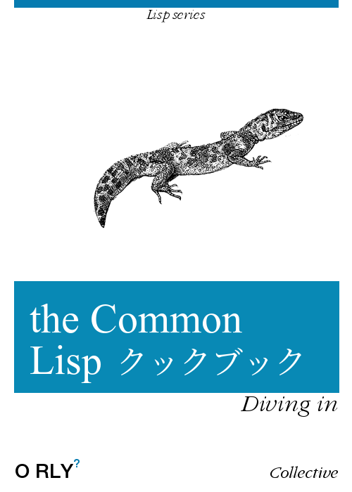

> Cookbook, 名詞.
> 料理の作り方や調理に関するその他の情報を含む本。

Cookbook は、理論的な背景をすべて説明するのではなく、さまざまなことを明快な形で行う方法を示す、非常に価値のある資料です。単に調べたいだけのこともあります。Cookbook は HyperSpec のような正式なドキュメントや Practical Common Lisp のような書籍を決して置き換えるものではありませんが、どの言語にもよい cookbook があるべきです。Common Lisp も例外ではありません。

CL Cookbook は、初心者からより高度な開発者までを対象に、あらゆる種類のトピックを扱うことを目指しています。

# 内容

### はじめに

* [ライセンス](license.html)
* [はじめに](getting-started.html)
  * Common Lisp 実装をインストールする方法
  * Lisp REPL を起動する方法
  * Quicklisp でサードパーティライブラリをインストールする方法
  * プロジェクトで作業する方法
* [エディタ対応](editor-support.html)
  * [Emacs を IDE として使う](emacs-ide.html)
  * [LispWorks IDE](lispworks.html)
  * [Alive で VSCode を使う](vscode-alive.html)

### 言語の基礎

* [変数](variables.html)
* [関数](functions.html)
* [データ構造](data-structures.html)
* [文字列](strings.html)
  + [format](strings.html#string-formatting-format)
* [正規表現](regexp.html)
* [数値](numbers.html)
* [等価性](equality.html)
* [ループ、反復、マッピング](iteration.html)
* [多次元配列](arrays.html)
* [日付と時刻](dates_and_times.html)
* [パターンマッチング](pattern_matching.html)
* [入出力](io.html)
* [ファイルとディレクトリ](files.html)
* [CLOS (Common Lisp Object System)](clos.html)

### 発展的なトピック

* [パッケージ](packages.html)
* [システムの定義](systems.html)
* [エラーとコンディションの処理](error_handling.html)
* [デバッグ](debugging.html)
* [マクロとバッククォート](macros.html)
* [型システム](type.html)
* [並行性と並列性](process.html)
* [パフォーマンスチューニング](performance.html)
* [テストと継続的インテグレーション](testing.html)
* [スクリプト。実行ファイルの構築](scripting.html)
* [ストリーム](streams.html)
<!-- epub-exclude-start -->
* [その他](misc.html)
<!-- epub-exclude-end -->

### 外の世界

* [OS との連携](os.html)
* [データベース](databases.html)
* [外部関数インターフェイス](ffi.html)
* [動的ライブラリの構築](dynamic-libraries.html)
* [GUI プログラミング](gui.html)
* [ソケット](sockets.html)
* [WebSockets](websockets.html)
* [Web 開発](web.html)
* [ウェブスクレイピング](web-scraping.html)
<!-- epub-exclude-start -->
* [Win32 API を使う](win32.html)
<!-- epub-exclude-end -->

<!-- pdf-include-start

{{PDF-TOCS}}

   pdf-include-end -->

## EPUB と PDF でダウンロード

Cookbook は EPUB 形式と PDF 形式でも利用できます。

[EPUB](https://github.com/askdkc/cl-cookbook-fork/releases/download/2026-06-23/common-lisp-cookbook-ja.epub) と [PDF](https://github.com/askdkc/cl-cookbook-fork/releases/download/2026-06-23/common-lisp-cookbook-ja.pdf) を直接ダウンロードできます。また、開発をさらに支援するために [**支払いたい金額を支払う**](https://github.com/sponsors/askdkc) こともできます。

2026 年以降、PDF は Typst で生成されており、品質が向上しています。

<!-- epub-exclude-start -->
 
<!-- epub-exclude-end -->

<a style="font-size: 16px; background-color: #4CAF50; color: white; padding: 16px; cursor: pointer;" href="https://github.com/sponsors/askdkc">
  寄付して PDF と EPUB をダウンロードする
</a>

<!-- epub-exclude-start -->
 
<!-- epub-exclude-end -->

ありがとうございます。

## 翻訳

Cookbook は次の言語に翻訳されています。

* [簡体字中国語](https://oneforalone.github.io/cl-cookbook-cn/#/) ([Github](https://github.com/oneforalone/cl-cookbook-cn))
* [ポルトガル語 (ブラジル)](https://lisp.com.br/cl-cookbook/) ([Github](https://github.com/commonlispbr/cl-cookbook))
* [日本語](https://askdkc.github.io/cl-cookbook-fork/ja/) ([Github](https://github.com/askdkc/cl-cookbook-fork))

## その他の CL リソース

* [lisp-lang.org](http://lisp-lang.org/): 成功事例、チュートリアル、スタイルガイド
* [awesome-cl](https://github.com/CodyReichert/awesome-cl): ライブラリの厳選リスト
* 🖌️ [lisp-screenshots.org](https://www.lisp-screenshots.org/): 現在動作している Common Lisp アプリケーションのギャラリー
* [Lisp コミュニティ一覧](https://github.com/CodyReichert/awesome-cl#community)
* [Lisp Koans](https://github.com/google/lisp-koans/) - 多くの言語機能を段階的に学習者に案内する、言語学習用の演習です。
* [Learn X in Y minutes - Where X = Common Lisp](https://learnxinyminutes.com/docs/common-lisp/) - 要点を扱う小さな Common Lisp チュートリアルです。
* [Common Lisp ライブラリ Read the Docs](https://common-lisp-libraries.readthedocs.io/) - よく使われるライブラリのドキュメントを、現代的で見やすい Read The Docs のスタイルに移植したものです。
* [lisp-tips](https://github.com/lisp-tips/lisp-tips/issues/)
* [Common Lisp and CLOG チュートリアルシリーズ](https://github.com/rabbibotton/clog/blob/main/LEARN.md): Common Lisp と CLOG のチュートリアルです。CLOG は web 技術に基づく Common Lisp 向け GUI 風ライブラリです。
* Nick Levine による [Lisp and Elements of Style](http://web.archive.org/web/20190316190256/https://www.nicklevine.org/declarative/lectures/)
* Pascal Costanza の [Highly Opinionated Guide to Lisp](http://www.p-cos.net/lisp/guide.html)
* [Cliki](http://www.cliki.net/): Common Lisp の wiki
* 📹 [Common Lisp programming: from novice to effective developer](https://www.udemy.com/course/common-lisp-programming/?referralCode=2F3D698BBC4326F94358): Udemy 上の動画講座 (有料) で、Cookbook の主要な貢献者の一人によるものです。*"Udemy での私の仕事を支援してくれてありがとうございます。学生であれば無料クーポンを求めてください。"* vindarel

加えて、Jeff Dalton による [Common Lisp Pitfalls](https://github.com/LispCookbook/cl-cookbook/issues/479) もあります。

書籍

* Peter Seibel による [Practical Common Lisp](http://www.gigamonkeys.com/book/)
* Edmund Weitz による [Common Lisp Recipes](http://weitz.de/cl-recipes/)。2016 年出版。
* David S. Touretzky による [Common Lisp: A Gentle Introduction to Symbolic Computation](http://www-2.cs.cmu.edu/~dst/LispBook/)
* David B. Lamkins による [Successful Lisp: How to Understand and Use Common Lisp](https://successful-lisp.blogspot.com/p/httpsdrive.html)
* Paul Graham による [On Lisp](http://www.paulgraham.com/onlisptext.html)
* Guy L. Steele による [Common Lisp the Language, 2nd Edition](http://www-2.cs.cmu.edu/Groups/AI/html/cltl/cltl2.html)
  * [PDF 形式の CLtL2](https://github.com/mmontone/cltl2-doc)
* Peter Norvig と Kent Pitman による [A Tutorial on Good Lisp Style](https://www.cs.umd.edu/%7Enau/cmsc421/norvig-lisp-style.pdf)

発展的な書籍

* Mark Watson による [Loving Lisp - the Savy Programmer's Secret Weapon](https://leanpub.com/lovinglisp/)
* [Programming Algorithms](https://leanpub.com/progalgs) - Lisp の例を使って効率的なプログラムを書くための包括的なガイドです。

仕様

* Kent M. Pitman による [The Common Lisp HyperSpec](http://www.lispworks.com/documentation/HyperSpec/Front/index.htm) ([Dash](https://kapeli.com/dash)、[Zeal](https://zealdocs.org/)、[Velocity](https://velocity.silverlakesoftware.com/) でも利用できます)
* [The Common Lisp Community Spec](https://cl-community-spec.github.io/pages/index.html) - ANSI の仕様書ドラフトから生成された新しい表示で、誰でも編集する権利があります。

## さらにひと言

これは、O'Reilly が出版した [Perl Cookbook][perl] と似たものを Common Lisp 向けに提供することを目指す共同プロジェクトです。これが何であり、何でないかについての詳細は、[comp.lang.lisp][cll] のこの [スレッド][thread] にあります。

CL Cookbook に貢献したい場合は、pull request を送るか、課題を登録してください。

そう、あなたに話しています。私たちは貢献者を必要としています。足りない章を書いて追加する、未解決の質問を見つけて答えを提供する、バグ、誤字、文法エラーを見つけて報告する、などです。整形は心配しないでください。望むならプレーンテキストを送るだけでもかまいません。その後の整形はこちらで対応します。

ご協力にあらかじめ感謝します。

Github 上のページは最新に保たれています。オフラインでの閲覧用に [最新の zip ファイル][zip] をダウンロードすることもできます。詳しい情報は [Github のプロジェクトページ][gh] にあります。

<!-- epub-exclude-start -->

    

<!-- epub-exclude-end -->

[cll]: news:comp.lang.lisp
[perl]: http://www.oreilly.com/catalog/cookbook/
[thread]: http://groups.google.com/groups?threadm=m3it9soz3m.fsf%40bird.agharta.de
[toc]: http://www.oreilly.com/catalog/cookbook/
[zip]: https://github.com/LispCookbook/cl-cookbook/archive/master.zip
[gh]: https://github.com/LispCookbook/cl-cookbook
